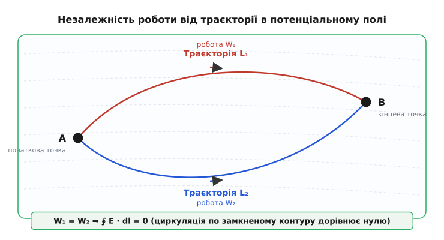
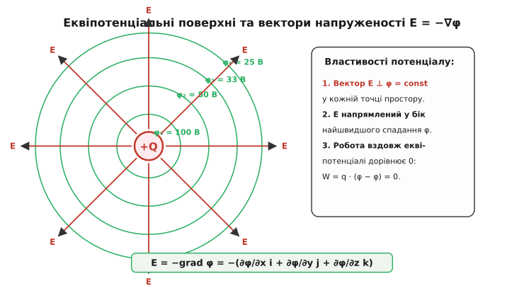
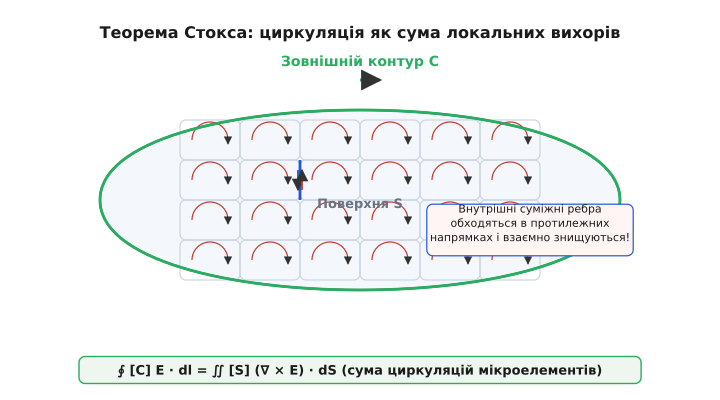
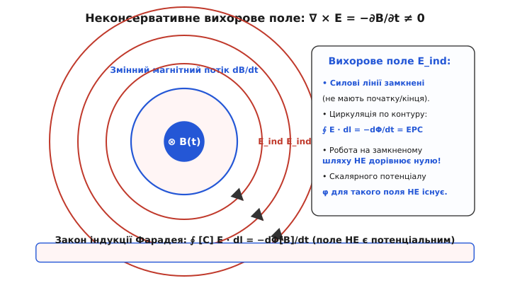
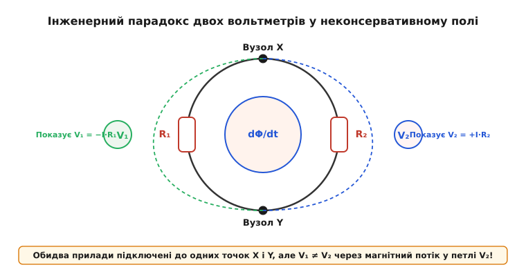

# Потенціальне поле й циркуляція

<preknowlist>
- [Закон Кулона та векторна напруженість електричного поля](topic:ph-electromagnetism/coulomb-law)
- [Скалярний та векторний добутки векторів у тривимірному просторі](topic:math/vector-algebra/vector-products)
- [Криволінійний інтеграл першого та другого роду](topic:math/calculus/line-integrals)
- [Часткові похідні та оператор Набла у декартових координатах](topic:math/calculus/nabla-operator)
</preknowlist>

При переміщенні електричного заряду величиною `1` кулон між двома точками у просторі навколо нерухомого заряду `Q = 10⁻⁶` Кл електростатична сила виконує роботу `8.99 × 10⁻³` Дж незалежно від того, чи рухалася частка по найкоротшій прямій, чи по складній спіральній траєкторії довжиною у сотні метрів. Якби ця робота залежала від обраного шляху обчислення, виникла б фундаментальна проблема: для однієї й тієї самої точки простору неможливо було б однозначно ввести потенціальну енергію `U(r)` або скалярний потенціал `φ(r)`, адже запасена енергія змінювалася б залежно від «історії» руху частинки. Обчислення взаємодій вимагало б складного інтегрування вздовж кожного геометричного маршруту замість простого віднімання значень у двох точках `W_[A->B] = q(φ_A − φ_B)`, а на замкненому контурі робота могла б бути відмінною від нуля, що порушувало б збереження енергії у статичній системі.

Щоб усунути цю невизначеність і забезпечити однозначний зв'язок між положенням у просторі та енергією, у фізиці виникла потреба в понятті **консервативного (потенціального) поля** — поля, у якому робота вздовж будь-якої замкненої траєкторії тотожно дорівнює нулю, а робота між точками залежить лише від їхніх початкових і кінцевих координат.

## 1. Робота сил поля та феномен незалежності від шляху

Електростатична сила `F = q E`, яка діє на точковий заряд `q` у силовому полі з напруженістю `E(r)`, виконує елементарну роботу `dW = F · dr` при переміщенні частки на вектор `dr`. Повна робота при переміщенні заряду з початкової точки `A` у кінцеву точку `B` уздовж криволінійної траєкторії `C` дорівнює криволінійному інтегралу другого роду:

```
W_[A->B] = ∫ [C] F · dr = q ∫ [C] E · dr
```

Розглянемо кулонівське поле точкового заряду `Q`, розташованого у початку координат. Вектор напруженості у довільній точці `r` визначається як:

```
E(r) = (Q / (4π ε₀ r²)) · e_r = (Q / (4π ε₀ r³)) · r
```

Розкладемо елементарне переміщення `dr` у сферичній системі координат `(r, θ, ϕ)` на ортогональні компоненти: `dr = dr e_r + r dθ e_θ + r sin θ dϕ e_ϕ`. Скалярний добуток вектора напруженості поля `E` на вектор переміщення `dr` залежить виключно від зміни радіальної координати `dr`:

```
E · dr = (Q / (4π ε₀ r²)) e_r · (dr e_r + r dθ e_θ + r sin θ dϕ e_ϕ) = (Q / (4π ε₀ r²)) dr
```

Компоненти переміщення, перпендикулярні до радіального напрямку (зсуви по кутах `dθ` та `dϕ`), не дають жодного внеску у скалярний добуток, оскільки кулонівська сила є суворо центральною. Обчислимо інтеграл роботи вздовж довільного криволінійного шляху між точкою `A` з радіусом-вектором `r_A` та точкою `B` з радіусом-вектором `r_B`:

```
W_[A->B] = q ∫ [r_A -> r_B] (Q / (4π ε₀ r²)) dr = (q Q / (4π ε₀)) [ 1/r_A − 1/r_B ]
```

Отриманий математичний результат демонструє фундаментальну властивість електростатики: значення інтеграла роботи повністю визначається лише початковою відстанню `r_A` та кінцевою відстанню `r_B`. Геометрична форма траєкторії між цими точками, її кривина, наявність петель або просторових зигзагів не чинять жодного впливу на величину роботи.

### Узагальнення на довільну систему зарядів (Принцип суперпозиції)

Завдяки лінійності рівнянь електростатики напруженість поля системи з `N` точкових зарядів `Q_i` дорівнює векторній сумі полів окремих зарядів:

```
E(r) = ∑ [i=1->N] E_i(r) = ∑ [i=1->N] (Q_i / (4π ε₀ |r − r_i|³)) (r − r_i)
```

Обчислимо роботу переміщення заряду `q` у такому складному полі:

```
W_[A->B] = q ∫ [A->B] E · dr = ∑ [i=1->N] q ∫ [A->B] E_i · dr = ∑ [i=1->N] (q Q_i / (4π ε₀)) [ 1/|r_A − r_i| − 1/|r_B − r_i| ]
```

Оскільки сума скінченної кількості незалежних від шляху інтегралів також не залежить від шляху, поле будь-якої конфігурації статичних зарядів є строго консервативним.


*Рис. 1 — Переміщення заряду між точками A і B двома різними шляхами C₁ та C₂ у потенціальному полі. Сумарна робота по замкненому контуру C₁ − C₂ дорівнює нулю.*

Застосуємо цю властивість до замкненого контуру `C`, який починається і закінчується у тій самій точці `A` (`r_B = r_A`). Робота електростатичних сил на замкненій траєкторії дорівнює нулю:

```
∮ [C] E · dr = 0
```

Векторні поля, криволінійний інтеграл від яких по будь-якому замкненому контуру дорівнює нулю, називаються **консервативними** або **потенціальними**. Фізична причина консервативності тісно пов'язана із законом збереження енергії. Якби існував замкнений контур, на якому циркуляція `∮ E · dr ≠ 0`, то при багаторазовому проходженні частки по цьому контуру електричне поле виконувало б додатну роботу, нескінченно збільшуючи кінетичну енергію частки без будь-яких зовнішніх витрат, що відповідало б створенню вічного двигуна першого роду (perpetual motion machine).

Детальний історичний шлях від перших здогадок Лагранжа й Лапласа до суворого математичного формулювання принципу консервативності полів Гауссом та Стоксом висвітлено в [історичному нарисі](topic:ph-electromagnetism/conservative-field/hist-potential-field.md).

## 2. Скалярний потенціал та еквіпотенціальні поверхні

Незалежність роботи від форми шляху дозволяє однозначно ввести скалярну функцію стану системи — **скалярний електростатичний потенціал** `φ(r)`. Визначимо потенціал у довільній точці `r` як роботу сил поля з переміщення одиничного позитивного заряду з цієї точки у фіксовану опорну точку `r_ref` (яку зазвичай вибирають на нескінченності, де `φ(∞) = 0`):

```
φ(r) = ∫ [r -> r_ref] E · dr
```

Для об'ємно розподіленого заряду з густиною `ρ(r')` скалярний потенціал обчислюється тривимірним інтегралом:

```
φ(r) = (1 / (4π ε₀)) ∭ [V] ( ρ(r') / |r − r'| ) dV'
```

Завдяки потенціальності поля значення `φ(r)` залежить виключно від координат точки `r` і не залежить від того, за якою траєкторією проводилося обчислення інтеграла. Різниця потенціалів (електрична напруга) між двома довільними точками `A` та `B` виражається як:

```
U_AB = φ(A) − φ(B) = ∫ [A -> B] E · dr
```

Розглянемо нескінченно мале переміщення `dr` від точки `r` до точки `r + dr`. Зміна скалярного потенціалу `dφ = φ(r + dr) − φ(r)` за визначенням дорівнює:

```
dφ = − E · dr
```

З іншого боку, з математичного аналізу диференціал скалярної функції трьох змінних `φ(x, y, z)` виражається через скалярний добуток її градієнта на вектор переміщення:

```
dφ = (∂φ/∂x) dx + (∂φ/∂y) dy + (∂φ/∂z) dz = ∇φ · dr
```

Порівнюючи два вирази для `dφ`, які мусять збігатися для довільного вектора переміщення `dr`, отримуємо фундаментальне диференціальне співвідношення між напруженістю та скалярним потенціалом:

```
E = − ∇φ = − ( (∂φ/∂x) i + (∂φ/∂y) j + (∂φ/∂z) k )
```

Знак мінус у цій формулі має глибокий фізичний зміст: вектор напруженості електричного поля `E` завжди спрямований у бік найстрімкішого спадання скалярного потенціалу `φ`.

### Крайові задачі теорії потенціалу та теореми єдиності (Діріхле й Нейман)

Для розрахунку скалярного потенціалу у замкненому об'ємі `V` з межею `S` розв'язують рівняння Пуассона `∇²φ = −ρ / ε₀`. Сформулюємо дві основні крайові задачі:
1. **Задача Діріхле**: Знайти потенціал `φ(r)` усередині об'єму `V`, якщо на межі `S` задано скалярну функцію `φ|_S = f(r)`.
2. **Задача Неймана**: Знайти потенціал `φ(r)` усередині об'єму `V`, якщо на межі `S` задано нормальну похідну `(∂φ/∂n)|_S = g(r)` (нормальну компоненту поля `E_n`).

Доведемо єдиність розв'язку задачі Діріхле. Припустимо протилежне: існують два різних розв'язки `φ₁` та `φ₂`. Їхня різниця `u = φ₁ − φ₂` задовольняє однорідне рівняння Лапласа `∇²u = 0` усередині `V` та однорідну граничну умову `u|_S = 0` на межі.
Застосуємо першу формулу Гріна до функції `u`:

```
∭ [V] |∇u|² dV + ∭ [V] u ∇²u dV = ∬ [S] u (∂u/∂n) dS
```

Оскільки `∇²u = 0` та `u|_S = 0`, обидва праві інтеграли дорівнюють нулю:

```
∭ [V] |∇u|² dV = 0
```

Оскільки підінтегральний вираз `|∇u|² = |∇φ₁ − ∇φ₂|² ≥ 0` є неотрицательним, рівність інтеграла нулю можлива лише тоді, коли `∇u ≡ 0` у всіх точках об'єму. Звідси `∇φ₁ ≡ ∇φ₂`, що означає сувору тотожність векторних полів `E₁ ≡ E₂`. Це доводить єдиність потенціального поля у будь-якій системі із заданими граничними потенціалами або зарядами.

### Скалярний потенціал у релятивістській електродинаміці

У спеціальній теорії відносності скалярний потенціал `φ` та векторний потенціал `A` об'єднуються у єдиний чотирипотенціал `A^μ = (φ/c, A_x, A_y, A_z)`. При переході від нерухомої системи відліку `K` до системи `K'`, яка рухається зі швидкістю `v` вздовж осі `x`, потенціал перетворюється за формулами Лоренца:

```
φ' = γ ( φ − v A_x )
A'_x = γ ( A_x − (v / c²) φ )
```

Де `γ = 1 / √(1 − v²/c²)`. Це означає, що розділення електричного поля на потенціальну та вихорову компоненти залежить від вибору системи відліку спостерігача.

### Ємність та система потенціальних коефіцієнтів Максвелла

Для системи з `N` металевих провідників у діелектрику зв'язок між потенціалами `φ_i` та зарядами `q_i` є лінійним:

```
φ_i = ∑ [j=1->N] s_ij q_j
```

Де `s_ij` — потенціальні коефіцієнти Максвелла. Обернена система виражає заряди через потенціали:

```
q_i = ∑ [j=1->N] c_ij φ_j
```

Коефіцієнти `c_ii > 0` називаються власною ємністю провідників, а `c_ij < 0` (`i ≠ j`) — взаємними коефіцієнтами індукції. З симетрії першої формули Гріна випливає теорема взаємності: `s_ij = s_ji` та `c_ij = c_ji`.

### Мультипольний розклад потенціалу на великих відстанях

На великих відстанях від системи зарядів `R >> r'` скалярний потенціал розкладають у ряд за степенями `1/R`:

```
φ(r) = (1 / (4π ε₀)) [ q / R + (p · n) / R² + (1 / (2 R³)) ∑ [i,j] Q_ij n_i n_j + ... ]
```

Де:
- `q = ∭ ρ dV` — повний електричний заряд системи (монопольний член, спадає як `1/R`).
- `p = ∭ r' ρ(r') dV'` — дипольний момент системи (спадає як `1/R²`).
- `Q_ij = ∭ (3 x'_i x'_j − (r')² δ_ij) ρ(r') dV'` — квадрупольний момент (спадає як `1/R³`).

Цей розклад дозволяє класифікувати потенціальні поля молекул та атомних ядер.

### Властивості еквіпотенціальних поверхонь та металевих провідників

Геометричним образом скалярного поля потенціалу є **еквіпотенціальні поверхні** — множини точок простору, у яких скалярний потенціал набуває однакового постійного значення: `φ(x, y, z) = C = const`.


*Рис. 2 — Еквіпотенціальні поверхні φ₁, φ₂, φ₃ та ортогональні до них силові лінії потенціального поля E = −∇φ.*

Розглянемо вектор елементарного переміщення `dr_surf`, який лежить на еквіпотенціальній поверхні. Оскільки потенціал у всіх точках цієї поверхні однаковісінький, зміна потенціалу вздовж поверхні дорівнює нулю: `dφ = 0`. Звідси випливає:

```
E · dr_surf = − dφ = 0
```

Оскільки скалярний добуток non-zero векторів дорівнює нулю тільки тоді, коли вони перпендикулярні, вектор напруженості потенціального електричного поля `E` у кожній точці простору **строго перпендикулярний (ортогональний)** до еквіпотенціальної поверхні, що проходить через цю точку.

Опишемо ключові властивості еквіпотенціальних поверхонь:
1. **Неперетинність**: Дві еквіпотенціальні поверхні з різними значеннями потенціалів `C₁ ≠ C₂` ніколи не перетинаються, оскільки в точці перетину вектор градієнта `∇φ` мав би два різних напрямки одночасно.
2. **Густина поверхонь**: У областях із високою напруженістю поля (великим градієнтом `|∇φ|`) еквіпотенціальні поверхні розташовані ближче одна до одної.
3. **Еквіпотенціальність провідників**: У стаціонарному електростатичному режимі поле всередині провідника `E_int = 0`. Отже, весь об'єм провідника та його зовнішня поверхня є єдиним еквіпотенціальним тілом (`φ = const`). Вектор поля `E` біля поверхні провідника завжди спрямований строго по нормалі до поверхні.

### Крайовий ефект та профіль електродів Роговського

Біля гострих країв прямокутних пластин конденсатора спостерігається крайовий ефект концентрації силових ліній поля, де напруженість `|∇φ| → ∞` теоретично прямує до безкінечності (крайова особливість). Для усунення небезпеки електричного пробою у високовольтних випробувальних камерах краї електродів виконують за спеціальним **профілем Роговського**, рівномірне закруглення якого описується аналітичною силовою функцією `x = u + e^u cos v`, що гарантує монотонний спад поля без локальних сплесків.

### Метод дзеркальних зображень у потенціальних полях

Розглянемо точковий заряд `q`, розташований на відстані `d` від безкінечної заземленої провідної площини `z = 0` (`φ(z=0) = 0`). Оскільки поверхня металу є еквіпотенціальною, складну крайову задачу для півпростору `z > 0` можна розв'язати методом дзеркальних зображень, замінивши провідник фіктивним дзеркальним зарядом `−q`, розташованим у точці `(0, 0, −d)`.

Скалярний потенціал у верхній півплощині `z > 0` виражається сумою двох кулонівських потенціалів:

```
φ(x, y, z) = (q / (4π ε₀)) [ 1 / √(x² + y² + (z − d)²) − 1 / √(x² + y² + (z + d)²) ]
```

Підставляючи `z = 0`, переконуємося, що `φ(x, y, 0) ≡ 0`. Нормальна компонента напруженості поля біля поверхні металу дорівнює:

```
E_z(x, y, 0) = − (∂φ/∂z)|_{z=0} = − (q d) / (2π ε₀ (x² + y² + d²)^(3/2))
```

За теоремою Гаусса індукована поверхнева густина заряду на металі дорівнює `σ(x, y) = ε₀ E_z(x, y, 0) = − (q d) / (2π (x² + y² + d²)^(3/2))`. Повний індукований заряд на площині при інтегруванні по всій площині дає точне значення `Q_ind = −q`.

### Метод комплексного потенціалу для двовимірних полів

Для двовимірних полів без зарядів (`∂²φ/∂x² + ∂²φ/∂y² = 0`) застосовують метод функцій комплексної змінної `z = x + i y`. Скалярний потенціал `φ(x, y)` та силова функція `ψ(x, y)` задовольняють умови Коші-Рімана і об'єднуються у комплексному потенціалі:

```
W(z) = φ(x, y) + i ψ(x, y)
```

Комплексна напруженість поля дорівнює `dW/dz = − E_x + i E_y`. Конформне відображення `w = f(z)` дозволяє трансформувати складні межі (наприклад, краї кутових екранів) у прості площини, розв'язуючи крайові задачі аналітично.

### Електростатичний тиск на поверхню провідника

Оскільки електричні заряди на поверхні металевого провідника перебувають у власному потенціальному полі, на кожну одиницю площі поверхні діє розтягуюча електростатична сила — **електростатичний тиск**:

```
P_el = (1/2) σ E_surface = (1/2) ε₀ |E_surface|² = (1/2) ε₀ |∇φ|²
```

Цей тиск завжди спрямований назовні провідника незалежно від знаку заряду і намагається розірвати провідник або збільшити його об'єм.

### Граничні умови та заломлення силових ліній на межі діелектриків

На межі поділу двох діелектриків із проникностями `ε₁` та `ε₂` векторні компоненти задовольняють граничні умови:

```
E_{1t} = E_{2t}              [неперервність тангенціальної компоненти напруженості]
D_{1n} − D_{2n} = σ          [стрибок нормальної компоненти індукції на поверхневому заряді]
```

З неперервності `E_t` та `D_n` (при `σ = 0`) випливає закон заломлення ліній напруженості електростатичного поля:

```
tan θ₁ / tan θ₂ = ε₁ / ε₂
```

Де `θ₁` та `θ₂` — кути між векторами полів та нормальною до межі поділу. При переході силових ліній із середовища з більшою діелектричною проникністю у середовище з меншою проникною лінія відхиляється ближче до нормалі.

> 🔧 **Навіщо це.**
> У практичній електротехніці, високочастотній електронній інженерії та розробці напівпровідникових мікросхем скалярний потенціал є головним розрахунковим інструментом. Він дозволяє замінити складну систему з трьох векторних диференціальних рівнянь для компонент `(E_x, E_y, E_z)` одним скалярним рівнянням Пуассона `∇²φ = −ρ / ε₀`. Еквіпотенціальні поверхні задають формальну геометрію провідних екранів та обкладок конденсаторів: у стаціонарному стані поверхня будь-якого металевого провідника є еквіпотенціальною, що унеможливлює наявність тангенціальних струмів витоку вздовж поверхні.

## 3. Циркуляція, теорема Стокса та безвихоровість поля

Для аналізу локальних обертальних властивостей векторних полів у кожній точці простору використовують концепцію **циркуляції** та **ротора**. Циркуляцією векторного поля `E` вздовж замкненого орієнтованого контуру `C` називають криволінійний інтеграл:

```
Γ = ∮ [C] E · dr
```

Наочною фізичною аналогією циркуляції та ротора є маленьке вимірювальне «веслове колесо» (млинок чи роторний флюгер), розміщене у потоці рідини чи векторному полі. Якщо ротор поля у даній точці відмінний від нуля (`∇ × E ≠ 0`), на лопаті колеса діє ненульовий обертальний момент, і воно починає крутитися. У потенціальному полі сила з одного боку колеса точно врівноважується силою з протилежного боку, і колесо залишається нерухомим.

### Суворе розгортання теореми Стокса

Для переходу від інтегральної характеристики на макроскопічному контурі `C` до локальної диференціальної характеристики у конкретній точці застосовують теорему Стокса. Розглянемо довільну гладку орієнтовану поверхню `S`, межею якої є замкнений контур `C`. Розіб'ємо поверхню `S` на велику кількість `M` дрібних осередків (мікрокомірок) `ΔS_i` з контурами `ΔC_i`.


*Рис. 3 — Розклад макроскопічного контуру C на суму мікроскопічних комірок ΔS_i. Внутрішні суміжні ребра взаємно згашуються при підсумовуванні.*

Обчислимо циркуляцію поля по контуру окремого осередку `ΔS_i`. У декартових координатах для прямокутної комірки розміром `Δx × Δy`:

```
∮ [ΔC_i] E · dr = E_x(y) Δx + E_y(x + Δx) Δy − E_x(y + Δy) Δx − E_y(x) Δy
```

Розкладемо компоненти поля у ряд Тейлора по кроках `Δx` та `Δy`:

```
E_y(x + Δx) ≈ E_y(x) + (∂E_y/∂x) Δx
E_x(y + Δy) ≈ E_x(y) + (∂E_x/∂y) Δy
```

Підставляючи ці розклади, отримуємо вираз для мікроциркуляції через різницю часткових похідних:

```
∮ [ΔC_i] E · dr ≈ ( ∂E_y/∂x − ∂E_x/∂y ) Δx Δy = (∇ × E)_z ΔS_i
```

У границі `ΔS_i → 0` векторний добуток `(∇ × E) · n_i ΔS_i` точно виражає потік ротора через осередковий елемент поверхні.

Пропідсумуємо циркуляції по всіх `M` комірках поверхні. Для будь-якого внутрішнього ребра, спільного для двох сусідніх комірок, інтегрування проводиться двічі у протилежних напрямках. Сума цих двох інтегралів тотожно дорівнює нулю. Ненекомпенсованими залишаються тільки внески від зовнішніх ребер комірок, які у сукупності утворюють вихідний контур `C`:

```
∮ [C] E · dr = ∑ [i=1->M] ∮ [ΔC_i] E · dr = ∬ [S] (∇ × E) · dS
```

Це рівняння є інтегральною **теоремою Стокса**.

Для потенціального електричного поля циркуляція по будь-якому замкненому контуру дорівнює нулю `∮ [C] E · dr = 0`. Підставляючи цей факт у теорему Стокса, отримуємо:

```
∬ [S] (∇ × E) · dS = 0
```

Оскільки ця рівність має виконуватися для абсолютно довільної поверхні `S`, підінтегральний вираз у кожній точці простору тотожно дорівнює нулю:

```
∇ × E = rot E = 0
```

Отримане співвідношення є диференціальним критерієм консервативності: **потенціальне електричне поле є безвихоровим**. З математичного аналізу відомо, що операція ротора від градієнта будь-якої подвійно диффереційовної скалярної функції `φ(x, y, z)` тотожно дорівнює нулю завдяки рівності мішаних похідних (теорема Шварца):

```
(∇ × (∇φ))_z = ∂/∂x (∂φ/∂y) − ∂/∂y (∂φ/∂x) = ∂²φ / (∂x ∂y) − ∂²φ / (∂y ∂x) ≡ 0
```

Отже, рівність нулю ротора `∇ × E = 0` є необхідною і достатньою умовою існування скалярного потенціалу `φ`. Суворі математичні доведення всіх чотирьох еквівалентних критеріїв консервативності систематизовано у [математичному виведенні](topic:ph-electromagnetism/conservative-field/math-curl-circulation.md).

### Об'ємна густина енергії потенціального поля

Обчислимо повну потенціальну енергію електростатичного поля. Енергія системи зарядів `ρ(r)` з потенціалом `φ(r)` виражається інтегралом:

```
W_el = (1/2) ∭ [V] ρ φ dV
```

Підставляючи рівняння Пуассона `ρ = ε₀ ∇ · E` та перетворюючи підінтегральний вираз за формулою дивергенції добутку `∇ · (φ E) = φ (∇ · E) + E · (∇φ)`:

```
W_el = (ε₀ / 2) ∭ [V] ∇ · (φ E) dV − (ε₀ / 2) ∭ [V] E · (∇φ) dV
```

Перший інтеграл за теоремою Гаусса перетворюється на поверхневий інтеграл `∬ [S] φ E · dS`, який при розширенні поверхні на нескінченність прямує до нуля як `O(1/R)`. Підставляючи `∇φ = −E` у другий інтеграл, отримуємо:

```
W_el = (ε₀ / 2) ∭ [V] |E|² dV = ∭ [V] w_el dV
```

Де `w_el = (1/2) ε₀ |E|² = (1/2) ε₀ |∇φ|²` — об'ємна густина енергії потенціального електричного поля.

## 4. Вихорові електричні поля: Межа консервативності

Потенціальність електростатичного поля є наслідком стаціонарності джерел полів — електричних зарядів. Якщо магнітне поле змінується з часом (`∂B/∂t ≠ 0`), закон електромагнітної індукції Фарадея стверджує, що у просторі виникає індуковане вихорове електричне поле `E_ind`, ротор якого не дорівнює нулю:

```
∇ × E_ind = − ∂B/∂t
```

Застосовуючи теорему Стокса до закону Фарадея, отримуємо вираз для циркуляції вихорового електричного поля по замкненому контуру `C`:

```
∮ [C] E_ind · dr = ∬ [S] (∇ × E_ind) · dS = − d/dt ∬ [S] B · dS = − dΦ_B / dt
```

Де `Φ_B` — потік магнітної індукції через поверхню `S`, натягнуту на контур `C`.


*Рис. 4 — Вихорове електричне поле E_ind з замкненими силовими лініями, індуковане змінним магнітним потоком dΦ_B/dt. Циркуляція поля по контуру не дорівнює нулю.*

### Порівняльний аналіз потенціального та вихорового полів

Для чіткого розуміння меж застосовності концепції потенціалу наведено порівняльну таблицю двох типів електричних полів:

| Характеристика | Консервативне (Електростатичне) поле | Вихорове (Індуковане) поле |
| :--- | :--- | :--- |
| **Джерела поля** | Електричні заряди `ρ` (монополі) | Змінні магнітні поля `−∂B/∂t` |
| **Ротор поля** | `∇ × E = 0` (суворо безвихорове) | `∇ × E = −∂B/∂t ≠ 0` (вихорове) |
| **Циркуляція по контуру** | `∮ E · dr = 0` (завжди) | `∮ E · dr = −dΦ_B/dt ≠ 0` |
| **Силові лінії** | Починаються на `+q`, закінчуються на `−q` | Замкнені безперервні кільця |
| **Скалярний потенціал** | Існує однозначна функція `φ(r)` | Скалярний потенціал відсутній |
| **Закон збереження енергії** | Робота замкненого циклу `W = 0` | Робота за цикл `W = q E_emf ≠ 0` |

Яскравим технічним застосуванням вихорового електричного поля є **бетатрон** — прискорювач електронів, у якому змінне магнітне поле `B(t)` утилізується подвійно: воно одночасно утримує електрони на рівноважній коловій орбіті та прискорює їх індукованим неконсервативним електричним полем `E_ind`, вихрові лінії якого збігаються з орбітою пучка.

У загальному випадку змінного електромагнітного поля повна напруженість електричного поля за теоремою Гельмгольца розкладається на дві компоненти — потенціальну скалярну та вихорову векторну:

```
E = − ∇φ − ∂A/∂t
```

Де `A` — векторний потенціал магнітного поля, пов'язаний з магнітною індукцією співвідношенням `B = ∇ × A`.

### Динаміка заряду у Гамільтоновому формалізмі

У потенціальному полі Гамільтоніан частки має вигляд `H = p² / (2m) + q φ(r)`. У загальному вихоровому полі узагальнений імпульс частки дорівнює `P = p + q A(r)`, а Гамільтоніан набуває вигляду:

```
H = (1 / (2m)) |P − q A(r)|² + q φ(r)
```

Калібрувальна інваріантність потенціалів `φ' = φ − ∂χ/∂t` та `A' = A + ∇χ` зберігає рівняння руху частинки незмінними.

## 5. Парадокс двох вольтметрів у неконсервативному полі

Існування неконсервативних вихорових полів спричиняє ефекти у вимірювальних електричних колах, які здаються парадоксальними з точки зору класичної теорії кіл (законів Кірхгофа).

Розглянемо замкнене коло, що складається з двох послідовно з'єднаних резисторів `R₁ = 100` Ом та `R₂ = 200` Ом, яке охоплює область зі змінним магнітним потоком `dΦ_B/dt = 3` В. За законом Фарадея у колі виникає ЕРС індукції `E_emf = 3` В та індукційний струм `I = E_emf / (R₁ + R₂) = 3 / 300 = 0.01` А (10 мА).

Підключаємо два однакові ідеальні вольтметри `V₁` та `V₂` до тих самих двох вузлів кола `A` та `B`, але розташовуємо їх вимірювальні провідники з різних боків від області магнітного потоку.


*Рис. 5 — Схема парадоксу двох вольтметрів. Два прилади, підключені до тотожних вузлів A і B, показують різні значення U₁ = +1 В та U₂ = −2 В через ненульову циркуляцію поля у вимірювальному контурі.*

### Математичний розрахунок показів приладів

Застосуємо закон Фарадея для замкненого контуру `L`, утвореного першим вольтметром `V₁` та резистором `R₁`. Оскільки цей лівий контур не охоплює змінний магнітний потік (`dΦ_L / dt = 0`):

```
∮ [L] E · dr = U_V1 − I R₁ = 0   ==>   U_V1 = I R₁ = 0.01 A · 100 Ohm = + 1.0 V
```

Застосуємо закон Фарадея для замкненого контуру `R`, утвореного другим вольтметром `V₂` та резистором `R₂`. Правий контур охоплює весь змінний магнітний потік `dΦ_B / dt = 3` В:

```
∮ [R] E · dr = U_V2 + I R₂ = − dΦ_B / dt = − 3.0 V   ==>   U_V2 = − 3.0 V + 0.01 A · 200 Ohm = − 1.0 V − 1.0 V = − 2.0 V
```

Два вольтметри, вимірювальні щупи яких приєднані до **абсолютно однаковісіньких вузлів** `A` і `B`, одночасно показують різні напруги (`+1.0` В та `−2.0` В).

Фізичне пояснення цього ефекту полягає у тому, що у вихоровому полі напруга між двома точками не є функцією координат цих точок, а залежить від траєкторії вимірювального провідника вольтметра у просторі. Другий закон Кірхгофа `∑ U_k = 0` виявляється незастосовним, оскільки циркуляція поля у замкненому контурі `V₁ − A − V₂ − B` не дорівнює нулю через охоплення змінного магнітного поля `∂B/∂t`.

### Застосування у проектуванні високошвидкісних друкованих плат (Signal Integrity)

Цей фізичний ефект є критичним для інженерів розробників сучасних цифрових плат. На високих частотах (ГГц) змінні магнітні поля навколо швидкісних ліній зв'язку наводять вихрові ЕРС у сусідніх вимірювальних та сигнальних провідниках. Якщо вимірювальна петля провідника осцилографа охоплює потік завад, прилад покаже хибне значення напруги. Для мінімізації вихорових завад застосовують:
1. Трасування диференціальних пар із мінімальною площею контуру `S`.
2. Суцільні заземлені шари (Ground Planes) для замикання зворотної ЕРС індукції.

## 6. Топологічні аспекти консервативності та неоднозв'язні області

Рівність нулю ротора `∇ × E = 0` гарантує нульову циркуляцію по будь-якому контуру `∮ E · dr = 0` тільки за умови, що область `D`, у якій визначено поле, є **однозв'язною** (тобто будь-який замкнений контур всередині області можна безперервно стягнути у точку, не виходячи за межі області).

Якщо область `D` є неоднозв'язною (наприклад, простір за межами нескінченно довгого соленоїда або струмового провідника), умова `∇ × E = 0` у всіх точках доступної області **не гарантує** потенціальності поля для контурів, які охоплюють "дірку" (область локалізації магнітного потоку чи струму).

### Приклад векторного потенціалу соленоїда та ефект Ааронова-Бома

Розглянемо векторний потенціал `A` навколо довгого соленоїда радіуса `a` із магнітним потоком `Φ_B`. Поза соленоїдом (`r > a`) магнітна індукція `B = ∇ × A = 0`, що означає `rot A = 0`. Проте циркуляція векторного потенціалу по контуру `C`, який охоплює соленоідальний простір, не дорівнює нулю:

```
∮ [C] A · dr = ∬ [S] (∇ × A) · dS = ∬ [S] B · dS = Φ_B ≠ 0
```

У сферах квантової механіки цей факт призводить до **ефекту Ааронова-Бома**: заряжена частка (електрон), що рухається у зоні з нульовим магнітним полем `B = 0`, зазнає фізичного зсуву фази хвильової функції `Δϕ = (q/ħ) ∮ A · dr = (q/ħ) Φ_B`, оскільки векторний потенціал `A` виявляється неконсервативним через неоднозв'язну топологію простору.

Мовою диференціальної геометрії це означає, що диференціальна 1-форма поля є замкненою (`dα = 0`), але не є точною (`α ≠ dφ`). Група когомологій де Рама `H¹(D)` для неоднозв'язної області є ненульовою.

### Порівняння електростатичного, гравітаційного та магнітного полів

Всі фундаментальні центральні поля у фізиці володіють властивістю консервативності:

```
Гравітаційне поле Ньютона:  F_g = − G (M m / r²) e_r  ==>  g = − ∇φ_g,  де  φ_g(r) = − G M / r
Електростатичне поле:        F_e = (1 / (4π ε₀)) (q Q / r²) e_r  ==>  E = − ∇φ,  де  φ(r) = q / (4π ε₀ r)
```

В обох випадках потенціальність поля спирається на закони зворотних квадратів `1/r²` та центральну симетрію сил.

## 7. Практичні застосування та чисельні розрахунки

При обчисливальному моделюванні електростатичних систем у промислових САПР (ANSYS Maxwell, COMSOL Multiphysics, CST Studio) чисельне обчислення циркуляції поля по комірках сітки слугує базовим критерієм перевірки збіжності та відсутності паразитного чисельного вихороутворення.

### 1. Проектування високовольтної ізоляції

При розробці високовольтних вимикачів, трансформаторів та каблових муфт головним завданням інженера є запобігання пробою повітря чи діелектрика. Для цього обчисливають скалярне поле потенціалу `φ(x, y, z)`, будують градієнт `E = −∇φ` і знаходять точки з пиковим значенням напруженості `|E_max|`. Якщо `|E_max|` перевищує електричну міцність повітря (`3 × 10⁶` В/м), форму поверхонь провідників оптимізують за допомогою закруглень для згладжування еквіпотенціальних поверхонь.

### 2. Захисні екрани та сітки Фарадея

Оскільки всередині замкненої металевої оболонки потенціал є константою `φ = C`, а поле `E = −∇φ = 0`, заземлений металевий корпус повністю ізолює чутливу вимірювальну електроніку від зовнішніх електростатичних завад.

### 3. Чисельні сіткові солвери у САПР (FDM, FEM та BEM)

У сіткових солверах методу скінченних різниць (FDM) скалярний потенціал обчислюється у вузлах прямокутної сітки за допомогою 5-точкового шаблону Лапласіана:

```
φ_{i, j} = (1 / 4) [ φ_{i+1, j} + φ_{i-1, j} + φ_{i, j+1} + φ_{i, j-1} + (h² ρ_{i, j} / ε₀) ]
```

У методі скінченних елементів (FEM) 3D область розбивається на тетраедричні комірки, а скалярний потенціал апроксимується базисними функціями `N_i(r)`: `φ(r) = ∑ φ_i N_i(r)`. Матриця жорсткості елемента обчислюється як інтеграл від градієнтів: `K_ij = ∭ [V_e] (∇N_i · ∇N_j) dV`.

У методі граничних елементів (BEM) тривимірну задачу Лапласа відображають на поверхневий інтеграл по межі `S` за допомогою фундаментального розв'язку Гріна `G(r, r') = 1 / (4π |r − r'|)`:

```
c(r) φ(r) = ∬ [S] [ G(r, r') (∂φ/∂n') − φ(r') (∂G/∂n') ] dS'
```

Це зменшує розмірність задачі з 3D об'єму до 2D поверхні, суттєво підвищуючи швидкість обчислення консервативних полів у відкритому просторі.

### 4. Вибір алгоритмів чисельного інтегрування траєкторій частинок

При чисельному моделюванні руху зарядженої частки у потенціальному полі `E = −∇φ` вибір методу інтегрування звичайних диференціальних рівнянь руху `m d²r/dt² = q E(r)` menentukan збереження повної енергії системи:
- **Явний метод Ейлера** (`r_{k+1} = r_k + v_k dt`): має першу точність і призводить до несправжньої чисельної дисипації або розгону частки (дрейф енергії).
- **Симплектичні інтегратори (метод Верле або Velocity Verlet)**: точно зберігають фазовий об'єм та потенціальну енергію на тривалих часових інтервалах, що є принциповим при розрахунку супутникових або електронно-оптичних систем.

### 5. Синопсисна підсумкова матриця класифікації векторних полів

Наприкінці зведемо фундаментальні класи векторних полів електродинаміки у підсумкову синопсисну матрицю, яка узагальнює їх математичні та фізичні характеристики:

| Клас векторного поля | Диференціальні умови | Скалярний / Векторний потенціали | Фізичний приклад |
| :--- | :--- | :--- | :--- |
| **Потенціальне (Консервативне)** | `∇ × E = 0`, `∇ · E ≠ 0` | `E = − ∇φ` (існує скалярний `φ`) | Електростатичне поле статичних зарядів |
| **Соленоїдальне (Вихорове безджерельне)** | `∇ × B ≠ 0`, `∇ · B = 0` | `B = ∇ × A` (існує векторний `A`) | Магнітостатичне поле постійних струмів |
| **Лапласове (Потенціальне й Соленоїдальне)** | `∇ × E = 0`, `∇ · E = 0` | `E = − ∇φ`, де `∇²φ = 0` | Електричне поле у порожнечі між зарядженими пластинами |
| **Загальне електромагнітне** | `∇ × E ≠ 0`, `∇ · E ≠ 0` | `E = − ∇φ − ∂A/∂t` | Змінне електромагнітне поле хвилі |

Завдяки цій систематизації інженер або дослідник може миттєво визначити належність досліджуваного поля до консервативного чи вихорового класу і застосувати відповідний аналітичний та чисельний інструментарій для розробки та проектування реальних фізичних пристроїв і високоефективних високочастотних систем.

Практичні алгоритми чисельного обчислення криволінійного інтеграла та дискретного ротора мовами C та C++ з аналізом похибок розібрано у [практичному проєкті](topic:ph-electromagnetism/conservative-field/proj-circulation-sim.md).

Повний технічний довідник диференціальних операторів у Декартових, циліндричних та сферичних координатах, векторографічних тотожностей та граничних умов систематизовано у [довіднику векторних операторів](topic:ph-electromagnetism/conservative-field/api-field-operators.md).
