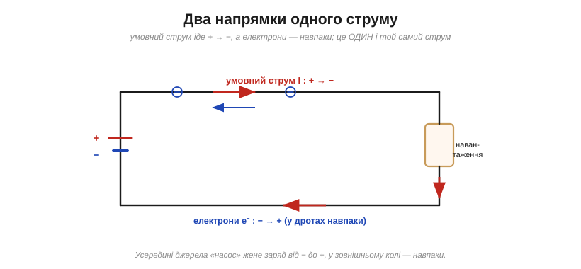
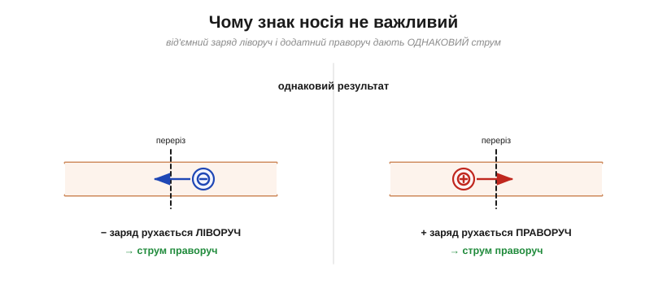
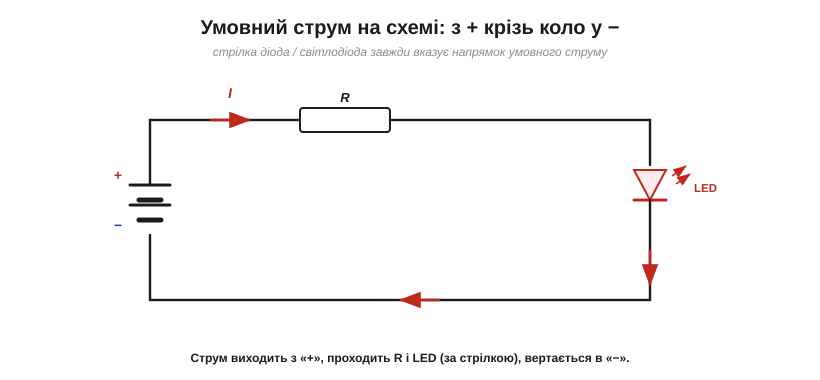
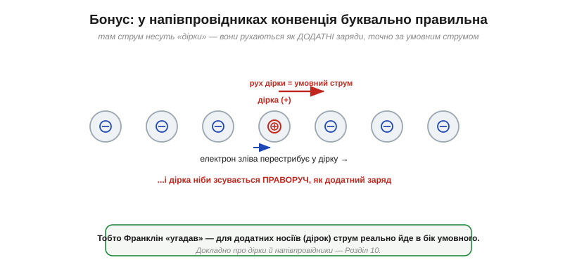

# Куди «тече» струм: умовний напрямок проти руху електронів

З описом [електричного струму](topic:ph-electromagnetism/electric-current) повʼязана дивна річ: умовний струм напрямлений від «плюса» до «мінуса», а електрони — реальні носії в металі — біжать **навпаки**, від «мінуса» до «плюса». Це здається помилкою або плутаниною — і чи не найчастіше збиває з пантелику новачка. Розберімося раз і назавжди: звідки взялося це «непорозуміння», чому воно нікому не заважає і коли все-таки важливо памʼятати, куди насправді рухаються електрони.

### Дві стрілки одного струму

Спершу чітко розкладімо обидва напрямки.

*Умовний струм (англ. conventional current, червоний) у зовнішньому колі йде від «+» до «−». Електрони (сині) рухаються протилежно — від «−» до «+». Усередині джерела «насос» жене заряд навпаки (від «−» до «+»), щоб підтримувати потік. Це не два струми, а один, описаний двома способами.*

Обидві стрілки описують ту саму фізичну подію — потік заряду колом. Просто одна стежить за **уявним додатним** зарядом (умовний струм), а друга — за **реальними електронами**. Питання лише в тому, чому стандартом став перший, «неправильний» опис.

### Звідки мішанина: здогад Франкліна

Відповідь — історична. Знаки «+» і «−» та напрямок струму запровадив **Бенджамін Франклін** близько 1750 року — за **півтора століття** до відкриття електрона (Томсон, 1897). Франклін мусив навмання обрати, який стан заряду назвати додатним, і вирішив, що струм — це потік **додатного** флюїду від «+» до «−». Шанс був 50/50 — і щодо того, що реально рухається в металі (від'ємні електрони), він **не вгадав**.

Коли через 145 років з'ясувалося, що носії від'ємні, перевчати весь світ було пізно — та й **непотрібно**. Тож домовленість Франкліна лишили; саме тому й донині умовний струм «тече» проти руху електронів. (Докладніше про цей здогад — в [історії електрики](topic:ph-electromagnetism/electric-charge/hist-electricity.md).)

### Чому це нікому не заважає

Найважливіше: ця «неправильність» **взагалі не впливає** на жоден розрахунок. Причина проста — і варта окремої картинки.

*Від'ємний заряд, що рухається ліворуч, і додатний, що рухається праворуч, дають однаковий струм. Тому байдуже, носій якого знаку насправді біжить: для величини й напрямку струму результат той самий.*

Раз від'ємний заряд, що йде в один бік, тотожний додатному, що йде в протилежний, то **уявити струм як потік додатного заряду — цілком законно**. Усі формули — [закон Ома](topic:hw-analog/ohms-law), потужність, [закони Кірхгофа](topic:hw-analog/kcl) — виходять однаковими, хоч би що ми взяли за носія. Тому міняти усталену конвенцію — означало б переписати всі підручники, схеми й даташити світу заради нуля практичної користі. Простіше памʼятати один раз: **рахуємо струм як рух додатного заряду, від «+» до «−»**.

Щоб це не звучало як просте «повірте на слово»: у кожній такій формулі знак носія **скорочується**. У законі Ома струм пов'язаний з напругою через опір — і байдуже, що фізично рухається. У [законах Кірхгофа](topic:hw-analog/kcl) сума струмів у вузлах теж не залежить від знаку носія: якщо послідовно вважати струм рухом додатного заряду, усі баланси сходяться — електрон, що входить у вузол ліворуч, рівноцінний умовному струму, що виходить праворуч. Конвенція напрямку — це просто вибір «додатного боку», як стрілка на числовій осі: важить не сам вибір, а **послідовність** його дотримання.

### Конвенція — всюди: як читати схему

Умовний струм — не примха підручника, а **універсальний стандарт**, на якому збудовано всю схемотехніку. У будь-якій схемі та даташиті струм мається на увазі **умовний**.

*Струм виходить із «+» джерела, обходить зовнішнє коло (через резистор і світлодіод) і вертається в «−». Стрілка-трикутник світлодіода (і будь-якого діода) вказує напрямок умовного струму — від анода до катода. Так символ сам підказує, куди «тече».*

Це дає просте правило читання схеми: подумки пускайте струм **з «плюса» джерела**, ведіть його дротами через компоненти й повертайте в «мінус». Трикутники діодів і світлодіодів показують дозволений напрямок цього струму; стрілка на символі транзистора — теж. Якщо подумки «течете» проти стрілки діода — десь помилка: туди струм не піде.

Простежмо це коло крок за кроком. Струм виходить із плюсового виводу елемента, тече верхнім дротом і входить у **резистор** — той напрямку не розрізняє, пропустить струм у будь-який бік. Далі струм доходить до **світлодіода**, і ось тут орієнтація критична: він пройде, лише якщо ввімкнути його **анодом до плюса**, тобто за стрілкою-трикутником. Перевернеш світлодіод — і коло «не пустить» струм, він не засвітиться (хоч резистор «не заперечував би»). Нарешті струм вертається в мінусовий вивід. Звідси практичне правило монтажу: діод чи світлодіод має «дивитися» трикутником **у напрямку струму** — від плюса до мінуса.

> 🔧 **Навіщо це.** У 99% роботи з колами думайте **умовним струмом** — так намальовані всі схеми й написані всі формули. Орієнтир простий: струм входить у компонент там, куди показує стрілка на його символі. Про реальний рух електронів згадують лише там, де він справді змінює суть справи.

### Коли реальний напрямок усе-таки важить

Є випадки, де знати, що рухаються саме **від'ємні електрони**, принципово:

- **фізика напівпровідників** — поведінка діодів і транзисторів залежить від того, електрони чи «дірки» несуть струм;
- **електроліз і гальваніка** — на якому електроді осідає метал, визначає реальний рух зарядів (звідси терміни анод/катод Фарадея, [історія електрохімії](topic:hw-sensing/volt/hist-volta.md));
- **ефект Холла, електронні лампи, давачі** — там знак носія прямо проявляється у вимірюваннях.

Найнаочніший із цих випадків — **гальваніка**. У ванні для нанесення покриття реальні носії — це **іони** в розчині, і рухаються вони цілком фізично: додатні іони металу пливуть до від'ємного електрода (катода) й осідають на ньому шаром покриття. Тут уже не сховаєшся за умовністю — щоб деталь укрилася сріблом чи хромом саме там, де треба, її слід під'єднати правильним боком. Такі задачі й вимагають памʼятати, хто куди рухається насправді.

Тобто для **кіл** вистачає умовного струму, а для **приладів зсередини** треба памʼятати про електрони (та іони). Гарне правило: рахуєш коло — думай умовно; розбираєшся, що коїться в кристалі чи електроліті, — згадуй носіїв.

### Несподіваний бонус: дірки

І наостанок — приємний поворот. Виявляється, конвенція Франкліна подекуди **буквально правильна**. У напівпровідниках струм несуть не лише електрони, а й **дірки** (*holes*) — вакантні місця, звідки електрон пішов. Коли сусідній електрон перестрибує у дірку, вона ніби **зсувається** в протилежний бік — і поводиться точно як рухомий **додатний** заряд.

*Дірка — це відсутність електрона. Електрон зліва перестрибує в неї — і дірка «зсувається» праворуч, мов додатний заряд, точно за напрямком умовного струму. У матеріалах p-типу саме дірки є головними носіями — отже, там струм реально тече так, як «угадав» Франклін.*

Тобто там, де носіями є дірки ([матеріали p-типу](topic:ph-condensed/doping)), умовний струм збігається з реальним рухом зарядів. Франклінів «промах» обернувся напівправдою: для додатних носіїв його конвенція точна. Природа, як завжди, складніша за прості «правильно/неправильно».

Варто підкреслити: дірка — не справжня частинка, а зручний **образ** відсутності електрона, що поводиться як додатний заряд (має і додатний «знак», і навіть власну ефективну масу). Та образ настільки робочий, що вся напівпровідникова техніка говорить мовою «електронів і дірок» нарівні. Який носій переважає — електрони (матеріал n-типу) чи дірки (p-типу) — визначає роботу діодів і транзисторів, із яких складено всю цифрову електроніку. Тож невинне питання «куди тече струм» — це насправді ще й перший крок до розуміння [транзистора](topic:hw-components/transistor-idea).

> 🔧 **Навіщо це.** Терміни **анод** і **катод** (від Фарадея) визначають саме через напрямок **умовного** струму: струм входить у пристрій через анод і виходить через катод. Це працює однаково для діодів, акумуляторів і ванн гальваніки — і не залежить від того, електрони там чи дірки. Корисний мнемонічний гачок: **струм входить в Анод**. Памʼятаючи це одне правило, ви не переплутаєте полярність ні діода, ні акумулятора, ні гальванічної ванни. Орієнтуючись на умовний струм, ви правильно під'єднаєте і світлодіод, і зарядку.

---

Підсумок: умовний струм іде від «+» до «−», електрони в металі — навпаки; це наслідок **історичного здогаду Франкліна**, зробленого до відкриття електрона. Та оскільки від'ємний заряд в один бік тотожний додатному в інший, конвенція **нічого не псує** — і саме нею послуговуються всі схеми, формули й даташити. Реальний напрямок електронів важить лише в фізиці приладів; а для додатних носіїв-дірок умовний струм узагалі точний. Питання ж про те, **що саме** і **як швидко** рухається в металі, розкриває [дрейф електронів](topic:ph-condensed/electron-drift).

---
