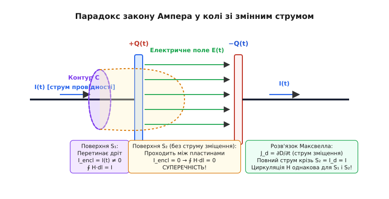
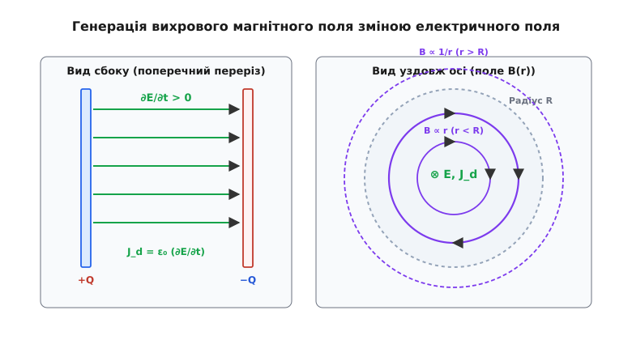
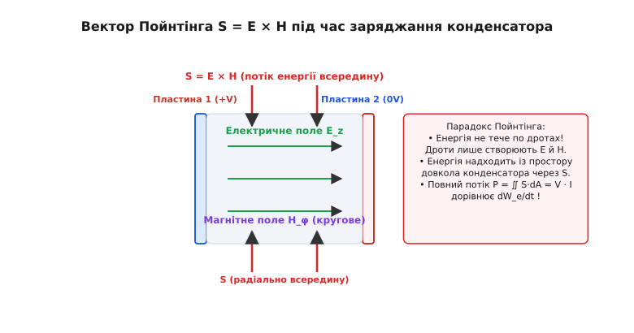
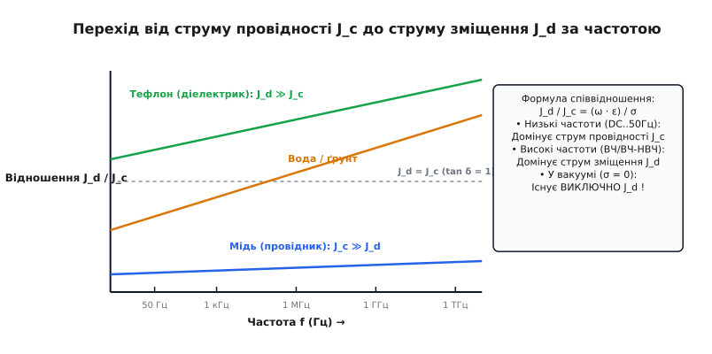

# Струм зміщення

<preknowlist>
- [Закон Ампера](topic:ph-electromagnetism/ampere-force) — циркуляція магнітного поля довкола провідника зі струмом.
- [Рівняння безперервності](topic:ph-electromagnetism/current-continuity) — закон збереження електричного заряду в локальній формі.
- [Закон Гаусса](topic:ph-electromagnetism/electric-field) — зв'язок між потоком електричного зміщення та замкненим зарядом.
- [Закон збереження заряду](topic:ph-electromagnetism/charge-conservation) — фундаментальний принцип незмінності сумарного заряду замкненої системи.
- [Електромагнітна хвиля](topic:ph-electromagnetism/em-wave) — самопідтримне поширення збурень електричного та магнітного полів у просторі.
</preknowlist>

Якщо замкнути електричне коло постійного струму з батареєю та вимикачем, у металевому провіднику виникає впорядкований рух вільних електронів, а довкола дроту з'являється циркуляційне магнітне поле. Обертаючись навколо провідника, це поле легко вимірюється компасом або датчиком Холла. Але якщо у це коло послідовно вставити плоский повітряний конденсатор із двох металевих пластин, розсічених вакуумним проміжком у два міліметри, фізичний рух електронів крізь вакуум зупиниться: носії заряду накопичуватимуться на одній обкладці й витікатимуть з іншої, створюючи короткочасний струм заряджання. Класичний закон Ампера 1820 року стверджував, що джерелом магнітного поля є виключно рухуваний заряд — струм провідності. За цією логікою усередині вакуумного проміжку між пластинами, де немає жодного електрона, магнітне поле мусило б миттєво обнулитися. Проте чутливий магнітометр, внешений у проміжок між пластинами під час заряджання, фіксує таке саме вихрове магнітне поле, як і довкола підвідного мідного дроту. Джерелом цього магнітного поля є не рух носіїв заряду, а змінне електричне поле, яке зростає у вакуумі між обкладками. Це явище описує **струм зміщення** — фундаментальний механізм електродинаміки, за якого часова зміна електричного поля генерує вихрове магнітне поле в порожнечі, роблячи можливим існування світла та електромагнітних хвиль у Всесвіті.

---

## 1. Парадокс роззіяного кола: де ламається класичний закон Ампера

Щоб зрозуміти логічну неминучість існування струму зміщення, розглянемо стан електродинаміки першої половини XIX століття. До робіт Джеймса Клерка Максвелла фундаментальним законом, що описував зв'язок між струмами й магнітними полями, був закон циркуляції Ампера. У стаціонарних умовах, коли струми в колах не змінюються у часі, циркуляція векторного поля напруженості магнітного поля `H` по довільному замкненому контуру `L` задавалася теоремою Ампера:

```
∫_L H · dl = I_encl
```

де `I_encl` — повний струм провідності, що протікає крізь довільну відкриту поверхню `S`, обмежену даним контуром `L`. У математичній мові векторного аналізу це фундаментальне правило записується у диференціальній формі через оператор ротора:

```
∇ × H = J
```

де `J` — вектор густини струму провідності (А/м²), що описує реальний потік носіїв заряду (електронів у металі чи іонів у розчині).

Застосуємо операцію дивергенції (розбіжності) до обидвох частин цього диференціального рівняння. З векторного аналізу відомо, що ротор будь-якого векторного поля не має джерел, тобто його дивергенція строго дорівнює нулю:

```
∇ · (∇ × H) ≡ 0
```

Отже, з диференціального закону Ампера у його класичному формулюванні неминуче випливала вимога:

```
∇ · J = 0
```

Ця математична рівність означає, що лінії густини струму провідності `J` мусять бути строго неперервними, не мати ні початку, ні кінця, а сам струм може протікати лише по замкнених контурах. Для суцільних металевих провідників та кіл постійного струму ця умова виконувалася бездоганно.


*Парадокс закону Ампера у колі з конденсатором: натягування поверхні S₁ через дріт дає струм I, тоді як поверхня S₂ між пластинами дає нуль струму провідності.*

Однак під час розгляду нестаціонарних процесів виникає катастрофічне логічне розходження. Уявімо провідник, що підводить струм `I(t)` до пластин плоского конденсатора. Виберемо замкнений коловий контур `L`, який охоплює дріт живлення.

Натягнемо на цей контур дві різні геометричні поверхні:
1. **Поверхня `S₁`** — плоский диск, який перетинає мідний провідник. Крізь цю поверхню протікає реальний струм провідності `I(t)`, викликаний рухом електронів. За законом Ампера циркуляція магнітного поля дорівнює `∫ H · dl = I(t) ≠ 0`.
2. **Поверхня `S₂`** — вигнутий купол («мішок»), який опинає ліву пластину й проходить через проміжок між пластинами конденсатора. Усередині діелектричного або вакуумного проміжку вільні носії заряду відсутні, тому струм провідності крізь поверхню `S₂` строго дорівнює нулю (`J = 0`). За законом Ампера циркуляція магнітного поля мусить дорівнювати `∫ H · dl = 0`.

Виник нерозв'язний парадокс: циркуляція одного й того самого магнітного поля `H` вздовж одного й того самого контуру `L` набуває двох суперечливих значень залежно від того, яку математичну поверхню ми подумки натягнули на контур!

Розглянемо чисельний приклад цього парадоксу. Нехай по підвідному провіднику протікає струм заряджання `I = 2` Ампери, що підводиться до круглого повітряного конденсатора радіуса `R = 10` см. На відстані `r = 5` см від осі провідника циркуляція магнітного поля вздовж кола радіуса `r` за поверхнею `S₁` дає значення напруженості `H = I / (2·π·r) = 2 / (2 · π · 0.05) ≈ 6.37` А/м. Якщо ж обчислювати циркуляцію за поверхнею `S₂`, яка опинає пластину, то струм провідності `J = 0`, і класичне рівняння дає `H = 0`. Одне й те саме вимірюване поле не може бути одночасно рівним 6.37 А/м та 0 А/м.

Більше того, нестаціонарний розподіл зарядів підпорядковується фундаментальному закону збереження заряду, який описується рівнянням безперервності:

```
∇ · J + ∂ρ/∂t = 0
```

де `ρ` — об'ємна густина електричного заряду. Під час заряджання конденсатора заряд на пластинах змінюється у часі (`∂ρ/∂t ≠ 0`), з чого випливає `∇ · J ≠ 0`. Початковий закон Ампера `∇ × H = J` суперечив закону збереження електричного заряду при будь-якому змінному струмі.

---

## 2. Гіпотеза Максвелла: часова зміна електричного поля як джерело магнітного поля

У 1861 році шотландський фізик Джеймс Клерк Максвелл запропонував геніальне розв'язання цього парадоксу. Він припустив, що класичний закон Ампера є неповторно неповним: **джерелом магнітного поля є не лише рух електричних зарядів (струм провідності), а й будь-яка часова зміна електричного поля.**

Детальніше про початкову вихрову модель ефіру та хід думок ученого можна прочитати в [історії відкриття струму зміщення](topic:ph-electromagnetism/displacement-current/hist-maxwell-displacement.md).

Максвелл увів нову фізичну величину — **густину струму зміщення** `J_d`, яка визначається як часова похідна вектора електричного зміщення `D` (індукції електричного поля):

```
J_d = ∂D / ∂t
```

Оскільки у вакуумі вектор електричного зміщення пов'язаний з напруженістю електричного поля співвідношенням `D = ε₀ · E`, густина струму зміщення у порожнечі дорівнює:

```
J_d = ε₀ · (∂E / ∂t)
```

де `ε₀ ≈ 8.854e-12` Ф/м — електрична стала вакууму.

Об'єднуючи струм провідності `J` та струм зміщення `J_d`, Максвелл сформулював поняття **повного струму**:

```
J_total = J + J_d = J + ∂D/∂t
```

Узагальнений закон Ампера, який зараз називається **рівнянням Максвелла-Ампера**, у диференціальній формі набув вигляду:

```
∇ × H = J + ∂D/∂t
```

В інтегральній формі для довільної поверхні `S`, обмеженої контуром `L`, закон записується так:

```
∫_L H · dl = ∬_S J · dA + ∬_S (∂D/∂t) · dA
```

Перший доданок у правій частині являє собою повноцінний струм провідності `I_c`, а другий доданок — повний **струм зміщення** `I_d`, що протікає крізь поверхню `S`:

```
I_d = ∬_S (∂D/∂t) · dA
```

Тепер парадокс натягнутих поверхонь розв'язується бездоганно. Для поверхні `S₁`, що перетинає мідний дріт, струм зміщення нехтовно малий, а струм провідності дорівнює `I(t)`. Для поверхні `S₂`, що проходить між пластинами конденсатора, струм провідності дорівнює нулю (`J = 0`), але змінне електричне поле між обкладками `E(t)` створює струм зміщення `I_d`, який строго дорівнює `I(t)`. 

Циркуляція магнітного поля вздовж контуру `L` є строго однаковою для будь-якої обраної поверхні!

---

## 3. Математичне узгодження із законом збереження заряду

Введення струму зміщення було не стилістичною підгонкою під експеримент, а математичною вимогою сумісності законів електродинаміки.

Перевіримо дивергенцію обидвох частин узагальненого рівняння Максвелла-Ампера:

```
∇ · (∇ × H) = ∇ · J + ∇ · (∂D/∂t)
```

Оскільки ліва частина тотожно дорівнює нулю (`∇ · (∇ × H) ≡ 0`), отримуємо:

```
∇ · J + ∇ · (∂D/∂t) = 0
```

Помінявши місцями часткові похідні по часові та простору у другому доданку, маємо:

```
∇ · J + ∂/∂t (∇ · D) = 0
```

Згадаємо закон Гаусса для електричного поля в диференціальній формі, згідно з яким дивергенція електричного зміщення дорівнює об'ємній густині вільних зарядів:

```
∇ · D = ρ
```

Підставивши `ρ` у попередній вираз, отримуємо:

```
∇ · J + ∂ρ/∂t = 0
```

Ми тотожно вивели рівняння безперервності! Додавання доданку `∂D/∂t` до закону Ампера повністю усунуло внутрішні суперечності між законами електростатики, магнетостатики та збереження заряду. 

Розглянемо калібрувальну інваріантність потенціалів електромагнітного поля. Завдяки веденню струму зміщення векторний потенціал `A` та скалярний потенціал `Φ` задовольняють калібрувальній умові Лоренца:

```
∇ · A + (1 / c²) · (∂Φ / ∂t) = 0
```

Це дозволяє розщепити зв'язані рівняння для полів у два незалежні хвильові рівняння для потенціалів `□ A = −μ₀ · J` та `□ Φ = −ρ / ε₀`, де `□ = ∇² − (1/c²)·∂²/∂t²` — оператор Д'Аламбера. Без струму зміщення виведення потенціалів Лоренца було б математично неможливим.

Детальніше всі математичні кроки виводу та геометрію векторних полів наведено у [строгому математичному виводі струму зміщення](topic:ph-electromagnetism/displacement-current/math-displacement-derivation.md).

---

## 4. Фізична природа струму зміщення: вакуум проти діелектричного середовища

Вирішальним питанням фізичної інтерпретації струму зміщення є зрозуміти, що саме рухається в просторі. Зв'язок між вектором електричного зміщення `D`, напруженістю поля `E` та вектором поляризації середовища `P` описується співвідношенням:

```
D = ε₀ · E + P
```

де `P` — дипольний момент одиниці об'єму речовини (Кл/м²).

Продиференціювавши цей вираз по часові, отримуємо розкладання густини струму зміщення на дві фізично принципово різні складові:

```
J_d = ∂D/∂t = ε₀ · (∂E/∂t) + ∂P/∂t
```

```
               Двокомпонентна структура струму зміщення

                       J_d = ∂D/∂t
                            │
         ┌──────────────────┴──────────────────┐
         ▼                                     ▼
 J_d,vac = ε₀ · (∂E/∂t)               J_p = ∂P/∂t
 (Струм зміщення вакууму)            (Струм поляризації речовини)
 • Відсутність зарядів               • Зсув зв'язаних електронів
 • Динамічний ефект простору         • Реальне мікропереміщення маси
```

### 1. Струм поляризації речовини (`J_p = ∂P/∂t`)

У матеріальному діелектрику (скло, кераміка, вода, пластик) під дією змінного електричного поля позитивні атомні ядра та негативні електронні хмари зміщуються у протилежних напрямках.

Розглянемо це на мікроскопічному рівні. Існує три основні механізми поляризації речовини:
- **Електронна поляризація:** Квазіпружний зсув електронної хмари відносно ядра атома. Вона формується практично миттєво (характерний час релаксації `τ ~ 10⁻¹⁵` с) і проявляється на всіх частотах до оптичного діапазону.
- **Іонна поляризація:** Зсув різнойменно заряджених іонів у кристалічній ґратці (наприклад, іонів `Na⁺` та `Cl⁻` у солі). Вона має час релаксації `τ ~ 10⁻¹³` с і відключється на інфрачервоних частотах.
- **Орієнтаційна (дипольна) поляризація:** Поворот полярних молекул, що мають власний дипольний момент (наприклад, молекул води `H₂O`), вздовж зовнішнього поля. Вона потребує подолання діелектричного тертя в середовищі та має тривалий час релаксації `τ ~ 10⁻¹¹` с.

Цей часовий зсув зв'язаних зарядів створює **струм поляризації** `J_p = ∂P/∂t`. Це абсолютно реальний мікроскопічний рух носіїв заряду на відстані порядку часток нанометра. Він супроводжується механічним переміщенням речовини й виділенням теплоти внаслідок діелектричного тертя.

### 2. Струм зміщення вакууму (`J_d,vac = ε₀ · (∂E/∂t)`)

У чистому вакуумі речовина відсутня (`P = 0`), однак доданок `ε₀ · (∂E/∂t)` лишається відмінним від нуля при будь-якій часовій зміні електричного поля!

Вакуумний струм зміщення не пов'язаний із рухом жодних матеріальних частинок, носіїв заряду чи маси. Це фундаментальна динамічна властивість самого простору-часу: **зміна електричного стану вакууму породжує магнітний стан простору.** Вакуумний струм зміщення генерує точно таке саме вихрове магнітне поле `H`, як і реальний струм провідності в мідному провіднику.

З точки зору квантової електродинаміки (КЕД), фізичний вакуум не є абсолютно порожнім нічим, а являє собою квантовий стан із нульовими коливаннями полів та постійним виникненням і анігіляцією віртуальних електрон-позитронних пар. Прикладення змінного електричного поля викликає поляризацію цих віртуальних пар, що робить квантовий вакуум нелінійним діелектричним середовищем.

Параметри різних діелектричних середовищ, їхню проникність `ε_r` та частотні характеристики наведено в [довіднику діелектричних середовищ](topic:ph-electromagnetism/displacement-current/api-dielectric-parameters.md).

---

## 5. Розрахунок магнітного поля всередині та зовні конденсатора

Розглянемо круглий плоский конденсатор з обкладками радіуса `R`, на який подається змінна напруга, що створює в підвідному провіднику струм заряджання `I(t)`. 


*Генерація вихрового магнітного поля B(r) струмом зміщення всередині плоского круглого конденсатора.*

Знайдемо розподіл напруженості магнітного поля `H(r)` усередині та зовні конденсатора на відстані `r` від його центральної осі.

Припустимо, що електричне поле між обкладками є однорідним та орієнтованим уздовж осі `z`. Його величина дорівнює:

```
E_z(t) = Q(t) / (ε₀ · π · R²)
```

Густина струму зміщення між обкладками є строго однорідною:

```
J_d = ε₀ · (∂E_z / ∂t) = (1 / (π · R²)) · (dQ/dt) = I(t) / (π · R²)
```

Застосуємо теорему про циркуляцію для колового контуру радіуса `r`:

### 1. Внутрішня область конденсатора (`r ≤ R`)

Коловий контур радіуса `r` охоплює лише частину площі пластин `S = π · r²`. Повний струм зміщення, що протікає крізь цей контур, дорівнює:

```
I_d(r) = J_d · (π · r²) = I(t) · (r² / R²)
```

Циркуляція магнітного поля вздовж контуру довжиною `2 · π · r` дорівнює:

```
∫ H · dl = H_φ(r) · (2 · π · r) = I(t) · (r² / R²)
```

Звідси отримуємо вираз для напруженості магнітного поля всередині проміжку:

```
H_φ(r) = (I(t) · r) / (2 · π · R²)       [для r ≤ R]
```

Магнітне поле всередині конденсатора зростає строго лінійно від нуля на центральній осі (`r = 0`) до максимального значення на зовнішньому краю пластин (`r = R`).

Звернемо увагу на фазовий зсув полів у гармонічному режимі. Якщо струм заряджання описується синусоїдальним законом `I(t) = I₀ · cos(ω·t)`, то напруженість електричного поля змінюється пропорційно `sin(ω·t)`. Водночас вихрове магнітне поле `H_φ`, створене струмом зміщення `∂E/∂t`, змінюється пропорційно `cos(ω·t)`. Отже, у близькій зоні конденсатора електричне та магнітне поля зсунуті за фазою на `90°` (`π/2`), що відповідає чисто реактивному коливанню енергії без випромінювання на нескінченність.

### 2. Зовнішня область конденсатора (`r ≥ R`)

Поза обкладками контур радіуса `r > R` охоплює весь потік струму зміщення `I_d = I(t)`:

```
H_φ(r) · (2 · π · r) = I(t)

H_φ(r) = I(t) / (2 · π · r)              [для r ≥ R]
```

Отриманий вираз тотожно збігається з магнітним полем довгого прямолінійного провідника зі струмом `I(t)`! На межі пластин `r = R` внутрішнє поле неперервно переходить у зовнішнє поле підвідного дроту.

У високочастотному режимі, коли частота коливань струму `ω` настільки висока, що довжина хвилі у діелектрику становиться порівнянною з радіусом пластин (`λ ~ R`), спрощене припущення про однорідність електричного поля `E_z` перестає виконуватися. Породжене струмом зміщення магнітне поле `H_φ`, у свою чергу, створює за законом Фарадея вторинне електричне поле. В результаті поле всередині проміжку перетворюється на стоячу хвилю, амплітуда якої описується функцією Бесселя нульового порядку `J₀(k r)`.

---

## 6. Енергетичний баланс та вектор Пойнтінга

Розгляд струму зміщення підводить до дивовижного фізичного парадоксу, пов'язаного з передачею електромагнітної енергії. Густина потоку енергії електромагнітного поля описується **вектором Пойнтінга**:

```
S = E × H
```

Напрямок вектора `S` вказує напрямок перенесення енергії, а його величина дорівнює потужності, що проходить крізь одиничну площу (Вт/м²).


*Напрямок вектора Пойнтінга S радіально всередину об'єму конденсатора під час його заряджання.*

Під час заряджання конденсатора:
- Електричне поле `E` орієнтоване паралельно осі конденсатора (вздовж осі `z`).
- Вихрове магнітне поле `H`, породжене струмом зміщення, орієнтоване азимутально по колу навколо осі.

Векторний добуток `S = E × H` орієнтований **радіально всередину** об'єму конденсатора через його бічну циліндричну поверхню!

Обчислимо потік вектора Пойнтінга крізь бічну поверхню конденсатора радіуса `R` та висотою `h`:

```
S_r = E_z · H_φ(R) = (V / h) · (I / (2 · π · R))
```

Повний потік потужності `P`, що входить у проміжок між пластинами крізь бічну поверхню площею `A = 2 · π · R · h`:

```
P = S_r · (2 · π · R · h) = [ (V / h) · (I / (2 · π · R)) ] · (2 · π · R · h) = V · I
```

Повна потужність `P = V · I`, яка витрачається джерелом на заряджання конденсатора, надходить у діелектричний проміжок **не через металеві дроти живлення**, а з навколишнього простору через його бічні межі у формі електромагнітного поля! Металеві дроти лише спрямовують вектори `E` та `H` у просторі, формуючи потік енергії Пойнтінга довкола себе.

Цей фундаментальний висновок справджується для будь-якої електричної лінії передачі: у коаксіальному кабелі енергія передається не по внутрішній чи зовнішній жилі, а крізь діелектричний простір між ними у формі вектора Пойнтінга `S = E × H`.

---

## 7. Струм зміщення як умова існування електромагнітних хвиль

Найважливішим наслідком відкриття струму зміщення є досягнення повної симетрії між електричним та магнітним полями у фундаментальних рівняннях Максвелла для вакууму:

```
┌────────────────────────────────────────────────────────┐
│ 1. Закон Гаусса для E:       ∇ · E = 0                 │
│ 2. Закон Гаусса для B:       ∇ · B = 0                 │
│ 3. Закон Фарадея:            ∇ × E = − ∂B/∂t           │
│ 4. Закон Максвелла-Ампера:   ∇ × B = μ₀·ε₀ · (∂E/∂t)   │
└────────────────────────────────────────────────────────┘
```

Розглянемо взаємозв'язок цих рівнянь у динаміці:
1. Зміна магнітного поля у часі (`∂B/∂t ≠ 0`) генерує вихрове електричне поле (`∇ × E ≠ 0`) за законом Фарадея.
2. Зміна електричного поля у часі (`∂E/∂t ≠ 0`) генерує вихрове магнітне поле (`∇ × B ≠ 0`) за законом Максвелла-Ампера завдяки струму зміщення.

Якби струм зміщення був відсутній (`∂E/∂t = 0`), процес був би одностороннім: зміна магнітного поля породжувала б електричне поле, але те не здатне було б відтворити магнітне поле. Електромагнітне збурення миттєво згасало б біля джерела.

Завдяки існуванню струму зміщення виникає безперервний процес перехресного зародження: зміна електричного поля породжує магнітне, зміна магнітного — електричне, і так далі. 

Взявши ротор від закону Фарадея та застосувавши рівняння Максвелла-Ампера, ми отримуємо тривимірне **хвильове рівняння**:

```
∇²E − μ₀·ε₀ · (∂²E / ∂t²) = 0
```

Це рівняння описує електромагнітну хвилю, що вільно відривається від джерела й біжить у просторі зі фазовою швидкістю:

```
c = 1 / √(μ₀ · ε₀) ≈ 299 792 458 м/с
```

З точки зору спеціальної теорії відносності Ейнштейна, існування струму зміщення є неминучим наслідком релятивістської інваріантності. Оскільки електричні й магнітні поля перетворюються одне в одне при переході між різними інерціальними системами відліку через перетворення Лоренца, 4-потенціал електромагнітного поля `A_μ` задовольняє інваріантному хвильовому рівнянню Даламбера `□ A_μ = μ₀ · J_μ` лише тоді, коли 4-струм `J_μ = (c·ρ, J)` включає струм зміщення. Без струму зміщення рівняння електродинаміки суперечили б принципу відносності.

Без струму зміщення існування радіохвиль, світла, рентгенівського випромінювання та будь-якого бездротового зв'язку було б фізично неможливим.

Побачити, як працюють різницеві рівняння оновлення полів на FDTD-сітці у часі, можна в [чисельному моделюванні поля конденсатора](topic:ph-electromagnetism/displacement-current/proj-fdtd-capacitor.md).

---

## 8. Практичне значення в інженерії: від низьких частот до нанотехнологій

У повсякденній електротехніці співвідношення між струмом провідності `J_c = σ · E` та струмом зміщення `J_d = ω · ε · E` залежить від частоти `ω = 2·π·f` та параметрів середовища.


*Співвідношення струмів провідності J_c та зміщення J_d у провідниках та діелектриках залежно від частоти.*

Відношення модулів цих струмів описується виразом:

```
|J_d| / |J_c| = (ω · ε₀ · ε_r) / σ
```

- **При низьких частотах (50 Гц в електромережі):** Для мідного провідника (`σ ≈ 5.8e7` См/м) струм зміщення в `10¹⁸` разів менший за струм провідності. Його не враховують під час розрахунку звичайних силових кабелів.
- **При високих частотах (Гігагерци, Wi-Fi, 5G, процесорні шини):** У діелектриках друкованих плат (FR-4, тефлон) струм зміщення повністю домінує над струмом провідності.

> 🔧 **Навіщо це.** У сучасній цифровій та мікрохвильовій інженерії струм зміщення перестає бути теоретичною абстракцією й перетворюється на головний чинник витоків і завад:
> 1. **Паразитні ємнісні витоки у друкованих платах:** Швидкі фронти цифрових сигналів з тривалістю наростання `dt = 0.5` нс створюють колосальну швидкість зміни напруги `dV/dt`. Через паразитну ємність між доріжками плати протікає струм зміщення `I_d = C · (dV/dt)`, що викликає перехресні наводки (crosstalk) та збої у сусідніх лініях даних.
> 2. **Затворні витоки в нанометрових транзисторах:** У сучасних процесорах товщина підзатворного діелектрика `SiO₂` становить лише 1–2 нанометри. При такій товщині висока частота перемикання транзисторів (3–5 ГГц) генерує значні струми зміщення крізь затвор, що призводить до додаткового нагріву й енергоспоживання кристала.
> 3. **Безконтактна NFC-зв'язаність та бездротова зарядка:** Передача сигналів та енергії між котушками NFC та QI-зарядками на коротких відстанях базується на високих змінних полях, де струм зміщення у проміжку забезпечує замикання магнітного потоку й передачу потужності без прямого металевого контакту.
