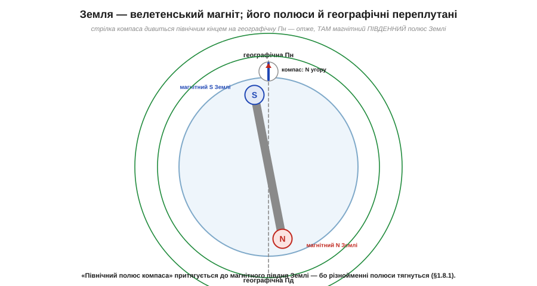
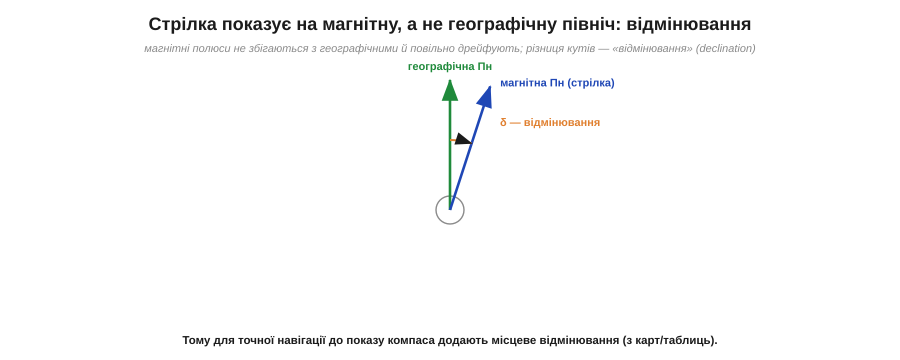
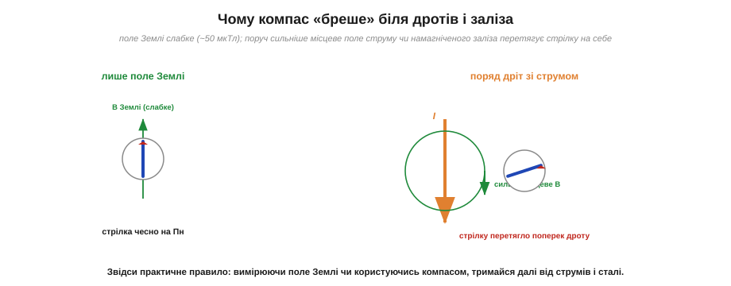

# Магнітне поле Землі й компас

[Магнітне поле](root:ph-electromagnetism/magnetic-field) Землі — десятки мікротесла, слабке, але всюдисуще — варто розглянути прямо. Компас, що встановлюється в цьому полі, — найдавніший магнітний прилад людства, який тисячоліттями водив кораблі, — і водночас джерело тонкої плутанини в назвах полюсів. А ще компас — це готовий урок про те, чому слабке поле так легко збити чужим, що прямо стосується кожного, хто користується електронним компасом у дроні чи телефоні.

### Земля — це великий магніт

Найголовніший факт: **сама Земля поводиться як величезний штабовий магніт**. Глибоко в надрах, у рідкому залізному ядрі, течуть колосальні струми (це так зване **геодинамо**), і вони, за правилом [«струм народжує поле»](root:ph-electromagnetism/oersted-experiment), створюють магнітне поле, що пронизує всю планету й тягнеться далеко в космос. Зовні це поле має такий самий вигляд, як поле [штабового магніту](root:ph-electromagnetism/magnetic-field): лінії виходять з одного полюса, огинають планету й входять в інший.

Саме це поле й повертає стрілку компаса. Стрілка — маленький магніт на вільній осі; вона встановлюється вздовж місцевої лінії поля Землі, і її північний кінець показує приблизно на географічну північ. Тисячі років цього було досить, щоб знаходити дорогу.

Походження поля Землі — окрема дивовижна історія. Земля не є постійним магнітом: у її надрах надто гаряче, далеко вище за [температуру Кюрі](root:ph-condensed/permanent-magnets) будь-якого матеріалу, тож жодне залізо там не втримало б намагніченості. Поле породжують **струми** — потоки розплавленого заліза в зовнішньому ядрі, що рухаються через теплову конвекцію й обертання планети. Ці гігантські струми за правилом «рух заряду творить поле» і дають магнітне поле всієї Землі. Механізм самопідтримки таких струмів називають **геодинамо** (*geodynamo*). Він пояснює й те, чому поле Землі не вічне й не сталене: воно повільно дрейфує, слабшає й підсилюється, а за геологічні епохи навіть **перемикає полюси** місцями (магнітні інверсії, сліди яких знайшли в намагніченості давніх порід). Для нас, утім, на людському віку поле можна вважати майже сталим — і саме на цю майже-сталість спирається компас.


*Земля як магнітний диполь. Глибинні струми в ядрі створюють поле, схоже на поле штабового магніту, нахиленого приблизно на 11° до осі обертання. Стрілка компаса встановлюється вздовж ліній цього поля; її північний кінець показує на географічну північ.*

### Плутанина полюсів: північ компаса тягнеться до магнітного півдня Землі

А тепер — тонкість, яка спершу збиває з пантелику. За [правилом полюсів](root:ph-electromagnetism/magnetic-field), **різнойменні** полюси притягуються. Північний кінець стрілки компаса дивиться на географічну північ — отже, його **притягує** те, що лежить на півночі. Але притягувати північний полюс стрілки може лише **південний** полюс. Виходить парадокс: **там, де в Землі географічна північ, насправді міститься магнітний південний полюс**.

Це не помилка, а наслідок історичних назв. Полюси магнітної стрілки назвали за тим, **куди вони показують** (північний кінець — той, що дивиться на північ), ще задовго до того, як зрозуміли механізм притягання. Якби називали логічно, довелося б перейменувати або полюси стрілки, або полюси Землі. Тому фізики говорять акуратно: **«північний геомагнітний полюс»** (той, що біля географічної півночі) є насправді **південним** полюсом земного магніту-диполя. У побуті ж просто пам'ятають факт: північний кінець компаса показує на північ — і цього досить для навігації.

> 🔧 **Навіщо це.** Ця плутанина — не просто курйоз. Коли в даташиті давача Холла чи в описі магніта пишуть «N-pole» / «S-pole», треба чітко розуміти, який полюс що притягує. Складаючи магнітну защіпку, тримач чи систему позиціювання, інженер орієнтується саме на правило різнойменних полюсів — і знання, що «північ компаса = південь джерела поля», рятує від помилок зі зборкою «навпаки».

### Магнітне схилення: стрілка показує не зовсім туди

Друга практична деталь: магнітні полюси Землі **не збігаються** з географічними (тими, через які проходить вісь обертання). Магнітний диполь нахилений до осі приблизно на 11°, а самі магнітні полюси ще й повільно **дрейфують** рік у рік. Тому стрілка компаса показує на **магнітну** північ, яка в більшості місць планети трохи відхилена від справжньої, географічної. Цей кут між напрямом на магнітну й на географічну північ називають **магнітним схиленням** (*magnetic declination*).


*Стрілка показує на магнітну північ, що відхилена від географічної на кут δ — магнітне схилення. Воно різне в різних точках Землі й повільно змінюється з часом, тож для точної навігації його беруть із карт чи таблиць і додають до показу компаса.*

Для прогулянки схиленням можна знехтувати, а от для точної навігації — ні: на великих відстанях кут у кілька градусів дає помітну похибку курсу. Тому в авіації, морській справі й точній геодезії показ компаса завжди **виправляють** на місцеве схилення. Електронні навігаційні системи роблять це автоматично, маючи в пам'яті карту схилень.

Є й третій, менш відомий кут. Поле Землі не лежить горизонтально — воно ще й **пірнає в землю** під кутом, що зветься **магнітним нахилом** (*inclination*, або нахиленням). Біля екватора лінії поля майже горизонтальні, а ближче до полюсів вони дедалі крутіше йдуть униз, поки над самим магнітним полюсом не стають прямовисними. Тому проста горизонтальна стрілка компаса поблизу полюса працює погано — її «тягне» вниз. Це не абстракція: електронний магнітометр міряє **всі три** складові поля (північ, схід і вертикаль), і саме вертикальна складова дозволяє прошивці відрізнити справжній напрям від нахилу. Для інженера, що ставить такий давач, це означає: компенсувати треба не лише силу місцевих завад, а й нахил поля Землі — інакше курс «попливе» при крені апарата.

### Чому компас бреше біля проводів і заліза

Поле Землі **дуже слабке** (десятки мікротесла), а сильніше поле легко перебиває слабше. Тож будь-яке **місцеве** магнітне поле поряд зі стрілкою — поле [проводу зі струмом](root:ph-electromagnetism/oersted-experiment) чи [намагніченого шматка заліза](root:ph-condensed/ferromagnetism) — може виявитися сильнішим за земне й **перетягнути** стрілку на себе. Компас почне показувати не на північ, а вздовж місцевого поля.


*Чому компас «бреше». Ліворуч у чистому полі Землі стрілка чесно показує на північ. Праворуч поряд із дротом зі струмом виникає сильніше місцеве поле з концентричними кільцями, і воно перетягує стрілку поперек дроту — як у самому досліді Ерстеда. Те саме роблять намагнічені сталеві деталі поблизу.*

Це рівно той ефект, який бачив Ерстед: [дріт зі струмом повертає стрілку](root:ph-electromagnetism/oersted-experiment) — лише тут він виступає **завадою** для компаса. Звідси практичне правило: користуючись магнітним компасом чи вимірюючи поле Землі, тримайся подалі від струмів, моторів, динаміків і сталевих мас.

### Два роди завад: тверда й м'яка

Завади для компаса корисно поділити на два роди — і цей поділ прямо успадковує різницю між [твердими й м'якими магнітними матеріалами](root:ph-condensed/permanent-magnets). **Тверда** завада (*hard-iron*) — це стале власне поле від намагнічених деталей (постійних магнітів, намагніченого сталевого корпусу) або від постійних струмів. Воно завжди додає той самий вектор до поля Землі, тож компас стабільно «зміщений» в один бік. Таку заваду компенсувати найлегше: достатньо один раз виміряти зсув і відняти його. **М'яка** завада (*soft-iron*) складніша — це спотворення, яке вносять феромагнітні маси поряд (вони викривляють самі лінії поля Землі залежно від орієнтації апарата). Її компенсація потребує складнішого калібрування з поворотами апарата в різні боки. Електронні компаси в дронах і телефонах борються з обома: процедура «помахати вісімкою» перед калібруванням — це якраз збір даних, щоб прошивка обчислила й тверду, і м'яку поправки.

### Як влаштований сам компас

Варто на мить зупинитися й на самому приладі, бо він навдивовижу давній. Класичний магнітний компас (іт. *compasso* — креслити коло, міряти кроком) — це легка намагнічена стрілка на майже безтертьовій голчастій опорі (часто у в'язкій рідині, що гасить коливання). Стрілку роблять із [**твердого** магнітного матеріалу](root:ph-condensed/permanent-magnets), щоб вона тримала власну намагніченість і не розмагнічувалась від трясіння. Найперші ж компаси, відомі ще в стародавньому Китаї, використовували природний намагнічений мінерал — **магнетит**, або «магнітний камінь» (*lodestone*), шматочки якого самі собою намагнічені земним полем за геологічні часи. Те, що такий камінь, підвішений на нитці, завжди повертається в той самий бік, тисячоліттями здавалося майже магічним — поки фізика не пояснила це через поле Землі.

> 🔧 **Навіщо це.** Поділ на тверду й м'яку заваду — це прямо те, що інженер закладає в прошивку магнітометра. Тверда поправка зберігається як сталий вектор зсуву; м'яка — як матриця, що виправляє викривлення. Без обох курс апарата «гуляє»: дрон думає, що летить на північ, а насправді його зносить, бо поряд стоїть силовий дріт чи сталевий гвинт. Тому грамотне розміщення давача (подалі від моторів і струмів) плюс правильне калібрування — обов'язкові кроки, що прямо випливають із фізики цієї теми.

> 🔧 **Навіщо це.** Це прямий клопіт кожного, хто ставить електронний компас (магнітометр) на рухомий апарат. На платі поряд течуть струми, стоять сталеві гвинти, гудуть мотори — і всі вони створюють місцеві поля, що в рази сильніші за земні 50 мкТл, які давач намагається зміряти. Тому магнітометр виносять якнайдалі від силових проводів і моторів (часто на окремій щоглі), а перед польотом обов'язково **калібрують**: апарат повертають у різні боки, і прошивка вчиться віднімати стале місцеве поле корпусу, лишаючи чисте поле Землі. Без цього показ курсу «попливе», і апарат полетить не туди.

**Приклад (на якій відстані поле дроту зрівняється з полем Землі).** Прямий провід зі струмом I = 10 А. Поле прямого дроту спадає як B = μ₀·I/(2π·r). На якій відстані r воно дорівнюватиме земним 50 мкТл?

```
B = μ₀ · I / (2π · r)   →   r = μ₀ · I / (2π · B)

r = (1.257×10⁻⁶ · 10) / (2π · 50×10⁻⁶)
r = (1.257×10⁻⁵) / (3.14×10⁻⁴)
r ≈ 0.04 м = 4 см
```

Уже на відстані 4 см від дроту зі струмом 10 А його поле дорівнює земному, а **ближче** — переважає його. Тобто компас (чи магнітометр), піднесений на пару сантиметрів до силового проводу, показуватиме переважно поле цього проводу, а не Землі. Ось чому навіть невеликі струми поряд з давачем поля — серйозна проблема, і чому розведення плати з магнітометром потребує особливої уваги.

---
