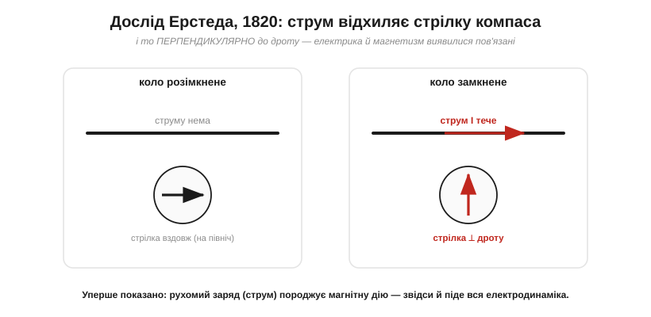
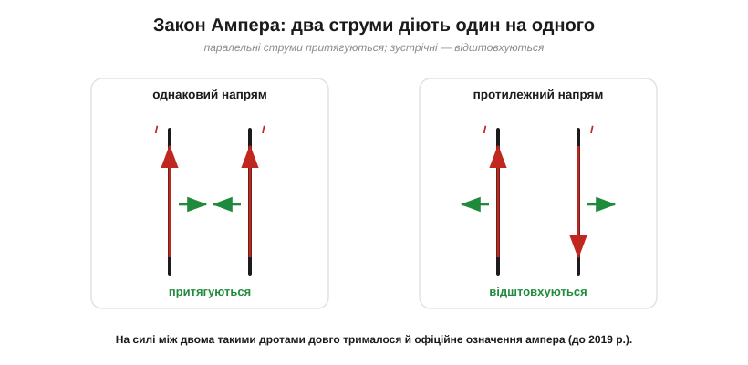
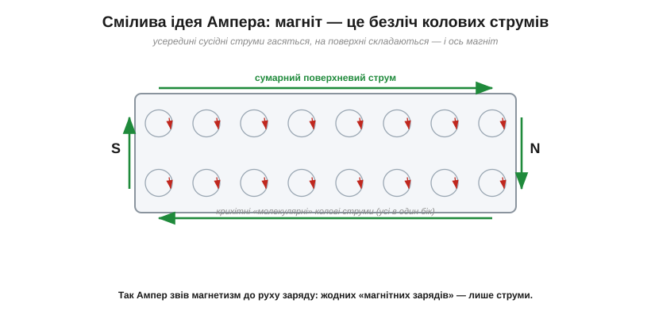

# 📜 Ампер і 1820 рік: народження електродинаміки

Одиниця струму [ампер](root:ph-electromagnetism/electric-current) названа на честь Андре-Марі Ампера, що першим описав взаємодію струмів. За цим скупим рядком — один із найдраматичніших років в історії фізики: **1820-й**, коли за кілька місяців знайшли зв'язок між електрикою й магнетизмом, якого марно шукали століттями, і майже за одну осінь збудували цілу нову науку — **електродинаміку**. І це історія не одного генія, а кількох: данець помітив іскру, француз роздмухав із неї вогонь.

## Дві окремі науки до 1820 року

Століттями електрика й магнетизм жили в різних світах. Електрика — це бурштин, іскри, лейденські банки, нарешті [Вольтова батарея](root:hw-sensing/volt). Магнетизм — це магнітний камінь і компас, що тисячоліттями вказував морякам шлях. Зовні вони скидалися одне на одного: і там, і там — притягання й відштовхування, і там, і там — два «полюси». Та зв'язати їх ніхто не міг. Намагалися — пропускали розряд крізь голки, сподіваючись їх намагнітити, — і виходило непереконливо. Компас і іскра вперто належали до різних загадок. Багато хто навіть вважав, що зв'язку немає взагалі.

## Ерстед і смикання стрілки

Зламав цю стіну данський професор **Ганс Крістіан Ерстед** (*Hans Christian Ørsted*, 1777–1851) — натурфілософ копенгагенського гарту, що, на відміну від багатьох, **вірив** у глибоку єдність сил природи й тому свідомо її шукав. 21 квітня 1820 року, під час лекційного досліду, він побачив, як стрілка компаса біля дроту зі струмом ворухнулася.

Тут варто розвіяти живучий міф. Розповідають, ніби Ерстед натрапив на ефект **випадково**, просто під час лекції. Це неправда: він полював на зв'язок електрики з магнетизмом **щонайменше від 1818 року**, прийшов на ту лекцію з батареєю й компасом напоготові — і саме там ефект нарешті проступив. Випадковим був хіба момент, а не пошук. Це важливо: відкриття електромагнетизму належить данцеві Ерстеду, і його не можна затьмарювати тим, що французи зробили далі.

*Дослід Ерстеда. Біля дроту зі струмом стрілка компаса повертається — і не **до** дроту чи **від** нього, а **перпендикулярно** до нього. Сила немовби «обвиває» провідник. Уперше електрика й магнетизм виявилися пов'язані.*

І ось що найдивовижніше було в тому досліді. Стрілка не потяглася до дроту й не відштовхнулася від нього, як зробили б [заряди вздовж лінії, що їх з'єднує](root:ph-electromagnetism/coulomb-law). Вона стала **поперек** дроту, ніби сила закручувалася навколо провідника кільцем. Така «обертова» дія була геть несхожа на все відоме — і саме її дивина підказувала, що відкрилося щось принципово нове. Ерстед стисло описав це в чотиристорінковій латинській брошурі 21 липня 1820 року, і новина блискавкою рознеслася Європою.

Варто оцінити, наскільки це ламало звичну картину. Усі відомі доти сили — тяжіння Ньютона, [електрична сила Кулона](root:ph-electromagnetism/coulomb-law) — діяли **вздовж прямої**, що з'єднує тіла: притягували чи відштовхували «по лінії». А Ерстедова дія була **поперечна**, закручена навколо дроту, — перша в історії сила, що не вкладалася в цей простий шаблон «по лінії». Сучасникам це здавалося майже скандальним. Та саме ця дивина згодом підштовхне думку, що простір навколо струму чимось **заповнений** і має власну, кільцеву будову, — зерно майбутнього поняття поля.

## Париж спалахує: Араго й Ампер

Уже за тижні дослід повторювали в усіх столицях. У Парижі його показав Академії наук **Франсуа Араго** (*François Arago*) — 11 вересня 1820 року. У залі сидів **Андре-Марі Ампер**. Те, що сталося далі, в історії фізики згадують як рідкісний спалах натхнення: Ампер усе зрозумів майже миттєво й кинувся до роботи. **За тиждень** він уже ставив власні досліди, а далі цілу осінь мало не щотижня доповідав Академії нові результати. Якщо Ерстед відчинив двері, то Ампер за кілька місяців забіг крізь них до самого кінця коридору.

## Хто такий Ампер

Андре-Марі Ампер (*André-Marie Ampère*, 1775–1836) народився під Ліоном і був самоуком-вундеркіндом: ще хлопчиком перечитав батькову «Енциклопедію» від А до Я. Та життя його було позначене трагедією. Під час революційного Терору 1793 року його батька Жан-Жака, ліонського урядовця, **скарали на гільйотині** — удар, від якого Андре-Марі довго не міг отямитися. Згодом рано померла і його перша дружина. Звідси і його вдача — меланхолійний, неуважний геній, про чию розсіяність ходили анекдоти (то витре крейдою формулу й піде, прийнявши візника за дошку). А водночас це був першорядний математик, хімік і філософ — людина, що звикла бачити в природі лад. Саме такому розумові й випало навести лад у хаосі осені 1820-го.

## Два дроти, що відчувають один одного

Ключова думка Ампера була зухвало проста. Якщо струм створює магнітну дію (Ерстед), то **два струми мають діяти один на одного безпосередньо** — без жодного магніту між ними. Він узяв два паралельні дроти, пустив по них струм — і побачив:

*Закон Ампера. Два паралельні дроти зі струмом притягуються, якщо струми течуть в **один** бік, і відштовхуються — якщо **назустріч**. На цій силі довго трималося й офіційне означення ампера.*

Однаково напрямлені струми **притягуються**, зустрічні — **відштовхуються** (зверніть увагу: у зарядів усе навпаки — однойменні відштовхуються). Ампер не просто це помітив, а **виміряв** і вклав у формулу — закон сили між елементами струму. Для цієї нової науки про струми-в-русі він і вигадав назву **електродинаміка** (*électrodynamique*), на відміну від **електростатики** нерухомих зарядів.

> 🔧 **Навіщо це.** Саме цей закон і стоїть за назвою одиниці. Сила між двома паралельними дротами виявилася такою фундаментальною, що **аж до 2019 року** ампер у системі СІ означували **через неї**: 1 ампер — це такий струм у двох нескінченних паралельних дротах за метр один від одного, що дає силу 2×10⁻⁷ ньютона на кожен метр. Тобто щоразу, пишучи «А» біля сили струму, ви спираєтеся на Амперів дослід із двома дротами. (Нині ампер прив'язали до елементарного заряду — але дух лишився.)

## Пливець Ампера: як запам'ятати напрям

Нова сила була підступна ще й тим, що **напрямок** її не вгадувався: стрілка поверталася то в один бік, то в інший — залежно від того, куди тече струм і з якого боку лежить компас. Щоб не плутатися, Ампер вигадав кумедний образ — **«пливця Ампера»** (*bonhomme d'Ampère*). Уявіть чоловічка, що лежить у дроті обличчям до стрілки, а струм входить йому в ноги й виходить із голови; тоді його **ліва рука** показує, куди відхилиться північний кінець стрілки. Наївно — але працювало, і не одне покоління школярів вивчало електродинаміку через цього пливця. Сьогодні те саме формулюють «правилом правої руки», та дух той самий: напрямок магнітної дії жорстко зв'язаний із напрямком струму — переплутаєш полюси батареї, і поле розвернеться.

## Магніт — це теж струми

А далі Ампер зробив крок, від якого перехоплює подих і досі. Якщо струм породжує магнетизм, міркував він, то, можливо, **будь-який** магнетизм — це насправді струм? Навіть звичайний постійний магніт? Він припустив, що всередині магнітної речовини течуть незліченні крихітні вічні **«молекулярні струми»** — по мікроскопічному кільцю в кожній частинці.

*Молекулярні струми Ампера. Магніт — це безліч крихітних колових струмів; усередині сусідні гасяться, а на поверхні складаються в єдиний струм, що обтікає брусок. Магнетизм без жодних «магнітних зарядів» — лише рух заряду.*

Коли всі ці кільця дивляться в один бік, їхні внутрішні частини гасять одна одну (сусідні струми течуть назустріч), а от на **поверхні** бруска вони складаються в один великий струм, що обтікає магніт, — і саме він робить його магнітом. Жодних окремих «магнітних зарядів»: тільки рух електричного заряду, та сама електрика. Це був здогад **на століття вперед** — лише з відкриттям електрона й будови атома стало ясно, що Ампер по суті мав рацію (магнетизм речовини й справді створюють струми електронів усередині атомів). Угадати таке в 1820 році, не знаючи ні про електрон, ні про атом, — майже неймовірно.

## Котушка, що стала магнітом

А один Амперів дослід виявився напрочуд практичним. Якщо окремий виток зі струмом — це крихітний магнітик, то згорнімо дріт у **спіраль** із багатьох витків (соленоїд): їхні магнітні дії складуться, і вся котушка поводитиметься точнісінько як брусковий магніт — матиме два полюси, притягуватиме залізо, повертатиметься в полі Землі. Ампер показав це наочно — і тим, по суті, дав світові **електромагніт**, керований струмом: пустив струм — котушка магнітна, вимкнув — ні. Звідси пряма дорога до реле, дзвінків, підіймальних електромагнітів і, врешті, **електромоторів**, що крутять геть усе — від вентилятора до дрона. Те, що видається сухою одиницею «ампер», тут обертається на силу, яка рухає механізми. (Усю свою електродинаміку Ампер звів докупи в трактаті 1827 року — праці, яку Максвелл шанобливо назвав одним зі взірців математичної фізики.)

## Біо, Савар і повна картина

Було б несправедливо приписати всю осінь 1820-го одному Амперу. Тієї самої осені двоє інших французів — **Жан-Батіст Біо** (*Jean-Baptiste Biot*) і **Фелікс Савар** (*Félix Savart*) — знайшли закон, що дає **магнітне поле** навколо провідника зі струмом (закон Біо–Савара). Тож рік виявився колективним вибухом: Ерстед дав **сам ефект**, Ампер — **силу між струмами** й теорію, Біо із Саваром — **поле струму**. Кожен приніс свою частину, а разом вони за лічені місяці заклали цілий розділ фізики. Так буває з великими відкриттями: їх рідко робить хтось один.

## Що лишилося нам

Слід того року — усюди. Лишилася **одиниця ампер** і сама назва **електродинаміка**. Лишилося велике усвідомлення: електрика й магнетизм — не дві науки, а одна; цю нитку згодом підхоплять Фарадей і Максвелл і доплетуть до повної теорії електромагнетизму (а з неї несподівано випаде й природа світла). І лишилася ціла інженерія: кожен **електромотор**, кожен **електромагніт** і реле, кожен гучномовець, кожен давач струму працюють на тому, що «струм створює магнетизм, а струми штовхають один одного», — тобто на Ерстеді й Ампері 1820 року. Недарма Максвелл назвав Ампера «**Ньютоном електрики**».

Головне ж із цієї історії таке: струм — це не лише «заряд за секунду» для розрахунку кіл. Це ще й те, що **діє на відстані магнітно** і відчуває інші струми. І цей магнітний бік струму корінням сягає саме того дивовижного 1820 року.
