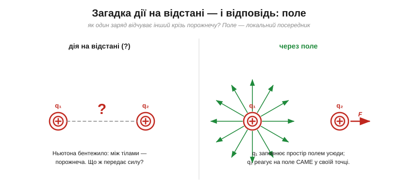
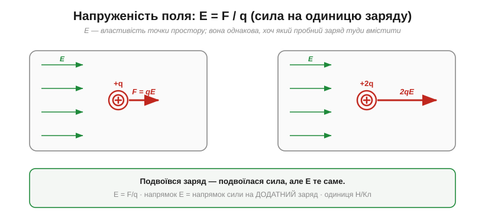
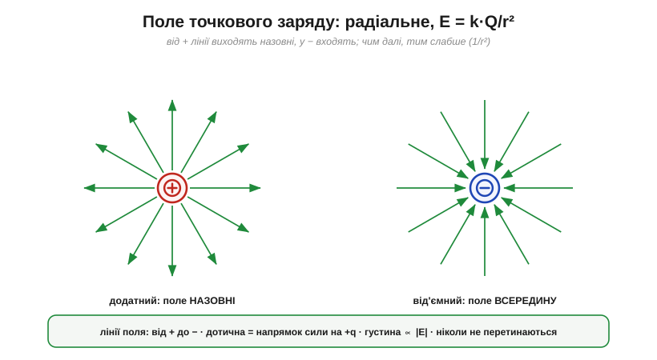
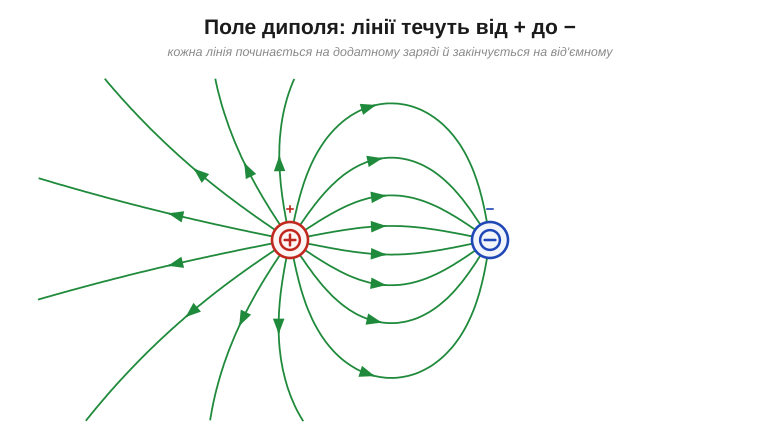
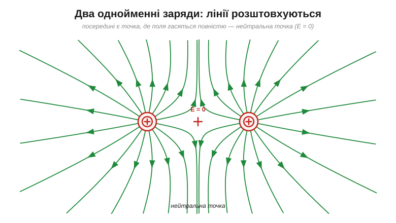
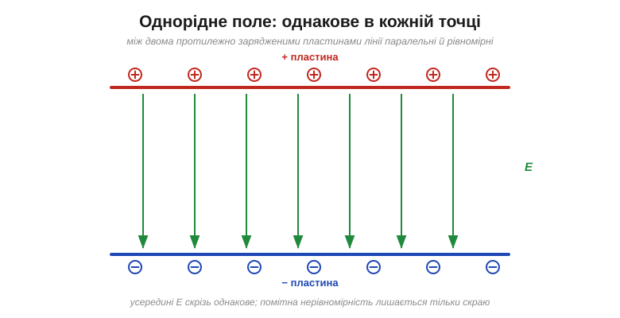
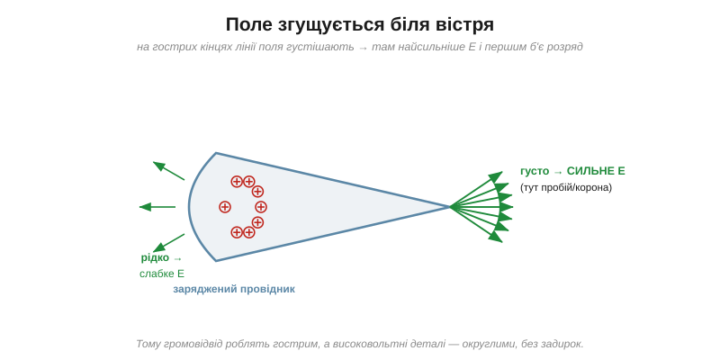

# Поле: посередник між зарядами

[Закон Кулона](root:ph-electromagnetism/coulomb-law) чудово рахує силу — але лишає без відповіді питання, яке непокоїло ще Ньютона (він казав про нього щодо тяжіння, та для електрики воно те саме). Два заряди притягуються чи відштовхуються **на відстані**, не торкаючись. Між ними — порожнеча. Звідки ж заряд *q₂* «знає», що десь поодаль є *q₁*? Невже він відчуває його **миттєво й безпосередньо** через ніщо? Ця ідея «дії на відстані» бентежила фізиків понад століття. Відповідь, яку зрештою знайшли, виявилася такою плідною, що нею описують тепер світло, радіо й усю електродинаміку. Ця відповідь — **поле**.


*Замість «миттєвої дії крізь порожнечу» вводять посередника: заряд *q₁* **змінює сам простір** навколо себе — створює поле в кожній точці. Інший заряд *q₂* не «тягнеться» до *q₁* напряму, а відчуває поле **локально**, там, де сам перебуває.*

### Що таке напруженість поля: E = F/q

Зробімо цю ідею кількісною. Помістимо в точку, що нас цікавить, маленький **пробний заряд** *q* і поміряймо силу *F*, що на нього діє. Сила залежить і від поля, і від самого *q*. Щоб дістати характеристику **тільки простору** (незалежну від того, що ми туди вмістили), поділимо силу на заряд:

```
E = F / q          (одиниця: Н/Кл)
```

Ця величина — **напруженість електричного поля** (*electric field*, **E**). Вона векторна: її напрямок — це напрямок сили на **додатний** пробний заряд. Сенс простий: поле каже, **яка сила припаде на кожен кулон заряду** в цій точці.


*Вмістимо в те саме поле заряд +q, потім +2q. Сила на другий удвічі більша (F = qE) — але відношення F/q однакове. Тому **E — властивість точки простору**, а не пробного заряду. Знаючи E, силу на будь-який заряд дістаємо одним множенням: F = qE.*

Звідси й зворотний, найкорисніший на практиці бік формули: якщо поле в точці відоме, то сила на вміщений туди заряд — просто **F = qE**. Поле ніби «чекає» в кожній точці, готове помножитися на заряд і дати силу. Важлива умова коректності: пробний заряд має бути **малим**, щоб своїм власним полем не зрушити заряди-джерела й не змінити те поле, яке ми міряємо.

Щоб відчути числа за цим Н/Кл: біля потертого об волосся гребінця поле сягає десь 10³–10⁴ Н/Кл; «поле гарної погоди» в атмосфері біля землі — близько 100 Н/Кл, напрямлене вниз; а щойно поле дотягує приблизно до 3×10⁶ Н/Кл, повітря не витримує й пробивається іскрою. Тобто між «ледь помітно» і «розряд» — лише кілька порядків величини.

### Поле точкового заряду

Тепер порахуймо поле, яке створює сам **точковий заряд Q**. Візьмімо закон Кулона для сили на пробний *q* на відстані *r* і поділімо на *q*:

```
E = F/q = (k·Q·q / r²) / q

E = k · Q / r²
```

Заряд *q* скоротився — і це чудово: поле справді **не залежить** від пробного заряду, лише від джерела *Q* і відстані *r*. Поле точкового заряду **радіальне**: від додатного — назовні, у від'ємний — усередину, і слабшає за тим самим законом оберненого квадрата.


*Поле додатного заряду напрямлене від нього, від'ємного — до нього; величина спадає як k·Q/r². Унизу — правила **ліній поля** (ліній сили): дотична до лінії показує напрямок поля, а їхня густина — його силу.*

> 🔧 **Навіщо це.** Поняття поля — це **мова, якою інженер думає про вплив** усюди в електроніці. Та є й цілком конкретний бік: коли напруженість поля в повітрі перевищує приблизно **3×10⁶ Н/Кл** (те саме значення, що й 3 кВ/мм), повітря **пробивається** — електрони зриваються з молекул, і проскакує іскра. Саме поле, а не «напруга сама по собі», вирішує, чи буде пробій. Тому на платах витримують зазори між доріжками, а у високовольтних вузлах — повітряні проміжки: щоб **E** ніде не дотягнувся до межі пробою.

**Приклад (поле точкового заряду).** Яке поле створює заряд Q = 1 нКл на відстані 3 см?

```
E = k · Q / r²
E = (8.99 × 10⁹) · (1 × 10⁻⁹) / (0.03)²
E = 8.99 / (9 × 10⁻⁴)
E ≈ 1.0 × 10⁴ Н/Кл
```

Тепер силу на будь-який заряд у цій точці знайти легко — помножити на нього. Наприклад, на заряд +5 нКл: F = qE = (5×10⁻⁹)·(1.0×10⁴) = 5×10⁻⁵ Н.

### Поле — реальність, а не лише зручність

Може здатися, що поле — просто зручна бухгалтерія: мовляв, насправді є тільки заряди й сили між ними, а «поле» ми домалювали для краси. Довго так і вважали. Та поступово стало ясно, що поле — **самостійна фізична сутність**, не менш реальна за самі заряди.

По-перше, поле існує в точці, **навіть якщо там нема жодного пробного заряду**, який його відчув би: простір довкола заряду вже «наладований», готовий подіяти на будь-кого, хто туди потрапить. По-друге — і це вирішальний доказ — зміни поля поширюються **не миттєво**. Якщо заряд-джерело раптом смикнути, віддалений заряд відчує це не одразу, а із запізненням: «новина» біжить простором зі скінченною швидкістю — тією самою, що й світло. А те, що передається й має швидкість, безперечно реальне; ба більше, у самому полі **запасено енергію** — заряджений [конденсатор](root:hw-components/capacitor) зберігає енергію саме в полі між обкладками, а не «в зарядах». Саме ця думка — що поле живе власним життям — згодом породить теорію світла й радіо.

### Лінії поля: винахід Фарадея

Малювати поле стрілкою в кожній точці незручно. Майкл Фарадей запропонував геніально наочний спосіб — **лінії поля** (*field lines*, або лінії сили): неперервні криві, дотична до яких у кожній точці дає напрямок поля. Їхні правила прості: лінії **починаються на додатних** зарядах (або приходять із нескінченності) і **закінчуються на від'ємних** (або йдуть у нескінченність); вони **ніколи не перетинаються** (бо в точці поле має один напрямок); а їхня **густина** показує силу поля — де лінії скупчені, поле сильне. Це можна сказати точніше: число ліній, що пронизують одиничний майданчик поперек, пропорційне до самого E — тому згущення ліній і означає сильніше поле, без жодних чисел на рисунку.

> 📜 Як палітурник, що ледь знав математику, «побачив» поле там, де інші бачили порожнечу, — у вставці [Фарадей — людина, що вигадала поле](root:ph-electromagnetism/electric-field/hist-faraday.md).

Найкорисніше, що поля **складаються за суперпозицією** — так само, як [складаються самі кулонівські сили](root:ph-electromagnetism/coulomb-law): поле кількох зарядів у точці є **векторною сумою** полів від кожного окремо. Звідси виростають характерні картини. Для пари «+ і −» (диполя) лінії пливуть від плюса до мінуса:


*Поле диполя: кожна лінія стартує на +, дугою огинає простір і входить у −. Саме так виглядає поле двох близьких протилежних зарядів — від молекули води до антени.*

**Приклад (складання полів у диполі).** Заряди Q₁ = +3 нКл і Q₂ = −3 нКл стоять за 6 см один від одного. Яке поле точно **посередині** між ними?

```
r = 3 см = 0.03 м  (до кожного від середини)
E₁ = k·Q₁/r² = (8.99×10⁹)(3×10⁻⁹)/(0.03)² ≈ 3.0×10⁴ Н/Кл   (від + → праворуч)
E₂ = k·|Q₂|/r² = те саме ≈ 3.0×10⁴ Н/Кл                      (до − → теж праворуч)

E = E₁ + E₂ ≈ 6.0×10⁴ Н/Кл   (напрямлене від + до −)
```

Тут поля від обох зарядів дивляться **в один бік** (від плюса до мінуса) і **додаються**. А коли б заряди були однойменні, у тій самій точці вони дивилися б назустріч — і відняли б одне одного аж до нуля.

Для двох **однойменних** зарядів лінії, навпаки, розштовхуються, і між ними з'являється особлива **нейтральна точка**, де поля гасяться повністю:


*Два однакові заряди: лінії взаємно відштовхуються. Точно посередині поля від обох рівні й протилежні — вони сумуються в **нуль** (E = 0). Це наочний приклад суперпозиції: сильні поля можуть давати нульову суму.*

### Однорідне поле

Особливо важливий випадок — **однорідне поле** (*uniform field*): однакове за величиною й напрямком у кожній точці. Його дають дві великі протилежно заряджені пластини: між ними лінії паралельні й рівномірні.


*Між двома протилежно зарядженими пластинами поле **однорідне** — паралельні рівновіддалені лінії від + до −. Помітне викривлення лишається тільки скраю. Це найпростіша для розрахунку конфігурація: сила на заряд усередині скрізь однакова.*

> 🔧 **Навіщо це.** Однорідне поле — це робоча конячка електроніки: саме так влаштовано поле всередині [конденсатора](root:hw-components/capacitor) і так відхиляють пучки заряджених частинок. Якщо поле однорідне, то й сила F = qE на заряд **стала** скрізь у проміжку — рахувати її легко, як рух тіла під сталою силою тяжіння.

### Поле біля провідників: чому вістря «колють»

Наостанок — важливий практичний факт. На зарядженому провіднику заряд (а з ним і поле біля поверхні) розподіляється **нерівномірно**: він скупчується на **гострих** виступах. А де густіший заряд — там і густіші лінії, тобто сильніше поле.

Та спершу зауважмо властивість, що випливає прямо з [рухливості вільних зарядів](root:ph-electromagnetism/electric-charge) у провіднику: **зовні біля поверхні провідника поле завжди перпендикулярне до неї**. Якби існувала складова поля **вздовж** поверхні, вона тягла б вільні заряди вбік — і ті ковзали б доти, доки своїм перерозподілом цілком не погасили б цю поздовжню складову. У рівновазі лишається тільки нормальна частина: лінії поля впираються в метал точно під прямим кутом. Тому форма провідника й диктує картину поля — а на вістрі, де поверхня круто згинається, лінії стискаються найтісніше.


*Біля гострого кінця провідника лінії поля скупчуються — там E найбільше. Саме тому повітря пробивається першим на вістрях (корона, розряд), а на округлих боках поле слабке.*

> 🔧 **Навіщо це.** Звідси два протилежні інженерні рішення з одного принципу. **Громовідвід** роблять **гострим** і високим — щоб посилене поле на вістрі зробило його **найімовірнішою точкою удару**: він перехоплює блискавку на себе й товстим проводом відводить її величезний струм безпечно в землю. (Громовідвід не «відганяє» блискавку, тихо стікаючи заряд короною, як колись гадали, — він саме **перехоплює** удар і дає струмові безпечний шлях повз будівлю.) А високовольтні деталі, навпаки, роблять **округлими**, без задирок і гострих кутів, щоб ніде не виникло локального сплеску поля й передчасного пробою. Побачивши на платі чи у вузлі загострений край під високою напругою — знайте: там перше місце, де «прострелить».

**Приклад (сила на електрон у полі пробою).** Яка сила діє на електрон у повітрі, де поле досягло межі пробою E ≈ 3×10⁶ Н/Кл?

```
F = q · E = e · E
F = (1.602 × 10⁻¹⁹) · (3 × 10⁶)
F ≈ 4.8 × 10⁻¹³ Н
```

Сила здається мізерною — але вона діє на електрон масою лише 9.1×10⁻³¹ кг, тож надає йому колосального прискорення й розганяє так, що він вибиває інші електрони. Так і починається лавина пробою.

---

Поле **E = F/q** — це посередник, що знімає загадку дії на відстані: заряд змінює простір довкола, а інші заряди реагують на поле **локально**, за правилом **F = qE**. Поле точкового заряду — радіальне, E = kQ/r²; поля **складаються векторно**; їх наочно показують **лінії Фарадея**; а біля вістрів поле згущується аж до пробою. Поле каже, **куди й з якою силою** воно штовхає заряд у кожній точці. Та коли заряд під дією цієї сили **рушає** — виконується робота, накопичується чи витрачається енергія; перехід від сили до енергії веде до поняття [електричного потенціалу](root:ph-electromagnetism/electric-potential).

---
