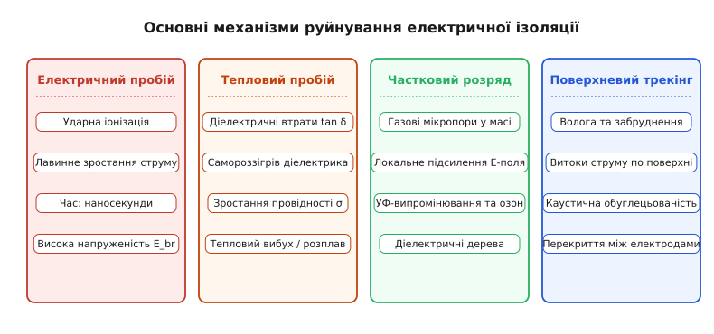
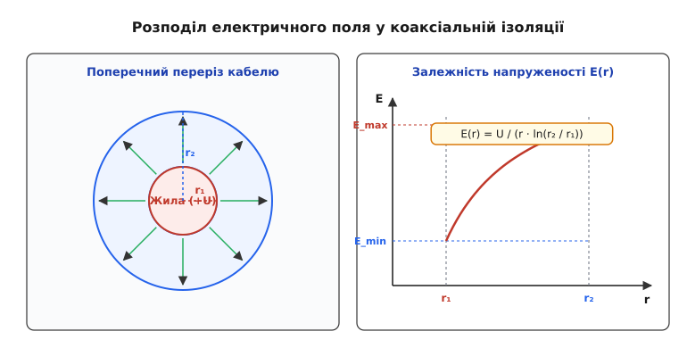
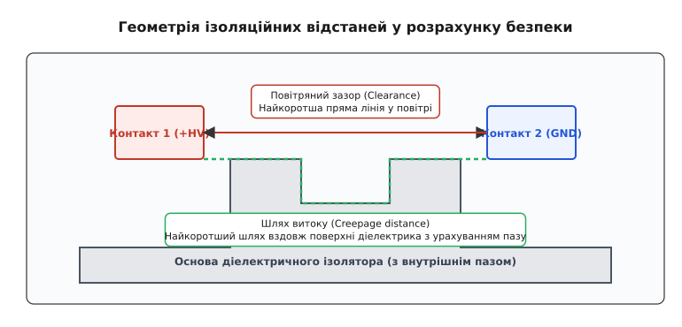

# Ізоляція провідників

<preknowlist>
- [Електричне поле](topic:ph-electromagnetism/electric-field) — напруженість полів та напруга між провідниками.
- [Провідники та діелектрики](topic:ph-condensed/conductors-insulators) — відмінність у вільних носіях заряду та механізмах поляризації.
- [Електричний потенціал](topic:ph-electromagnetism/electric-potential) — різниця потенціалів та розподіл напруженості електричного поля.
</preknowlist>

Коли між двома мідними шинами високовольтної підстанції з напругою 110 кіловольт або між близько розташованими доріжками друкованої плати силового інвертора виникає різниця потенціалів, електричне поле прагне створити струм провідності через середовище, що їх розділяє. Якщо напрямлена напруженість електричного поля перевищує критичну межу діелектричної міцності матеріалу або якщо волога й пил утворюють струмопровідний місток по поверхні, між провідниками спалахує електрична дуга з температурою понад 5000 градусів Цельсія. Метал жил миттєво випаровується, що призводить до катастрофічного короткого замикання, пожежі та повного руйнування електроустановки. Єдиним бар'єром, який запобігає цьому руйнуванню та забезпечує спрямований рух електричного заряду виключно заданим контуром, є електрична ізоляція провідників.

Термін «ізоляція» походить від латинського слова *insula* (острів) та означає процес перетворення провідника на фізично та електрично ізольований «острів», відрізаний від навколишнього середовища. Слово «діелектрик» утворене від грецького *діа-* (через, крізь) та *електрон* (бурштин), описуючи речовину, крізь яку може проникати електричне поле, але яка не допускає вільного перенесення електричного заряду. Фізична суть електричної ізоляції полягає у створенні між струмопровідними елементами діелектричного шар-бар'єра з нехтовно малою концентрацією вільних носіїв заряду, здатного тривалий час витримувати високі напруженості електричного поля без лавинного пробою та теплового руйнування.

## Фізика діелектричного бар'єра та механізми поляризації

На відміну від металевих провідників, у яких електронний газ вільно переміщується під дією найменшої різниці потенціалів, ізоляційні матеріали побудовані з атомів та молекул із міцно зв'язаними валентними електронами. Ширина забороненої зони таких речовин перевищує 4–9 електронвольт, тому за нормальних умов концентрація вільних електронів або іонів у діелектрику є прагнучою до нуля.

Коли ізоляційний матеріал потрапляє у зовнішнє електричне поле напруженістю `E`, зв'язані заряди всередині його атомів та молекул трохи зміщуються відносно своїх рівноважних положень. Це явище називається поляризацією діелектрика. Зміщення позитивних ядер та негативних електронних хмар утворює макроскопічний електричний дипольний момент. Кількісною мірою поляризації є вектор поляризованості `P`, який визначається як дипольний момент одиниці об'єму матеріалу.

На мікроскопічному рівні поляризованість створює зв'язані об'ємні заряди густиною `ρ_bound = -∇ · P` та зв'язані поверхневі заряди густиною `σ_bound = P · n`, де `n` — зовнішня нормаль до поверхні діелектрика. Зовнішнє електричне поле та поле поляризованих диполів діелектрика складаються, утворюючи вектор електричного зсуву (індукції) `D`:

```
D = ε_0 · E + P
= ε_0 · ε_r · E                  [зв'язок векторів через відносну проникність]
```

тут `ε_0 ≈ 8.854 · 10⁻¹²` Фарад на метр — електрична стала, а `ε_r` — відносна діелектрична проникність матеріалу.

Відносна діелектрична проникність `ε_r` показує, у скільки разів електричне поле всередині суцільного діелектрика слабше за поле у вакуумі при аналогічній густині вільних зарядів на електродах. Залежно від хімічної структури ізоляційного матеріалу у ньому діють п'ять фундаментальних механізмів поляризації:

1. **Електронна (оптична) поляризація.** Полягає у пружному зміщенні електронних хмар відносно атомних ядер. Вона властива абсолютно всім речовинам, виникає практично миттєво (за час порядка `10⁻¹⁵` секунди) і не залежить від температури. Електронна поляризація зберігає свою величину навіть на надвисоких частотах радіодіапазону та оптичних частотах.

2. **Іонна (атомна) поляризація.** Спостерігається в речовинах із кристалічною або іонною ґраткою (кераміка, слюда, оксиди металів). Під дією поля відбувається пружне зміщення різнойменно заряджених іонів у вузлах кристалічної ґратки. Час встановлення становить близько `10⁻¹³` секунди.

3. **Дипольна (орієнтаційна) поляризація.** Характерна для полярних діелектриків, молекули яких володіють власним постійним дипольним моментом за відсутності поля (вода, рідкі смоли, хаотично орієнтовані ланцюги полівінілхлориду). Зовнішнє поле намагається розвернути диполі вздовж силових ліній, чому протидіє хаотичний тепловий рух. Час релаксації становить від `10⁻¹¹` до `10⁻⁸` секунди. Дипольна поляризація суттєво залежить від температури та супроводжується втратами енергії (діелектричними втратами) на тертя між молекулами під дією змінної напруги.

4. **Міжповерхнева (міжфазна / Максвелла-Вагнера) поляризація.** Виникає у неоднорідних або шаруватих діелектриках (наприклад, папір, просочений оливою, або полімер із мікроскопічними включеннями вологи й наповнювачів). Вона зумовлена повільним переміщенням вільних іонів та домішок до меж розділу фаз під дією постійного або низькочастотного поля. Час встановлення становить від часток секунди до десятків хвилин.

5. **Сполітонна (сегнетоелектрична) поляризація.** Спостерігається у спеціальних сегнетоелектричних кераміках (титанат барію BaTiO₃, титанат-цирконат свинцю PZT). Вона пов'язана зі зміщенням межа доменів спонтанної поляризації і характеризується гігантськими значеннями проникності `ε_r ≈ 1000…10000`, але супроводжується вираженим гістерезисом і високими втратами.

Під дією синусоїдальної напруги з частотою `ω` відносна діелектрична проникність описується комплексним числом `ε* = ε' - j · ε''`, де дійсна частина `ε'` визначає ємність та накопичену енергію, а уявна частина `ε''` відповідає за розсіювання тепла. Відношення уявної частини до дійсної визначає тангенс кута діелектричних втрат `tan(δ) = ε'' / ε'`. Зв'язок між дійсною та уявною частинами на будь-якій частоті суворо підпорядковується інтегральним співвідношенням Крамерса-Кроніга.

Частотна дисперсія комплексної проникності визначається релаксаційною моделлю Дебая: при зростанні частоти поля полярні молекули не встигають розвертатися за зміною вектора `E`, внаслідок чого орієнтаційна поляризація вимикається, а діелектричні втрати проходять через характерний максимум на релаксаційній частоті `ω_rel = 1 / τ`.

Густина енергії `w`, накопиченої в електричному полі ізоляції, визначається квадратом напруженості поля:

```
w = (1 / 2) · ε_0 · ε' · E²
```

Для ефективного ізолятора важливо не лише накопичувати енергію поля без струму провідності, а й мати мінімальні діелектричні втрати `tan(δ)`. Величина `tan(δ)` описує співвідношення між активним струмом витоку (що перетворюється на тепло) та реактивним ємкісним струмом через діелектрик.

## Механізми руйнування та старіння ізоляції

Жоден реальний діелектрик не є ідеальним. У його об'ємі завжди присутня незначна кількість вільних іонів, що утворилися внаслідок теплової іонізації чи наявності технологічних домішок, а також мікроскопічні пори та волога. При подачі напруги `U` через ізоляцію протікає малий струм витоку `I_leak = U / R_ins`. Якщо напруженість поля зростає вище критичної межі `E_br`, відбувається незворотний діелектричний пробій — ізолятор втрачає свої властивості й перетворюється на провідник.

Статистичний розподіл ймовірності пробою `P_f(E)` при заданій напруженості електричного поля `E` описується двопараметричним розподілом Вейбулла:

```
P_f(E) = 1 - exp(-(E / η)^β)
```

де `η` — масштабний параметр діелектричної міцності (напруженість, при якій ламається 63.2% зразків), а `β` — параметр форми, що характеризує однорідність матеріалу та наявність дефектів.

Існує чотири основні фізичні механізми руйнування електричної ізоляції:

1. **Електричний (лавинний) пробій.** Виникає у чистих однорідних діелектриках за дуже короткий час (від пікосекунд до наносекунд), коли напруженість поля досягає значення `E_br` (для твердих полімерів — 20–100 кВ/мм). Поодинокі вільні електрони, що випадково з'являються в об'ємі діелектрика під дією космічних променів чи природної радіації, прискорюються електричним полем. У газах цей процес описується першим коефіцієнтом Таунсенда `α`, який показує кількість нових електронів, створюваних одним електроном на шляху в один сантиметр. Якщо коефіцієнт іонізації Таунсенда перевищує коефіцієнт прилипання електронів `η` (`α > η`), виникає лавиноподібне зростання кількості носіїв `N(x) = N_0 · exp((α - η) · x)`. Електронна лавина миттєво руйнує хімічні зв'язки полімеру й формує високопровідний плазмовий канал.

2. **Тепловий пробій.** Розвивається за відносно тривалий час (від секунд до годин) у результаті порушення теплової рівноваги. Під дією напруги в об'ємі діелектрика виділяється теплота внаслідок струму провідності та діелектричних втрат: `P_loss = ω · C · U² · tan(δ)`. Рівняння стаціонарного теплового балансу для ізоляційного шару товщиною `d` має вигляд:

```
V_ins · (σ_dc + ω · ε_0 · ε' · tan(δ)) · E² = k_th · A_surf · (T - T_amb)
```

Якщо швидкість виділення тепла перевищує відведення тепла через поверхню ізолятора у навколишнє середовище, температура діелектрика зростає. Оскільки питома провідність та тангенс втрат більшості ізоляторів зростають за експоненціальним законом Арреніуса-Фреліха `σ(T) = σ_0 · exp(α · (T - T_0))` при нагріванні, це викликає лавиноподібне зростання струму — тепловий вибух із розплавленням або обвугленням матеріалу.

3. **Частковий розряд (ЧР).** Виникає у твердій або рідкій ізоляції, яка містить мікроскопічні газові пори чи пухирці повітря. Оскільки відносна діелектрична проникність газу `ε_g ≈ 1` значно менша за проникність твердого полімеру `ε_r` (наприклад, для епоксидної смоли `ε_r ≈ 4`), напруженість електричного поля всередині газової пори `E_void` виявляється значно вищою за середнє поле в об'ємі:

```
E_void = (3 · ε_r / (2 · ε_r + 1)) · E_bulk
```

Оскільки електрична міцність газу в кілька разів нижча за міцність полімеру, у порі виникає мікроскопічний ікровий розряд, який не пробиває всю товщину ізоляції (звідси назва — частковий розряд). Проте тисячі часткових розрядів на секунду бомбардують стінки пори іонами, випромінюють ультрафіолет та утворюють озон. Спектральний аналіз фазово-розділених часткових розрядів (PRPD) показує виникнення імпульсів перезарядження ємності пори в окремих фазових вікнах прикладного синусоїдального сигналу. Це спричиняє повільну хімічну ерозію полімеру й проростання мікроскопічних каналів розгалуженої форми — діелектричних дерев (electrical treeing), які через кілька місяців чи років призводять до повного пробою.

4. **Електрохімічний трекінг та поверхневий пробій.** Розвивається на зовнішній поверхні твердих ізоляторів у западах пилу, вологи та промислових забруднень. Під дією напруги вздовж плівки вологи протікають витоки струму. Локальне випаровування води створює сухі зони з високою напруженістю поля, де спалахують мікродуги. Енергія дуги обвуглює органічний полімер, виділяючи чистий вуглець. На поверхні виникає провідна вуглецева доріжка (трек), яка поступово коротить ізоляційний зазор.

Окремою проблемою у високовольтних кабельних лініях постійного струму (HVDC) є інжекція та накопичення об'ємного заряду (space charge). При випробовуванні та тривалій роботі під постійною напругою електрони інжектуються з полупровідного екрана у товщу XLPE, створюючи локальні пакети об'ємного заряду. Ці заряди викривляють внутрішній розподіл поля, збільшуючи локальне поле `E` при інверсії полярності в 2–3 рази, що викликає раптовий пробій ізоляції.


*_Порівняння чотирьох фізичних механізмів руйнування діелектричного бар'єра._*

Тривале старіння ізоляції під сукупною дією електричного, термічного та механічного напружень описується статистичними моделями надійності. Згідно з теорією хімічної кінетики Дейкіна, швидкість термохімічної деструкції полімерних ланцюгів підпорядковується рівнянню Арреніуса. Оцінка терміну служби ізоляції `t_life` при комбінованому навантаженні описується моделлю степенного закону напруженості та температурної експоненти Ейрінга:

```
t_life = A · (E / E_0)⁻ⁿ · exp(E_a / (k_B · T))
```

де `n` — показник ступеня електричного старіння (для XLPE `n ≈ 9…12`), `E_a` — енергія активації термодеструкції, `k_B` — стала Больцмана.

Детальний історичний очерк створення ізоляційних матеріалів від перших шовкових обмоток та натуральної гутаперчі до сучасних зшитих полімерів та каптону подано у вставці [📜 Історія еволюції електричної ізоляції: від шовку та гутаперчі до XLPE та каптону](topic:ph-electromagnetism/electric-insulation/hist-insulation-evolution.md).

## Геометрія провідників і геометрична концентрація електричного поля

Надійності ізоляції визначає не лише середня напруженість поля `E_avg = U / d` (де `U` — напруга, `d` — товщина ізоляції), але й локальна максимальна напруженість `E_max`. Напруженість електричного поля розподіляється вкрай нерівномірно біля гострих країв, виступів, малих радіусів вигину провідників та мікроскопічних нерівностей струмопровідних жил.

Згідно з законами електростатики, біля випуклої поверхні провідника з радіусом кривини `r_c` локальна напруженість електричного поля пропорційна оберненому радіусу: `E ≈ U / r_c`. Чим менший радіус провідника або чим гостріший його край, тим сильніше концентруються силові лінії електричного поля, досягаючи межі пробою при значно менших загальних напругах. Крайовий ефект на прямокутній кромці друкованої доріжки створює локальне підсилення поля у 3–5 разів порівняно з плоскою ділянкою.

Для повітряних ліній електропередачі надвисокої напруги (330–750 кВ) проблема геометричної концентрації поля на поверхні дротів вирішується застосуванням розщеплених фаз. Замість одного товстого провідника фазу збирають із 3–5 паралельних дротів меншого перерізу, розташованих по колу за допомогою дистанційних розпірок. Це еквівалентно збільшенню ефективного радіуса провідника `r_eff`, що знижує напруженість поля біля поверхні дротів нижче межі виникнення коронного розряду у повітрі.

Класичним прикладом геометричної концентрації поля є коаксіальна кабельна структура: центральна кругла жила радіуса `r_1` оточена суцільним шаром ізоляції із зовнішнім радіусом `r_2` та покрита заземленим металевим екраном. Розподіл скалярного потенціалу `φ(r)` у такій системі задовольняє циліндричне рівняння Лапласа `∇² φ = 0`.

Інтегрування рівняння Лапласа в циліндричних координатах дає залежність напруженості електричного поля `E(r)` від радіальної відстані `r` до центру жили:

```
E(r) = U / (r · ln(r_2 / r_1))
```


*_Геометрія коаксіального кабелю та графік спадання напруженості електричного поля E(r) пропорційно 1/r._*

Найбільша напруженість поля `E_max` спостерігається безпосередньо на поверхні внутрішнього провідника при `r = r_1`:

```
E_max = U / (r_1 · ln(r_2 / r_1))
```

На зовнішній межі ізоляції біля заземленого екрана при `r = r_2` напруженість спадає до мінімуму `E_min`:

```
E_min = U / (r_2 · ln(r_2 / r_1))
```

Співвідношення між максимальним і мінімальним значеннями поля у товщі діелектрика дорівнює відношенню радіусів `E_max / E_min = r_2 / r_1`. Якщо зовнішній діаметр кабелю `2 · r_2` обмежений габаритами або вартістю, виникає запит: яким має бути радіус внутрішньої жили `r_1`, щоб поле на її поверхні `E_max` було найменшим можливим?

Для знаходження мінімуму диференціюємо вираз для `E_max` за змінною `r_1` та прирівнюємо похідну до нуля:

```
d/d r_1 [r_1 · ln(r_2 / r_1)] = 0
ln(r_2 / r_1) - 1 = 0
ln(r_2 / r_1) = 1
r_2 / r_1 = e ≈ 2.71828
```

Отже, математичний оптимум геометричного співвідношення радіусів коаксіального кабелю становить `r_2 / r_1 = e ≈ 2.718`. При цьому мінімально можлива напруженість поля на поверхні жили становить `E_max_opt = e · U / r_2`.

У високовольтній техніці для вирівнювання електричного поля застосовують спеціальні методи градації поля:

- **Геометрична (напівпровідна) градація.** Багатодротові кручені жилы силових кабелів покривають тонким шаром екструдованого поліетилену із додаванням сажі (вуглецю). Цей шар володіє помірною провідністю і згладжує виступи окремих дротин, перетворюючи шорстку поверхню на ідеально гладкий циліндр із рівномірним розподілом поля. На кінцях кабелів установлюють стрес-конуси (напрямні конуси з еластомеру), які плавно розширюють заземлений екран, усуваючи крайову концентрацію поля.
- **Ємкісна градація.** Застосовується у високовольтних вводах трансформаторів та вимикачів. Всередину оливопаперової ізоляції вкладають кілька концентричних обкладок із алюмінієвої фольги різної довжини. Це розбиває загальний діелектричний шар на серію послідовних ємностей одинакового номіналу, створюючи ідеально лінійний падіння потенціалу по товщині вводу.
- **Резистивна та заломлювальна градація.** У муфтах застосовують матеріали з нелінійною провідністю (на основі мікрокристалів оксиду цинку ZnO) або високою відносною проникністю `ε_r ≈ 12…15`. Вони перерозподіляють силові лінії поля у критичних зонах зрізу екрана.

Повний математичний вивід рівняння Лапласа, умови оптимальності геометрії та критерію теплового вибуху ізолятора наведено у вставці [🧮 Математична модель розподілу поля та пробою ізоляції](topic:ph-electromagnetism/electric-insulation/math-breakdown-field.md).

## Класифікація ізоляційних матеріалів та їхня конструктивна роль

За агрегатним станом ізоляційні матеріали поділяються на газоподібні, рідкі та тверді. Кожна група володіє унікальним поєднанням діелектричних, механічних та теплофізичних властивостей.

### Газоподібні діелектрики

Гази застосовуються для ізоляції відкритих повітряних ліній електропередачі, газонаповнених вимикачів та комплектних розподільчих пристроїв (КРУЕ).

- **Атмосферне повітря.** Найдешевший і найпоширеніший діелектрик з відносною проникністю `ε_r ≈ 1.0006`. За нормальних умов його діелектрична міцність становить близько 3.0 кВ/мм (для однорідного поля). Електрична міцність повітряного зазору підпорядковується закону Пашена: пробійна напруга `U_br = f(p · d)` залежить від добутку тиску газу `p` на відстань між електродами `d`. На кривій Пашена існує чіткий мінімум (для повітря близько 340 В при `p · d ≈ 0.7` мм·рт.ст.·см), нижче якого пробій потребує вищої напруги через недостатню кількість зіткнень електронів із молекулами.
- **Гексафторид сірки (SF₆, елегаз).** Важкий інертний газ без кольору та запаху із важкими електронегативними молекулами. Молекули SF₆ інтенсивно захоплюють вільні електрони, перетворюючись на малорухомі важкі негативні іони та запобігаючи розвитку електронних лавин. Пробійна міцність SF₆ у 2.5–3 рази вища за повітря, а здатність гасити електричну дугу — у 100 разів вища. Завдяки SF₆ високовольтні підстанції на 110–500 кВ вдається розміщувати у компактних закритих приміщеннях. Оскільки SF₆ визнано парниковим газом із потенціалом GWP ≈ 23 500, в сучасних розробках його замінюють сумішами фторорганічних нітрилів (C₄F₇N) із сухим повітрям чи азотом.

### Рідкі діелектрики

Рідкі діелектрики виконують подвійну функцію: просочують пористі тверді матеріали (папір, картон), заповнюючи газові порожнини та забезпечуючи високу діелектричну міцність, а також відводять тепло від нагрітих жил та осердь шляхом конвекції.

- **Мінеральні трансформаторні оливи.** Фракції нафтоперегонки, що складаються з суміші нафтенових та парафінових вуглеводнів. Володіють пробійною міцністю 15–25 кВ/мм та проникністю `ε_r ≈ 2.2`. Недоліки — горючість та гігроскопічність (поява навіть 0.01% води знижує електричну міцність у кілька разів). У процесі експлуатації під дією нагріву та кисню олива окислюється з утворенням шламів та кислих сполук. Стану трансформаторної оливи контролюють методом аналізу розчинених газів (DGA), де виявлення ацетилену (C₂H₂) свідчить про високовольтну дугу, а водню (H₂) та етану (C₂H₆) — про часткові розряди.
- **Синтетичні та натуральні ефіри.** Сучасна екологічна альтернатива мінеральним оливам на основі рослинних олій (рапсової, соєвої). Вони повністю біорозкладні, мають вищу температуру спалаху (> 300 °C) та здатні зв'язувати значну кількість вологості без втрати діелектричних властивостей.

### Тверді діелектрики та нанокомпозити

Тверді матеріали утворюють несучу основу більшості ізоляційних систем, забезпечуючи механічну міцність та жорстку фіксацію провідників у просторі.

- **Поліетилен високої щільності та зшитий поліетилен (XLPE).** XLPE володіє винятково низьким тангенсом втрат `tan(δ) ≈ 0.0004`, високою пробійною міцністю (понад 30 кВ/мм) і робочою температурою до +90 °C. Це основний матеріал силових кабелів середньої та високої напруги.
- **Політетрафторетилен (PTFE, тефлон).** Володіє рекордним діапазоном робочих температур (від -200 °C до +260 °C), граничною хімічною інертністю та найменшою серед твердих тіл проникністю `ε_r ≈ 2.1`. Застосовується у високочастотній та аерокосмічній техніці.
- **Поліімід (Kapton).** Випускається у вигляді тонких плівок із пробійною міцністю до 200 кВ/мм та робочою температурою до +400 °C. Незамінний для міжвиткової ізоляції тягових двигунів та гнучких друкованих плат.
- **Нанокомпозитні діелектрики.** Сучасний напрямок матеріалознавства, пов'язаний із додаванням у матрицю XLPE або епоксидної смоли 1–5% наночастинок оксиду кремнію (SiO₂), глинозему (Al₂O₃) або титанату (TiO₂). Наночастинки створюють пастки для вільних носіїв заряду, блокують утворення діелектричних дерев та підвищують пробійну міцність полімеру на 20–40%.
- **Композитна слюдяна ізоляція (слюдоленти).** Застосовується у високовольтних електричних машинах (генераторах ТЕС, ГЕС, АЕС). Слюдяні лусочки наклеюються на склотканину і просочуються епоксидними компаундами за допомогою вакуумно-напірного просочення (VPI). Вона витримує високі температурні навантаження (клас F та H) і є стійкою до часткових розрядів.
- **Алюмооксидна кераміка та фарфор.** Неорганічні діелектрики із робочою температурою понад 500–1000 °C. Фарфорові та скляні ізолятори застосовуються для опорних гірлянд ЛЕП, а кераміка з чистого Al₂O₃ (99.5%) — для вакуумних дугогасильних камер та прохідних ізоляторів силової електроніки.

Докладні нормативні таблиці температурних класів ізоляції (IEC 60085), фізико-хімічних параметрів матеріалів та колірного маркування жил наведено у вставці [📋 Довідник стандартів, температурних класів та характеристик ізоляції](topic:ph-electromagnetism/electric-insulation/api-insulation-standards.md).

## Нормування безпеки, ізоляційні відстані та діагностика

При конструюванні реальних електротехнічних пристроїв інженери розрізняють два види ізоляційних відстаней між струмопровідними деталями:

1. **Повітряний зазор (Clearance).** Найкоротша відстань між двома провідниками по прямій лінії у повітрі. Повітряний зазор розраховується на витримання максимальних комутаційних та грозових імпульсних перенапруг без іскрового пробою. Випробувальний грозовий імпульс нормується стандартом IEC 60060-1 формою хвилі 1.2/50 мікросекунд (час наростання фронту 1.2 мкс, час напівспаду 50 мкс).

2. **Шлях витоку (Creepage distance).** Найкоротша відстань між провідниками, виміряна вздовж зовнішньої поверхні твердого діелектрика. Шлях витоку завжди більший або дорівнює повітряному зазору. Для збільшення шляху витоку без збільшення габаритів приладу поверхню ізоляторів роблять ребристою або вирізають у платах спеціальні ізолюючі пази (слоти).


*_Відмінність між повітряним зазором (Clearance) та шляхом витоку (Creepage distance) уздовж рефракторних пазів ізолятора._*

Норми стандарту IEC 60664-1 задають мінімальні шляхи витоку залежно від робочої напруги, ступеня забруднення довкілля (Pollution Degree 1–4) та індексу трекінгостійкості матеріалу (CTI). Успішне проходження сертифікації за категоріями перенапруги (від CAT I для чутливої електроніки до CAT IV для вводу електромережі в будівлю) вимагає суворого дотримання цих геометрій.

Для оцінки стану ізоляції у процесі експлуатації та при сертифікаційних випробуваннях за стандартом ASTM D149 застосовують методи контролю без руйнування:

- **Вимірювання опору ізоляції `R_ins`.** Виконується за допомогою мегомметра при напрузі 500–5000 Вольт. Розраховують коефіцієнт абсорбції `DAR = R_60s / R_30s` та індекс поляризації `PI = R_10min / R_1min`. Значення `PI > 2.0` свідчить про суху та якісну ізоляцію, тоді як `PI < 1.5` вказує на зволоження та забруднення.
- **Вимірювання тангенса кута втрат `tan(δ)`.** Виконується високовольтним мостом Шеринга чи векторним аналізатором. Зростання `tan(δ)` свідчить про термохімічну деструкцію полімеру та зволоження.
- **Реєстрація часткових розрядів (IEC 60270).** За допомогою високочастотних трансформаторів струму (HFCT) та акустичних датчиків фіксують мікроімпульси струму амплітудою в кілька пікокулонів, визначаючи точне місце розташування пори чи діелектричного дерева задовго до аварійного пробою.
- **Випробування дуже низькою частотою (VLF, 0.1 Гц).** Використовується для високовольтних випробувань XLPE кабелів великої довжини. Використання частоти 0.1 Гц замість 50 Гц зменшує необхідну потужність випробувальної установки в 500 разів, не викликаючи небезпечного накопичення об'ємного заряду, яке виникає при випробуваннях постійним струмом (DC).

Готовий програмний модуль мовами C та C++ для автоматизованого розрахунку напруженості поля, ємності, опору та діелектричних втрат кабелю подано у вставці [⚙️ Обчислення параметрів та теплового режиму ізоляції](topic:ph-electromagnetism/electric-insulation/proj-insulation-calc.md).

> 🔧 **Навіщо це.**
> Розуміння фізики діелектричного бар'єра та критеріїв пробою є основою проектування надійних систем електроживлення, аерокосмічних джгутів та високовольтної електроніки. На друкованих платах силових інверторів (наприклад, для електромобілів із напругою батареї 800 Вольт) нехтування розрахунком шляху витоку призводить до виникнення поверхневих дуг під дією вологого конденсату. Для запобігання цьому інженери фрезерують повітряні пази між низьковольтною та високовольтною зонами під оптопарами та покривають плати силіконовим конформним лаком. При монтажі високовольтних кабелів нехтування екрануванням жил викликає часткові розряди на мікропорах, які повністю руйнують лінію за кілька місяців робочого навантаження. Дотримання температурних класів, правильний вибір геометрії провідників та регулярна діагностика індексу поляризації гарантують безперебійну роботу електричних мереж упродовж десятиліть.
