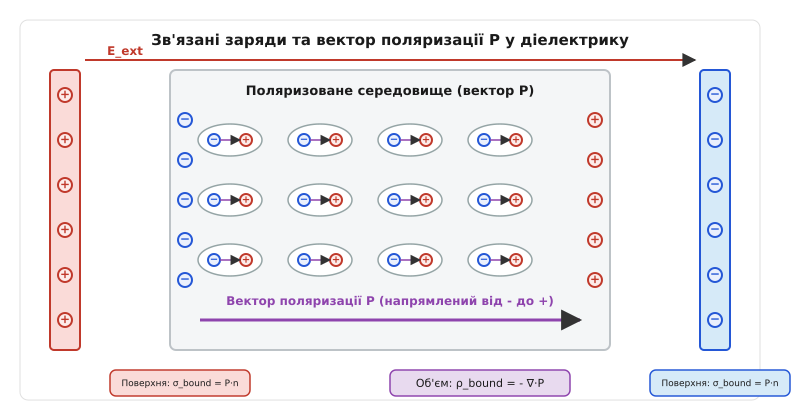
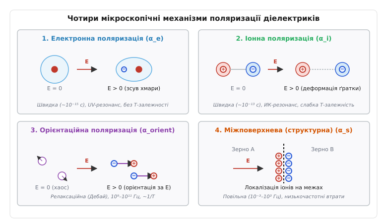
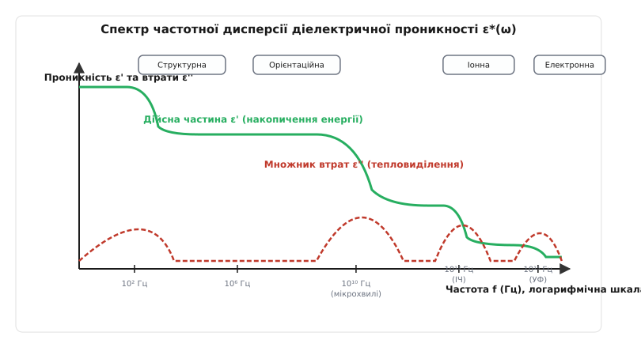

# Поляризація діелектрика

<preknowlist>
- [Електричний диполь](topic:ph-electromagnetism/electric-dipole-moment-and-field) — поняття дипольного моменту, взаємодія систем зарядів із зовнішнім полем.
- [Електричне поле](topic:ph-electromagnetism/electric-field) — напруженість E, фундаментальна силова характеристика дії на заряди.
- [Закон Кулона](topic:ph-electromagnetism/coulomb-law) — електростатична взаємодія точкових зарядів у вакуумі та речовині.
- [Закон Гаусса](topic:ph-electromagnetism/gauss-law) — потік напруженості через замкнену поверхню та концепція повного заряду.
- [Діелектрична проникність](topic:ph-electromagnetism/permittivity) — макроскопічна характеристика ослаблення поля середовищем.
</preknowlist>

Якщо вмістити пластину з чистого монокристалічного кварцю або блок суцільного поліетилену між металевими обкладками плоского конденсатора, підключеного до джерела постійної напруги 1000 вольт, електричний струм через пластину не потече. На відміну від провідників, ідеальні діелектрики (ізолятори) не містять вільних носіїв заряду — електронів провідності чи рухливих іонів, здатних вільно переміщатися на макроскопічні відстані під дією електростатичних сил. Проте електрична ємність конденсатора після введення ізолятора зростає у кілька разів, а виміряне всередині матеріалу результуюче електричне поле виявляється суттєво слабшим, ніж у порожньому повітряному зазорі.

Виникає фундаментальне фізичне питання: як матеріал із нульовою кількістю вільних носіїв струму реагує на зовнішнє електричне поле і куди зникає частина силової дії цього поля? Відповідь полягає у внутрішньоатомній перебудові речовини. Електричні заряди, що входять до складу нейтральних атомів, молекул та кристалічних ґраток, не залишають своїх мікроскопічних позицій, але зазнають макроскопічно помітних зміщень. Позитивно заряджені атомні ядра зміщуються за напрямком зовнішнього поля, негативно заряджені електронні хмари — проти напрямку поля, а полярні молекули, що володіють власними постійними дипольними моментами, розвертаються вздовж силових ліній.

Цей процес мікроскопічного зсуву зв'язаних зарядів та орієнтаційного упорядкування диполів під дією зовнішнього електричного поля називається **поляризацією діелектрика** (*electric polarization*, від грецького *polos* — вісь, полюс). Поляризація є основним механізмом, за допомогою якого дипольна структура речовини екранує зовнішнє поле та накопичує потенціальну енергію в електростатичних конденсаторах.

---

### 1. Вектор поляризації P та макроскопічна картина зв'язаних зарядів

Щоб кількісно описувати ступінь поляризації середовища у кожній довільній точці об'єму, виділяють макроскопічну характеристику — **вектор поляризації** `P` (або просто поляризованість середовища).

У мікроскопічному масштабі кожна представлена в діелектрику нейтральна молекула або атом під дією зовнішнього або внутрішнього поля набуває індукованого або має власний постійний електричний дипольний момент `p_i`. Якщо виділити макроскопічно малий, але мікроскопічно достатньо великий елемент об'єму `ΔV`, що містить мільйони молекул, вектор поляризації `P` визначається як векторна сума всіх дипольних моментів у цьому об'ємі, віднесена до величини самого об'єму:

```
P = lim_{ΔV → 0} (1 / ΔV) · ∑ p_i       [вектор поляризації, Кл/м²]
```

Одиницею вимірювання вектора поляризації в міжнародній системі одиниць SI є кулон на квадратний метр (`Кл/м²`). Розмірність вектора поляризації легко зрозуміти, якщо врахувати, що дипольний момент `p = q · d` вимірюється у `Кл · м`, а об'єм `V` — у `м³`. При діленні отримуємо `(Кл · м) / м³ = Кл / м²`, що повністю збігається з одиницею поверхневої густини електричного заряду.


*Формування поверхневих зв'язаних зарядів σ_bound та вектора поляризації P у плоскій пластині діелектрика під дією зовнішнього поля E_ext.*

При поляризації однорідного діелектрика позитивні та негативні кінці сусідніх вишикуваних диполів усередині матеріалу прилягають один до одного, утворюючи нейтральні ланцюжки. Сумарний заряд усередині довільного внутрішнього об'єму залишається рівним нулю. Проте на зовнішніх поверхнях діелектрика, що прилягають до металевих електродів, компенсація дипольних зарядів порушується:
- На поверхні, куди входить вектор поляризації `P`, виступають нескомпенсовані негативні кінці диполів.
- На протилежній поверхні, звідки вектор `P` виходить назовні, виступають нескомпенсовані позитивні кінці диполів.

Ці нескомпенсовані заряди називають **поверхневими зв'язаними зарядами** (*bound surface charges*). На відміну від **вільних зарядів** (*free charges*), які можна подати дріт від зовнішнього джерела живлення або переносити пучками частинок, зв'язані заряди утримуються усередині атомів фундаментальними кулонівськими силами і не здатні самостійно залишити поверхню матеріалу.

Густина поверхневого зв'язаного заряду `σ_bound` прямо дорівнює проекції вектора поляризації `P` на зовнішню одиничну нормаль `n` до поверхні діелектрика:

```
σ_bound = P · n = P · cos(θ)            [поверхневий зв'язаний заряд]
```

Якщо діелектрик поляризований нерівномірно (наприклад, у неоднорідному електричному полі, при наявності температурного градієнта або змінної густини матеріалу), компенсація зарядів порушується і всередині об'єму. Якщо з певної області витікає більше дипольних моментів, ніж входить, у цій області виникає надлишкова **об'ємна густина зв'язаного заряду** `ρ_bound`.

Математичний зв'язок між густиною об'ємного зв'язаного заряду та вектором поляризації описується оператором дивергенції зі знаком мінус:

```
ρ_bound = - ∇ · P                       [об'ємний зв'язаний заряд]
```

Фізичний зміст знака мінус у цій формулі полягає у наступному: якщо дивергенція `∇ · P > 0` (тобто вектори поляризації розходяться з даної точки середовища), це означає, що позитивні заряди диполів змістилися назовні, залишивши всередині цієї області нескомпенсований негативний об'ємний заряд `ρ_bound < 0`.

Повноцінний хронологічний розвиток експериментальних методів вимірювання зв'язаних зарядів та перших теорій поляризації описано в [історичному нарисі](topic:ph-electromagnetism/electric-polarization/hist-polarization.md).

---

### 2. Чотири мікроскопічні механізми поляризації

На мікроскопічному рівні діелектричний відгук речовини не є монолітним. Залежно від квантової будови атомів, характеру хімічних зв'язків та мобільності носіїв у середовищі розрізняють чотири фундаментальні механізми поляризації.


*Схематичне зображення чотирьох мікроскопічних механізми поляризації: електронного, іонного, орієнтаційного та міжповерхневого.*

#### 1. Електронна (деформаційна) поляризація
Електронна поляризація є універсальним механізмом, притаманним абсолютно всім атомам, іонам та молекулам без винятку. Під дією зовнішнього електричного поля `E` негативно заряджена електронна хмара атома зміщується відносно позитивно зарядженого атомного ядра на малу відстань `x` (близько `10⁻¹⁷ – 10⁻¹⁶` метра).

Зміщення електронної хмари зупиняється тоді, коли зовнішня електрична сила урівноважується внутрішньоатомною кулонівською силою притягання між зміщеним ядром та хмарою:

```
F_ext = q · E
F_coulomb = (q² / (4 · π · ε_0 · R³)) · x    [відновлювальна кулонівська сила]
```

Оскільки маса електрона надзвичайно мала (`9.1 · 10⁻³¹` кг), електронна поляризація відбувається практично миттєво — за час близько `10⁻¹⁵` секунди. Власні резонансні частоти коливань електронних хмар лежать у жорсткому ультрафіолетовому діапазоні спектра (`10¹⁵ – 10¹⁶` Гц). Завдяки такій високій швидкодії електронна поляризація зберігається на будь-яких радіочастотах аж до оптичного діапазону. Вона практично не залежить від температури середовища, оскільки енергія зв'язку електрона в атомі (кілька електронвольт) значно перевищує енергію теплових коливань `k_B · T` (`0.025` еВ при кімнатній температурі).

#### 2. Іонна (граткова) поляризація
Іонна поляризація спостерігається в кристалічних та аморфних речовинах із іонним або сильно полярним ковалентним зв'язком (наприклад, `NaCl`, `CsCl`, `Al₂O₃`, `SiO₂`). Під дією зовнішнього поля позитивні іони кристалічної ґратки зміщуються за напрямком поля, а негативні іони — проти напрямку поля.

Внаслідок цього іонні підґратки кристала деформуються, створюючи макроскопічний дипольний момент. Оскільки маси іонів у десятки тисяч разів більші за масу електронів, іонна поляризація є більш інерційною: час її встановлення становить близько `10⁻¹³ – 10⁻¹²` секунди, а власні резонансні частоти коливань ґратки лежать в інфрачервоному діапазоні (`10¹² – 10¹³` Гц). Вплив температури на іонну поляризованість `α_i` є відносно слабким і зумовлений переважно тепловим розширенням кристалічної ґратки.

#### 3. Орієнтаційна (дипольна) поляризація
Орієнтаційна поляризація виникає у полярних діелектриках — речовинах, молекули яких мають асиметричний розподіл електричного заряду і тому володіють власним постійним дипольним моментом `p_0` навіть за відсутності зовнішнього поля (наприклад, молекули води `H₂O`, спиртів, аміаку `NH₃`).

За відсутності електричного поля хаотичний тепловий рух повністю дезорієнтує вектори дипольних моментів молекул. Сумарний дипольний момент довільного об'єму дорівнює нулю. Коли ж на середовище діє зовнішнє поле `E`, на кожен диполь виникає обертальний момент сил `M = p_0 × E`, який намагається розвернути диполі паралельно до силових ліній поля.

Електричному впорядкуванню диполів протидіє хаотичний тепловий рух із середньою енергією `k_B · T`. Результуючий статистичний стан середовища описується канонічним розподілом Больцмана. У результаті статистичного усереднення орієнтаційна поляризованість молекули `α_orient` виявляється обернено пропорційною абсолютному температурі `T`:

```
α_orient = p_0² / (3 · k_B · T)          [формула Дебая для полярних молекул]
```

Орієнтаційний механізм є відносно повільним (релаксаційним), оскільки обертання полярних молекул у рідкому чи газоподібному середовищі супроводжується подоланням в'язкого тертя. Характерні часи релаксації `τ` становлять від `10⁻¹¹` до `10⁻⁷` секунди, через що орієнтаційна поляризація повністю «виморожується» на надвисоких частотах (НВЧ).

Математичний вивід функції Ланжевена та детальний вивід рівняння Дебая для температурної залежності наведено у [математичному виведенні](topic:ph-electromagnetism/electric-polarization/math-langevin-debye.md).

#### 4. Міжповерхнева (структурна / об'ємно-зарядова) поляризація
Міжповерхнева поляризація (ефект Максвелла — Вагнера) виникає у макроскопічно неоднорідних діелектричних системах: шаруватих композитах, полікристалічних кераміках із провідними межами зерен, пористих матеріалах із мокрими включеннями та пористому бетоні.

Повільні іони домішок або вільні носії заряду, присутні у слабопровідних фазах, під дією поля повільно дрейфують крізь товщу матеріалу і локалізуються на межах поділу фаз або на високаомічних кристалічних межах. Це створює макроскопічні об'ємні хмари локалізованого заряду, які викликають гігантські значення ефективної діелектричної проникності на низьких частотах. Це найповільніший механізм: часи встановлення становлять від мілісекунд до десятків секунд (`10⁻³ – 10³` Гц).

Полна мікроскопічна поляризованість атома чи молекули `α_total` складається з усіх механізмів, активних у даному частотному діапазоні:

```
α_total = α_e + α_i + α_orient + α_s     [загальна сумарна поляризованість]
```

---

### 3. Локальне поле Лоренца та співвідношення Клаузіуса — Моссотті

При обчисленні поляризації щільних рідин та кристалів неможна вважати, що на кожен атом діє середнє макроскопічне поле `E`. Сусідні поляризовані атоми самі створюють додаткові мікроскопічні поля.

Для обчислення дійсного **локального поля** `E_loc`, яке безпосередньо деформує електронну хмару конкретного атома, Гендрік Лоренц запропонував метод уявної сферичної порожнини. Якщо середовище є ізотропним, локальне поле Лоренца дорівнює:

```
E_loc = E + P / (3 · ε_0)               [локальне поле Лоренца у сферичній порожнині]
```

де `E` — середнє макроскопічне поле в діелектрику, а `P / (3 · ε_0)` — додаткове поле, створюване поляризованими диполями на поверхні уявної порожнини.

Зв'яжемо вектор поляризації `P` із поляризованістю однієї молекули `α` та локальним полем `E_loc` для `N` молекул в одиниці об'єму:

```
P = N · α · E_loc
  = N · α · (E + P / (3 · ε_0))         [поляризація через локальне поле]
```

Виразивши вектор поляризації `P` через макроскопічну сприйнятливість `P = ε_0 · (ε_r - 1) · E` та підставивши його у це рівняння, після алгебраїчних перетворень отримуємо знамениту **формулу Клаузіуса — Моссотті**:

```
(ε_r - 1) / (ε_r + 2) = (N / (3 · ε_0)) · α     [формула Клаузіуса — Моссотті]
```

Ця формула пов'язує макроскопічно вимірювану діелектричну проникність матеріалу `ε_r` із мікроскопічною поляризованістю окремого атома чи молекули `α`. Вона дає змогу обчислювати розміри атомів та електронних хмар за допомогою простих вимірювань ємності конденсаторів.

Однак у сильнополярних рідинах (наприклад, у рідкій воді) модель Лоренца зазнає краху, передбачаючи сегнетоелектричний катастрофічний перехід при кімнатній температурі, якого в реальності не відбувається. У 1936 році Ларс Онсагер модифікував теорію, розділивши локальне поле на орієнтуючу частину та поле реакції власних диполів, що дало змогу точно описувати полярні рідини.

---

### 4. Зв'язок векторів E, P, D та діелектрична сприйнятливість

У більшості ізотропних діелектриків у помірних електричних полях вектор поляризації `P` є прямо пропорційним результуючій напруженості електричного поля `E` у середовищі:

```
P = ε_0 · χ_e · E                        [закон лінійної поляризації]
```

Безрозмірний коефіцієнт `χ_e` називається **діелектричною сприйнятливістю** середовища (*electric susceptibility*, від латинського *susceptibilis* — сприйнятливий, чутливий). Діелектрична сприйнятливість `χ_e` характеризує чистий внутрішній відгук самої речовини на електричне поле.

Згадаймо фундаментальне визначення вектора електричного зсуву `D` (електричної індукції):

```
D = ε_0 · E + P                          [визначення вектора зсуву D]
```

Підставимо закон лінійної поляризації `P = ε_0 · χ_e · E` у це визначення:

```
D = ε_0 · E + ε_0 · χ_e · E
  = ε_0 · (1 + χ_e) · E
  = ε_0 · ε_r · E                        [зв'язок векторів D та E]
```

Порівнюючи коефіцієнти при векторі `E`, одержуємо точний співвідношення між відносною діелектричною проникністю `ε_r` та сприйнятливістю `χ_e`:

```
ε_r = 1 + χ_e                            [зв'язок проникності та сприйнятливості]
```

Одиничка в цій формулі описує внесок порожнього вакууму, а доданок `χ_e` — внесок поляризованої речовини.

```
┌─────────────────────────────────────────────────────────────────────────────┐
│              ФУНДАМЕНТАЛЬНА ТРІЙКА ВЕКТОРНИХ ПОЛІВ У РЕЧОВИНИ              │
├─────────────────┬──────────────────────────────────┬────────────────────────┤
│ Вектор          │ Фізичний зміст                   │ Джерела поля           │
├─────────────────┼──────────────────────────────────┼────────────────────────┤
│ Поле E (В/м)    │ Повна сила, що діє на точковий   │ Усі заряди             │
│                 │ пробний заряд у середовищі       │ (Q_free + Q_bound)     │
├─────────────────┼──────────────────────────────────┼────────────────────────┤
│ Вектор P (Кл/м²)│ Густина дипольного моменту,      │ Зміщення зв'язаних    │
│                 │ внутрішній відгук середовища     │ зарядів (Q_bound)      │
├─────────────────┼──────────────────────────────────┼────────────────────────┤
│ Вектор D (Кл/м²)│ Допоміжне поле, що пронизує      │ Тільки вільні заряди   │
│                 │ середовище безперервно           │ (Q_free на електродах) │
└─────────────────┴──────────────────────────────────┴────────────────────────┘
```

#### Анізотропні діелектрики та тензор сприйнятливості
У анізотропних кристалах (наприклад, у кварці, кальциті або ніобаті літію) кристалічна ґратка має різну жорсткість уздовж різних кристалографічних осей. Зміщення електронних хмар або іонів під дією поля відбувається нерівноцінно в різних напрямках. У таких середовищах вектор поляризації `P` не збігається за напрямком із вектором поля `E`.

Зв'язок між векторами описується за допомогою **тензора діелектричної сприйнятливості** `χ_ij` другого рангу:

```
P_x = ε_0 · (χ_xx · E_x + χ_xy · E_y + χ_xz · E_z)
P_y = ε_0 · (χ_yx · E_x + χ_yy · E_y + χ_yz · E_z)    [тензорна відповідь анізотропного середовища]
P_z = ε_0 · (χ_zx · E_x + χ_zy · E_y + χ_zz · E_z)
```

Анізотропія поляризації зумовлює важливі оптичні ефекти — подвійне променезаломлення світла, обертання площини поляризації та електрооптичні явища.

Порівняльну класифікацію та табличні значення параметрів для промислових діелектриків можна знайти у відповідному [довіднику матеріалів](topic:ph-electromagnetism/electric-polarization/comp-dielectric-materials.md).

---

### 5. П'єзоелектрика та піроелектричний ефект

У деяких кристалічних діелектриках зв'язок між поляризацією та зовнішніми впливами не обмежується лише прикладеною напругою. У кристалах, що не мають центра симетрії (20 із 32 кристалографічних точкових груп), спостерігається зв'язок між механічною деформацією та електричною поляризацією.

#### П'єзоелектричний ефект
П'єзоелектричний ефект (*piezoelectric effect*, від грецького *piezo* — стискати, тиснути) полягає у наступному:
1. **Прямий п'єзоефект:** при механічному стисненні чи розтягненні монокристала (наприклад, кварцю `SiO₂` або сегнетної солі) підґратки позитивних та негативних іонів зміщуються, створюючи макроскопічну поляризацію `P` та поверхневі заряди без прикладнення зовнішньої напруги.
2. **Зворотний п'єзоефект:** при прикладненні електричного поля `E` до кристала його кристалічна ґратка механічно деформується (стискається або видовжується).

П'єзоефект використовується в кварцевих резонаторах для стабілізації частоти в процесорах, п'єзоелектричних ультразвукових випромінювачах, датчиках тиску та п'єзозапальничках.

#### Піроелектричний ефект
У кристалах, що володіють спонтанною поляризацією (наприклад, турмалін або ніобат літію), вектори внутрішніх диполів природно вишикувані в одному напрямку. У звичайному стані поверхневий зв'язаний заряд повністю нейтралізований вільними іонами з повітря.

При зміні температури середовища `ΔT` амплітуда теплових коливань ґратки змінюється, що призводить до зміни макроскопічної поляризації `ΔP`. На поверхнях кристала виникає нескомпенсований електричний заряд. Це явище називають **піроелектричним ефектом** (*pyroelectric effect*, від грецького *pyr* — вогонь). Воно застосовується в інфрачервоних датчиках руху (PIR-сенсорах) та тепловізорах.

---

### 6. Динаміка поляризації, часова релаксація та частотна дисперсія

Якщо прикласти до діелектрика змінне гармонічне електричне поле з круговою частотою `ω`:

```
E(t) = E_0 · cos(ω · t)                  [змінне електричне поле]
```

вектор поляризації `P(t)` не здатний змінюватися миттєво. Через інерційність частинок та в'язке тертя поляризація відстає від змін поля на кут фазового зсуву `δ`:

```
P(t) = P_0 · cos(ω · t - δ)              [запізнення поляризації за фазою]
```

Для опису фазового запізнення в електродинаміці використовують **комплексну діелектричну проникність** `ε*(ω)`:

```
ε*(ω) = ε'(ω) - i · ε''(ω)               [комплексна діелектрична проникність]
```

Діюча та уявна частини проникності мають чіткий фізичний зміст:
1. **Дійсна частина `ε'(ω)`** описує здатність середовища накопичувати зворотну енергію поля за рахунок поляризації. Вона визначає ємність конденсаторів на даній частоті.
2. **Уявна частина `ε''(ω)`** (фактор втрат) описує незворотну дисипацію енергії поля в теплоту внаслідок в'язкого тертя зміщуваних зарядів.

Відношення уявної частини до дійсної визначає **тангенс кута діелектричних втрат** `tan δ`:

```
tan(δ) = ε''(ω) / ε'(ω)                  [тангенс кута втрат]
```

Питома теплова потужність `p_heat`, яка виділяється в одиниці об'єму діелектрика в змінному полі, описується формулою:

```
p_heat = 2 · π · f · ε_0 · ε_r · tan(δ) · E²    [теплова потужність діелектричних втрат, Вт/м³]
```

Оскільки виділення тепла пропорційне частоті `f` та квадрату напруженості поля `E²`, матеріали з великим тангенсом втрат (наприклад, полярні рідини чи High-k кераміка) піддаються інтенсивному саморозігріву у змінних полях.


*Спектральна залежність дійсної ε' та уявної ε'' частин діелектричної проникності від частоти у діапазоні від DC до УФ.*

На графіку частотної дисперсії чітко видно чотири області:
- **Область низьких частот (до 10³ Гц):** активні всі механізми. Дійсна частина `ε'` максимальна (статична проникність `ε_s`).
- **Область НВЧ (10⁹ – 10¹¹ Гц):** наступає дебаївська релаксація орієнтаційної поляризації. Полярні молекули не встигають розвертатися за змінним полем. Дійсна частина `ε'` спадає, а уявна частина `ε''` має максимум втрат.
- **Інфрачервона область (10¹² – 10¹³ Гц):** резонансне «виморожування» іонної поляризації з кривою аномальної дисперсії.
- **Ультрафіолетова область (10¹⁵ – 10¹⁶ Гц):** оптичний резонанс електронної поляризації. На частотах, вищих за УФ, навіть електрони не реагують на поле, і діелектрична проникність прямує до вакуумного значення `ε' → 1`.

Для прозорих діелектриків у оптичному діапазоні виконується **співвідношення Максвелла**, що пов'язує показник заломлення світла `n` із діелектричною проникністю:

```
n² ≈ ε_r(ω_opt)                         [формула Максвелла для оптики]
```

Чисельну реалізацію симуляції релаксації Дебая та розрахунок втрат наведено у [проєктному модулі](topic:ph-electromagnetism/electric-polarization/proj-polarization-sim.md).

---

### 7. Нелінійна поляризація, насичення диполів та сегнетоелектрика

У сильних електричних полях (понад `10⁶` В/м), створюваних лазерними імпульсами або у нанорозмірних діелектричних плівках, закон лінійної поляризації `P = ε_0 · χ_e · E` перестає справджуватися. Вектор поляризації розкладають у степеневий ряд:

```
P = ε_0 · (χ_1 · E + χ_2 · E² + χ_3 · E³ + ...)    [нелінійний розклад поляризації]
```

де `χ_1` — лінійна сприйнятливість, а `χ_2`, `χ_3` — нелінійні сприйнятливості. Нелінійна поляризація є основою **нелінійної оптики**: вона дає змогу генерувати другу гармоніку світла та керувати оптичними сигналами електричним полем.

#### Ефект насичення поляризації
У полярних діелектриках при збільшенні поля виникає **ефект насичення**: коли абсолютно всі полярні молекули вишикувалися паралельно до поля, подальше збільшення напруженості `E` не здатне збільшити орієнтаційну поляризацію. Вектор `P` виходить на плато насичення `P_sat`.

#### Сегнетоелектричний гістерезис
Особливим класом поляризації є **сегнетоелектрика** (*ferroelectricity*). У таких кристалах (наприклад, у титанаті барію `BaTiO₃`) існує **спонтанна поляризація** — внутрішня впорядкованість диполів виникає самочинно без зовнішнього поля `E = 0`.

Усередині сегнетоелектрика утворюються **домени** — мікроскопічні області зі спонтанною поляризацією. При переполяризації сегнетоелектрика зовнішнім полем спостерігається петля **гістерезису** (*hysteresis*, від грецького *hysteresis* — запізнення):

```
                       P (Поляризація)
                          ^
                          │     ,--- P_sat (Насичення)
                          │    /
                    P_r --┼---/ (Залишкова поляризація)
                          │  /
                          │ /
     -E_c ◄───────────────┼───────────────► E (Поле)
    (Коерцитивне поле)   /│
                        / │
                       /  │-- -P_r
                      /   │
                     '----+
                          │
```

Залежність `P(E)` має дві ключові характеристики:
1. **Залишкова поляризація `P_r`** (*remanent polarization*): значення поляризації при `E = 0`, яке використовується у сегнетоелектричній пам'яті (FeRAM).
2. **Коерцитивне поле `E_c`** (*coercive field*): напруженість поля, необхідна для повного розполяризації кристала до `P = 0`.

При нагріванні сегнетоелектрика вище **точки Кюрі `T_c`** спонтанна поляризація руйнується, і кристал переходить у параелектричний стан, де сприйнятливість описується законом Кюрі — Вейсса:

```
χ_e = C / (T - T_c)                      [закон Кюрі — Вейсса]
```

Таким чином, поляризація діелектрика є фундаментальним фізичним явищем, яке простягається від найпростішого зсуву електронних хмар у поодинокому атомі до доменних динамічних перебудов у сегнетоелектричних матрицях.
