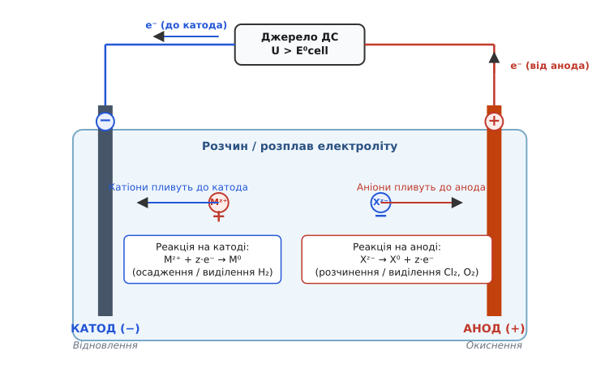
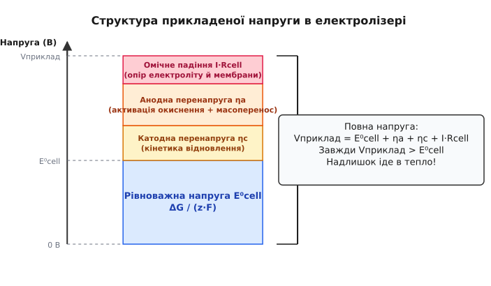
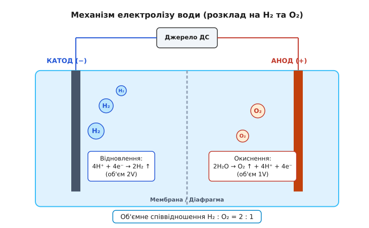
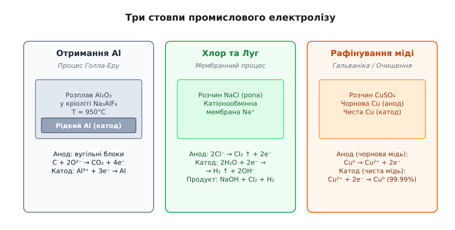

# Електроліз: хімічні перетворення під дією струму

<preknowlist>
- [Іонна провідність](topic:ph-electromagnetism/ionic-conduction) — рух іонів обох знаків у розчинах та розплавах під дією електричного поля.
- [Електричний струм](topic:ph-electromagnetism/electric-current) — темп перенесення заряду, кулони за секунду крізь переріз.
- [Різниця потенціалів](topic:ph-electromagnetism/voltage) — робота з переміщення одиничного заряду між двома точками.
- [Закон Кулона](topic:ph-electromagnetism/coulomb-law) — сила взаємодії між електричними зарядами.
</preknowlist>

Якщо розплавити звичайну кухонну сіль за температури `801°C` і занурити туди два вугільні електроди, підключені до джерела постійного струму напругою кілька вольт, очима можна побачити дивовижну хімічну трансформацію. На одному з електродів починає бурхливо виділятися задушливий зеленкувато-жовтий газ — хлор `Cl₂`, а біля другого збирається срібляста рідка маса чистого активного металу — натрію `Na`. Речовина, яка щойно була стабільною прозорою сіллю, під дією електрики розпадається на свої первинні елементи. Електричний струм тут виступає не просто як носій енергії, що нагріває провідник, а як потужний хімічний реагент, здатний розривати міцні міжатомні зв'язки й примушувати реакції текти у зворотному, природно неможливому напрямку. Цей процес називають **електролізом**.

## Від іонного струму до хімічного розпаду

У [металевому провіднику](topic:ph-electromagnetism/electric-current) струм протікає без жодної зміни самого металу: електрони вільно ковзають крізь кристалічну ґратку, і мідний чи алюмінієвий дріт після проходження мільйонів кулонів заряду лишається мідним чи алюмінієвим. У розчинах та розплавах [струм несуть іони](topic:ph-electromagnetism/ionic-conduction). Поки іон пливе у товщі рідини, з ним нічого не відбувається: додатний іон (катіон) ковзає в один бік, від'ємний (аніон) — в інший. Проте вся картина кардинально змінюється, коли іон допливає до межі розділу — до поверхні твердого металевого чи графітового електрода.

На цій межі зустрічаються два принципово різні світи: світ **електронної провідності** (металевий дріт) і світ **іонної провідності** (електроліт). Електрон не може вільно вийти у воду чи розплав у вигляді вільної частинки, а важкий іон не може перестрибнути в металеву ґратку. Щоб коло не розірвалося і струм продовжив текти, на межі «електрод–електроліт» мусить відбутися **окисно-відновна реакція** (гетерогенний перенос заряду).

Іон, що наблизився до від'ємного електрода, змушений прийняти від нього електрони, а іон біля додатного електрода — віддати свої електрони металу. Втрачаючи або отримуючи заряд, іон перетворюється на нейтральний атом чи молекулу. Хімічне перетворення речовини на електродах під дією зовнішнього електричного струму й становить фізичну суть **електролізу** (від грец. ἤλεκτρον «бурштин, електрика» + λύσις «розклад, розщеплення»).

## Анатомія електролітичної комірки та міжфазний перехід

Пристрій, у якому здійснюється електроліз, називають **електролітичною коміркою** або **електролізером**. За своєю будовою він протилежний хімічному джерелу струму ([гальванічному елементу](topic:ph-electromagnetism/ionic-conduction)).

У гальванічному елементі хімічна реакція протікає самочинно і виробляє електричний струм, перетворюючи хімічну енергію на електричну. В електролізері, навпаки, зовнішнє джерело постійного струму виконує роботу проти сил хімічної спорідненості й примусово рухає реакцію, перетворюючи електричну енергію на хімічну.


*На катоді (−) катіони відновлюються, отримуючи електрони; на аноді (+) аніони окиснюються, віддаючи електрони. Зовнішнє джерело струму виконує роботу проти хімічного потенціалу.*

Для опису процесів у комірці використовують строго визначену термінологію:

- **Катод** (від грец. κατά «вниз» + ὁδός «шлях» — шлях донизу, де електрони «сходять» у розчин) — електрод, підключений до **від'ємного** полюса джерела живлення. На катоді завжди відбувається процес **відновлення** (приєднання електронів носіями заряду):
```
Mᶻ⁺ + z·e⁻ → M⁰
```
- **Анод** (від грец. ἀνά «вгору» + ὁδός «шлях» — шлях вгору, куди електрони «піднімаються» з розчину) — електрод, підключений до **додатного** полюса джерела живлення. На аноді завжди відбувається процес **окиснення** (віддавання електронів металу):
```
Xᶻ⁻ → X⁰ + z·e⁻
```

Назви іонів чітко зв'язані з тими електродами, до яких вони мандрують у полі: додатні іони пливуть до катода і тому називаються **катіонами**, від'ємні іони пливуть до анода і називаються **аніонами**.

### Структура подвійного електричного шару (модель Штерна)

Безпосередній перехід заряду на межі електрода розгортається у надзвичайно вузькому міжфазному шарі товщиною в кілька нанометрів — **подвійному електричному шарі** (ПЕШ). Згідно з сучасною моделлю Гуї-Чапмана-Штерна, ПЕШ складається з двох шарів:

1. **Внутрішній шар Гельмгольца (ВШГ)** — шар орієнтованих диполів розчинника та частково дегідратованих іонів, що адсорбовані безпосередньо на поверхні металу.
2. **Зовнішній шар Гельмгольца (ЗШГ) та дифузний шар** — шар гідратованих іонів, які притягуються електростатично, але здійснюють тепловий рух.

Прикладена зовнішня напруга створює у цьому мікроскопічному зазорі товщиною `0.5–2.0 нм` гігантську напруженість електричного поля (порядку `10⁸ В/м`). Саме ця колосальна полева напруженість деформує електронні хмари іонів, знижує енергію активації і дозволяє електронам тунелювати крізь потенціальний бар'єр між металом і розчином.

## Кількісні закони Фарадея: від заряду до маси

У 1833–1834 роках англійський фізик Майкл Фарадей відкрив точні кількісні закони, які пов'язали кількість електрики, що пройшла крізь електроліт, із масою речовини, що виділилася на електродах.

Фізична ідея законів Фарадея вражає своєю елегантністю й простотою: оскільки кожен іон для свого нейтралізування потребує строго визначеного числа електронів `z` (валентності іона), то **загальна маса виділеної речовини визначається сумарною кількістю пропущених електронів**.

### Перший закон Фарадея

Маса `m` речовини, що осаджується або виділяється на електроді під час електролізу, прямо пропорційна електричному заряду `q`, який пройшов крізь електроліт:

```
m = k · q = k · I · t
```

де `I` — сила струму (А), `t` — час тривання електролізу (с), а `k` — **електрохімічний еквівалент** речовини (маса речовини у грамах чи кілограмах, що виділяється при проходженні 1 Кулона заряду).

### Другий закон Фарадея

Електрохімічні еквіваленти `k` різних речовин прямо пропорційні їхнім хімічним еквівалентам — відношенню молярної маси `M` до валентності `z` (заряду іона):

```
k = (1 / F) · (M / z)
```

де `F` — універсальна **стала Фарадея**, яка дорівнює добутку елементарного заряду електрона `e` на число Авогадро `N[A]`:

```
F = e · N[A] 
  = (1.60217663 × 10⁻¹⁹ Кл) · (6.02214076 × 10²³ моль⁻¹) 
  ≈ 96485.33 Кл/моль
```

Фізичний зміст сталої Фарадея простий: **`F` — це електричний заряд одного моля одновалентних іонів (або одного моля електронів)**.

### Об'єднаний закон Фарадея

Об'єднуючи обидва закони в єдину формулу, отримуємо головне рівняння для розрахунку електролізу:

```
m = (M · I · t) / (z · F)
```

> 📜 Детально про те, як Фарадей уперше в історії виміряв кількісний зв'язок між електрикою й матерією, та як його досліди підвели фізику до відкриття електрона: вставка [Відкриття законів електролізу](topic:ph-electromagnetism/electrolysis/hist-faraday-laws.md).

> 🧮 Повний математичний вивід законів Фарадея, розрахунок об'ємів газу, концентраційних зсувів потенціалу за рівнянням Нернста та питомої витрати енергії: вставка [Математичний розрахунок електролізу](topic:ph-electromagnetism/electrolysis/math-faraday-electrolysis.md).

## Енергетичний бар'єр: термодинаміка, перенапруга й омічні втрати

Щоб розкласти сполуку на елементи, недостатньо подати до електродів будь-яку, як завгодно малу напругу. Для кожного хімічного процесу існує порогова **термодинамічна напруга розкладу** `E⁰[cell]`.

Згідно з законами термодинаміки, мінімальна робота, яку необхідно виконати для здійснення несамочинної реакції, дорівнює зміні вільної енергії Гіббса `ΔG`. Оскільки робота електричного поля з перенесення заряду `q = z·F` дорівнює `z·F·E⁰[cell]`, отримуємо зв'язок:

```
ΔG = z · F · E⁰[cell]
```

Термодинамічна напруга обчислюється як різниця рівноважних електродних потенціалів анода й катода:

```
E⁰[cell] = E⁰[anode] - E⁰[cathode]
```

Проте якщо прикласти до електродів напругу, що точно дорівнює `E⁰[cell]`, струм у колі дорівнюватиме нулю: система перебуватиме у стану рівноваги. Щоб отримати реальний струм і високу швидкість виділення продуктів, прикладена зовнішня напруга `V[applied]` повинна бути **значно більшою за рівноважну**.


*Складники робочої напруги електролізера: рівноважна термодинамічна різниця потенціалів, анодна й катодна перенапруги та омічне падіння напруги у товщі електроліту.*

Повна напруга, яку має забезпечити джерело живлення, розкладається на чотири доданки:

```
V[applied] = E⁰[cell] + η[anode] + η[cathode] + I · R[cell]
```

1. **`E⁰[cell]` (термодинамічний потенціал розкладу)** — мінімальна енергія, що йде безпосередньо на розрив хімічних зв'язків.
2. **`η[anode]` (анодна перенапруга)** — додаткова напруга, необхідна для подолання кінетичного бар'єра реакції окиснення на поверхні анода.
3. **`η[cathode]` (катодна перенапруга)** — додаткова напруга для подолання кінетичного бар'єра відновлення на катоді.
4. **`I · R[cell]` (омічне падіння напруги)** — втрати на проходження струму `I` крізь внутрішній опір електроліту `R[cell]`, роздільну мембрану та підвідні контакти.

Перенапруга `η` виникає через те, що хімічні стадії (десорбція газу, утворення нової кристалічної ґратки, тунелювання електронів) мають власну енергію активації. Перенапруга зростає з логарифмом густини струму згідно з **рівнянням Тафеля**: `η = a + b · lg(j)`.

Уся надлишкова напруга `(V[applied] - E⁰[cell])` не бере участі в хімічному розкладі, а безповоротно перетворюється на Джоулеве тепло (`Q = I² · R · t`), розігріваючи ванну.

## Конкуренція реакцій та електроліз у водних розчинах

Коли електроліз проводять у розплавах чистих солей (наприклад, розплав `NaCl`), вибір продуктів однозначний: на катоді відновлюється єдиний доступний катіон `Na⁺`, на аноді окиснюється аніон `Cl⁻`. Проте у водних розчинах ситуація ускладнюється: крім розчинених іонів солі, у системі присутні молекули самої води `H₂O` та іони `H⁺` і `OH⁻`, утворені її самодисоціацією.

Вода сама по собі може брати участь в електрохімічних реакціях:
- **На катоді (відновлення води з виділенням водню):**
```
2H₂O + 2e⁻ → H₂ ↑ + 2OH⁻      [E⁰ = -0.83 В при pH 7]
```
- **На аноді (окиснення води з виділенням кисню):**
```
2H₂O → O₂ ↑ + 4H⁺ + 4e⁻       [E⁰ = +1.23 В при pH 7]
```

Коли у розчині присутні кілька різних іонів, на електроді **в першу чергу протікає та реакція, яка потребує найменшої витрати енергії**:
- На катоді першим відновлюється катіон із **найбільш додатним** (або найменш від'ємним) відновним потенціалом.
- На аноді першим окиснюється аніон із **найменш додатним** (найбільш від'ємним) потенціалом.


*Розклад води на водень та кисень: катодне відновлення протонів і анодне окиснення води з урахуванням кінетичних перенапруг.*

### Правила розряджання іонів на катоді у водному розчині

За стандартними відновниками потенціалами `E⁰` метали можна розділити на три групи:

1. **Активні метали (від `Li` до `Al` включно, `E⁰ < -1.18 В`)**: їхні катіони мають занадто від'ємний потенціал. У водних розчинах катіони `Na⁺`, `K⁺`, `Ca²⁺`, `Al³⁺` **ніколи не відновлюються** на катоді — замість них відновлюється вода з виділенням газу водню `H₂`. Щоб отримати металевий натрій чи алюміній, електроліз проводять виключно у розплавах солей.
2. **Метали середньої активності (від `Mn` до `H₂`, `-1.18 В < E⁰ < 0 В`)**: катіони `Zn²⁺`, `Fe²⁺`, `Ni²⁺`, `Cr³⁺` відновлюються на катоді **одночасно з виділенням водню**.
3. **Неактивні шляхетні метали (після водню `H₂`, `Cu`, `Ag`, `Pt`, `Au`, `E⁰ > 0 В`)**: катіони відновлюються на катоді **в першу чергу**, а водень практично не виділяється.

### Правила розряджання іонів на аноді

1. **Безоксигенові аніони (`Cl⁻`, `Br⁻`, `I⁻`, `S²⁻`)**: легко окиснюються на аноді з виділенням відповідних простих речовин (`Cl₂`, `Br₂`, `I₂`).
2. **Оксигенові аніони (`SO₄²⁻`, `NO₃⁻`, `PO₄³⁻`, `F⁻`)**: центральний атом атома оксигену тримає електрони надзвичайно міцно. Цей клас аніонів у воді **не окиснюється** — замість них на аноді окиснюється вода з виділенням кисню `O₂`.

### Кінетичний аномалізм: Хлор проти Кисню

Термодинамічно відновний потенціал окиснення води (`+1.23 В`) є нижчим за потенціал окиснення хлорид-іона `Cl⁻` (`+1.36 В`). Здавалося б, при електролізі розчину кухонної солі `NaCl` на аноді мав би виділятися кисень.

Проте на реальних електродах (особливо на графіті та оксидно-рутенієвих анодах) **перенапруга виділення кисню `η[O₂]` є величезною** (понад `0.5 В`), тоді як перенапруга виділення хлору `η[Cl₂]` є мізерною. Кінетичний гальмовий бар'єр для кисню виявляється настільки високим, що потенціал виділення кисню зсувається вправо (`1.23 + 0.5 = 1.73 В`), і на аноді практично зі 100% виходом виділяється саме хлор `Cl₂`. Це явище покладено в основу всієї світової хлорно-лужної промисловості.

## Еволюція промислових електролітичних технологій

Історія інженерного розгортання електролізу — це шлях безперервної боротьби за підвищення енергетичної ефективності та вилучення шкідливих побічних речовин. Особливо яскраво ця еволюція простежується на прикладі **трипоколінного розвитку хлорно-лужного виробництва**:

### 1. Ртутний процес (Кастнера-Келлнера) — Перше покоління
У ртутних комірках катодом слугував рідкий шар ртуті `Hg`, що безперервно прокачувався по похилому дну реактора. Завдяки велетенській перенапрузі водню на ртуті (`> 1.0 В`), на катоді розряджалися іони `Na⁺` з утворенням рідкого амальгаму натрію `Na(Hg)`. Амальгам перекачувався в окремий реактор (деструктор), де реагував із водою з утворенням надчистого `NaOH` та `H₂`.
- *Ніша та недоліки*: процес давав високу чистоту, але вимагав колосальних витрат енергії і спричиняв витоки ртуті в довкілля (трагедія Мінамата у Японії), що призвело до повної заборони ртутного електролізу міжнародними конвенціями.

### 2. Діафрагмовий процес — Друге покоління
Анодний і катодний простори розділяли пористою асбестовою діафрагмою. Розчин солі `NaCl` фільтрувався крізь діафрагму від анода до катода, що запобігало змішуванню виділеного хлору й водню.
- *Ніша та недоліки*: діафрагмовий вихід містив значні домішки солі `NaCl` (12% `NaOH` + 15% `NaCl`), вимагаючи великих витрат енергії на випаровування та кристалізацію надлишку солі.

### 3. Мембранний процес (Nafion) — Сучасний стандарт
Анодний та катодний простори розділено високоселективною катіонообмінною мембраною з сульфованого фторопласту. Мембрана вільно пропускає іони `Na⁺`, але є абсолютно непроникною для аніонів `Cl⁻` та `OH⁻`.
- *Переваги*: установка виробляє концентрований `NaOH` (32%) бездоганної чистоти із вмістом солі `< 10 ppm`, заощаджуючи понад 30% електроенергії порівняно з ртутними ваннами.


*Три стовпи промислового електролізу: добування алюмінію з розплаву, хлорно-лужний мембранний процес та електрорафінування міді.*

## Неводний та високотемпературний електроліз

Коли цільовий продукт є занадто хімічно активним (наприклад, металевий натрій, калій, кальцій чи алюміній) або потребує високих температур для зменшення омічного опору, воду як розчинник виключають взагалі.

### Електроліз у розплавах солей (Процес Голла-Еру)

Наймасштабнішим електрохімічним виробництвом у світі є **виплавка алюмінію**. Оксид алюмінію `Al₂O₃` розчиняють у розплавленому кріоліті `Na₃AlF₆` за температури близько `950°C`. Вугільні блоки на дні ванни слугують катодом, де осідає рідкий надважкий алюміній `Al` (`Al³⁺ + 3e⁻ → Al`), а вугільні аноди, занурені зверху, поступово згоряють у виділюваному кисні з утворенням вуглекислого газу `CO₂`.

### Високотемпературні твердооксидні комірки (SOEC)

Для отримання водню стрімко розвивається технологія **твердооксидного електролізу (SOEC)** за температур `700–850°C`. Електролітом слугує тверда кераміка на основі діоксиду цирконію, стабілізованого ітрієм (YSZ), яка при високих температурах стає провідником для іонів кисню `O²⁻`.

Головна перевага SOEC полягає у термодинаміці: з підвищенням температури необхідна електрична енергія `ΔG` стрімко зменшується, а частка теплової енергії `T·ΔS` зростає. Якщо використовувати скидне тепло від атомних або геотермальних станцій, SOEC дозволяє отримувати водень із ККД понад 85–90%.

> 🔌 Інженерна конструкція електролізерів, вибір матеріалів анода й катода, порівняння мембран та діафрагм: вставка [Конструкція електролітичних комірок](topic:ph-electromagnetism/electrolysis/comp-electrolytic-cell.md).

> ⚙️ Практичний вихідний код мовами C та C++ для симуляції товщини гальванічного покриття, об'єму газів та балансу напруг у комірці: вставка [Симуляція параметрів електролізу](topic:ph-electromagnetism/electrolysis/proj-electrolysis-sim.md).

> 🔧 **Навіщо це.**
> Розуміння физики електролізу необхідне інженеру у багатьох галузях:
> 1. **Виробництво друкованих плат (PCB)**: нанесення мідного шару у наскрізних отворах плати здійснюється виключно гальванічним осадженням міді під суворим контролем густини струму.
> 2. **Бортова електроніка та акумулятори**: процеси під час заряджання літій-іонних та свинцево-кислотних акумуляторів є нічим іншим, як зворотним електролізом, де електрична енергія від мережі відновлює хімічний склад електродів.
> 3. **Анодування алюмінієвих корпусів**: створення міцної захисної оксидної плівки `Al₂O₃` на корпусах ноутбуків та смартфонів виконується анодним електролізом у розчині сірчаної кислоти.
> 4. **Електрохімічна обробка металів (ECM)**: безконтактне високоточне виточування лопаток турбін із надміцних титанових сплавів шляхом локального анодного розчинення металу в електроліті.

## Межі та інженерні виклики

Попри майже двохсотлітню історію застосування, промисловий електроліз залишається одним із найінтенсивніших споживачів електроенергії у світовій індустрії. Виробництво одного кілограма алюмінію потребує близько `13 кВт·год` енергії, а одного кілограма водню — близько `50–55 кВт·год`.

Головними інженерними обмеженнями сучасного електролізу є:

- **Низький енергетичний ККД**: через неминучі кінетичні перенапруги на електродах `(η[a] + η[c])` та омічний опір розчину `I·R` реальний енергетичний ККД промислових установок рідко перевищує `60–75%`. Решта 25–40% енергії перетворюються на паразитну теплоту, що вимагає потужних систем охолодження.
- **Паразитні гази та ефект екранування**: бульбашки газу, утворені на електродах, суттєво зменшують робочу площу контакту рідкого електроліту з металом, штучно підвищуючи внутрішній опір комірки.
- **Деградація електродних матеріалів**: високі окисні потенціали та наявність агресивних газів спричиняють поступову корозію анодів, що вимагає використання дорогих каталізаторів на основі платиноїдів (`RuO₂`, `IrO₂`, `Pt`).

Подолання цих викликів шляхом розробки нових наноструктурованих каталізаторів, тонких катіонообмінних мембран та комірок з нульовим зазором (Zero-Gap) є одним із найгарячіших напрямків сучасної прикладної фізики та електрохімії.
