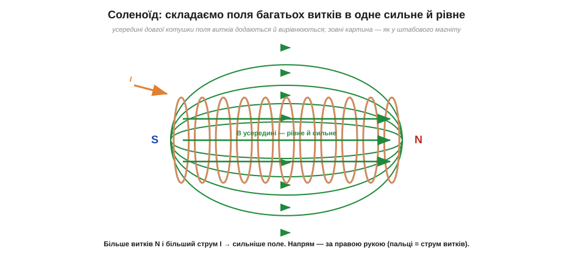
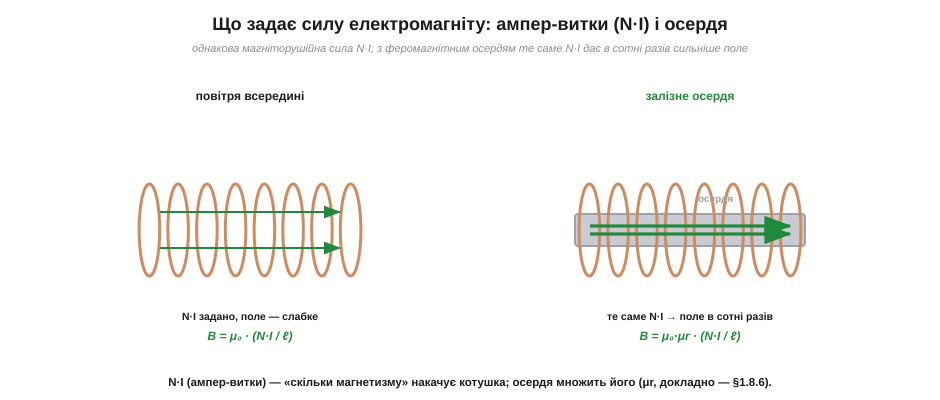
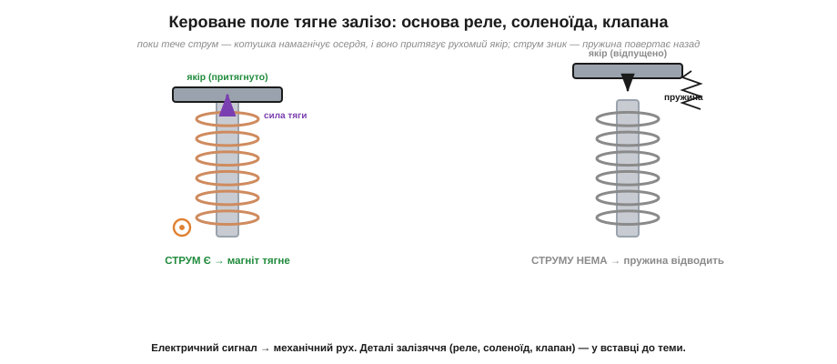

# Електромагніт: котушка, осердя, ампер-витки

Один виток зі струмом — уже маленький магніт, але кволенький: його поле слабке й швидко спадає. Природна думка інженера: якщо один виток дає трохи поля, то **багато витків** дадуть багато. Так народжується **електромагніт** — пристрій, що творить магнітне поле зі струму й, на відміну від постійного магніту, дозволяє це поле **вмикати, вимикати й регулювати**. Саме керованість робить електромагніт серцем реле, соленоїдів, клапанів, гучномовців і — врешті — будь-якого мотора. Розберімо, від чого залежить його сила.

### Соленоїд: складаємо поля багатьох витків

Сама ідея проста, але історично вона дала величезний стрибок. Перший електромагніт побудував 1824 року англієць **Вільям Стерджен** (*William Sturgeon*), обмотавши кілька витків навколо залізного осердя; той піднімав вагу, у рази більшу за власну. А вже наприкінці 1820-х американець **Джозеф Генрі** (*Joseph Henry*) показав ключове вдосконалення: він намотав **багато** витків ізольованого дроту (Стерджен ізоляції майже не мав, тож не міг класти витки щільно) і дістав електромагніти небаченої на той час сили — деякі підіймали сотні кілограмів. Саме перехід від кількох голих витків до сотень ізольованих перетворив іграшку на інструмент — і дав ту саму ідею N·I, що лежить в основі будь-якого електромагніту.

Намотаймо дріт у щільну спіраль із багатьох витків — отримаємо **соленоїд** (гр. *sōlēn* — трубка, канал), або просто котушку. Кожен виток зі струмом [створює власне магнітне поле](root:ph-electromagnetism/oersted-experiment), спрямоване вздовж осі. У щільній котушці витки стоять упритул, і їхні поля **складаються**: усередині соленоїда вони підсилюють один одного й вишиковуються в одну сильну, на диво **рівну** (однорідну) лінію поля. Зовні ж картина соленоїда стає схожою як дві краплі води на картину штабового магніту: один торець котушки — північний полюс, другий — південний.


*Соленоїд — щільна котушка з багатьох витків. Усередині поля всіх витків додаються, даючи сильне й рівномірне поле B уздовж осі; зовні поле виходить з одного торця (N) і входить у другий (S) — точно як у штабового магніту. Напрям полюсів задає права рука: пальці згинаємо за струмом витків, великий палець показує на N.*

Сила поля всередині довгого соленоїда виявляється напрочуд простою. Вона залежить від того, **скільки витків** N на одиницю довжини й **який струм** I тече кожним:

```
B = μ₀ · (N · I) / ℓ
```

де **N** — кількість витків, **I** — струм, **ℓ** — довжина котушки, а **μ₀** (*магнітна стала*, *permeability of free space*) ≈ 1.257 × 10⁻⁶ Тл·м/А — універсальна константа, що зв'язує струм із полем у порожнечі (її роль у магнетизмі схожа на роль ε₀ в електриці). Головне в цій формулі — добуток **N·I**: поле визначається тим, скільки сумарного струму «накручено» навколо осі.

### Ампер-витки: міра «накачаного» магнетизму

Добуток N·I зустрічається так часто, що для нього є власна назва — **ампер-витки** (*ampere-turns*, A·в), або, формальніше, **магніторушійна сила** (*magnetomotive force*, MMF). Це міра того, **скільки магнетизму накачує котушка**. І в ній захована дуже практична ідея: однакове поле можна дістати або великим струмом через мало витків, або малим струмом через багато витків — аби добуток N·I був той самий.


*Магніторушійну силу N·I (ампер-витки) задає котушка. У повітрі це N·I дає відносно слабке поле B = μ₀·(N·I)/ℓ. Якщо ж усередину котушки вставити феромагнітне **осердя**, те саме N·I дає поле в сотні разів сильніше: B = μ₀·μr·(N·I)/ℓ, де μr — у скільки разів осердя підсилює поле.*

Це пояснює, чому 100 витків зі струмом 1 А і 1000 витків зі струмом 0.1 А створюють однакове поле: в обох випадках N·I = 100 ампер-витків. Інженер користується цією свободою постійно: якщо джерело дає малий струм, але високу напругу — намотують **більше витків тонким дротом**; якщо є великий струм — обходяться **меншою кількістю товстого**.

Є й корисна аналогія, що пов'язує магнітне коло зі звичним [електричним колом](root:embedded/circuit-analysis). Магніторушійну силу N·I можна вважати «магнітною напругою», що жене **магнітний потік** Φ крізь замкнений шлях (осердя). Тому, що цьому потоку «опирається», дали назву **магнітний опір**, або **релуктанс** (*reluctance*). І тоді все вкладається в магнітний аналог [закону Ома](root:hw-analog/ohms-law): потік дорівнює магніторушійній силі, поділеній на магнітний опір (Φ = N·I / релуктанс). Феромагнітне осердя — це шлях із **малим** магнітним опором (поле охоче ним тече), а повітря — з великим. Ця аналогія напрочуд практична: вона одразу пояснює, чому навіть тонкий **повітряний зазор** в осерді різко послаблює поле (повітря має величезний магнітний опір порівняно з залізом), і чому осердя реле роблять замкненим, з мінімальним зазором, — щоб магнітний потік не «витікав» намарно.

> 🧮 **Математична вставка:** [ампер-витки — оцінити поле котушки із закону Ампера](root:ph-electromagnetism/electromagnet/math-ampere-turns.md) — звідки береться формула B = μ₀·N·I/ℓ і як швидко прикинути поле «на серветці».

### Осердя: множник поля

Найпотужніший важіль — це **осердя** (*core*). Вставимо всередину котушки стрижень із феромагнітного матеріалу (зазвичай м'якого заліза). Поле котушки намагнічує осердя — вишиковує його [магнітні домени](root:ph-condensed/ferromagnetism), — і вже **вишикувані домени додають своє, значно сильніше поле**. У результаті те саме N·I дає поле в **сотні, а то й тисячі разів** сильніше, ніж у повітрі. Формула набуває множника **μr** — відносної магнітної проникності матеріалу:

```
B = μ₀ · μr · (N · I) / ℓ
```

Для м'якого трансформаторного заліза μr сягає кількох тисяч — звідси й колосальний приріст. Чому залізо так працює і де лежить межа цього підсилення — пояснює [насичення й гістерезис феромагнетика](root:ph-condensed/saturation-hysteresis). Тут важливо засвоїти головне: **сила електромагніту = ампер-витки × проникність осердя**. Три важелі в руках інженера — кількість витків, струм і матеріал осердя.

### Тяга якоря: електромагніт як актуатор

Навіщо взагалі творити поле струмом, якщо є постійні магніти? Через **керованість**. Постійний магніт тягне завжди; електромагніт тягне **лише поки тече струм** — а отже, ним можна керувати електричним сигналом. На цьому стоїть цілий клас пристроїв-актуаторів, що перетворюють струм на рух.


*Електромагніт як актуатор. Поки тече струм, котушка намагнічує осердя, і воно притягує рухому залізну деталь — **якір**. Щойно струм зникає, поле зникає, і **пружина** повертає якір назад. Так електричний сигнал перетворюється на механічний рух — основа реле, соленоїда й електромагнітного клапана.*

Механізм простий: котушка з осердям, поряд — рухомий шматок заліза (**якір**, *armature*) на пружині. Подали струм — осердя намагнітилось і притягнуло якір; зняли струм — пружина відвела його назад. Цей рух можна використати по-різному: замкнути/розімкнути електричні контакти (це **реле**), штовхнути стрижень (це **соленоїд**-штовхач), відкрити/закрити прохід для рідини чи газу (це електромагнітний **клапан**). У всіх випадках суть та сама — кероване струмом магнітне поле виконує механічну роботу; як саме [влаштовані реле, соленоїд і електромагнітний клапан](root:hw-motion/solenoid-relay) і чому котушку реле супроводжує захисний діод — розбираємо окремо.

Чому ж якір саме **притягується**, а не відштовхується? Тут спрацьовує та сама логіка магнітного опору. Поки якір далеко, у магнітному колі зяє повітряний зазор із великим магнітним опором; система «хоче» його позбутися, бо із замкненим осердям потік більший, а енергія поля влаштована вигідніше. Тому осердя **втягує** якір, скорочуючи зазор, — рух завжди спрямований так, щоб замкнути магнітний шлях. Звідси, до речі, важлива інженерна деталь: сила тяги різко **зростає в міру наближення** якоря (зазор меншає — опір падає — потік росте — сила більшає). Тому реле спрацьовує «клац» — лавиноподібно, а не плавно: щойно якір рушив, сила підскакує й дотягує його до кінця. Це і добре (чіткий контакт), і вимагає продуманого зусилля пружини, щоб якір повертався назад, коли струм зник.

> 🔧 **Навіщо це.** Електромагніт-актуатор — усюди. Реле дозволяє слабкому сигналу мікроконтролера комутувати потужне навантаження (мотор, лампу, нагрівач), фізично розв'язуючи кола. Соленоїдний клапан керує водою в пральній машині й пальним у двигуні. Замок-засувка на дверях під'їзду відсувається тим самим електромагнітом. Розуміючи, що сила тяги росте з ампер-витками й осердям, інженер свідомо вибирає котушку: скільки витків, на який струм, із яким осердям — щоб вистачило сили притягнути якір, але не перегріти обмотку.

**Приклад (скільки витків треба для заданого поля).** Котушка завдовжки ℓ = 5 см має створити в повітрі поле B = 5 мТл при струмі I = 0.5 А. Скільки витків N намотати?

```
B = μ₀ · N · I / ℓ   →   N = B · ℓ / (μ₀ · I)

N = (5 × 10⁻³ Тл · 0.05 м) / (1.257 × 10⁻⁶ Тл·м/А · 0.5 А)
N = (2.5 × 10⁻⁴) / (6.28 × 10⁻⁷)
N ≈ 398 витків
```

Майже 400 витків — і це лише для скромних 5 мТл у повітрі. Звідси добре видно дві речі: по-перше, без осердя котушки виходять «витратними» на витки; по-друге, варто вставити залізне осердя з μr ≈ 1000 — і ті самі 400 витків дадуть уже не 5 мТл, а близько 5 Тл (якби не [магнітне насичення](root:ph-condensed/saturation-hysteresis), що обмежує цей приріст). Саме тому реальні електромагніти майже завжди роблять із осердям.

### Плата за поле: нагрів обмотки

У формулі поля бракує одного гравця, якого не оминути в реальному пристрої, — **тепла**. Струм тече мідним дротом, а дріт має [опір](root:ph-condensed/resistance), тож котушка неминуче гріється за [законом Джоуля](root:ph-electromagnetism/joule-heating) P = I²·R. Це ставить жорстку межу: не можна просто «накрутити струму» скільки заманеться, бо обмотка перегріється й згорить ізоляція. Звідси випливає тонкий компроміс при намотуванні. Якщо взяти **більше витків тоншого** дроту, то для тих самих ампер-витків N·I потрібен менший струм I — менший нагрів, але тонкий дріт сам має більший опір. Якщо взяти **менше витків товстого** дроту — опір малий, але струм потрібен великий, і нагрів росте як квадрат струму. Інженер шукає золоту середину під конкретне джерело й допустиму температуру.

Ще один важіль — **режим роботи** (*duty cycle*). Електромагніт, що працює короткими імпульсами (соленоїд клацнув і відпустив), можна на мить перевантажити великим струмом заради потужного ривка — він не встигне перегрітися. А електромагніт, що тримає якір **постійно** (утримувальне реле, підйомний магніт), мусить жити на куди менший тривалий струм, бо тепло накопичується. Тому в даташитах котушок часто вказують окремо «струм спрацювання» (вищий, на мить) і «струм утримання» (нижчий, тривалий) — і навіть будують схеми, що спершу б'ють сильним імпульсом, а потім переходять на ощадливе утримання.

> 🔧 **Навіщо це.** Цей компроміс — повсякденність при доборі реле чи соленоїда. Котушку характеризують **опором** і **робочою напругою**: подаси на 12-вольтову котушку 24 В — учетверо зросте потужність нагріву (P = V²/R), і вона згорить. Тому напругу живлення котушки беруть строго за специфікацією, а в схемах із тривалим утриманням нерідко знижують струм після спрацювання (наприклад, послідовним резистором чи ШІМ), щоб реле не «варилося» намарно й споживало менше.

---
