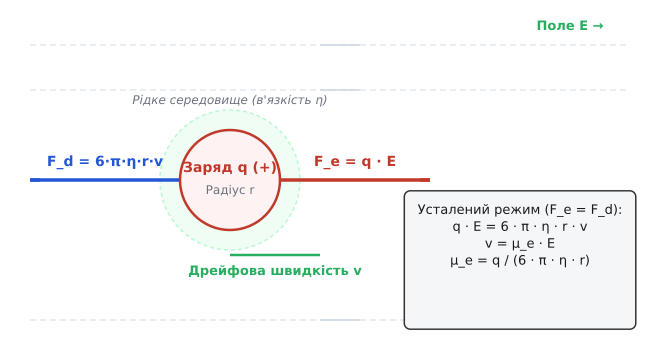
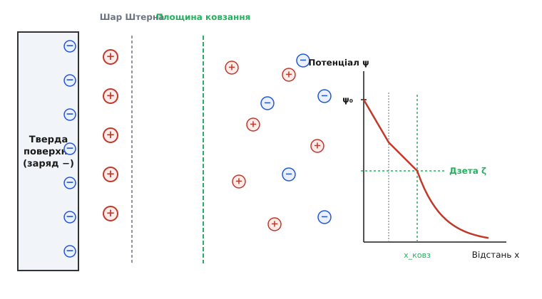
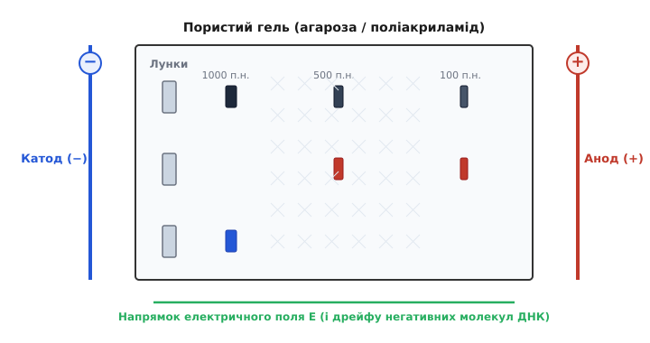
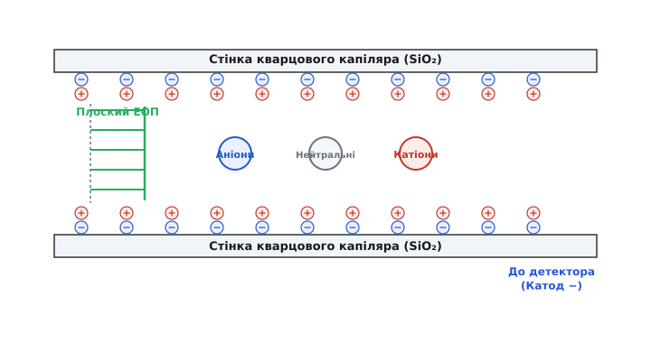

# Електрофорез

<preknowlist>
- [Електричне поле](topic:ph-electromagnetism/electric-field) — поняття напруженості поля E та сили, що діє на заряджений об'єкт.
- [Іонна провідність](topic:ph-electromagnetism/ionic-conduction) — перенесення заряду іонами та зарядовими носіями у рідкому середовищі.
- [Електричний потенціал](topic:ph-electromagnetism/electric-potential) — розподіл потенціалу та різниця потенціалів між електродами.
- [Закон Джоуля — Ленца](topic:ph-electromagnetism/joule-heating) — теплова потужність, яка виділяється під час проходження струму через провідне середовище.
</preknowlist>

Коли до суміші макромолекул або колоїдних частинок у рідкому розчині прикладають зовнішнє електричне поле, кожен заряджений іон відчуває електростатичне притягання до протилежно зарядженого електрода. Однак замість безкінечного прискорення частинка майже миттєво досягає постійної дрейфової швидкості. Причина полягає у виникненні потужної гідродинамічної сили в'язкого опору середовища, яка точно врівноважує електричну силу. Явище цілеспрямованого переміщення зважених заряджених частинок у рідкому середовищі під дією зовнішнього електричного поля називається **електрофорезом** (від грец. *ἤλεκτρον* — бурштин, та *φορέω* — переносити).

Оскільки різні молекули та частинки мають неоднаковий електричний заряд, розмір, геометричну форму та дзета-потенціал, вони дрейфують у розчині з різними швидкостями. Це перетворює електрофорез на один із найпотужніших методів фізико-хімічного розділення, ідентифікації та аналізу складних біологічних сумішей — від коротких олігонуклеотидів та білків сироватки крові до гігантських хромосомних молекул ДНК.

---

## 1. Зіткнення двох сил: електричний розгін проти в'язкого гальмування

Розглянемо поодиноку сферичну частинку радіуса `r`, яка має електричний заряд `q` і перебуває у рідкому розчиннику з динамічною в'язкістю `η`. При ввімкненні зовнішнього однорідного електричного поля з напруженістю `E` на частинку починає діяти кулонівська електрична сила:

```
F_e = q · E
```

Ця сила намагається прискорити частинку вздовж ліній напруженості поля. Проте, як тільки частинка набуває швидкості `v`, рідке середовище опирається її руху. Для сферичного тіла у ламінарному потоці при малих числах Рейнольдса (Re ≪ 1) опір рідини описується формулою Стокса:

```
F_d = 6 · π · η · r · v
```

Оскільки маса мікроскопічної частинки або білкової молекули нікчемно мала (m ≈ 10⁻²⁰ кг), характеристичний час релаксації імпульсу τ = m / (6 · π · η · r) становить частки пікосекунд (10⁻¹³–10⁻¹² с). Це означає, що етап прискорення закінчується практично миттєво, і далі частинка рухається у суворо **усталеному режимі**, де кулонівська сила повністю врівноважена силою гідродинамічного опору:

```
F_e = F_d

q · E = 6 · π · η · r · v
```


*Баланс електричної сили кулонівського прискорення F_e та сили гідродинамічного опору Стокса F_d у розчині*

Виразивши усталену дрейфову швидкість `v`, отримуємо фундаментальну пропорційність:

```
v = [ q / (6 · π · η · r) ] · E
```

Коефіцієнт пропорційності між швидкістю дрейфу та напруженістю електричного поля називається **електрофоретичною рухливістю** (electrophoretic mobility) `μ_e`:

```
v = μ_e · E

μ_e = q / (6 · π · η · r)
```

У системі СІ електрофоретична рухливість вимірюється в м² / (В · с) (на практиці частіше використовують см² / (В · с)). Знайдена величина показує, що у найпростішому наближенні рухливість частинки пропорційна її питомому заряду `q / r` та обернено пропорційна в'язкості середовища `η`.

### Термічна дифузія та співвідношення Нернста — Ейнштейна

Поряд із направленим дрейфом під дією електричного поля, частинка здійснює хаотичний броунівський рух. Коефіцієнт молекулярної дифузії `D` описується формулою Ейнштейна — Смолуховського:

```
D = (k_B · T) / (6 · π · η · r)
```

Порівнюючи вирази для рухливості `μ_e` та коефіцієнта дифузії `D`, отримуємо співвідношення Нернста — Ейнштейна, яке пов'язує макроскопічний дрейф у полі з тепловими флуктуаціями:

```
μ_e = (q · D) / (k_B · T)
```

Ця формула демонструє фундаментальний зв'язок: чим вищий коефіцієнт дифузії молекули у розчині, тим більшою є її електрофоретична рухливість при заданій величині заряду.

### Додаткові ефекти гальмування: електрофоретичний та релаксаційний

У реальному розчині електроліту на частинку діють два додаткові фізичні ефекти, які знижують теоретичну рухливість Стокса:

1. **Електрофоретичне гальмування (Electrophoretic retardation force)**: зовнішнє електричне поле зміщує іонну хмару протиіонів у бік, протилежний руху самої частинки. Оскільки протиіони захоплюють із собою молекули розчинника, частинка змушена плисти «проти течії» локального гідродинамічного потоку рідини.
2. **Ефект релаксації (Relaxation or asymmetry effect)**: під дією поля іонна хмара протиіонів деформується, зміщуючись назад відносно центру частинки. Утворюється наведений електричний диполь, поле якого гальмує рух частинки, притягуючи її назад до власного протиіонного хвоста.

Проте реальний розчин електроліту суттєво складніший за просту модель Стокса. Детальніше про те, як лабораторне спостереження глиняної суспензії перетворилося на фундамент молекулярної біології, описано в [історії відкриття електрофорезу](topic:ph-electromagnetism/electrophoresis/hist-electrophoresis.md).

---

## 2. Подвійний електричний шар та дзета-потенціал: як середовище екранує заряд

Коли тверда частинка або макромолекула потрапляє у водний розчин електроліту, її поверхня набуває первинного електричного заряду (внаслідок дисоціації іоногенних груп, таких як -COOH → -COO⁻ + H⁺, або вибіркової адсорбції іонів з розчину).

Цей поверхневий заряд електростатично притягує іони протилежного знака (протиіони) та відштовхує однойменно заряджені іони (коіони). У результаті навколо частинки формується **подвійний електричний шар** (ПЕШ), який складається з двох послідовних областей:

1. **Внутрішній шар (шар Штерна або гельмгольцівський шар)**: шар протиіонів, які міцно зв'язані з поверхнею частинки електростатичними та адсорбційними силами й рухаються разом із нею як єдине ціле.
2. **Зовнішній шар (дифузний шар або шар Гуї — Чапмана)**: область, де протиіони утримуються слабше, і тепловий хаотичний рух молекул конкурує з електростатичним притяганням. Концентрація протиіонів поступово спадає від поверхні вглиб розчину за законом Больцмана.

Характерний товщинний масштаб дифузного шару визначається **дебаївським радіусом екранування** `λ_D = 1 / κ`. Чим вища іонна сила розчину (концентрація солей), тим тоншим стає дифузний шар і тим сильніше екранується первинний заряд частинки.


*Структура подвійного електричного шару біля зарядженої поверхні та експоненціальний спад потенціалу ψ до дзета-потенціалу ζ на площині ковзання*

Під час руху частинки у рідкому середовищі шар розчинника, безпосередньо прилеглий до її поверхні, захоплюється частинкою. Межа між гідродинамічно нерухомою рідиною на поверхні частинки та рухомим об'ємним розчином називається **площиною ковзання** (slip plane).

Електричний потенціал розчину, виміряний саме на площині ковзання відносно віддалених точок незбуреної рідини, називається **дзета-потенціалом** (`ζ`). Саме дзета-потенціал (а не повний поверхневий заряд частинки) є справжнім електрокінетичним параметром, який визначає швидкість електрофорезу.

Математичний зв'язок між електрофоретичною рухливістю `μ_e` та дзета-потенціалом `ζ` залежить від співвідношення між радіусом частинки `r` та товщиною шару Дебая `λ_D`:

- **Формула Смолуховського** (великі частинки або тонка обгортка ПЕШ, `κ · r ≫ 1`):
  
  ```
  μ_e = (εᵣ · ε₀ · ζ) / η
  ```
  
  У цьому граничному випадку рухливість **взагалі не залежить від розміру та форми частинки**. Частинка радіусом 100 нм і 10 мкм із однаковим дзета-потенціалом дрейфують у вільному розчині з однаковою швидкістю.

- **Формула Гюккеля** (дрібні частинки або товстий дифузний шар, `κ · r ≪ 1`):
  
  ```
  μ_e = (2 · εᵣ · ε₀ · ζ) / (3 · η)
  ```

- **Рівняння Генрі** (загальний випадок):
  
  ```
  μ_e = [ (2 · εᵣ · ε₀ · ζ) / (3 · η) ] · f(κ · r)
  ```
  
  де `f(κ · r)` — поправкова функція Генрі, яка плавно змінюється від 1.0 до 1.5.

### Ізоелектрична точка амфотерних молекул (`pI`)

Для амфотерних сполук (білків, пептидів та амінокислот), які містять як acidic (-COOH), так і basic (-NH₂) іоногенні групи, сумарний заряд `q` та дзета-потенціал `ζ` критично залежать від кислотності середовища `pH`:

- У кислому середовищі (`pH < pI`) аміногрупи протонуються (-NH₃⁺), білок має позитивний заряд і мігрує до катода.
- У лужному середовищі (`pH > pI`) карбоксильні групи депротонуються (-COO⁻), білок має негативний заряд і мігрує до анода.
- Значення `pH`, при якому сумарний заряд молекули дорівнює нулю (`q = 0, ζ = 0`), називається **ізоелектричною точкою** (`pI`). При `pH = pI` електрофоретична рухливість білка стає рівною нулю (`μ_e = 0`), і його дрейф у полі зупиняється.

Цей принцип покладено в основу **ізоелектричного фокусування** (Isoelectric Focusing, IEF), де розділення відбувається у градієнті `pH`: кожна молекула білка дрейфує доти, доки не досягне зони з `pH = pI`, де зупиняється у вигляді надзвичайно вузької фокусираної смуги.

Детальний математичний вивід рівняння Пуассона — Больцмана, обчислення дебаївської довжини та покроковий розв'язок гідродинамічних рівнянь Нав'є — Стокса наведено у [математиці подвійного електричного шару та рівнянні Смолуховського](topic:ph-electromagnetism/electrophoresis/math-double-layer.md).

---

## 3. Гелевий електрофорез: молекулярне сито для ДНК та білків

Формула Смолуховського підводить до фундаментальної проблеми розділення макромолекул у вільному розчині. Розглянемо молекулу ДНК. Кожна ланка нуклеотиду містить фосфатну групу PO₄³⁻, яка несе один негативний елементарний заряд. Отже, загальний заряд молекули ДНК пропорційний кількості пар основ: `q ∝ N_bp`.

Однак дволанцюгова спіраль ДНК у розчині поводиться як полімерний клубок, радіус гірації якого також зростає пропорційно довжині ланцюга: `r ∝ N_bp`. Якщо підставити це у формулу рухливості:

```
μ_e ∝ q / r ∝ N_bp / N_bp = const
```

Виникає парадокс: у вільному розчині фрагмент ДНК довжиною 100 пар основ і фрагмент довжиною 50 000 пар основ мають **абсолютно однакову електрофоретичну рухливість**. У вільному буфері розділити ДНК за довжиною неможливо.

Щоб подолати це обмеження, електрофорез проводять не у чистій рідині, а всередині **пористого гелевого матриксу** (агарози або поліакриламідного гелю).


*Схема розділення фрагментів ДНК у пористому гелі: малі фрагменти вільно проходять крізь пори й рухаються швидше до анода (+), а великі фрагменти гальмуються полімерними ґратками*

Гель являє собою тривимірну сітку переплетених полімерних ланцюгів, заповнену буферним розчином. Розмір пор гелю можна точно контролювати, змінюючи масову концентрацію полімеру:
- **Агарозний гель** (пори від 100 до 500 нм): утворюється шляхом фізичного гель-утворення природного полісахариду агарози. Використовується для розділення середніх та великих фрагментів нуклеїнових кислот (від 100 пар основ до 20 000 пар основ).
- **Поліакриламідний гель (PAGE)** (пори від 2 до 20 нм): формується шляхом сополімеризації акриламіду з зшиваючим агентом N,N'-метиленбісакриламідом. Застосовується для високороздільного розділення білків та коротких олігонуклеотидів із точністю до одного нуклеотиду.

Усередині гелю міграція молекул визначається двома фізичними механізмами розсіювання:

1. **Модель ситової фільтрації Огстона (Ogston sieving)**: якщо розмір молекулярного клубка менший за середній радіус пор гелю (`r_мол < a_пори`), молекула розглядається як жорстка сфера. Швидкість її дрейфу зменшується пропорційно ймовірності натрапити на пору достатнього розміру:
   
   ```
   v = v₀ · exp( − K_R · %Gel )
   ```
   
   де K_R — коефіцієнт ретардації, пропорційний площі перерізу молекули.

2. **Модель рептації (Reptation model)**: якщо довжина ДНК значно більша за розмір пор (`r_мол ≫ a_пори`), молекула не може рухатися як сфера. Вона змушена пронизувати пори гелю подібно до змії (від латинського *reptare* — повзати), проштовхуючи свій головний кінець крізь звивисті канальці ґратки.

### SDS-PAGE: стандарт розділення білків

На відміну від ДНК, нативні білки мають довільні тривимірні глобулярні форми та різний власний електричний заряд (залежно від вмісту лізину, аргініну, глутамату тощо). Щоб розділити білки суворо за їхньою молекулярною масою, застосовують **деструктивний електрофорез у присутності додецилсульфату натрію (SDS-PAGE)**.

Аніонний детергент SDS має довголанцюговий гідрофобний «хвіст» та негативно заряджену сульфогрупу. При нагріванні розчину з SDS та відновленням дисульфідних зв'язків (за допомогою меркаптоетанолу або дитіотреітолу DTT):
- SDS повністю розгортає третинну та вторинну структуру білка, перетворюючи глобулу на лінійний гнучкий ланцюг.
- Молекули SDS рівномірно покривають поліпептидний ланцюг у постійному масовому співвідношенні: приблизно **1.4 грама SDS на 1 грам білка** (одна молекула SDS на дві амінокислоти).

Власний заряд білка стає неважливим порівняно з велетенським негативним зарядом зв'язаного SDS. У результаті всі білки у комплексі SDS-білок набувають **однакового питомого заряду на одиницю маси** і розділяються у поліакриламідному гелі суворо за молекулярною масою (малі білки мігрують найшвидше).

### Дисконтінуальні гелеві системи та концентруючий гель

Для досягнення високої чіткості смуг у SDS-PAGE використовують **дисконтінуальну буферну систему (метод Орнштейна — Девіса та Леммлі)**. Гель складається з двох послідовних секцій:
- **Концентруючий гель (Stacking gel)**: верхній шар із великими порами (4% акриламід) та низьким значенням pH = 6.8.
- **Розділяючий гель (Resolving gel)**: нижній шар із дрібними порами (8–15% акриламід) та вищим значенням pH = 8.8.

При подачі напруги іони гліцинату Gly⁻ з верхнього буферу при pH = 6.8 стають майже нейтральними цвітер-іонами й рухаються дуже повільно (замикаючий іон, Trailing ion). Натомість іони хлору Cl⁻ мігрують дуже швидко (лідуючий іон, Leading ion). Між лідуючим Cl⁻ та замикаючим гліцинатом виникає зона високої напруженості електричного поля, яка стискає (концентрує) всі білкові зразки у надзвичайно тонку смужку товщиною в кілька мікрометрів до того, як вони увійдуть у розділяючий гель.

### Двовимірний електрофорез (2D-PAGE)

Поєднання двох незалежних принципів розділення в одному експерименті утворює **двовимірний електрофорез (2D-PAGE)**:
1. **Перший вимір**: розділення суміші білків у капілярному гелі за їхніми ізоелектричними точками (`pI`) методом ізоелектричного фокусування.
2. **Другий вимір**: укладання первинного капіляра на плоский прямокутний SDS-гель та розділення білків у перпендикулярному напрямку за їхньою молекулярною масою (`M_w`).

Двовимірний електрофорез дозволяє розділити понад 5 000 індивідуальних білкових фракцій з одного клітинного лізату на одній гелевій пластині.

---

## 4. Електроосмотичний потік та капілярний електрофорез

При зменшенні діаметра каналу, через який тече електроліт під дією поля, поверхневі явища на стінках судини починають домінувати над об'ємними. Це явище покладено в основу **капілярного електрофорезу** (CE), який проводиться у кварцових капілярах із внутрішнім діаметром від 20 до 100 мікрометрів.

Внутрішня стінка кварцового капіляра (SiO₂) при контакті з водним буфером (`pH > 3`) гідролізується з утворенням силанольних груп:

```
Si−OH + H₂O  ⇄  Si−O⁻ + H₃O⁺
```

Стінка капіляра набуває негативного поверхневого заряду. У відповідь біля стінки формується шар Штерна та дифузний шар з підвищеною концентрацією катіонів (Na⁺, K⁺, Tris⁺).


*Генерація електроосмотичного потоку (ЕОП) біля негативно зарядженої стінки капіляра та порівняння плоского профілю швидкості ЕОП із параболічним профілем тискового потоку Пуазейля*

Коли до кінців капіляра прикладають високу напругу (до 30 000 Вольт), позитивно заряджені іони у дифузному шарі біля стінки починають дрейфувати до негативного електрода (катода). Переміщуючись, катіони за рахунок сил міжмолекулярного в'язкого тертя захоплюють із собою весь об'єм рідини всередині капіляра.

Цей загальний рідинний потік називається **електроосмотичним потоком** (Electroosmotic Flow, EOF або ЕОП). Його швидкість описується формулою Смолуховського для стінки капіляра:

```
v_eo = μ_eo · E

μ_eo = (εᵣ · ε₀ · ζ_стінки) / η
```

### Чому ЕОП забезпечує рекордну роздільну здатність

На відміну від звичайних рідинних хроматографів, де рідину прокачують насосом під тиском і створюють **параболічний профіль швидкості Пуазейля** (рідкий потік у центрі трубки рухається удвічі швидше, ніж біля стінок, що катастрофічно розмиває зональні піки), електроосмотичний потік штовхається рівномірно по всьому перерізу капіляра безпосередньо біля стінок.

Профіль швидкості ЕОП є абсолютно **поршнеподібним (плоским)**. Завдяки цьому дисперсія смуг обумовлена виключно поздовжньою молекулярною дифузією, а ефективність розділення сягає від 100 000 до 1 000 000 теоретичних тарілок на метр капіляра.

### Одночасний аналіз аніонів, катіонів та нейтральних речовин

У капілярному електрофорезі результуюча (видима) рухливість будь-якого аналіту є векторною сумою його власної електрофоретичної рухливості `μ_e` та рухливості електроосмотичного потоку `μ_eo`:

```
v_заг = (μ_e + μ_eo) · E
```

Оскільки зазвичай величина ЕОП у чистому кварцовому капілярі перевищує власний електрофоретичний дрейф аніонів (`|μ_eo| > |μ_e|`), результуючий потік спрямований до катода для **всіх типів частинок**:
1. **Катіони**: рухаються найшвидше до катода (`v = (μ_e + μ_eo) · E`), оскільки їхній власний дрейф додається до ЕОП.
2. **Нейтральні молекули**: не мають власного заряду (`μ_e = 0`) і виносяться до катода суворо зі швидкістю електроосмотичного потоку (`v = μ_eo · E`).
3. **Аніони**: власна сила тягне їх до анода, але сильніший електроосмотичний потік «проти течії» зносить їх до катодного детектора (`v = (μ_eo - |μ_e|) · E`).

Це дозволяє розділити та зареєструвати суміш позитивних, нейтральних та негативних іонів за один аналітичний раунд. Для розділення повністю нейтральних гідрофобних молекул застосовують **міцелярну електрокінетичну хроматографію** (MEKC), де у буфер додають заряджені міцели SDS, які слугують псевдостаціонарною фазою.

---

## 5. Джоулеве нагрівання, температурні ґрадієнти та фізичні обмеження

Головним фізичним фактором, який обмежує максимальну напруженість електричного поля та швидкість електрофорезу, є **джоулеве нагрівання** буферного розчину.

Відповідно до закону Джоуля — Ленца, об'ємна теплова потужність q_V, яка виділяється у рідкому електроліті з питомою електропровідністю `σ` при проходженні струму, дорівнює:

```
q_V = σ · E²
```

Виділення тепла всередині гелевого блоку або капіляра призводить до виникнення трьох небажаних ефектів:

1. **Теплова конвекція та smiling-ефект**: неоднакове охолодження гелю по центру та на периферії створює поперечний градієнт температури. Оскільки в'язкість води знижується приблизно на 2% при зростанні температури на кожні 1 °C, центр гелю стає менш в'язким. Молекули по центру починають мігрувати швидше, викривляючи прямолінійні смуги у дугоподібні «усміхнені» фронти (smiling effect).
2. **Термічне розмивання смуг**: підвищення температури зрощує коефіцієнт молекулярної дифузії `D = k_B · T / (6 · π · η · r)`, розширюючи ширину піків.
3. **Денатурація зразків та плавлення гелю**: при виділенні надмірної потужності агарозний гель розплавляється (T > 65 °C), а білки денатурують і випадають у нерозчинний осад.

### Охолодження та перевага мікрокапілярів

Здатність камери відводити джоулеве тепло залежить від співвідношення площі поверхні охолодження `A` до об'єму гелю `V`:
- Для плоского гелевого блоку товщиною `d`: `A / V = 2 / d`. При `d = 5 мм` співвідношення становить 400 м⁻¹.
- Для тонкого кварцового капіляра внутрішнім радіусом `R`: `A / V = 2 / R`. При `R = 25 мкм` співвідношення сягає 80 000 м⁻¹ (у 200 разів більше!).

Саме велетенське співвідношення поверхні до об'єму дозволяє капілярному електрофорезу працювати при гігантських напруженостях поля (`E > 300 В/см`) без перегріву розчину.

Для розділення гігантських молекул ДНК у плоских гелях застосовують **імпульсний електрофорез** (Pulsed-Field Gel Electrophoresis, PFGE). У PFGE напрямок електричного поля періодично перемикають між кількома просторовими осіми. Це змушує наддовгі молекули ДНК (розміром від 50 000 до 5 000 000 пар основ) щоразу переорієнтовуватися у порах гелю, що дозволяє розділяти цілі хромосоми дріжджів та бактерій, які при постійному полі рухаються з однаковою швидкістю.

Детальний аналіз конструктивних рішень камери, вибору матеріалів електродів та алгоритмів симуляції процесу розкрито у матеріалах про [будову та компоненти електрофоретичної камери](topic:ph-electromagnetism/electrophoresis/comp-electrophoresis-system.md) та [моделювання міграції ДНК та теплового балансу](topic:ph-electromagnetism/electrophoresis/proj-gel-sim.md).

---

## 6. Практичне застосування та інженерні рішення

> 🔧 **Навіщо це.**
> Електрофорез є фундаментальним аналітичним та препаративним методом сучасної біотехнології, молекулярної медицини та судової експертизи. Без електрофоретичного розділення неможливе функціонування жодної генетичної чи фармацевтичної лабораторії:
>
> - **Секвенування ДНК за Сенгером**: прочитання послідовності нуклеотидів основане на електрофоретичному розділенні суміші ДНК-фрагментів, які відрізняються один від одного рівно на одну пару основ, у мікрокапілярах з лазерним читанням флуоресцентних міток.
> - **ДНК-дактилоскопія та судова медицина**: аналіз коротких тандемних повторів (STR-локусів) методом гелевого або капілярного електрофорезу дозволяє з імовірністю понад 99.9999% встановити особу людини або батьківство за однією краплею крові.
> - **Медична діагностика сироватки крові**: білковий електрофорез сироватки (SPEP) використовується для виявлення моноклональних імуноглобулінів (M-протеїну) при діагностиці множинної мієломи, а також для виявлення аномальних гемоглобінів (наприклад, при серпоподібноклітинній анемії).
> - **Вестерн-блот, Саузерн-блот та Норзерн-блот**: комбінація електрофоретичного розділення білків або нуклеїнових кислот із подальшим переносом на нітроцелюлозну мембрану та гібридизацією зі специфічними антитілами чи зондами.
> - **Мікрофлюїдні лабораторії на чипі (Lab-on-a-Chip)**: інтеграція капілярного електрофорезу у скляні чи полімерні мікрочипи дозволяє виконувати повний експрес-аналіз клінічного зразка ДНК чи білка за 60 секунд із використанням мікролітрових об'ємів реактивів.
