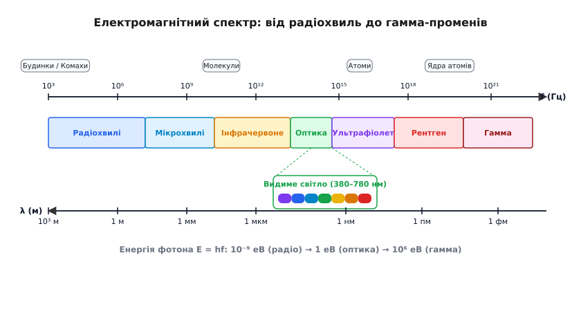
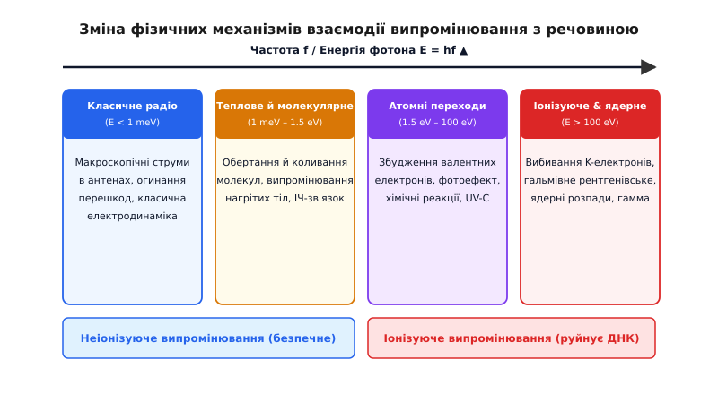
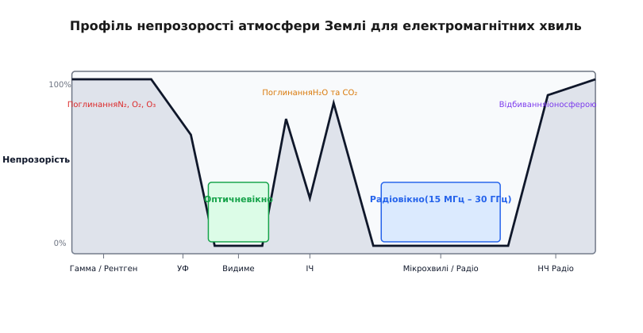
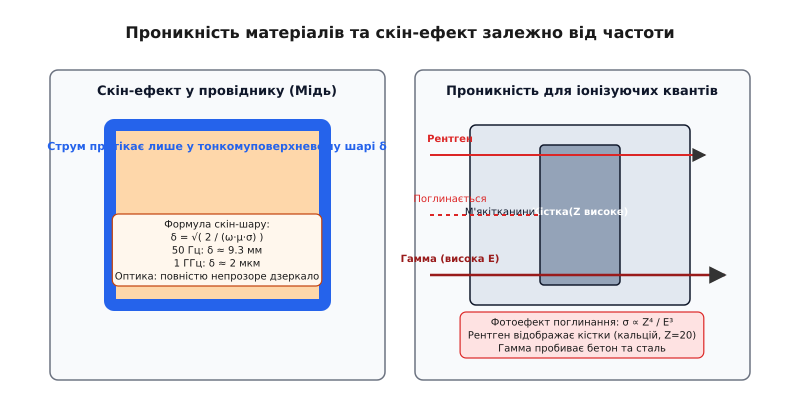

# Електромагнітний спектр: від радіохвиль до гамма-променів

<preknowlist>
- [Електромагнітна хвиля](root:ph-electromagnetism/em-wave) — поперечні коливання електричного й магнітного полів, що поширюються у просторі зі швидкістю світла.
- [Струм зміщення](root:ph-electromagnetism/displacement-current) — механізм Максвелла, що з'єднує часову зміну електричного поля з виникненням вихрового магнітного.
- [Проникність матеріалів](root:ph-electromagnetism/permittivity) — макроскопічний та мікроскопічний відгук середовища на електромагнітне поле.
</preknowlist>

Коли змінний струм із частотою 100 мегагерців тече по мідній антені радіопередавача, у навколишньому просторі народжується електромагнітна хвиля довжиною три метри. Вона вільно долає кілометрові відстані, огинає меблі в кімнаті й проходить крізь дерев'яні двері, не викликаючи у ґратці деревини жодних помітних хімічних чи структурних змін. Якщо ж збільшити частоту коливань джерела у мільярд разів — до 100 петагерців, — довжина хвилі стиснеться до трьох нанометрів. Сформоване випромінювання перетвориться на жорсткий ультрафіолет, який не лише втратить здатність огинати побутові перешкоди, а й почне вибивати електрони з атомних оболонок, іонізувати молекули шкіри та руйнувати хімічні зв'язки в спіралі ДНК.

Закони Максвелла для обох цих хвиль мають абсолютно тотожну диференціальну форму, їхня швидкість поширення у вакуумі однакова до останнього знака (`c ≈ 2.998×10⁸ м/с`), проте їхній вплив на речовину відрізняється радикально. Сукупність усіх можливих частот і довжин хвиль електромагнітних коливань утворює **електромагнітний спектр** (від латинського *spectrum* — видіння, образ). Спробуймо простежити, як з єдиного хвильового рівняння постає таке вражаюче різноманіття фізичних явищ і як природа переходить від макроскопічних радіохвиль до квантів ядерних масштабів.

---

### Єдина природа й двохвидивий зв'язок параметрів

Усі типи електромагнітного випромінювання належать до єдиної фізичної сутності: це самопідтримувані поперечні коливання електричного `E` та магнітного `B` полів. У порожнечі за відсутності вільних зарядів і струмів зведені рівняння Максвелла згортаються у фундаментальне хвильове рівняння:

```
∇²E - (1/c²) · (∂²E / ∂t²) = 0      [хвильове рівняння для векторного поля E]
∇²B - (1/c²) · (∂²B / ∂t²) = 0      [хвильове рівняння для векторного поля B]
c = 1 / √(ε₀ · μ₀) ≈ 2.9979×10⁸ м/с  [фундаментальна швидкість світла у вакуумі]
```

Значення швидкості `c` є фундаментальною світовою константою. Завдяки цьому просторовий період хвилі — довжина хвилі `λ` — та часовий період коливань `T` (пов'язаний із частотою `f = 1/T` та круговою частотою `ω = 2πf`) жорстко зафіксовані оберненим співвідношенням:

```
c = λ · f
f = c / λ
λ = c / f
```

Що вищою є частота коливань полів `f`, то коротшою стає довжина хвилі `λ`. Проте класична хвильова картина дає лише половину опису. У процесах випромінювання, поглинання та розсіювання хвиля виявляє корпускулярно-хвильовий дуалізм і поводиться як потік дискретних порцій енергії — квантів (фотонів). Енергія одного фотона `E_p` визначається формулою Планка — Ейнштейна:

```
E_p = h · f = (h · c) / λ
h ≈ 6.6261×10⁻³⁴ Дж·с ≈ 4.1357×10⁻¹⁵ еВ·с   [стала Планка]
```

Саме в цьому квантовому співвідношенні криється фізична причина глибокої відмінності між різними ділянками спектра. Фотон FM-радіостанції на частоті 100 МГц має мікроскопічну енергію `E_p ≈ 4.14×10⁻⁷ еВ`. Це у мільйони разів менше за середню енергію хаотичного теплового руху молекул при кімнатній температурі (`k_B · T ≈ 0.025 еВ`). За таких умов квантові властивості окремих фотонів повністю маскуються, і випромінювання поводиться як неперервне макроскопічне поле, що змушує вільні електрони в провідній антені здійснювати колективні вимушені коливання.


*Шкала електромагнітного спектра від низькочастотних радіохвиль до жорсткого гамма-випромінювання. Наведено частоту f (Гц), довжину хвилі λ (м), енергію фотона E (еВ), масштаб порівняння та фізичні джерела випромінювання.*

Коли ж частота зростає до `10¹⁹ Гц` (гамма-випромінювання), енергія одного фотона злітає до `E_p > 100 000 еВ`. Такої енергії достатньо, щоб один фотон іонізував тисячі атомів поспіль або вибив електрон безпосередньо з глибоких оболонок атомного ядра. 

Електромагнітний спектр є абсолютно **неперервним**: у ньому немає жодних природних фізичних розривів чи порожнин від 0 Гц до нескінченності.

---

### Електродинамічні потенціали та зони випромінювання

Походження електромагнітних хвиль у будь-якій ділянці спектра спирається на рівняння Д'Аламбера для потенціалів поля. У калібруванні Лоренца `∇·A + (1/c²)·(∂Φ/∂t) = 0` векторний потенціал `A` та скалярний потенціал `Φ` задовольняють неоднорідні хвильові рівняння:

```
∇²Φ - (1/c²)·(∂²Φ / ∂t²) = -ρ / ε₀                  [хвильове рівняння скалярного потенціалу]
∇²A - (1/c²)·(∂²A / ∂t²) = -μ₀ · J                   [хвильове рівняння векторного потенціалу]
```

Розв'язком цих рівнянь є запазні потенціали (Retarded Potentials), де збурення поля поширюється від джерела заряду `ρ` та струму `J` зі скінченною швидкістю `c`:

```
A(r, t) = (μ₀ / 4π) · ∫ [ J(r', t - |r - r'|/c) / |r - r'| ] d³r'
```

При випромінюванні диполя з електричним моментом `p(t)` у навколишньому просторі виділяють дві принципово різні фізичні зони:

1. **Ближня зона (Реактивна зона, r << λ):** На відстанях, менших за довжину хвилі, переважають квазістатичні електричне `E ∝ 1/r³` та магнітне `B ∝ 1/r²` поля. Енергія полів циркулює туди-сюди між випромінювачем і середовищем, не відриваючись у простір.
2. **Дальня зона (Зона випромінювання, r >> λ):** На великих відстанях складові поля спадають повільно: `E ∝ 1/r` та `B ∝ 1/r`. Поля `E` та `B` стають строго взаємно перпендикулярними й фазово синхронними. Випромінене поле відривається від джерела й утворює вільну ЕМ-хвилю, що відносити енергію на нескінченність.

Хвильовий опір вакууму (Impedance of Free Space) визначає фундаментальне відношення амплітуд полів у дальній зоні:

```
Z₀ = E / H = μ₀ · c = √(μ₀ / ε₀) ≈ 376.73 Ом         [хвильовий опір вакууму]
```

---

### Енергетика поля: Вектор Пойнтінга, густина енергії та тиск світла

Будь-яка електромагнітна хвиля незалежно від частоти переносить у просторі енергію та імпульс. Об'ємна густина енергії електромагнітного поля `u` в кожній точці простору дорівнює сумі густин електричного `u_E` та магнітного `u_B` полів:

```
u = u_E + u_B = (1/2)·ε₀·E² + (1/2)·(B² / μ₀)        [об'ємна густина енергії поля]
```

У плоскій монохроматичній хвилі у вакуумі амплітуди електричного та магнітного полів жорстко пов'язані співвідношенням `E = c·B`. Завдяки цьому густини електричної та магнітної енергії в кожній точці виявляються тотожно рівними: `u_E = u_B`. Повна об'ємна густина енергії згортається до вигляду:

```
u = ε₀ · E² = B² / μ₀
```

Перенесення енергії у просторі описується вектором Пойнтінга `S`:

```
S = E × H = (1 / μ₀) · (E × B)                      [вектор Пойнтінга, Вт/м²]
```

Напрямок вектора `S` збігається з напрямком поширення хвильового фронту (вздовж хвильового вектора `k`), а його модуль визначає миттєву густину потоку потужності. Середнє значення модуля вектора Пойнтінга за період коливань задає **інтенсивність хвилі I**:

```
I = ⟨S⟩ = (1/2) · c · ε₀ · E₀²                       [інтенсивність випромінювання]
```

Ця формула універсальна: вона однаково описує як слабкий потік потужності 10 Вт/м² біля передавальної антени зв'язку, так і сонячну постійну на орбіті Землі (`I_sun ≈ 1361 Вт/м²`), і велетенський потік фотонів у фокусі рентгенівського лазера.

Оскільки ЕМ-хвиля переносить енергію `W`, вона також володіє імпульсом `p = W / c`. При падінні випромінювання на поверхню виникає **тиск світла** (тиск електромагнітного поля). Для плоскої хвилі з інтенсивністю `I`, що падає нормально на поверхню з коефіцієнтом відбивання `R`, тиск `P_rad` становить:

```
P_rad = (1 + R) · (I / c)                           [тиск електромагнітного випромінювання]
```

Теоретично передбачений Максвеллом тиск світла вперше виміряв експериментально 1899 року видатний фізик Петро Лебедєв, підтвердивши реальність механічного імпульсу фотонів.

---

### Поляризаційні стани хвилі вздовж спектра

Важливою характеристикою електромагнітного поля є його **поляризація** — орієнтація вектора напруженості електричного поля `E` у площині, перпендикулярній напрямку поширення хвилі. 

У загальному випадку плоска монохроматична хвиля, що поширюється вздовж осі `z`, задається ортогональними компонентами:

```
E_x(z, t) = E₀x · cos(k·z - ω·t)
E_y(z, t) = E₀y · cos(k·z - ω·t + φ)
```

Залежно від різниці фаз `φ` та відношення амплітуд `E₀x / E₀y` виникають три класичні стани поляризації:

1. **Лінійна поляризація (`φ = 0` або `φ = π`):** Вектор `E` коливається в одній незмінній площині. Мають чітку лінійну поляризацію радіохвилі, випромінювані лінійними дипольними антенами.
2. **Кругова (циркулярна) поляризація (`E₀x = E₀y` та `φ = ±π/2`):** Кінчик вектора `E` описує коло з частотою `ω`. Правильно- або лівополяризовані хвилі широко використовуються у супутниковому зв'язку для усунення залежності від кута повороту приймача.
3. **Еліптична поляризація (довільні E₀x, E₀y та φ):** Загальний випадок, коли вектор `E` описує еліпс.

При відбиванні від діелектрика під **кутом Брюстера** (`tan θ_B = n₂ / n₁`) природне неполяризоване світло стає повністю лінійно поляризованим. У квантовій електродинаміці ліва та права кругові поляризації відповідають двом можливим проекціям спіну фотона `s = ±1` на напрямок його імпульсу.

---

### Зсув фізичних механізмів: від класичної хвилі до квантового кванта

Людство розділило єдиний спектр на сім основних діапазонів — радіо, мікрохвилі, інфрачервоне випромінювання, видиме світло, ультрафіолет, рентген та гамма-промені. Це розбиття виникло не через відмінність самого поля, а через **зміну фізичних механізмів випромінювання та взаємодії з речовиною**.

Зі зростанням частоти `f` відбувається поступовий зсув фізичної парадигми:

1. **Макроскопічний режим класичного поля (`E_p << k_B T`):** Радіохвилі та мікрохвилі. Джерелом є прискорений рух вільних носіїв заряду (електронів) у макроскопічних провідниках та антенах. Речовина реагує як суцільне середовище з макроскопічною діелектричною проникністю `ε(ω)` та провідністю `σ(ω)`. Квантові ефекти непомітні.
2. **Молекулярний та теплове-коливальний режим (`E_p ≈ 1 meV – 1.5 eV`):** Інфрачервоне випромінювання. Частоти поля збігаються з власними частотами обертання дипольних молекул та коливань атомів у кристалічній ґратці. Головним джерелом є теплове рух частинок нагрітих тіл.
3. **Атомний режим валентних електронів (`E_p ≈ 1.5 eV – 100 eV`):** Видиме світло та ультрафіолет. Енергія фотона відповідає енергії квантових переходів зовнішніх (валентних) електронів в атомах і молекулах. Випромінювання запускає фотохімічні реакції, збудження речовини, зовнішній та внутрішній фотоефект.
4. **Внутрішньоатомний та ядерний режим (`E_p > 100 eV`):** Рентгенівське та гамма-випромінювання. Частоти значно перевищують частоти оптичних переходів. Випромінювання вибиває електрони з глибоких K/L-оболонок атомів, виникає при гальмуванні швидких частинок (гальмівне випромінювання) або породжується ядерними реакціями й розпадом. Фотони виявляють яскраві корпускулярні властивості (Комптонівське розсіювання, утворення електрон-позитронних пар).


*Зсув фізичної парадигми вздовж спектра: від класичних коливань макроскопічних струмів у радіодіапазоні до молекулярного й атомного поглинання, фотоефекту та ядерних реакцій при зростанні частоти.*

📜 Докладно про те, як фізики протягом століття крок за кроком відкривали невидимі промені й збирали їх у єдину систему, описує вставка [Історія відкриття електромагнітного спектра](root:ph-electromagnetism/em-spectrum/hist-spectrum-discovery.md).

---

### Зведена порівняльна таблиця діапазонів спектра

Для систематизації фізичних властивостей зведемо параметри основних 7 діапазонів в одну порівняльну таблицю:

| Діапазон | Частота `f` | Довжина хвилі `λ` | Енергія фотона `E_p` | Головний механізм випромінювання | Проникність матеріалів |
| :--- | :--- | :--- | :--- | :--- | :--- |
| **Радіохвилі** | `< 3 ГГц` | `> 10 см` | `< 12.4 мкЕв` | Змінні струми в антенах, розряди плазми | Проходять крізь деревину, стіни; огинають пагорби |
| **Мікрохвилі (НВЧ)** | `3–300 ГГц` | `1 мм – 10 см` | `12.4 мкЕв – 1.24 меВ` | Генератори Ганна, магнетрони, клістрони | Пряма видимість; поглинаються водою та дощем |
| **Інфрачервоне (ІЧ)** | `300 ГГц – 400 ТГц` | `780 нм – 1 мм` | `1.24 меВ – 1.6 еВ` | Теплові коливання атомів і молекул | Проходять крізь кремній (NIR); затримуються склом |
| **Видиме світло** | `400–790 ТГц` | `380–780 нм` | `1.6 – 3.2 еВ` | Переходи валентних електронів | Проходять крізь воду, скло, повітря; непрозорі метали |
| **Ультрафіолет (УФ)** | `790 ТГц – 30 ПГц` | `10–380 нм` | `3.2 – 124 еВ` | Внутрішньоатомні переходи, високотемпературна плазма | Поглинається звичайним склом, озоновим шаром O₃ |
| **Рентген (X-Ray)** | `30 ПГц – 30 ЕГц` | `0.01–10 нм` | `124 еВ – 124 кеВ` | Гальмівне випромінювання, K/L-оболонки | Проходить м'які тканини; затримується кістками та Pb |
| **Гамма (Gamma)** | `> 30 ЕГц` | `< 0.01 нм` | `> 124 кеВ` | Ядерний розпад, анігіляція `e⁺e⁻` | Висока проникність; потрібні метрові шари бетону |

---

### Анатомія діапазонів: від наддовгих хвиль до квантів ядра

Розгляньмо детально кожен із семи основних ділянок спектра, їхні фізичні джерела та практичне застосування.

#### 1. Радіохвилі (Частота `< 3 ГГц`, Довжина хвилі `λ > 10 см`)
* **Джерела:** Коливальні контури, напівпровідникові генератори, високовольтні іскрові розряди, атмосферні блискавки, випромінювання плазми Юпітера та радіогалактик.
* **Фізичні властивості:** Завдяки великій довжині хвилі радіохвилі ефективно огинають великі перешкоди (дифракція навколо пагорбів, будинків та рельєфу). Низькочастотні хвилі (VLF, 3–30 кГц, `λ = 10–100 км`) здатні проникати в товщу морської води на десятки метрів, забезпечуючи зв'язок із підводними човнами. Короткі хвилі (HF, 3–30 МГц) багаторазово відбиваються від іоносферної плазми та поверхні Землі, забезпечуючи міжконтинентальний зв'язок за межами прямої видимості.

#### 2. Мікрохвилі (Надвисокі частоти НВЧ: `3 ГГц – 300 ГГц`, `λ = 1 мм – 10 см`)
* **Джерела:** Магнетрони, клістрони, генератори Ганна, діоди ЛПВ, прискорювальні структури.
* **Фізичні властивості:** На частотах вище 3 ГГц дифракція слабшає, і хвилі поширюються квазіоптично — у межах прямої видимості. Хвилі частотою 2.45 ГГц (`λ ≈ 12.2 см`) резонансно збуджують обертальні коливання дипольних молекул води, що покладено в основу мікрохвильових печей.
* **Застосування:** Бездротові мережі Wi-Fi, Bluetooth, 4G/5G (міліметрові хвилі 24–39 ГГц), супутниковий зв'язок, радіолокаційні радари. У радіоастрономії на частоті 160.2 ГГц (`λ = 1.9 мм`) спостерігають реліктове випромінювання — «луну» Великого вибуху з температурою `T = 2.725 K`. На стику мікрохвиль та ІЧ-випромінювання лежить так званий «Терагерцовий проміжок» (0.1–10 ТГц), який використовується для безпечного інспекційного сканування.

#### 3. Інфрачервоне випромінювання (ІЧ: `300 ГГц – 400 ТГц`, `λ = 780 нм – 1 мм`)
* **Джерела:** Будь-яке тіло з температурою вище абсолютного нуля (`T > 0 K`), хаотичні коливання атомів і молекул.
* **Піддіапазони:** 
  - Ближнє ІЧ (NIR, 780 нм – 1.4 мкм): використовується в оптоволоконному зв'язку (вікна мінімального згасання кварцу 1310 нм та 1550 нм).
  - Середнє ІЧ (MIR, 1.4 – 3 мкм): коливальний «відбиток пальців» складних молекул.
  - Далеке ІЧ (FIR, 3 мкм – 1 мм): теплове випромінювання тіл при кімнатній температурі (`λ_max ≈ 9.35 мкм` при 300 K за законом Віна).
* **Застосування:** Тепловізори, прилади нічного бачення, пульти дистанційного керування, ІЧ-спектрометрія для визначення складу хімічних сполук.

#### 4. Видиме світло (`380 нм – 780 нм`, `400 ТГц – 790 ТГц`, `E_p = 1.6 – 3.2 еВ`)
* **Джерела:** Переходи валентних електронів в атомах, світлодіоди, лазери, теплове розжарення металів.
* **Фізичні властивості:** Це єдиний вузький шар спектра (менше однієї октави!), до якого чутлива сітківка людського ока завдяки фотохімічним пігментам (родопсину й йодопсину). Вода та атмосфера Землі мають у цій області унікальне вікно високої прозорості.
* **Спектральний склад:** Червоний (700 нм, 1.77 еВ) → Помаранчевий → Жовтий → Зелений (530 нм, 2.34 еВ) → Блакитний → Синій → Фіолетовий (400 нм, 3.10 еВ).

> 🔧 **Навіщо це.** Те, що людське око бачить саме у діапазоні 380–780 нм — не випадковість, а результат еволюції. Сонце випромінює максимум своєї енергії саме на довжині хвилі `λ ≈ 500 нм` (зелене світло), а рідка вода, у якій зародилося життя, є найбільш прозорою саме для хвиль 400–500 нм. Око адаптувалося до вікна максимальної енергії та прозорості нашої планети.

#### 5. Ультрафіолетове випромінювання (УФ: `10 нм – 380 нм`, `E_p = 3.2 – 124 еВ`)
* **Джерела:** Високотемпературна плазма Сонця, ртутні й дугові лампи, ексимерні лазери, синхротрони.
* **Класифікація та дія:**
  - **UV-A (315–400 нм):** досягає поверхні Землі, викликає засмагу та старіння шкіри.
  - **UV-B (280–315 нм):** частково затримується озоновим шаром, стимулює синтез вітаміну D, але при передозуванні викликає сонячні опіки й рак шкіри.
  - **UV-C (100–280 нм):** жорстке випромінювання, повністю поглинається атмосферним озоном. Зруйнує ДНК мікроорганізмів, використовується у бактерицидних лампах.
  - **Extreme UV (EUV, 10–121 нм):** екстремальний УФ з енергією `~90 еВ`. На довжині хвилі 13.5 нм працює сучасна EUV-літографія для виготовлення 3-нанометрових мікропроцесорів.

#### 6. Рентгенівське випромінювання (`0.01 нм – 10 нм`, `E_p = 100 еВ – 100 кеВ`)
* **Джерела:** Гальмівне випромінювання швидких електронів при зіткненні з металевим анодом (Bremsstrahlung) та характеристичні переходи електронів з зовнішніх оболонок на внутрішні K/L-рівні важких атомів (закон Мозлі `√f ∝ Z - 1`).
* **Фізичні властивості:** Довжина рентгенівської хвилі порівнянна з міжатомними відстанями в кристалах (`~0.1 нм`). Рентгенівські фотони легко проходять крізь м'які біологічні тканини (складені з легких елементів C, H, O, N), але поглинаються важкими елементами з великим атомним номером `Z` (кальцій у кістках `Z=20`, свинець `Z=82`). Фотоелектричне поглинання описується залежністю `σ ∝ Z⁴ / E³`.
* **Застосування:** Медична рентгенографія, комп'ютерна томографія (КТ), митний контроль багажу, рентгеноструктурний аналіз кристалів (дифракція Брегга — Вульфа `2d sin θ = n λ`).

#### 7. Гамма-випромінювання (Гамма: `λ < 0.01 нм`, `E_p > 124 кеВ`, `f > 3×10¹⁹ Гц`)
* **Джерела:** Радіоактивний розпад атомних ядер, ядерні реакції, анігіляція частинок та античастинок (`e⁺ + e⁻ → 2γ` з енергією по 511 кеВ), космічні гамма-сплески.
* **Фізичні властивості:** Екстремальна проникна й іонізуюча здатність. При взаємодії з речовиною проявляється ефект Комптона (непружне розсіювання на електронах зі зміною довжини хвилі `Δλ = λ_C (1 - cos θ)`, де `λ_C = h / (m_e c) ≈ 2.426 пм`). При енергіях `E_p > 1.022 МеВ` гамма-фотон у полі атомного ядра спонтанно народжує електрон-позитронну пару. Для захисту від гамма-променів потрібні метрові шари бетону або товсті свинцеві екрани.
* **Застосування:** Променева терапія онкологічних пухлин (гамма-ніж), радіаційна стерилізація медичного інструменту, дефектоскопія товстих зварних швів.

---

### Взаємодія з речовиною: дисперсія, прозорість атмосфери, скін-ефект та розсіювання

Поширення хвилі крізь реальне середовище визначається комплексним показником заломлення `n(ω) = n' + i·k''`. Уявна частина `k''` відповідає за згасання (поглинання) хвилі в середовищі.

#### Атмосферні вікна прозорості
Атмосфера Землі є непрозорою для більшості частот електромагнітного спектра, захищаючи біосферу від смертоносного космічного випромінювання.


*Профіль непрозорості атмосфери Землі залежно від довжини хвилі. Чітко видно два головних вікна прозорості: оптичне та радіовікно, а також смуги поглинання водяною парою, озоном та іоносферою.*

На Землі існують **два основних вікна прозорості**:
1. **Оптичне вікно (380–780 нм):** Атмосферні гази (N₂, O₂) не мають резонансних рівнів поглинання у цьому діапазоні, що робить повітря прозорим для сонячного світла.
2. **Радіовікно (15 МГц – 30 ГГц):** Нижня межа (15 МГц) зумовлена відбиванням хвиль іоносферною плазмою (`f_p ≈ 9–15 МГц`), а верхня (30 ГГц) — резонансним поглинанням молекулами водяної пари `H₂O` та кисню `O₂`.

Рентгенівські та гамма-промені повністю затримуються верхніми шарами атмосфери. Саме тому астрономічні спостереження в рентгенівському, УФ та далеким ІЧ-діапазонах можливі лише з орбітальних космічних телескопів (Хаббл, Чандра, Джеймс Вебб, Фермі).

#### Дисперсія та фазова і групова швидкості
При поширенні хвиль у середовищі виникає дисперсія — залежність фазової швидкості `v_p = c / n(ω)` від частоти. Сигнал, що складається із групи хвиль, переноситься з **груповою швидкістю v_g**:

```
v_g = dω / dk = c / (n + ω · (dn/dω))
```

У ділянках нормальної дисперсії (`dn/dω > 0`) групова швидкість менша за фазову. У ділянках аномальної дисперсії біля ліній поглинання фазова швидкість може перевищувати `c`, проте швидкість переносу енергії та інформації ніколи не перевершує швидкість світла у вакуумі `c`, що відповідає вимогам спеціальної теорії відносності.

#### Скін-ефект у провідниках
Коли ЕМ-хвиля падає на провідник (наприклад, мідний дріт чи друковану плату), у ньому виникають індуковані струми, які екранують внутрішній об'єм. Поле згасає вглиб за експоненційним законом `E(z) = E₀ · e⁻^(z/δ)`.

Глибина скін-шару `δ` обчислюється за формулою:

```
δ = √( 2 / (ω · μ · σ) ) = √( 1 / (π · f · μ · σ) )
```

Зі зростанням частоти `ω = 2πf` скін-шар стрімко звужується:

```
На 50 Гц (силова мережа) : δ ≈ 9.35 мм  [струм тече по всьому перерізу дроту]
На 1 ГГц (Wi-Fi/RF)      : δ ≈ 2.09 мкм [струм тече лише у тонкій плівці на поверхні]
На 500 ТГц (видиме світло): δ ≈ 2.8 нм   [метал повністю відбиває світло як дзеркало]
```

Через це опір провідника змінного струму зростає пропорційно `√f`: `R_ac / R_dc ≈ R / (2δ)`.

#### Рейлеєвське розсіювання (Чому небо блакитне)
Якщо розмір частинок середовища `a` значно менший за довжину хвилі (`a << λ`), інтенсивність розсіювання описується законом Рейлея:

```
I_scatter ∝ f⁴ ∝ 1 / λ⁴
```

Фіолетове та блакитне світло (`λ ≈ 400 нм`) розсіюється молекулами повітря майже у **10 разів сильніше**, ніж червоне (`λ ≈ 700 нм`). Суміш розсіяних коротких хвиль дає денному небу блакитний колір. Під час заходу Сонця сонячний промінь долає довгий шлях по дотичній крізь атмосферу; усі сині хвилі розсіюються вбік, і до нашого ока доходять лише нерозсіяні червоні хвилі.


*Порівняння проникної здатності різних частот: скін-шар у металі зменшується зі зростанням частоти, тоді як проникність крізь діелектрики та біологічні тканини досягає максимуму у рентгенівському та гамма-діапазоні.*

🧮 Математичне виведення плазмової частоти, формули скін-шару та закону Віна наведено у вставці [Фізика дисперсії, скін-шару та розсіювання](root:ph-electromagnetism/em-spectrum/math-dispersion-regimes.md).

⚙️ Практичний програмний інструмент мовами C, C++ та Python для розрахунку параметрів сигналу наведено у вставці [Проєкт розрахунку спектральних параметрів та режимів поглинання](root:ph-electromagnetism/em-spectrum/proj-spectrum-calculator.md).

---

### Напрямний захист і каналізація хвиль: Хвилеводи та світловоди

Напрямок поширення та екранування хвиль залежить від співвідношення між довжиною хвилі `λ` та геометричними розмірами напрямної системи `a`.

#### 1. Металеві хвилеводи (НВЧ діапазон)
Для радіохвиль та мікрохвиль (від сотень МГц до 100 ГГц) як каналізаційні лінії використовують порожнисті металеві труби (хвилеводи). Металеві стінки відбивають хвилю завдяки скін-ефекту. Проте хвиля здатна поширюватися у хвилеводі лише тоді, коли її частота перевищує **критичну частоту хвилеводу f_c**:

```
f_c = c / (2 · a)                                   [Критична частота для TE10 моди]
```

Якщо `f < f_c` (тобто `λ > 2a`), хвиля згасає на вході й не проходить углиб хвилеводу. Це пояснює, чому металева сітка на дверцятах мікрохвильової печі з отворами `a ≈ 1 мм` повністю затримує випромінювання на 2.45 ГГц (`λ = 12.2 см`), але вільно пропускає видиме світло (`λ ≈ 0.5 мкм << 1 мм`).

#### 2. Оптичні волокна (ІЧ та Видиме світло)
У спектральному діапазоні від 300 ТГц до 800 ТГц металеві хвилеводи стають непридатними через високі втрати на згасання в металі (скін-шар `δ ≈ 2–3 нм`). Для передачі світла використовують **дифотонічні скляні волокна (оптоволокно)**, що працюють на явищі повного внутрішнього відбивання.

Оптоволоконний зв'язок стандартизований на трьох вікнах прозорості кварцового скла `SiO₂`:
- **850 нм (NIR):** перше історичне вікно, використовується у локальних мережах.
- **1310 нм (NIR):** вікно нульової хроматичної дисперсії кварцу (мінімальне викривлення світлових імпульсів).
- **1550 нм (NIR):** вікно мінімального оптичного згасання (`α ≈ 0.18 дБ/км`), що дозволяє передавати дані на сотні кілометрів без регенераторів.

У одномодових волокнах діаметр світловодної жили зменшують до `d ≈ 8–10 мкм`, що усуває міжмодову дисперсію та дозволяє передавати високошвидкісні терабітні потоки даних.

---

### Дозиметрія та радіаційний захист у жорстких ділянках

Працюючи у високочастотній ділянці спектра (УФ-C, рентген, гамма), фізики й інженери стикаються з іонізуючою дією випромінювання. Кількісний аналіз поглинання жорстких фотонів описується законами дозиметрії.

#### Загасання в речовині та шар половинного ослаблення
Інтенсивність вузького пучка іонізуючого випромінювання спадає в речовині товщиною `x` за експоненційним законом Бугера — Ламберта — Бера:

```
I(x) = I₀ · e⁻^(μ · x)
```

де `μ` — лінійний коефіцієнт послаблення (м⁻¹). Для практичних розрахунків захисту використовують **шар половинного ослаблення (Half-Value Layer, HVL) x_1/2**:

```
x_1/2 = ln(2) / μ ≈ 0.693 / μ
```

Для гамма-квантів з енергією 1 МеВ шар половинного ослаблення становить близько 1.5 см свинцю `Pb` або 7 см бетону.

#### Дозиметричні величини
1. **Поглинута доза (D):** Енергія випромінювання `dE`, поглинута масою речовини `dm`. Вимірюється в **Греях** (`1 Гр = 1 Дж / кг`).
2. **Еквівалентна доза (H):** Поглинута доза, помножена на взважувальний коефіцієнт випромінювання `w_R` (`w_R = 1` для фотонів рентгена й гамма). Вимірюється в **Зівертах** (`1 Зв = 1 Дж / кг`).

---

### Пастки та типові помилки розуміння

При вивченні електромагнітного спектра найчастіше виникають три фундаментальні омани:

#### Омана 1: «Радіохвилі, світло та рентген — це принципово різні фізичні сутності»
Насправді це **одна й та сама електромагнітна хвиля**. Фотон радіохвилі 100 МГц та фотон жорсткого рентгена відрізняються **лише кількісно** — частотою коливань полів. Якщо сповільнити рентгенівську хвилю у мільярд разів, вона перетвориться на радіохвилю.

#### Омана 2: «Будь-яке електромагнітне випромінювання є іонізуючою радіацією»
Це небезпечне змішування термінів. Іонізувати атом (тобто вибити з нього електрон і перетворити на небезпечний іон) здатні лише фотони з енергією, вищою за потенціал іонізації молекул (`E_p > 10 еВ`). Ця межа проходить у **середньому ультрафіолеті**. Радіохвилі, мікрохвилі (Wi-Fi, 5G), інфрачервоні промені та видиме світло є **абсолютно неіонізуючими** — енергія їхніх фотонів у мільйони разів замала, щоб розірвати хімічні зв'язки ДНК.

#### Омана 3: «Мікрохвильова піч опромінює їжу радіоактивністю»
Мікрохвильова піч працює на частоті 2.45 ГГц. Енергія фотона на цій частоті становить всього `0.00001 еВ`. Така хвиля не здатна змінити структуру жодної молекули. Нагрів відбувається виключно за рахунок **вимушеного обертання диполів води**: змінне електричне поле хитає молекули H₂O туди-сюди 2.45 мільярди разів на секунду, і їжа нагрівається від звичайного мікроскопічного тертя молекул одна об одну.

> 🔧 **Навіщо це.** Чітке розуміння межі між іонізуючим та неіонізуючим випромінюванням дає інженеру науковий критерій безпеки. Проектуючи бездротові системи зв'язку (5G/6G, Radar, Bluetooth), ми працюємо у неіонізуючій області спектра, де єдиним нормованим фактором є звичайне теплове виділення потужності (Specific Absorption Rate, SAR), а не радіаційні пошкодження.

---

### Підсумок: Спектр як єдина мозаїка природи

Електромагнітний спектр — це суцільна шкала, на якій природа грає всі свої симфонії. Рівняння Максвелла описують весь цей діапазон єдиною математичною мовою. Різниця між радіостанцією, що транслює музику, тепловізором, який бачить у темряві, сонячним зайчиком на стіні та рентгенівським знімком у лікарні — це не різниця в матеріалі хвилі, а різниця в темпі її коливань. Розуміння цієї єдності дає інженеру й фізику універсальний ключ до керування полем у всьому діапазоні від герців до ексагерців.
