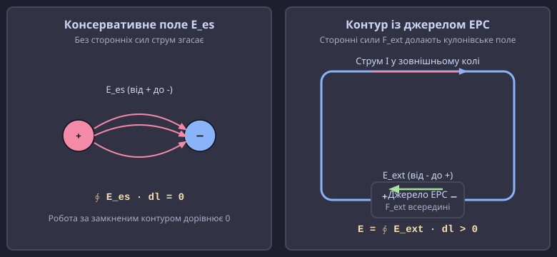
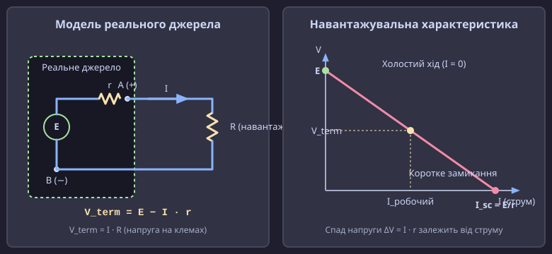
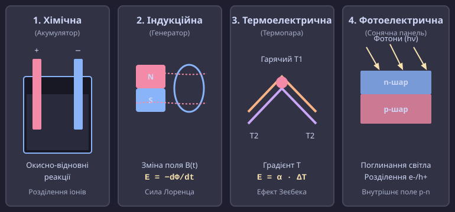

# Електрорушійна сила (ЕРС): природа сторонніх сил та енергетика кола

<preknowlist>
- [Електричний потенціал](topic:ph-electromagnetism/electric-potential) — робота кулонівського поля, потенціальні поверхні та різниця потенціалів.
- [Замкнене коло](topic:ph-electromagnetism/closed-circuit) — неперервна петля провідника як необхідна умова тривалого протікання струму.
- [Електричний струм](topic:ph-electromagnetism/electric-current) — впорядкований дрейфовий рух носіїв заряду під дією електричного поля.
- [Закон Ома та опір](topic:ph-condensed/resistance) — опір провідника, падіння напруги та розсіювання енергії на омічних елементах.
</preknowlist>

Якщо з'єднати дві заряджені металеві кулі провідним дротом, електрони миттєво перетекуть від кулі з нижчим потенціалом до кулі з вищим потенціалом. Однак цей струм триватиме лише крихітну частку мікросекунди: потенціали кулей зрівняються, кулонівське поле всередині провідника зникне, і рух зарядів повністю зупиниться. Ззвичайне електростатичне поле є консервативним — його робота вздовж будь-якого замкненого контуру тотожно дорівнює нулю (`∮ E_es · dl = 0`). Це означає, що електростатичні сили в принципі не здатні змусити заряд циркулювати по замкненому колу знову і знову, долаючи опір дротів та навантаження.

Для того щоб у замкненому колі теробеперервний сталий струм, у ньому неодмінно мусить діяти особливий механізм — джерело енергії, що виконує роботу з переміщення зарядів **проти** сил кулонівського відштовхування. Сили неелектростатичного походження, які виконують цю роботу всередині джерела живлення, називають **сторонніми силами**, а скалярну величину, що виражає роботу цих сил на одиницю перенесеного заряду, — **електрорушійною силою** (ЕРС).

Без концепції ЕРС неможливо пояснити ні роботу звичайного хімічного акумулятора чи сонячної панелі, ні принцип дії електрогенераторів, які живлять енергомережі цілих міст.

---

### Парадокс назви та фізична суть ЕРС

Назва **«електрорушійна сила»** (англ. *electromotive force*, EMF; від лат. *electrum* — бурштин, *motio* — рух, та *fortis* — сила) є одним із найвідоміших історичних термінологічних парадоксів у фізиці.

Попри наявність слова «сила», ЕРС **не є механічною силою** і вимірюється не в ньютонах (`Н`), а у **вольтах** (`В`), що відповідає джоулю на кулон (`Дж/Кл`). ЕРС виражає **енергетичну характеристику** джерела живлення — роботу, яку виконують сторонні сили при переміщенні одиничного позитивного заряду по замкненому колу або на окремій його ділянці.

Термін з'явився на початку XIX століття у працях Алессандро Вольти та Андре-Марі Ампера, коли фізики намагалися описати явище прискорення зарядів у провідниках за аналогією з ньютонівською механікою. Згодом з'ясувалося, що носії заряду в металі рухаються з постійною середньою дрейфовою швидкістю, неперервно втрачаючи кінетичну енергію при зіткненнях із вузлами кристалічної ґратки. Джерело ЕРС діє не як сила, що надає прискорення, а як енергетичний «насос», який поповнює втрачену енергію носіїв.


*Рис. 1 — Ліворуч: у консервативному кулонівському полі циркуляція дорівнює нулю, струм згасає після перерозподілу зарядів. Праворуч: сторонні сили E_ext усередині джерела виконують роботу проти кулонівського поля, забезпечуючи неперервний обхід замкненої петлі.*

Щоб зрозуміти суть сторонніх сил, скористаємося гідравлічною аналогією. Уявімо замкнений контур із водою, що тече по трубах через водяне колесо (навантаження). Вода стікає з високого рівня на низький під дією гравітації — це аналог кулонівського електричного поля. Проте вода не зможе крутити колесо безкінечно: вона зберіться в нижній точці системи і зупиниться. Щоб потік був неперервним, у систему треба вбудувати **механічний насос**, який підніматиме воду з нижнього рівня назад на верхній, виконуючи роботу проти сил тяжіння.

У цій аналогії:
- **Гравітаційне поле** — це кулонівське потенціальне поле `E_es` (прямує від вищого потенціалу до нижчого).
- **Водяний насос** — це джерело ЕРС, яке силою свого лопатевого механізму (сторонніми силами `E_ext`) переміщує воду у зворотному напрямку — знизу вгору.

На мікроскопічному рівні всередині джерела струм тече в зворотному напрямку щодо кулонівських сил: електрони переміщуються від позитивного електроду до негативного (або позитивні іони — від мінуса до плюса). Це означає, що неелектростатичне векторне поле `E_ext` всередині джерела спрямоване **протилежно** до кулонівського поля `E_es` і за модулем перевищує його, змушуючи носії долати внутрішній потенціальний бар'єр.

> ⚠️ **Де ламається гідравлічна аналогія:** Вода має значну масу й інерцію, тому при вимкненні насоса потік зупиняється не одразу. У провіднику ж маса електронів настільки мізерна проти сил решіткового тертя, що при зникненні ЕРС струм згасає практично миттєво — за час порядка `10^-14` секунди.

> 📜 Детальніше про те, як суперечка про здригання лапок препарованих жаб між Луїджі Гальвані та Алессандро Вольтою привела до створення першого Вольтового стовпа та появи поняття ЕРС, читайте у вставці [Історія концепції ЕРС](topic:ph-electromagnetism/emf/hist-volta-galvani.md).

---

### Математичне та енергетичне визначення ЕРС

У довільній точці електричного кола результуюча сила `F_eff`, що діє на носій заряду `q`, дорівнює векторній сумі кулонівської (електростатичної) сили `F_es` та сторонньої сили `F_ext`:

```
F_eff = F_es + F_ext
```

Ввівши напряженість стороннього поля `E_ext = F_ext / q`, визначимо напряженість ефективного електричного поля `E_eff`:

```
E_eff = E_es + E_ext
```

Електрорушійна сила `E` в замкненому контурі `C` визначається як лінійний інтеграл напряженості стороннього поля по цьому контуру:

```
E = ∮ C E_ext · dl
```

Скористаємося тим, що циркуляція консервативного електростатичного поля по будь-якому замкненому контуру дорівнює нулю:

```
∮ C E_es · dl = 0        [теорема про циркуляцію електростатичного поля]
```

Додавши цей нульовий інтеграл до виразу для ЕРС, отримаємо фундаментальну математичну формулу:

```
E = ∮ C E_ext · dl
= ∮ C E_ext · dl + ∮ C E_es · dl      [додавання нуля]
= ∮ C (E_ext + E_es) · dl             [об'єднання під один інтеграл]
= ∮ C E_eff · dl                      [інтеграл від повного поля]
```

Отже, **ЕРС у замкненому контурі дорівнює циркуляції напряженості результуючого електричного поля по всьому контуру**.

#### Мікроскопічна теорія електрохімічного потенціалу

Для хімічних джерел струму (акумуляторів) робота сторонніх сил визначається градієнтом **електрохімічного потенціалу** `η_i` іонів вида `i`:

```
η_i = μ_i + z_i · F · V
```

де `μ_i` — хімічний потенціал іона (залежить від концентрації та природи молекулярних зв'язків), `z_i` — валентність іона, `F` — стала Фарадея (`96485 Кл/моль`), а `V` — електричний потенціал середовища.

Коли дві різні фази (наприклад, металевий анод та рідкий електроліт) приходять у контакт, хімічні потенціали іонів у них відрізняються (`μ_anode ≠ μ_electrolyte`). Це змушує іони спонтанно переходити через межу фаз. Перехід іонів триває доти, доки виникла міжфазна різниця електричних потенціалів `ΔV` не врівноважить різницю хімічних потенціалів:

```
ΔV = − (μ_anode − μ_electrolyte) / (z · F)
```

Ця міжфазна різниця потенціалів у стані рівноваги і визначає внутрішню ЕРС хімічного елемента.

#### Енергетичний баланс за законом збереження енергії

Повна робота сторонніх сил `W_ext` за час `Δt` витрачається на теплові втрати у зовнішньому навантаженні `R` та внутрішньому опорі `r`:

```
W_ext = E · I · Δt
= I² · R · Δt + I² · r · Δt           [закон Джоуля — Ленца для повного кола]
= I · (I · R + I · r) · Δt
= I · (V_term + ΔV_int) · Δt
```

Це демонструє повну відповідність поняття ЕРС першому закону термодинаміки: не-електрична енергія джерела повністю перетворюється на роботу та теплоту в колі.

#### ЕРС проти різниці потенціалів (падіння напруги)

Слід чітко розрізняти два близьких поняття — **різницю потенціалів** (напругу) та **електрорушійну силу**:

1. **Різниця потенціалів (`U_AB = V_A − V_B`)** між точками `A` та `B` визначається роботою **потенціального кулонівського поля**. Вона показує, яка енергія виділяється носіями заряду при рухах від точки з вищим потенціалом до точки з нижчим потенціалом.
2. **Електрорушійна сила (`E`)** визначається роботою **сторонніх неконсервативних сил**. Вона показує, яка енергія непотенціального походження (хімічна, механічна, термічна, оптична) перетворюється на електричну енергію в джерелі.

```
+-----------------------------------------------------------------------+
|  Параметр              |  Різниця потенціалів (U)  |  ЕРС (E)        |
+------------------------+---------------------------+------------------+
|  Природа сил           |  Кулонівські (потенціальні)|  Сторонні        |
|  Циркуляція по контуру |  Завжди дорівнює 0        |  Може бути > 0   |
|  Напрямок всередині    |  Від (+) до (−)           |  Від (−) до (+)  |
|  Перетворення енергії  |  Електрична -> Тепло/Робота|  Неелектрична -> |
|                        |                           |  Електрична      |
+------------------------+---------------------------+------------------+
```

Якщо ми розглянемо окрему ділянку кола між точками `1` та `2`, яка містить джерело ЕРС, то робота повного поля `E_eff` над одиничним зарядом дорівнює **узагальненому закону Ома для неоднорідної ділянки кола**:

```
U_12 = (V_1 − V_2) + E_12 = I · R_12
```

де `(V_1 − V_2)` — різниця потенціалів на кінцях ділянки, `E_12` — ЕРС джерела на цій ділянці, а `R_12` — повний опір ділянки.

> 🧮 Строгий векторний аналіз розкладу полів за теоремою Гельмгольца, виведення диференціальної форми через ротор та зв'язок ЕРС із рівняннями Максвелла наведено у вставці [Математична теорія ЕРС та індукція](topic:ph-electromagnetism/emf/math-emf-circulation.md).

---

### Реальні джерела живильного струму: внутрішній опір та напруга на клемах

Ідеальне джерело ЕРС — це математична абстракція: воно підтримує постійну напругу на своїх виводах незалежно від струму, який споживає коло. Проте будь-яке реальне джерело (акумулятор, батарейка, генератор, сонячний елемент) виготовлене з реальних матеріалів, що мають власний електричний опір.

Цей опір називається **внутрішнім опором джерела** (`r`). У хімічних елементах `r` зумовлений опором електроліту та пористих сепараторів; у генераторах — опором мідних обмоток статора; у фотоелементах — опором напівпровідникових шарів `p-n` переходу.


*Рис. 2 — Ліворуч: еквівалентна схема реального джерела, що складається з ідеального елемента ЕРС E та послідовного внутрішнього опору r. Праворуч: навантажувальна характеристика V_term(I), яка лінійно спадає від напруги холостого ходу E до нуля при струмі короткого замикання I_sc.*

Розглянемо замкнене коло, що складається з реального джерела з ЕРС `E` та внутрішнім опором `r`, підключеного до зовнішнього навантаження з опором `R`.

За законом Ома для повного кола струм у колі дорівнює:

```
I = E / (R + r)
```

Перепишемо це рівняння, помноживши обидві частини на `(R + r)`:

```
E = I · R + I · r
```

Цей вираз описує **баланс напруг у замкненому колі**: повна ЕРС джерела розпадається на два падіння напруги:
1. `I · R = V_term` — падіння напруги на зовнішньому навантаженні (напруга на клемах джерела).
2. `I · r = ΔV_int` — внутрішнє падіння напруги всередині самого джерела.

Звідси випливає фундаментальне рівняння для **напруги на клемах джерела (`V_term`)**:

```
V_term = E − I · r
```

Аналіз цього рівняння дає три характерні режими роботи кола:

#### 1. Режим холостого ходу (`I = 0`)
Якщо зовнішнє коло розімкнене (`R -> ∞`), струм у колі не тече (`I = 0`). Тоді внутрішнє падіння напруги дорівнює нулю:

```
V_term = E − 0 · r = E
```

**Напруга на клемах розімкненого джерела точно дорівнює його ЕРС.** Саме тому вимірювання напруги батарейки високоомним вольтметром (який майже не споживає струму) дає значення справжньої ЕРС.

#### 2. Робочий режим під навантаженням (`0 < R < ∞`)
При підключенні навантаження крізь джерело тече струм `I`. Напруга на клемах `V_term` стає **меншою** за ЕРС на величину внутрішнього падіння напруги `I · r`. Чим більший струм споживає навантаження (чим менший опір `R`), тим сильніше «просідає» напруга на клемах джерела.

#### 3. Режим короткого замикання (`R -> 0`)
Якщо клеми джерела з'єднати провідником із нехтувально малим опором (`R ≈ 0`), напруга на клемах впаде майже до нуля (`V_term ≈ 0`), а струм у колі досягне максимально можливого значення — **струму короткого замикання (`I_sc`)**:

```
I_sc = E / r
```

Для джерел із малим внутрішнім опором (наприклад, автомобільний свинецво-кислотний акумулятор або літій-іонний елемент, де `r ≈ 0.01 Ом`), струм короткого замикання може досягати сотень і тисяч ампер. Це призводить до миттєвого виділення гігантської теплової потужності `P = I_sc² · r` всередині акумулятора, що викликає його скипання, вибух або пожежу.

```
================================================================================
  Параметр / Режим        |  Холостий хід     |  Робочий режим    |  Коротке замикання
================================================================================
  Зовнішній опір (R)      |  R -> ∞           |  R ≈ r            |  R -> 0
  Струм у колі (I)        |  I = 0            |  I = E / (R + r)  |  I_sc = E / r
  Напруга на клемах (V)   |  V_term = E       |  V_term = E − I·r |  V_term ≈ 0
  Корисна потужність (P)  |  P_load = 0       |  P_max при R = r  |  P_load = 0
  ККД джерела (η)         |  100% (теоретичний)|  η = R / (R + r)  |  0% (усе в тепло)
================================================================================
```

#### Фізика старіння та нелінійності внутрішнього опору
У реальних акумуляторах внутрішній опір `r` не є постійною величиною. Він залежить від трьох чинників:
1. **Температура:** при зниженні температури в'язкість електроліту зростає, а рухливість іонів падає. При −20 °C опір `r` зростає у 5–10 разів проти кімнатної температури, що пояснює, чому замерзлий акумулятор не здатний прокрутити стартер автомобіля.
2. **Стан заряду (SoC):** наприкінці розрядки розчин виснажується, на електродах росте шар диелектричних продуктів реакції, і опір `r` різко злітає вгору.
3. **Деградація та старіння:** із циклами заряд-розряд на аноді утворюється шар Solid Electrolyte Interphase (SEI), мікротріщини в електродах та дендрити, що незворотно збільшує `r` і зменшує віддачу потужності.

> ⚙️ Практичну реалізацію алгоритму чисельного моделювання розрядки акумулятора під імпульсним навантаженням та розрахунок теплових втрат з кодом мовами C та C++ дивіться у вставці [Чисельне моделювання джерела ЕРС](topic:ph-electromagnetism/emf/proj-battery-internal-resistance.md).

---

### Фізичні механізми виникнення ЕРС (різновиди сторонніх сил)

Залежно від фізичного процесу, який виконує роботу з розділення зарядів усередині джерела, виділяють п'ять основних типів сторонніх сил.


*Рис. 3 — Чотири основні фізичні різновиди джерел ЕРС: 1) Хімічний (окисно-відновні реакції на електродах); 2) Індукційний (зміна магнітного потоку); 3) Термоелектричний (ефект Зеєбека на градієнті температур); 4) Фотоелектричний (поглинання фотонів у p-n переході).*

#### 1. Хімічна ЕРС (гальванічні елементи, акумулятори, паливні елементи)

У гальванічних елементах джерелом сторонніх сил є **гетерогенні окисно-відновні хімічні реакції**, що відбуваються на межі розділу між твердими електродами та рідким (або гелеподібним) електролітом.

Атоми цинкового чи літієвого анода окислюються, віддаючи електрони у зовнішнє коло та переходячи в електроліт у вигляді позитивних іонів:

```
Zn  -->  Zn²⁺ + 2 e⁻     [окислення на аноді]
```

На катоді відбувається реакція відновлення, де іони з електроліту приймають електрони:

```
Cu²⁺ + 2 e⁻  -->  Cu     [відновлення на катоді]
```

Хімічна спорідненість матеріалу електродів до електронів створює різницю хімічних потенціалів. Електрохімічні реакції переносять заряди проти сил кулонівського поля між електродами за рахунок вільній енергії Гіббса `ΔG`:

```
E = − ΔG / (n · F)
```

де `n` — кількість перенесених електронів на моль речовини, а `F` — стала Фарадея.

У водневих паливних елементах (Fuel Cells) хімічна ЕРС виникає в результаті безпосереднього окислення водню киснем через протонно-обмінну мембрану (PEM), даючи ЕРС близько `1.23 В` на комірку з викидом чистої води замість шкідливих газів.

#### 2. Індукційна ЕРС (електромагнітна індукція)

Індукційна ЕРС виникає під дією двох різних фізичних механізмів, які описуються єдиним математичним **законом Фарадея**: `E = − dΦ_B / dt`.

- **ЕРС руху (магнітна частина сили Лоренца):** Виникає, коли провідник рухається зі швидкістю `v` в постійному магнітному полі `B`.


*Рис. 4 — Провідник довжиною L рухається зі швидкістю v у магнітному полі B. Магнітна частина сили Лоренца F_L = q(v × B) відхиляє позитивні заряди вгору, а негативні — вниз, утворюючи ЕРС руху E = v · B · L.*

На кожен вільний електрон у рухомому провіднику діє сила Лоренца `F_L = q · (v × B)`. Її магнітна складова спрямована вздовж провідника і виконує роль сторонньої сили, зміщуючи електрони до одного з кінців провідника. Модуль ЕРС руху в прямому стержні довжиною `L`:

```
E_motion = v · B · L · sin(θ)
```

> ⚛️ **Релятивістська теорія:** У спеціальній теорії відносності Ейнштейна (1905) поділення на ЕРС руху та трансформаторну ЕРС залежить від обраної системи відліку. У системі відліку лабораторії на рухомий провідник діє магнітна сила Лоренца. Проте у супутній системі відліку, що рухається разом із провідником, провідник є нерухомим, а магнітне поле перетворюється за релятивістськими формулами перетворення полів у **чисте вихрове електричне поле `E'`**, яке й здійснює роботу над електронами.

- **Трансформаторна ЕРС (вихрове електричне поле):** Виникає в **нерухомому** провіднику, розташованому у часово-змінному магнітному полі `B(t)`. Згідно з другим рівнянням Максвелла (`∇ × E = − ∂B / ∂t`), змінне магнітне поле породжує у просторі **вихрове електричне поле** `E_ind`. Лінії цього поля замкнені самі на себе, а його циркуляція відмінна від нуля. Саме вихрове електричне поле виступає сторонньою силою, що жене струм по контуру.

#### 3. Термоелектрорушійна сила (ефект Зеєбека)

Якщо з'єднати два різні провідники (або напівпровідники `p`- та `n`-типу) у замкнене коло і підтримувати спаї при різних температурах `T_hot` та `T_cold`, у колі виникне **термоелектрорушійна сила** (ефект Зеєбека):

```
E_thermo = α_S · (T_hot − T_cold)
```

де `α_S` — коефіцієнт Зеєбека (для термопар вимірюється в мкВ/К). Фізичним механізмом сторонніх сил тут є **термічна дифузія носіїв заряду**: на гарячому кінці носії заряду (електрони або дирки) мають вищу кінетичну енергію і хаотично дифундують убік холодного кінця, створюючи надлишок заряду та різницю потенціалів.

Термоелектричні генератори на основі полупровідникових петель (наприклад, теллуриду вісмуту `Bi₂Te₃`) використовують у радіоізотопних джерелах (RTG) космічних апаратів «Вояджер» та «К'юріосіті», де тепло від розпаду плутонію-238 перетворюється безпосередньо в ЕРС протягом десятиліть.

#### 4. Фотоелектрична ЕРС (вентильний фотоефект)

У сонячних батареях та фотодіодах ЕРС виникає при поглинанні фотонів світла у зоні напівпровідникового `p-n` переходу.

1. Фотон із енергією `hν > E_g` (де `E_g` — ширина забороненої зони) поглинається кристаллом та створює пару носіїв: вільний електрон `e⁻` та дирку `h⁺`.
2. Внутрішнє високовольтне кулонівське поле збідненої зони `p-n` переходу негайно розділяє ці носії: електрони скидаються в `n`-область, а дирки — у `p`-область.
3. Накопичення основних носіїв у відповідних областях створює фото-ЕРС на клемах сонячного елемента (близько `0.5–0.7 В` для кремнію).

#### 5. П'єзоелектрична ЕРС

Виникає при механічній деформації (стисканні або розтягуванні) кристалів із нецентросиметричною ґраткою (наприклад, кварцю `SiO₂` чи титанату барію `BaTiO₃`). Зсув позитивних та негативних іонів у кристалічній ґратці створює макроскопічну поляризацію і розсуває заряди до протилежних граней кристала, формуючи ЕРС у сотні та тисячі вольтів при коротких ударних імпульсах.

---

### Систематична порівняльна характеристика джерел ЕРС

Для порівняльного аналізу різних типу джерел наведемо їхні типові параметри:

```
+-----------------------------------------------------------------------------------+
| Тип джерела      | Фізичний механізм | Типова ЕРС (Е) | Внутрішній опір (r) | ККД (%)|
+------------------+-------------------+----------------+---------------------+--------+
| Li-ion акумулятор| Електрохімічний   | 3.6 – 4.2 В    | 0.01 – 0.05 Ом      | 90–95% |
| Сонячна панель   | Фотоелектричний   | 0.5 – 0.7 В/осеред| 0.5 – 2.0 Ом       | 18–24% |
| Термопара (K-type)| Термоелектричний | 41 мкВ/°C      | 1 – 10 Ом           | 5–8%   |
| Синхронний ген.  | Індукційний (v×B) | 220 В – 24 кВ  | 0.001 – 0.1 Ом      | 95–98% |
| П'єзоелемент     | Механополяризація | 100 В – 5 кВ   | 10^6 – 10^9 Ом      | 1–3%   |
+-----------------------------------------------------------------------------------+
```

---

### Практичні вимірювання, похибки та паразитні ЕРС в інженерії

У реальній інженерній практиці розробники високоточних вимірювальних приладів, аналогових схем та систем живлення неодмінно стикаються з явищами, які випливають із фізичної природи ЕРС.

#### Практичні правила вимірювання ЕРС
1. **Неможливість прямого вимірювання вольтметром під навантаженням:** Звичайний мультиметр міряє не pure ЕРС, а напругу на клемах `V_term = E − I · r`. Щоб виміряти справжнє значення ЕРС `E`, прилад повинен мати вхідний опір `R_in >> r` (для побутових батарейок `R_in > 10 Ом` цілком достатньо, оскільки `r ≈ 0.1–1 Ом`).
2. **Метод компенсаційного вимірювання:** Для прецизійного вимірювання ЕРС (наприклад, еталонних елементів Вестона) використовують **потенціометричні компенсаційні схеми**. У цих схемах вимірювана ЕРС зрівноважується протилежно спрямованою регульованою напругою від еталонного джерела доти, доки струм у вимірювальному колі не стане тотожно рівним нулю (`I = 0`). Це повністю усуває похибку від внутрішнього опору `r`.
3. **Чотирипровідна схема Кельвіна (Kelvin Sensing):** При вимірюванні малих внутрішніх опорів розділяють кола струму та кола вимірювання напруги. Пара виводів Force подає вимірювальний струм, а окрема пара виводів Sense знімає напругу безпосередньо з клем батареї. Оскільки крізь кола Sense струм не тече, опір вимірювальних дротів не створює похибки.

#### Паразитні ЕРС у високоточних електронних схемах
При розробці чутливих підсилювачів (наприклад, для мікровольтних сигналів з тензодатчиків або термопар) виникає проблема **паразитних ЕРС**, які спотворюють корисний сигнал:

- **Паразитні термо-ЕРС у пайках (ефект Зеєбека):** З'єднання двох різних металів (наприклад, мідного провідника друкованої плати `Cu` та свинцево-оловоносного припою `Sn-Pb`) утворює термопару із коефіцієнтом Зеєбека близько `1–3 мкВ/°C`. Якщо протилежні кінці компонента мають різницю температур всього в `3 °C` (наприклад, через близькість гарячого силового транзистора), у колі виникне паразитна ЕРС до `10 мкВ`, що повністю перекриє корисний мікровольтний сигнал.

> 🔧 **Як з цим боротися:** Для високоточних аналогових плат застосовують симетричне розведення провідників (термосиметрію), ізолюють вимірювальні кола від джерел тепла та використовують спеціальні безтермопараметричні припої або суцільні мідні з'єднання.

- **Паразитні індукційні ЕРС (контури заземлення):** Великі замкнені контури з провідників друкованої плати діють як приймальні рамки для зовнішніх змінних магнітних полів (наприклад, від наведень мережі `50 Гц` або імпульсних джерел живлення). Згідно із законом Фарадея, змінне магнітне поле наводить у таких контурах паразитну індукційну ЕРС. 

> 🔧 **Як з цим боротися:** Зменшують площу замкнених контурів `S`, застосовують виті пари провідників (де наведені ЕРС у сусідніх витках взаємно компенсуються) та суцільні внутрішні шари «землі» (GND planes).

Отже, електрорушійна сила є не просто теоретичною концепцією електродинаміки, а фундаментальним поняттям, що поєднує фундаментальні закони збереження енергії з щоденною інженерною практикою проектиування електронних та енергетичних систем.
