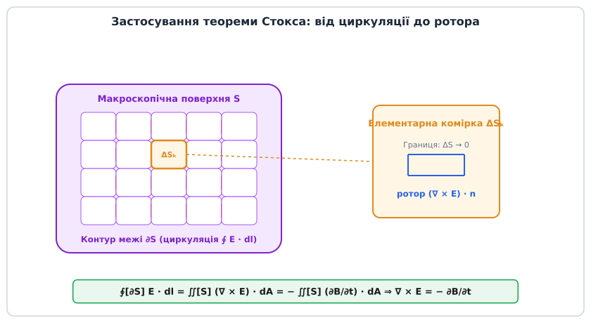
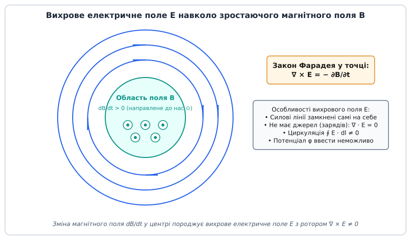
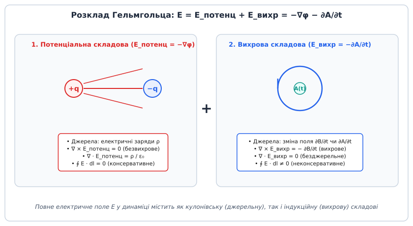
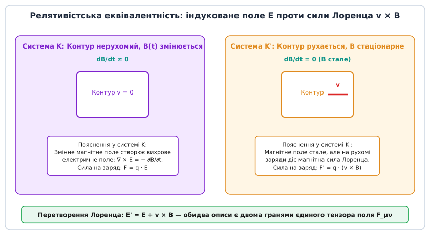

# Закон Фарадея у диференціальній формі: ротор електричного поля та вихрові явища

<preknowlist>
- [Електромагнітна індукція](topic:ph-electromagnetism/electromagnetic-induction) — інтегральний закон Фарадея: електрорушійна сила в замкненому контурі дорівнює швидкості зміни магнітного потоку зі знаком мінус.
- [Електричне поле](topic:ph-electromagnetism/electric-field) — поняття векторної напруженості електричного поля E, циркуляція поля та лінійні інтеграли.
- [Магнітне поле](topic:ph-electromagnetism/magnetic-field) — вектор магнітної індукції B, лінії магнітного поля та магнітний потік.
- [Потенціальне поле й циркуляція](topic:ph-electromagnetism/conservative-field) — властивості безвихрових полів, де циркуляція по будь-якому замкненому шляху тотожно дорівнює нулю.
</preknowlist>

Усереднений соленоїд радіусом `R₀ = 0.10` м із кількістю витків `N = 500` перебуває у змінному магнітному полі, яке зростає зі швидкістю `dB/dt = 2.5` Тл/с. Інтегральний закон електромагнітної індукції Майкла Фарадея однозначно описує макроскопічний результат: у металевій котушці, що охоплює цей потік, виникає електрорушійна сила `ЕРС = −N · (dΦ/dt) = −39.27` В. Але якщо прибрати мідний дріт і залишити на його місці абсолютно порожній вакуум, у тому самому фізичному об'ємі виникне електричне поле з напруженістю `E_θ = 0.125` В/м на відстані `r = 0.10` м від осі. Для формування цього поля не потрібні ані металеві провідники, ані вільні носії заряду, ані замкнені електричні кола. Електричне поле виникає безпосередньо в кожній геометричній точці простору лише тому, що в цій точці змінюється магнітна індукція.

Математичне формулювання цього феномену переносить фізику з макроскопічних вимірювань у замкнених дротяних контурах на локальну мову полів, де значення мають похідні у просторі та часі. [Диференціальна форма закону Фарадея](topic:ph-electromagnetism/faraday-law-differential/hist-maxwell-heaviside.md) становить фундаментальне друге рівняння Максвелла:

```
∇ × E = − ∂B / ∂t
```

Це рівняння стверджує, що швидкість зміни магнітного поля в часі зі знаком мінус є джерелом ротора (вихровості) електричного поля у цій самій точці простору. Воно повністю скасовує уявлення про електричне поле як про суто кулонівську силу, яка починається на позитивних зарядах і закінчується на негативних.

## 1. Від макроскопічного контуру до кожної точки простору

Інтегральне рівняння індукції Фарадея описує глобальний ефект:

```
ЕРС = ∮ [∂S] E · dl = − (d / dt) ∬ [S] B · dA
```

Ліва частина цього рівняння розраховує циркуляцію вектора напруженості електричного поля `E` вздовж замкненого геометричного контуру `∂S`, а права частина визначає швидкість зміни повного магнітного потоку `Φ_B` через довільну двовимірну поверхню `S`, яку спирає цей контур.


*Застосування математичного апарату теореми Стокса. Макроскопічна поверхня S розбивається на сітку елементарних комірок ΔSₖ. Сумування циркуляцій по межах усіх комірок приводить до взаємного скасування внутрішніх протилежних внесків. На межі залишається лише циркуляція вздовж зовнішнього контуру ∂S, що дорівнює поверхневому інтегралу від ротора поля.*

Попри повну математичну коректність у макроскопічних розрахунках трансформаторів та генераторів, інтегральна форма володіє серйозним фізичним обмеженням: вона є **нелокальною**. Права частина формули вимагає знання магнітного поля на всій площі поверхні `S`, а ліва частина сумує роботу поля вздовж усього замкненого макроскопічного шляху `∂S`. У класичній польовій фізиці діє принцип ближньої дії (локальності): подія у точці `(x, y, z)` у момент часу `t` залежить лише від стану полів та їхніх похідних у цій самій точці та в її нескінченно малому околі.

Крім того, нелокальний інтегральний опис викликає фундаментальний парадокс при вимірюванні напруги у колах зі змінним магнітним потоком. Якщо приєднати два однакові вольтметри до двох фіксованих точок `A` та `B` одного й того самого електричного кола, але розкласти вимірювальні провідники першого вольтметра праворуч від області магнітного потоку, а другого вольтметра — ліворуч, прилади покажуть **різні значення напруги**! Це відбувається тому, що криволінійний інтеграл `∫ [A->B] E · dl` залежить від геометричного шляху прокладання з'єднувальних проводів. Другий закон Кірхгофа, який базується на потенціальності статичного поля (`∮ E · dl = 0`), втрачає чинність у колах із часово змінним магнітним потоком. Для аналізу таких систем необхідне локальне диференціальне рівняння, що описує поле у кожній точці.

Щоб перейти від інтегрального опису до локального диференціального рівняння, розглянемо нерухомий у просторі замкнений контур `∂S`, який обмежує нерухому орієнтовану поверхню `S`. Оскільки геометричні межі інтегрування не змінюються з часом, операцію повної похідної по часу `d/dt` перед поверхневим інтегралом можна внести під знак інтеграла у вигляді часткової похідної `∂/∂t`:

```
∮ [∂S] E · dl = − ∬ [S] (∂B / ∂t) · dA
```

Застосуємо математичну **теорему Стокса**, яка пов'язує циркуляцію векторного поля вздовж замкненого контуру `∂S` із потоком ротора цього ж поля через поверхню `S`:

```
∮ [∂S] E · dl = ∬ [S] (∇ × E) · dA
```

Прирівнюючи праві частини обох виразів, отримуємо єдиний поверхневий інтеграл:

```
∬ [S] (∇ × E) · dA = − ∬ [S] (∂B / ∂t) · dA
```

Перенесемо всі доданки під один підінтегральний знак:

```
∬ [S] ( ∇ × E + ∂B / ∂t ) · dA = 0
```

Це співвідношення має виконуватися для **будь-якої** довільно обраної поверхні `S` та для будь-якого замкненого контуру `∂S` у просторі. Якщо інтеграл від неперервної функції по довільній області тотожно дорівнює нулю, то підінтегральний вираз мусить тотожно дорівнювати нулю у кожній гладкій точці простору:

```
∇ × E + ∂B / ∂t = 0   ⇒   ∇ × E = − ∂B / ∂t
```

Отримане вираження є [математичним виведенням диференціальної форми](topic:ph-electromagnetism/faraday-law-differential/math-stokes-derivation.md). Воно перетворює експериментальний закон індукції на фундаментальне локальне рівняння поля.

## 2. Граничні умови на межі розділу середовищ

Диференціальна форма закону Фарадея дозволяє суворо вивести граничні умови для вектора напруженості електричного поля `E` на межі розділу двох різних фізичних середовищ (наприклад, вакууму та діелектрика або двох діелектриків із різною проникністю).

Уявимо вузьку прямокутну рамку висотою `h` та довжиною `L`, яка перетинає плоску межу розділу середовища 1 та середовища 2. Вектор нормалі до межі позначимо `n`, а тангенціальний одиничний вектор вздовж межі — `τ`.

Обчислимо циркуляцію вектора `E` вздовж цієї прямокутної рамки:

```
∮ E · dl = E_{1t} · L − E_{2t} · L + E_{normal} · O(h)
```

За диференційним законом Фарадея ця циркуляція дорівнює потоку `−∂B/∂t` через площу рамки `ΔS = L · h`. У граничному переході, коли висота рамки прямує до нуля (`h -> 0`), площа рамки стискається в нуль (`ΔS -> 0`). Якщо магнітна індукція `B` та її похідна `∂B/∂t` залишаються скінченними (не містять сингулярних δ-функцій), магнітний потік через рамку прямує до нуля:

```
lim[h->0] ∬ [ΔS] (∂B / ∂t) · dA = 0
```

Отже, граничний перехід дає:

```
E_{1t} · L − E_{2t} · L = 0   ⇒   E_{1t} = E_{2t}
```

У векторній формі це гранична умова для дотичних компонент електричного поля:

```
n × ( E₂ − E₁ ) = 0
```

Тангенціальна компонента напруженості електричного поля завжди є **неперервною** при переході через будь-яку нерухому межу розділу середовищ, незалежно від наявності поверхневих зарядів або зміни діелектричної проникності.

## 3. Фізична природа вихрового електричного поля

Диференціальна форма `∇ × E = −∂B/∂t` кардинально змінює фізичне розуміння електричного поля, розділяючи його на два класи з принципово різною топологією та математичними властивостями.

В електростатиці, де всі магнітні поля або відсутні, або стаціонарні у часі (`∂B/∂t = 0`), оператор ротора дає тотожний нуль:

```
∇ × E_статичне = 0
```

Нульовий ротор означає, що статичне електричне поле є **консервативним (потенціальним)**. Його силові лінії завжди починаються на позитивних електричних зарядах і закінчуються на негативних (або ідуть у нескінченність). Робота такого поля з переміщення заряду по будь-якій замкненій траєкторії дорівнює нулю, що дозволяє однозначно ввести скалярний електричний потенціал `φ`:

```
E_статичне = − ∇φ
```

Однак у динамічних процесах, коли магнітна індукція змінюється у часі (`∂B/∂t ≠ 0`), ротор електричного поля стає відмінним від нуля. Це означає виникнення **вихрового (індукованого) електричного поля** `E_індуковане`.


*Конструкція вихрового електричного поля E. У центральній циліндричній області магнітне поле зростає (dB/dt > 0). Навколо цієї області виникають замкнені силові лінії електричного поля, орієнтовані проти годинникової стрілки за правилом Ленца. Ротор поля відмінний від нуля, а лінії поля не мають джерел і не перериваються.*

Ключові фізичні відмінності вихрового електричного поля від кулонівського електростатичного поля:

1. **Відсутність джерел зарядів**: Силові лінії вихрового електричного поля починаються ніде і ніде не закінчуються. Вони являють собою **суцільні замкнені лінії**, що охоплюють ділянки зі змінним магнітним потоком. Дивергенція індукованого поля у вакуумі дорівнює нулю: `∇ · E_вихр = 0`.
2. **Неможливість введення скалярного потенціалу**: Оскільки циркуляція поля вздовж замкненого контуру відмінна від нуля (`∮ E · dl ≠ 0`), робота з переміщення заряду по замкненому колу не дорівнює нулю. Це означає, що напрямок руху заряду визначає отриману або витрачену енергію, а поняття «потенціалу точки» втрачає однозначний зміст.
3. **Непотенціальний характер сил**: Вихрове електричне поле прискорює заряджені частинки вздовж замкнених траєкторій, передаючи їм кінетичну енергію безпосередньо з енергії електромагнітного поля. На цьому принципі побудовано прискорювач електронів — бетатрон.

У загальному динамічному випадку повне електричне поле у просторі складається з суми двох компонент за теоремою Гельмгольца:

```
E = E_потенціальне + E_вихрове
```

Записуючи потенціальну компоненту через скалярний потенціал `φ`, а вихрову через [векторний потенціал магнітного поля](topic:ph-electromagnetism/faraday-law-differential/api-field-operators.md) `A` (де `B = ∇ × A`), отримуємо фундаментальний вираз для повного напруженості електричного поля:

```
E = − ∇φ − (∂A / ∂t)
```

Застосуємо оператор ротора `∇ ×` до обох частин цього виразу. Оскільки ротор від градієнта будь-якого скалярного поля тотожно дорівнює нулю (`∇ × (∇φ) ≡ 0`), отримаємо:

```
∇ × E = − ∇ × (∂A / ∂t) = − (∂ / ∂t) (∇ × A) = − ∂B / ∂t
```

Це підтверджує абсолютну узгодженість потенціального опису з диференційною формою закону Фарадея.

Важливо відзначити властивість **калібрувальної інваріантності** (Gauge Invariance). Векторний потенціал `A` та скалярний потенціал `φ` визначені неоднозначно. Якщо здійснити калібрувальне перетворення потенціалів за допомогою довільної скалярної функції `Λ(x, y, z, t)`:

```
A' = A + ∇Λ
φ' = φ − (∂Λ / ∂t)
```

То фізичні спостережувані поля `B` та `E` залишаються абсолютно незмінними:

```
B' = ∇ × A' = ∇ × A + ∇ × (∇Λ) = ∇ × A = B
E' = − ∇φ' − (∂A' / ∂t) = − ∇(φ − ∂Λ/∂t) − (∂ / ∂t)(A + ∇Λ) = − ∇φ − (∂A / ∂t) = E
```

Ця інваріантність підкреслює, що фізичною реальністю володіють саме силові поля `E` та `B`, пов'язані диференційним законом Фарадея, а потенціали є зручним математичним інструментом.


*Структура повного електричного поля за теоремою Гельмгольца. Ліва частина показує потенціальну компоненту, яка породжується зарядами q і має джерела та стоки. Права частина показує вихрову компоненту, яка виникає від зміни векторного потенціалу ∂A/∂t і утворює замкнені кільця.*

## 4. Приклад бетатрона: прискорення електронів вихровим полем

Яскравим прикладом практичного застосування диференційного закону Фарадея є **бетатрон** — індукційний прискорювач електронів, створений Дональдом Керстом у 1940 році.

У бетатроні електрони рухаються у вакуумній тороїдальній камері по коловій орбіті сталого радіуса `R`. Магнітне поле `B(t)` у бетатроні виконує подвійну роль:
1. Воно утримує електрон на коловій орбіті радіуса `R` за допомогою сили Лоренца.
2. Його часова зміна `dB/dt` створює за диференційним законом Фарадея тангенціальне вихрове електричне поле `E_θ`, яке прискорює електрон.

Обчислимо тангенціальне електричне поле на орбіті радіуса `R`:

```
2π R · E_θ = − (d / dt) ∬ [S] B · dA = − (d / dt) ( π R² · <B> )
```

де `<B>` — середнє значення магнітної індукції всередині кола орбіти. Звідси вихрове електричне поле дорівнює:

```
E_θ = − (R / 2) · ( d<B> / dt )
```

Рівняння руху електрона під дією цього вихрового поля:

```
dp / dt = e · E_θ = (e R / 2) · ( d<B> / dt )
```

звідки імпульс електрона `p` зростає пропорційно середньому полю: `p(t) = (e R / 2) · <B>(t)`.

З іншого боку, умова утримання електрона на коловій орбіті радіуса `R` вимагає, щоб його імпульс дорівнював `p(t) = e R B_орбіта(t)`, де `B_орбіта` — значення магнітного поля безпосередньо на самій орбіті електрона.

Порівнюючи обидва вирази для імпульсу `p(t)`, отримуємо славетну **умову бетатрона Керста (співвідношення 2:1)**:

```
B_орбіта(t) = (1 / 2) · <B>(t)
```

Для стабільного прискорення електронів на коловій орбіті сталого радіуса магнітне поле на самій орбіті має бути вдвічі меншим за середнє магнітне поле всередині орбіти. Це досягається спеціальною профільованою формою полюсних наконечників електромагніту. Без вихрового електричного поля, заданого диференційним закону Фарадея, створення таких прискорювачів було б неможливим.

## 5. Компоненти рівняння у декартових та циліндричних координатах

Щоб застосовувати диференціальну форму закону Фарадея в інженерних розрахунках та чисельному моделюванні, векторне рівняння `∇ × E = −∂B/∂t` розкладають на скалярні компоненти у відповідних системах координат.

У декартовій системі координат `(x, y, z)` оператор векторного добутку `∇ × E` визначається через детермінант матриці операторів:

```
∇ × E = |  e_x     e_y     e_z   |
        | ∂/∂x    ∂/∂y    ∂/∂z   |
        |  E_x     E_y     E_z   |
```

Це дає систему трьох зв'язаних скалярних диференціальних рівнянь першого порядку у частинних похідних:

```
∂E_z / ∂y − ∂E_y / ∂z = − ∂B_x / ∂t
∂E_x / ∂z − ∂E_z / ∂x = − ∂B_y / ∂t
∂E_y / ∂x − ∂E_x / ∂y = − ∂B_z / ∂t
```

Кожне з цих рівнянь показує, як просторова неоднорідність (просторовий зсув або зсувна деформація) компонент електричного поля в одній площині викликає часову зміну відповідної ортогональної компоненти магнітного поля.

Розглянемо класичний приклад з аксіальною симетрією, який часто виникає в індукційних печах, соленоїдах та коаксіальних кабелях. У циліндричній системі координат `(r, θ, z)` припустимо, що магнітне поле має лише одну поздовжню компоненту `B = (0, 0, B_z(t, r))`, яка є симетричною відносно осі `z`.

В силу симетрії індуковане електричне поле матиме лише азимутальну компоненту `E = (0, E_θ(r, t), 0)`. Єдина ненульова компонента ротора у циліндричних координатах набуває вигляду:

```
(∇ × E)_z = (1 / r) · (∂ / ∂r) (r · E_θ)
```

Застосовуючи закон Фарадея у диференціальній формі, отримуємо скалярне рівняння для азимутального поля:

```
(1 / r) · (∂ / ∂r) (r · E_θ) = − ∂B_z / ∂t
```

Помножимо обидві частини на `r` та інтегруємо по радіусу від `0` до `r`:

```
r · E_θ(r, t) = − ∫ [0 -> r] (∂B_z / ∂t) · r' dr'
```

Розглянемо два випадки розподілу магнітного поля:

1. **Всередині однорідного поля соленоїду** (`r ≤ R₀`), де `B_z(t)` не залежить від радіуса:
   ```
   r · E_θ = − (∂B_z / ∂t) · (r² / 2)   ⇒   E_θ(r) = − (r / 2) · (dB_z / dt)
   ```
   Напруженість вихрового електричного поля **зростає лінійно** з віддаленням від осі симетрії. В самій центральній точці `r = 0` електричне поле дорівнює нулю.

2. **Поза межами соленоїду** (`r > R₀`), де магнітне поле відсутнє (`B_z = 0`), а весь змінний магнітний потік `Φ_B = π R₀² B_z(t)` зосереджений усередині трубки радіуса `R₀`:
   ```
   r · E_θ = − (1 / 2π) · (dΦ_B / dt)   ⇒   E_θ(r) = − (R₀² / (2 r)) · (dB_z / dt)
   ```
   Зовні соленоїду напруженість вихрового електричного поля **спадає обернено пропорційно відстані** `1/r`.

Цей результат виявляє фундаментальний локальний парадокс: у точках простору поза соленоїдом (`r > R₀`) магнітне поле тотожно дорівнює нулю (`B = 0`), а отже й `∂B/∂t = 0`. Відповідно, локальний ротор електричного поля у цих точках тотожно дорівнює нулю: `∇ × E = 0`. Однак саме електричне поле `E_θ(r) ≠ 0` існує і є відмінним від нуля! Інтегрування цього поля вздовж замкненого контуру радіуса `r > R₀` дає не нуль, а повну ЕРС індукції `ЕРС = −dΦ_B/dt`. Це виразно демонструє відмінність між локальною вихровістю поля в точці (`∇ × E`) та його глобальною циркуляцією вздовж макроскопічного контуру (`∮ E · dl`).

Аналогічно, розглянемо **тороїдальну котушку** (тороїд) із прямокутним перерізом. Змінний струм у витках тороїда створює змінне магнітне поле `B_θ(t)`, повністю замкнене всередині осердя. Поза осердям тороїда магнітне поле тотожно дорівнює нулю (`B = 0`). Проте у просторі, який охоплює тороїд, часова зміна магнітного потоку створює вихрове електричне поле `E_z(t)`, орієнтоване вздовж осі тороїда. Це явище активно використовується у трансформаторах струму та роговських поясах для безконтактного вимірювання змінних струмів.

## 6. Дифузія магнітного поля та скін-ефект у провідниках

У провідному середовищі з питомою провідністю `σ` та магнітною проникністю `μ` вихрове електричне поле `E` викликає густину струму провідності за законом Ома у диференційній формі: `J = σ E`.

Застосуємо оператор ротора до закону Ампера `∇ × B = μ J = μ σ E`:

```
∇ × (∇ × B) = μ σ (∇ × E)
```

Застосуємо векторну тотожність подвійного ротора `∇ × (∇ × B) = ∇(∇ · B) − ∇² B`. Оскільки за законом Гаусса для магнітного поля `∇ · B = 0`, ліва частина дорівнює `− ∇² B`.

Підставимо у праву частину значення `∇ × E = −∂B/∂t` із диференційного закону Фарадея:

```
− ∇² B = μ σ ( − ∂B / ∂t )   ⇒   ∇² B = μ σ ( ∂B / ∂t )
```

Це диференціальне **рівняння дифузії магнітного поля**. Воно показує, що змінне магнітне поле не проникає у провідник миттєво, а дифундує углиб металу зі швидкістю, яка визначається провідністю `σ` та проникністю `μ`.

Для гармонічного поля з частотою `ω` (`B ~ e^{i ω t}`) диференціальне рівняння дифузії дає розв'язок у вигляді затухаючої хвилі, що проникає вглиб провідника на характерну глибину **скін-шару** `δ`:

```
δ = √( 2 / ( ω μ σ ) )
```

На високих частотах `ω` глибина скін-шару `δ` стає надзвичайно малою (мікрони). Змінне магнітне поле витісняється на поверхню провідника вихровими струмами, які виникають за диференційним законом Фарадея. Це класичний ефект скін-шару, який вимагає застосування сріблення ВЧ-провідників, літцендрату або порожнистих трубок у потужній високочастотній техніці.

Крім того, локальне вихрове поле `E = J / σ` викликає локальне виділення тепла Джоуля-Ленца з об'ємною густиною потужності:

```
w = J · E = σ · E² = (1 / σ) · ( (∇ × B) / μ )²
```

В індукційних печах це тепло використовується для безконтактного плавлення металів, а у трансформаторах становить небезпечні втрати у сталі, для зменшення яких осердя набирають із тонких ізольованих пластин електротехнічної сталі.

## 7. Парадокс відносності: ЕРС руху проти ЕРС індукції

Закон Фарадея у диференційній формі описує виникнення електричного поля у нерухомій системі відліку при зміні магнітного поля у часі. Однак електромагнітна індукція спостерігається і в іншому класичному експерименті: коли магнітне поле є постійним у часі (`∂B/∂t = 0`), але сам провідний контур рухається у цьому полі зі швидкістю `v`.

У праці 1905 року «До електродинаміки рухомих тіл» Альберт Айнштайн звернув увагу на глибоку асиметрію в тогочасній інтерпретації цих двох явищ:

1. **Контур нерухомий, магніт рухається**: Змінне магнітне поле створює у просторі вихрове електричне поле за диференційним законом Фарадея `∇ × E = −∂B/∂t`. Це електричне поле діє на вільні заряди в провіднику з силою `F = q E` і створює індукційний струм.
2. **Магніт нерухомий, контур рухається**: Магнітне поле стаціонарне, тому вихрове електричне поле відсутнє (`E = 0`). Однак носії заряду рухаються разом із дротом зі швидкістю `v` у магнітному полі `B`. На них діє магнітна сила Лоренца `F = q (v × B)`, яка зміщує заряди уздовж провідника і створює абсолютно таку саму ЕРС.


*Релятивістська двоїстість індукційного ефекту. У системі відліку K контур нерухомий, а поле змінюється у часі, що викликає вихрове електричне поле E. У системі K' контур рухається в постійному полі B, викликаючи магнітну силу Лоренца v × B. Обидва описи приводять до однакового значення ЕРС.*

З погляду макроскопічного спостерігача виміряна ЕРС в обох випадках є абсолютно однаковою. Однак фізичні механізми в класичній фізиці вважалися принципово різними: у першому випадку діє електричне поле, у другому — магнітна сила.

Спеціальна теорія відносності розв'язала цей парадокс, довівши, що електричне та магнітне поля не є ізольованими сутностями. Вони є різними компонентами єдиного об'єкта — **тензора електромагнітного поля** `F_[μν]`.

У коваріантній релятивістській формулюванні 4-векторний потенціал `A_μ = (φ/c, −A_x, −A_y, −A_z)` визначає антисиметричний 4-тензор напруженостей поля `F_{μν}`:

```
F_{μν} = ∂_μ A_ν − ∂_ν A_μ
```

У матричному вигляді тензор `F_{μν}` містить усі компоненти полів `E` та `B`:

```
F_{μν} = |    0       E_x/c    E_y/c    E_z/c  |
         | −E_x/c       0     −B_z      B_y    |
         | −E_y/c      B_z       0     −B_x    |
         | −E_z/c     −B_y      B_x       0    |
```

Диференціальна форма закону Фарадея `∇ × E = −∂B/∂t` та закон відсутності магнітних монополів `∇ · B = 0` узагальнюються в єдине тотожне релятивістське рівняння — **тотожність Б'янкі**:

```
∂_α F_{βγ} + ∂_β F_{γα} + ∂_γ F_{αβ} = 0
```

При переході від нерухомої системи відліку `K` до системи `K'`, яка рухається зі швидкістю `v`, компоненти полів перетворюються за законом Лоренца:

```
E' = γ · ( E + v × B ) − ((γ − 1) / v²) · (E · v) · v
B' = γ · ( B − (v × E) / c² ) − ((γ − 1) / v²) · (B · v) · v
```

де `γ = 1 / √(1 − v²/c²)` — релятивістський фактор Лоренца.

У нерелятивістському наближенні, коли швидкість руху значно менша за швидкість світла (`v ≪ c`, `γ ≈ 1`), перетворення електричного поля спрощуються до вигляду:

```
E' ≈ E + v × B
```

Це рівняння показує: те, що для спостерігача у системі `K'` виглядає як магнітна сила Лоренца `q (v × B)`, у його власній системі відліку фактично є **індукованим електричним полем** `E'`. 

Отже, диференціальна форма закону Фарадея `∇ × E = −∂B/∂t` описує лише одну з граней релятивістського закону перетворення полів. Фізична система не розрізняє, чи змінюється магнітне поле у часі, чи спостерігач рухається крізь неоднорідне магнітне поле — у будь-якому разі у локальній системі відліку носія заряду виникає ефективне електричне поле `E'`.

## 8. Народження електромагнітних хвиль та рівняння Пойнтінга

Закон Фарадея у диференційній формі є одним із чотирьох фундаментальних стовпів класичної електродинаміки. Записані разом, рівняння Максвелла у вакуумі утворюють замкнену систему диференціальних рівнянь у частинних похідних:

```
1.  ∇ · E = ρ / ε₀                 (Закон Гаусса для електричного поля)
2.  ∇ · B = 0                      (Закон Гаусса для магнітного поля)
3.  ∇ × E = − ∂B / ∂t              (Закон індукції Фарадея)
4.  ∇ × B = μ₀ J + μ₀ ε₀ (∂E / ∂t) (Закон Ампера-Максвелла з струмом зсуву)
```

Звернімо увагу на глибоку математичну та фізичну симетрію між роторними рівняннями (3) та (4):
- Рівняння Фарадея (3) каже: **часова зміна магнітного поля створює ротор електричного поля**.
- Рівняння Ампера-Максвелла (4) каже: **часова зміна електричного поля (струм зсуву) створює ротор магнітного поля**.

Цей перехресний зв'язок між полями породжує фундаментальний динамічний ефект: електромагнітні хвилі та перенос енергії у просторі.

Покажемо, як із диференційної форми закону Фарадея виводиться хвильове рівняння у порожньому просторі за відсутності вільних зарядів (`ρ = 0`) та струмів провідності (`J = 0`).

Застосуємо оператор ротора `∇ ×` до обох частин рівняння Фарадея:

```
∇ × (∇ × E) = ∇ × ( − ∂B / ∂t )
```

Змінивши порядок диференціювання по простору та часі у правій частині, отримаємо:

```
∇ × (∇ × E) = − (∂ / ∂t) ( ∇ × B )
```

Підставимо у праву частину значення `∇ × B` з четвертого рівняння Максвелла у вакуумі (`∇ × B = μ₀ ε₀ ∂E/∂t`):

```
∇ × (∇ × E) = − (∂ / ∂t) ( μ₀ ε₀ (∂E / ∂t) ) = − μ₀ ε₀ ( ∂²E / ∂t² )
```

Тепер розкриємо ліву частину за допомогою відомої векторної тотожності подвійного ротора:

```
∇ × (∇ × E) = ∇( ∇ · E ) − ∇² E
```

Оскільки у вакуумі без зарядів дивергенція електричного поля дорівнює нулю (`∇ · E = 0`), ліва частина спрощується до мінус-лапласіана вектора: `− ∇² E`.

Прирівнюючи ліву та праву частини, отримуємо:

```
− ∇² E = − μ₀ ε₀ ( ∂²E / ∂t² )   ⇒   ∇² E − μ₀ ε₀ ( ∂²E / ∂t² ) = 0
```

Це тривимірне **хвильове рівняння** для вектора напруженості електричного поля. Воно описує поширення електромагнітного збурення у просторі зі фазовою швидкістю `c`:

```
c = 1 / √( μ₀ ε₀ ) ≈ 2.99792 × 10⁸ м/с
```

Збіг цієї фундаментальної константи зі швидкістю світла дозволив Джеймсу Клерку Максвеллу зробити великий науковий висновок: **світло є електромагнітною хвилею**.

Розглянемо плоску електромагнітну хвилю, що поширюється уздовж осі `z`. Електричне поле здійснює коливання вздовж осі `x`: `E_x(z, t) = E₀ cos(k z − ω t)`. Підставимо цей вираз у закон Фарадея у диференційній формі `∂E_x / ∂z = − ∂B_y / ∂t`:

```
− k E₀ sin(k z − ω t) = − ∂B_y / ∂t
```

Інтегруючи по часу `t`, отримуємо магнітне поле хвилі, яке коливається вздовж осі `y`:

```
B_y(z, t) = (k / ω) E₀ cos(k z − ω t) = (1 / c) E₀ cos(k z − ω t)
```

Звідси випливають три фундаментальні властивості електромагнітної хвилі, які безпосередньо слідують із диференційного закону Фарадея:
1. Вектори `E` та `B` коливаються **в однаковій фазі**.
2. Вектори `E`, `B` та вектор напрямку поширення `k` утворюють праву трійку ортогональних векторів (хвиля є суворо поперечною).
3. Амплітуди полів пов'язані точним співвідношенням `E₀ = c B₀`.

Крім того, локальна форма закону Фарадея входить до теореми Пойнтінга про збереження електромагнітної енергії:

```
∂u / ∂t + ∇ · S = − J · E
```

де `u = (1/2) ε₀ E² + (1/(2μ₀)) B²` — об'ємна густина енергії поля, а `S = (1/μ₀) (E × B)` — вектор Пойнтінга, який визначає густину потоку енергії електромагнітного поля. Саме індуковане електричне поле `E`, створене зміною магнітного поля, переносить енергію від джерела до приймача.

Без локальної диференційної форми закону Фарадея математичний доказ існування електромагнітних хвиль та теоретичне відкриття радіохвиль були б неможливими.

> 🔧 **Навіщо це.** Диференціальна форма закону Фарадея `∇ × E = −∂B/∂t` — це фундаментальне рівняння, на якому працюють усі сучасні САПР тривимірного електромагнітного аналізу (Ansys HFSS, CST Studio Suite, COMSOL Multiphysics). У [чисельному розв'язувачі на FDTD-сітці](topic:ph-electromagnetism/faraday-law-differential/proj-faraday-solver.md) просторові похідні поля `E` на комірках Йі використовуються для крокового обчислення часової еволюції магнітного поля `B` та зворотно. У високочастотній електроніці диференціальна вихровість описує скін-ефект у провідниках, індукційне нагрівання металів, паразиторні наводки у друкованих платах та випромінювання антен.

## 9. Застосування та чисельне моделювання

Локальне рівняння `∇ × E = −∂B/∂t` лежить в основі чисельних методів обчислювальної електродинаміки (Computational Electromagnetics). Найбільш поширеним методом моделювання хвильових та індукційних процесів у часовій області є **метод скінченних різниць у часовій області** (Finite-Difference Time-Domain, FDTD), запропонований Кейном Йі у 1966 році.

Метод FDTD дискретизує простір на прямокутну сітку комірок (комірки Йі), де компоненти електричного поля `E` та магнітного поля `B` зсунуті одна відносно одної на півкроку по простору `Δx/2` та на півкроку по часі `Δt/2`.

Диференціальне рівняння Фарадея для компоненти `E_y` у 1D-просторі:

```
∂E_y / ∂z = ∂B_x / ∂t
```

Апроксимується скінченними різницями:

```
( E_y^{n}(k+1) − E_y^{n}(k) ) / Δz = ( B_x^{n+1/2}(k) − B_x^{n-1/2}(k) ) / Δt
```

Це дозволяє явним чином виразити нове значення магнітного поля через попереднє значення та просторові різниці електричного поля:

```
B_x^{n+1/2}(k) = B_x^{n-1/2}(k) + (Δt / Δz) · ( E_y^{n}(k+1) − E_y^{n}(k) )
```

Схема є абсолютно стійкою за виконання умови Куранта — Фрідріхса — Леві:

```
Δt ≤ Δx / (c · √D)
```

де `D` — розмірність простору (1, 2 або 3).

Вихрові струми, які описуються цим диференційним рівнянням, широко застосовуються в **вихрострумовому неруйнівному контролі** (Eddy Current Testing, ECT). Накладну вимірювальну котушку зі змінним струмом підносять до поверхні металевої деталі (корпусу літака, лопатки турбіни, трубопроводу АЕС). Змінне магнітне поле котушки створює у товщі металу локальні вихрові струми за законом `∇ × E = −∂B/∂t`. Наявність найменшої поверхневої або підповерхневої мікротріщини перериває шлях замкнених вихрових струмів, змінюючи комплексний імпеданс котушки. Це дозволяє виявляти дефекти розміром у декілька мікронів без руйнування досліджуваного виробу.

Для інженерів та розробників програмного забезпечення чисельне моделювання закону Фарадея є основним інструментом проектування НВЧ-пристроїв, хвилеводів, радіолокаційних систем та засобів електромагнітної сумісності (EMC). Закони векторного аналізу та структура тензорних операторів наведені у детальному [довіднику векторних операторів та компонент](topic:ph-electromagnetism/faraday-law-differential/api-field-operators.md).
