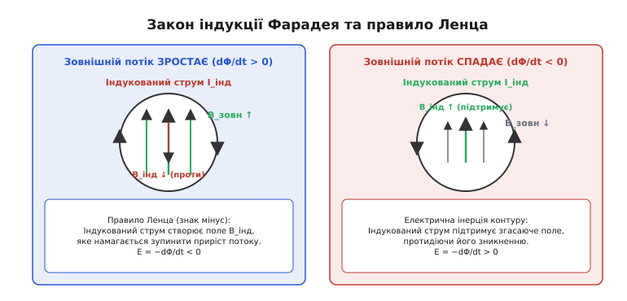
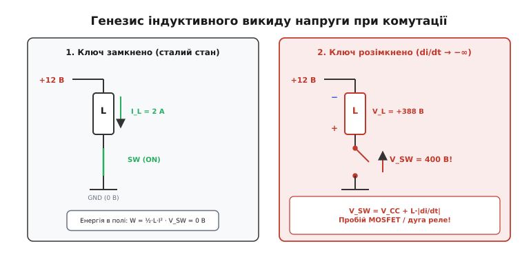
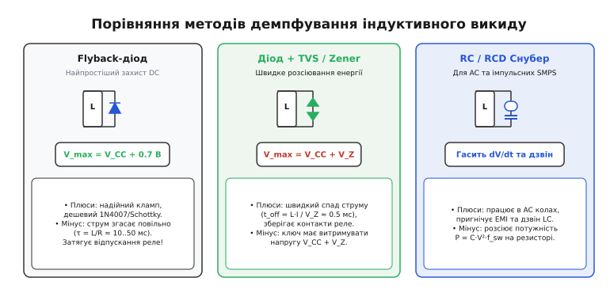
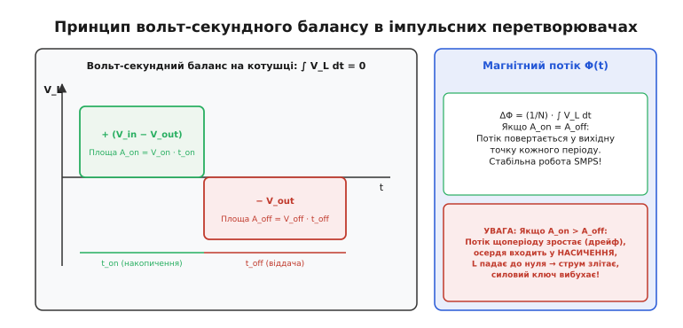
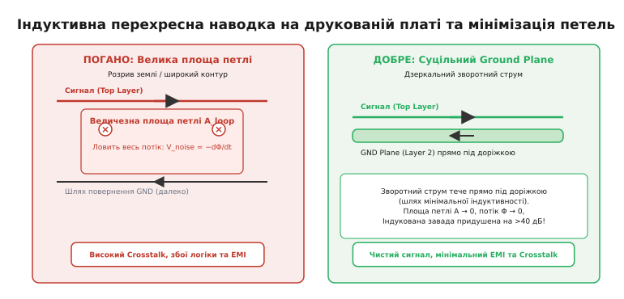

# Закон електромагнітної індукції Фарадея в електроніці

<preknowlist>
- [Закон Ома](root:hw-analog/ohms-law) — лінійний зв'язок між спадом напруги, струмом і активним опором у колі.
- [Котушка індуктивності](root:ph-electromagnetism/inductor-coil) — реактивний компонент, що формує магнітне поле при протіканні електричного струму.
- [Похідна функції](root:math-analysis/derivative) — швидкість зміни фізичної величини за одиницю часу.
- [Закон напруг Кірхгофа](root:hw-analog/kvl) — алгебраїчна сума різниць потенціалів та ЕРС у будь-якому замкненому контурі дорівнює нулю.
</preknowlist>

Коли транзисторний ключ розмикає коло живлення котушки реле з робочою напругою 12 вольтів і струмом 200 міліамперів, на його виводах виникає миттєвий сплеск напруги, амплітуда якого сягає 400–600 вольтів. Цей імпульс триває лише частки мікросекунди, але його енергії достатньо, щоб миттєво пробити діелектричний шар затвора силового польового транзистора або спалити p-n перехід біполярного ключа. 

Цей викид не є випадковим збоєм чи статичним розрядом. Він становить прямий прояв фундаментального закону природи, сформульованого Майклом Фарадеєм у 1831 році: будь-яка зміна магнітного потоку крізь замкнений провідний контур неминуче породжує в ньому електричне поле та електрорушійну силу, спрямовану на збереження попереднього стану магнітного поля.

В електроніці закон Фарадея виступає одночасно фундаментом корисної роботи та головним джерелом руйнівних процесів. На ньому базується функціонування накопичувальних дроселів, імпульсних трансформаторів, безконтактних давачів та імпульсних перетворювачів напруги. Водночас саме цей закон породжує високовольтні комутаційні удари в силових каскадах і паразитні індуктивні наводки між доріжками друкованих плат, що порушують роботу чутливих цифрових інтерфейсів.

> 📜 **Історія відкриття:** [від залізного кільця Фарадея до правила знака Ленца](root:ph-electromagnetism/faraday-law/hist-faraday-lenz.md) — як дев'ять років пошуків електрики з магнетизму розв'язалися 29 серпня 1831 року і чому знак мінус врятував закон збереження енергії.

---

### Походження індукції та фізичний зміст правила Ленца

Щоб розібратися в механізмі виникнення напруги в нерухомому провіднику, розглянемо поняття магнітного потоку `Φ` (грецька літера «фі»). Магнітний потік вимірює сумарну кількість ліній магнітної індукції `B`, які пронизують площу контуру `A`. Для плоского контуру площею `A`, розташованого під кутом `θ` до вектора магнітної індукції `B`, потік визначається скалярним добутком:

```
Φ = B · A · cos(θ)
```

Одиницею магнітного потоку в системі SI є вебер (Вб). Один вебер дорівнює потоку магнітної індукції в один тесла крізь перпендикулярну поверхню площею один квадратний метр (`1 Вб = 1 Тл · 1 м²`).

Закон Фарадея стверджує, що індукована в контурі електрорушійна сила `E` прямо пропорційна швидкості зміни магнітного потоку в часі:

```
E = −dΦ/dt
```

Якщо провідник згорнуто в котушку з `N` однакових витків, магнітний потік пронизує кожен із них. Тоді сумарна індукована напруга зростає пропорційно числу витків:

```
E = −N · (dΦ/dt)
```


*Механізм електромагнітної індукції: при зростанні зовнішнього магнітного потоку індукований струм створює зустрічне поле для гальмування приросту; при спаданні потоку індукований струм підтримує згасаюче поле.*

Ключовим елементом рівняння є знак **мінус**, який виражає правило Ленца. Фізичний зміст цього знака полягає в універсальній інерції електромагнітних процесів. Індукований струм, що виникає в замкненому контурі під дією ЕРС, своїм власним магнітним полем завжди **протидіє тій зміні магнітного потоку, яка його викликала**:

1. Якщо зовнішній магнітний потік крізь контур **зростає** (`dΦ/dt > 0`), індукована ЕРС штовхає струм у такому напрямку, щоб його власне поле було спрямоване **назустріч** зовнішньому, сповільнюючи його зростання.
2. Якщо зовнішній магнітний потік **зменшується** (`dΦ/dt < 0`), індукована ЕРС змінює знак на протилежний і підтримує струм, магнітне поле якого спрямоване **вздовж** зовнішнього поля, намагаючись не дати йому зникнути.

Якби в законі Фарадея стояв знак плюс (`E = +dΦ/dt`), виник би лавиноподібний процес самопідсилення: початкове мале збільшення поля наводило б струм, який додавав би своє поле до зовнішнього, це викликало б ще більше зростання потоку, ще більший струм і нескінченне генерування енергії без жодних зовнішніх витрат. Таким чином, знак мінус у законі Фарадея є прямим математичним наслідком фундаментального закону збереження енергії.

---

### Від поля до кола: математичне виведення самоіндукції та взаємоіндукції

У класичній схемотехніці рідко оперують векторними полями `B` чи інтегральними потоками `Φ`. Натомість працюють зі струмами, напругами та зосередженими параметрами компонентів. Зв'яжемо фундаментальне польове рівняння Фарадея з характеристиками реальних компонентів.

Коли електричний струм `i(t)` протікає крізь провідник або котушку, він збуджує в навколишньому просторі магнітне поле. Оскільки напруженість цього поля лінійно залежить від сили струму (`B ∝ i`), сумарний магнітний потік, зчеплений з витками котушки (повне потокозчеплення `Λ = N · Φ`), також пропорційний миттєвому значенню струму:

```
Λ(t) = L · i(t)
```

Коефіцієнт пропорційності `L` називається **власною індуктивністю** (або просто індуктивністю) котушки. Індуктивність залежить виключно від геометрії провідника (кількості витків `N`, площі перерізу `A`, довжини `l`) та магнітної проникності осердя `μ`:

```
L = (μ · N² · A) / l
```

Одиницею індуктивності є генрі (Гн). Провідник має індуктивність 1 Гн, якщо зміна струму зі швидкістю 1 ампер за секунду викликає в ньому напругу самоіндукції 1 вольт (`1 Гн = 1 В · с / А`).

Застосуємо закон Фарадея до повного потокозчеплення котушки:

```
E_L = −dΛ/dt = −d/dt (L · i(t))
```

Якщо геометрія котушки та властивості осердя не змінюються в часі (`L = const`), індукована в котушці проти-ЕРС дорівнює:

```
E_L = −L · (di/dt)
```

У теорії електричних кіл використовують пасивну систему знаків: напруга на виводах котушки `v_L(t)` вимірюється як спад потенціалу вздовж напрямку протікання струму. Оскільки спад напруги протистоїть внутрішній ЕРС самоіндукції (`v_L(t) = −E_L`), вольт-амперна характеристика котушки індуктивності набуває свого класичного вигляду:

```
v_L(t) = L · (di/dt)
```

Цей вираз показує, що напруга на котушці індуктивності пропорційна не величині струму, а **швидкості його зміни**. Коли через ідеальну котушку протікає постійний струм довільної величини (`di/dt = 0`), спад напруги на ній дорівнює нулю: для постійного струму котушка є звичайним провідником. Та щойно струм починає змінюватися, котушка відповідає напругою, яка протидіє цій зміні.

Індуктивність виступає мірою **електричної інерції**. Подібно до того, як масивне тіло неможливо миттєво розігнати або зупинити, струм у котушці індуктивності не може змінитися стрибком за нульовий час (`Δt = 0`). Стрибок струму вимагав би нескінченної швидкості зміни (`di/dt → ∞`), що породило б нескінченно велику напругу `v_L` і вимагало б нескінченної потужності джерела.

Енергія, накопичена в магнітному полі котушки зі струмом `I`, визначається інтегралом потужності:

```
W = ∫[0..I] v_L · i dt = ∫[0..I] (L · di/dt) · i dt = (1/2) · L · I²
```

Оскільки енергія поля не може зникнути безслідно або виникнути з нічого за нульовий проміжок часу, струм в індуктивності є неперервною функцією часу.

> 🧮 **Математичне виведення:** [від рівнянь Фарадея–Максвелла до формул самоіндукції та взаємоіндукції](root:ph-electromagnetism/faraday-law/math-faraday-derivation.md) — векторне виведення зв'язку між геометрією провідника, магнітним потоком, матрицею взаємної індуктивності зв'язаних контурів та індукованим шумом.

---

### Природа індуктивного викиду напруги та ризики комутації

Здатність індуктивності підтримувати свій струм стає критичною проблемою в моменти розриву електричного кола.

Розглянемо типову схему керування реле або соленоїдом за допомогою напівпровідникового ключа (MOSFET або біполярного транзистора). Нехай обмотка реле має індуктивність `L = 100 мГн` і живиться від джерела постійної напруги `V_CC = 12 В`. Коли ключ замкнений, через обмотку протікає струм, обмежений лише її активним омічним опором `R = 24 Ом`:

```
I_0 = V_CC / R = 12 В / 24 Ом = 0.5 А
```

Магнітне поле котушки накопичує енергію:

```
W = (1/2) · L · I_0² = 0.5 · 0.1 Гн · (0.5 А)² = 0.0125 Дж (12.5 мДж)
```

Тепер транзистор різко вимикається. Сучасні польові транзистори переходять у закритий стан надзвичайно швидко — типовий час спаду струму `t_off` становить від 10 до 100 наносекунд. Струм намагається впасти від 0.5 А до 0 А за час `Δt = 50 нс`.

Швидкість зміни струму набуває колосального від'ємного значення:

```
di/dt = (0 − 0.5 А) / (50 · 10⁻⁹ с) = −10 000 000 А/с (−10⁷ А/с)
```

За законом Фарадея котушка реагує виникненням проти-ЕРС, спрямованої так, щоб підтримати спадний струм:

```
E_L = −L · (di/dt) = −0.1 Гн · (−10⁷ А/с) = +1 000 000 В (1000 кВ)
```


*При розмиканні ключа полярність напруги на котушці змінюється на протилежну: котушка стає послідовним джерелом ЕРС, напруга якого додається до напруги живлення і прикладається до розімкненого ключа.*

Звісно, у реальній схемі напруга не досягає мільйона вольтів, оскільки коло містить паразитичні ємності обмотки й монтажу, а провідні матеріали мають скінченну електричну міцність. Проте напруга на виводі котушки, підключеному до ключа, блискавично піднімається доти, доки не знайде шлях для скидання струму через пробій діелектрика.

Оскільки на верхньому виводі котушки діє потенціал живлення `+V_CC`, сумарна напруга на вимкненому ключі становить:

```
V_switch = V_CC + |E_L|
```

Якщо амплітуда цього викиду не обмежена зовнішніми елементами, виникають незворотні аварійні процеси:

1. **Лавинний пробій силового MOSFET:** Якщо напруга стік-витік перевищує максимальну паспортну межу `V_DS(max)`, паразитна діодна структура всередині кристала переходить у режим лавинного пробою. Коли енергія магнітного поля котушки перевищує паспортне значення допустимої одиничної лавинної енергії кристала (`E_AS`, *Single Pulse Avalanche Energy*), локальний перегрів кремнію викликає тепловий пробій кристала.
2. **Паразитний тиристорний ефект (Latch-up) та пробій через ємність Міллера:** Різкий стрибок напруги на стоці `dV/dt` проникає крізь паразитну ємність стік-затвор `C_gd` (ємність Міллера) на вхід керування транзистора. Якщо вихідний імпеданс драйвера затвора недостатньо низький, наведений імпульс заряду піднімає потенціал затвора вище порогу включення `V_GS(th)`, викликаючи повторне неконтрольоване відкриття ключа в умовах повної напруги живлення. Крім того, надшвидкий перепад напруги може відкрити внутрішній паразитний біполярний NPN-транзистор структури MOSFET, що викликає замикання між стоком і витоком (latch-up).
3. **Вторинний пробій біполярного транзистора (BJT):** При вимиканні індуктивного навантаження біполярний транзистор потрапляє в зону зворотного зміщення бази. Локалізація струму в мікроскопічних ділянках емітерного переходу формує гарячі точки з екстремальною густиною струму, викликаючи вторинний пробій (руйнування поза межами області безпечної роботи RBSOA).
4. **Ерозія та зварювання контактів реле:** У механічних реле та вимикачах висока проти-ЕРС іонізує повітряний проміжок між контактами, що розходяться, запалюючи високовольтну плазмову дугу (таунсендівський розряд). Температура плазми перевищує кілька тисяч кельвінів, викликаючи оплавлення металу контактів, випаровування захисного покриття (золочення чи срібла) та зварювання контактних площадок у замкненому положенні.

> 🔧 **Навіщо це.** Запам'ятайте інженерну аксіому: **будь-яке індуктивне навантаження в колі постійного або змінного струму, кероване ключовим елементом, обов'язково повинно мати схему примусового демпфування комутаційного викиду.** Відсутність демпфера — це не ризик, а гарантована відмова силового ключа або механічного контакту.

---

### Методи демпфування індуктивного викиду

Для захисту напівпровідникових ключів і контактів від руйнівного впливу проти-ЕРС використовують три основні схемотехнічні підходи, кожен із яких пропонує свій баланс між простотою, вартістю, швидкістю знеструмлення навантаження та рівнем електромагнітних завад.


*Три схеми демпфування комутаційного викиду: зворотний діод (найнижча напруга, повільне відпускання), TVS-супресор (контрольована напруга, швидкий спад) та RC-снубер (придушення коливань у високочастотних і AC-колах).*

#### 1. Зворотний діод (Flyback Diode / Freewheeling Diode)

Найпростішим і найдешевшим методом захисту в колах постійного струму є підключення напівпровідникового діода паралельно котушці навантаження у зворотному напрямку.

* **Принцип дії:** Поки ключ замкнений, катод діода підключений до плюса живлення `V_CC`, а анод — до землі. Діод закритий і не впливає на роботу кола. У мить розмикання ключа проти-ЕРС перевертає полярність напруги на котушці: нижній вивід стає додатним відносно верхнього. Діод відкривається в прямому напрямку, замикаючи струм котушки в контур «котушка — діод».
* **Обмеження напруги:** Напруга на ключі обмежується безпечним рівнем:
  ```
  V_switch(max) = V_CC + V_F
  ```
  де `V_F` — пряме падіння напруги на діоді (близько 0.7–1.0 В для кремнієвих діодів і 0.3–0.4 В для діодів Шотткі).
* **Недолік — затягування часу вимикання:** Струм у замкненому контурі згасає за експоненційним законом зі сталою часу:
  ```
  τ = L / (R_coil + R_diode)
  ```
  Оскільки динамічний опір відкритого діода `R_diode` близький до нуля, енергія магнітного поля розсіюється повільно — виключно на активному омічному опорі мідного дроту обмотки `R_coil`. Час повного згасання струму може становити від 10 до 100 мілісекунд.
* **Небезпека для механічних реле:** Якщо реле знеструмлюється повільно, механічна пружина розмикає силові контакти з низькою швидкістю. Повільне розходження контактів призводить до тривалого горіння електричної дуги на вторинній стороні комутації, що скорочує ресурс контактної групи в 5–10 разів.

#### 2. Діод + стабілітрон / TVS-супресор (Zener / TVS Clamp)

Для прискорення розсіювання магнітної енергії необхідно змусити струм котушки протікати проти високої зустрічної напруги. Для цього послідовно зі зворотним діодом встановлюють стабілітрон (діод Зенера) або симетричний супресор (TVS-діод).

* **Принцип дії:** Коли ключ розмикається, наведена проти-ЕРС змушує стабілітрон перейти в режим лавинного пробою при напрузі стабілізації `V_Z`. Струм протікає крізь ланцюг «котушка — діод — стабілітрон».
* **Швидкість спаду струму:** Швидкість зміни струму визначається напругою фіксації:
  ```
  di/dt = −(V_Z + V_F) / L
  ```
  Спад струму відбувається практично лінійно за час:
  ```
  t_off ≈ (L · I_0) / V_Z
  ```
  Якщо для котушки з струмом 1 А та індуктивністю 100 мГн встановити стабілітрон з напругою `V_Z = 36 В`, час вимикання становитиме `t_off = (0.1 · 1) / 36 ≈ 2.8 мс` проти майже `50 мс` зі звичайним кремнієвим діодом.
* **Розрахунок пікової потужності TVS-супресора:** Під час вимикання соленоїда чи клапана TVS-супресор розсіює потужність, яка лінійно спадає від пікового значення:
  ```
  P_peak = V_clamp · I_0
  ```
  Для промислового соленоїда з живленням 24 В, струмом `I_0 = 1.5 А` та супресором з напругою фіксації `V_clamp = 48 В` пікова потужність становить `P_peak = 48 В · 1.5 А = 72 Вт`. Інженер обирає супресор серії SMAJ (400 Вт) або SMBJ (600 Вт), який гарантовано витримує цей імпульс без перегріву напівпровідникового кристала.
* **Вимога до ключа:** Напівпровідниковий ключ під час комутації повинен витримувати підвищену напругу:
  ```
  V_switch = V_CC + V_Z + V_F
  ```
  Для живлення `V_CC = 12 В` і стабілітрона `V_Z = 36 В` слід обирати транзистор із запасом за напругою не менше 60–100 вольтів.

#### 3. RC та RCD-снубери (RC / RCD Snubbers)

У колах змінного струму (де неможливо встановити односпрямований діод), а також у високочастотних імпульсних джерелах живлення застосовують RC-демпфери (снубери).

* **Принцип дії:** Послідовний ланцюг із конденсатора `C_s` та безіндуктивного резистора `R_s` підключається паралельно контактам ключа або виводам котушки. У момент розмикання струм котушки спрямовується на заряджання конденсатора `C_s`. Оскільки напруга на конденсаторі не може змінитися стрибком (`i = C · dV/dt`), швидкість наростання напруги на ключі `dV/dt` суттєво обмежується.
* **Демпфування коливань:** Паразитна ємність монтажу `C_p` разом з індуктивністю розсіювання `L_p` утворює коливальний контур високої добротності, що викликає високочастотний «дзвін» (ringing) на частоті `f_r = 1 / (2·π·√(L_p·C_p))` і потужне електромагнітне випромінювання (EMI). Резистор `R_s` вносить активні втрати, знижуючи добротність контуру до аперіодичного режиму (`Q ≤ 0.5`) і поглинаючи енергію коливань.
* **Розрахунок номіналів снубера:** Типове інженерне правило вимагає вибору ємності снубера в 3–4 рази більшої за сумарну паразитну ємність вузла (`C_s ≈ 3..4 · C_p`), а номінал резистора обирають близьким до хвильового опору паразитного контуру:
  ```
  R_s ≈ √(L_p / C_p)
  ```
* **Ціна рішення:** На кожному такті комутації конденсатор розряджається через резистор, виділяючи теплову потужність:
  ```
  P_loss = C_s · V_switch² · f_sw
  ```
  де `f_sw` — частота перемикання перетворювача.

---

### Імпульсне перетворення напруги: закон Фарадея в силовій електроніці

Імпульсні перетворювачі напруги (SMPS) базуються на керованому використанні закону Фарадея: котушка або імпульсний трансформатор циклічно накопичує магнітну енергію від первинного джерела, а потім віддає її в навантаження під іншим потенціалом.

#### Фундаментальний принцип вольт-секундного балансу

Для стійкої роботи будь-якого індуктивного компонента в усталеному режимі імпульсного перетворювача магнітний стан його осердя повинен повністю відновлюватися до кінця кожного періоду перемикання `T_sw`.

Зінтегруємо диференціальне рівняння котушки `v_L(t) = dΛ/dt` за повний період перемикання `T_sw`:

```
Λ(T_sw) − Λ(0) = ∫[0..T_sw] v_L(t) dt
```

В усталеному періодичному режимі кінцеве потокозчеплення дорівнює початковому (`Λ(T_sw) = Λ(0)`). Звідси випливає фундаментальний **принцип вольт-секундного балансу** (Volt-Second Balance):

```
∫[0..T_sw] v_L(t) dt = 0
```

Середнє за період значення напруги на будь-якій котушці індуктивності або обмотці трансформатора в усталеному режимі **строго дорівнює нулю**.


*Вольт-секундний баланс: площа додатної ділянки напруги на котушці під час накопичення повинна точно дорівнювати площі від'ємної ділянки під час віддачі енергії, інакше магнітний потік невпинно зміщується в зону насичення.*

Якщо умова вольт-секундного балансу порушується (наприклад, через асиметрію керуючих імпульсів або неправильний розрахунок шпаруватості):
1. Магнітний потік в осерді з кожним тактом зміщується в один бік — виникає накопичувальний магнітний дрейф.
2. Магнітна індукція досягає межі насичення матеріалу осердя (`B_sat ≈ 0.3–0.4 Тл` для силових феритів).
3. При насиченні диференціальна магнітна проникність осердя різко падає до проникності вакууму (`μ_r → 1`), а індуктивність `L` катастрофічно зменшується в сотні разів.
4. Опір котушки змінному струму зникає, струм через силовий транзистор миттєво зростає до сотень амперів, викликаючи миттєвий тепловий вибух кристала.

#### Робота індуктивності у flyback, forward та buck топологіях

Різні типи перетворювачів використовують закон Фарадея в різних режимах:

* **Знижувальний перетворювач (Buck Converter):** Дросель підключений послідовно з навантаженням. Під час відкритого стану верхнього ключа (`t_on`) до дроселя прикладена напруга `V_in − V_out`, і струм лінійно наростає. Коли ключ вимикається (`t_off`), напруга на комутаційному вузлі падає нижче нуля через проти-ЕРС Фарадея, відкриваючи нижній синхронний транзистор або діод вільного ходу. Дросель віддає накопичену енергію в навантаження під напругою `−V_out`. У неперервному режимі провідності (CCM) струм через дросель ніколи не падає до нуля, забезпечуючи мінімальні пульсації вихідної напруги.
* **Зворотноходовий перетворювач (Flyback Converter):** Використовує так званий багатообмотковий дросель (трансформатор з немагнітним зазором). Під час фази `t_on` первинний ключ замкнений, струм тече крізь первинну обмотку, а вторинний діод закритий через протилежну фазування обмоток. Уся енергія запасається в магнітному полі зазору осердя (`W = ½·L_p·I_pk²`). Під час фази `t_off` первинний ключ розмикається. Проти-ЕРС індукції перевертає полярність напруг на всіх обмотках: вторинний діод відкривається, і вся накопичена енергія магнітного поля передається у вихідний фільтр. Неідеальний магнітний зв'язок між обмотками створює індуктивність розсіювання `L_leak`, енергія якої не передається у вторинне коло, викликаючи небезпечний високовольтний викид на первинному ключі, що вимагає встановлення RCD-клампу.
* **Прямоходовий перетворювач (Forward Converter):** Працює як класичний трансформатор: передача енергії з первинного кола у вторинне відбувається одночасно під час відкритого стану силового ключа (`t_on`). Під час фази `t_off` трансформатор не передає потужність, але вимагає обов'язкового розмагнічування осердя за допомогою додаткової рекупераційної обмотки або активного клампу для виконання закону вольт-секундного балансу Фарадея.

---

### Паразитна індуктивна наводка (Crosstalk) на друкованих платах

Закон електромагнітної індукції діє не лише всередині дискретних котушок і трансформаторів. Кожен провідник, сигнальна доріжка та зворотний шлях струму на друкованій платі утворюють замкнені геометричні контури, що взаємодіють через спільне магнітне поле.

#### Механізм виникнення індуктивної завади

Нехай на друкованій платі поруч розташовані два кола:
1. **Агресивне коло (Aggressor):** Силова лінія живлення, вихід ШІМ-драйвера або тактова лінія, де протікає змінний струм із великою швидкістю наростання `di_1/dt`.
2. **Коло-жертва (Victim):** Чутлива аналогова лінія давача, шина опорної напруги АЦП або цифрова лінія зв'язку (I2C, SPI, UART).

Струм агресивного кола формує змінне магнітне поле `B(t)`. Якщо сигнальна доріжка кола-жертви та її зворотний земляний провідник утворюють замкнену петлю площею `A_loop`, частина силових ліній магнітного поля агресора перетинає цю площу, створюючи магнітний потік `Φ_victim`.


*Формування перехресної завади на платі: велика площа контуру ловить змінний магнітний потік і наводить напругу шуму; суцільний полігон землі зменшує площу петлі до нуля, пригнічуючи наводку.*

За законом Фарадея в колі-жертві наводиться напруга паразитної завади `V_noise`:

```
V_noise = −dΦ_victim/dt = −M · (di_1/dt)
```

де `M` — коефіцієнт паразитної взаємної індуктивності між двома контурами.

Оцінимо масштаб проблеми для сучасної цифрової та силової електроніки. Силові ключі на основі нітриду галію (GaN) або карбіду кремнію (SiC) комутують струм 10 амперів за час менше 2 наносекунд:

```
di/dt = 10 А / (2 · 10⁻⁹ с) = 5 000 000 000 А/с (5 · 10⁹ А/с)
```

Якщо взаємна паразитна індуктивність між силовими та сигнальними провідниками становить лише `M = 1 нГн` (що відповідає парі паралельних доріжок довжиною близько 10–15 мм):

```
V_noise = 1 · 10⁻⁹ Гн · 5 · 10⁹ А/с = 5.0 В
```

Імпульсна завада амплітудою 5 вольтів миттєво спотворює логічні рівні 3.3-вольтової або 1.8-вольтової мікроконтролерної системи, спричиняє помилкові спрацьовування апаратних переривань, збої шин обміну даними та зависання процесора.

#### Розподіл високочастотного зворотного струму в полігоні землі

Поширеною помилкою є уявлення про те, що постійний і змінний струми повертаються до джерела однаковим шляхом:

* **На постійному струмі (DC та низькі частоти < 1 кГц):** Струм повернення розтікається по всій площі земляного полігону, обираючи шлях **мінімального активного опору** (найкоротшу геометричну пряму лінію між навантаженням і джерелом).
* **На високих частотах (> 100 кГц):** Імпеданс контуру визначається не омічним опором, а реактивною індуктивністю петлі `ω·L`. Згідно з законом Фарадея, система прагне мінімізувати магнітне поле контуру. Тому високочастотний зворотний струм самоорганізується у вузьку смужку безпосередньо під сигнальною доріжкою (ефект близькості). Густина струму в полігоні описується розподілом:
  ```
  J(x) = (I_0 / (π · h)) · (1 / (1 + (x / h)²))
  ```
  де `h` — товщина діелектрика між сигнальним шаром і землею, а `x` — поперечна відстань від осі доріжки.

Якщо розробник робить у земляному полігоні щілину або розріз, під якими проходить швидкісна лінія, зворотний струм змушений огинати перешкоду. Площа петлі `A_loop` миттєво зростає у десятки разів, генеруючи потужну паразитну індуктивність `L_loop`, стрибок імпедансу та перехресні наводки за законом Фарадея.

#### Правила трасування друкованих плат для нейтралізації закону Фарадея

Оскільки швидкість комутації `di/dt` у високопродуктивних системах зменшити неможливо (це призвело б до неприпустимого зростання динамічних втрат на перемикання), єдиним ефективним інженерним захистом є мінімізація магнітного потоку `Φ = B · A`. Для цього застосовують суворі топологічні правила:

```
┌─────────────────────────────────────────────────────────────────────────────┐
│                 ПРАВИЛА ТРАСУВАННЯ ДЛЯ МІНІМІЗАЦІЇ ПЕТЕЛЬ                   │
├─────────────────────────────────────────────────────────────────────────────┤
│ 1. Суцільний Ground Plane (шар 2):                                          │
│    Високочастотний зворотний струм завжди повертається безпосередньо під    │
│    сигнальною доріжкою по лінії мінімальної петлевої індуктивності          │
│    (ефект близькості та поверхневий ефект). Площа петлі A_loop падає до     │
│    значень менше 0.1 мм², а взаємна індуктивність M зменшується на 40–60 дБ.│
├─────────────────────────────────────────────────────────────────────────────┤
│ 2. Заборона розривів полігону землі під швидкими лініями:                   │
│    Якщо доріжка перетинає щілину в земляному шарі, зворотний струм змушений │
│    огинати перешкоду. Площа петлі зростає в десятки разів, генеруючи        │
│    катастрофічні наводки та електромагнітне випромінювання (EMI).           │
├─────────────────────────────────────────────────────────────────────────────┤
│ 3. Мінімізація площі гарячих силових контурів (Hot Loops):                  │
│    У DC-DC перетворювачах контур «вхідний конденсатор → верхній MOSFET →    │
│    нижній MOSFET/діод → вхідний конденсатор» містить струми з найбільшим    │
│    di/dt. Ці компоненти повинні стояти впритул один до одного на одному     │
│    шарі плати, утворюючи мініатюрну петлю площею у кілька квадратних мм.    │
├─────────────────────────────────────────────────────────────────────────────┤
│ 4. Диференціальне трасування та виті пари (Differential Pairs):             │
│    Прямий і зворотний провідники прокладають з мінімальним зазором.         │
│    Зовнішнє магнітне поле наводить у сусідніх лініях однакову синфазну ЕРС, │
│    яка повністю віднімається на диференціальному приймачі.                  │
├─────────────────────────────────────────────────────────────────────────────┤
│ 5. Ортогональне перехрещення на сусідніх шарах:                             │
│    Якщо сигнальні доріжки на сусідніх шарах перетинаються під кутом 90°,    │
│    вектор магнітного поля паралельний площині контуру-жертви (cos 90° = 0), │
│    і потік крізь контур дорівнює нулю.                                      │
└─────────────────────────────────────────────────────────────────────────────┘
```

---

### Практичні інженерні висновки

Закон електромагнітної індукції Фарадея в електроніці — це не абстрактне академічне рівняння, а фундаментальний закон розподілу енергії в часі та просторі. Спираючись на нього, інженер керується чіткими принципами:

1. **Струм в індуктивності не стрибає:** Намагання розімкнути коло з індуктивністю за нульовий час неминуче породжує проти-ЕРС з амплітудою, достатньою для пробою будь-якого ізоляційного проміжку або напівпровідникового ключа.
2. **Демпфування — це компроміс швидкості та напруги:** Звичайний зворотний діод надійно захищає транзистор, але затягує вимикання навантаження; TVS-супресор прискорює відпускання ціною підвищеної робочої напруги на ключі; RC-снубер придушує високочастотний дзвін ціною додаткових активних втрат.
3. **Вольт-секундний баланс непорушний:** Будь-який дросель або трансформатор в імпульсному перетворювачі повинен мати нульову середню напругу за період комутації. Найменший дисбаланс неминуче призводить до насичення осердя та аварії силового каскаду.
4. **Струм завжди тече замкненим контуром:** Справжній розмір сигналу визначається не довжиною провідника, а площею петлі між провідником і шляхом його повернення в джерело. Мінімізація площі цієї петлі на платі — єдиний надійний спосіб придушення індуктивних наводок за законом Фарадея.
