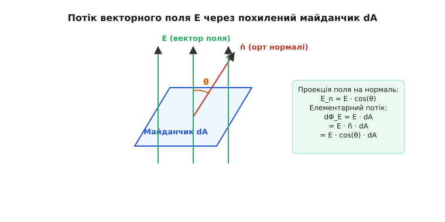
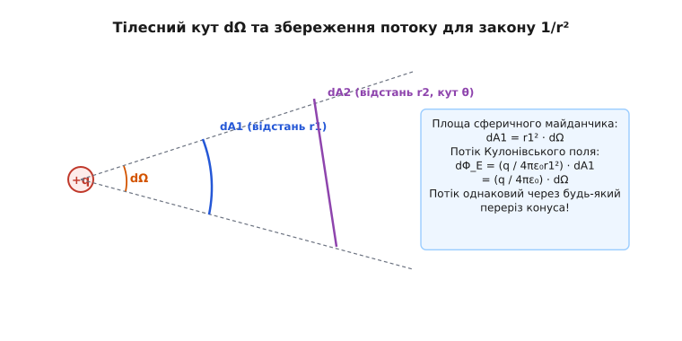
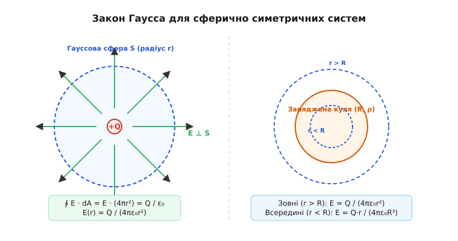
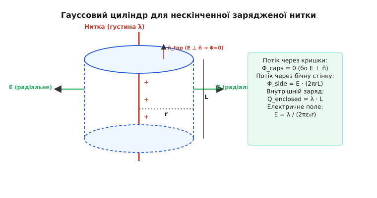
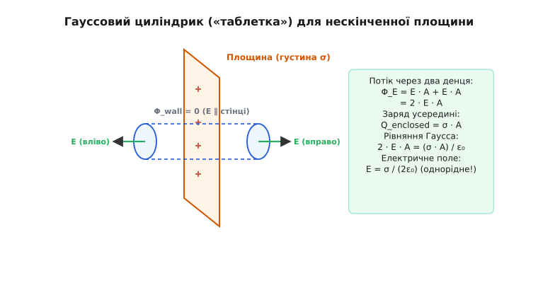
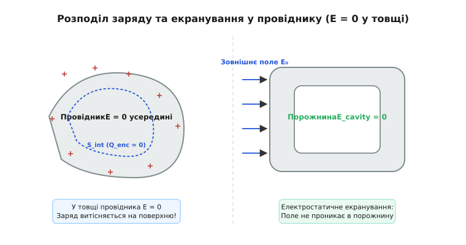
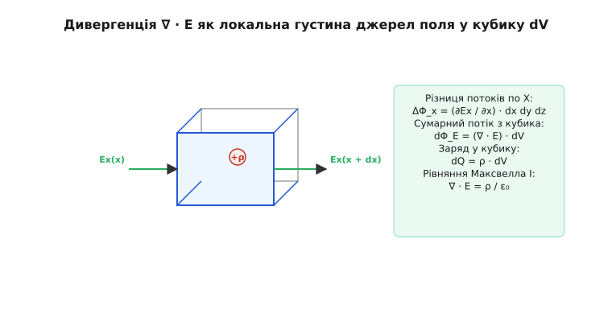
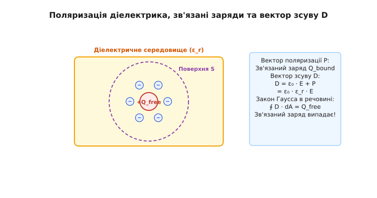

# Закон Гаусса

<preknowlist>
- [Закон Кулона](root:ph-electromagnetism/coulomb-law)
- [Електричний заряд](root:ph-electromagnetism/electric-charge)
- [Закон збереження заряду](root:ph-electromagnetism/charge-conservation)
- [Потенціальне електричне поле](root:ph-electromagnetism/conservative-field)
</preknowlist>

Коли позитивно заряджена металева куля вміщується у центрі порожнистої провідної сфери, на внутрішній стінці сфери негайно виникає негативний заряд, за модулем тотожний заряду кулі, а на зовнішній стінці — такий самий позитивний заряд. Якщо кулю змістити з центра, повернути або надати їй неправильної форми, сумарний індукований заряд на стінках сфери не зміниться ні на частку кулона. Цей результат є наслідком закону Гаусса — фундаментального співвідношення електродинаміки, яке пов'язує потік електричного поля через довільну замкнену поверхню з повним електричним зарядом усередині цієї поверхні.

Закон Гаусса усуває потребу обчислювати складні тривимірні інтеграли векторних сум полів Кулона від мільйонів окремих зарядів. Завдяки геометричній природі векторного поля він дозволяє знаходити напруженість електричного поля складних симетричних розподілів зарядів за допомогою кількох алгебраїчних дій.

## 1. Потік векторного поля та геометричний зміст силових ліній

Електричне поле у порожнечі описується векторним полем напруженості `E`. Щоб кількісно виміряти, яка частина цього векторного поля проходить через задану поверхню у просторі, вводиться поняття **потоку електричного поля** `Φ_E`.

Уявімо малий плоский майданчик площею `dA`, поміщений у точці, де напруженість електричного поля дорівнює `E`. Напрямок майданчика в просторі задається одиничним вектором зовнішньої нормалі `n̂`, перпендикулярним до поверхні. Векторний елемент площі визначається як `dA = n̂ · dA`.


*Потік електричного поля через елемент поверхні dA: потік визначається проекцією вектора E на нормаль n̂.*

Елементарний потік `dΦ_E` електричного поля через майданчик `dA` дорівнює скалярному добутку вектора напруженості `E` на вектор площі `dA`:

```
dΦ_E = E · dA = E · n̂ · dA = E · cos(θ) · dA
```

де `θ` — кут між вектором електричного поля `E` та векторною нормаллю `n̂` до майданчика:
1. Якщо поле `E` строго перпендикулярне до майданчика (`E ∥ n̂`, кут `θ = 0°`), потік є максимальним: `dΦ_E = E · dA`.
2. Якщо поле `E` ковзає вздовж майданчика (`E ⊥ n̂`, кут `θ = 90°`), вектор `E` не перетинає поверхню, і потік дорівнює нулю: `dΦ_E = 0`.
3. Якщо поле входить у поверхню під тупим кутом (`90° < θ ≤ 180°`), `cos(θ) < 0`, і елементарний потік є негативним.

Наочним графічним образом є силові лінії (лінії напруженості) електричного поля. Густина силових ліній (кількість ліній, що прошивають одиничну перпендикулярну площадку) вибирається пропорційно модулю напруженості поля `|E|`. Тоді потік електричного поля `Φ_E` через довільну поверхню `S` геометрично чисельно дорівнює повній кількості силових ліній, які перетинають цю поверхню.

Для скінченної поверхні `S` довільної форми повний потік обчислюється шляхом інтегрування елементарних внесків по всій поверхні:

```
Φ_E = ∬ S E · dA = ∬ S E · cos(θ) · dA
```

Якщо поверхня є замкненою (наприклад, сфера, куб або деформована замкнена оболонка), вектор нормалі `n̂` за загальноприйнятою математичною угодою завжди обирається **зовнішнім** — спрямованим з внутрішнього об'єму назовні. Потік через замкнену поверхню позначають круговим інтегралом:

```
Φ_E = ∮ S E · dA
```

Знак замкненого потоку має прямий фізичний зміст: додатний потік (`Φ_E > 0`) означає, що з замкненого об'єму виходить більше силових ліній, ніж входить (всередині є джерело поля). Від'ємний потік (`Φ_E < 0`) свідчить про те, що силові лінії переважно входять усередину (всередині лежить сток поля).

## 2. Тілесний кут та геометрична причина закону Кулона-Гаусса

Фундаментальна причина, чому закон Гаусса має саме таку математичну форму, криється у законі зворотних квадратів Кулона та тривимірній геометрії простору.

За законом Кулона напруженість електричного поля точкового заряду `q` спадає з відстанню `r` за законом `1/r²`:

```
E = (q / (4 · π · ε₀ · r²)) · r̂
```

де `r̂` — одиничний радіальний вектор від заряду `q` до точки спостереження, а `ε₀ ≈ 8.854 · 10⁻¹² Ф/м` — електрична стала.

Оточимо точковий заряд `q` сферою радіуса `r` з центром у точці розташування заряду. У кожній точці цієї сфери вектор поля `E` напрямлений уздовж радіуса, тобто паралельний нормалі `n̂` (`cos(θ) = 1`). Модуль поля `E` однаковий у всіх точках сфери.


*Тілесний кут dΩ та сфера радіуса r: площа елемента зростає як r², а поле спадає як 1/r², що взаємно компенсує залежність від відстані.*

Обчислимо потік поля через цю сферу площею `A = 4·π·r²`:

```
Φ_E = ∮ S E · dA = E · ∮ S dA = (q / (4 · π · ε₀ · r²)) · (4 · π · r²) = q / ε₀
```

У цьому розрахунку відбулося точне скорочення: радіус `r²` у чисельнику площі сфери повністю компенсував `r²` у знаменнику закону Кулона. Потік не залежить від радіуса сфери `r`.

Щоб поширити цей результат на замкнену поверхню довільної геометричної форми, скористаємося поняттям **тілесного кута** `dΩ`. Проекція елементарної площі `dA`, розташованої на відстані `r` під кутом `θ` до радіус-вектора, на сферу радіуса `r` дорівнює `dA · cos(θ)`. Відповідний елементарний тілесний кут `dΩ` з вершиною в точці розташування заряду виражається як:

```
dΩ = (dA · cos(θ)) / r²
```

Підставляючи кулонівське поле `E` у вираз для елементарного потоку `dΦ_E`, отримуємо:

```
dΦ_E = E · cos(θ) · dA = (q / (4 · π · ε₀)) · ((cos(θ) · dA) / r²) = (q / (4 · π · ε₀)) · dΩ
```

Інтегрування по всій замкненій поверхні зводиться до інтегрування тілесного кута `dΩ` по всіх можливих напрямках у тривимірному просторі:
1. Якщо заряд `q` знаходиться **усередині** замкненої поверхні `S`, повний тілесний кут охоплює весь простір і дорівнює `4·π` стерадіан (`∮ dΩ = 4·π`). Потік дорівнює `Φ_E = q / ε₀`.
2. Якщо заряд `q` розміщений **зовні** замкненої поверхні `S`, будь-який вузький конус тілесного кута `dΩ` перетинає поверхню два рази (або парну кількість разів): перший раз під час входу в об'єм (від'ємний потік `dΦ1 < 0`), а другий раз під час виходу з об'єму (додатний потік `dΦ2 > 0`). Модулі цих двох потоків абсолютно однакові, оскільки обидва майданчики вирізаються одним і тим самим тілесним кутом `dΩ`. Вони взаємно знищуються, і сумарний потік від зовнішнього заряду через замкнену поверхню дорівнює нулю (`Φ_E = 0`).

Детальне строге математичне доведення геометричного тілесного кута та його властивостей наведено у вставці [математичний вивід](root:ph-electromagnetism/gauss-law/math-gauss-derivation.md). Передумови виникнення цього закону в працях Лагранжа, Гаусса та Остроградського описано у вставці [історичний екскурс](root:ph-electromagnetism/gauss-law/hist-gauss.md).

## 3. Інтегральне формулювання закону Гаусса

Завдяки принципу суперпозиції результуюче електричне поле системи зарядів дорівнює векторній сумі полів кожного з них: `E = ∑ Ei`. Потік результуючого поля через замкнену поверхню `S` дорівнює сумі потоків окремих полів:

```
∮ S E · dA = ∑ (∮ S Ei · dA)
```

Заряди, що лежать зовні поверхні `S`, дають нульовий внесок у потік. Заряди, що знаходяться всередині поверхні `S`, дають внесок `qi / ε₀`. Підсумовуючи всі внутрішні заряди `Q_enclosed = ∑ q_in`, отримуємо **інтегральну форму закону Гаусса**:

```
∮ S E · dA = Q_enclosed / ε₀
```

Для неперервного розподілу електричного заряду з об'ємною густиною `ρ(r)` повний заряд усередині об'єму `V`, обмеженого поверхнею `S = ∂V`, визначається через об'ємний інтеграл:

```
Q_enclosed = ∭ V ρ(r) dV
```

Тоді закон Гаусса набуває остаточного інтегрального вигляду:

```
∮ S E · dA = (1 / ε₀) · ∭ V ρ(r) dV
```

### Чотири фундаментальні умови застосовності:
1. **Замкненість поверхні**: Поверхня інтегрування `S` обов'язково має бути замкненим 2D-многовивидом (без країв і дірок). Для незамкненої поверхні (наприклад, диска або півсфери) закон Гаусса не виконується.
2. **Урахування знака заряду**: Алгебраїчна сума `Q_enclosed` враховує знаки зарядів. Позитивні заряди створюють додатний потік (випромінюють лінії), негативні — від'ємний (поглинають лінії). Якщо сумарний заряд усередині поверхні дорівнює нулю (`Q_enclosed = 0`), то результуючий потік дорівнює нулю, навіть якщо всередині є колосальні заряди протилежних знаків (наприклад, електричні диполі).
3. **Вибір зовнішньої нормалі**: Вектор елемента площі `dA = n̂ · dA` завжди спрямований по зовнішній нормалі до об'єму.
4. **Первинне середовище**: Формула із `ε₀` записується для вакууму. У суцільних діелектриках вона узагальнюється через вектор електричного зсуву `D`.

## 4. Розрахунок полів за допомогою Гауссових поверхонь симетрії

Інтегральний закон Гаусса виконується для будь-якої замкненої поверхні. Проте використати його для швидкого аналітичного розрахунку поля `E` можна лише тоді, коли система має **високу геометричну симетрію**.

Ключова ідея полягає у виборі такої уявної **гауссової поверхні** `S`, на якій завдяки симетрії розподілу зарядів модуль поля `|E|` є constant (сталим), а кут між вектором `E` та нормаллю `n̂` дорівнює `0°` або `90°`. У цьому випадку модуль `E` виноситься за знак інтеграла, і розрахунок зводиться до множення `E` на площу поверхні.

### Сферична симетрія

Розподіл зарядів має сферичну симетрію, якщо його густина залежить лише від відстані до центру: `ρ = ρ(r)`. Прикладами є точковий заряд, рівномірно заряджена суцільна куля та тонка сферична оболонка.

З міркувань симетрії вектор поля `E` у будь-якій точці спрямований уздовж радіуса, а його модуль залежить тільки від `r`: `E = E(r) · r̂`. У якості гауссової поверхні обираємо концентричну сферу радіуса `r`.


*Сферична гауссова поверхня для точкового заряду та розподіленого заряду в кулі.*

#### А. Суцільна куля радіуса R з рівномірною густиною ρ
1. **Зовнішня область (`r ≥ R`)**: Гауссова сфера радіуса `r` охоплює весь заряд кулі `Q = ρ · (4/3)·π·R³`.
   ```
   ∮ S E · dA = E(r) · ∮ S dA = E(r) · (4 · π · r²) = Q / ε₀
   E(r) = Q / (4 · π · ε₀ · r²)    [для r ≥ R]
   ```
   Зовні куля створює точно таке поле, як і точковий заряд `Q`, розміщений у її центрі.
2. **Внутрішня область (`r < R`)**: Гауссова сфера радіуса `r` охоплює лише частину заряду `Q_enclosed = ρ · (4/3)·π·r³ = Q · (r³ / R³)`:
   ```
   E(r) · (4 · π · r²) = (Q / ε₀) · (r³ / R³)
   E(r) = (Q · r) / (4 · π · ε₀ · R³)    [для r < R]
   ```
   Усередині кулі поле зростає **строго лінійно** від `0` у центрі до максимум значення на поверхні `R`.

#### Б. Тонка сферична оболонка радіуса R із зарядом Q
- Усередині оболонки (`r < R`): гауссова сфера не містить зарядів (`Q_enclosed = 0`), тому `E(r) = 0`.
- Зовні оболонки (`r > R`): `E(r) = Q / (4·π·ε₀·r²)`.

### Циліндрична симетрія

Розподіл зарядів має циліндричну симетрію, якщо він не змінюється при поворотах навколо осі `Z` та зсувах уздовж цієї осі (наприклад, нескінченно довгий заряджений циліндр або тонкий провідник).

Як гауссову поверхню будуємо співвісний циліндр радіуса `r` та висоти `L`. Поверхня складається з бічної стінки `A_side` та двох плоских денців `A_caps`.


*Циліндрична гауссова поверхня навколо нескінченної зарядженої нитки: потік проходить лише через бічну поверхню.*

1. **Потік через денця**: Нормаль до денць паралельна осі `Z`, а поле `E` спрямоване радіально від осі. Вони перпендикулярні (`E ⊥ n̂`), тому потік через обидва денця точно дорівнює нулю.
2. **Потік через бічну поверхню**: Поле `E` всюди перпендикулярне до бічної стінки (`E ∥ n̂`), а його модуль сталий по всій площі `2·π·r·L`:
   ```
   ∮ S E · dA = E(r) · (2 · π · r · L)
   ```

Для нескінченної нитки з лінійною густиною заряду `λ = dQ/dz` заряд усередині циліндра дорівнює `Q_enclosed = λ · L`. За законом Гаусса:

```
E(r) · (2 · π · r · L) = (λ · L) / ε₀  →  E(r) = λ / (2 · π · ε₀ · r)
```

Поле циліндричного джерела спадає з відстанню як `1/r` (на відміну від `1/r²` для точкового джерела).

### Плоска симетрія

Розподіл зарядів має плоску симетрію, якщо він є однорідним уздовж нескінченної площини `XY` (наприклад, зарядна площина або плоский конденсатор).

Побудуємо гауссову поверхню у вигляді невеликого циліндра («pillbox» — таблетка) площею денця `A`, який прошиває площину. Денця паралельні зарядженій площині, а бічна стінка перпендикулярна до неї.


*Плоска гауссова поверхня (pillbox) для рівномірно зарядженої нескінченної площини: потік проходить через два паралельні денця.*

1. **Потік через бічну стінку**: Вектор поля `E` паралельний бічній стінці (`E ⊥ n̂_wall`), тому потік через неї дорівнює нулю.
2. **Потік через два денця**: Поле спрямоване від площини в обидва боки по зовнішніх нормалях. Потік через кожне денце дорівнює `E · A`, а сумарний потік — `2 · E · A`.

Заряд усередині таблетки виражається через поверхневу густину `σ = dQ/dA`: `Q_enclosed = σ · A`. За законом Гаусса:

```
2 · E · A = (σ · A) / ε₀  →  E = σ / (2 · ε₀)
```

Модуль поля нескінченної зарядженої площини є **строго постійним** і взагалі не залежить від відстані до площини.

Для плоского конденсатора з двох протилежно заряджених площин `+σ` та `-σ` за принципом суперпозиції:
- Усередині між пластинами поля додаються: `E = σ/(2ε₀) + σ/(2ε₀) = σ / ε₀`.
- Зовні конденсатора поля віднімаються і дають точний нуль: `E = 0`.

## 5. Електростатика провідників та екранування

Провідник містить величезну кількість вільних носіїв заряду (електронів провідності). У стані електростатичної рівноваги носії зарядів перерозподіляються доти, доки будь-який рух зарядів повністю не припиниться.

З цього фізичного факту за допомогою закону Гаусса випливають чотири фундаментальні властивості провідників:

1. **Електричне поле всередині товщі провідника дорівнює нулю (`E = 0`)**. Якщо б всередині існувало поле `E ≠ 0`, на вільні електрони діяла б сила `F = -e·E`, спричиняючи впорядкований струм, що суперечить умові рівноваги.
2. **Об'ємна густина заряду всередині провідника дорівнює нулю (`ρ = 0`)**. Побудуємо довільну гауссову поверхню `S` усередині товщі провідника. Оскільки скрізь на цій поверхні `E = 0`, потік дорівнює нулю: `∮ E · dA = 0`. За законом Гаусса `Q_enclosed = 0`. Оскільки це виконується для будь-якого внутрішнього об'єму, вільний заряд повністю відсутній у товщі провідника.
3. **Увесь некомпенсований заряд провідника розміщується виключно на його зовнішній поверхні**. Заряд витісняється кулонівськими силами відштовхування на самісіньку межу провідника, утворюючи тонкий поверхневий шар з густиною `σ`.
4. **Електричне поле біля поверхні провідника є перпендикулярним до неї**, а його модуль визначається **теоремою Кулона**:
   ```
   E_surface = σ / ε₀
   ```
   Побудувавши гауссову таблетку, одне денце якої лежить усередині провідника (де `E = 0`), а друге — зовні у вакуумі (де поле `E`), отримуємо `E · A = (σ · A) / ε₀`, звідки `E = σ / ε₀`.


*Провідник у стані електростатичної рівноваги: заряд витісняється на зовнішню поверхню, поле всередині провідника E = 0.*

### Екранування та клітка Фарадея

Якщо усередині суцільного провідника вирізати порожнину, в якій немає зарядів, то електричне поле всередині порожнини буде **строго дорівнювати нулю**, навіть якщо провідник вміщено у потужне зовнішнє електричне поле або сам провідник заряджено до мільйонів вольт.

Зовнішні електричні поля змушують вільні електрони провідника перерозподілятися по зовнішній поверхні так, що їхнє власне індуковане поле точно компенсує зовнішнє поле в усьому внутрішньому об'ємі. Цей ефект лежить в основі **електростатичного екранування** та клітки Фарадея. Металеві корпуси приладів, екрановані коаксіальні кабелі та сітчасті конструкції повністю захищають чутливу електронну апаратуру від зовнішніх завад.

## 6. Диференціальна форма закону Гаусса та теорема Остроградського-Гаусса

Інтегральна форма закону Гаусса пов'язує потік по всій поверхні з зарядом усередині всього об'єму. Проте у фізиці суцільних середовищ необхідно мати **локальний закон**, який діє в кожній окремій точці простору.

Для переходу до локальної форми розглянемо нескінченно малий кубічний паралелепіпед з ребрами `dx, dy, dz` та об'ємом `dV = dx · dy · dz`, розміщений біля точки `(x, y, z)`.


*Елементарний об'ємний паралелепіпед dx dy dz для обчислення дивергенції ∇ · E.*

Обчислимо потік поля `E = (Ex, Ey, Ez)` через дві грані, перпендикулярні до осі `X`:
1. Вхідний потік через ліву грань при `x`: `dΦ_x1 = - Ex(x, y, z) · dy · dz`.
2. Вихідний потік через праву грань при `x + dx`: розкладаючи `Ex` у ряд Тейлора, маємо `dΦ_x2 = (Ex(x, y, z) + (∂Ex/∂x)·dx) · dy · dz`.

Різниця потоків по осі `X` дорівнює `(∂Ex / ∂x) · dV`. Додаючи аналогічні внески по осях `Y` та `Z`, отримуємо повний потік з елементарного об'єму:

```
dΦ_E = (∂Ex / ∂x + ∂Ey / ∂y + ∂Ez / ∂z) · dV = (∇ · E) · dV
```

Сума частинних похідних позначається як **дивергенція** (розбіжність) векторного поля `∇ · E` (або `div E`).

З іншого боку, за законом Гаусса потік з елементарного об'єму `dV` виражається через заряд `dQ = ρ · dV`:

```
dΦ_E = dQ / ε₀ = (ρ · dV) / ε₀
```

Прирівнюючи два вирази для `dΦ_E`, скорочуємо об'єм `dV` та отримуємо **диференціальну форму закону Гаусса**:

```
∇ · E = ρ / ε₀
```

Диференціальний закон Гаусса стверджує: **джерелом дивергенції електричного поля у кожній точці простору є густина електричного заряду `ρ`, поділена на `ε₀`**.

### Математичний зв'язок: Теорема Остроградського-Гаусса

Інтегрування локального співвідношення `(∇ · E) · dV` по довільному скінченному об'єму `V` дає фундаментальну математичну теорему дивергенції Остроградського-Гаусса:

```
∭ V (∇ · E) dV = ∮ S E · dA
```

Вона стверджує, що об'ємний інтеграл від дивергенції векторного поля по об'єму `V` точно дорівнює поверхневому інтегралу від потоку цього поля через замкнену границю `S = ∂V`.

### Зв'язок з потенціалом та рівнянням Пуассона

В електростатиці електричне поле є потенціальним і виражається через градієнт скалярного електричного потенціалу `V`: `E = -∇V`. Підставляючи це у диференціальний закон Гаусса, отримуємо:

```
∇ · (-∇V) = ρ / ε₀  →  ∇²V = - ρ / ε₀
```

де `∇² = Δ = ∂²/∂x² + ∂²/∂y² + ∂²/∂z²` — оператор Лапласа (лапласіан).

Отримане співвідношення `∇²V = -ρ / ε₀` є **рівнянням Пуассона** — головним диференціальним рівнянням електростатики. У областях простору, вільних від зарядів (`ρ = 0`), воно перетворюється на **рівняння Лапласа**:

```
∇²V = 0
```

## 7. Закон Гаусса у діелектриках: вектор електричного зсуву D

Під дією зовнішнього електричного поля `E_ext` атоми та молекули діелектрика поляризуються — їхні позитивні й негативні заряди зміщуються в протилежні боки, утворюючи електричні диполі.


*Поляризація діелектрика: орієнтація диполів під дією зовнішнього поля створює зв'язані поверхневі заряди.*

Макроскопічний стан поляризації описується **вектором поляризованості** `P` (дипольний момент одиниці об'єму). Неоднорідна поляризація створює в об'ємі діелектрика **зв'язані (поляризаційні) заряди** з густиною `ρ_bound`:

```
ρ_bound = - ∇ · P
```

Загальний заряд у речовині складається з вільних зарядів `ρ_free` (внесені електрони чи іони) та зв'язаних зарядів `ρ_bound`: `ρ_total = ρ_free + ρ_bound`.

Застосуємо диференціальний закон Гаусса до мікроскопічного поля `E`:

```
ε₀ · (∇ · E) = ρ_total = ρ_free + ρ_bound = ρ_free - (∇ · P)
```

Перенесемо член з поляризованістю `P` в ліву частину під знак дивергенції:

```
∇ · (ε₀ · E + P) = ρ_free
```

Комбінацію векторів `ε₀ · E + P` називають **вектором електричного зсуву** (або вектором електричної індукції) і позначають `D`:

```
D = ε₀ · E + P
```

Для лінійних та ізотропних діелектриків `P = ε₀ · χ_e · E`, тому:

```
D = ε₀ · (1 + χ_e) · E = ε₀ · ε_r · E
```

де `ε_r = 1 + χ_e` — відносна діелектрична проникність середовища.

Завдяки введенню вектора `D` закон Гаусса в речовині набуває вигляду, який **залежить виключно від вільних зарядів**:

1. **Диференціальна форма в речовині**:
   ```
   ∇ · D = ρ_free
   ```
2. **Інтегральна форма в речовині**:
   ```
   ∮ S D · dA = Q_free_enclosed
   ```

Це співвідношення надзвичайно спрощує розрахунки поля в діелектриках: потік вектора зсуву `D` визначається лише вільними зарядами, які можна легко контролювати й вимірювати експериментально, тоді як складні зв'язані заряди поляризації `ρ_bound` враховуються автоматично через діелектричну проникність `ε_r`.

### Граничні умови на межі двох діелектриків

Побудувавши плоску гауссову таблетку нескінченно малої висоти `Δh → 0` на межі поділу двох середовищ із проникностями `ε1` та `ε2`, отримуємо граничну умову для нормальних компонент:

```
D2n - D1n = σ_free  →  ε2 · E2n - ε1 · E1n = σ_free / ε₀
```

Якщо вільний поверхневий заряд на межі відсутній (`σ_free = 0`), нормальна компонента вектора електричного зсуву є неперервною: `D1n = D2n`. Нормальна ж компонента напруженості електричного поля `E` зазнає стрибка у `ε1 / ε2` разів. Для тангенціальних компонент із замкненого циркуляційного контуру випливає неперервність напруженості поля: `E1t = E2t`.

## 8. Метод дзеркальних зображень та мультипольне розкладення

Закон Гаусса у поєднанні з теоремою єдиності розв'язку рівняння Пуассона надає потужні аналітичні методи розрахунку полів у складних геометричних конфігураціях.

### 1. Метод дзеркальних зображень
Розглянемо точковий заряд `+q`, розміщений на відстані `d` від нескінченної провідної заземленої площини (`V = 0`). Електрони в площині перерозподіляються під дією поля заряда `+q`, створюючи індукований поверхневий заряд `σ_ind`.

Для обчислення поля у напівпросторі `x > 0` провідну площину замінюють фіктивним зарядом-зображенням `-q`, розміщеним у точці `-d`. Потенціал у будь-якій точці задовольняє рівняння Пуассона `∇²V = -ρ / ε₀` та граничну умову `V = 0` на площині `x = 0`.

За допомогою закону Гаусса на поверхні провідника обчислюється густина індукованого заряду:

```
σ_ind = - ε₀ · (∂V / ∂x)|_{x=0} = - (q · d) / (2 · π · (d² + y² + z²)^(3/2))
```

Інтегруючи густину індукованого заряду `σ_ind` по всій площині, отримуємо за законом Гаусса точну рівність: `Q_induced = ∬ σ_ind dy dz = -q`. Сумарний індукований заряд на площині точно дорівнює за модулем точковому заряду джерела.

### 2. Мультипольне розкладення та внесок монопольного члена
Для довільної обмеженої системи зарядів у далекій зоні (`r >> r'`) скалярний потенціал розкладається у мультипольний ряд за поліномами Лежандра:

```
V(r) = (1 / (4·π·ε₀)) · [ Q_monopole / r + (p · r̂) / r² + (1 / (2·r³)) · ∑ Qij · r̂i · r̂j + ... ]
```

Закон Гаусса пояснює унікальну фізичну роль першого (монопольного) члена `Q_monopole = ∭ ρ(r') dV'`: потік електричного поля через сферу великого радіуса виділяє тільки монопольний заряд `Q_monopole`. Усі вищі мультипольні джерела (диполі, квадруполі, октополі) мають сумарний заряд `Q = 0`, тому їхній внесок у потік через замкнену гауссову сферу дорівнює точно нулю.

## 9. Чисельне моделювання та сіткові розв'язувачі

У сучасній інженерній практиці та комп'ютерному проектуванні (САПР / CAE) аналітичний розрахунок полів за законом Гаусса можливий лише для найпростіших геометрій. Для розрахунку полів у складних 3D-конструкціях (мікросхеми, високовольтні ізолятори, конденсатори змінної ємності) використовуються чисельні сіткові методи.

Чисельний аналіз спирається на дискретизацію диференціального рівняння Пуассона `∇²V = -ρ / ε₀` за допомогою методу скінченних різниць (FDM) або методу скінченних об'ємів (FVM).

У методі скінченних об'ємів розрахункова область розбивається на комірки. До кожної комірки об'ємом `V_cell` застосовується інтегральний закон Гаусса: потік векторного поля через грані комірки точно дорівнює сумарному заряду комірки:

```
∑ (грані k) (D_k · n̂_k) · A_k = Q_cell_free
```

Цей підхід гарантує **точне виконання законів збереження** електричного заряду у чисельній схемі незалежно від розрізнення сітки.

Детальну чисельну реалізацію тривимірного 7-точкового розв'язувача Пуассона методом послідовної верхньої релаксації (SOR) мовами C та C++ з прикладами кеш-оптимізації наведено у вставці [програмний розв'язувач](root:ph-electromagnetism/gauss-law/proj-gauss-solver.md).

Повний опис програмного інтерфейсу (API) бібліотеки симулювання полів, її структур даних, кодів помилок та потокобезпечних контрактів подано у вставці [інтерфейс симулятора](root:ph-electromagnetism/gauss-law/api-electrostatic-sim.md).

## 10. Межі застосовності та узагальнення у сучасній фізиці

Закон Гаусса є одним із найстійкіших законів фундаментальної фізики. Проте його застосування в різних галузях вимагає врахування релятивістських та квантових ефектів.

### 1. Релятивістська інваріантність електричного заряду
Електричний заряд `q` є строго **релятивістським інваріантом** — його величина є абсолютно однаковою в усіх інерціальних системах відліку і не залежить від швидкості руху заряду.

Коли заряд рухається зі релятивістською швидкістю `v ~ c`, силові лінії електричного поля стискаються у поперечному напрямку до вектора руху внаслідок релятивістських перетворень полів. Проте повний потік поля `∮ E · dA` через будь-яку замкнену поверхню навколо рухомого заряду залишається строго незмінним і точно дорівнює `q / ε₀`.

### 2. Закон Гаусса як Перше Рівняння Максвелла
У класичній електродинаміці закон Гаусса становить перше з чотирьох рівнянь Максвелла:
1. `∇ · E = ρ / ε₀` (Закон Гаусса для електричного поля).
2. `∇ · B = 0` (Закон Гаусса для магнітного поля: магнітних зарядів у природі не існує, магнітні силові лінії є замкненими).
3. `∇ × E = - ∂B/∂t` (Закон електромагнітної індукції Фарадея).
4. `∇ × B = μ₀·J + μ₀·ε₀·(∂E/∂t)` (Закон Ампера-Максвелла).

Незалежно від того, як змінюються магнітні та електричні поля у часі, перше рівняння Максвелла (закон Гаусса) залишається точним миттєвим співвідношенням у кожний момент часу `t`.

### 3. Межі класичного опису в Квантовій Електродинаміці (КЕД)
У мікросвіті на відстанях, менших за комптонівську довжину хвилі електрона `λ_c ≈ 3.86 · 10⁻¹³ м`, вакуум перестає бути порожнечею. Напружене електричне поле точкового заряду (наприклад, ядра атома чи електрона) поляризує квантовий вакуум, народжуючи віртуальні електрон-позитронні пари.

Віртуальні позитрони притягуються до негативного електрона, а віртуальні електрони відштовхуються. Це явище **поляризації вакууму** екранує голий заряд електрона на великих відстанях. Виміряний на практиці заряд електрона `e ≈ 1.602 · 10⁻¹⁹ Кл` є екранованим зарядом, тоді як на надмалих відстанях («під вакуумною шубою») ефективний заряд зростає. Закон Гаусса зберігає свою математичну форму й у квантовій електродинаміці, проте джерелом поля стає квантовий оператор густини струму та заряду.

## 11. Синтез та практична цінність

Закон Гаусса є не просто зручним математичним прийомом для обчислення полів, а фундаментальним принципом збереження у фізиці. Він показує, що електричний заряд є єдиним джерелом статичного електричного поля у Всесвіті.

Локалізація енергії в самих силових лініях електричного поля виражається об'ємною густиною `u = (1/2) · ε₀ · E²`, яка при інтегруванні по всьому простору дає повну електростатичну енергію `W = (1/2) ∭ ε₀ E² dV`. Співвідношення між потоком Гаусса, накопиченою енергією та різницею потенціалів утворює фундаментальне підґрунтя для визначення ємності будь-якої конфігурації провідників: `C = Q / V = (ε₀ · ∮ E · dA) / V`. Завдяки цьому інженери отримують змогу розраховувати ємності мікроелектронних структур, розробляти схеми приглушення паразитного взаємозв'язку та моделювати високовольтну ізоляцію без лабораторних експериментів.

Практичне значення закону Гаусса важко переоцінити:
- **Техніка високих напруг**: розрахунок електричної міцності ізоляції кабелів, трансформаторів та розрядників спирається на кулонівську теорему про поле на поверхні провідника.
- **Електроніка та мікроелектроніка**: розрахунок ємності мікросхем, польових транзисторів (MOSFET) та конденсаторів базується на співвідношеннях між вектором зсуву `D` та вільним зарядом `Q_free`.
- **Захист від завад та безпека**: екранування клітками Фарадея застосовується всюди — від медичних томографів МРТ та безлунових камер до заземлених металевих корпусів побутової техніки.

Завдяки своїй строгості та універсальності закон Гаусса залишається надійним мостом між фундаментальною теорією поля та практичною інженерією.
