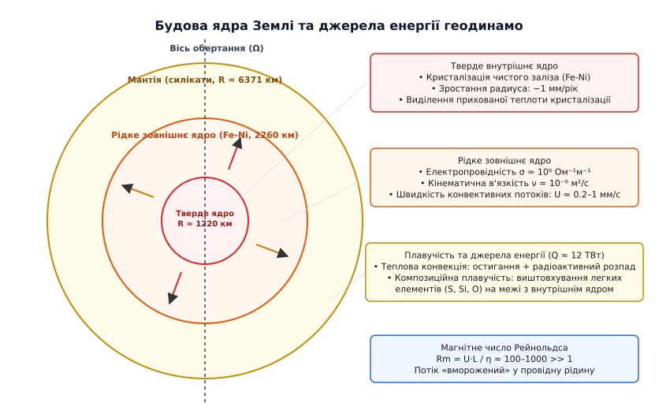
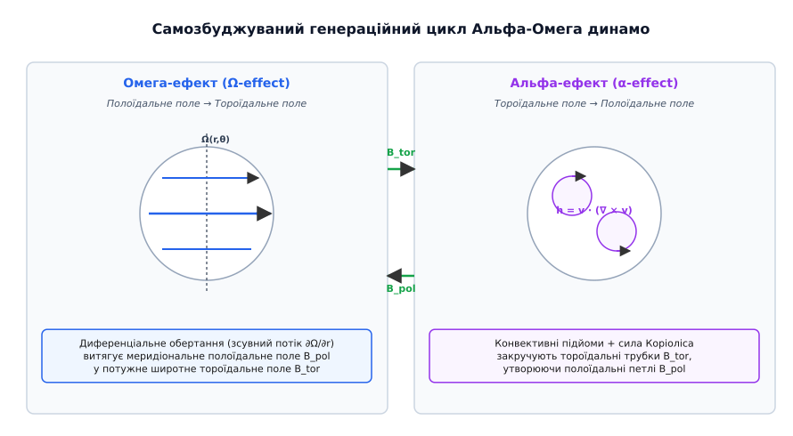
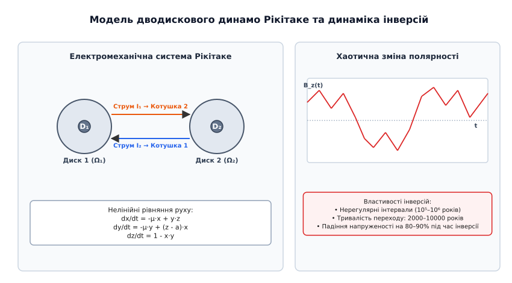
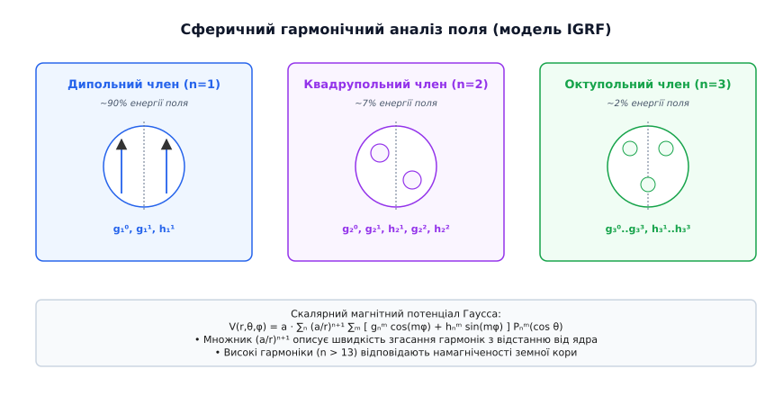

# Геодинамо

<preknowlist>
- [Електромагнітна індукція](root:ph-electromagnetism/electromagnetic-induction) — генерація ЕРС при зміні магнітного потоку через провідний контур.
- [Сила Лоренца](root:ph-electromagnetism/lorentz-force) — дія магнітного поля на рухомі електричні заряди в провідному середовищі.
- [Ферромагнетизм](root:ph-condensed/ferromagnetism) — спонтанна намагніченість речовини та точку Кюрі.
</preknowlist>

Магнітне поле Землі існує безперервно щонайменше 3.5 мільярда років, про що свідчать палеомагнітні записи у найдавніших гірських породах архейського віку. Однак залізний сердечник планетного масштабу за відсутності постійного джерела струму втратив би свій магнітний заряд за кілька десятків тисяч років через омічну дисипацію електричних струмів у провідному середовищі. Наявність стабільного магнітного щита, який захищає атмосферу від ерозії сонячним вітром та зменшує потік жорсткої космічної радіації на поверхні, вимагає існування постійно діючого внутрішнього генератора — геодинамо.

Геодинамо — це самозбуджуваний магнітогідродинамічний механізм, у якому кінетична енергія конвективних потоків рідкого заліза у зовнішньому ядрі Землі безперервно перетворюється на електромагнітну енергію геомагнітного поля.

> 🔧 **Навіщо це.**
> Розуміння фізики геодинамо є критичним для оцінки планетної придатності для життя, моделювання космічної погоди та захисту орбітальних супутникових угруповань від радіаційних аномалій. У практичній інженерії та навігації математичні моделі геодинамо (такі як IGRF) застосовуються для автономної орієнтації морських та повітряних суден, точного спрямування похило-спрямованих свердловин при видобутку корисних копалин та калібрування компасних датчиків у мобільних пристроях.

## 1. Внутрішня будова та термодинаміка ядра Землі

Для функціонування геодинамо необхідний унікальний збіг трьох геометричних та фізичних умов: наявність великого об'єму електропровідної рідини, наявність джерела енергії для підтримки її інтенсивного руху (конвекції) та наявність обертання планети, яке впорядковує ці рухи за допомогою сили Коріоліса.

Земля має шарувату структуру. На глибині близько 2900 кілометрів під силікатною мантією лежить межа ядро-мантія (Core-Mantle Boundary, CMB). На цій межі тиск досягає 1.3 мільйона атмосфер (130 ГПа), а температура перевищує 4000 K.


*Будова ядра Землі та конвективні потоки в рідкому зовнішньому ядрі*

Ядро Землі поділяється на дві принципово різні зони:

1. **Тверде внутрішнє ядро (Inner Core)**: сфероїд радіусом близько 1220 кілометрів, що складається переважно з кристалічного залізно-нікелевого сплаву. Воно зростає зі швидкістю близько 1 міліметра на рік у міру повільного остигання планети.
2. **Рідке зовнішнє ядро (Outer Core)**: шар товщиною близько 2260 кілометрів (від зовнішнього радіуса 3480 км до межі з внутрішнім ядром 1220 км). Сама ця рідка металева оболонка і є «робочим тілом» геодинамо.

Фізичні властивості рідкого заліза в зовнішньому ядрі радикально відрізняються від звичайних земних рідин. Питома електропровідність сплаву становить `σ ≈ 10⁶ Ом⁻¹·м⁻¹` (або Сименс/метр), що лише в кілька разів поступається провідності рідкого заліза при атмосферному тиску. Магнітна дифузійність середовища дорівнює:

```
η = 1 / (μ₀ · σ) ≈ 1.5 м²/с
```

При цьому кінематична в'язкість рідкого заліза під тиском 1.5–3.3 мільйона атмосфер виявляється дивовижно малою: `ν ≈ 10⁻⁶ м²/с`, що практично дорівнює в'язкості звичайної води за кімнатної температури. Мала в'язкість у поєднанні з гігантськими просторовими масштабами робить потоки в ядрі високотурбулентними.

Двигуном конвекції у зовнішньому ядрі є сумарний тепловий потік через межу мантії та ядра, який оцінюється у `Q ≈ 10–15 ТВт`. Ця потужність підтримується двома основними механізмами плавучості:

- **Теплова конвекція (Thermal Convection)**: остигання планети та виділення тепла від розпаду довгоіснуючих радіоактивних ізотопів (калій-40, уран, торій) створюють температурний градієнт, що перевищує адіабатичний. Гарячіший рідкий метал біля основи зовнішнього ядра розширюється і спливає догори, тоді як охолоджена біля мантії рідина опускається донизу.
- **Композиційна плавучість (Compositional / Solutal Convection)**: рідке ядро містить близько 10% легких елементів (сірка, кремній, кисень, вуглець). Під час кристалізації чистого заліза на межі внутрішнього ядра ці легкі елементи відтісняються у рідку фазу. Вони утворюють збагачені легкими компонентами плюми рідкого заліза, які володіють потужною додатковою плавучістю (густина знижується на `Δρ/ρ ≈ 4.5%`) і з прискоренням піднімаються догори крізь товщу ядра.

Термодинамічні розрахунки показують, що саме композиційна плавучість забезпечує до 80% сумарної енергії, яка живить конвективні вихори геодинамо. Кристалізація внутрішнього ядра працює як гігантський хімічний насос, який підкачує механічну енергію в рідке ядро протягом останніх 1–1.5 мільярда років. Частина цієї енергії безперервно дисипує в омічне тепло (Джоулеве нагрівання ядра потужністю `Q_Ohm ≈ 1–3 ТВт`), яке також сприяє загальному тепловому потоку через межу з мантією.

Сейсмічне простеження поширення об'ємних хвиль (P-хвиль та PKIKP-хвиль) виявило сейсмічну анізотропію твердого внутрішнього ядра: сейсмічні хвилі поширюються уздовж осі обертання Землі на 3% швидше, ніж у екваторіальній площині. Це свідчить про переважну впорядковану орієнтацію залізних кристалів гексагональної щільноупакованої фази (hcp-Fe) під дією планетного магнітного поля та крутильних моментів Лоренца. Сучасні супутникові та сейсмічні спостереження також фіксують диференціальну суперротацію внутрішнього ядра — його обертання на 0.1–0.3° на рік швидше за мантію Землі під дією електромагнітного зчеплення з зовнішнім ядром.

## 2. Магнітна гідродинаміка та рівняння індукції

Еволюція геомагнітного поля під дією потоків провідної рідини описується рівнянням індукції магнітної гідродинаміки. Це рівняння виводиться з рівнянь Максвелла та узагальнення закону Ома для рухомого середовища `J = σ · (E + v × B)`:

```
∂B/∂t = ∇ × (v × B) + η · ∇²B
```

де `B` — вектор магнітної індукції, `v` — вектор швидкості руху рідини, `η` — магнітна дифузійність.

Детальний математичний вивід цього рівняння, аналіз дисипативних термінів та доведення збереження магнітного потоку наведено у вставці [Математичний вивід рівняння індукції та теорема Коулінґа](root:ph-electromagnetism/geodynamo/math-induction-equation.md).

Фізичний зміст рівняння індукції полягає в боротьбі двох протилежних процесів:

1. **Генераційний (адвективний) член `∇ × (v × B)`**: описує захоплення, деформацію та підсилення силових ліній магнітного поля гідродинамічним потоком `v`.
2. **Дисипативний (дифузійний) член `η · ∇²B`**: описує омічне згасання струмів через електричний опір рідини та вирівнювання просторових неоднорідностей поля.

Співвідношення між цими двома членами визначається безрозмірним **магнітним числом Рейнольдса (Rm)**:

```
Rm = (U · L) / η
```

де `U` — характерна швидкість конвективних потоків у ядрі (`U ≈ 10⁻⁴–10⁻³ м/с`, тобто близько 0.2–1 мм/с або 10–30 км/рік), `L` — характерний просторовий масштаб ядра (`L ≈ 10⁶ м`).

Для рідкого ядра Землі магнітне число Рейнольдса становить:

```
Rm = (10⁻³ м/с · 10⁶ м) / 1.5 м²/с ≈ 600–1000 >> 1
```

Значення `Rm >> 1` означає, що адвекція магнітного поля потоком рідини домінує над омічною дифузією. За цієї умови виконується **теорема Альфвена про вмороженість магнітного поля**: силові лінії магнітного поля рухаються разом із елементами провідної рідини, ніби вони прив'язані до них. Якщо потік витягує або закручує рідкий метал, він витягує та закручує й силові лінії магнітного поля, збільшуючи локальну густину магнітної енергії.

Для системи без постійного механічного підкачування енергії дифузійний член `η · ∇²B` призводить до згасання поля за характерний час дифузії:

```
τ_diff = L² / (π² · η) ≈ (2.26 · 10⁶ м)² / (9.87 · 1.5 м²/с) ≈ 3.4 · 10¹¹ с ≈ 11 000 років
```

Оскільки вік Землі перевищує 4.5 мільярда років, факт існування магнітного поля беззаперечно доводить, що генераційний член `∇ × (v × B)` постійно генерує нове магнітне поле, компенсуючи неминучі омічні втрати.

## 3. Симетрія та теорема Коулінґа

На перший погляд здається, що для утворення геомагнітного диполя достатньо простішої плоскої або вісесиметричної конвективної комірки. Проте фундаментальна **антидинамо-теорема Коулінґа (1933)** встановлює жорстке математичне обмеження: строго вісесиметричне магнітне поле не може підтримуватися ніяким вісесиметричним рухом провідної рідини.

Якщо поле та рух рідини є вісесиметричними (не залежать від азимутального кута `φ`), силові лінії меридіонального (полоїдального) магнітного поля утворюють замкнені концентричні петлі. Всередині цих петель неминуче існує O-подібна нейтральна лінія, де полоїдальне поле дорівнює нулю.

На цій нейтральній лінії вихрова ЕРС індукції `v × B` перетворюється на нуль через відсутність поля. Відповідно, електричний струм уздовж цієї лінії під дією омічного опору згасає до нуля. А без азимутального струму, за законом Біо-Савара-Лапласа, неможливо підтримувати полоїдальне магнітне поле. Система неминуче згасає.

Висновки з теореми Коулінґа визначальні для геодинамо: **стабільне планетне динамо обов'язково вимагає тривимірних невісесиметричних рухів рідини**. Генерація магнітного поля можлива лише тоді, коли конвективні потоки втрачають осьову симетрію і набувають складної тривимірної спіральної структури під дією обертання планети.

Докладний процес подолання заборони Коулінґа та історію розвитку динамо-теорії висвітлено у вставці [Історія відкриття динамо-механізму та концепції геодинамо](root:ph-electromagnetism/geodynamo/hist-geodynamo-discovery.md).

## 4. Механізм Альфа-Омега та генераційний цикл

Сучасна теорія геодинамо описує відтворення магнітного поля Землі як двостадійний замкнений самозбуджуваний цикл, відомий як **`αΩ`-динамо (Альфа-Омега динамо)**.

Магнітне поле Землі поділяють на дві геометричні компоненти:
- **Полоїдальне поле (`B_pol`)**: меридіональне поле, силові лінії якого виходять із південного магнітного полюса, огинають планету в космосі і входять у північний магнітний полюс (дипольне поле, яке ми вимірюємо на поверхні).
- **Тороїдальне поле (`B_tor`)**: широтне поле, силові лінії якого замкнені всередині рідкого ядра паралельно екватору і не виходять на поверхню Землі.


*Самозбуджуваний генераційний цикл Альфа-Омега динамо*

Цикл генерації складається з двох послідовних стадій:

### Стадія 1: Омега-ефект (Ω-effect, Полоїдальне поле → Тороїдальне поле)

Рідке ядро Землі обертається не як тверде тіло. Внаслідок конвективного переносу імпульсу та теплового розширення у ядрі виникає **зсувне диференціальне обертання** `Ω(r, θ)`: внутрішні шари ядра обертаються з дещо іншою кутовою швидкістю, ніж зовнішні шари на межі з мантією (градієнт `∂Ω/∂r ≠ 0`).

У геострофічному середовищі градієнт температури між екватором та полюсом породжує так званий термічний вітер, який змушує широтну швидкість `v_φ` змінюватися з радіусом та широтою.

Коли силові лінії вихідного полоїдального поля `B_pol` пронизують рідке ядро з півдня на північ, диференціальне обертання захоплює їх і намотує навколо осі обертання планети. Оскільки рідина має високе магнітне число Рейнольдса (`Rm >> 1`), силові лінії витягуються в потужні азимутальні джгути:

```
∂B_φ / ∂t ≈ r · sin θ · (B_pol · ∇) Ω
```

У результаті Омега-ефекту вихідне слабке меридіональне поле `B_pol` перетворюється на надзвичайно потужне внутрішнє тороїдальне поле `B_tor`. Напруженість тороїдального поля всередині ядра Землі сягає `10–30 мТл` (100–300 Гаус), що в сотні разів перевищує напруженість дипольного поля на поверхні Землі (`~0.05 мТл`).

### Стадія 2: Альфа-ефект (α-effect, Тороїдальне поле → Полоїдальне поле)

Створене тороїдальне поле замкнене всередині ядра і само по собі не може відновити полоїдальне поле. Для замикання циклу необхідний зворотний процес — перетворення `B_tor` назад у `B_pol`. Цю функцію виконує **Альфа-ефект**, відкритий Юджином Паркером.

Коли гарячі плюми рідкого заліза піднімаються під дією плавучості від межі внутрішнього ядра вгору, на них діє потужна сила Коріоліса:

```
F_Coriolis = -2 · ρ · (Ω × v)
```

Сила Коріоліса закручує висхідні та низхідні потоки рідини у спіралі. Мірою спіральності потоку є кінематична спіральність:

```
h_k = v · (∇ × v)
```

У Північній півкулі висхідні потоки закручуються проти годинникової стрілки, а в Південній — за годинниковою стрілкою.

Спіральний конвективний вихор захоплює горизонтальну силову трубку тороїдального поля `B_tor`, піднімає її у вигляді петлі та закручує навколо вертикальної осі на 90°. У результаті закручування утворюється мала вертикальна магнітна петля, яка лежить у меридіональній площині.

В електродинаміці середніх полів середня електрорушійна сила турбулентних вихорів виражається через коефіцієнт Альфа-ефекту:

```
E_mean = <v' × b'> = α · B_tor - β · (∇ × B_tor)
```

Складання та злиття тисяч таких дрібномасштабних полоїдальних петель під дією омічної дифузії створює макроскопічне меридіональне магнітне поле, напрямлене уздовж осі обертання планети. Це підсилює та відновлює вихідне полоїдальне поле `B_pol`, замикаючи самозбуджуваний генераційний цикл:

```
B_pol  ──(Ω-ефект)──>  B_tor  ──(α-ефект)──>  B_pol
```

Залежно від співвідношення інтенсивностей Альфа- та Омега-ефектів виділяють два динамо-режими: `αΩ`-динамо (де Омега-ефект значно сильніший за Альфа-ефект, що характерно для швидкообертальних планет із помірною конвекцією) та `α²`-динамо (де полоїдальне і тороїдальне поля з однаковою силою ґенеруються Альфа-ефектом, що характерно для повільно обертальних тіл або конвективних ядер зі слабким зсувом).

## 5. Баланс сил та магнітострофічний режим (MAC-баланс)

Динаміка провідної рідини у рідкому ядрі Землі описується рівнянням Нав'є-Стокса у системі координат, що обертається з кутовою швидкістю Землі `Ω`:

```
ρ · (∂v/∂t + (v · ∇)v) = -∇p + ρ·g - 2·ρ·(Ω × v) + J × B + ρ·ν·∇²v
```

де `-∇p` — градієнт тиску, `ρ·g` — сила плавучості (архімедова сила), `-2·ρ·(Ω × v)` — сила Коріоліса, `J × B` — сила Лоренца, `ρ·ν·∇²v` — сила в'язкого тертя.

Оцінимо відносні масштаби сил за допомогою безрозмірних критеріїв подібності:

1. **Число Екмана (Ekman Number)**:
   ```
   E = ν / (2 · Ω · L²) ≈ 10⁻⁶ / (2 · 7.29·10⁻⁵ c⁻¹ · (10⁶ м)²) ≈ 10⁻¹⁵ << 1
   ```
   Наднескінченно мало значення числа Екмана свідчить про те, що в'язке тертя в об'ємі ядра є повністю нехтуваним порівняно з силою Коріоліса. В'язкість відіграє роль лише у тонких приграничних шарах Екмана товщиною близько 1 метра біля межі мантії.

2. **Число Росбі (Rossby Number)**:
   ```
   Ro = U / (2 · Ω · L) ≈ 10⁻³ / (2 · 7.29·10⁻⁵ · 10⁶) ≈ 10⁻⁶ << 1
   ```
   Малість числа Росбі означає, що інерційні члени `(v · ∇)v` також є мізерними порівняно з силою Коріоліса. Рух рідини перебуває під суворим контролем обертання планети.

За відсутності магнітного поля (`B = 0`) в'язкість та інерція нехтувані, і рівняння руху зводиться до **геострофічного балансу** між градієнтом тиску та силою Коріоліса: `-∇p = 2·ρ·(Ω × v)`. Звідси випливає знаменита **теорема Тейлора-Прудмана**: швидкості плинності не можуть змінюватися вздовж осі обертання (`∂v/∂z = 0`). Рідина вимушена рухатися у вигляді жорстких коаксіальних циліндрів, витягнутих уздовж осі обертання Землі (стовпи Тейлора).

Однак у реальному ядрі виникає потужне магнітне поле, і сила Лоренца `J × B` досягає величини, порівнянної з силою Коріоліса та плавучістю. Виникає так званий **магнітострофічний режим**, або **MAC-баланс** (Magnetic, Archimedean, Coriolis):

```
-∇p + ρ·g - 2·ρ·(Ω × v) + J × B ≈ 0
```

Співвідношення між силою Лоренца та силою Коріоліса визначається **числом Ельзассера (Elsasser Number)**:

```
Λ = (σ · B²) / (2 · ρ · Ω)
```

Для ядра Землі значення числа Ельзассера становить `Λ ≈ 1–10`. Це свідчить про те, що геодинамо працює у стані природного насичення: напруженість геомагнітного поля зростає доти, доки сила Лоренца не стане достатньо сильною, щоб гальмувати конвективні вихори і стабілізувати генераційний цикл.

Додатково нелінійне утримання описується **умовою Тейлора**: інтеграл азимутальної компоненти сили Лоренца вздовж будь-якого коаксіального геострофічного циліндра `C(s)` повинен перетворюватися на нуль:

```
∫_C(s) (J × B)_φ · dS = 0
```

Якщо ця умова порушується, виникають крутильні альфвенівські осциляції (крутильні хвилі Тейлора) в ядрі, які поширюються з періодом близько 6–10 років і фіксуються в спостереженнях секулярних варіацій.

## 6. Хаотична динаміка, інверсії та секулярні варіації

Зворотний вплив сили Лоренца на рух рідини робить систему рівнянь геодинамо принципово нелінійною. Поведінка такої системи виявляє складну хаотичну динаміку, яка виражається у вековому ході (секулярних варіаціях) та неперіодичних інверсіях полярності геомагнітного поля.


*Модель дводискового динамо Рікітаке та динаміка інверсій*

Простішою електромеханічною моделлю, яка пояснює фізику інверсій, є **дводискове динамо Рікітаке**. Зв'язана система нелінійних рівнянь для двох дисків демонструє хаотичний атрактор: струм (і відповідно дипольне магнітне поле) коливається навколо стійкого стану, а потім несподіваним чином здійснює стрибок протилежного знаку.

Практична чисельна реалізація цієї моделі мовами C та C++, розрахунок фазових траєкторій та аналіз статистики інверсій наведені у вставці [Чисельне моделювання хаотичного динамо Рікітаке](root:ph-electromagnetism/geodynamo/proj-dynamo-simulation.md).

Аналіз палеомагнітних даних (намагніченості базальтових лав океанічного дна та озерних відкладів) виявив наступні характеристики інверсій:

- **Нерегулярність інтервалів**: середня тривалість епох полярності становить близько 200 000–300 000 років. Проте інтервали варіюються від десятків тисяч років до десятків мільйонів років (наприклад, у крейдовий період спостерігався «суперхрон» тривалістю понад 35 мільйонів років без жодної інверсії).
- **Швидкість інверсії**: самий перехід полярності відбуваються надзвичайно швидко за геологічними мірками — за 2000–10 000 років.
- **Падіння напруженості поля**: під час інверсії дипольна компонента поля згасає до 10–20% від норми. Магнітне поле стає виражено мультипольним (квадрупольним та октупольним) із кількома магнітними полюсами на різних широтах.
- **Магнітні екскурси**: короточасні спроби інверсії (наприклад, екскурс Лашамп близько 41 000 років тому), коли магнітна вісь відхилялася на понад 45° від географічної осі, а потім поверталася у вихідну полярність.
- **Геомагнітні джерки (Geomagnetic Jerks)**: раптові злами другої часової похідної магнітного поля `d²B/dt²`, які відбуваються протягом кількох місяців або 1–2 років. Вони викликані локальними спалахами магнітогідродинамічних хвиль на межі між рідким ядром та мантією.

Палеомагнітна шкала полярності (GPTS) ділить останні геологічні епохи на хрони: хрон Брунес (нормальна полярність, від сьогодення до 780 тисяч років тому), хрон Матуяма (зворотна полярність, 0.78–2.58 млн років тому), хрон Ґаусс (нормальна полярність, 2.58–3.60 млн років тому) та хрон Ґілберт (зворотна полярність, 3.60–5.33 млн років тому).

Останнє повне переполюсування (інверсія Брунес-Матуяма) відбулося близько 780 000 років тому. Сучасні супутникові вимірювання фіксують падіння дипольного моменту Землі зі швидкістю близько 5% за століття та стрімкий дрейф Північного магнітного полюса з канадської Арктики в бік Сибіру зі швидкістю понад 50 км/рік, що може бути ознакою початку нового магнітного екскурсу або інверсії.

## 7. Спостережна структура та сферичний гармонічний аналіз

На поверхні Землі та в космосі геомагнітне поле вимірюється супутниками (такими як місія ESA Swarm) та мережею геомагнітних обсерваторій. Оскільки в атмосфері відсутні електричні струми (`∇ × B = 0`), магнітна індукція описується скалярним потенціалом Гаусса `V`, розкладеним за приєднаними поліномами Лежандра:

```
V(r, θ, φ) = a · ∑ₙ₌₁ᴺ (a / r)ⁿ⁺¹ ∑ₘ₌₀ⁿ [ gₙᵐ · cos(m·φ) + hₙᵐ · sin(m·φ) ] · Pₙᵐ(cos θ)
```

де `gₙᵐ` та `hₙᵐ` — коефіцієнти Гаусса, `a = 6371.2 км` — еталонний радіус Землі.


*Сферичний гармонічний аналіз поля (модель IGRF)*

Фізичний зміст ступенів розкладу `n`:

- **Дипольний член (`n = 1`)**: описує головний магнітний диполь планети. Коефіцієнти `g₁⁰, g₁¹, h₁¹` забезпечують понад 90% загальної енергії геомагнітного поля на поверхні. Магнітний момент Землі становить `M ≈ 7.8 · 10²² А·м²`.
- **Квадрупольний член (`n = 2`)**: описує чотирьохполюсні асиметрії, що формують регіональні магнітні аномалії (близько 7% енергії).
- **Октупольний член (`n = 3`)**: описує восьмиполюсні неоднорідності (близько 2% енергії).
- **Вищі гармоніки (`n = 4..13`)**: описують дрібномасштабні конвективні вихори біля межі рідкого ядра та мантії.

Множник `(a / r)ⁿ⁺¹` визначає швидкість згасання гармонік з відстанню від ядра. На поверхні Землі високі гармоніки швидко згасають. На межі ядро-мантія (`r ≈ 3480 км`) спектр полів виявляється набагато багатшим: там спостерігаються так звані **плями зворотного магнітного потоку** (Reverse Flux Patches), де магнітні лінії входять у ядро в Південній півкулі або виходять у Північній.

Найвідомішою результуючою аномалією на поверхні Землі є **Південно-Атлантична магнітна аномалія (SAA)**, де напруженість магнітного поля на 50% слабша за середню планетну (падає до 22 000 нТл проти 60 000 нТл на полюсах). Вона виникає через зростання плями зворотного потоку під Південною Америкою та Атлантикою. У цій зоні радіаційні пояси Ван Аллена опускаються до висот орбіти Міжнародної космічної станції (400 км), що викликає підвищений радіаційний вплив та збої у супутниковій електроніці.

Додатковим явищем є **західний дрейф недипольного поля** (Westward Drift): недипольні магнітні аномалії на поверхні Землі повільно зміщуються на захід зі швидкістю близько `0.2° на рік` (близько 20 км/рік). Це явище пояснюється диференціальним обертанням верхніх шарів рідкого ядра відносно нижньої мантії: через магнітогідродинамічне гальмування зовнішня частина ядра обертається дещо повільніше за мантію Землі.

Повний опис програмного стандарту IGRF, геодезичних перетворень координат та готовий C/C++ API для обчислення геомагнітних компонентів наведено у вставці [Інтерфейс специфікації IGRF та обчислення геомагнітного поля](root:ph-electromagnetism/geodynamo/api-geomagnetic-models.md).

## 8. Лабораторні моделі та порівняльна планетологія

Безпосереднє спостереження за рідким ядром Землі неможливе, оскільки воно перекрите 2900 кілометрами щільної силікатної мантії. Тому головними інструментами перевірки теорії геодинамо стали лабораторні фізичні експерименти, тривимірне суперкомп'ютерне моделювання та порівняльний аналіз інших планет Сонячної системи.

Створення лабораторного динамо є надзвичайно складним інженерним завданням. Через малі розміри лабораторних установок (`L ~ 1 м` замість `10⁶ м`) для досягнення критичного магнітного числа Рейнольдса `Rm > 10` необхідно прокачувати рідкий метал (найчастіше рідкий натрій, який має високу провідність `σ ≈ 10⁷ Ом⁻¹·м⁻¹`) зі швидкостями в десятки метрів за секунду під високим тиском.

Історичними проривами у лабораторному динамо-експерименті стали:
1. **Ризький експеримент (2000 рік, Латвія)**: у гвинтовому каналі з рідким натрієм під дією потужного гвинтового насоса вперше у світі було отримано спонтанне самозбудження магнітного поля.
2. **Карлсруе експеримент (2000 рік, Німеччина)**: експериментальна установка з масивом із 56 спіральних трубок відтворила періодичну генерацію магнітного поля у відповідності до теорії електродинаміки середніх полів.
3. **Експеримент VKS у Кадараші (2006 рік, Франція)**: турбулентне динамо з двома зустрічно обертальними лопатевими дисками у баку з рідким натрієм спонтанно демонструвало як стабільний диполь, так і самочинні неперіодичні інверсії полярності поля.

Порівняльна планетологія демонструє фундаментальну роль геодинамо в еволюції планет:

- **Марс**: володіє лише залишками стародавньої корової намагніченості у Південному материковому нагір'ї. Марсіанське динамо згасло близько 4.0 мільярдів років тому через швидке охолодження малого ядра (`R_core ≈ 1800 км`) та зупинку конвекції. Втрата магнітного щита призвела до здування сонячним вітром щільної марсіанської атмосфери та перетворення Марса на холодну пустелю.
- **Венера**: близька до Землі за розмірами та складом, проте не має власного дипольного магнітного поля. Причиною є повільне обертання планети (період обертання 243 доби) та відсутність тектоніки плит, через що нижня мантія Венери не забезпечує достатньо швидкого відведення тепла від ядра для запуску термічної чи композиційної конвекції.
- **Меркурій та Ганімед**: володіють слабким власним магнітним полем. Динамо Меркурія працює в умовах так званого «залізного снігу» (кристалізація заліза у верхніх шарах рідкого ядра з опусканням кристалів донизу).
- **Юпітер та Сатурн**: володіють гігантськими магнітними полями (у Юпітера магнітний момент у 20 000 разів більший за земний). Їхнє динамо працює не в залізному ядрі, а в товщі рідкого металевого водню при тисках понад 2 мільйони атмосфер, де водень набуває високої провідності (`σ ≈ 10⁵–10⁶ Ом⁻¹·м⁻¹`).

Паралельно з експериментами розвиваються суперкомп'ютерні MHD-симуляції. Моделювання рівнянь Нав'є-Стокса та індукції у сферичному шарі з урахуванням конвекції, плавучості та обертання (від перших моделей Ґлатцмаєра-Робертса 1995 року до сучасних високороздільних моделей) дозволяє візуалізувати тривимірну структуру конвективних плюмів, формування стовпів Тейлора та детальний механізм закручування магнітних трубок. Чисельні моделі підтвердили, що геодинамо є природним, неминучим результатом конвекції провідної рідини у швидкообертальних планетних ядрах.
