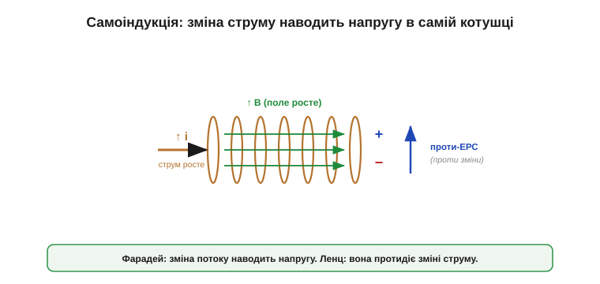
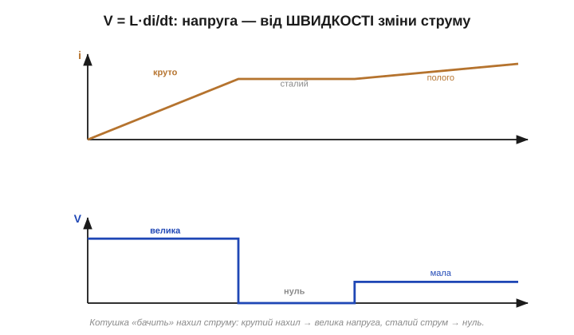
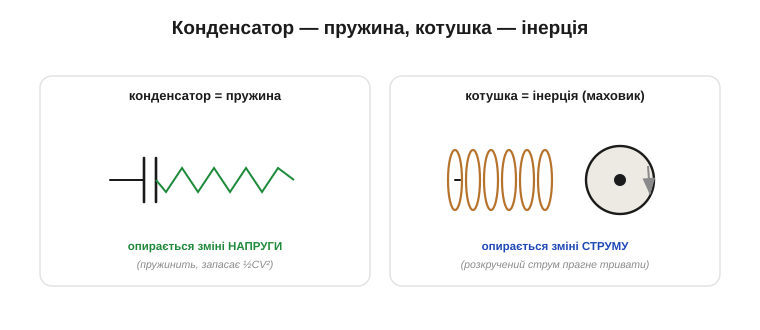
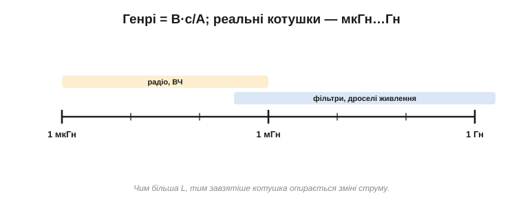
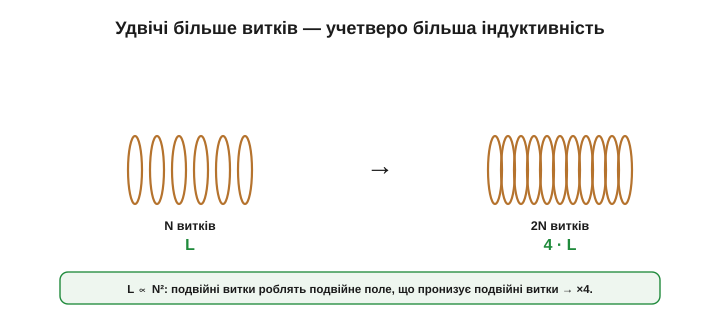
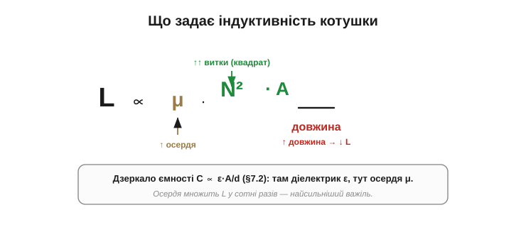
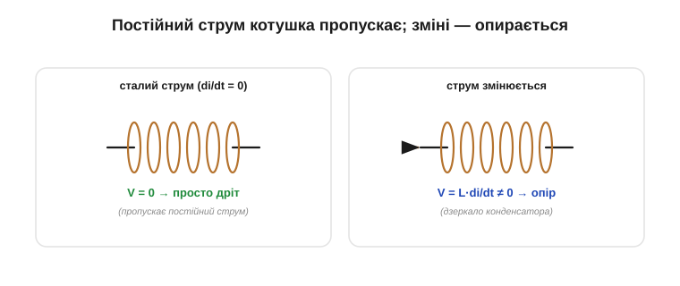
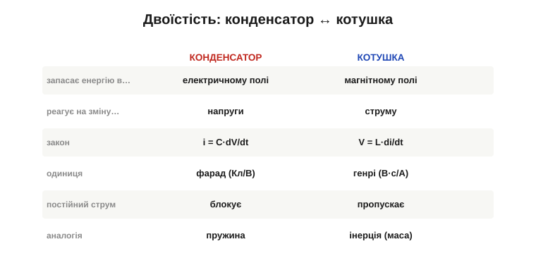

# Індуктивність і самоіндукція: V = L·di/dt

[Котушка](topic:ph-electromagnetism/inductor-coil) робить магнітне поле зі сталого струму. А що станеться, коли струм **змінити**? Тоді зміниться й поле — а зміна поля, за законом електромагнітної індукції, наводить напругу. Найдивовижніше: ця напруга наводиться в **тій самій** котушці, що й створила поле. Котушка реагує на власну зміну струму — це **самоіндукція** (від лат. *inductio* — наведення; саму себе «наводить»), і саме вона робить котушку котушкою. (Тут ідеться саме про **само**індукцію — реакцію котушки на власну зміну струму. Коли ж поле однієї котушки наводить струм в **іншій** — це [взаємоіндукція](topic:ph-electromagnetism/mutual-inductance), основа трансформатора.)

### Самоіндукція: котушка наводить напругу сама в собі

Простежмо ланцюжок. Тече струм → [котушка робить магнітне поле](topic:ph-electromagnetism/inductor-coil). Міняємо струм → міняється поле → міняється магнітний потік крізь витки котушки. А за [законом індукції Фарадея](topic:ph-electromagnetism/electromagnetic-induction) зміна потоку наводить напругу — причому, за законом Ленца, таку, що **протидіє** зміні, яка її породила. Тобто котушка наводить у собі напругу, яка намагається **зберегти** свій струм незмінним.


*Міняємо струм у котушці → міняється її поле → змінний потік наводить напругу в самій котушці (Фарадей), причому **проти** зміни (Ленц). Намагаєшся наростити струм — котушка «гальмує»; намагаєшся обірвати — котушка «підштовхує», аби струм тривав.*

Цю наведену напругу часто звуть **проти-ЕРС** (*back-EMF*): вона спрямована проти того, що робить джерело. Намагаєтеся **збільшити** струм — котушка наводить напругу, яка цьому опирається; намагаєтеся **обірвати** струм — котушка наводить напругу, яка штовхає струм далі, аби той не зникав. Котушка поводиться вперто: завжди **за збереження** свого поточного струму.

У реальному колі ця проти-ЕРС додається до напруги джерела за [правилом напруг Кірхгофа](topic:hw-analog/kvl): поки струм наростає, частину напруги джерела «з'їдає» подолання впертості котушки, тому струм набирається не миттєво. А коли джерело вимикають, накопичене поле не зникає враз — котушка сама стає джерелом, підтримуючи струм своєю проти-ЕРС, аж поки запас поля не вичерпається. Саме це робить котушку такою норовливою при вмиканні-вимиканні.

### Закон котушки: V = L·di/dt

Скільки саме напруги наводиться? Вона тим більша, чим **швидше** міняється струм. Точний зв'язок — основний закон котушки:

```
V = L · (di/dt)
```

де **di/dt** — швидкість зміни струму (амперів за секунду), а коефіцієнт **L** і є **індуктивність** (*inductance*). Читати слід так: напруга на котушці пропорційна не струму, а **швидкості його зміни**. Тече сталий струм (di/dt = 0) — напруги на ідеальній котушці немає взагалі. Струм ринув різко (велике di/dt) — котушка відповідає великою напругою. (Про знак: тут **V** — це *спад* напруги на котушці в пасивній згоді знаків; та сама величина як **наведена ЕРС**, що протидіє зміні, записується з мінусом — ε = −L·di/dt, — і цей мінус і є закон Ленца. Зручно користуватися формою V = L·di/dt, пам'ятаючи, що напрямок цієї напруги — завжди *проти* зміни струму.)


*Поки струм наростає рівномірно (стале di/dt) — на котушці стала напруга. Крутіший нахил струму (швидша зміна) → більша напруга. Струм застиг (горизонтальна ділянка) → напруга падає до нуля. Котушка «бачить» лише нахил струму, а не його рівень.*

Індуктивність L — це **міра впертості** котушки: за тієї самої швидкості зміни струму більша L дає більшу протидійну напругу. Зверніть увагу на красиву дзеркальність до [конденсатора](topic:hw-components/capacitor): там струм у колі залежить від швидкості зміни **напруги** (i = C·dV/dt), тут напруга залежить від швидкості зміни **струму** (V = L·di/dt). Помінялися місцями струм і напруга — і вийшов інший компонент.

### Котушка — це електрична інерція

Найкраща інтуїція для котушки — **інерція**. Згадайте важкий маховик: він опирається будь-якій зміні швидкості обертання. Підштовхуєте — він розганяється неохоче; гальмуєте — він за інерцією крутиться далі. Котушка робить те саме зі **струмом**: опирається його розгону й не дає різко спинити.


*Конденсатор — це «електрична пружина» (запасає енергію в полі, пружинить проти зміни напруги). Котушка — це «електрична інерція»: як важкий маховик опирається зміні швидкості, так котушка опирається зміні струму. Раз розігнаний струм вона «хоче» втримати.*

Ця аналогія точна й дуже корисна. [Конденсатор](topic:ph-electromagnetism/capacitor-energy) поводиться як **пружина** — запасає енергію в полі, пружинить проти зміни напруги. Котушка — це **маса/маховик**: вона теж запасає енергію (у магнітному полі), але опирається зміні **струму**, а раз «розкручений» струм прагне зберегти. Звідси й уся поведінка котушки: повільне наростання струму, інерційне «доживання» струму після вимкнення, потужний сплеск при різкому обриві.

Аналогія підказує й те, чого очікувати від котушки. Маховик не спинити вмить — і струм у котушці не обірвати вмить без наслідків. Маховик, який гальмують, мусить кудись віддати накопичену енергію обертання — і котушка, якій перекрили струм, теж мусить кудись подіти запас свого магнітного поля. Сам хід струму в часі описує [наростання й спад струму в RL-колі](topic:hw-analog/rl-time-constant), а різкий обрив породжує [кидок напруги — «брикання» котушки](topic:hw-components/inductor-kickback). Головний образ: котушка — це **інерція струму**.

### Генрі: одиниця індуктивності

Одиниця індуктивності — **генрі** (*henry*, **Гн** / **H**), названий на честь Джозефа Генрі, що відкрив самоіндукцію. З формули V = L·di/dt одразу видно, що таке генрі:

```
1 генрі = 1 вольт / (1 ампер за секунду)
1 Гн = 1 В·с / А
```

Тобто котушка в 1 Гн — це така, у якій зміна струму на 1 ампер за секунду наводить рівно 1 вольт. Генрі — велика одиниця; реальні котушки частіше мають частки її:

```
1 мкГн (мікрогенрі) = 10⁻⁶ Гн   (дрібні ВЧ-котушки, дроселі)
1 мГн (мілігенрі)   = 10⁻³ Гн   (фільтри, живлення)
1 Гн                            (великі дроселі, обмотки з осердям)
```


*Генрі = вольт-секунда на ампер. Практичні котушки — від мікрогенрі (радіо) до одиниць генрі (дроселі живлення з осердям). Чим більша L, тим завзятіше котушка опирається зміні струму.*

> 🔧 **Навіщо це.** У даташиті котушки чи дроселя індуктивність — головна цифра, як ємність у конденсатора: «10 µH», «100 mH». Поряд завжди стоїть **максимальний струм** (бо за великого струму [осердя насичується](topic:ph-electromagnetism/inductor-coil), і L падає) та опір обмотки. Читати котушку — це дивитися одразу на L і на допустимий струм, так само як конденсатор — на ємність і напругу. А ще в каталогах котушки розрізняють за призначенням — [дроселі живлення, ВЧ-котушки, обмотки трансформаторів](topic:hw-components/inductor-types).

### Від чого залежить L: витки в квадраті

Як і ємність, індуктивність задається **будовою**, а не струмом. Важелі — ті самі, що в [будові котушки](topic:ph-electromagnetism/inductor-coil): кількість витків, площа й довжина котушки, матеріал осердя. Але один із них поводиться несподівано: індуктивність росте з квадратом числа витків.


*Чому N²? Удвічі більше витків створюють удвічі сильніше поле (більший потік), і водночас цей потік пронизує вдвічі більше витків. Двічі по два — учетверо. Тому індуктивність дуже чутлива до числа витків: L ∝ N².*

Чому саме квадрат? Дві причини множаться. По-перше, удвічі більше витків роблять удвічі **сильніший** потік (більше [ампер-витків](topic:ph-electromagnetism/inductor-coil)). По-друге, цей потік тепер пронизує удвічі більше витків, наводячи напругу в кожному. Двічі по два — учетверо. Тому щоб підняти індуктивність, найвигідніше **домотати витків**, а не міняти струм.

**Приклад (вплив витків).** Котушка зі 100 витків має індуктивність, скажімо, 1 мГн. Домотаємо до 200 витків (удвічі), не міняючи більше нічого. Індуктивність зросте не вдвічі, а **вчетверо** — до 4 мГн, бо L ∝ N². А 300 витків (утричі) дали б уже ×9 — цілих 9 мГн. Ось чому навіть невелика зміна кількості витків помітно зсуває індуктивність, і чому котушки на велику L мають густі багатошарові обмотки. (Зверніть увагу: «не міняючи більше нічого» — це **ідеалізація** «та сама геометрія, лінійне осердя». Насправді, домотуючи витки, ви заодно подовжуєте дріт, піднімаєте опір DCR і паразитну ємність, міняєте розмір обмотки, а інколи й насичення осердя — тож рівно ×4 виходить лише на папері, а в залізі — приблизно.)


*Індуктивність котушки: L росте з квадратом числа витків N², з площею перерізу та проникністю осердя μ, і падає з довжиною котушки. Магнітне осердя (велика μ) — найпотужніший важіль, як діелектрик для ємності.*

Якісно: **L ∝ μ · N² · A / довжину**. Порівняйте з [ємністю C ∝ ε·A/d](topic:ph-electromagnetism/capacitance) — знову дзеркало: там діелектрик (ε), тут магнітне осердя (μ); там площа й зазор, тут площа й довжина обмотки. Осердя з великою проникністю множить L у сотні разів — тому потужні дроселі завжди мають залізне чи феритове осердя.

Осердя — найсильніший важіль, але й найхитріший. Воно множить L за тих самих витків, та приносить і вади: [насичується за великого струму](topic:ph-electromagnetism/inductor-coil) (L раптом падає), гріється й додає втрат на високих частотах. Тому в силових дроселях беруть осердя з тонким повітряним зазором (стабільніше, пізніше насичується), у радіочастотних котушках — спеціальний ферит або взагалі **повітряне** осердя (мала L, зате без втрат і насичення). Вибір осердя — це завжди компроміс між великою індуктивністю та чесною поведінкою, точно як вибір діелектрика для конденсатора, де теж доводиться [зважати на паразитні властивості](topic:hw-components/capacitor-parasitics).

### Для постійного струму котушка — просто дріт

Із V = L·di/dt випливає важливий висновок, дзеркальний до конденсатора. Якщо струм **сталий** (di/dt = 0), напруга на ідеальній котушці — **нуль**. Тобто для постійного струму **ідеальна** котушка поводиться як звичайний **шматок дроту** (коротке замикання): пропускає його без спротиву. Реальна, звісно, не ідеальна: її мідна обмотка має опір DCR, на якому губиться напруга й виділяється тепло (це залежить від [конструкції конкретної котушки](topic:hw-components/inductor-types)), а великий постійний струм ще й підштовхує [осердя до насичення](topic:ph-electromagnetism/inductor-coil). Тож «просто дріт» — це про *ідеальну* котушку або коли DCR і насиченням можна знехтувати.


*Сталий струм — на котушці нуль напруги, вона просто дріт (пропускає DC). Струм змінюється — котушка наводить напругу, що опирається. Це точне дзеркало конденсатора: той блокує постійне й пропускає зміну, котушка пропускає постійне й опирається зміні.*

Запам'ятайте цю пару протилежностей: **конденсатор блокує постійний струм, котушка його пропускає**; зате конденсатор легко пропускає швидкі зміни, а котушка їм опирається. Саме на цій протилежності будуються фільтри, де реакція котушки на струм залежить від [частоти зміни](topic:hw-components/inductive-reactance); а чітке правило просте: котушка — друг постійного струму й ворог різких змін.

Звідси й типова роль котушки в живленні — **дросель** (*choke*): він вільно пропускає корисний постійний струм, але «затирає» накладену на нього швидку пульсацію чи шум, бо різким змінам опирається. Це знову дзеркало конденсатора в [його роботі на живленні](topic:hw-components/capacitor-uses): розв'язувальний конденсатор пропускав пульсацію в землю, а постійне тримав; дросель — навпаки, пропускає постійне, а пульсацію гальмує. Разом котушка й конденсатор утворюють найпоширеніший фільтр живлення, де кожен «відсіває» свою частину спектра.

### Дзеркало конденсатора

Зведімо дзеркальність докупи — її варто бачити цілою, бо вона економить половину зусиль на вивчення котушки.


*Конденсатор і котушка — двійники. Заряд Q ↔ потік (струм I); напруга ↔ швидкість зміни струму; i = C·dV/dt ↔ V = L·di/dt; фарад ↔ генрі; блокує постійне ↔ пропускає постійне; запас у E-полі ↔ запас у B-полі.*

Ця таблиця — не просто гарна симетрія, а робочий інструмент. Зустрівши котушку в незнайомій схемі, подумки перекладіть її на конденсатор, згадайте, як поводився б той, і поверніть висновок назад через дзеркало. Двоїстість економить половину міркувань про будь-яку реактивну поведінку.

**Приклад (напруга від зміни струму).** Котушка L = 10 мГн, струм у ній зростає з 0 до 2 А за 1 мс. Яка напруга на ній під час наростання?

```
di/dt = 2 А / 0.001 с = 2000 А/с
V = L · (di/dt) = 0.010 Гн · 2000 А/с = 20 В
```

Двадцять вольтів від скромної котушки — лише тому, що струм мінявся швидко. А тепер уявімо різкий **обрив**: той самий струм 2 А зникає не за мілісекунду, а за мікросекунду (di/dt у тисячу разів більше) — і напруга підскочить до **тисяч вольтів**. Це і є те небезпечне [«брикання» котушки](topic:hw-components/inductor-kickback), що вдарило Генрі.

Підсумуймо. **Індуктивність L** каже, наскільки сильно котушка опирається зміні свого струму, за законом **V = L·di/dt**: напруга пропорційна швидкості зміни струму. Міряється в **генрі** (В·с/А; на практиці — мкГн…Гн), задається будовою (**L ∝ μ·N²·A/довжину**, особливо чутлива до числа витків). Котушка — це **електрична інерція**: пропускає постійний струм як дріт, але впирається будь-якій його зміні. А опираючись зміні струму, вона неминуче [запасає енергію](topic:ph-electromagnetism/inductor-energy) у своєму магнітному полі — саме цей запас і «доживає» струм після вимкнення.

---
