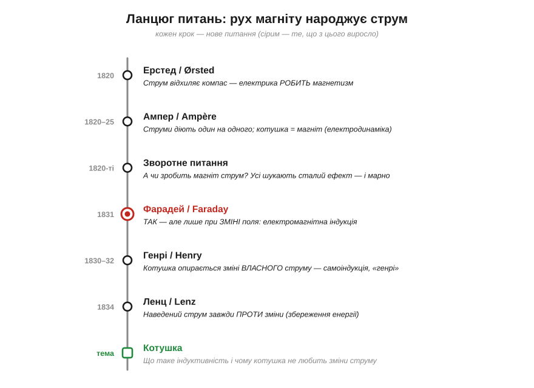
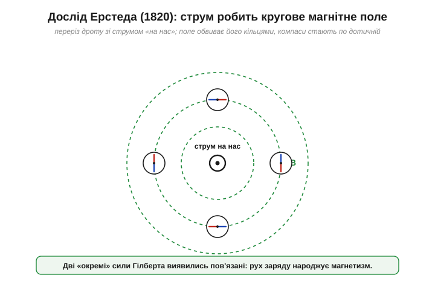
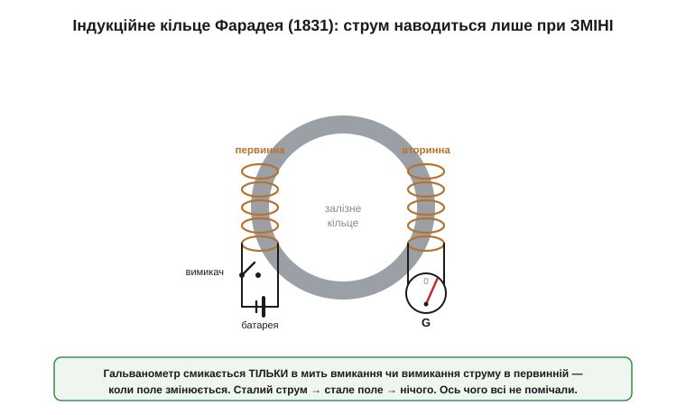
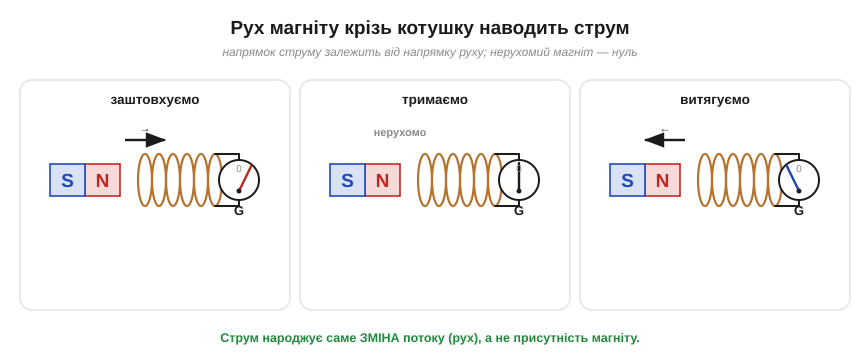
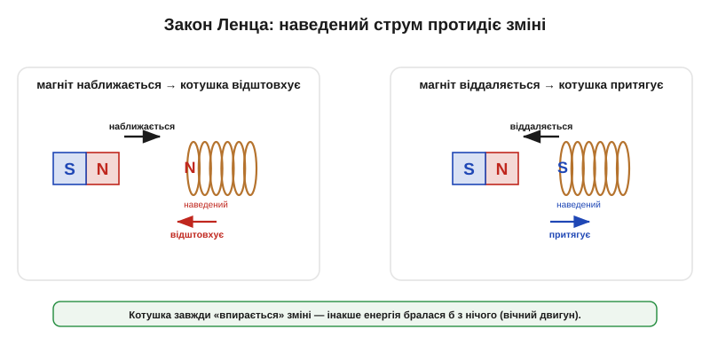
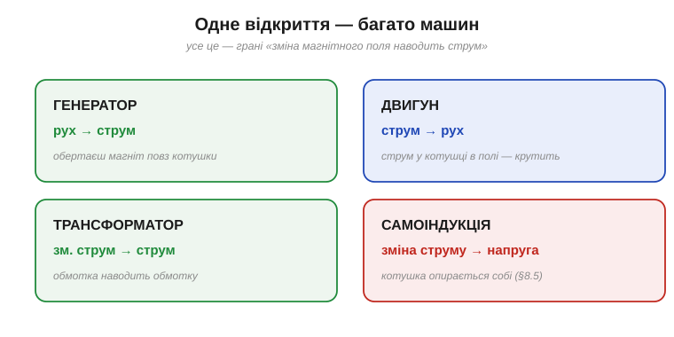

# 📜 Рух магніту народжує струм: Ерстед, Фарадей, Генрі, Ленц

Ця історія веде **ланцюгом питань** навколо одного відкриття, що перевернуло цивілізацію: як з'ясували, що **рух магніту народжує струм**. За цим стоїть драма у двадцять чотири століття — спершу електрику й магнетизм насилу **роз'єднали**, а потім виявили, що в глибині вони **одне**. І саме з цього відкриття народилися генератор, трансформатор, електродвигун — і скромна котушка.

Починалося все ще 1600 року: Вільям Гілберт старанно **розділив** дві сили природи — електрику й магнетизм, бо їх плутали. Це був правильний крок. Та лишалося свербляче відчуття, що між ними є зв'язок: обидві притягують на відстані, обидві невидимі. Понад двісті років ніхто не міг його впіймати — аж поки одного дня в данській аудиторії не смикнулася стрілка компаса. З тієї миті електрику й магнетизм уже не вдавалося тримати нарізно.

*Кожен щабель — нове питання, що не давало спокою. Електрика робить магнетизм (Ерстед) → а чи може магнетизм зробити електрику? → так, але лише при ЗМІНІ (Фарадей) → котушка опирається зміні власного струму (Генрі) → наведений струм завжди проти зміни (Ленц). Унизу — те, що з цього виросло.*

---

## Стрілка, що смикнулася: Ерстед

За традиційним переказом усе почалося ніби **випадково — на лекції**. Та це радше зручна легенда: данський фізик **Ганс Крістіан Ерстед** (*Hans Christian Ørsted*, 1777–1851) полював на зв'язок між електрикою й магнетизмом уже від 1818 року, тож момент відкриття був скоріше **підготовленим**, ніж випадковим (та й джерела розходяться, чи стрілка хитнулася під час самої лекції, чи коли він готував до неї прилади). Так чи інакше, навесні **1820 року**, демонструючи струм у дроті, Ерстед побачив головне: щойно він увімкнув струм, **стрілка компаса поряд смикнулася** — повернулася, ніби поблизу опинився магніт. Вимкнув — стрілка повернулась назад.

Це здавалося дрібницею, та насправді валило двохсотрічну стіну Гілберта. **Електричний струм поводився як магніт.** Дві «окремі» сили виявилися пов'язаними: там, де тече заряд, народжується магнетизм. Ерстед уважно перевірив і помітив дивовижну річ — стрілка вставала **не вздовж** дроту й не впоперек до нього в звичному сенсі, а **по колу** навколо дроту. Магнітна дія струму обвивала провідник кільцями, а не тяглася по прямій, як сила між зарядами.

*Струм у дроті створює магнітне поле, що **кільцями** обвиває провідник. Компасні стрілки навколо дроту встають по дотичній до цих кіл — і всі повертаються, щойно ввімкнути струм. Так уперше побачили: рух заряду народжує магнетизм.*

Звістка про дослід облетіла Європу за лічені тижні й наробила фурору. Питання, що відразу повисло в повітрі, було простим і нездоланно спокусливим: якщо **електрика робить магнетизм** — то чи не можна навпаки, **магнетизмом зробити електрику**? Це питання мучитиме найкращі уми ще одинадцять років.

> 🔧 **Навіщо це.** Відкриття Ерстеда — фундамент усієї силової електроніки. Кожен **електромагніт**, кожне **реле**, кожен **електродвигун**, кожен динамік працює на тому, що струм робить магнітне поле. А котушка — це просто спосіб **зібрати** це поле якнайщільніше, намотавши дріт у багато витків. Усе починається зі стрілки, що смикнулася в Копенгагені.

---

## Ампер робить із цього науку

Спостереження — ще не теорія. Перетворити «стрілка хитнулась» на точну науку взявся француз **Андре-Марі Ампер** (*André-Marie Ampère*, 1775–1836). Почувши про Ерстеда, він за кілька **тижнів** провів серію блискучих дослідів і вивів кількісні закони.

Ампер показав, що не лише магніт діє на струм, а й **два струми діють один на одного**: паралельні дроти зі струмами в один бік **притягуються**, у протилежні — **відштовхуються**. А ще він зробив сміливий висновок: якщо згорнути дріт у спіраль — **котушку** (соленоїд) — і пустити струм, вона зовні поводитиметься точнісінько як **брусковий магніт**, із північним і південним полюсом. Магнетизм, припустив Ампер, узагалі весь породжений крихітними струмами всередині речовини. Він назвав нову науку **електродинамікою**, а на його честь згодом назвуть одиницю струму — **ампер**.

Тут варто спинитися на іронії. Ампер уже тримав у руках котушку, що є магнітом, і знав, що струм робить поле. Здавалося, ще крок — і він отримає струм із магнетизму. Але цей крок не давався ні йому, ні будь-кому іншому. Чому?

---

## Дзеркальне питання: чому всі зазнавали невдачі

Зворотне питання — «чи зробить магніт струм?» — здавалося очевидним, і за нього бралися найкращі, зокрема й сам Ампер. Логіка підказувала просту річ: якщо струм у дроті відхиляє магніт, то магніт біля дроту має наганяти в ньому струм. Беремо потужний магніт, підносимо до котушки, під'єднуємо до неї чутливий вимірювач — і… **нічого**. Стрілка приладу стоїть мертво.

Десятиліття спроб давали той самий невтішний нуль. Магніт, скільки його не тримай біля дроту, струму не наводив. Помилка ховалася в найприроднішому припущенні: усі шукали **сталий** ефект — постійний магніт дає постійний струм. А природа була влаштована інакше, тонше. Розгадка вимагала помітити те, що всі проґавлювали, бо воно тривало лише **мить**.

---

## Фарадей: усе вирішує ЗМІНА

Розв'язати загадку судилося **Майклу Фарадею** (*Michael Faraday*, 1791–1867) — колишньому учневі палітурника, що став генієм експерименту й до того ж подарував науці саме поняття **поля**. Тепер йому випало впіймати невловиме. Фарадей бився над зворотним питанням майже десять років, з перервами, і **29 серпня 1831 року** нарешті побачив відповідь.

Його прилад згодом назвуть **індукційним кільцем**. На залізне кільце Фарадей намотав з одного боку одну котушку (під'єднану до батареї через вимикач), з другого — іншу (під'єднану до гальванометра). За старою логікою, поки в першій котушці тече струм, він намагнічує залізо, і це поле мало б наводити сталий струм у другій. Натомість Фарадей побачив зовсім інше: гальванометр **смикався лише в мить вмикання** струму в першій котушці — і ще раз смикався, у зворотний бік, у мить **вимикання**. Поки струм у першій котушці тік рівно, друга мовчала.

*Дві котушки на залізному кільці. Гальванометр у другій смикається **тільки** тоді, коли в першій вмикають або вимикають струм, — тобто коли магнітне поле **змінюється**. Поки струм сталий, поле стале, наведеного струму немає. Ось чому всі попередні спроби з нерухомим магнітом давали нуль.*

Це й була розгадка, по яку всі тяглися навпомацки: струм наводить **не магнітне поле саме по собі, а його зміна**. Нерухомий магніт біля котушки — нічого; той самий магніт **у русі** — є струм. Фарадей зрозумів, що важлива швидкість, з якою змінюється кількість магнітних ліній, що пронизують котушку (пізніше це назвуть **магнітним потоком**). Чим швидша зміна — тим більший наведений струм. Сам ефект дістав ім'я **електромагнітна індукція** (*electromagnetic induction*).

---

## Магніт у котушку: рух народжує струм

Щоб переконатися остаточно, Фарадей зробив дослід, який сьогодні повторюють у кожній школі, — і який найкраще передає суть. Він узяв простий брусковий магніт і котушку дроту, під'єднану до гальванометра. Жодної батареї — лише магніт, котушка й прилад.

*Заштовхуєш магніт у котушку — стрілка відхиляється в один бік. Витягуєш — у протилежний. Тримаєш магніт нерухомо всередині — стрілка на нулі, хоч поле максимальне. Струм народжує саме **рух** (зміна потоку), а його напрямок залежить від напрямку руху.*

Результат був промовистий. **Заштовхуєш** магніт у котушку — стрілка стрибає в один бік. **Витягуєш** — стрілка йде в протилежний. **Тримаєш** магніт нерухомо всередині котушки — стрілка стоїть на нулі, хоча поле всередині якраз максимальне. Чим **швидше** рухаєш магніт, тим сильніший поштовх стрілки. Сумнівів не лишалося: електрику народжує не присутність магніту, а **зміна** — рух, перемикання, наростання чи спад поля.

Того ж 1831 року Фарадей зробив із цього перший **генератор**: мідний диск, що обертався між полюсами магніту, давав неперервний струм. Уперше **механічний рух** перетворювали на електрику безпосередньо. Звідси — пряма лінія до кожної електростанції на планеті: турбіна крутить магніт повз котушки, і зміна поля гонить струм у мережу.

> 🔧 **Навіщо це.** Це і є принцип, на якому стоїть **уся енергетика**. Гідро-, вітрова, теплова, атомна станції роблять одне: змушують щось обертати магніти повз котушки (або навпаки), щоб **зміною поля** наводити струм. Той самий принцип — у генераторі автомобіля, у динамо велосипедного ліхтарика, у мікрофоні. А ще — у зарядці вашого телефона: [трансформатор](topic:ph-electromagnetism/mutual-inductance) усередині передає енергію з обмотки в обмотку **виключно** завдяки змінному струму, тобто постійній зміні поля.

---

## Генрі й брикання котушки: самоіндукція

Поки Фарадей у Лондоні ловив **взаємну** індукцію (поле однієї котушки наводить струм в іншій), по той бік океану, у США, шкільний учитель **Джозеф Генрі** (*Joseph Henry*, 1797–1878) натрапив на споріднене, не менш важливе явище — і навіть трохи раніше. Генрі будував надпотужні електромагніти (один із них тримав тонну заліза) і помітив дивну річ: коли він **розмикав** коло з довгою котушкою, на контактах вискакувала жирна **іскра**, а сам він діставав чутливий удар струмом — хоча батарея була кволенька.

Генрі зрозумів, що котушка наводить струм **сама в собі**. Це явище назвали **самоіндукцією** (*self-induction*). Логіка та сама, що у Фарадея, лише замкнена на себе: струм у котушці робить магнітне поле; коли ти намагаєшся цей струм різко **обірвати**, поле стрімко спадає, а ця зміна наводить у тій самій котушці потужний сплеск напруги, що чіпляється за струм, який зникає. Котушка наче «не хоче», щоб її струм міняли, і брикається у відповідь — тим сильніше, чим різкіша зміна.

Генрі через скромність і викладацьку завантаженість опублікував свої результати пізніше за Фарадея, тож пальма першості за **взаємну** індукцію дісталася англійцеві. Але внесок Генрі визнали назавжди: одиницю **індуктивності** — міру того, наскільки сильно котушка опирається зміні струму, — назвали **генрі** (*henry*, **Гн** / **H**). Це той самий L, що стоїть в усіх формулах для котушки.

> 🔧 **Навіщо це.** Те «брикання» котушки, яке вдарило Генрі, — щоденний головний біль і небезпека в електроніці. Щойно ви розмикаєте коло з котушкою (реле, мотор, обмотка), вона видає **сплеск напруги** в десятки й сотні вольт, який випалює контакти й пробиває транзистори-ключі. Це явище — і [як його приборкати](topic:hw-components/inductor-kickback) — окрема важлива тема. А одиниця **генрі** трапиться вам у кожному даташиті на котушку чи дросель. Усе це — спадок учителя, якого вдарило власним електромагнітом.

---

## Ленц: куди тече наведений струм

Лишалося питання напрямку: **в який бік** тече наведений струм? Відповідь дав фізик **Емілій Ленц** (*Heinrich Friedrich Emil Lenz*, 1804–1865) **1834 року**, і вона виявилась напрочуд глибокою. (Ленц був **балтійським німцем**: народився в Дерпті — нинішньому Тарту в Естонії, що тоді входив до Російської імперії, — а працював у Петербурзькій академії наук. Тож звичний ярлик «російський фізик» надто грубий: точніше — балтійський німець на російській службі.) **Закон Ленца**: наведений струм завжди тече так, щоб **протидіяти тій зміні, що його породила**.

Підносиш північний полюс магніту до котушки — наведений струм робить із її боку теж північний полюс, який **відштовхує** магніт, опираючись наближенню. Прибираєш магніт — струм міняє напрямок і тепер **притягує** його, опираючись віддаленню. Котушка завжди «впирається».

*Магніт наближається — котушка наведеним струмом створює відштовхувальний полюс (опирається). Магніт віддаляється — притягувальний (теж опирається). Природа завжди протидіє зміні потоку. Інакше було б порушено збереження енергії: рух діставався б задарма.*

Це не примха природи, а пряме веління **закону збереження енергії**. Якби наведений струм не протидіяв, а **сприяв** рухові, магніт сам розганявся б усе швидше, даючи безкоштовну енергію з нічого — вічний двигун. Природа цього не дозволяє: щоб навести струм, треба **виконати роботу** проти опору, який сама ж індукція й створює. Енергію не отримати задарма — її лише перетворюють (тут — механічну роботу штовхання в електричну).

> 🔧 **Навіщо це.** Закон Ленца можна відчути руками: спробуйте кинути магніт у мідну (немагнітну!) трубу — він падатиме повільно, ніби в меду, бо наведені в стінках струми гальмують його падіння. На цьому стоять **індукційне гальмування** потягів і атракціонів, **індукційні плити** (вони наводять струми просто в дні каструлі й гріють його), металодетектори. І та сама протидія — причина, чому крутити генератор «під навантаженням» важче: що більше струму ви з нього берете, то сильніше він опирається обертанню.

---

## Що дала індукція

Озирнімося на короткий, але вибуховий ланцюг. За якихось чотирнадцять років — від стрілки Ерстеда (1820) до закону Ленца (1834) — людство не просто возз'єднало електрику з магнетизмом, розділені Гілбертом. Воно отримало **ключ до електричної цивілізації**:

- **генератор** — обертаєш магніт повз котушки, зміна поля наводить струм: так роблять майже всю електроенергію світу;
- **електродвигун** — те саме навпаки: пускаєш струм у котушки в полі магніту, і вони починають крутитися;
- **[трансформатор](topic:ph-electromagnetism/mutual-inductance)** — змінний струм в одній обмотці наводить струм в іншій, дозволяючи легко міняти напругу (саме це зробило змінний струм переможцем);
- **самоіндукція** — котушка, що опирається зміні власного струму, з її корисним накопиченням енергії в полі та небезпечним «бриканням».

*Одне відкриття — багато машин. Рух → струм (генератор), струм → рух (двигун), змінний струм → струм (трансформатор), зміна власного струму → напруга (самоіндукція). Усе це — грані «зміна поля наводить струм».*

А далі думку Фарадея підхопив **Джеймс Клерк Максвелл** (*James Clerk Maxwell*): він уклав закон індукції в систему рівнянь і помітив прекрасну симетрію — якщо змінне магнітне поле народжує електричне, то й змінне електричне має народжувати магнітне. З цієї симетрії випливали **електромагнітні хвилі**, що біжать самі собою, — світло, а згодом радіо. Але це вже окрема велика історія; тут нам досить, що зміна поля наводить струм.

---

## Куди привів цей ланцюг

Двадцять чотири століття людство то розділяло, то єднало електрику й магнетизм. Гілберт акуратно розвів їх, щоб не плутати; Ерстед, Ампер, Фарадей, Генрі й Ленц возз'єднали — і виявили, що в основі це **одне явище**, дві мови якого пов'язує **зміна**. Майже все, що працює в котушці, — закам'янілі сліди їхньої роботи:

- сама **котушка** як «магніт зі струму» — від соленоїда Ампера;
- **електромагнітна індукція** й магнітний потік — від кільця та магніту Фарадея;
- **самоіндукція**, «брикання» та одиниця **генрі** — від іскор Генрі;
- правило, що котушка завжди **опирається зміні** струму, — від закону Ленца й збереження енергії.

Тримайте в голові головну думку всієї цієї драми: **котушка живе зміною**. [Конденсатор](topic:hw-components/capacitor) реагує на зміну напруги й запасає енергію в електричному полі; котушка — його дзеркальний двійник — реагує на зміну струму й запасає енергію в полі магнітному. Саме тому вона так не любить, коли її струм намагаються змінити, — і саме на цьому опорі стоїть уся її подальша техніка.
