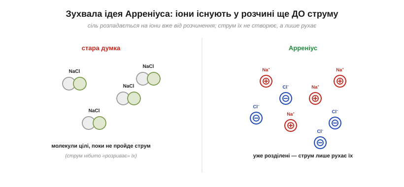
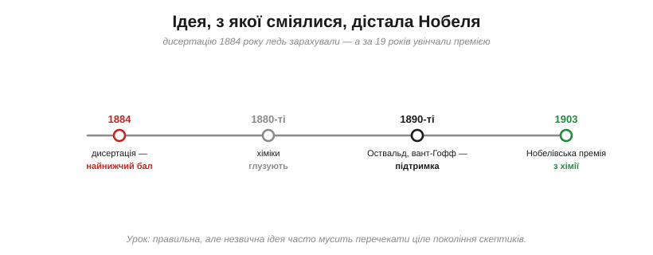
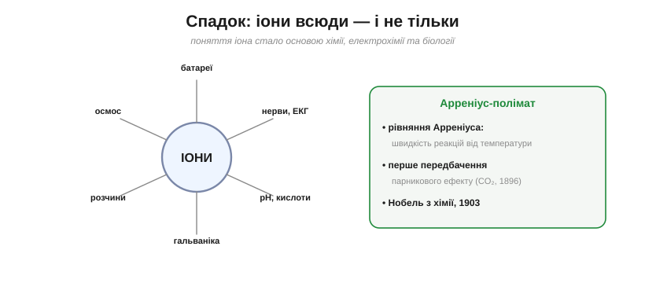

# 📜 Арреніус та іони: теорія, з якої спершу сміялися

> Сіль у воді розпадається на [іони, і вони несуть струм](topic:ph-electromagnetism/ionic-conduction) — сьогодні це азбука. Та колись ця думка здавалася настільки божевільною, що її автор за неї ледь не провалив захист дисертації — а через дев'ятнадцять років отримав Нобелівську премію. Це історія про те, як **очевидне сьогодні** колись було скандальною єрессю.

Ось загадка, яку іони розв'язують одним реченням. Чиста вода струму майже не проводить, а солона — добре. Що ж у солоній воді переносить заряд? Відповідь — **іони**. Але звідки вони беруться і чому це було так важко прийняти?

---

## Що насправді тече в розчині

До 1880-х панувала, здавалося б, природна картина. Так, через розчин солі струм іде. Так, на електродах щось виділяється. Та вважали, що молекули солі плавають у воді **цілими**, а на іони (заряджені шматочки) їх **розриває сам струм** — тобто іони народжуються лише тоді, коли тече струм, і живуть мить, поки не дійдуть до електрода. Картина «струм рве молекули» здавалася логічною: немає струму — немає й заряджених частинок.

І тут молодий швед **Сванте Арреніус** (*Svante Arrhenius*, 1859–1927) висунув ідею, що перевертала все з ніг на голову. Арреніус був вундеркіндом — кажуть, навчився читати самотужки в три роки й рано виявив рідкісний хист до математики й фізики. Саме **фізичний, кількісний** погляд на хімію (тоді ще незвичний) і дав йому сміливість піти проти течії: він дивився на розчин не як хімік-описувач, а як фізик, що шукає числа за явищем.

*Стара думка (ліворуч): молекули солі у воді цілі, і лише струм їх «розриває». Арреніус (праворуч): сіль розпадається на іони **вже від самого розчинення** — задовго до будь-якого струму. Струм їх не створює, а тільки **рухає** ті, що вже є.*

Арреніус стверджував: розчиняючись, сіль **сама собою** розпадається на заряджені іони — і вони плавають у воді **постійно**, незалежно від того, тече струм чи ні. Коли ж прикладають напругу, струм не «розриває молекули», а просто **підхоплює готові іони** й жене їх до електродів. Різниця тонка, та принципова: іони — це **причина** провідності, а не її наслідок.

---

## Чому в це було так важко повірити

Сучасникам ідея здавалася абсурдною з двох причин. По-перше, **звідки б узялися вільні заряджені частинки** в спокійній склянці води, без жодного зовнішнього втручання? Це порушувало інтуїцію про нейтральність речовини.

По-друге — і це найяскравіше — **іон геть не схожий на атом, з якого походить**. Металевий натрій кидається у воду з вибухом; хлор — отруйний зелений газ. А Арреніус каже, що в нешкідливій підсоленій воді спокійнісінько плавають «натрій» і «хлор»? Як таке може бути мирним і стабільним? Розгадка (що **іон** Na⁺ — це зовсім не те, що атом натрію: він віддав електрон і має геть інші властивості) була для тодішніх хіміків надто радикальною. Заряджений атом, що живе сам по собі, суперечив усьому, чого їх учили.

Додавало скепсису й те, що сам **механізм** — чому молекула раптом розпадається у воді — Арреніус пояснити до кінця не міг (це згодом зробить інша фізика, врахувавши, як полярні молекули води «розтягують» іонну сполуку). Він стверджував **факт** дисоціації, не маючи повної її причини, — а теорію, що дає факт без механізму, прийняти ще важче.

> 🔧 **Навіщо це.** Ця відмінність «атом ≠ іон» — фундамент усієї електрохімії й те, чим ви користуєтеся, не задумуючись: у солі натрій безпечний саме тому, що він там **іон** (Na⁺), а не металевий атом. Заряд міняє хімію докорінно. Тому-то акумулятори, гальваніка, навіть смак солоного — це поведінка **іонів**, а не вихідних елементів.

---

## Як зустріли цю теорію: найнижчий бал

Холодно. Дуже холодно. 1884 року Арреніус подав свою теорію як **докторську дисертацію** в Уппсальському університеті. Екзаменаційна комісія була розгублена й не вражена: робота дістала чи не **найнижчу прохідну оцінку** (*non sine laude*) — фактично «ледь зараховано». Для блискучої згодом теорії це був принизливий старт; кар'єра викладача була під загрозою.

*Дисертацію 1884 року ледь зарахували, а хіміки роками глузували з «вільних іонів». Та поступово, за підтримки Оствальда й вант-Гоффа, теорія перемогла — і 1903 року Арреніус дістав Нобелівську премію з хімії. Дев'ятнадцять років від ганьби до тріумфу.*

Та Арреніус не здавався — і, на щастя, його ідею побачили далекоглядніші. Він розіслав роботу провідним ученим Європи, і двоє з них стали її палкими захисниками: німець **Вільгельм Оствальд** (*Wilhelm Ostwald*) і голландець **Якоб вант-Гофф** (*Jacobus van't Hoff*). Утрьох вони, по суті, заснували нову науку — **фізичну хімію**.

Підтримка Оствальда була майже драматичною: прочитавши роботу, він був такий вражений, що сам приїхав до Швеції познайомитися з нікому не відомим автором і запропонував йому місце — це відразу додало теорії ваги. Та боротьба попереду була довга. Прибічників нової ідеї глузливо прозвали **«іоністами»** (*Ionians*), і добрих півтора десятиліття вони вели справжню наукову війну зі старою школою, що вважала вільні іони чистою фантазією. Перемогли не криком, а тим, що їхня теорія раз за разом **працювала** там, де стара пасувала.

---

## Що ж переконало скептиків

Ідея перемогла не наполегливістю, а **доказами** — бо пояснювала те, чого інакше пояснити не вдавалося.

По-перше, **провідність**. Якщо іони вже є в розчині, стає зрозуміло, чому провідність залежить від концентрації солі й чому слабкі кислоти проводять гірше за сильні (вони менше дисоціюють). Усе сходилося. Ба більше, теорія дала **число** — ступінь дисоціації: сильні електроліти (NaCl, соляна кислота) розпадаються майже повністю, слабкі (оцтова кислота) — лише частково, і саме тому останні і проводять гірше, і є слабшими кислотами. Уперше «силу» кислоти вдалося пов'язати з конкретною часткою молекул, що розпалися.

По-друге — і це був ефектний козир — **поведінка розчинів**, нібито геть не пов'язана зі струмом. Солона вода замерзає за нижчої температури, ніж чиста, і кипить за вищої. Величина цього зсуву залежить від **кількості розчинених частинок**. І ось диво: розчин солі поводився так, ніби частинок у ньому **вдвічі більше**, ніж молекул, які кинули у воду. Чому вдвічі? Бо кожна молекула NaCl розпалася на **дві** частинки — Na⁺ і Cl⁻! Вант-Гофф навіть увів для цього спеціальний множник — коефіцієнт *i*, що показував, на скільки частинок розпадається молекула (для NaCl i ≈ 2, а для речовин, що дають три іони, ≈ 3). Те, що зовсім інший дослід (замерзання) незалежно підтверджував це «подвоєння» частинок, було сильним доказом дисоціації. Коли до однієї відповіді ведуть незалежні дороги — як це було і з [законом Кулона](topic:ph-electromagnetism/coulomb-law) — віри їй незрівнянно більше.

Поступово опір танув. А 1903 року, через дев'ятнадцять років після того ледь-зарахованого захисту, Сванте Арреніус отримав **Нобелівську премію з хімії** — саме за теорію електролітичної дисоціації. Найнижчий бал обернувся найвищою нагородою.

---

## Куди сягнули іони

Поняття іона, що його Арреніус відстояв, виявилося одним із найплідніших у науці — воно вийшло далеко за межі провідності розчинів.

*Іони стали основою хімії, електрохімії та біології: батареї й гальваніка, кислотність (pH — це концентрація іонів H⁺), осмос, і — найдивовижніше — **нервові сигнали**, що є потоками іонів. А сам Арреніус виявився поліматом: його ім'я носить рівняння швидкості реакцій, і він же першим передбачив парниковий ефект.*

- **Уся електрохімія** — батареї, акумулятори, паливні елементи, гальваніка, корозія — це мова іонів. Кожна банка живлення у вашому пристрої працює на іонах, що повзуть крізь електроліт.
- **Кислоти й луги, pH** — кислотність визначають через концентрацію іонів водню (H⁺); шкала pH — це прямий нащадок ідей Арреніуса.
- **Біологія й медицина.** І ось найкрасивіше замикання кола: **нервові й м'язові сигнали в живому тілі — це потоки іонів** (натрію, калію, кальцію) крізь мембрани клітин. Тобто [«тваринна електрика», за яку колись бився Гальвані](topic:hw-sensing/volt/hist-volta.md), виявилася **іонною** — і зрозуміти її дала саме теорія Арреніуса. ЕКГ, ЕЕГ, робота серця й мозку — усе це іони в дії.

На фундаменті іонної теорії виросла ціла будівля: **рівняння Нернста**, що зв'язує напругу електрода з концентрацією іонів; саме поняття **pH** (запровадив Сьоренсен); уся сучасна аналітична електрохімія. Те, що починалося як зухвала здогадка про склянку солоної води, стало щоденним інструментом хіміків та інженерів у всьому світі.

> 🔧 **Навіщо це.** За твердженням «тіло проводить іонами» стоїть пряма лінія від Арреніуса. Те, що нервова система — електрохімічна, а кожен ваш рух і думка є іонними струмами, — практичне підґрунтя і медичної електроніки (кардіостимулятори, ЕКГ-давачі), і [обачності з електрикою](topic:hw-power/current-safety). Іони — місток між «залізом» і «життям».

---

## Бонус: людина, що передбачила глобальне потепління

Наостанок — про самого Арреніуса, бо він був постаттю рідкісної широти. Його ім'я ви могли зустрічати в зовсім іншому контексті: **рівняння Арреніуса** описує, як **швидкість хімічних реакцій зростає з температурою** — і це той самий дух, що й [температурні залежності провідності](topic:ph-condensed/conductivity) (нагрів пришвидшує процеси).

А ще 1896 року Арреніус, рахуючи вплив вуглекислого газу на тепловий баланс Землі, **першим дав кількісне передбачення**: подвоєння CO₂ в атмосфері помітно підніме температуру планети. Він описав те, що ми тепер звемо **парниковим ефектом** і глобальним потеплінням, — за сто з гаком років до того, як це стало світовою турботою. Людина, чию ідею про іони висміяли, виявилася ще й пророком клімату.

Молодий учений побачив у склянці солоної води те, чого не бачили інші, — **готові іони**, — і відстояв це попри глузування й найнижчий бал. Сьогодні без іонів не обходяться ні хімія, ні батареї, ні медицина, ні саме розуміння того, чому небезпечно братися за дроти мокрими руками. А головний урок універсальний: **правильна, та незвична ідея часто мусить перечекати ціле покоління скептиків** — і лише потім стає очевидністю, яку діти вчать як належне.
