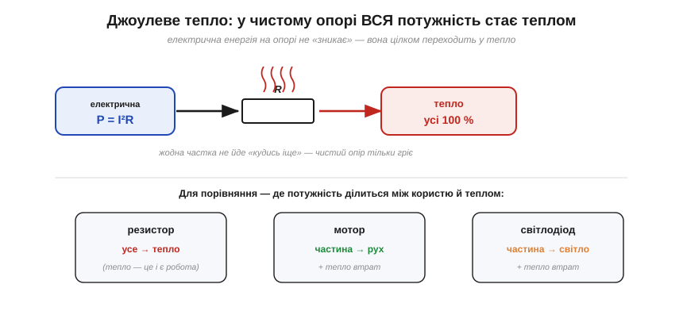
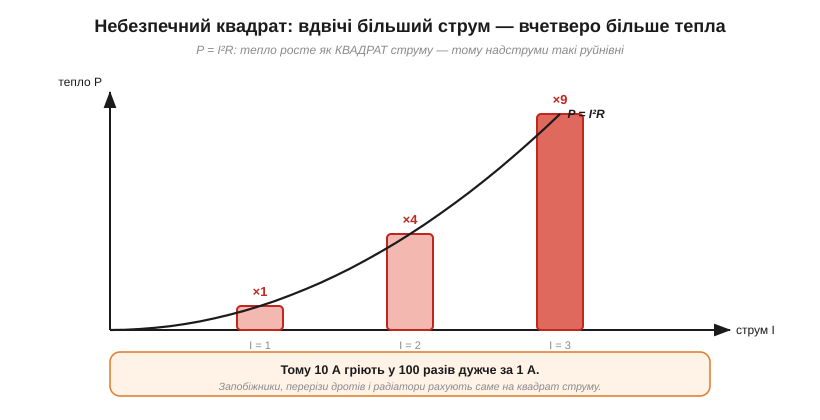
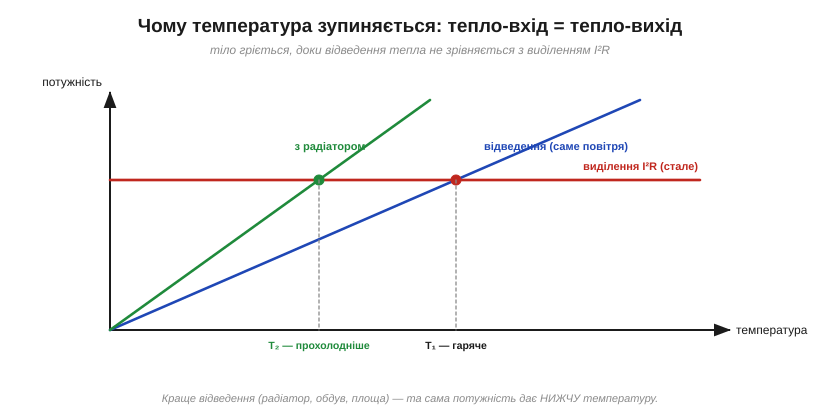
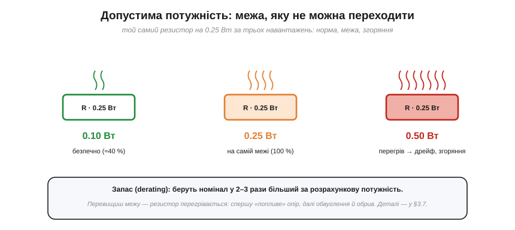
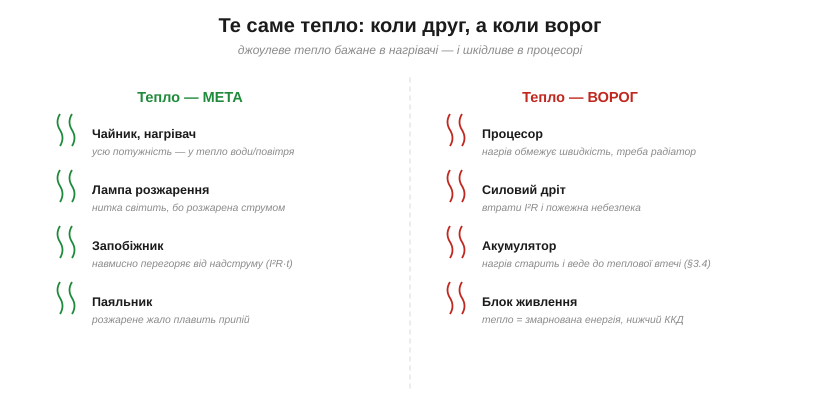

# Джоулеве тепло: чому й скільки гріється

Будь-який резистор під струмом гріється. За цим стоїть проста причина — [зіткнення електронів із решіткою](topic:ph-condensed/resistance-origin) — і проста формула для [електричної потужності](topic:ph-electromagnetism/electric-power) (P = I²R). Лишається звести це в інженерну відповідь: **скільки** саме виділяється тепла, **куди** воно дівається і **де межа**, за якою деталь гине. Це і є джоулеве тепло — те, заради чого існують радіатори, запобіжники й паспортна «допустима потужність».

### Чому гріється: вся потужність опору → тепло

Найважливіший факт тут такий. У **чистому опорі** вся підведена електрична потужність перетворюється на **тепло** — на всі сто відсотків. Нічого іншого резистор із енергією зробити не вміє: він не крутить вал, не світить (помітно), не запасає заряд. Електрони розганяються полем і б'ються об решітку, віддаючи їй енергію, а та проявляється як **нагрів**.


*У чистому опорі вся підведена потужність P = I²R перетворюється на тепло — на сто відсотків. На відміну від мотора (частина енергії стає рухом) чи світлодіода (частина — світлом), резистор не має «корисного виходу», крім самого тепла.*

Це прямо випливає зі збереження енергії: скільки електричної потужності зайшло в опір, стільки теплової з нього й вийшло. Тому для резистора слова «спожита потужність» і «виділене тепло» — те саме число. У мотора чи світлодіода частина потужності йде на **корисний вихід** (рух, світло), і лише решта гріє; у резистора корисного виходу нема — тепло і є його єдиний «продукт».

Власне, **опір** — це і є та властивість матеріалу, що перетворює електричну енергію на теплову. Звідси симетрія: усе, що має опір, від струму гріється, а все, що від струму гріється, має опір. Тому джоулеве тепло **невідступне** — його не можна «вимкнути», лишивши струм; можна лише зменшити (меншим струмом чи опором) або краще відвести. («Чистий опір» — то, звісно, ідеалізація, але для звичайного резистора на постійному чи повільному струмі вона працює чудово: паразитні ємність та індуктивність тут мізерні.)

### Скільки тепла: закон Джоуля Q = I²R·t

Потужність P = I²R — це тепло **за секунду**. Щоб дістати всю виділену **енергію** за час t, множимо на час — і отримуємо **закон Джоуля** (той самий, що Джеймс Прескотт Джоуль (*James Prescott Joule*) виміряв 1841 року):

Q = I²·R·t  (джоулів тепла за час t).


*Тепло залежить від квадрата струму: при струмі 1, 2, 3 (у відносних одиницях) потужність відноситься як 1 : 4 : 9. Подвоїш струм — учетверо більше тепла. Саме цей квадрат робить надструми такими руйнівними.*

Найважливіше тут — **квадрат струму**. Удвічі більший струм дає вчетверо більше тепла; уп'ятеро більший — у двадцять п'ять разів. Тому надструми (коротке замикання, перевантаження) такі небезпечні: тепло злітає лавиною. І тому ж енергію вигідно передавати малим струмом високої напруги — у лінії втрати теж ідуть за I²R, і саме на цьому колись зійшлися [постійний і змінний струм](topic:ph-electromagnetism/dc-vs-ac) у «війні струмів».

**Приклад. Скільки тепла дасть резистор 100 Ω при струмі 0.2 А за 5 хвилин?**

```
Потужність:  P = I²·R  = 0.2² × 100   = 4 Вт
Час:         t = 5 хв   = 300 с
Тепло:       Q = P · t  = 4 × 300      = 1200 Дж
```

А ось приклад, де тепло — бажане. Електрочайник на 2000 Вт за 5 хвилин виділяє Q = 2000 × 300 = 600 000 Дж, тобто 600 кДж — приблизно стільки й треба, щоб закип'ятити літр-півтора води. Формула та сама, Q = P·t, і джоуль той самий; різниця лише в тому, що тут роль «резистора» грає товста ніхромова спіраль, спеціально розрахована на тисячі ватів, а нагрів — мета, а не біда.

Зверніть увагу: 4 Вт — це **багато** для звичайного сигнального резистора (типовий розрахований на 0.25 Вт). Такий струм спалив би його; для цього потрібен потужний (силовий) резистор. Звідки ж береться ця межа?

### Куди йде тепло й усталена температура

Тепло виділяється всередині деталі, а **відводиться** з її поверхні — у повітря, у плату, у радіатор. Поки виділяється більше, ніж відводиться, деталь **нагрівається**. Але що гарячіша вона стає, то швидше віддає тепло назовні (відведення росте з різницею температур). Тому процес не нескінченний: тіло гріється, доки **відведення не зрівняється з виділенням**, — і застигає на **усталеній температурі**.


*Виділення I²R стале (червона лінія), а відведення тепла росте з температурою (сині/зелені лінії). Де вони перетинаються — там температура й застигає. Краще відведення (радіатор) — нижча усталена температура при тій самій потужності.*

Звідси й уся наука охолодження. Та сама потужність може лишити деталь ледь теплою або розжарити її — усе залежить від того, **як добре вона скидає тепло**. Збільшити відведення можна площею (більший корпус), **радіатором** (ребриста металева насадка), обдувом (вентилятор), тепловідвідними доріжками на платі. Інженери описують це [тепловим опором](topic:ph-thermodynamics/thermal-resistance) (наскільки нагріється деталь на кожен ват) — але для початку досить ідеї: **потужність задає нагрів, відведення — кінцеву температуру**.

Є ще час. Усталеної температури деталь набирає **не миттєво**: спершу майже все тепло йде на її власний прогрів, і лише потім встановлюється рівновага вхід-вихід. Маленький резистор прогрівається за секунди, масивний радіатор — за хвилини. Через цю **теплову інерцію** коротке перевантаження деталь часто переживає, а таке саме, але тривале — вже ні: важлива не лише потужність, а й **як довго** вона діє. Тому в паспортах нерідко окремо вказують тривалу й короткочасну (імпульсну) потужність.

### Допустима потужність: межа компонента

Кожен компонент має **допустиму (номінальну) потужність** (*power rating*) — скільки ватів він може безпечно розсіювати, не перегріваючись. Резистори бувають на 0.125, 0.25, 0.5, 1, 2 Вт і більше; що більший корпус — то більше тепла він стерпить. Перевищиш межу — і температура виходить за безпечну: спершу опір «пливе» (дрейф номіналу), потім лак темніє, а далі обвуглення й **обрив**.


*Той самий резистор на 0.25 Вт за трьох навантажень: при 0.1 Вт холодний і щасливий, при 0.25 Вт — на самій межі, при 0.5 Вт перегрівається: опір «пливе», далі обвуглення й обрив. Тому беруть запас.*

Ще тонкість: паспортна потужність указана для певних умов — зазвичай для вільного повітря за кімнатної температури. У тісному гарячому корпусі, упритул до інших деталей чи за високої температури довкілля та сама деталь стерпить **менше**. Це теж derating, тільки **за температурою**: що гарячіше й тісніше навколо, то більший запас слід закладати.

> 🔧 **Навіщо це.** Добираючи резистор, рахують його потужність (P = I²R чи V²/R) і беруть номінал **із запасом** — зазвичай у 2–3 рази більший за розрахунковий. Це **derating** (робота з запасом): деталь на межі живе недовго й гріє все навколо. Правило просте: спершу порахуй, **скільки ватів** розсіє елемент, і лише потім обирай його «розмір». Забути про потужність — класична причина, чому схема «за законом Ома правильна», а на столі димить. Докладніше про те, як добирають [резистор](topic:hw-components/resistor) за номіналом і потужністю, — у його власній статті.

### Коли тепло — друг, а коли — ворог

Джоулеве тепло саме по собі не «погане» й не «добре» — усе залежить від того, чи воно **мета**, чи **побічна втрата**.


*Те саме джоулеве тепло буває бажаним (чайник, лампа розжарення, запобіжник, паяльник) і шкідливим (процесор, силовий дріт, акумулятор, блок живлення). Різниця лише в тому, чи тепло — мета, чи побічна втрата.*

Там, де тепло — **мета**, його роблять навмисне: чайник, праска, обігрівач, паяльник, нитка лампи розжарення. Окремий гарний приклад — **запобіжник**: це шматочок дроту, навмисне розрахований так, щоб за надструму джоулеве тепло I²R·t його **розплавило** й розірвало коло раніше, ніж згорить щось дорожче. Тут руйнівний квадрат струму працює нам на користь.

А там, де тепло — **ворог**, із ним воюють: процесор треба охолоджувати, бо нагрів обмежує швидкість; силовий дріт гріється втратами й може спричинити пожежу; акумулятор від нагріву старіє й ризикує [тепловою втечею](topic:ph-condensed/resistance-temperature); у блоці живлення кожен ват тепла — це змарнована енергія й нижчий ККД. Тут уся інженерія — про те, як тепла виділити **менше** (більший переріз, менший струм) і відвести **краще** (радіатори, обдув).

Іноді той самий прилад показує обидва обличчя тепла. Лампа розжарення мала б **світити**, та насправді близько 95 % її потужності йде в **тепло** й лише якісь 5 % — у світло (тому вона й гаряча). Саме ця марнотратність її й поховала: світлодіод дає те саме світло за 8–10 Вт замість 60, бо гріється куди менше. Тепло, яке для нагрівача — жадана мета, для лампи виявилося ганебною втратою. Та сама фізика, протилежний присуд — усе вирішує, чого ми від приладу хотіли.

---

Коротко про головне: у чистому опорі **вся** потужність стає теплом; його кількість — за законом Джоуля **Q = I²R·t**, із грізним **квадратом струму**. Тіло гріється, доки відведення не зрівняється з виділенням, — звідси **усталена температура** й уся наука радіаторів. Кожен компонент має **допустиму потужність**, яку добирають із запасом (derating). А саме тепло буває і метою (нагрівачі, запобіжники), і ворогом (процесори, дроти) — та сама фізика, а присуд залежить лише від того, чи тепло нам потрібне.

---
