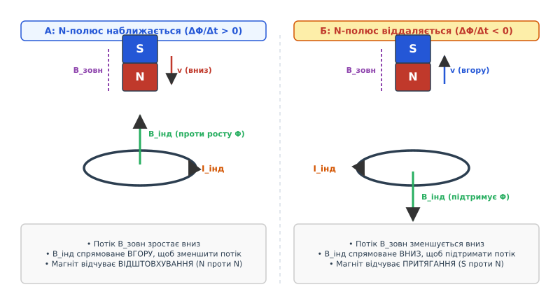
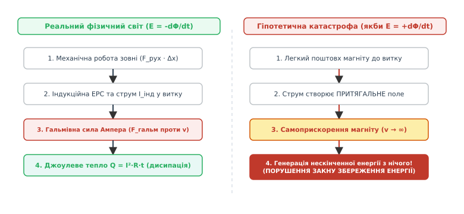
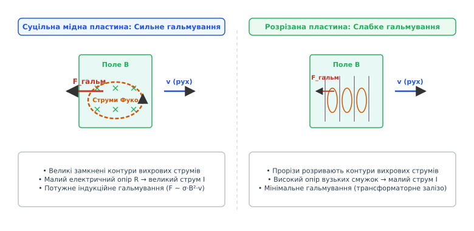

# Правило Ленца

<preknowlist>
- [Електромагнітна індукція](root:ph-electromagnetism/electromagnetic-induction) — явище виникнення ЕРС у контурі при зміні магнітного потоку.
- [Магнітний потік](root:ph-electromagnetism/magnetic-flux) — скалярний добуток індукції магнітного поля на площу контуру та косинус кута.
- [Закон збереження енергії](root:ph-mechanics/energy-conservation) — фундаментальний принцип збереження й перетворення енергії в закритій системі.
- [Сила Лоренца](root:ph-electromagnetism/lorentz-force) — сила, з якою електромагнітне поле діє на рухомий електричний заряд.
- [Сила Ампера](root:ph-electromagnetism/ampere-force) — сила протидії, яка діє на провідник зі струмом у магнітному полі.
- [Рівняння Максвелла](root:ph-electromagnetism/maxwell-equations) — фундаментальна система рівнянь класичної електродинаміки.
</preknowlist>

Якщо кинути потужний неодимовий магніт усередину вертикальної мідної або алюмінієвої труби, він не впаде під дією гравітації з прискоренням вільного падіння `g = 9.81 м/с²`, як це зробив би звичайний пластиковий чи дерев'яний брусок. Замість стрімкого падіння магніт ніби зависає у повітрі й повільно, плавно спускається донизу з постійною граничною швидкістю, ніби він занурений у дуже густу й в'язку рідину. При цьому мідь є діамагнетиком і за відсутності руху взагалі не притягує магніт статично. Проте сам рух магніту викликає у мідних стінках труби вихрові індукційні струми. Ці струми утворюють власне магнітне поле, яке спрямоване точно проти магнітного поля падаючого магніту й виштовхує його вгору.

Цей ефект описується **правилом Ленца** (нім. *Heinrich Friedrich Emil Lenz*, 1833): індукований електричний струм завжди має такий напрямок, що його власне магнітне поле протидіє зміні зовнішнього магнітного потоку, яка викликала цей струм.

Правило Ленца визначає знак «мінус» у законі електромагнітної індукції Фарадея і є прямим проявом закону збереження енергії у принципах електродинаміки.

---

## 1. Фізичний механізм протидії зміні магнітного потоку

Щоб у провідному контурі виник індукований струм, не обов'язково рухати сам провідник чи магніт. Достатньо будь-якої зміни магнітного потоку `Φ`, що пронизує замкнений провідний контур. Магнітний потік `Φ` обчислюється через поверхневий інтеграл вектора магнітної індукції `B` по площі контуру `S`:

```
Φ = ∫ B · n dA = B · S · cos(α)
```

де:
- `B` — індукція зовнішнього магнітного поля, Тл;
- `S` — площа замкненого контуру, м²;
- `α` — кут між вектором магнітного поля `B` та нормаллю до площини контуру `n`.

Зміна потоку `dΦ/dt` може бути викликана трьома незалежними фізичними причинами:
1. Зміною величини самого зовнішнього магнітного поля зі часом (`dB/dt ≠ 0`), наприклад при включенні або вимкненні струму в електромагніті;
2. Зміною площі контуру, що перебуває в магнітному полі (`dS/dt ≠ 0`), наприклад при розсуванні чи деформації дротяного кільця;
3. Зміною орієнтації або кута обертання контуру у постійному полі (`dα/dt ≠ 0`), як це відбувається у роторах генераторів змінного струму.

Реакція електромагнітної системи на будь-яку з цих змін підпорядковується суворому алгоритмічному закону протидії.


*Напрямок індукованого магнітного поля `B_інд` при наближенні (А) та віддаленні (Б) постійного магніту від замкненого провідного кільця.*

### Алгоритм визначення напрямку індукованого струму

Щоб знайти напрямок індукованого струму в довільному провідному контурі, застосовують трипокрокову процедуру:

1. **Визначити напрямок зовнішнього поля `B_зовн` та знак зміни потоку `ΔΦ`**:
   - Якщо потік зростає (`ΔΦ/Δt > 0`), вектор приросту поля `ΔB` збігається за напрямком із `B_зовн`.
   - Якщо потік спадає (`ΔΦ/Δt < 0`), вектор приросту поля `ΔB` спрямований протилежно до `B_зовн`.

2. **Застосувати правило Ленца для визначення вектора `B_інд`**:
   - Індуковане магнітне поле `B_інд` повинно протидіяти зміні `ΔΦ`.
   - При зростанні потоку (`ΔΦ > 0`) поле `B_інд` спрямоване **протилежно** до `B_зовн` (`B_інд ↑↓ B_зовн`), щоб послабити зростаюче поле.
   - При спаданні потоку (`ΔΦ < 0`) поле `B_інд` спрямоване **вбік** `B_зовн` (`B_інд ↑↑ B_зовн`), щоб підтримати спадаюче поле.

3. **Застосувати правило правої руки для визначення струму `I_інд`**:
   - Якщо спрямувати великий палець правої руки вздовж вектора індукованого поля `B_інд`, то чотири зігнуті пальці вкажуть напрямок протікання індукованого струму `I_інд` по контуру.

---

## 2. Пояснення досліду з магнітом і мідною трубою

Розглянемо детальніше фізику досліду з падінням магніту у мідній трубі. Мідну трубу можна уявити як стопку з величезної кількості щільно прилеглих провідних кілець.

Коли північний pole (`N`) магніту опускається вниз і наближається до чергового кільця труби, розташованого нижче магніту:
- Магнітний потік, спрямований вниз, через це нижнє кільце швидко **зростає** (`dΦ/dt > 0`).
- За правилом Ленца у нижньому кільці виникає індукований струм такого напрямку, що створює власне магнітне поле `B_інд`, спрямоване **вгору**.
- Верхній торець цього нижнього кільця стає північним полюсом (`N`). Двома північними полюсами магніт і кільце відштовхуються. Виникає сила магнітного відштовхування `F_rep`, спрямована вгору.

Одночасно над магнітом відбувається протилежний процес. Від верхнього кільця, розташованого вище магніту, його південний pole (`S`) віддаляється:
- Магнітний потік через верхнє кільце **зменшується** (`dΦ/dt < 0`).
- За правилом Ленца у верхньому кільці виникає струм, магнітне поле якого спрямоване **вниз**, щоб підтримати спадаючий потік.
- Нижній торець верхнього кільця стає північним полюсом (`N`), який притягує віддалений південний pole (`S`) магніту. Виникає сила магнітного притягання `F_att`, також спрямована вгору!

Сумарна електродинамічна сила `F_brake = F_rep + F_att` спрямована строго вертикально вгору, проти вектора швидкості падіння `v`.

Рівняння руху магніту масою `m` у трубі має вигляд:

```
m · (dv/dt) = m · g - C_pipe · (B² · σ · d / R_pipe) · v
```

Коли швидкість падіння досягає значення, при якому сила магнітного гальмування рівняється з силою тяжіння (`F_brake = m · g`), прискорення стає нульовим (`dv/dt = 0`), і магніт продовжує падіння з постійною граничною швидкістю `v_term`:

```
v_term = (m · g · R_pipe) / (C_pipe · B² · σ · d)
```

Цей дослід наочно показує, що протидія Ленца виникає не через механічний контакт, а через взаємодію індукованих полів.

---

## 3. Правило Ленца як прямий наслідок закону збереження енергії

Чому в математичному формулюванні закону Фарадея стоїть саме знак «мінус»?

```
E_i = - dΦ/dt      [закон Фарадея — Ленца]
```

Знак «мінус» — це фундаментальна межа, яка відокремлює фізично стабільний Всесвіт від гіпотетичного світу з можливістю створення нескінченної енергії з нічого (перпетуум-мобіле першого роду).


*Порівняння реального фізичного процесу зі знаком мінус (ліворуч) та гіпотетичної енергетичної катастрофи при знаку плюс (праворуч).*

### Мисленнєвий експеримент: Що було б при знаку «плюс»?

Уявімо гіпотетичний Всесвіт, у якому закон індукції мав би додатний знак: `E_i = + dΦ/dt`.

1. Ви підносите північний pole (`N`) постійного магніту до мідного кільця.
2. Магнітний потік через кільце зростає. При `E_i = + dΦ/dt` у кільці виникає струм такого напрямку, що утворює на ближчому боці кільця південний pole (`S`).
3. Протилежні полюси (`N` і `S`) притягуються! Індуковане поле не відштовхує магніт, а **притягує** його до кільця.
4. Магніт починає прискорюватися вбік кільця під дією сили притягання без жодного зовнішнього штовхання.
5. Зі зростанням швидкості магніту швидкість зміни потоку `dΦ/dt` зростає ще швидше.
6. Це викликає ще сильніший струм у кільці, що генерує ще більшу силу притягання.
7. Магніт влітає у кільце з нескінченним прискоренням, а в контурі виділяється нескінченна кількість електричної та теплової енергії від найменшого початкового торкання.

Ця схема показує лавинний процес із додатним зворотним зв'язком. Звідки береться кінетична енергія магніту та тепловий нагрів дроту? З нічого — це було б катастрофічним порушенням першого начала термодинаміки.

У реальному Всесвіті знак «мінус» створює **від'ємний зворотний зв'язок**. При наближенні `N`-полюса магніту на ближчому торці кільця виникає одноіменний `N`-полюс. Два північних полюси відштовхуються. Щоб просувати магніт убік кільця, зовнішня сила повинна долати цю силу відштовхування і виконувати додатну механічну роботу `W_мех = F_зовн · Δx`.

Саме ця виконана механічна робота перетворюється на електричну енергію струму та виділяється у вигляді джоулевого тепла `Q = I² · R · t` на опорі контуру:

```
W_мех = W_електр = Q_джоуль
```

Більше про кількісний математичний доказ тотожності рості та тепла дивіться у вставці [🧮 Математичний вивід та збереження енергії](root:ph-electromagnetism/lenz-law/math-lenz-law.md).

---

## 4. Мікроскопічна картина: сила Лоренца та сила Ампера

Правило Ленца на макрорівні описує взаємодію потоків і полів, але на мікроскопічному рівні носіями струму є вільні електрони провідника. Простежимо, як з поодиноких електронних сил формується макроскопічна протидія Ленца.

Розглянемо прямокутний провідний контур, який витягують зі швидкістю `v` праворуч з зони однорідного магнітного поля `B`, спрямованого від нас у дошку.

```
       Поле B (від нас)               Поле відсутнє
   +-----------------------+      +-------------------+
   |  x   x   x   x   x    |      |                   |
   |                       |  I   |                   |
   |  x   x   x   [e-]---->|------|---> v (рух)       |
   |               | F_L   |      |                   |
   |  x   x   x    v  x    |      |                   |
   +-----------------------+      +-------------------+
                     |
                     v F_Ампера (ліворуч, проти v)
```

1. **Дія сили Лоренца на вільні носії**:
   Коли провідник рухається праворуч зі швидкістю `v`, кожний вільний електрон `-e` у вертикальній стороні рамки рухається разом із провідником. На рухомий заряд у магнітному полі діє сила Лоренца:
   
   ```
   F_L = - e · (v × B)
   ```
   
   За правилом лівої руки для негативного заряду сила Лоренца спрямована **вниз** вздовж вертикального провідника. Це зміщує електрони вниз, створюючи вільний струм `I`, напрямлений **вгору** по лівій стороні рамки.

2. **Виникнення макроскопічної гальмівної сили Ампера**:
   Тепер по вертикальному провіднику довжиною `L` протікає індукований струм `I` у магнітному полі `B`. На провідник зі струмом діє сила Ампера:
   
   ```
   F_A = I · (L × B)
   ```
   
   Векторний добуток вектора струму (напрямленого вгору) на вектор магнітного поля (напрямленого від нас) дає вектор сили Ампера `F_A`, спрямований **ліворуч** — тобто строго проти вектора швидкості руху рамки `v`!

Таким чином, сила Лоренца на мікрорівні змушує електрони рухатися вздовж дроту, а створений ними струм через силу Ампера на макрорівні гальмує сам рамковий провідник. Повна узгодженість мікро- та макроопису є математичною красою класичної електродинаміки.

---

## 5. Вихрові струми (струми Фуко) та індукційне гальмування

Якщо замість тонкого дротяного контуру взяти суцільний масивний провідник (мідну чи алюмінієву пластину, сталевий рейковий брус або суцільний ротор) і переміщувати його в магнітному полі, індуковані струми замкнуться у товщі металу у вигляді вихрових замкнених контурів. Ці струми називають **вихровими струмами** або **струмами Фуко** (на честь французького фізика Леона Фуко, фр. *Léon Foucault*).


*Вихрові струми у суцільній мідній пластині створюють потужну гальмівну силу Ленца (ліворуч). Нарізання пластини на поздовжні смуги розриває контури струмів і різко зменшує гальмування (праворуч).*

### Гальмування та боротьба з вихровими втратами

Питомий опір суцільного шматка міді чи алюмінію є надзвичайно малим (`ρ ~ 10⁻⁸ Ом·м`). Тому навіть при малих значеннях індукованої ЕРС у масивному провіднику виникають вихрові струми величезної сили (сотні й тисячі ампер).

Ці струми створюють протидію за правилом Ленца у двох формах:
- **Механічна протидія**: Вихрові струми взаємодіють із зовнішнім магнітним полем, створюючи силу електродинамічного гальмування `F_гальм ∝ σ · B² · v`.
- **Теплова дисипація**: Весь виділений струм перетворюється на джоулеве тепло у товщі провідника.

У багатьох електротехнічних пристроях (трансформаторах, електродвигунах, генераторах) нагрівання вихровими струмами є шкідливим фактором, який знижує коефіцієнт корисної дії та викликає перегрів сердечників. Для боротьби з цим явищем застосовують принцип шихтування:
- Залізний сердечник трансформатора роблять не суцільним, а збирають із тонких листів електротехнічної сталі, ізольованих один від одного шаром лаку або оксидної плівки.
- Прорізи та ізоляційні шари розташовують перпендикулярно до напрямку протікання вихрових струмів. Опір дрібних замкнених контурів зростає у сотні разів, що зменшує вихрові втрати тепла пропорційно квадрату товщини пластин `Q ∝ d²`.

Детальні інженерні параметри розрахунку вихрострумових гальм і таблиці матеріалів наведено у довіднику [📋 Параметри та розрахунок індукційного гальмування](root:ph-electromagnetism/lenz-law/api-induction-braking.md).

> 🔧 **Навіщо це.**
> Індукційне гальмування на основі правила Ленца використовується у швидкісних поїздах (TGV, Shinkansen, ICE), де звичайні механічні фрикційні колодки зношуються і плавляться за секунди. Вихрострумові рейкові гальма не мають механічного контакту з рейкою: електромагніти опускаються над рейкою на відстань 7 мм і створюють вихрові струми в голівці сталевої рейки. Поїзд гальмує без тертя, зносу та шуму. Аналогічно працюють безконтактні гальма у висотних атракціонах (вежах вільного падіння), де алюмінієві пластини на кабіні пролітають між неодимовими магнітами на вежі: гальмування відбувається абсолютно надійно й автоматично — навіть при повному знеструмленні об'єкта, оскільки закон Ленца не потребує зовнішнього живлення.

---

## 6. Практичні прояви та фундаментальні застосування

Правило Ленца проявляється практично в усіх галузях електротехніки та фізики конденсованого стану.

### 1. Проти-ЕРС в електродвигунах (Back-EMF)
Коли якір електродвигуна постійного струму обертається у магнітному полі статора, його обмотки перетинають силові лінії поля. За законом індукції у рухомих обмотках виникає індукована ЕРС, яка за правилом Ленца спрямована **протилежно** до зовнішньої напруги живлення `U_живлення`.

```
I_якоря = (U_живлення - E_проти) / R_якоря
```

При холостому ході двигуна проти-ЕРС `E_проти` майже дорівнює напрузі живлення `U_живлення`, і струм споживання `I_якоря` є мінімальним. Проте якщо механічно заклинити ротор (`v = 0 ==> E_проти = 0`), струм крізь обмотки зростає у десятки разів (пусковий струм або струм короткого замикання), що без захисного реле призводить до згорання двигуна.

### 2. Ефект Мейснера в надпровідниках
У 1933 році Вальтер Мейснер та Роберт Оксенфельд виявили, що при переході речовини у надпровідний стан зовнішнє магнітне поле повністю виштовхується з об'єму надпровідника (`B_всередині = 0`).

Ефект Мейснера можна розглядати як граничний випадок правила Ленца для середовища з нескінченною електропровідністю (`σ → ∞`, `R = 0`). Найменша спроба магнітного поля проникнути в надпровідник викликає незагасаючі поверхневі індукційні струми (струми скрінінгу), які створюють протидіюче магнітне поле, що **ідеально й повністю** компенсує зовнішнє поле. Це забезпечує ефект магнітної левітації (труна Магомета).

### 3. Самоіндукція та ЕРС розмикання
Закон Ленца працює і у випадку, коли джерелом магнітного поля є струм у тому ж самому контурі (самоіндукція). При спробі вимкнути струм у колі з великою індуктивністю (наприклад, у котушці з залізним сердечником) магнітний потік починає спадати (`dΦ/dt < 0`). За правилом Ленца ЕРС самоіндукції прагне підтримати струм, створюючи на контактах вимикача величезну напругу `U = - L · (dI/dt)`, яка пробиває повітряний проміжок з утворенням високовольтної дуги.

---

## 7. Межі застосовності та підводні камені

Правило Ленца є строго правильним у квазістаціонарному наближенні електродинаміки, але при переході до високих частот і релятивістських швидкостей виникають важливі фізичні обмеження.

### 1. Квазістаціонарне наближення та ефект запізнення
Правило Ленца у своїй класичній формі передбачає, що індуковане поле протидіє зміні потоку миттєво. Проте в електродинаміці зміни поля поширюються зі скінченною швидкістю — швидкістю світла `c`. Якщо розміри системи `L` сумірні з довжиною електромагнітної хвилі `λ = c / f`, необхідно враховувати запізнювальні потенціали. Індуковане поле досягає віддалених ділянок контуру із затримкою за часом `Δt = r / c`, що може зміщувати фазу протидії.

### 2. Реакція випромінювання (Radiation Reaction)
При екстремально швидких змінах струму частина індукованої енергії не витрачається на механічну гальмівну силу чи джоулеве тепло, а безповоротно випромінюється у простір у вигляді електромагнітних хвиль (радіаційне випромінювання). У цьому випадку гальмівна сила підпорядковується рівнянню Абрагама — Лоренца — Дірака і залежить від другої похідної швидкості по часу (ривка `d²v/dt²`).

Про деталі числової симуляції та програмного опису гальмування вихровими струмами читайте у розділі [⚙️ Симуляція вихрових струмів та гальмування](root:ph-electromagnetism/lenz-law/proj-eddy-current-sim.md), а історичні етапи виникнення правила дивіться у вставці [📜 Історія відкриття правила Ленца](root:ph-electromagnetism/lenz-law/hist-lenz-law.md).
