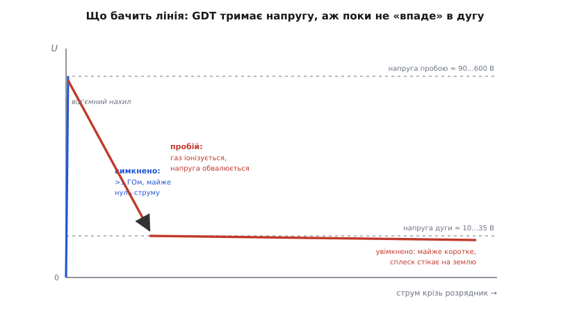
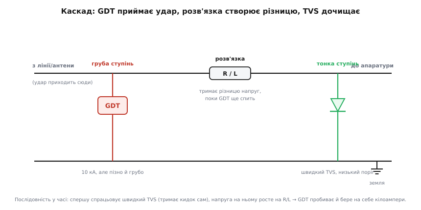

# 🔌 Іскровий проміжок і газорозрядна трубка (GDT): пробій газу як захист від кидка

> [Близький удар блискавки](topic:ph-electromagnetism/lightning) наводить у довгих дротах — лініях живлення, антенних кабелях, проводах давачів на щоглі — короткий кидок у сотні чи тисячі вольтів. Витримати його «в лоб» апаратура не може; її рятують тим, що кидок **перехоплюють і скидають на землю** ще до входу. Найгрубіший і найвитриваліший перехоплювач — той, що працює на тому самому **керованому пробої газу**, що й сама блискавка: **іскровий проміжок** (*spark gap*) та його культурна форма — **газорозрядна трубка** (*gas discharge tube, GDT*).

### Клас компонента

**Іскровий проміжок** — це просто два електроди з повітряним (чи газовим) проміжком між ними. У найпростішому вигляді — два загострені провідники чи дві доріжки на платі з вузьким зазором: поки напруга мала, проміжок не проводить; коли вона перевищує поріг пробою — між електродами проскакує іскра й коротить їх. **Газорозрядна трубка** — той самий принцип, замкнений у керамічний або скляний герметичний корпус, заповнений інертним газом (*неон, аргон* — суміш підбирають під потрібний поріг). Два (іноді три) електроди стоять у трубці один проти одного через малий зазор.

Різниця між «голим» проміжком і трубкою — не в принципі, а в **повторюваності**. У повітрі поріг пробою «плаває»: він залежить від вологості, тиску, пилу, окислення електродів, і відкрита іскра щоразу випалює метал, тож зазор з кожним спрацюванням повзе. Запаяний газ під сталим тиском дає **стабільний, повторюваний поріг** і захищає електроди від атмосфери — тому всюди, де треба передбачуваний захист, ставлять GDT, а не голий зазор.

### Чому пробій газу шунтує кидок на землю

Щоб зрозуміти, чому це працює, треба побачити, **що GDT робить із напругою**. У спокої газ — добрий ізолятор: вільних носіїв у ньому майже немає, тож трубка стоїть у колі як розрив з опором у понад гігаом і власною ємністю в частки пікофарада. Сигнал її просто не помічає.

Коли ж на трубку приходить кидок і напруга на ній перевищує **напругу пробою** (*sparkover voltage*), починається той самий процес, що й у [пробої повітря](topic:ph-electromagnetism/air-breakdown) перед ударом блискавки: поодинокі іони, що завжди є в газі, поле розганяє, вони вибивають нові — лавина наростає, газ стрімко **іонізується** й перетворюється з ізолятора на провідник. Ось ключова тонкість: щойно газ пробився, напруга на трубці не лишається високою, а **обвалюється** до дуже низької **напруги дуги** (*arc voltage*) — лише десятки вольтів. Трубка наче «падає» з ізолятора в майже коротке замикання.


*Поки напруга нижча за поріг, струму майже немає (ізолятор, понад гігаом). Щойно вона сягає напруги пробою (≈90…600 В), газ іонізується — і напруга **обвалюється** до напруги дуги (≈10…35 В): трубка стає майже коротким і відводить весь кидок на землю. Ділянка з падінням напруги при зростанні струму — це **від'ємний диференційний опір**, особливість усіх розрядників.*

Саме ця поведінка й рятує апаратуру. GDT увімкнена паралельно лінії: один електрод на «гарячий» провід, другий на землю. Поки все спокійно, вона нічого не робить. Коли приходить кидок, вона пробивається й своїм майже коротким замиканням **притискає напругу на лінії до десятків вольтів**, а весь струм кидка пускає повз апаратуру на землю. Такий захист звуть **закоротковим** (*crowbar* — буквально «брухт, кинутий на шини», щоб їх замкнути): пристрій не «підрізає» напругу плавно, а **рішуче коротить** лінію, щойно поріг перейдено.

Платою за рішучість є та сама низька напруга дуги. Звичайний обмежувач (як [варистор](topic:hw-power/snubbers-dvdt) чи TVS) тримає на лінії свою напругу обмеження й тим сам гасить струм, коли кидок минув. GDT після спрацювання тримає лише десятки вольтів — і якщо за нею стоїть джерело, здатне ці десятки вольтів **підтримувати** (мережа змінного струму, телефонна лінія з постійною напругою), дуга **не згасне сама** після кидка. Це і є головна вада класу — **струм підхоплення**.

### Струм підхоплення: чому GDT не можна ставити саму на мережу

**Струм підхоплення** (*follow current*, він же *follow-on current*) — це струм, який тече крізь уже іонізований газ **після того, як сам кидок минув**, підживлюваний робочою напругою кола. Механізм прямий: GDT спрацювала на грозовий імпульс, обвалила напругу до напруги дуги — але якщо в колі є, скажімо, мережеві 230 В, то для лінії GDT тепер виглядає як замкнений вимикач під цими 230 В. Газ лишається іонізованим, дуга горить далі вже **не від блискавки, а від мережі**, і трубка спокійно проводить мережевий струм, аж поки щось його не обірве.

Наслідки бувають руйнівні: трубка, розрахована на короткий грозовий імпульс у мікросекунди, опиняється під тривалим мережевим струмом — перегрівається й виходить з ладу, а в гіршому разі лишається замкненою накоротко, садячи живлення. Тому **GDT майже ніколи не ставлять саму прямо на мережу живлення**. Її або беруть із порогом, явно вищим за пік робочої напруги (щоб робоча напруга в принципі не могла підтримати дугу), або — частіше — **узгоджують з іншими елементами**, які після кидка змусять дугу згаснути:

```
Чому дуга гасне або горить далі:
  напруга дуги GDT ≈ 20 В
  робоча напруга кола 230 В (мережа)  →  230 В > 20 В  →  дуга ГОРИТЬ далі (струм підхоплення)
  робоча напруга кола 12 В (давач)    →  12 В  < 20 В  →  дузі нічим горіти, GDT сама скидається
```

Звідси правило: GDT чудова там, де **робоча напруга нижча за напругу дуги** або де кидок різко спадає до нуля (антена, сигнальна лінія без живлення) — там вона після імпульсу сама повертається у високоомний стан. А на лінії з живленням її **обов'язково** поєднують із чимось, що обірве струм підхоплення.

### Поєднання з TVS і варистором: каскад захисту

Жоден один елемент не закриває задачу повністю, бо в кожного свій компроміс. GDT **дуже витривала** (відводить кілоампери) і **майже не вантажить лінію** (частки пікофарада ємності — тому її люблять на високих частотах і в радіо), але **повільна** й **груба**: на іонізацію газу їй потрібні десятки-сотні наносекунд, і за цей час, поки трубка ще «думає», на лінію встигає прорватися гострий передній фронт кидка. [TVS-діод](topic:hw-components/inductor-kickback) — навпаки: спрацьовує майже миттєво й тримає **низький, точний** поріг, але розсіює куди менше енергії й має помітну ємність. [Варистор](topic:hw-power/snubbers-dvdt) (MOV) — посередині: швидший за GDT, тримає більше за TVS, але «старіє» від ударів і має велику ємність.

Тому надійний захист будують **каскадом**: груба витривала ступінь спереду бере на себе основну енергію, тонка швидка ступінь позаду дочищає те, що проскочило, а між ними ставлять **розв'язувальний елемент** — послідовний резистор (на сигнальних лініях) або котушку чи [феритову намистину](topic:hw-components/ferrite-bead) (на лінії живлення).


*Кидок приходить зліва. Швидкий **TVS** біля апаратури спрацьовує перший і тримає фронт сам. Струм крізь нього створює на **розв'язці** (R або L) спад напруги, який додається до напруги TVS — і коли сума сягає порога **GDT**, та пробиває й бере на себе кілоампери, розвантажуючи TVS. Розв'язка тут критична: без неї GDT і TVS «бачили» б однакову напругу, GDT ніколи б не спрацювала першою, і весь удар діставався б слабкому TVS.*

Логіка каскаду тонша, ніж «велике спереду, мале позаду», і варто побачити її точно. Спочатку, поки GDT ще не пробилася, весь кидок приймає **швидкий TVS** — він вмикається за наносекунди й затискає напругу на своєму низькому порозі. Але крізь нього тече великий струм, і цей струм на **розв'язувальному опорі** створює спад напруги (U = I·R). Цей спад **додається** до напруги TVS, тож на вході каскаду — там, де стоїть GDT, — напруга виходить помітно вищою. Щойно вона дотягується до порога GDT, та пробиває, обвалюється в дугу й **перебирає на себе основну лаву струму**, розвантажуючи TVS, який сам стільки б не витримав. Розв'язка — серце схеми: саме вона створює між двома ступенями ту різницю напруг, без якої груба GDT ніколи не спрацювала б раніше за тонкий TVS і той би згорів.

Цей самий каскад у промисловості часто продають **одним корпусом** — гібридом «GDT + варистор» у спільному виводному корпусі: трубка дає високу витривалість і нульову витоку, варистор — затискання й допомагає **погасити** дугу GDT після кидка (його напруга обмеження виявляється нижчою за те, що потрібно дузі, тож після імпульсу струм підхоплення обривається). Так одна деталь поєднує витривалість трубки з контрольованою напругою варистора.

> 🔧 **Навіщо це.** На вході будь-чого, що тягне довгі дроти просто неба — Ethernet-лінія між будівлями, антена базової станції, кабель давача на щоглі, ввід живлення в наземну апаратуру, — треба ставити захист від наведених грозових кидків. GDT — твоя **передова, груба** ступінь: дешева, витримує кілоампери, майже не псує сигнал. Але саму на лінію з живленням її **не став** — згорить від струму підхоплення; постав за нею розв'язку й швидкий TVS, або візьми гібрид GDT+MOV. Правильний порядок думки: GDT приймає удар, розв'язка створює різницю, TVS і варистор дочищають і гасять дугу.

### Де працює

Тип захисту читається з того, **що за лінією** і яка в неї робоча напруга:

- **Телефонні та xDSL-лінії, лінії зв'язку між будівлями.** Класична вотчина GDT: довгі дроти просто неба ловлять наведення, а сигнал слабкий і високочастотний, тож велика ємність звичайного захисту його зіпсувала б. GDT з її частками пікофарада тут майже непомітна. Пороги — типово 90…350 В.
- **Антенні й коаксіальні входи (радіо, базові станції, GPS).** На високих частотах ємність захисту критична — вона шунтує сигнал. Наднизькоємнісні GDT (≈1 пФ) ставлять прямо в розрив центральної жили на землю; вони відводять грозу й статику, майже не торкаючись радіосигналу.
- **Ввід ліній живлення (мережеві пристрої захисту, SPD).** Тут GDT — груба перша ступінь у каскаді, на десятки кілоампер, **обов'язково** з варистором чи розв'язкою проти струму підхоплення; саму на 230 В її не ставлять.
- **Промислові шини й лінії давачів (RS-485, струмові петлі, польові мережі).** Довгі кабелі вздовж цеху чи поля ловлять і грозові наведення, і комутаційні викиди; низька ємність GDT не спотворює шинні сигнали.

### Кілька реальних деталей

Партномери тут дозволені, бо клас усталений і моделі взаємозамінні за порогом:

```
Bourns GDT25 (2-електродна): пробій ≈ 230 В, імпульсний пробій ≈ 600 В, 10 кА (8/20 мкс)
Littelfuse SL1021A: серія «середній-високий» струм, для наведених грозових фронтів 0.1…1 кВ/мкс
Littelfuse SL1026:  «дуже високий» струм — груба ступінь на потужні вводи
EPCOS/TDK серії N81/T83: наднизька ємність (~1 пФ) для радіо та широкосмугових ліній
```

Вибирають GDT за чотирма числами: **напруга пробою** (по постійному струму — статичний поріг, і **імпульсна** — динамічний, завжди вища, бо на швидкому фронті газ не встигає іонізуватися на статичному порозі), **витримуваний струм** у формі 8/20 мкс (скільки кілоампер відведе без руйнування), **ємність** (для радіо й швидких ліній — що менша, то краще) та **опір ізоляції** (понад гігаом, щоб у спокої не текла витока).

### Типові граблі

- **GDT саму на мережу.** Найчастіша й найдорожча помилка: трубка спрацює на грозу, а потім мережа підхопить дугу й спалить її. На лінії з живленням — лише з варистором/розв'язкою або з порогом, вищим за пік робочої напруги.
- **Розрахунок на «миттєвість».** GDT повільна (десятки-сотні наносекунд); поки вона вмикається, гострий фронт кидка проскакує далі. Якщо за нею чутлива логіка — потрібна швидка ступінь (TVS) позаду, інакше захист є тільки на папері.
- **Каскад без розв'язки.** GDT і TVS, посаджені в одну точку без послідовного R чи L між ними, «бачать» однакову напругу: GDT ніколи не спрацює першою, увесь удар прийме слабкий TVS — і згорить. Розв'язка обов'язкова.
- **Динамічний поріг переплутали зі статичним.** Каталожний «DC sparkover» — це поріг на повільне наростання; на реальному грозовому фронті трубка пробиває за вищої, **імпульсної** напруги. Захист треба перевіряти за імпульсним порогом, а не за статичним.
- **Старіння й «втома».** Кожне спрацювання потроху вибиває матеріал електродів і трохи зсуває поріг; після потужних ударів параметри пливуть. У відповідальних вузлах GDT після важких подій перевіряють або міняють за регламентом.

### Варіації класу

Бувають **двоелектродні** GDT (захист «провід–земля») і **триелектродні** (одна трубка зі спільним середнім електродом захищає одразу два проводи відносно землі **й узгоджено** між собою — корисно на симетричних лініях, як телефонна пара чи RS-485, де важливо, щоб обидва проводи «впали» на землю разом). За корпусом — виводні циліндри для вводів і SMD-трубочки для плат. За начинкою — від наднизькоємнісних радіочастотних до потужних на десятки кілоампер. Окремий рід — **гібриди в одному корпусі** (GDT+MOV, GDT+TVS), де грубу й тонку ступені вже звели разом. Спільне в усіх одне: захист будується на тому самому **керованому пробої газу**, що й сама [блискавка](topic:ph-electromagnetism/lightning), — лише тут пробій не руйнує, а рятує, відводячи кидок на землю замість крізь апаратуру.
