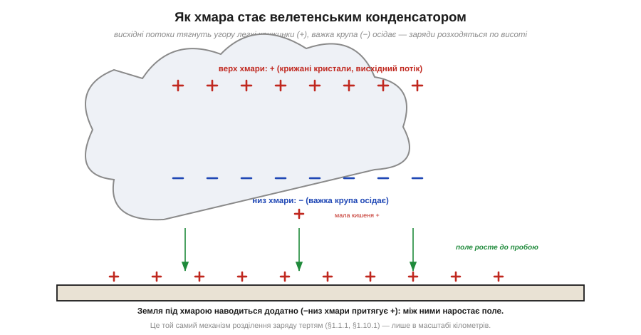
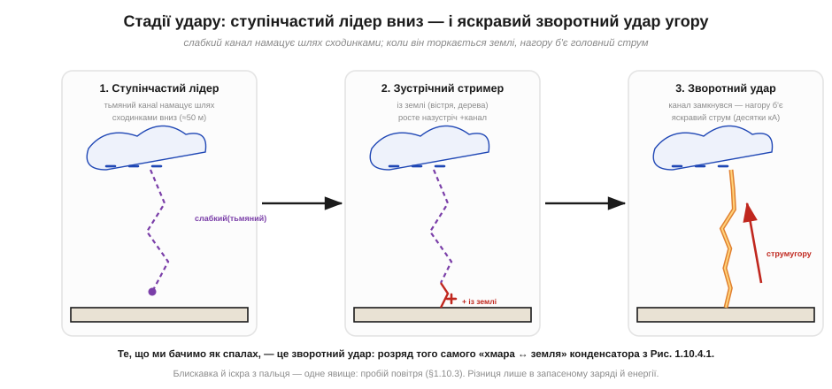

# Блискавка — найбільший електростатичний розряд

Блискавка вражає уяву, але в основі своїй вона до банальності проста: це **той самий [пробій повітря](topic:ph-electromagnetism/air-breakdown)** і **те саме [розділення заряду тертям](topic:ph-electromagnetism/triboelectricity)** — лише в гігантському масштабі. Грозова хмара — це наелектризований «светр» завбільшки з гору, а блискавка — іскра, що проскакує, коли напруга стає завеликою. Зрозуміти блискавку якісно корисно не тому, що ми проєктуватимемо громовідводи, а тому, що вона — найнаочніша демонстрація цілого ланцюжка явищ статики: розділення зарядів, накопичення на «обкладинках», наростання поля до порога й раптовий зрив у розряд. Це масштабна модель того, що відбувається на столі в мініатюрі.

### Як хмара набирає заряд: розділення по висоті

Перше питання — звідки в хмарі заряд. Механізм складний і досі не остаточно вивчений у деталях, але якісна картина така: всередині грозової хмари вирують потужні **висхідні потоки**, що несуть угору вологу й крижані частинки. Дрібні легкі крижані кристали й важча «крупа» (град) при зіткненнях **обмінюються зарядом** — це той самий контактний механізм, що й [тертя двох матеріалів](topic:ph-electromagnetism/triboelectricity). Легкі заряджені частинки потік тягне вгору, важкі осідають донизу — і заряди **розходяться по висоті**.


*Висхідні потоки тягнуть угору легкі крижані кристали, що несуть переважно додатний заряд; важка крупа з від'ємним зарядом осідає в нижній частині. Хмара стає велетенським конденсатором: верх **+**, низ **−**. Земля під нею наводиться **+** (бо від'ємний низ хмари притягує додатний заряд ближче). Між низом хмари й землею наростає поле.*

Результат — хмара перетворюється на колосальний конденсатор: верхня частина заряджена додатно, нижня — від'ємно. А оскільки від'ємний низ хмари висить над землею, він **наводить** на землі під собою додатний заряд (заряд однієї пластини притягує протилежний заряд до сусідньої поверхні). Тепер маємо два протилежно заряджені «листи» — низ хмари й поверхня землі — і між ними наростає електричне поле. Це точно та сама конфігурація, що [заряджене тіло над землею](topic:ph-electromagnetism/body-charge), лише з зарядом у кулонах і відстанню в кілометрах. Поле росте, аж поки десь не сягне порога пробою — і тоді починається розряд.

Зверни увагу, наскільки точно ця картина повторює [настільну статику від тертя](topic:ph-electromagnetism/triboelectricity), лише в іншому масштабі. Там два різні матеріали (підошва й килим) терлися й обмінювались електронами; тут два різні «матеріали» (легкі крижинки й важка крупа) стикаються й обмінюються зарядом. Там гравітація ні до чого, а розділяла заряди рука; тут заряди розділяє по висоті сила тяжіння й висхідний потік (легке вгору, важке вниз). Там результат — кіловольти на тілі; тут — сотні мільйонів вольтів між хмарою й землею. Механізм-родич, інструмент розділення інший, масштаб — несумісний. Корисно тримати цю паралель у голові: вона показує, що «велика електростатика» неба й «мала» зі столу — не дві теми, а одна, прочитана на різних масштабах.

Тут варто розв'язати уявну суперечність. Якщо для [пробою повітря](topic:ph-electromagnetism/air-breakdown) треба ~3 МВ/м, то на кілометр це 3 мільярди вольтів — а виміряні поля в грозовій хмарі набагато менші, сотні кіловольтів на метр у найсильніших місцях. Як же тоді б'є блискавка, якщо «офіційного» порога поле ніби не досягає? Відповідь у тому, що пробій на кілометри **не** вимагає порогового поля по всій довжині одразу. Досить, щоб поріг перевищився **локально** — у малому об'ємі біля краплі, крижинки чи нерівності, де поле згущується (та сама концентрація заряду на «вістрі», що різко піднімає поле біля гострих країв). Там зривається перша мікролавина, утворюється коротка провідна ниточка — а вона своїм гострим кінцем знову згущує поле попереду себе й «пророщує» канал далі. Тобто канал не пробиває всю товщу нараз, а **сам собі прокладає** шлях, крок за кроком підтримуючи на своєму вістрі надпорогове поле. Саме тому реальний пробій стартує за середніх полів, набагато нижчих за наївні «3 МВ/м × кілометр».

### Лідер і зворотний удар: дві стадії спалаху

Тут блискавка показує гарну тонкість, якої не видно в дрібній іскрі: пробій на кілометри відбувається **не одразу**, а у дві виразні стадії.


*Спершу від хмари вниз сходинками (≈50 м кожна) намацує шлях тьмяний **ступінчастий лідер** — слабкий провідний канал. Назустріч йому з гострих об'єктів на землі (дерева, вістря) тягнуться додатні **стримери**. Коли вони змикаються, утворюється суцільний провідний канал — і ним угору б'є яскравий **зворотний удар** (десятки кілоампер). Те, що видно як спалах, — це саме зворотний удар.*

Перша стадія — **ступінчастий лідер** (*stepped leader*). Від хмари до землі стрибками, кроками приблизно по 50 метрів, прокладається слабкий, тьмяний канал іонізованого повітря. Він наче навпомацки шукає шлях найменшого опору, тому й гілкується — звідси характерна розгалужена форма блискавки. Назустріч йому, з найвищих і найгостріших точок на землі, під дією величезного поля тягнуться вгору додатні **стримери** (тут знову працює [концентрація поля на вістрі](topic:ph-electromagnetism/air-breakdown) — тому й б'є частіше у високі дерева й шпилі).

Чому лідер іде саме **сходинками**, а не суцільно? Бо канал росте на межі своїх можливостей: на кінчику він згущує поле до пробою, проростає на крок уперед — і там на мить «видихається», поки нова порція заряду з хмари не дотече каналом до нового кінчика й не підніме поле знову. Звідси ривковий, переривчастий ріст по ~50 метрів за раз, який і дав назву «ступінчастий». Гілкування ж — наслідок того, що пробій навпомацки пробує кілька напрямків одразу: десь канал глухне, десь росте далі, і лишається розгалужений «корінь». А оскільки до землі першим дотягнеться лише один із паростків, головний удар піде саме ним — решта гілок так і лишаться тьмяними відгалуженнями.

Тут варто чесно зауважити: далеко не кожна блискавка б'є в землю. Більшість розрядів відбувається **всередині хмари** або між хмарами — там теж є розділені по висоті заряди і та сама різниця потенціалів, що рветься пробоєм. Удар «хмара–земля», який ми розбираємо, — найвидовищніший і найважливіший для нас, але він лише окремий випадок загального явища «розряд між областями розділеного заряду». Фізика скрізь однакова, міняється лише, між чим саме проскакує розряд.

Друга стадія — **зворотний удар** (*return stroke*). У мить, коли лідер і зустрічний стример змикаються, канал стає суцільним провідником від хмари до землі. І тоді весь накопичений заряд ринає каналом — але **знизу вгору**: хвиля яскравого світіння й величезного струму (десятки, іноді сотні кілоампер) злітає від землі до хмари за мікросекунди. Саме цей зворотний удар ми бачимо як сліпучий спалах і чуємо як грім (різкий нагрів повітря до десятків тисяч градусів спричиняє ударну хвилю).

Чому ж так багато енергії звільняється саме на стадії зворотного удару, а не лідера? Бо лідер лише **прокладає** тонкий слабкопровідний канал — це підготовка, що несе невеликий струм. А коли канал замкнувся й став добре провідним, по ньому під дією колосальної різниці потенціалів ринає весь запас заряду майже без опору. Це як прорвана гребля: спершу вода тонкою цівкою намацує тріщину (лідер), а коли тріщина розкрилась — ринає весь об'єм (зворотний удар). Тому й видно ми майже лише зворотний удар: на ньому виділяється переважна частина енергії, і саме він розжарює канал до сліпучого спалаху.

Кілька деталей, що роблять картину повною. По-перше, удар рідко буває **один**: каналом, що вже прокладений, часто проходить кілька зворотних ударів поспіль (хмара має ще заряд), і кожен наступний лідер уже не «ступінчастий», а швидкий, біжить готовим каналом — звідси характерне **мерехтіння** блискавки, яке око ледь ловить. По-друге, напрям «знизу вгору» спершу дивує, але він логічний: канал замкнувся внизу, тож саме там першим «відпускається» заряд, і фронт розряду (область, де канал різко стає яскравим і провідним) біжить угору, до резервуара заряду в хмарі. По-третє, **спалах і грім** розділені в часі не тому, що це різні явища, а тому, що світло долітає майже миттєво, а звук ударної хвилі — повільно (близько 3 секунд на кілометр): порахувавши затримку, можна оцінити відстань до удару.

**Приклад (як далеко вдарило — за затримкою грому).** Між спалахом і громом минуло t ≈ 6 секунд. На якій відстані була блискавка? (Швидкість звуку ≈ 340 м/с, світло вважаємо миттєвим.)

```
відстань = швидкість звуку × затримка
s ≈ 340 м/с × 6 с
s ≈ 2040 м ≈ 2 км
```

Близько двох кілометрів. Зручне польове правило з цього прикладу: **кожні ~3 секунди затримки = приблизно 1 км** до удару. Це той самий «закон скінченної швидкості сигналу», що й у будь-якій хвилі, — лише тут він робить грозу зручним далекоміром.

**Приклад (порядок заряду в блискавці проти заряду на тілі).** Типовий удар переносить заряд близько Q ≈ 15 Кл. Порівняймо з [тілом людини](topic:ph-electromagnetism/body-charge) (≈0.3 мкКл):

```
Q_блискавка / Q_тіло = 15 Кл / (0.3 × 10⁻⁶ Кл)
                     = 5 × 10⁷
```

Блискавка несе у **50 мільйонів разів** більший заряд, ніж людське тіло після ходи по килиму. Фізика розряду — однакова (пробій повітря), а от запасений заряд і енергія відрізняються на астрономічні порядки. Тому іскра з пальця лоскоче, а блискавка валить дерева.

### Звідки руйнівна сила: енергія й потужність удару

Заряд — лише пів картини; друга половина — **енергія** й **потужність**. Грозовий конденсатор заряджений до сотень мільйонів вольтів, і коли крізь канал проходять десятки кулонів за мікросекунди, виділяється колосальна енергія за майже миттєвий час. Саме звідси й руйнування: не просто «багато енергії», а **багато енергії за дуже короткий час** — тобто величезна потужність у вузькому каналі. Та сама думка діє і в мініатюрі — крихітна [енергія іскри руйнує чип](topic:hw-components/esd-damage), бо вкладається в мікрон за наносекунди. Блискавка — це той самий принцип, лише з велетенськими числами: концентрація енергії в часі й просторі важить більше за саму її кількість.

Звідси й видимі наслідки. Канал розжарюється до температур, у рази вищих за поверхню Сонця, повітря в ньому вибухово розширюється — це ударна хвиля, яку ми чуємо як грім. Дерево розколюється не від «удару» як такого, а тому, що струм миттєво **скипає** воду в деревині, і пара розриває стовбур зсередини. А струми в десятки кілоампер створюють навколо каналу потужне **магнітне поле**, що змінюється за мікросекунди, — і саме воно наводить небезпечні імпульси в усіх провідниках поблизу через [індуктивне наведення](topic:ph-electromagnetism/inductive-coupling): близький удар «б'є» електроніку навіть без прямого влучення.

Корисно усвідомити й те, чому люди й тварини поряд з ударом потерпають навіть без прямого влучення. Коли струм розтікається від місця удару по землі, він створює на поверхні напруги, що **спадають з відстанню**: між двома точками землі на віддалі кроку виникає різниця потенціалів (її звуть кроковою напругою). Це той самий принцип «струм крізь опір дає напругу», лише опором тут є сам ґрунт. Для людей електроніки тут важлива загальна мораль: великий імпульсний струм у будь-якому спільному провіднику (хай то земля під ногами чи спільна «земляна» доріжка плати) породжує на ньому різниці потенціалів там, де наївно чекаєш «одну землю» — той самий механізм, що псує сигнали через [спільну землю та земляні петлі](topic:hw-pcb/ground-loops).

> 🔧 **Навіщо це.** Для розробника електроніки пряме влучення блискавки — рідкісний випадок, але її **наведення** дуже актуальне. Близький удар створює потужний імпульс поля, що наводить кидки напруги в довгих дротах: лініях живлення, антенах, кабелях давачів на щоглі. Тому пристрої, що працюють просто неба чи з довгими кабелями, захищають елементами на тому самому принципі керованого пробою — газовими розрядниками й варисторами (вставка 🔌 [Іскровий проміжок і GDT](topic:ph-electromagnetism/lightning/comp-spark-gap-gdt.md)). Розуміння «блискавка = розряд гігантського конденсатора» допомагає бачити, звідки прийде імпульс і де його перехопити.

Отже, блискавка — це розряд хмари-конденсатора, що зарядилась **[розділенням зарядів](topic:ph-electromagnetism/triboelectricity)**, через **[пробій повітря](topic:ph-electromagnetism/air-breakdown)**; розряд іде у дві стадії — ступінчастий лідер униз і яскравий зворотний удар угору, а сам канал не пробиває кілометри нараз, а проростає, тримаючи надпорогове поле на власному кінчику. Масштаб заряду й енергії колосальний, але кожен елемент картини — знайомий із настільної статики. У цьому й головна цінність блискавки: вона наочно доводить, що велике й мале явища — одне й те саме, що працює за тими самими правилами. Той самий розряд, тільки крихітний, [убиває мікросхему](topic:hw-components/esd-damage) — і часто так, що цього навіть не видно.

---
