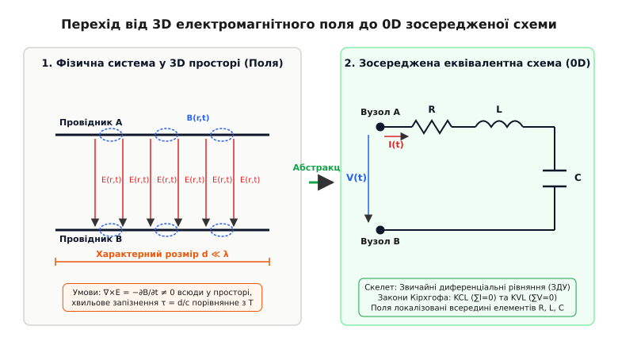
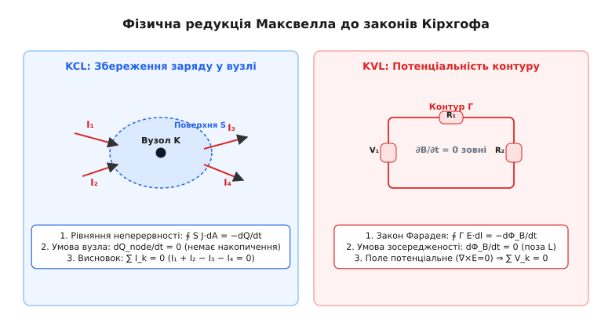
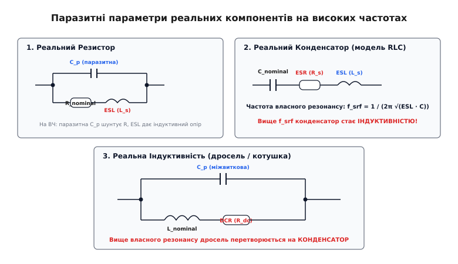
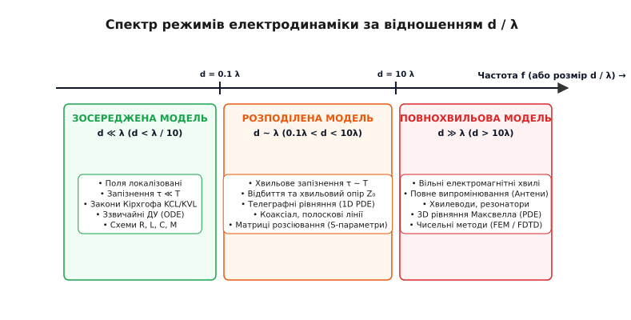

# Модель зосереджених елементів

<preknowlist>
- [Рівняння Максвелла](root:ph-electromagnetism/maxwell-equations) — фундаментальні закони взаємозв'язку електричних і магнітних полів у просторі.
- [Неперервність струму](root:ph-electromagnetism/current-continuity) — збереження електричного заряду у фізичних провідниках та середовищах.
- [Електромагнітна хвиля](root:ph-electromagnetism/em-wave) — хвильовий характер поширення полів зі скінченною швидкістю світла.
- [Струм зміщення](root:ph-electromagnetism/displacement-current) — генерація магнітного поля часовою зміною електричного поля.
</preknowlist>

Коли інженер розробляє друковану плату для сучасного комп'ютера з п'ятьма мільярдами транзисторів, що працюють на частоті 4 гіпергерци, використання прямих векторних рівнянь Максвелла для кожного електрона чи атомної ґратки призвело б до систем диференціальних рівнянь у частинних похідних, обчислення яких вимагало б ресурсів усіх суперкомп'ютерів планети протягом тисячоліть. Проте електронні схеми успішно проектуються й працюють завдяки фундаментальному інженерному спрощенню — **моделі зосереджених елементів** (або абстракції зосереджених параметрів, англ. *lumped circuit model*). Ця модель дає змогу стиснути складний тривимірний простір безперервних електромагнітних полів до нуля вимірів, замінивши векторні поля `E(r,t)` та `B(r,t)` на прості скалярні величини: напругу `V(t)` та струм `I(t)`. Зрозуміти фізику цієї абстракції — означає збагнути точну межу між електродинамікою суцільного середовища та класичною схемотехнікою.

---

## 1. Від континууму полів до дискретних кіл: суть абстракції

У фундаментальній фізиці електромагнітна взаємодія існує не у вигляді ліній чи дротів, а у формі суцільних векторних полів `E(r,t)` та `B(r,t)`, розлитих по всьому 3D-простору. Кожен заряд створює поле, яке поширюється зі скінченною швидкістю світла `c`, випромінює хвилі у порожнечу й взаємодіє з іншими зарядами через запізнілі потенціали. Опис такої системи вимагає розв'язання векторних диференціальних рівнянь у частинних похідних (PDE).

Модель зосереджених елементів здійснює концептуальну розрізку цього 3D-континууму. Вона ділить фізичний простір на дві принципово різні області:
1. **Червоні зони (компактні дискретні елементи):** Обмежені просторові об'єми, всередині яких навмисно концентрується накопичення або дисипація електромагнітної енергії.
2. **Білі зони (ідеальні з'єднувальні провідники та вузли):** Простір між елементами, де вважається, що електричне та магнітне поля дорівнюють нулю або не змінюються з часом, а сигнальні провідники миттєво передають струм без втрат і запізнення.


*Схема концептуального спрощення: тривимірні векторні поля E(r,t) та B(r,t) між провідниками у фізичному просторі замінюються на точкові вузли з скалярними напругами V(t) та ідеалізовані компоненти R, L, C.*

Завдяки цьому спрощенню замість розрахунку просторових інтегралів інженер працює з дискретними **полюсами (терміналами)** компонентів. Головними змінними системи стають не вектори напруженостей, а дві скалярні характеристики:
- **Напруга `V(t)`** — лінійний інтеграл електричного поля між двома полюсами: `V_AB = − ∫_A^B E · dl`.
- **Струм `I(t)`** — поверхневий інтеграл густини струму через переріз провідника: `I = ∫_S J · dA`.

### Фізичний механізм передачі енергії: Потік вектора Пойнтінга

У побутовому уявленні побутує помилкова думка, ніби електромагнітна енергія передається всередині мідного провідника разом із рухом електронів. Однак електродинаміка Максвелла дає принципово іншу картину: енергія передається **через навколишній діелектричний простір** у формі потоку **вектора Пойнтінга**:

```
S = E × H  (Вт / м²)
```

Провідники слугують лише напрямними суцільними межами, які задають конфігурацію полів у просторі довкола них. При протіканні струму крізь резистор вектор електричного поля `E` паралельний поверхні провідника, а магнітне поле `H` охоплює провідник по колу. Вектор Пойнтінга `S = E × H` спрямований строго радіально **всередину резистора** через його бічну поверхню:

```
P_dissipated = ∮_S S · dA = ∮_S (E × H) · dA = I² · R
```

У випадку конденсатора вектор Пойнтінга входить у внутрішній діелектричний зазор між обкладками під час заряджання, заповнюючи об'єм енергією електричного поля `W_E = (1/2) · C · V²`. У котушці індуктивності потік Пойнтінга входить у просторове осердя, накопичуючи енергію магнітного поля `W_B = (1/2) · L · I²`.

### Електродинамічні потенціали та калібрувальна симетрія Лоренца

Для опису поля випромінювання та передачі полів використовують потенціали `Φ` та `A`. У калібруванні Лоренца рівняння Максвелла набувають вигляду хвильових рівнянь Даламбера:

```
∇²Φ − (1/c²) · ∂²Φ/∂t² = − ρ / ε₀
∇²A − (1/c²) · ∂²A/∂t² = − μ₀ · J
```

У зосередженій моделі при `c → ∞` (або `k·r ≪ 1`) хвильові доданки з другою похідною за часом `(1/c²) · ∂²/∂t²` обнуляються. Рівняння Даламбера перетворюються на класичне рівняння Пуассона для скалярного потенціалу `∇²Φ = −ρ/ε₀` та стаціонарне рівняння для векторного потенціалу `∇²A = −μ₀·J`. Це свідчить про те, що зосереджена схема повністю нехтує хвильовою динамікою потенціалів, зводячи їх до миттєвої дії на відстані.

Модель зосереджених елементів ізолює ці просторові потоки Пойнтінга всередині корпусів окремих деталей, дозволяючи схемотехніку описувати обмін енергією між компонентами за допомогою звичайних диференціальних рівнянь (ЗДУ) та алгебраїчних систем. Детальний аналіз того, як ця концептуальна зміна парадигми розвивалася впродовж XIX–XX століть, розкрито в [історії створення абстракції зосереджених елементів](root:ph-electromagnetism/lumped-circuit-model/hist-lumped-abstraction.md).

---

## 2. Три стовпи квазістаціонарності: аксіоми та фізичні межі

Зосереджена модель — це не просто зручна математична вигадка, а суворе фізичне наближення, яке є законним лише за виконання трьох фундаментальних умов. Ці умови називаються **аксіомами квазістаціонарного електромагнітного поля** (або *Lumped Matter Discipline*).

### Перша аксіома: Нехтовне хвильове запізнення (`d ≪ λ`)

Електромагнітна хвиля поширюється у діелектричному середовищі зі швидкістю `v = c / √(ε_r · μ_r)`. Якщо характерний просторовий розмір елемента або всієї схеми дорівнює `d`, то час, необхідний електромагнітному збуренню для прольоту від одного краю пристрою до іншого, становить:

```
τ = d / v
```

Якщо струм чи напруга змінюються з гармонічною частотою `f = 1 / T` (де `T` — період коливань), то хвиля у середовищі має довжину `λ = v / f`. 

Перша аксіома вимагає, щоб час прольоту `τ` був нехтовно малим порівняно з періодом коливань `T`:

```
τ ≪ T  ⇒  d / v ≪ 1 / f  ⇒  d ≪ λ
```

При виконанні цієї умови фаза електромагнітної хвилі в усіх точках зосередженого елемента є строго однаковою. Зсув фази вздовж пристрою дорівнює `Δφ = 2π · (d / λ) ≈ 0`. Це означає, що струм, який входить у перший полюс резистора чи конденсатора у момент часу `t`, у той самий момент часу виходить із його другого полюса. Ефектами хвильового запізнення та випромінюванням електромагнітних хвиль у відкритий простір можна знехтувати.

В інженерній практиці межею застосовності зосередженої моделі вважається умова:

```
d < λ / 10     (для грубих розрахунків)
d < λ / 50     (для прецизійної схемотехніки)
```

Залежність між частотою сигналу, довжиною хвилі у провіднику й граничним розміром зосередженої схеми наведено у таблиці:

| Частота сигналу `f` | Довжина хвилі у вакуумі `λ` | Довжина хвилі у FR-4 (`ε_r ≈ 4`) | Межа зосередженості (`d = λ / 10`) | Сфера застосування |
| :--- | :--- | :--- | :--- | :--- |
| **50 Гц** | 6000 км | 6000 км | 600 км | Енергосистеми, електромережі |
| **1 МГц** | 300 м | 150 м | 15 м | Двохпровідні лінії, АМ-радіо |
| **100 МГц** | 3 м | 1.5 м | 15 см | FM-радіо, друковані плати |
| **2.4 ГГц** | 12.5 см | 6.25 см | **6.25 мм** | Wi-Fi, Bluetooth, СВЧ-плати |
| **10 ГГц** | 3 см | 1.5 см | **1.5 мм** | Супутникові лінії, радари |
| **100 ГГц** | 3 мм | 1.5 мм | **150 мкм** | Внутрішньокристальні шини мікросхем |

З цієї таблиці видно дивовижний фізичний факт: одна й та сама геометрична конструкція розміром 2 сантиметри (наприклад, доріжка на друкованій платі) при частоті 100 МГц є ідеальним зосередженим провідником із нахтовним опором, а при частоті 10 ГГц перетворюється на складну розподілену лінію передачі й випромінювальну антену!

### Друга аксіома: Локалізація магнітного потоку (`∂B/∂t = 0` поза елементами)

Згідно з другим рівнянням Максвелла (законом індукції Фарадея), ротор електричного поля дорівнює часовій похідній магнітної індукції: `rot(E) = −∂B/∂t`. 

Друга аксіома вимагає, щоб **поза межами спеціальних індуктивних компонентів** (котушок, трансформаторів) часова зміна магнітного поля була строго нульовою:

```
∂B / ∂t = 0   (у просторі між провідниками та вузлами)
```

За цієї умови векторне поле електричної напруженості `E` у просторі між елементами стає **потенціальним (невихровим)**:

```
rot(E) = 0  ⇒  E = −∇V
```

Ця умова гарантує, що різниця потенціалів між двома точками `A` та `B` залежить виключно від координат цих точок і не залежить від траєкторії шляху, за яким проводиться інтегрування. Саме ця аксіома забезпечує однозначність поняття **напруги** в електричному колі та робить чинним Другий закон Кірхгофа (KVL). Звісно, всередині котушок індуктивності `∂B/∂t ≠ 0`, але увесь магнітний потік затиснутий усередині осердя або витків і не проникає у зовнішній простір контуру.

Якщо ж ця аксіома порушується (наприклад, коли поруч проходить змінне магнітне поле від потужного трансформатора чи імпульсного перетворювача), у з'єднувальних провідниках контуру наводиться паразитний вихровий ЕРС:

```
E_ind = − dΦ_ext / dt
```

У такому разі напруга між вузлами перестає бути потенціальною, а Другий закон Кірхгофа у класичному вигляді `∑ V_k = 0` дає помилку, рівну наведеній ЕРС.

### Третя аксіома: Заборона накопичення заряду на провідниках (`∂ρ/∂t = 0`)

Рівняння неперервності стверджує, що дивергенція густини струму пов'язана зі зміною густини заряду: `div(J) = −∂ρ/∂t`.

Третя аксіома вимагає, щоб з'єднувальні дроти та вузли схеми не мали власної ємності й не накопичували електричний заряд у часі:

```
∂ρ / ∂t = 0   (на провідниках та у вузлах)
```

Усі електричні заряди можуть накопичуватися **виключно на обкладках конденсаторів**, де струм провідності переривається й компенсується струмом зміщення `J_D = ∂D/∂t`. На самих же з'єднувальних провідниках і у вузлах сумарна густина струму задовольняє умову `div(J) = 0`, що є прямим математичним підґрунтям Першого закону Кірхгофа (KCL).

Час, за який вільний заряд у провіднику релаксує до поверхні, визначається **максивелівським часом релаксації**:

```
τ_relax = ε₀ · ε / σ
```

Для міді (`σ ≈ 5.8e7 См/м`) час релаксації становить мізерні `τ_relax ≈ 1.5e-19 с`. Це означає, що у металевих провідниках об'ємний заряд зникає майже миттєво, що робить третю аксіому надзвичайно точною для всіх металевих вузлів. Натомість у слабопровідних напівпровідникових підкладках мікросхем час релаксації може становити наносекунди, що вимагає моделювання підкладки у вигляді зосередженої `RC`-мережі.

### Ефект релаксації диполів та комплексна діелектрична проникність

У реальних діелектриках при високих частотах виникає явище релаксації орієнтаційної поляризації. Комплексна діелектрична проникність подається виразом Дебая:

```
ε(ω) = ε' (ω) − j · ε'' (ω) = ε_inf + (ε_s − ε_inf) / (1 + j · ω · τ_dipole)
```

де `ε'` описує накопичення ємнісної енергії, а уявна частина `ε''` описує діелектричні втрати (нагрівання). Кут тангенса втрат `tan(δ) = ε'' / ε'` створює активну еквівалентну провідність, паралельну конденсатору: `G_loss(ω) = ω · C · tan(δ)`. Це показує, що навіть зосереджений ідеальний діелектрик на високих частотах набуває додаткового активного опору витоку.

---

## 3. Редукція рівнянь Максвелла до законів Кірхгофа

Коли три аксіоми квазістаціонарності виконуються, повна система диференціальних рівнянь Максвелла редукується до двох простих алгебраїчних законів Кірхгофа та трьох компонентних рівнянь для ідеальних елементів `R`, `L`, `C`.


*Схема математичного виводу: інтегрування рівняння неперервності div(J)=0 дає Перший закон Кірхгофа (KCL), а циркуляція потенціального поля E=-∇V по замкненому контуру дає Другий закон Кірхгофа (KVL).*

### Перший закон Кірхгофа (KCL) як збереження заряду

Проінтегруємо рівняння неперервності `div(J) = −∂ρ/∂t` по об'єму `V`, що охоплює вузол електричної схеми. За теоремою Остроградського-Гаусса:

```
∫_V div(J) dV = ∮_S J · dA = − d/dt (∫_V ρ dV) = − dQ_node / dt
```

Оскільки за третьою аксіомою накопичення заряду у металі вузла відсутнє (`dQ_node / dt = 0`), поверхневий інтеграл розбивається на суму струмів `I_k`, що входять і виходять через перерізи `N` з'єднаних провідників:

```
∑_{k=1}^N I_k = 0      (KCL: Перший закон Кірхгофа)
```

### Другий закон Кірхгофа (KVL) як потенціальність поля

Проінтегруємо закон індукції Фарадея `rot(E) = −∂B/∂t` по поверхні `S_Γ`, що спирається на замкнений контур схеми `Γ`. За теоремою Стокса:

```
∮_Γ E · dl = − d/dt (∫_{S_Γ} B · dA) = − dΦ_B / dt
```

За другою аксіомою магнітне поле поза котушками відсутнє (`dΦ_B / dt = 0`), тому циркуляція електричного поля по замкненому контуру дорівнює нулю:

```
∮_Γ E · dl = 0
```

Розбиваючи замкнений контур на відрізки між терміналами окремих компонентів та підставляючи спади напруг `V_k = − ∫_{A_k}^{B_k} E · dl`, отримуємо:

```
∑_{k=1}^M V_k = 0      (KVL: Другий закон Кірхгофа)
```

Строгі та послідовні виводи кожного з цих рівнянь кроками через векторний аналіз наведено у [суворому математичному виводі законів Кірхгофа з рівнянь Максвелла](root:ph-electromagnetism/lumped-circuit-model/math-quasistationary-derivation.md).

### Баланс енергії Пойнтінга у зосередженому RLC-контурі

Зв'язок між теоремою Пойнтінга та зосередженими елементами можна довести безпосередньо. Інтегральна теорема збереження електромагнітної енергії Максвелла має вигляд:

```
− ∮_S S · dA = d/dt ∫_V ( (1/2)·ε·E² + (1/2)·μ·H² ) dV + ∫_V J · E dV
```

Якщо замкнена поверхня `S` охоплює весь `RLC`-контур, потік вектора Пойнтінга через зовнішню поверхню дорівнює нулю (`∮_S S · dA = 0`), оскільки випромінювання відсутнє (`d ≪ λ`). Тоді рівняння перетворюється на тотожність балансу потужності:

```
0 = d/dt ( W_E + W_B ) + P_dissipated
```

Підставляючи зосереджені вирази для накопиченої енергії `W_E = (1/2)·C·V²` та `W_B = (1/2)·L·I²`, а також дисипацію Джоуля `P = I²·R`, отримуємо класичне рівняння енергетичного балансу `RLC`-контуру:

```
d/dt [ (1/2)·C·V² + (1/2)·L·I² ] + I² · R = 0
```

Це доводить, що закони схемотехніки є прямою проекцією фундаментального закону збереження енергії електродинаміки на дискретну систему.

### Вивід конститутивних (компонентних) рівнянь

Кожен зосереджений елемент є математичною апроксимацією локалізованої фізичної взаємодії:

1. **Ідеальний Резистор (`R`):** Моделює незворотне перетворення електричної енергії на теплову внаслідок розсіювання носіїв заряду (дисипація Джоуля). Виводиться з диференціального закону Ома `J = σ · E`:
   ```
   V(t) = R · I(t)
   ```
   Поглинута потужність: `P(t) = V(t) · I(t) = I²(t) · R`.

2. **Ідеальний Конденсатор (`C`):** Моделює накопичення потенціальної енергії у статичному електричному полі між провідними обкладками `W_E = (1/2) · C · V²`. Виводиться зі струму зміщення Максвелла `J_D = ∂D/∂t`:
   ```
   I(t) = C · (dV(t) / dt)
   ```

3. **Ідеальна Індуктивність (`L`):** Моделює накопичення кінетичної енергії у вихровому магнітному полі довкола провідника `W_B = (1/2) · L · I²`. Виводиться із закону індукції Фарадея `V = dΦ_B / dt` при `Φ_B = L · I`:
   ```
   V(t) = L · (dI(t) / dt)
   ```

4. **Взаємна індуктивність (`M`):** Моделює магнітне зв'язування двох котушок через спільний потік `Φ_21 = M · I_1`:
   ```
   V_2(t) = M · (dI_1(t) / dt)
   ```

---

## 4. Неідеальні компоненти та паразитні параметри

У реальному фізичному світі не існує "чистих" резисторів, конденсаторів чи індуктивностей. Будь-яка реальна деталь є тривимірним тілом скінченних розмірів, виготовленим із матеріалів із кінцевою провідністю й діелектричною проникністю. Тому на високих частотах реальний компонент описується **еквівалентною зосередженою схемою заміщення**, що містить паразитичні параметри.


*Еквівалентні зосереджені схеми неідеальних компонентів: паразитна індуктивність виводів (ESL), паразитна ємність обкладок/виків (Cp) та опір втрат (ESR/DCR).*

### Реальний резистор
Окрім номінального опору `R_nom`, реальний резистор (наприклад, SMD 0805) має:
- **Паразитну послідовну індуктивність (ESL):** зумовлену власною довжиною струмового шляху й виводів (`L_s ≈ 1–2 нГн`).
- **Паразитну паралельну ємність (`C_p`):** зумовлену мікроскопічним зазором між керамічними чашечками й контактами (`C_p ≈ 0.1–0.5 пФ`).

На високих частотах паразитна ємність починає шунтувати основний опір `R`, а індуктивність виводів додає реактивний імпеданс `Z = R_nom + j·ω·L_s // (1 / (j·ω·C_p))`.

### Реальний конденсатор та частота власного резонансу (SRF)
Керамічний чи електролітичний конденсатор містить:
- **Еквівалентний послідовний опір (ESR):** втрати на нагрівання в омичних контактах та омичні втрати в діелектрику.
- **Еквівалентну послідовну індуктивність (ESL):** індуктивність обкладок та виводів.

Повний імпеданс реального конденсатора описується послідовним `RLC`-ланцюгом:

```
Z_C(ω) = ESR + j · (ω · ESL − 1 / (ω · C))
```

При частоті, на якій індуктивний опір `ω · ESL` зрівнюється з ємнісним опором `1 / (ω · C)`, настає **власний послідовний резонанс (Self-Resonance Frequency, SRF)**:

```
f_srf = 1 / (2π · √(ESL · C))
```

> ⚠️ **Критичний фізичний факт:** На частотах **вище `f_srf`** конденсатор повністю втрачає свої ємнісні властивості й перетворюється на **звичайну індуктивність**! Наприклад, SMD конденсатор 100 нФ з ESL = 1 нГн має `f_srf ≈ 16 МГц`. На частоті 100 МГц він є індуктивністю й більше не може фільтрувати високочастотні перешкоди в колі живлення процесора.

### Пробивна напруга та температурний розгін
Окрім частотних паразитів, зосереджений конденсатор володіє межею діелектричної міцності `E_breakdown`. Для кераміки `SiO2` пробивна напруженість становить `3 МВ/см`. При перевищенні цієї межі виникає лавинний пробій діелектрика, і зосереджений конденсатор перетворюється на омичний короткозаключений опір. Нагрівання конденсатора високим пульсуючим струмом `I_rms` через опір `ESR` створює виділення потужності `P = I_rms² · ESR`, що у разі поганого відводу тепла призводить до температурного розгону та руйнування деталі.

### Реальна індуктивність (дросель) та магнітна нелінійність
Котушка індуктивності складається зі спірального провідника, що має:
- **Опір постійному струму (DCR):** опір мідного дроту.
- **Міжвиткову паразитну ємність (`C_p`):** ємність між сусідніми витками обмотки.
- **Втрати в осерді (Core Losses):** зумовлені вихровими струмами Фуко та магнітним гістерезисом у фериті.

При перевищенні допустимого постійного струму осердя потрапляє в область магнітного насичення (`B → B_sat`), через що диференційна індуктивність `L_diff = dΦ/dI` катастрофічно падає у 5–10 разів, що призводить до сплесків струму в силових перетворювачах. На частоті паралельного резонансу `f_srf = 1 / (2π · √(L · C_p))` імпеданс котушки сягає максимуму, а вище цієї частоти котушка перетворюється на **конденсатор**.

### Скін-ефект і частотна залежність параметрів
Зі зростанням частоти струм виштовхується на поверхню провідника на глибину скін-шару `δ`:

```
δ = √(2 / (ω · μ · σ))
```

Це призводить до того, що зосереджений опір провідника `R(f)` починає зростати пропорційно `√f`, а внутрішня індуктивність провідника зменшується. Інженерна мова опису таких високочастотних неідеальних компонентів у спеціалізованих симуляторах регламентується [специфікацією мови SPICE для опису зосереджених елементів та неідеальних паразитних параметрів](root:ph-electromagnetism/lumped-circuit-model/api-spice-netlist.md).

---

## 5. Межа розпаду зосередженої моделі: розподілені системи

Що відбувається, коли геометричні розміри пристрою `d` стають порівнянними з довжиною хвилі `λ` (`d ≥ 0.1 · λ`) або коли час наростання фронту сигналу `t_rise` стає меншим за подвійний час затримки лінії `2 · τ`?

У цей момент зосереджена модель Кірхгофа повністю розпадається, і система переходить у клас **розподілених систем (ліній передачі)**.


*Континууальний спектр режимів електродинаміки: від квазістаціонарної зосередженої схеми (ЗДУ) до розподіленої лінії (1D PDE) та повнохвильового випромінювання (3D PDE).*

### Від осередків до телеграфних рівнянь
Щоб описати довгий провідник (наприклад, коаксіальний кабель чи смужкову лінію на платі), його розбивають на нескінченно малі відрізки довжиною `dx`. Кожен такий відрізок подається у вигляді зосередженого `RLGC`-осередку з первинними параметрами на одиницю довжини:
- `R'` — погонний опір (Ом/м)
- `L'` — погонна індуктивність (Гн/м)
- `G'` — погонна провідність ізоляції (См/м)
- `C'` — погонна ємність (Ф/м)

Застосовуючи закони Кірхгофа до відрізка `dx` та спрямовуючи `dx → 0`, ми переходімо від звичайних диференціальних рівнянь до **телеграфних рівнянь Гевісайда** у частинних похідних:

```
∂V(x,t) / ∂x = − R' · I(x,t) − L' · (∂I(x,t) / ∂t)
∂I(x,t) / ∂x = − G' · V(x,t) − C' · (∂V(x,t) / ∂t)
```

Диференціюючи перше рівняння за `x`, а друге за `t` (для лінії без втрат `R' = 0, G' = 0`), отримуємо класичне **хвильове рівняння**:

```
∂²V / ∂x² = L' · C' · (∂²V / ∂t²)
```

Це рівняння описує хвилі напруги й струму, що біжать уздовж лінії зі фазовою швидкістю `v = 1 / √(L' · C')`.

### Дифузійний режим Елмора в мікросхемах (RC Delay)

У кремнієвих інтегральних мікросхемах (IC) переріз міжз'єднань настільки малий, що погонний опір мідної доріжки `R'` виявляється величезним, а погонна індуктивність `L'` стає нехтовно малою (`R' ≫ ω · L'`). У такому разі телеграфні рівняння вироджуються не у хвильове рівняння, а в **рівняння дифузії (модель Елмора)**:

```
∂V / ∂t = (1 / (R' · C')) · (∂²V / ∂x²)
```

Затримка сигналу в цьому дифузійному режимі зростає **квадратично** від довжини провідника `τ_elmore ∝ L²`. Саме тому у сучасних мікропроцесорах довгі сигнальні шини розбивають на короткі відрізки, вставляючи крізь кожні кілька соток мікрометрів активні буфери (репітери), перетворюючи квадратичну затримку назад у лінійну.

### Характеристичний (хвильовий) опір та відбиття
У розподіленій лінії відношення між напругою й струмом у біжучій хвилі визначається не законами Ома для окремих елементів, а **характеристичним (хвильовим) опором `Z_0`**:

```
Z_0 = √( (R' + j·ω·L') / (G' + j·ω·C') )  ≈  √(L' / C')   (для лінії без втрат)
```

Якщо лінія навантажена на опір `Z_L ≠ Z_0`, на кінці лінії виникає відбита хвиля. Коефіцієнт відбиття за напругою дорівнює:

```
Γ = (Z_L − Z_0) / (Z_L + Z_0)
```

- Якщо `Z_L = Z_0` (узгоджене навантаження), `Γ = 0`: відбиття відсутнє, вся енергія поглинається навантаженням.
- Якщо `Z_L = ∞` (розірване коло), `Γ = +1`: хвиля відбивається з тією ж фазою, напруга на кінці подвоюється.
- Якщо `Z_L = 0` (коротке замикання), `Γ = −1`: хвиля відбивається у протифазі, напруга на кінці обнуляється.

Наочно побачити, як при збільшенні кількості осередків `N → ∞` зосереджена `LC`-драбина перетворюється на неперервну лінію передачі з хвильовим запізненням та відбиттям, можна у [чисельній симуляції переходу від зосередженого LC-ланцюга до розподіленої лінії](root:ph-electromagnetism/lumped-circuit-model/proj-lumped-vs-distributed-sim.md).

---

## 6. Практичний та інженерний вимір: ціна та сфера застосування

> 🔧 **Навіщо це.**
> Абстракція зосереджених елементів є головним розігрувальним інструментом сучасного інженера-електроніка. Вона дає змогу розраховувати складні системи у програмах SPICE за лічені секунди замість тижнів чисельного розв'язання рівнянь Максвелла у 3D-сітках.
> 
> Помилка у виборі межі між зосередженою й розподіленою моделлю є найчастішою причиною відмов у високочастотній техніці:
> - **Симптом 1 (Нехтування паразитами):** Дросель, вибраний для приглушення завад на частоті 500 МГц, не працює, бо розробник вважав його "зосередженим `L`", не врахувавши міжвиткову ємність `C_p`, через яку завада вільно проходить.
> - **Симптом 2 (Помилка довжини доріжки):** Сигнал тактової частоти 1 ГГц з часом наростання фронту `t_rise = 100 пс` іде по доріжці завдовжки 5 см. Розробник розрахував її за законом Ома як зосереджений дріт, але на платі виникли сильні дзвін і спотворення даних через відбиття хвилі від неузгодженого входу мікросхеми.
> - **Рішення:** Завжди обчислюйте критичну довжину доріжки `l_crit = (v · t_rise) / 2`. Якщо довжина провідника `d > l_crit`, доріжку **зобов'язані** трасувати як лінію передачі з контрольованим імпедансом `Z_0 = 50 Ом` та термінувати узгодженим резистором!

### Проектування шин живлення (PDN) та цільовий імпеданс

У сучасній цифровій електроніці зосереджена модель використовується для проектирования мереж розподілу живлення (Power Distribution Network, PDN). Сучасні процесори при напрузі живлення `0.8 В` споживають струм до `200 А` з імпульсними кидками струму `dI/dt = 100 А/нс`.

Щоб напруга живлення не просідала більше ніж на `5%` (`ΔV = 40 мВ`), зосереджений імпеданс шини живлення `Z_PDN` у всьому діапазоні частот від 0 Гц до 1 ГГц повинен не перевищувати **цільовий імпеданс (Target Impedance)**:

```
Z_target = ΔV / ΔI = 0.040 В / 100 А = 0.0004 Ом = 0.4 мОм
```

Для забезпечення такого мізерного імпедансу паралельно з'єднують десятки зосереджених керамічних конденсаторів різних номіналів (від 100 мкФ до 100 пФ) та корпусів (від 1210 до 0201). Кожен номінал забезпечує низький імпеданс у своїй частотній зоні поблизу власного резонансу `f_srf`, формуючи пласку АЧХ імпедансу PDN.

### Важливість зворотного шляху струму (Return Current Path)

Поширеною помилкою початківців є уявлення про те, що струм тече лише по сигнальній доріжці, а заземлювальний полігон є лише "абстрактним нульовим потенціалом". Фізично струм **завжди тече замкненою петлею**.

На постійному струмі (DC) зворотний струм тече по шляху найменшого опору `R` (по найкоротшій прямій лінії між джерелом і землею). На високих частотах (AC, `f > 100 кГц`) зворотний струм тече по шляху **найменшої індуктивності `L_loop`**, тобто строго під сигнальною доріжкою у землі! Якщо у заземлювальному полігоні під доріжкою є розріз або зазор (slit in ground plane), зворотний струм змушений огинати зазор, створюючи велетенську індуктивну петлю. Ця петля миттєво ламає другу аксіому квазістаціонарності, випромінюючи потужні завади (EMI) та створюючи наводки у сусідніх провідниках.

### Електромагнітна сумісність (EMC) та випромінювання паразитних петель

Коли розмір замкненого контуру `A` перестає бути нехтовно малим, паразитний струмовий контур перетворюється на елементарний магнітний диполь із дипольним моментом `m = I · A`. Напруженість електричного поля, випромінюваного таким зосередженим контуром у дальній зоні, виражається формулою:

```
E_far = (μ₀ · π / c²) · (I · A · f² / r) · sin(θ)
```

З цієї формули чітко видно, що випромінювання зростає **квадратично від частоти `f²`** та пропорційно площі петлі `A`. Зменшення площі зосереджених контурів шляхом встановлення керамічних блокувальних конденсаторів безпосередньо біля виводів живлення мікросхем є головним інженерним методом забезпечення електромагнітної сумісності (EMC).

### Диференціальні лінії та розщеплення режимів (Odd vs Even Mode)

Для передачі швидкісних цифрових даних (PCIe, HDMI, Ethernet) використовують диференціальну пару провідників. У такій зосередженій чи розподіленій системі струми в провідниках течуть у протилежних напрямках. Зв'язок між ними описується двома режимами:
- **Непарний режим (Odd Mode):** Струми протилежні за напрямком (`I_1 = −I_2`), магнітні поля взаємно компенсуються, імпеданс дорівнює `Z_diff = 2 · Z_odd`.
- **Парний режим (Even Mode):** Струми збігаються за напрямком (`I_1 = I_2`), створюючи синфазну заваду.

При асиметрії зосереджених паразитів у диференціальній парі (наприклад, різній довжині доріжок `ΔL`) виникає перетворення синфазного сигналу в диференціальний (Common-to-Differential Mode Conversion), що призводить до сплеску випромінюваних завад і збоїв у роботі шини.

### Нанофотоніка та оптичні зосереджені елементи (Lumped Nanocircuits)

На початку XXI століття концепція зосереджених елементів отримала нове життя у нанофотоніці завдяки працям Надера Енгети (Nader Engheta). Було доведено, що на оптичних частотах (терагерци й оптичний діапазон) плазмонні металеві наночастинки (золото, срібло) та діелектричні наноструктури розміром у кілька нанометрів поводяться як оптичні зосереджені елементи `R`, `L`, `C`. Наприклад, наночастинка із від'ємною діелектричною проникністю `ε < 0` діє як наноіндуктивність, а діелектрична наночастинка з `ε > 0` — як наноконденсатор. Це дозволило перенести схемотехнічні методи розрахунку `RLC`-кіл у нанооптику для створення оптичних метаматеріалів та наноантен.

### Матриця вибору моделей для інженерних завдань

Залежно від фізичних параметрів системи інженер повинен обирати правильний рівень абстракції:

```
                  ┌─────────────────────────────────────────┐
                  │   Обчислення розміру d та довжини λ     │
                  └────────────────────┬────────────────────┘
                                       │
                    ┌──────────────────┴──────────────────┐
                    ▼                                     ▼
             d < 0.1 · λ                           d ≥ 0.1 · λ
       (Зосереджений режим)                   (Розподілений режим)
                    │                                     │
         ┌──────────┴──────────┐               ┌──────────┴──────────┐
         ▼                     ▼               ▼                     ▼
    f < f_srf             f ≥ f_srf        Поле затиснуте        Вільне випромінювання
 (Ідеальні R,L,C)    (Схема з ESR/ESL)   (Лінії передачі Z0)    (Антени, 3D Максвелл)
 (SPICE / KCL/KVL)   (Паразитні моделі)   (Телеграфні рівняння)  (3D FEM / FDTD)
```

Зосереджена модель — це не спрощення через неуцтво, а свідомий інженерний компроміс. Вона відкидає тривимірну складність полів там, де вона не впливає на результат, і зберігає точність у межах, які гарантуються трьома аксіомами квазістаціонарності.
