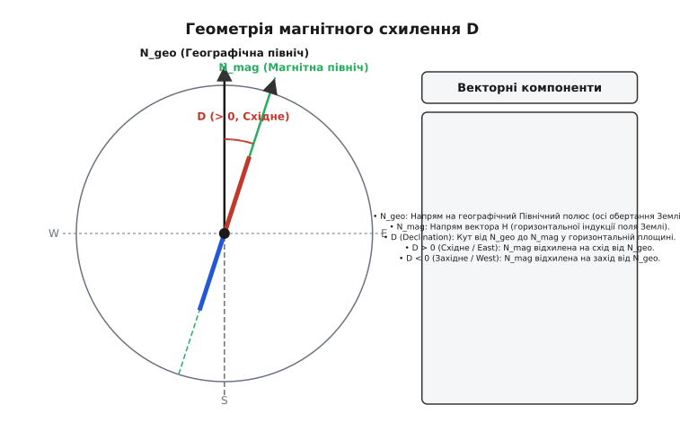
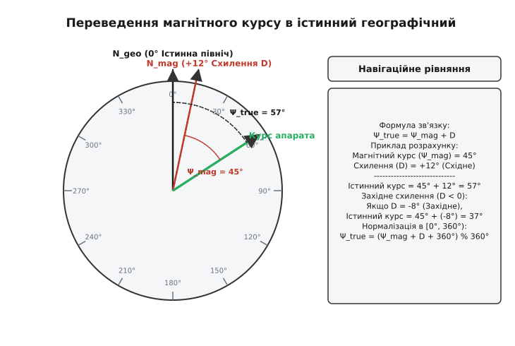

# Магнітне схилення

<preknowlist>
- [Магнітне поле Землі](topic:ph-electromagnetism/earth-magnetic-field) — походження геомагнітного диполя, дрейф полюсів і тривимірна структура поля.
- [Магнітний нахил](topic:ph-electromagnetism/magnetic-inclination) — геометрія тривимірного вектора B та його розкладання на компоненти NED.
- [Векторний добуток і компоненти](topic:math-algebra/vector-components) — проєкція вектора на горизонтальну площину та обчислення арктангенса двох аргументів (atan2).
</preknowlist>

У ніч на 22 жовтня 1707 року чотири лінійні кораблі Королівського флоту Великої Британії — *Association*, *Eagle*, *Romney* та *Firebrand* — під командуванням адмірала серам Клаудіслі Шовелла розбилися об підводні скелі островів Сіллі на підході до англійського каналу Ла-Манш. Катастрофа забрала життя понад 1400 моряків і стала однією з найтрагічніших сторінок у історії британського флоту. Ескадра поверталася після облоги Тулона у важких умовах шторму й туману, позбавлена можливості визначати астрономічні координати за зорями чи Сонцем. 

Проте головною причиною загибелі кораблів була не штормова погода й не помилка у підрахунку швидкості лагом: штурмани флоту орієнтувалися за магнітним компасом, вважаючи, що його стрілка вказує точно на географічний Північний полюс. Насправді ж у північно-західній Атлантиці геомагнітне поле відхилялося від географічного меридіана на понад 7° на захід. Не врахувавши цю кутову поправку, ескадра проклала курс зі зміщенням у 30 кілометрів на північний захід і на повному ходу налетіла на рифи. Цей кут між напрямом на справжню географічну північ і напрямом, куди вказує горизонтальна складова магнітного поля Землі, називають **магнітним схиленням** (*magnetic declination*, або у військовій та морській навігації *magnetic variation*, від лат. *declinatio* — відхилення).

В Україні кут магнітного схилення наразі становить від +6° до +9° на схід (залежно від конкретної області). Це означає, що звичайний компас у Києві чи Львові вказує не на географічний Північний полюс, а на 6°–8° правіше (східніше) від нього. Для пішого туриста це створює відхилення приблизно у 100 метрів на кожні 10 кілометрів шляху, а для автономного безпілотного літального апарата, що здійснює політ зі швидкістю 150 км/год на відстань 100 км, похибка без компенсації схилення сягає понад 12 кілометрів від цілі. Розуміння природи магнітного схилення, його просторового розподілу та часового дрейфу — це необхідна умова для точної повітряної, морської й наземної навігації, а також для побудови стійких алгоритмів орієнтації у сучасних робототехнічних системах.

---

### Геометрія двох півночей: географічний меридіан проти магнітного

Причина існування магнітного схилення криється у фундаментальній невідповідності між двома осьовими орієнтирами нашої планети:
1. **Географічна північ (True North, `N_geo`)** — напрям вздовж географічного меридіана до геометричного Північного полюса, через який проходить вісь добового обертання Землі.
2. **Магнітна північ (Magnetic North, `N_mag`)** — напрям у горизонтальній площині, в якому встановлюється північний кінець вільної стрілки компаса, тобто напрям горизонтальної проєкції вектора магнітної індукції Землі.

Вектор магнітної індукції `B` геомагнітного поля у будь-якій точці планети розкладається у прямокутній системі координат **NED** (*North-East-Down*) на три ортогональні складові: `X` (північна горизонтальна проєкція), `Y` (східна горизонтальна проєкція) та `Z` (вертикальна прямовисна проєкція). Проєкція вектора `B` на місцеву горизонтальну площину утворює вектор горизонтальної інтенсивності `H`:

```
H = √(X² + Y²)
```

Саме вектор `H` діє на стрілку компаса або на чутливі осі електронного 3-осьового магнітометра, вирівнюючи прилад вздовж місцевого магнітного меридіана.


*Геометрія магнітного схилення D: відхилення магнітного меридіана від географічного на кут D у горизонтальній площині.*

Кут у горизонтальній площині від вектору географічної півночі `N_geo` (вісь `X`) до вектора магнітної півночі `N_mag` (напрям вектора `H`) називають **магнітним схиленням `D`**. 

Математично цей кут обчислюють як двоаргументний арктангенс від співвідношення східної `Y` та північної `X` компонент поля:

```
D = atan2(Y, X)
```

У геодезії, геофізиці та авіації зафіксовано строгу конвенцію знаків для кута магнітного схилення `D`:
* **Східне схилення (East, `D > 0` або `+D`)**: вектор магнітної півночі `N_mag` відхилений на схід від географічного меридіана `N_geo`. Стрілка компаса відхиляється праворуч за годинниковою стрілкою.
* **Західне схилення (West, `D < 0` або `-D`)**: вектор магнітної півночі `N_mag` відхилений на захід від географічного меридіана `N_geo`. Стрілка компаса відхиляється ліворуч проти годинникової стрілки.
* **Нульове схилення (`D = 0°`)**: магнітна північ `N_mag` точно збігається з географічною `N_geo`. Лінію на карті, що з'єднує точки з нульовим схиленням, називають **агонічною лінією**.

Детальніше про те, як китайські природодослідники династії Сун відкрили перші відхилення компаса, як Колумб приховав зміну схилення в Атлантиці від матросів та як Едмунд Галле створив першу у світі геомагнітну карту, викладено в історичному матеріалі [історію створення перших ізогонічних карт та плавання Едмунда Галле](topic:ph-electromagnetism/magnetic-declination/hist-halley-isogons.md).

---

### Ізогонічні лінії, динаміка ядра та секулярний дрейф

Якщо нанести значення кута `D`, виміряні у різних точках поверхні Землі, на географічну карту, виявиться, що схилення розподілене по планеті вкрай нерівномірно. Для візуалізації цього розподілу використовують **ізогони** (від грец. *isos* — рівний, *gonia* — кут) — ізолінії, що з'єднують точки з однаковим магнітним схиленням.


*Побудова ізогонічних карт: агонічні та ізогонічні лінії і секулярне переміщення геомагнітних контурів з часом.*

Складна конфігурація ізогон пояснюється фізичною природою генерації геомагнітного поля. Магнітне поле Землі не є полем ідеального диполя, розміщеного у центрі планети. Приблизно 90% поля описується головним диполем, нахиленим до осі обертання під кутом близько 11°, але решта 10% складається з квадрупольних, октупольних та вищих мультипольних компонент. Ці вищі компоненти породжуються велетенськими турбулентними конвективними вихорами розплавленого заліза та нікелю у зовнішньому рідкому ядрі Землі на глибинах від 2900 до 5100 кілометрів (механізм [геодинамо](topic:ph-electromagnetism/earth-magnetic-field)).

Окрім внутрішніх ядерних струмів, на місцеве магнітне схилення впливають три типи чинників:
1. **Регіональні магнітні аномалії земної кори**: потужні поклади феромагнітних залізних руд (наприклад, Курська магнітна аномалія у Європі чи кристалічний щит Скандинавії) створюють власні постійні поля індукцією у сотні нанотесла, локально викривляючи напрям ізогон на кілька градусів.
2. **Добові сонячно-добові варіації (Sq-струми)**: УФ-випромінювання Сонця іонізує верхні шари атмосфери (E-шар іоносфери), створюючи іоносферні електричні струми. Ці струми генерують слабке змінне поле, яке щоденно коливає кут схилення `D` на 0.1°–0.3° (5–15 мінут дуги) між днем і ніччю.
3. **Геомагнітні шторми**: під час корональних викидів маси на Сонці потік плазми стискає магнітосферу Землі, створюючи потужні полярні електрострумені. Під час сильних штормів кут схилення `D` може хаотично коливатися на 1°–3° протягом кількох годин, що унеможливлює високоточне магнітне буріння чи орієнтування без супутникової корекції.

Головна складність для навігації полягає у тому, що геомагнітне поле не є статичним. Процеси гідродинамічної конвекції рідкого заліза викликають безперервну зміну конфігурації силових ліній. Цей процес називають **секулярним (віковим) дрейфом** (*secular variation*).

Через секулярний дрейф:
* Північний магнітний полюс Землі дрейфує зі швидкістю **40–55 кілометрів на рік** (упродовж XX століття він змістився з північних регіонів Канади через Північний льодовитий океан у напрямку Сибіру).
* Кут магнітного схилення `D` у будь-якій фіксованій точці планети повільно змінюється зі швидкістю від **0.02° до 0.2° на рік** (на 1° кожні 5–10 років).
* Ізогонічні лінії та агонічна лінія поступово зміщуються по поверхні континентів та океанів.

Для міжнародного використання та автоматичних навігаційних систем Національне управління океанічних і атмосферних досліджень США (NOAA) та Британська геологічна служба (BGS) кожні 5 років випускають оновлену математичну модель — **World Magnetic Model (WMM)** (а також наукову модель **IGRF** — *International Geomagnetic Reference Field*). Ці моделі описують глобальне поле за допомогою розкладу сферичних гармонік Гаусса до ступеня `N = 12`.

Математичні формули розкладу сферичних гармонік Гаусса та аналітичне виведення чутливості кута схилення подано у математичному матеріалі [математичну модель сферичних гармонік Гаусса та виведення чутливості схилення](topic:ph-electromagnetism/magnetic-declination/math-declination-transform.md).

---

### Навігаційне рівняння: переведення магнітного курсу в істинний

У реальній навігації (авіації, флоті, наземній геодезії) виміряний компасом напрям називають **магнітним курсом `Ψ_mag`** (*Magnetic Heading*). Проте карту прокладають у географічних координатах (відносно істинної півночі), тому для визначення фактичного напрямку руху судна або дрона необхідно обчислити **істинний курс `Ψ_true`** (*True Heading*).

Основне навігаційне рівняння виражає істинний курс через магнітний курс і кут схилення:

```
Ψ_true = Ψ_mag + D
```

де значення `D` додається алгебраїчно з урахуванням його знака.


*Взаємозв'язок курсу судна та магнітного схилення D: переведення показу компаса в істинний географічний азимут.*

**Розбраний приклад обчислення істинного курсу.**

Розглянемо судно, компас якого показує магнітний курс `Ψ_mag = 045°` (Північний Схід).

**Випадок 1: Східне схилення (`D = +12° E`).**
Обчислимо істинний географічний курс судна:

```
Ψ_true
= Ψ_mag + D
= 45° + (+12°)    [додавання східного схилення]
= 57°             [істинний курс відносно географічної півночі]
```

**Випадок 2: Західне схилення (`D = -8° W`).**
Обчислимо істинний географічний курс судна:

```
Ψ_true
= Ψ_mag + D
= 45° + (-8°)     [додавання західного схилення зі знаком мінус]
= 37°             [істинний курс відносно географічної півночі]
```

Якщо при додаванні схилення отримане значення `Ψ_true` перевищує `360°` або стає від'ємним, виконують нормалізацію в діапазон `[0°, 360°)` за формулою:

```
Ψ_true = (Ψ_mag + D + 360°) mod 360°
```

Цікавим практичним наслідком секулярного дрейфу магнітного схилення є зміна маркування злітно-посадкових смуг (ЗПС) в аеропортах світу. За міжнародними стандартами ICAO номери злітно-посадкових смуг позначають двома цифрами, що відповідають магнітному азимуту смуги, округленому до десятків градусів (наприклад, смуга з магнітним азимутом 234° отримує маркування «23»). У міру секулярного зміщення магнітної півночі магнітний азимут смуги повільно змінюється. Наприклад, в міжнародному аеропорту Станстед (Лондон) через секулярний дрейф магнітне схилення змістилося настільки, що 2009 року аеропорту довелося офіційно перейменувати й перефарбувати маркування ЗПС з «23/05» на «22/04». Аналогічно в аеропорту Тампа (Флорида, США) 2011 року ЗПС 18L/36R була перейменована на 19L/1R після накопичення секулярного зсуву на 1.5 градуса.

Так само наземні всеспрямовані радіомаяки **VOR** (*VHF Omnidirectional Range*), які слугують основними радіонавігаційними орієнтирами для цивільної авіації, фізично юстують випромінювальною фазою за магнітною північчю. Кожні 10–15 років авіаційні служби проводять перекалібрування нульової фази радіомаяків VOR з оновленням аеронавігаційних збірників Jeppesen і AIP.

> 🔧 **Навіщо це.** У сучасних робототехнічних комплексах (автопілотах PX4, ArduPilot, політних контролерах дрон-комплексів) магнітометр використовується для первинної ініціалізації курсу апарата. Далі розширений фільтр Калмана (EKF) поєднує показання 3-осьового магнітометра, акселерометрів, гіроскопів та вектора швидкості від GNSS (GPS) модуля. 
> 
> Якщо у налаштування польотного контролера не внести місцеве магнітне схилення `D` (або якщо в пам'яті застаріла модель WMM), виникає критичний конфлікт даних: EKF бачить, що вектор руху за GPS вказує, наприклад, під кутом `057°`, а компас повідомляє про курс `045°`. Фільтр оцінює цю неузгодженість як виміркову заваду магнітометра або зсув позиції. У результаті прошивка генерує помилку `EKF_CHECK_MAG_YAW_FAIL`, а дрон починає здійснювати автокорегувальне спіралеподібне обертання у повітрі (так званий ефект «унітазингу» або *toilet-bowling*), втрачає орієнтацію і може розбитися або полетіти у невідомому напрямку. 
> 
> Своєчасне оновлення таблиць WMM у прошивці автопілота — це запорука стабільності та безпеки автономних польотів.

---

### Крайові ефекти: полярна сингулярність та грідовий азимут

Особливо гостро проблема магнітного схилення проявляється у високоширотних та полярних регіонах планети (в Арктиці та Антарктиці). 

У міру наближення до Північного або Південного магнітного полюса Землі лінії геомагнітного поля входять у поверхню планети дедалі крутіше (зростає кут [магнітного нахилу `I`](topic:ph-electromagnetism/magnetic-inclination)). При цьому горизонтальна складова поля `H = √(X² + Y²)` стрімко зменшується і поблизу полюсів прямує до нуля (`H → 0`).

```
                              [Наближення до магнітного полюса]
                                              │
                                              ▼
                             [Горизонтальне поле H → 0]
                                              │
                                              ▼
                     [Формула схилення D = atan2(Y, X) → atan2(0, 0)]
                                              │
                                              ▼
                       [Полярна математична сингулярність]
```

Це викликає два критичні наслідки:
1. **Механічна безсилість компаса**: оскільки горизонтальне поле `H` надзвичайно слабке (менше 2000 нТл проти 20 000 нТл в Україні), механічний момент сил, що повертає стрілку, стає меншим за тертя в підшипнику. Стрілка компаса починає хаотично обертатися або липнути до корпусу під дією найменших вібрацій.
2. **Математична сингулярність**: у формулі `D = atan2(Y, X)` при `X → 0` та `Y → 0` функція опиняється в точці невизначеності `atan2(0, 0)`. Незначна флуктуація поля у 1–2 нТл змінює розраховане магнітне схилення `D` на 90°–180°.

Окрім цього, біля самих географічних полюсів Землі стандартна географічна система координат втрачає зручність: усі географічні меридіани сходяться в одну точку, і поняття «схід» або «захід» втрачають сенс (будь-який напрям від Північного полюса є напрямом на південь).

Для навігації у полярних широтах авіація та флот переходять від стандартного магнітного схилення `D` до **грідового азимута** (*Grid Variation*, або *Gnav*). Замість географічних меридіанів на полярну стереографічну карту наносять прямокутну сітку (Grid North), паралельну Гринвіцькому меридіану, і розраховують кут відхилення горизонтального поля від цієї прямокутної сітки.

Практичну програмну реалізацію компенсації крену й тангажу магнітометра та алгоритми розрахунку курсу на C та C++ подано у матеріалі [алгоритм компенсації нахилу та виправлення курсу у прошивках автопілотів](topic:ph-electromagnetism/magnetic-declination/proj-declination-compass.md).
