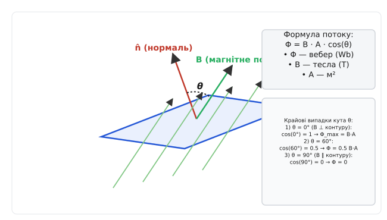
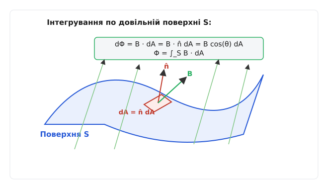
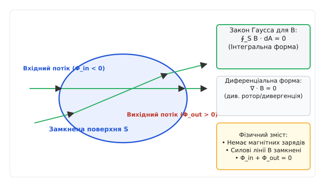
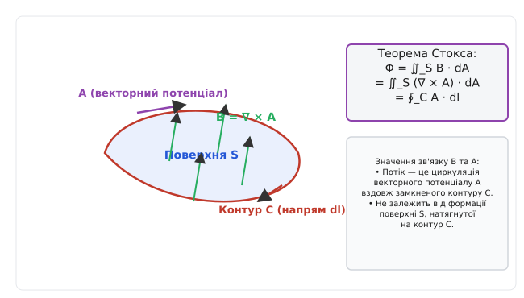

# Магнітний потік

<preknowlist>
- [Магнітне поле та вектор B](root:ph-electromagnetism/magnetic-field) — фізичний зміст індукції B та силових ліній.
- [Скалярний добуток векторів](root:math-algebra/dot-product) — проекція одного вектора на інший та кутова залежність.
- [Поверхневий інтеграл](root:math-analysis/surface-integral) — інтегрування векторного поля по довільній поверхні.
</preknowlist>

Коли розробник розраховує силовий імпульсний трансформатор, індукційний двигун або чутливу вимірювальну котушку, знання величини магнітної індукції `B` в одній точці простору виявляється недостатнім. Для визначення наведеної електрорушійної сили, сили механічного притягання ротора чи паразитного наведення на доріжки друкованої плати необхідно знати підсумковий інтегральний обсяг магнітного поля, яке пронизує весь замкнений провідний контур. Якщо повернути рамку зі струмом паралельно лініям поля, індукований струм миттєво зникає, хоча саме поле `B` не змінилося ні на теслу. Поняття **магнітного потоку** кількісно пов'язує векторне поле з геометрією та орієнтацією поверхні, стаючи наріжним каменем усієї макроскопічної електродинаміки та практичної електротехніки.

---

### 1. Фізична суть та кількісна міра магнітного потоку

Магнітна індукція `B` описує силову дію поля в конкретній точці — це локальна, інтенсивна векторна величина, яка вимірюється в теслах (`T`). Вона показує густину силових ліній магнітного поля в даній точці простору. Проте більшість фізичних явищ, від електромагнітної індукції до збереження магнітної енергії, залежать від екстенсивної характеристики — від того, скільки силових ліній перетинають обрану поверхню.

Уявімо плоску рамку площею `A`, розміщену в однорідному магнітному полі `B`. Орієнтацію рамки в просторі визначає вектор одиничної нормалі `n̂` (`|n̂| = 1`), перпендикулярний до її площини. Напрямок `n̂` обирають за правилом правого гвинта відповідно до обраного напрямку обходу межі контуру: якщо пальці правої руки вказують напрямок обходу контуру, то відігнутий великий палець вказує додатний напрямок нормалі `n̂`. Векторний елемент площі визначається як `dA = n̂ · dA`.


*Визначення магнітного потоку Φ = B · A · cos(θ) для плоского контуру та крайові випадки орієнтації.*

Якщо поле `B` є однаковим у всіх точках площі `A`, **магнітний потік** (позначається грецькою літерою **`Φ`**, фі) визначається як скалярний добуток вектора магнітної індукції `B` на вектор площі `A = n̂ · A`:

```
Φ = B · A = |B| · |A| · cos(θ) = B · A · cos(θ)
```

де `θ` — кут між вектором магнітного поля `B` та вектором нормалі `n̂`.

Скалярний добуток відображає фундаментальну геометричну суть потоку: значення має лише та компонента магнітного поля `B_n = B · cos(θ)`, яка спрямована перпендикулярно до поверхні. Натомість компонента поля `B_t = B · sin(θ)`, паралельна площині контуру, «ковзає» вздовж поверхні й не перетинає її.

Розглянемо чотири характерні орієнтації площини контуру відносно вектора магнітної індукції:
1. **Перпендикулярне поле (`θ = 0°` або `cos(θ) = 1`):** Вектор `B` паралельний нормалі `n̂`. Усі силові лінії пронизують рамку під прямим кутом, і потік є максимально можливим для цієї площі: `Φ_max = B · A`.
2. **Похиле поле (`θ = 60°` або `cos(θ) = 0.5`):** Ефективна проекція поверхні, перпендикулярна до поля, зменшується вдвічі, тому потік дорівнює `Φ = 0.5 · B · A`.
3. **Паралельне поле (`θ = 90°` або `cos(θ) = 0`):** Вектор `B` перпендикулярний до нормалі `n̂`. Силові лінії поля проходять паралельно площині рамки, жодна лінія не перетинає поверхню, і потік дорівнює нулю: `Φ = 0`.
4. **Протилежно спрямоване поле (`θ = 180°` або `cos(θ) = -1`):** Лінії поля входять із тильного боку поверхні відносно обраного напрямку нормалі, потік отримує від'ємний знак: `Φ = -B · A`.

Знак магнітного потоку залежить від вибору напрямку нормалі `n̂`. Для незамкнених поверхонь напрямок `n̂` за домовленістю пов'язують із напрямком струму або обходу контуру за правилом правого гвинта. Якщо пальці правої руки стиснути вздовж обраного напрямку обходу рамки, то відігнутий великий палець вкаже додатний напрямок нормалі.

Одиницею вимірювання магнітного потоку в Міжнародній системі одиниць SI є **вебер** (**Wb**, українське **Вб**), названий на честь видатного німецького фізика Вільгельма Вебера.

```
1 Wb = 1 T · m² = 1 V · s = 1 kg · m² · s⁻² · A⁻¹
```

Один вебер дорівнює магнітному потоку однорідного поля індукцією `1 тесла` через плоску поверхню площею `1 квадратний метр`, розташовану перпендикулярно до вектора поля. 

Розмірність `1 Wb = 1 V · s` підкреслює фундаментальний динамічний зв'язок: потік чисельно дорівнює часовому інтегралу (вольт-секундній площі) наведеної напруги електрорушійної сили. Якщо потік через контур лінійно зменшується від `1 Вб` до нуля за `1 секунду`, у контурі наводиться електрорушійна сила величиною в `1 вольт`. 

У позасистемній електромагнітній системі СГСМ (CGS) одиницею магнітного потоку є **максвелл** (**Mx**), причому `1 Wb = 10⁸ Mx`. Оскільки `1 T = 10⁴ Gs` (гаусс), а `1 m² = 10⁴ cm²`, співвідношення між системами виводиться як `1 Wb = 10⁴ Gs · 10⁴ cm² = 10⁸ Mx`. В історичних фізичних публікаціях та при вимірюваннях слабких геомагнітних полів часто зустрічаються співвідношення в максвеллах та гаусах, що вимагає точного переведення в одиниці SI при сучасному проектуванні.

Магнітний потік є інтегративним інваріантом поля. У той час як вектор `B` відображає локальну напруженість у точці, потік `Φ` показує загальну «кількість» поля, яка зв'язана з геометричним контуром. Це робить потік ключовою величиною при розрахунках індуктивності, збереженої енергії та силової взаємодії в електромагнітних пристроях.

Порівняно з електричним потоком `Φ_E = ∫ E · dA`, який вимірюється у вольт-метрах (`V · m`) і визначається наявними точковими електричними зарядами `Q`, магнітний потік виражається у вольт-секундах (`V · s`) і описує вихрову замкнену структуру магнітних ліній. Геометрично вектор площі `A` можна подати як орієнтований майданчик, орієнтація якого визначає знак потоку при зміні напрямку силових ліній поля `B`.

Детальний аналіз історичного шляху від експериментів Майкла Фарадея з силовими трубками до прийняття вебера у системі SI наведено у матеріалі [📜 Історія поняття магнітного потоку: від симетрії Фарадея до вебера](root:ph-electromagnetism/magnetic-flux/hist-weber.md).

---

### 2. Загальне визначення: поверхневий інтеграл та неоднорідні поля

У більшості практичних задач магнітне поле `B(r)` змінюється від точки до точки, а поверхня `S`, обмежена замкненим провідним контуром, може мати складну викривлену форму.


*Поверхневий інтеграл dΦ = B · dA для викривленої поверхні або неоднорідного магнітного поля.*

Щоб визначити потік у загальному випадку, поверхню `S` розбивають на множину нескінченно малих елементів площі `dA`. Настільки малих, що в межах кожного елемента поле `B` можна вважати однорідним, а сам майданчик — плоским. Елементарний магнітний потік `dΦ` через майданчик `dA` дорівнює:

```
dΦ = B · dA = B · n̂ · dA = B · cos(θ) · dA
```

Повний магнітний потік через усю поверхню `S` є сумою елементарних потоків, тобто поверхневим інтегралом второго роду від вектора індукції:

```
Φ = ∫_S B · dA = ∫_S B · n̂ · dA
```

Обчислення даного інтеграла вимагає вибору системи координат, узгодженої з симетрією фізичної задачі.

У декартовій системі координат `(x, y, z)` поверхневий інтеграл розкладається через проекції поля на координатні площини:

```
Φ = ∬_S (B_x · dy dz + B_y · dz dx + B_z · dx dy)
```

У циліндричній системі координат `(r, φ, z)` елемент площі бічної поверхні циліндра радіусом `R` дорівнює `dA = R dφ dz`, а потік обчислюється як:

```
Φ = ∬_S B_r(R, φ, z) · R dφ dz
```

У сферичній системі координат `(r, θ, φ)` елемент поверхні сфери радіусом `R` становить `dA = R² sin(θ) dθ dφ`, а потік радіальної компоненти індукції дорівнює:

```
Φ = ∬_S B_r(R, θ, φ) · R² sin(θ) dθ dφ
```

При інтегруванні важливо стежити за неперервністю поля орієнтованих нормалей `n̂`. Для гладких поверхонь орієнтація задається узгоджено по всій площі. Якщо поверхня складена з декількох окремих граней (наприклад, куб, призма або циліндр з основними кришками), повний потік обчислюється як алгебраїчна сума потоків через кожну грань.

Аналітичне інтегрування неоднорідних полів виконується для фундаментальних конфігурацій: магнітного поля диполя, поля прямого провідника зі струмом, коаксіального кабелю, кругового витка та тороїда. У задачах з неоднорідними магнітними матеріалами та складною геометрією проводять чисельне інтегрування.

Строгі математичні виведення та приклади інтегрування потоку для прямокутного контуру поруч із нескінченним провідником зі струмом, коаксіального кабелю та соленоїда зібрано у вставці [🧮 Обчислення магнітного потоку для фундаментальних геометрій та закону Гаусса](root:ph-electromagnetism/magnetic-flux/math-flux-geometry.md).

#### Потокозчеплення та багатовиткові котушки

У трансформаторах, реакторах, реле та обмотках електричних двигунів провідник згорнуто у котушку з `N` витків. Магнітне поле пронизує кожен виток, і загальний електродинамічний ефект є сумою потоків усіх окремих витків.

Сума магнітних потоків через усі `N` витків обмотки називається **потокозчепленням** (*flux linkage*) і позначається літерою **`Ψ`** (або `λ`):

```
Ψ = ∑_{i=1}^{N} Φ_i
```

Якщо силові лінії поля пронизують усі `N` однакові витки однаково (`Φ₁ = Φ₂ = ... = Φ_N = Φ`), що є типовим для щільно намотаних котушок на ферромагнітних осередках, то потокозчеплення дорівнює добутку кількості витків на потік одного витка:

```
Ψ = N · Φ = N · B · A
```

Потокозчеплення вимірюється у веберах (`Wb`). Для уникнення плутанини в електротехнічних розрахунках часто вказують одиницю «вебер-виток» (`Wb-turns`). Потокозчеплення `Ψ` пов'язує струм `I`, що протікає по обмотці, з її **власною індуктивністю** `L`:

```
L = Ψ / I = (N · Φ) / I
```

Якщо в системі є дві взаємопов'язані котушки (наприклад, первинна й вторинна обмотки силового трансформатора), потік `Φ₁₂`, створений струмом первинної котушки `I₁`, пронизує `N₂` витків вторинної котушки. Це визначає **взаємну індуктивність** `M₁₂`:

```
Ψ₂₁ = N₂ · Φ₁₂ = M₁₂ · I₁
```

Частина потоку `Φ_l` (*leakage flux*), яка замкнена через повітря й не пронизує вторинну обмотку, утворює потік розсіювання. Коефіцієнт магнітного зв'язку `k` визначається як співвідношення взаємної індуктивності до середнього геометричного власних індуктивностей:

```
k = M₁₂ / √(L₁ · L₂)
```

В ідеальному трансформаторі без розсіювання `k = 1`, а весь потік є спільним для обох обмоток. У реальних імпульсних трансформаторах коефіцієнт зв'язку становить `k = 0.95`–`0.99`, а потік розсіювання викликає паразитичні сплески напруги на силових ключах при комутації. Взаємну індуктивну матрицю систем із багатьма обмотками описують симетричним тензором індуктивностей.

---

### 3. Закон Гаусса для магнітного поля: Друге рівняння Максвелла

Фундаментальна відмінність магнітного поля від електричного поля полягає у відсутності магнітних зарядів. Електричні заряди існують окремо — додатні й від'ємні, і лінії електричного поля `E` починаються на позитивних зарядах та закінчуються на негативних. У магнітному полі ізольованих точкових джерел (магнітних монополів) у природі не знайдено.

Це фундаментальне спостереження підсумовує **закон Гаусса для магнітного поля**, який становить друге фундаментальне рівняння Максвелла.


*Друге рівняння Максвелла ∮ B · dA = 0: замкненість силових ліній магнітного поля та відсутність магнітних монополів.*

#### Інтегральна форма закону Гаусса

Магнітний потік вектора індукції `B` через будь-яку **замкнену** поверхню `S` (будь-якої форми, розміру та об'єму) тотожно дорівнює нулю:

```
∮_S B · dA = 0
```

Кружечок на знакові інтеграла означає інтегрування по замкненій поверхні, а вектор нормалі `n̂` за домовленістю завжди спрямований **зовні** охопленого об'єму.

Фізичний та геометричний зміст цього закону полягає у тому, що силові лінії магнітного поля не мають ані початку, ані кінця. Скільки ліній магнітного поля входить усередину замкненого об'єму (вхідний від'ємний потік `Φ_in < 0`), стільки ж силових ліній неминуче виходить з нього назовні (вихідний додатний потік `Φ_out > 0`). Сумарний баланс потоку через замкнену оболонку завжди рівний нулю: `Φ_in + Φ_out = 0`.

Якщо розділити замкнену поверхню на дві частини, натягнуті на один і той самий контур, то потік через одну частину поверхні точно дорівнює потоку через другу частину, але з протилежним знаком.

#### Диференціальна форма закону Гаусса

Застосовуючи теорему Остроградського-Гаусса (теорему про дивергенцію), переходимо від поверхневого інтеграла по замкненій поверхні `S` до об'ємного інтеграла по охопленому об'єму `V`:

```
∮_S B · dA = ∫_V (∇ · B) dV = 0
```

Оскільки це співвідношення має справджуватися для будь-якого довільно обраного об'єму `V`, підінтегральний вираз мусить бути тотожним нулю в кожній точці простору. Це дає **диференціальну форму второго рівняння Максвелла**:

```
∇ · B = 0
```

де `∇ · B = div B` — дивергенція (розбіжність) векторного поля магнітної індукції `B`.

Рівність `div B = 0` означає:
- Магнітне поле є **соленоїдальним** (вихровим) полем у всіх точках простору.
- Поле `B` не має точкових джерел або стоків (магнітних зарядів).
- Силові лінії магнітної індукції є **неперервними й замкненими самі на себе** (або йдуть у нескінченність).

Порівняння законів Гаусса для електричного й магнітного полів ілюструє фундаментальну властивість симетрії електродинаміки:

```
Електричне поле E:    ∮_S E · dA = Q_encl / ε₀     ∇ · E = ρ / ε₀   (джерела є — заряди ρ)
Магнітне поле B:      ∮_S B · dA = 0               ∇ · B = 0        (джерел немає)
```

Відсутність магнітних монополів гарантує, що при розрізанні постійного магніту навпіл ми ніколи не отримаємо окремий північний чи південний полюс — замість цього утворюються два нових повноцінних магніти, кожен зі своїми N та S полюсами. Хоча квантова теорія поля допускає існування гіпотетичних монополів Дірака з зарядом `g = n h / (2 e)`, експериментально у класичному макроскопічному світі соленоїдальність `∇ · B = 0` справджується з найвищою точністю.

---

### 4. Зв'язок із електромагнітною індукцією та векторним потенціалом

Поняття магнітного потоку є центральним у двох найважливіших розділах теоретичної та прикладної електродинаміки: законі індукції Фарадея та концепції векторного потенціалу `A`.

#### Закон електромагнітної індукції Фарадея

Стаціонарний магнітний потік сам по собі не створює електричного поля. Проте **зміна магнітного потоку в часі** створює вихрове електричне поле та наводить електрорушійну силу (ЕРС) у замкненому контурі:

```
E = - dΨ / dt = - N · (dΦ / dt)
```

Знак мінус у цій формулі виражає **закон Ленца**: наведений у контурі струм завжди спрямований так, що створене ним власне магнітне поле протидіє зміні первинного магнітного потоку.

Зміна магнітного потоку `dΦ/dt` може виникати внаслідок трьох незалежних фізичних механізмів:
1. **Зміна індукції поля в часі (`dB/dt ≠ 0`):** Поле змінюється за величиною у нерухомому контурі (трансформаторна ЕРС, принцип дії силових трансформаторів, індукційних печей та дроселів).
2. **Зміна площі контуру в часі (`dA/dt ≠ 0`):** Контур деформується або розширюється у постійному полі (моційна ЕРС, трансформація механічної роботи в електричну).
3. **Обертання контуру в полі (`dθ/dt ≠ 0`):** Контур змінює кут відносно ліній поля (принцип дії генераторів змінного струму на гідро-, теплових та атомних електростанціях).

Загальна вихрова ЕРС описується повним диференціалом потоку й об'єднує всі три ефекти в єдиному формулюванні Фарадея. Інтегрування напруги індукції в часі дає прямий шлях до вимірювання зміни потоку у балістичних флюксметрах.

#### Магнітний потік через векторний потенціал A

Оскільки дивергенція магнітного поля тотожно дорівнює нулю (`∇ · B = 0`), векторне поле `B` завжди можна подати як ротор іншого векторного поля — **магнітного векторного потенціалу** `A`:

```
B = ∇ × A
```


*Обчислення потоку Φ через циркуляцію векторного потенціалу A вздовж контуру C.*

Підставимо `B = ∇ × A` у визначення магнітного потоку `Φ` через поверхню `S`, обмежену замкненим контуром `C`:

```
Φ = ∫_S B · dA = ∫_S (∇ × A) · dA
```

Застосовуючи **теорему Стокса**, перетворимо поверхневий інтеграл від ротора `∇ × A` на лінійний інтеграл (циркуляцію) вектора `A` вздовж замкненого контуру `C`:

```
Φ = ∮_C A · dl
```

Це математичне співвідношення має глибокий фізичний зміст: **магнітний потік через поверхню дорівнює циркуляції векторного потенціалу A вздовж її межі (контуру C)**.

Фундаментальний наслідок полягає у тому, що магнітний потік `Φ` взагалі не залежить від того, яку саме поверхню `S` натягнуто на замкнений контур `C` — плоску, сферичну чи конусоподібну. Для будь-якої поверхні з однією і тією самою межею `C` потік є абсолютно однаковим.

Ця властивість відіграє ключову роль у квантовій механіці (ефект Ааронова-Бома), де електрон відчуває векторний потенціал `A` і зміну фази своєї хвильової функції при русі вздовж контуру `C` навіть у тій області простору, де саме магнітне поле `B` дорівнює нулю (наприклад, зовні довгого ідеального соленоїда). Зсув фази хвильової функції електрона пропорційний саме магнітному потоку: `Δφ = (e / ħ) · ∮ A · dl = (e / ħ) · Φ`.

#### Калібрувальна інваріантність векторного потенціалу

Векторний потенціал `A` визначений з точністю до градієнта довільної скалярної функції `ψ(r)` (калібрувальне перетворення `A' = A + ∇ψ`). Проте циркуляція градієнта вздовж замкненого контуру `C` завжди дорівнює нулю:

```
∮_C ∇ψ · dl = ψ(кінець) - ψ(початок) = 0
```

Тому магнітний потік `Φ = ∮ A · dl` є строго калібрувально-інваріантною фізичною величиною. Незалежно від вибору калібрування (кулонівського `∇ · A = 0` чи лоренцівського `∇ · A + (1/c²) ∂φ/∂t = 0`), обчислений магнітний потік залишається незмінним. На межі двох середовищ із різними магнітними проникностями умова неперервності нормальної компоненти `B_{1n} = B_{2n}` прямо еквівалентна неперервності тангенціальної компоненти векторного потенціалу `A`.

---

### 5. Аналіз магнітних кіл та закон Гопкінсона

У силовій електротехніці та розрахунку трансформаторів використовується аналогія між електричним колом та магнітним колом. Ця аналогія базується на **законі Гопкінсона** (магнітному аналогу закону Ома).

Для замкненого магнітопроводу з довжиною середньої лінії `L_m`, площею перерізу `A_m` та відносною магнітною проникністю матеріалу `μ_r` магнітний потік `Φ` обчислюється як:

```
Φ = F_m / R_m
```

де:
- `F_m = N · I` — **магніторушійна сила (МРС)**, вимірюється в ампер-витках (`A` або `A-turns`), аналог ЕРС в електричному колі.
- `R_m = L_m / (μ₀ · μ_r · A_m)` — **магнітний опір (релюктанс)** середовища, вимірюється в `Гн⁻¹` або `А/Вб`, аналог електричного опору.

Величину, обернену до релюктансу, називають магнітною провідністю або **пермеансом** (`P_m = 1 / R_m`).

Закон Гопкінсона дозволяє розраховувати складні розгалужені магнітопроводи за допомогою правил Кірхгофа для магнітних кіл:
1. **Перше правило Кірхгофа для магнітного кола:** Сума магнітних потоків у вузлі розгалуження магнітопроводу дорівнює нулю: `∑ Φ_i = 0` (що є безпосереднім наслідком закону Гаусса `∇ · B = 0`).
2. **Друге правило Кірхгофа для магнітного кола:** Алгебраїчна сума магніторушійних сил у замкненому контурі магнітопроводу дорівнює сумі падінь магнітної напруги на ділянках кола: `∑ (N_i · I_i) = ∑ (Φ_k · R_{m, k})`.

Енергія магнітного поля `W_m`, збережена в об'ємі магнітопроводу `V_m`, прямо пропорційна квадрату потоку:

```
W_m = 0.5 · R_m · Φ² = 0.5 · (L_m / (μ₀ · μ_r · A_m)) · Φ²
```

Густина магнітної енергії `w_m` (Дж/м³) пов'язана з індукцією співвідношенням `w_m = B² / (2 · μ₀ · μ_r)`. 

Механічна сила `F_mag`, з якою намагнічений ферромагнітний сердечник притягує якість реле або ротор електродвигуна, визначається як похідна від збереженої магнітної енергії за просторовим переміщенням `x`:

```
F_mag = - dW_m / dx = (B² · A_m) / (2 · μ₀) = Φ² / (2 · μ₀ · A_m)
```

Ця формула (тиск тензора напружень Максвелла) підкреслює, що механічне зусилля електродвигуна прямо пропорційне квадрату магнітного потоку в повітряному зазорі.

Наявність вузького повітряного зазору товщиною `g` у феромагнітному магнітопроводі значно збільшує загальний релюктанс `R_m`, оскільки відносна проникність повітря дорівнює одиниці (`μ_r = 1`), що у тисячі разів менше за проникність сталі (`μ_r = 2000`–`5000`). Ефективний магнітний опір зазору `R_g = g / (μ₀ · A_g)` може в рази перевищувати опір усього сталевого магнітопроводу. Повітряний зазор дозволяє запасати у своєму об'ємі до 90% усієї магнітної енергії силового дроселя, запобігаючи передчасному магнітному насиченню феромагнетика при великих струмах.

При розрахунку зазорів також враховують ефект «опухання» або випучування силових ліній магнітного поля на краях зазору (*fringing effect*), що збільшує ефективну площу зазору `A_g ≈ (a + g) · (b + g)` та трохи знижує його релюктанс.

У нелінійних ферромагнітних матеріалах магнітна проникність `μ_r(B)` залежить від рівня індукції через петлю гістерезису. У таких випадках релюктанс є диференціальною величиною `R_{m, diff} = dL_m / (μ₀ · μ_{diff} · dA_m)`, а розрахунок магнітного кола виконується чисельними ітераційними методами (наприклад, методом Ньютона-Рафсона) з використанням емпіричних характеристик намагнічування `B(H)`. Розрахунок магнітних опорів складної конфігурації у тривимірному просторі є основою інженерного проектування електромагнітів, трансформаторів та електричних машин.

---

### 6. Квантування магнітного потоку у надпровідниках

У макроскопічній класичній фізиці магнітний потік `Φ` є неперервною величиною, яка може набувати будь-яких дійсних значень. Проте у квантовій фізиці та фізиці конденсованого стану при русі електронних пар Купера у надпровідному кільці виникає ефект **квантування магнітного потоку**.

При переході матеріалу в надпровідний стан виталкиваються всі внутрішні магнітні поля (ефект Мейснера-Оксенфельда). Проте якщо надпровідник має отвір або незамкнену топологію кільця, магнітний потік, захоплений усередині отвору, не може змінюватися довільно. Він приймає лише дискретні значення, кратних кванту магнітного потоку **`Φ_0`**:

```
Φ = n · Φ_0 = n · [ h / (2 · e) ]
```

де:
- `h` — стала Планка (`6.62607015 · 10⁻³⁴ Дж·с`),
- `e` — елементарний електричний заряд (`1.602176634 · 10⁻¹⁹ Кл`),
- `n` — ціле число (`n = 0, 1, 2, 3...`).

Чисельне значення кванта магнітного потоку дорівнює:

```
Φ_0 = h / (2 · e) ≈ 2.067833848 · 10⁻¹⁵ Wb (Вб)
```

Множник `2` в знаменнику прямо вказує на те, що носіями надпровідного струму є зв'язані **пари Купера** із зарядом `2e`, а не поодинокі електрони. Якби носіями були поодинокі електрони, квант потоку був би вдвічі більшим (`h / e`).

У надпровідниках II роду магнітне поле проникає всередину матеріалу у вигляді окремих квантованих ниток — вихорів Абрикосова. Кожен такий вихор несе рівно один квант магнітного потоку `Φ_0`. Закріплення вихорів на дефектах кристалічної ґратки (пінінг вихорів) забезпечує високі критичні струми в надпровідних магнітах МРТ та прискорювачах елементарних частинок.

Ефект квантування потоку лежить в основі роботи надчутливих магнітометрів — надпровідних квантових інтерферометрів (СКУІД / SQUID), здатних реєструвати надзвичайно слабкі магнітні поля мозку й серця людини (магнітоенцефалографія) на рівні `10⁻¹⁵ T`. У квантових стандартах напруги квант потоку дозволяє реалізувати еталон вольта через ефект Джозефсона з відносною невизначеністю менше `10⁻¹⁰`.

Топологічна захищеність квантованого потоку в надпровідних кільцях також розглядається як одна з базових фізичних платформ для побудови квантових бітів (потокових кубітів) у надпровідних квантових обчислювачах. Квантовий рух вихорів у надпровідниках створює фазові когерентні стани, які широко застосовуються у квантовій метрології та надчутливих сенсорних мережах.

---

### 7. Обчислення та вимірювання магнітного потоку

На практиці вимірювання та комп'ютерне моделювання магнітного потоку є необхідною умовою проективання надійних електротехнічних пристроїв.

#### Практичні методи вимірювання

Оскільки магнітний потік є інтегральною величиною, його неможливо виміряти безпосередньо статичним давачем у одній точці. Застосовують два основні методи:
1. **Інтегруючий балістичний флюксметр:** Чутлива вимірювальна котушка (*search coil / Helmholtz coil*) підключається до аналогового або цифрового інтегратора. При внесенні котушки в поле або зміні струму джерела інтегратор обчислює часовий інтеграл наведеної напруги: `Φ = ∫ e(t) dt`.
2. **Перетворення через індукційну напругу:** При збудженні котушки змінним струмом частотою `f` амплітуда виміряної напруги `V_rms` пов'язана з максимальним потоком `Φ_max` формулою трансформатора: `V_rms = 4.44 · f · N · Φ_max`.

Застосування поясу Роговського (гнучкої безсердечникової котушки) дозволяє вимірювати високочастотні струми синусоїдної та імпульсної форми шляхом інтегрування магнітного потоку навколо провідника зі струмом. Виміряна ЕРС поясу Роговського прямо пропорційна похідній струму `e(t) = -M · (di/dt)`, тому її інтегрування відновлює амплітуду та форму досліджуваного струму без розриву кола та унесення додаткового опору. Отриманий сигнал характеризується високою лінійністю у широкому частотному діапазоні від частот мережі до мегагерцових імпульсів. Завдяки відсутності залізного осереддя пояс Роговського не піддається магнітному насиченню, що дозволяє вимірювати імпульсні струми у сотні кілоампер.

Детальний технічний довідник апаратної схеми, регістрів та програмного драйвера цифрового флюксметра наведено у матеріалі [📋 Специфікація та API інтерфейсу цифрового флюксметра](root:ph-electromagnetism/magnetic-flux/api-fluxmeter.md).

#### Чисельне моделювання складних геометричних контурів

У сучасних системах автоматизованого проектування (САПР, таких як Ansys Maxwell, COMSOL Multiphysics, CST) магнітне поле обчислюється методом скінченних елементів (FEM). Обчислення потоку виконується шляхом чисельного інтегрування нормальної компоненти індукції по сітці елементів:

```
Φ ≈ ∑_{k} B_{z, k} · dA_k
```

Чисельні квадратурні алгоритми дозволяють оцінити паразитно наведені напруги на сигналні доріжки друкованих плат (PCB crosstalk) від високовольтних та високострумових імпульсних шин у сучасних джерелах живлення.

Готовий приклад розрахункової програми чисельного 2D-інтегрування потоку мовами C та C++ з аналізом похибок подано у вставці [⚙️ Чисельне інтегрування магнітного потоку вздовж складного контуру](root:ph-electromagnetism/magnetic-flux/proj-flux-quadrature.md).

> 🔧 **Навіщо це.** Поняття магнітного потоку визначає фізичні межі потужності та ККД силового обладнання. У силових трансформаторах, дроселях та електродвигунах магнітопровід виготовляють із феромагнітних матеріалів (електротехнічної сталі чи фериту), які мають чітку межу **магнітного насичення** `B_sat` (зазвичай `1.5`–`1.8 T` для сталі, `0.3`–`0.4 T` для фериту). Повний потік `Φ_sat = B_sat · A_core` визначає граничну вольт-секундну площу імпульсу `V · Δt`, яку осереддя перерізом `A_core` здатне передати без переходу у глибоке насичення. Якщо потік перевищує цю межу, диференціальна магнітна проникність матеріалу спадає до одиниці (`μ_r → 1`), а індуктивність обмотки падає в тисячі разів. Це призводить до колосального стрибка струму й аварійного згоряння силових ключових транзисторів у сучасних інверторах та імпульсних джерелах живлення (SMPS). Окрім того, точний розрахунок магнітного потоку є базовим при розробці індукційних плит, систем бездротової передачі енергії (стандарт Qi), високоточних давачів струму Холла та магнітно-резонансних томографів (МРТ).
