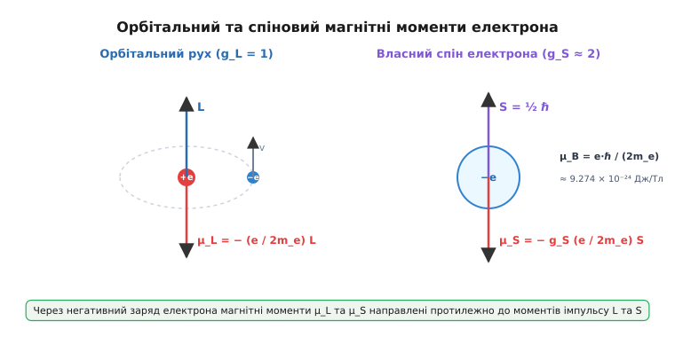

# Магнітний момент: від контуру зі струмом до спіну електрона

<preknowlist>
- [Магнітне поле](topic:ph-electromagnetism/magnetic-field) — векторний опис магнітного поля B, силові лінії та відсутність магнітних зарядів.
- [Сила Ампера](topic:ph-electromagnetism/ampere-force) — сила, що діє на провідник зі струмом у магнітному полі.
- [Електричний струм](topic:ph-electromagnetism/electric-current) — впорядкований рух зарядів та його зв'язок з магнітними явищами.
</preknowlist>

Коли прямокутну рамку зі струмом вміщують у зовнішнє магнітне поле, вона поводиться так, ніби всередині неї захована крихітна стрілка компаса: поле не тягне рамку убік, але з силою намагається її розвернути. Якщо ж те саме поле зробити неоднорідним — піднести до рамки один із полюсів штабового магніту — рамка не лише повернеться, а й почне притягуватися або відштовхуватися. Ця дивовижна схожість між струмовим контуром, штабовим магнітом та окремим атомом не є випадковим збігом. Усі вони володіють єдиною фундаментальною величиною, яка визначає їхню магнітну «силу» та орієнтацію у просторі — **магнітним моментом** (лат. *momentum* — рушійна сила, імпульс).

Магнітний момент — це векторна фізична величина, що є головною кількісною характеристикою магнітних властивостей будь-якої системи: від макроскопічної котушки електромотора до окремого електрона чи ядра атома. Саме магнітний момент визначає як обертальний момент і силу, що діють на об'єкт у зовнішньому полі, так і структуру того магнітного поля, яке цей об'єкт створює навколо себе у просторі.

---

### Від сили Ампера до вектора магнітного моменту

Щоб зрозуміти природу магнітного моменту без абстрактних припущень, розрахуємо силову взаємодію плоского контуру зі струмом у постійному однорідному магнітному полі B. 

Уявимо прямокутну рамку зі сторонами a та b, по якій тече стаціонарний струм I. Рамка закріплена на осі і може вільно обертатися. Нехай вектор магнітної індукції B лежить у площині, перпендикулярній до осі обертання рамки, і утворює кут θ з нормаллю до площини рамки.


*Вектор магнітного моменту μ перпендикулярний до площини контуру зі струмом і напрямлений за правилом правої руки.*

З боку поля B на кожну зі сторін рамки діє [сила Ампера](topic:ph-electromagnetism/ampere-force). На дві протилежні сторони довжиною b, паралельні осі обертання, діють сили:

```
F = I · b · B · sin(90°) = I · b · B
```

Ці дві сили рівні за модулем і протилежно спрямовані. Сумарна сила, що діє на рамку як на ціле, дорівнює нулю (∑ F = 0). Рамка поступально не рухається — у неї немає результуючого прискорення центру мас.

Проте лінії дії цих двох сил не збігаються! Сили утворюють паралельну пару з плечем a · sin θ. Ця пара сил створює обертальний момент τ (грец. *torque*), який намагається розвернути рамку так, щоб зменшити кут θ:

```
τ = F · a · sin θ
= (I · b · B) · a · sin θ
= I · (a · b) · B · sin θ            [групуємо геометричні параметри]
= I · S · B · sin θ                  [оскільки площа рамки S = a · b]
```

Звернемо увагу на добуток I · S. Геометрія рамки (довжини сторін a та b) повністю згорнулася в єдиний геометричний параметр — **площу контуру S**. 

Що станеться, якщо контур має складну або непрямокутну форму? Будь-яку плоску або навіть тривимірну викривлену поверхню, натягнуту на контур, можна уявним чином розбити на сітку із безлічі крихітних елементарних прямокутних комірок. Якщо по контуру кожної такої комірки пустити струм I у тому самому напрямку, то струми на всіх внутрішніх спільних межах сусідніх комірок тектимуть у протилежних напрямках і повністю взаємно анулюються. Ненекомпенсованим залишиться лише струм I на зовнішньому контурі. Оскільки сумарний обертальний момент дорівнює сумі моментів усіх елементарних комірок, висновок залишається строгим: для будь-якого замкненого плоского контуру обертальний момент залежить виключно від добутку струму на загальну площу S.

Це дає підстави ввести векторну величину, що описує даний контур. **Векторний магнітний момент** μ (або m) плоского контуру зі струмом за означенням дорівнює:

```
μ = I · S · n
```

де I — сила струму в контурі, S — площа, охоплена контуром, а 
 — одиничний вектор нормалі до площини контуру. Напрям нормалі 
 строго пов'язаний напрямком течії струму **правилом правої руки**: якщо чотири пальці правої руки зігнути за напрямком струму в контурі, то відведений на 90° великий палець вкаже напрям вектора магнітного моменту μ.

У системі СІ магнітний момент вимірюється в **ампер-квадратних метрах** (А·м²), що тотожно дорівнює **джоулю на теслу** (Дж/Тл). 

Використовуючи векторний добуток, вираз для обертального моменту τ, що діє на контур у магнітному полі, набуває компактної векторної форми:

```
τ = μ × B
```

Модуль обертального моменту дорівнює |τ| = |μ| · |B| · sin θ. Ця формула є фундаментальним законом електродинаміки: зовнішнє магнітне поле завжди намагається повернути магнітний момент так, щоб вектор μ збігся за напрямком із вектором індукції поля B.

Мікроскопічним джерелом сили Ампера є сила Лоренца F = q (v × B), що діє на кожен окремий впорядкований носій заряду всередині провідника. Передача механічного моменту від рухомих електронів до кристалічної ґратки металу відбувається за рахунок внутрішніх електричних полів поперечного зсуву носіїв (ефект Холла).

Якщо контур складається не з одного витка, а з N щільно намотаних витків провідника (як у соленоїді чи обмотці ротора), магнітні моменти окремих витків додаються векторно, і сумарний момент котушки стає рівним μ = N · I · S · n.

Детальний [математичний вивід розкладу векторного потенціалу](topic:ph-electromagnetism/magnetic-moment/math-magnetic-multipole.md) доводить, що формула μ = ½ ∫ (r × j) d³r є загальною для довільного об'ємного розподілу струмів j(r).

---

### Потенціальна енергія та орієнтація диполя у полі

Оскільки зовнішнє магнітне поле створює обертальний момент, для повороту магнітного диполя на певний кут необхідно виконати роботу проти сил поля. Це означає, що магнітний диполь у зовнішньому полі має **потенціальну енергію** взаємодії U.


*У зовнішньому полі B обертальний момент намагається розвернути вектор μ паралельно до поля, мінімізуючи потенціальну енергію диполя.*

Елементарна робота dW, яку виконує зовнішнє поле при повороті вектора μ на малий кут dθ, дорівнює dW = − τ dθ = − |μ| · |B| · sin θ dθ. Потенціальна енергія визначається як інтеграл цієї роботи з протилежним знаком:

```
U(θ) = − ∫ τ dθ 
= − |μ| · |B| · cos θ + C
```

У фізиці за точку відліку нульової потенціальної енергії (C = 0) приймають перпендикулярне положення вектора моменту відносно поля (θ = 90°). У результаті отримуємо формулу скалярного добутку:

```
U = − μ · B
```

Проаналізуємо три ключові орієнтації диполя у полі:

1. **Паралельна орієнтація (θ = 0°, μ ↑↑ B):**
   Потенціальна енергія мінімальна: U[min] = − |μ| · |B|. Обертальний момент дорівнює нулю (τ = 0). Це стан **стійкої рівноваги**. Будь-яке випадкове відхилення викликає повертаючий момент, який прагне повернути диполь у це положення.

2. **Перпендикулярна орієнтація (θ = 90°, μ ⊥ B):**
   Потенціальна енергія дорівнює нулю: U = 0. Обертальний момент сягає максимального значення: τ[max] = |μ| · |B|.

3. **Антипаралельна орієнтація (θ = 180°, μ ↑↓ B):**
   Потенціальна енергія максимальна: U[max] = + |μ| · |B|. Обертальний момент дорівнює нулю (τ = 0), але це стан **нестійкої рівноваги**. Найменше збурення призводить до того, що диполь починає повертатися, скидаючи потенціальну енергію і прямуючи до стану з θ = 0°.

Принцип мінімуму потенціальної енергії пояснює, чому всі вільні магнітні диполі — від стрілки компаса у полі Землі до атомних магнітних моментів у феромагнетику — прагнуть вишикуватися уздовж силових ліній зовнішнього поля.

#### Крутильні коливання диполя у полі
Якщо магнітний диполь із моментом інерції I[rot] відхилити від стану рівноваги на малий кут θ << 1, то повертаючий момент можна наблизити як τ ≈ − μ · B · θ. Рівняння руху обертання набуває вигляду гармонічного осцилятора:

```
I[rot] · (d²θ / dt²) + μ · B · θ = 0
```

Диполь здійснюватиме крутильні коливання з власною частотою f = (1 / 2π) √( (μ · B) / I[rot] ). Вимірювання періоду таких коливань є одним із класичних експериментальних способів точного визначення магнітних моментів зразків.

> 🔧 **Навіщо це.** Електродвигуни постійного та змінного струму працюють завдяки обертальному моменту τ = μ × B. У роторі двигуна створюється магнітний момент μ (струмом в обмотці або постійними неодимовими магнітами), а статор створює обертове магнітне поле B. Поле статора неупинно тягне за собою магнітний момент ротора, примушуючи вал двигуна обертатися й виконувати механічну роботу.

---

### Неоднорідне поле: чому магніт притягує залізо

В однорідному магнітному полі (B = const) на диполь діє лише обертальний момент, а результуюча сила дорівнює нулю (∑ F = 0). Диполь повертається, але не зміщується як ціле. Чому ж тоді звичайний постійний магніт притягує ненамагнічену залізну скріпку чи цвях?

Відповідь полягає в тому, що поле штабового магніту є **неоднорідним** — його силові лінії розходяться у просторі, а індукція B змінюється від точки до точки (∇B ≠ 0).


*У неоднорідному полі результуюча сила втягує диполь у бік сильнішого поля при паралельній орієнтації та виштовхує при антипаралельній.*

Розглянемо рамку зі струмом у полі, індукція якого зростає вздовж осі Z. Сили Ампера, що діють на протилежні боки рамки, тепер **не рівні** за модулем: на той бік рамки, який перебуває в області сильнішого поля, діє більша сила, ніж на протилежний бік у слабшому полі. 

Різниця цих сил дає результуючу поступальну силу F, що діє на диполь як ціле. Сила виражається через градієнт (похідну за координатами) потенціальної енергії:

```
F = − ∇ U = ∇ (μ · B)
```

Якщо магнітний момент μ вже розвернувся паралельно до поля B (θ = 0°), то μ · B = |μ| · B[z]. У цьому випадку вектор результуючої сили дорівнює:

```
F[z] = μ[z] · (∂B[z] / ∂z)
```

З цієї формули випливають два фундаментальні наслідки:

- Якщо магнітний момент орієнтований **вздовж поля** (μ[z] > 0), сила F[z] спрямована у бік **зростання поля** (∂B[z]/∂z > 0). Диполь втягується в область сильнішого поля.
- Якщо магнітний момент орієнтований **проти поля** (μ[z] < 0), сила F[z] спрямована у бік **зменшення поля**. Диполь виштовхується з поля.

Тепер стає зрозумілим механізм притягання незарядженого шматка заліза до магніту. Поле магніту спочатку намагнічує залізо — повертає його внутрішні мікроскопічні магнітні моменти паралельно до зовнішнього поля (μ ↑↑ B). Після цього неоднорідне поле починає втягувати ці паралельно орієнтовані моменти в область найвищої густини силових ліній — тобто до полюса магніту. Незалежно від того, яким полюсом (N чи S) піднести магніт до заліза, залізо завжди буде притягуватися!

Властивість неоднорідного поля розділяти частинки з різною орієнтацією магнітного моменту лягла в основу експерименту Штерна — Герлаха. Докладну [історію розгортання цієї гіпотези](topic:ph-electromagnetism/magnetic-moment/hist-magnetic-moment.md) висвітлено у відповідній історичній вставці.

---

### Власне поле диполя та взаємодія двох диполів

Магнітний момент є не лише «приймачем», який реагує на зовнішнє поле B, але й «джерелом», яке створює власне магнітне поле у навколишньому просторі. 

На великих відстанях від контуру (
 >> d, де d — розміри контуру) геометрія самого провідника втрачає значення. Поле повністю визначається єдиним вектором — магнітним моментом μ. Індукція дипольного магнітного поля B(r) у точці з радіус-вектором 
 виражається формулою:

```
B(r) = (μ₀ / (4π · r³)) · [ 3 · (μ · r̂) · r̂ − μ ]
```

де μ₀ = 4π × 10⁻⁷ Гн/м — магнітна стала, а 
̂ = r / r — одиничний вектор у напрямку точки спостереження.

Розглянемо значення поля у двох характерних анатомічних областях диполя:

1. **На осі диполя (θ = 0°, точка лежить на прямій вектора μ):**
   Вектори μ та 
̂ паралельні. Формула дає:
```
   B[осьове] = (μ₀ / (2π · r³)) · μ
```
   Поле на осі спрямоване в той самий бік, що й вектор μ, і спадає з відстанню як 1 / r³.

2. **На екваторі диполя (θ = 90°, точка у площині контуру):**
   Вектори μ та 
̂ перпендикулярні (μ · r̂ = 0). Формула дає:
```
   B[екватор] = − (μ₀ / (4π · r³)) · μ
```
   Поле на екваторі спрямоване протилежно до вектора μ і за модулем у два рази менше, ніж на такій самій відстані на осі.

Геометрична картина силових ліній магнітного диполя повністю тотожна картині точкового електричного диполя. Проте існує принципова відмінність всередині самого джерела: лінії електричного поля починаються на позитивному заряді й закінчуються на негативному, тоді як силові лінії магнітного поля є незамкненими безперервними петлями, які проходять крізь центр контуру наскрізь (бо у природі немає [магнітних монополів](topic:ph-electromagnetism/magnetic-monopole)).

#### Потенціальна енергія взаємодії двох диполів
Підставивши вираз для поля першого диполя B₁ у формулу енергії другого диполя U₁₂ = − μ₂ · B₁, отримуємо енергію прямої диполь-дипольної взаємодії у вакуумі на відстані R:

```
U₁₂ = (μ₀ / (4π · R³)) · [ (μ₁ · μ₂) − 3 · (μ₁ · R̂) · (μ₂ · R̂) ]
```

З цієї формули видно, чому два штабові магніти, покладені «ланцюжком» один за одним (полюси N–S–N–S), притягуються, а покладені боком до боку паралельно (N–N поруч) — відштовхуються. Енергія диполь-дипольної взаємодії пропорційна 1 / R³ і є головним механізмом спін-спінового розщеплення спектрів у ядерному магнітному резонансі та спіновій релаксації.

---

### Орбітальний магнітний момент рухомого заряду

Оскільки електричний струм — це впорядкований рух заряджених частинок, будь-яка заряджена частинка, що рухається коловою орбітою, утворює мікроскопічний струмовий контур і володіє **орбітальним магнітним моментом**.

Розглянемо електрон масою m[e] із зарядом q = −e, який рухається зі швидкістю v по коловій орбіті радіуса 
 навколо ядра атома.


*Орбітальний та спіновий магнітні моменти електрона спрямовані протилежно до відповідних моментів імпульсу через негативний знак заряду.*

Період обертання електрона по орбіті дорівнює T = (2π · r) / v. Еквівалентний струм I, що проходить через переріз орбіти за одиницю часу:

```
I = e / T = (e · v) / (2π · r)
```

Площа колової орбіти дорівнює S = π · r². За означенням, модуль орбітального магнітного моменту μ[L] дорівнює:

```
μ[L] = I · S 
= [ (e · v) / (2π · r) ] · (π · r²)
= ½ · e · v · r
```

Пов'яжемо магнітний момент із механічним **орбітальним моментом імпульсу** електрона L = m[e] · v · r. Виразивши добуток v · r = L / m[e] і підставивши його у формулу моменту, отримуємо:

```
μ[L] = (e / (2 · m[e])) · L
```

Зважаючи на напрямки векторів та від'ємний знак заряду електрона (q = −e), у векторній формі це співвідношення набуває вигляду:

```
μ[L] = − (e / (2 · m[e])) · L
```

Знак «мінус» показує, що через від'ємний заряд електрона вектор його орбітального магнітного моменту μ[L] спрямований **протилежно** до вектора механічного моменту імпульсу L!

Відношення магнітного моменту частинки до її механічного моменту імпульсу називається **гіромагнітним відношенням** (грец. *gyros* — коло, обертання):

```
γ = μ / L = q / (2 · m)
```

Для орбітального руху електрона класичне гіромагнітне відношення дорівнює γ[L] = − e / (2 m[e]).

#### Ларморівська прецесія
Коли електрон із магнітним моментом μ[L] та моментом імпульсу L потрапляє в зовнішнє магнітне поле B, на нього діє обертальний момент τ = μ[L] × B. Згідно зі звичайним рівнянням динаміки обертання, dL / dt = τ. Оскільки τ завжди перпендикулярний до L, модуль моменту імпульсу |L| та кут з полем не змінюються, але вектор L починає описувати конус навколо напрямку вектора B.

Цей рух називається **прецесією Лармора** (на честь ірландського фізика Джозефа Лармора). Вектор моменту імпульсу і зв'язаний з ним магнітний момент обертаються з кутовою частотою Лармора:

```
ω[L] = |γ| · B = (e / (2 · m[e])) · B
```

Ларморівська прецесія є фундаментальною основою явищ діамагнетизму, а також усіх резонансних методів (ЯМР, ЕПР).

#### Квантування та магнетон Бора
У квантовій механіці момент імпульсу електрона в атомі не може бути довільним — він квантується і виражається через зведену сталу Планка ℏ = h / 2π. Найменше можливе ненульове значення проекції орбітального моменту імпульсу дорівнює L[z] = ℏ.

Підставивши L = ℏ у формулу орбітального моменту, отримуємо природну квантову одиницю магнітного моменту — **магнетон Бора** (μ[B]):

```
μ[B] = (e · ℏ) / (2 · m[e]) ≈ 9.274 × 10⁻²⁴ Дж/Тл
```

Магнетон Бора є масштабним еталоном для всіх атомних магнітних явищ.

---

### Квантовий спін та аномальний магнітний момент

Коли у 1920-х роках фізики виміряли власний магнітний момент електрона, пов'язаний із його внутрішнім моментом імпульсу — **спіном** S = ½ ℏ, на них чекало фундаментальне відкриття.

Якщо б для спінового руху працювало класичне гіромагнітне відношення, спіновий магнітний момент мав би дорівнювати μ[S] = − (e / (2 m[e])) · S = ½ μ[B]. Проте експерименти однозначно показали, що спіновий магнітний момент електрона практично точно дорівнює **одному цілому магнетону Бора**!

Для опису цієї відмінності вводять безрозмірний **g-фактор Ланде** (*g-factor*):

```
μ = − g · (e / (2 · m[e])) · S
```

Для орбітального руху g[L] = 1. А для спіну електрона g-фактор виявився рівним **g[S] ≈ 2**! Це означає, що спін електрона генерує магнітне поле удвічі ефективніше, ніж класичний орбітальний рух з таким самим моментом імпульсу.

У 1928 році Поль Дірак довів, що подвоєне значення g = 2 є прямим наслідком об'єднання квантової механіки зі спеціальною теорією відносності у рівнянні Дірака.

#### Аномальний магнітний момент КЕД
Більш точні вимірювання у 1947 році виявили, що g-фактор електрона трохи перевищує 2: g[e] ≈ 2.0023193. Це мале відхилення дорівнює:

```
a[e] = (g[e] − 2) / 2 ≈ 0.00115965
```

Цю величину називають **аномальним магнітним моментом**. Квантова електродинаміка (КЕД) пояснює аномальний момент тим, що реальний електрон не є «голим» — він неупинно взаємодіє з вакуумними флуктуаціями, випромінюючи та знову поглинаючи віртуальні фотони. Розрахунок Джуліуса Швінґера дає перше теоретичне наближення a[e] = α / (2π) ≈ 0.0011614 (де α ≈ 1/137 — стала тонкої структури).

#### Спін-орбітальна взаємодія та повний момент атома
В багатоелектронних атомах орбітальні моменти електронів L та їхні спінові моменти S пов'язані між собою **спін-орбітальною взаємодією** (внутрішнє магнітне поле орбітального руху діє на спіновий магнітний момент). В результаті формується повний момент імпульсу атома J = L + S.

Сумарний магнітний момент атома визначається ефективним g-фактором Ланде g[J]:

```
g[J] = 1 + [ J(J + 1) + S(S + 1) − L(L + 1) ] / [ 2 · J(J + 1) ]
```

Ця формула дає змогу точно розраховувати магнітні моменти комплексних іонів, атомів рідкісноземельних елементів та перехідних металів.

#### Ефект Зеемана: розщеплення енергетичних рівнів
Коли атом вміщують у зовнішнє магнітне поле B, потенціальна енергія взаємодії магнітного моменту з полем U = − μ · B викликає зміщення та розщеплення його квантових енергетичних рівнів. 

У класичному (нормальному) ефекті Зеемана енергетичний рівень атома з орбітальним моментом L розщеплюється на 2L + 1 рівновіддалених підрівнів:

```
ΔE = m[L] · g[L] · μ[B] · B
```

де m[L] = −L, −L+1, ..., +L — магнітне квантове число. У спектрі це спостерігається як розщеплення однієї спектральної лінії на три компоненти.

В аномальному ефекті Зеемана, коли враховується спіновий магнітний момент електрона (g[S] ≈ 2), енергетичне розщеплення виражається через фактор Ланде: ΔE = m[J] · g[J] · μ[B] · B. Саме вивчення розщеплення спектральних ліній у магнітному полі дало можливість експериментально виміряти g-фактори складних атомних систем і підтвердити квантову теорію моменту імпульсу.

#### Магнітні моменти протона та нейтрона
На відміну від електрона, який є точковою фундаментальною частинкою, протон та нейтрон є складними адронними системами, збудованими з кварків та ґлюонних полів.

Через велику масу протона (m[p] ≈ 1836 m[e]) для ядерних частинок одиницею вимірювання слугує **ядерний магнетон** μ[N] = (e · ℏ) / (2 m[p]) ≈ 5.051 × 10⁻²⁷ Дж/Тл.

Експериментальні значення магнітних моментів нуклонів суттєво відхиляються від продираківських:
- **Протон:** μ[p] = + 2.793 μ[N] (g[p] ≈ + 5.586).
- **Нейтрон:** μ[n] = − 1.913 μ[N] (g[n] ≈ − 3.826).

Те, що електрично нейтральний нейтрон має суттєвий від'ємний магнітний момент, стало історично першим прямим доказом того, що нейтрон не є елементарною частинкою, а має внутрішню структуру із заряджених елементів (заряджених кварків u та d).

Для швидкого пошуку точних числових значень скористайтеся [практичним довідником фундаментальних констант та датчиків](topic:ph-electromagnetism/magnetic-moment/api-magnetic-measurement.md).

---

### Макроскопічне намагнічення та класи речовин

Магнітні властивості макроскопічних тіл (магнітних матеріалів) визначаються векторною сумою магнітних моментів усіх атомів та електронів, що входять до складу речовини.

Векторною характеристикою магнітного стану речовини є **вектор намагніченості** M — це магнітний момент одиниці об'єму речовини:

```
M = (1 / V) · ∑ μ[i]
```

Одиницею вимірювання намагніченості в СІ є **ампер на метр** (А/м).

Повне магнітне поле B всередині речовини складається з зовнішнього поля B₀ = μ₀ H та поля, створеного намагніченістю самої речовини:

```
B = μ₀ · (H + M)
```

За характером підпорядкування атомних магнітних моментів зовнішньому полю всі речовини поділяються на три основні класи:

1. **Діамагнетики (золото, мідь, вода, кремній):**
   Атоми не мають власного постійного магнітного моменту (μ[атом] = 0). Під дією зовнішнього поля B за законом електромагнітної індукції в електронних орбітах наводяться індуковані мікроструми (прецесія Лармора), магнітний момент яких за правилом Ленца спрямований **проти** зовнішнього поля. Внаслідок цього діамагнетики злегка виштовхуються з магнітного поля (χ < 0, μ[r] < 1).

2. **Парамагнетики (алюміній, платина, кисень):**
   Атоми мають власні постійні магнітні моменти μ[атом] ≠ 0, але через хаотичний теплове рух вони орієнтовані хаотично, тож у відсутності поля M = 0. Зовнішнє поле орієнтує моменти вздовж поля, створюючи слабку позитивну намагніченість (χ > 0, μ[r] > 1), яка зменшується при нагріванні за законом Кюрі (M ∝ 1 / T).

3. **Феромагнетики (залізо, нікель, кобальт, неодимові сплави):**
   Завдяки квантовій обмінній взаємодії спінові магнітні моменти сусідніх електронів самочинно шикуються паралельно, утворюючи макроскопічні області однорідної намагніченості — **домени**. Феромагнетики здатні підсилювати зовнішнє поле у тисячі разів і зберігати намагніченість після зняття поля. Подробиці викладено у темі [домени та феромагнетизм](topic:ph-condensed/ferromagnetism-domains).

#### Суперпарамагнетизм наночастинок
Коли розмір феромагнітної частинки зменшується до декількох нанометрів (менше розміру доменної стінки, d < 20 нм), частинка перетворюється на один монолітний однодоменний **суперпарамагнетик**. Сумарний магнітний момент такої наночастинки досягає величезних значень (μ ≈ 10³–10⁵ μ[B]).

При кімнатній температурі енергія теплових флуктуацій k[B] T перевищує енергію магнітної анізотропії, і вектор магнітного моменту наночастинки починає хаотично переорієнтуватися у просторі з частотою порядку 10⁹ Гц. При накладанні зовнішнього поля суперпарамагнетики миттєво намагнічуються без гістерезису, що використовується в медицині для магнітної гіпертермії пухлин та адресного транспорту ліків.

---

### Практичні застосування та методи вимірювання

Розуміння та вміння вимірювати магнітний момент лягло в основу сучасного наукового та технічного прогресу:

- **Лабораторна магнітометрія (СКВІД та вибраційні магнітометри):**
  Прецизійні вимірювання магнітного моменту мікроскопічних зразків виконуються за допомогою вибраційних магнітометрів (VSM), де зразок коливається поблизу вимірювальних котушок, або за допомогою надпровідних квантових інтерферометрів (СКВІД, *SQUID*). СКВІД-магнітометри здатні реєструвати зміни магнітного моменту порядку 10⁻¹¹ А·м², що відповідає полю від кількох електронів.
- **Ядерний магнітний резонанс (ЯМР) та МРТ:**
  Ядра атома водню (протони) у тілі людини володіють магнітними моментами. У потужному постійному полі томографа (1.5–3 Тл) ці моменти прецесують із ларморівською частотою ω = γ · B. Радіочастотний імпульс збуджує прецесію, а датчики реєструють релаксаційний сигнал (часи T₁ та T₂). Це дає змогу будувати тривимірні зрізи м'яких тканин організму з деталізацією до часток міліметра без іонізуючого випромінювання.
- **Електронний парамагнітний резонанс (ЕПР):**
  Використовує прецесію спінових моментів неспарених електронів для дослідження структури вільних радикалів, дефектів у напівпровідниках та активних центрів ферментів.
- **Магнітна навігація та супутникові орієнтатори:**
  Вимірювання вектора магнітного поля за допомогою трикомпонентних сенсорів дає змогу визначати орієнтацію космічних апаратів та безпілотників відносно магнітного поля Землі. Для практичної симуляції таких процесів розроблено [програмну модель розрахунку полів та траєкторій](topic:ph-electromagnetism/magnetic-moment/proj-magnetic-dipole-field.md).
- **Магнітний запис даних (HDD, MRAM):**
  Сучасна магніторезистивна оперативна пам'ять (MRAM) зберігає біти інформації як напрям магнітного моменту нанорозмірних феромагнітних осередків, що перемикаються спін-поляризованим струмом без механічного зносу.