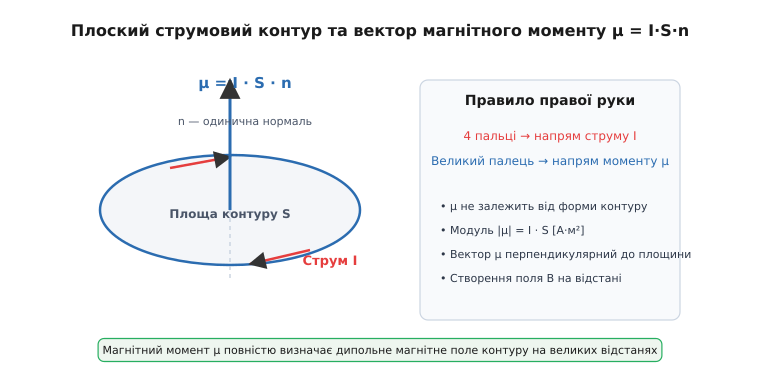
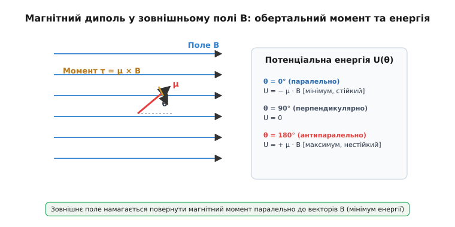
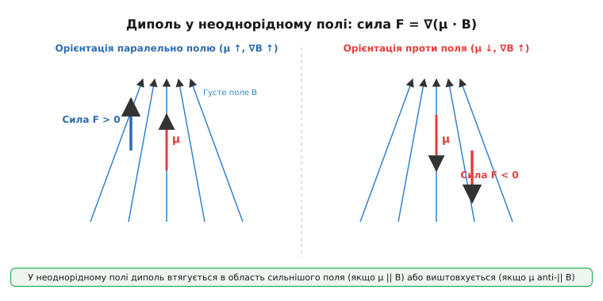

# Магнітний момент: силова характеристика струму та диполя

<preknowlist>
- [Магнітне поле](topic:ph-electromagnetism/magnetic-field) — векторний опис магнітного поля B, силові лінії та відсутність магнітних зарядів.
- [Сила Ампера](topic:ph-electromagnetism/ampere-force) — сила, що діє на провідник зі струмом у магнітному полі.
- [Електричний струм](topic:ph-electromagnetism/electric-current) — впорядкований рух зарядів та його зв'язок з магнітними явищами.
</preknowlist>

Стрілка компаса у магнітному полі Землі орієнтується уздовж силових ліній: поле не зсуває її вбік як ціле, але повертає з певною силою. Таку ж обертальну дію відчуває будь-яка замкнена рамка зі струмом. Щоб кількісно описати здатність струмового контуру повертатися та орієнтуватися у зовнішньому магнітному полі, виводять фундаментальну векторну величину — магнітний момент.

### Контур зі струмом у магнітному полі

Розглянемо плоский прямокутний контур зі сторонами a та b, по якому тече стаціонарний струм I. Контур вміщено в однорідне магнітне поле з індукцією B. Нехай нормаль до площини контуру утворює кут θ з вектором B.


*Вектор магнітного моменту μ перпендикулярний до площини контуру зі струмом і напрямлений за правилом правої руки.*

З боку поля на дві протилежні сторони рамки довжиною b діють [сили Ампера](topic:ph-electromagnetism/ampere-force) F = I · b · B. Оскільки ці сили рівні за модулем і протилежно спрямовані, їх результуюча сума дорівнює нулю (∑ F = 0). Проте сили прикладені до різних ліній дії з плечем a · sin θ, утворюючи пару сил із обертальним моментом τ:

```
τ = F · a · sin θ
= (I · b · B) · a · sin θ
= I · (a · b) · B · sin θ            [групуємо геометричні параметри]
= I · S · B · sin θ                  [оскільки площа рамки S = a · b]
```

Оскільки S = a · b є площею прямокутної рамки, добуток геометрії та струму згортається у вираз τ = I · S · B · sin θ. Якщо складну площу довільного контуру розбити на сітку з елементарних прямокутників зі струмом I, то струми на внутрішніх межах взаємно анулюються, а обертальні моменти додаються. Отже, співвідношення є загальним для контуру будь-якої геометричної форми.

**Векторний магнітний момент** плоского контуру зі струмом μ визначається як:

```
μ = I · S · n
```

де I — сила струму, S — площа контуру, а n — одинична нормаль, напрямок якої задається правилом правої руки: якщо чотири пальці вказують напрямок струму, відведений великий палець вказує напрямок μ. У системі СІ магнітний момент вимірюється в ампер-квадратних метрах (А·м²) або джоулях на теслу (Дж/Тл).

Через векторний добуток обертальний момент, що діє на диполь у полі B, набуває стислої форми:

```
τ = μ × B
```

Поле прагне розвернути вектор μ уздовж силових ліній B, зменшуючи кут θ до нуля.

---

### Потенціальна енергія та орієнтація диполя у полі

При повороті вектора μ у магнітному полі виконується механічна робота. Елементарна робота поля при зміні кута на dθ дорівнює dW = − τ dθ = − |μ| · |B| · sin θ dθ. Потенціальна енергія U(θ) взаємодії диполя з полем визначається як інтеграл цієї роботи з протилежним знаком:

```
U(θ) = − ∫ τ dθ 
= − |μ| · |B| · cos θ + C
```


*У зовнішньому полі B обертальний момент намагається розвернути вектор μ паралельно до поля, мінімізуючи потенціальну енергію диполя.*

У векторному вигляді потенціальна енергія виражається скалярним добутком:

```
U = − μ · B
```

Аналіз енергетичних станів виявляє два крайні положення рівноваги:
- **Паралельна орієнтація (θ = 0°, μ ↑↑ B):** потенціальна енергія мінімальна (U[min] = − |μ| · |B|), обертальний момент відсутній (τ = 0). Це стан **стійкої рівноваги**: при відхиленні виникає повертаючий момент.
- **Антипаралельна орієнтація (θ = 180°, μ ↑↓ B):** потенціальна енергія максимальна (U[max] = + |μ| · |B|), обертальний момент дорівнює нулю, але рівновага є **нестійкою**. Довільне збурення примушує диполь розвертатися до стану з мінімальною енергією.

---

### Неоднорідне магнітне поле та градієнтна сила

В однорідному полі (B = const) сумарна сила Ампера на контур дорівнює нулю: поле повертає диполь, але не зсуває його центр мас. Проте якщо магнітне поле є **неоднорідним** (∇B ≠ 0), індукція на протилежних краях рамки різниться, і сили Ампера перестають компенсувати одна одну.


*У неоднорідному полі результуюча сила втягує диполь у бік сильнішого поля при паралельній орієнтації та виштовхує при антипаралельній.*

Результуюча сила F, що діє на магнітний диполь у неоднорідному полі, дорівнює від'ємному градієнту його потенціальної енергії:

```
F = − ∇ U = ∇ (μ · B)
```

Якщо поле змінюється вздовж осі Z, а вектор μ вже орієнтований уздовж поля (θ = 0°), проекція результуючої сили дорівнює:

```
F[z] = μ[z] · (∂B[z] / ∂z)
```

Звідси випливають наслідки для руху диполя у неоднорідному полі:
- При **паралельній орієнтації** (μ[z] > 0) сила спрямована у бік зростання поля (∂B[z] / ∂z > 0) — диполь **втягується** в область сильнішого поля.
- При **антипаралельній орієнтації** (μ[z] < 0) сила спрямована проти градієнта — диполь **виштовхується** зі слабшого поля.

Саме цей ефект пояснює, чому постійний магніт притягує ненамагнічене залізо. Неоднорідне поле магніту спочатку орієнтує мікроскопічні моменти заліза паралельно до силових ліній, після чого градієнт поля втягує їх у бік полюса. Детальний історичний розвиток експериментів із вимірювання таких сил розкрито в [історичному нарисі](topic:ph-electromagnetism/magnetic-moment/hist-magnetic-moment.md).

---

### Власне поле диполя та орбітальний момент електрона

Магнітний момент не лише реагує на зовнішнє поле, а й сам є джерелом магнітного поля у навколишньому просторі. На відстанях r, що суттєво перевищують розміри контуру, поле диполя описується формулою:

```
B(r) = (μ₀ / (4π · r³)) · [ 3 · (μ · r̂) · r̂ − μ ]
```

де μ₀ = 4π × 10⁻⁷ Гн/м — магнітна стала, а r̂ = r / r — одиничний вектор напрямку. На осі диполя (θ = 0°) поле дорівнює B[осьове] = (μ₀ / (2π · r³)) · μ і збігається за напрямком із μ. У площині екватора (θ = 90°) поле удвічі менше за модулем і спрямоване протилежно: B[екватор] = − (μ₀ / (4π · r³)) · μ.

Мікроскопічним джерелом магнітних моментів у речовині є рух заряджених частинок. Електрон масою m[e] із зарядом q = −e, що рухається по коловій орбіті радіуса r зі швидкістю v, утворює мікроскопічний струм I = e / T = (e · v) / (2π · r).

Його орбітальний магнітний момент μ[L] = I · S = ½ · e · v · r пов'язаний із механічним орбітальним моментом імпульсу L = m[e] · v · r. У векторній формі цей зв'язок має вигляд:

```
μ[L] = − (e / (2 · m[e])) · L
```

Знак «мінус» зумовлений від'ємним зарядом електрона: вектори μ[L] та L спрямовані протилежно. Відношення γ = μ[L] / L = − e / (2 m[e]) називається **гіромагнітним відношенням**.

У квантовій фізиці мінімальне ненульове значення проекції моменту імпульсу електрона дорівнює зведеній сталій Планка ℏ. Це дає фундаментальну квантову одиницю магнітного моменту — **магнетон Бора**:

```
μ[B] = (e · ℏ) / (2 · m[e]) ≈ 9.274 × 10⁻²⁴ Дж/Тл
```

Всі магнітні властивості речовин визначаються комбінацією орбітальних та власних (спінових) магнітних моментів електронів у складі атомів.
