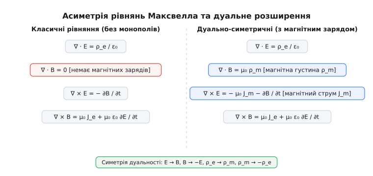
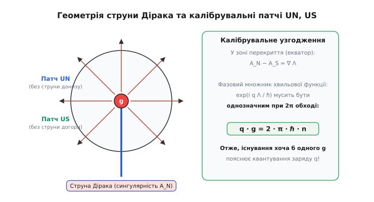
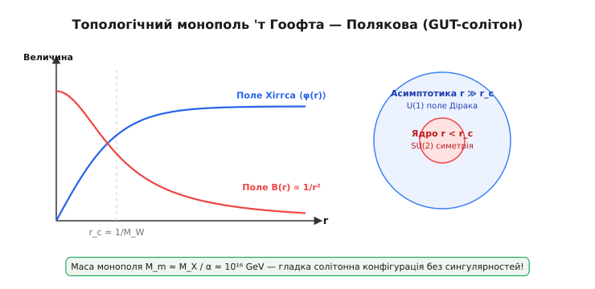
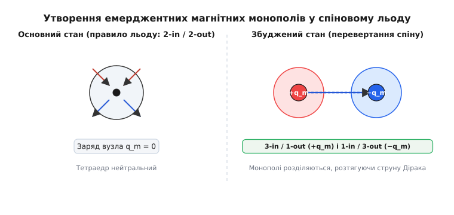

# Магнітний монополь

<preknowlist>
- [Магнітне поле](topic:ph-electromagnetism/magnetic-field) — поняття векторного потенціалу, ліній індукції та відсутність ізольованих полюсів у класичній макрофізиці.
- [Електричний заряд](topic:ph-electromagnetism/electric-charge) — квантування заряду, закон Кулона та джерела електричного поля.
- [Збереження заряду](topic:ph-electromagnetism/charge-conservation) — рівняння неперервності струму та калібрувальна симетрія електродинаміки.
</preknowlist>

Коли намагнічену сталеву голку з магнітним моментом `m = 1 A · m²` розламують навпіл, отримати один ізольований північний і один ізольований південний полюс не вдається ніколи. На місці розламу у точці `x₀` миттєво виникають два нові протилежні полюси, утворюючи два менші магнітні диполі з моментоми `m₁ + m₂ = m`. Спроба поділити магніт до рівня окремих атомів чи елементарних частинок знову приводить лише до дипольних полів електронів та атомних ядер. Андре-Марі Ампер свого часу пояснював це тим, що магнетизм речовини породжується замкненими мікроскопічними електричними струмами всередині молекул. Цей фундаментальний дослідницький факт спонукав класичну електродинаміку зафіксувати тотожність `∇ · B = 0`, що закріпило глибоку асиметрію між електрикою та магнетизмом. Проте теоретична фізика виявила: усунення цієї асиметрії шляхом введення магнітного монополя не лише відновлює симетрію полів, а й дає єдине відоме пояснення того, чому електричний заряд усіх частинок у Всесвіті є суворо квантованим.

## 1. Асиметрія рівнянь Максвелла та гіпотеза дуальності

У класичній електродинаміці Максвелла електричні та магнітні явища описуються з принциповою нерівноправністю джерел. Електричне поле створюється точковими електричними зарядами: дивергенція напруженості електричного поля `E` дорівнює об'ємній густині заряду `ρ_e / ε₀`. Це означає, що силові лінії електричного поля завжди починаються на позитивних зарядах і закінчуються на негативних. Натомість магнітне поле позбавлене точкових джерел: дивергенція індукції магнітного поля `B` всюди строго дорівнює нулю (`∇ · B = 0`). Магнітні силові лінії є завжди замкненими неперервними петлями без початку і кінця.

Ця асиметрія виражається чотирма класичними рівняннями Максвелла для вакууму:

```
∇ · E = ρ_e / ε₀                    [закон Гаусса для електричного поля]
∇ · B = 0                           [відсутність магнітних зарядів]
∇ × E = − ∂B / ∂t                   [закон електромагнітної індукції Фарадея]
∇ × B = μ₀ J_e + μ₀ ε₀ ∂E / ∂t      [закон Ампера — Максвелла]
```

У цих рівняннях електричний струм `J_e` породжує вихрове магнітне поле, але змінне магнітне поле створює вихрове електричне поле без жодного внеску магнітних струмів. Олівер Хевісайд та Джозеф Лармор ще наприкінці XIX століття звернули увагу на те, що у вакуумі за відсутності зарядів (`ρ_e = 0`, `J_e = 0`) рівняння Максвелла володіють ідеальною симетрією відносно взаємної заміни полів: `E → c · B` та `c · B → − E`. Проте наявність електричних зарядів при відсутності магнітних ламає цю красиву симетрію у макроскопічному світі.

Якщо припустити існування точкових магнітних зарядів з об'ємною густиною `ρ_m` та магнітних струмів з густиною `J_m`, рівняння Максвелла набувають повністю дуально-симетричного вигляду. Введений магнітний заряд створює радіальне магнітне поле за законом, аналогічним закону Кулона, а магнітний струм викликає вихрове електричне поле за законом, аналогічним закону Ампера.


*Класичні рівняння Максвелла містять фундаментальну асиметрію через відсутність магнітних джерел. Введення магнітної густини ρ_m та магнітного струму J_m відновлює повну симетрію дуальності полів.*

Розширена симетрична система рівнянь Максвелла має вигляд:

```
∇ · E = ρ_e / ε₀                    [електрична дивергенція]
∇ · B = μ₀ ρ_m                      [магнітна дивергенція]
∇ × E = − μ₀ J_m − ∂B / ∂t          [індукція з магнітним струмом]
∇ × B = μ₀ J_e + μ₀ ε₀ ∂E / ∂t      [вихрове магнітне поле]
```

Отримана система рівнянь є строго інваріантною відносно **перетворень дуальності** (Dual symmetry). Якщо здійснити безперервний поворот векторів полів та джерел на кут `α`:

```
E' = E · cos α + c · B · sin α
c · B' = − E · sin α + c · B · cos α
ρ_e' = ρ_e · cos α + (ρ_m / c) · sin α
ρ_m' / c = − ρ_e · sin α + (ρ_m / c) · cos α
```

то вигляд розширених рівнянь Максвелла залишається абсолютно незмінним. Важливо зазначити, що при таких дуальних обертах об'ємна густина енергії електромагнітного поля `u = (1 / 2) · ε₀ · E² + (1 / (2 · μ₀)) · B²` та вектор Пойнтінга `S = (1 / μ₀) · (E × B)` залишаються строго інваріантними. Двома фундаментальними лоренц-інваріантами полів у цій теорії є `I₁ = B² − E² / c²` та `I₂ = (1 / c) · (E · B)`.

Зокрема, при повороті на кут `α = π / 2` електричне та магнітне поля повністю міняються ролями: `E → c · B`, `B → − E / c`, `ρ_e → ρ_m / c`, `ρ_m → − c · ρ_e`. Це означає, що сам поділ зарядів на «електричні» та «магнітні» є певною мірою питанням вибору системи координат у просторі дуальності. Якщо у Всесвіті відношення магнітного заряду до електричного для всіх частинок було б однаковою константою `g / q = const`, ми могли б за допомогою дуального повороту повністю усунути магнітні заряди, повернувшись до класичної формалізації. Проте якщо існують частинки з різним відношенням `g / q`, дуальна симетрія стає фізично змістовною і не зводиться до вибору калібрування. Детальний математичний апарат релятивістського 4D-тензора поля та дуальних диференціальних форм подано у вставці [Дуальний тензор та диференціальні форми](topic:ph-electromagnetism/magnetic-monopole/api-duality-tensor.md).

## 2. Квантова теорія Поля Дірака: струна та квантування заряду

Тривалий час гіпотеза монополя залишалася суто класичною вигадкою. Ситуація докорінно змінилася у 1931 році, коли Поль Дірак розглянув поводження квантово-механічного електрона у полі точкового магнітного монополя. На той час квантова механіка вже сформувала формулювання рівняння Шредінгера та рівняння Дірака, проте квантування електричного заряду (кратість зарядів усіх відомих частинок заряду електрона `e`) сприймалося лише як емпіричний факт без теоретичного пояснення.

Нехай у початку координат `r = 0` розташовано непорушний магнітний монополь із магнітним зарядом `g`. Створене ним магнітне поле є строго радіальним і дорівнює:

```
B(r) = (g / (4 · π · r²)) · r̂
```

У квантовій механіці взаємодія зарядженої частинки з електромагнітним полем описується через векторний потенціал `A`, який входить до оператора імпульсу за допомогою гамільтоніана мінімального зв'язку `P = − i · ℏ · ∇ − q · A`. Цей факт є принциповим: на відміну від класичної фізики, де векторний потенціал можна розглядати як зручну математичну абстракцію, у квантовій фізиці потенціал `A` має прямий фізичний вимір (що доведено ефектом Ааронова — Бома). Напруженість магнітного поля визначається як ротор потенціалу `B = ∇ × A`.

Проте тут виникає точна топологічна суперечність. За теоремою Гаусса потік магнітного поля крізь замкнену сферу `S²` радіуса `R` навколо монополя дорівнює його заряду `∬ B · dS = g`. З іншого боку, якщо векторний потенціал `A` визначений та неперервний по всій поверхні сфери, за теоремою Стокса потік ротора крізь замкнену поверхню без межі обов'язково дорівнює нулю: `∬ (∇ × A) · dS = 0`.

Щоб розв'язати цю суперечність, Дірак припустив, що векторний потенціал `A` не є гладким на всій сфері і має лінію сингулярності — **струну Дірака**, яка простягається від монополя до нескінченності. Струну можна уявити як нескінченно тонку соленоїдну трубку, яка підводь магнітний потік `g` з нескінченності до точки `r = 0`. Щоб оновити математичний опис без сингулярностей у фізичній області, сферу розділяють на два перекривні карти-патчі: Північний `U_N` (без південного полюса) та Південний `U_S` (без північного полюса).


*Геометрія струни Дірака та покриття сфери двома калібрувальними патчами UN та US. У зоні екваторіального перекриття хвильова функція набуває унітарного фазового множника, що приводить до умови квантування Дірака q · g = 2 · π · ℏ · n.*

У сферичних координатах `(r, θ, ϕ)` векторні потенціали на Північному та Південному патчах записуються так:

```
A_N = (g / (4 · π · r · sin θ)) · (1 − cos θ) · ϕ̂     [регулярний на північному полюсі θ = 0]
A_S = − (g / (4 · π · r · sin θ)) · (1 + cos θ) · ϕ̂    [регулярний на південному полюсі θ = π]
```

Потенціал `A_N` має сингулярну струну на південному полюсі (`θ = π`), а потенціал `A_S` — на північному полюсі (`θ = 0`). У вузькій екваторіальній зоні перекриття `U_N ∩ U_S` обидва потенціали дають однакову магнітну індукцію `B` і відрізняються лише на градієнт скалярної калібрувальної функції `A_N − A_S = ∇ Λ`, де `Λ(ϕ) = (g / (2 · π)) · ϕ`.

Квантово-механічна хвильова функція частинки з електричним зарядом `q` при переході між калібруваннями змінює свою фазу за законом лоренцівської інваріантності. При обході зарядженою частинкою замкненого контуру навколо струни Дірака хвильова функція набуває додаткового набігу фази Ааронова — Бома `Δ Φ = (q / ℏ) · ∮ A · dr = q · g / ℏ`.

Щоб наявність струни Дірака була фізично неспостережуваною (тобто не створювала жодного інтерференційного зсуву смуг у квантово-механічних експериментах з розсіювання), цей набіг фази мусить бути строго кратним `2 · π`:

```
exp(i · q · g / ℏ) = 1  ⇒  q · g / ℏ = 2 · π · n     [де n ∈ ℤ]
```

Переносячи константи, отримуємо фундаментальне **співвідношення квантування Дірака**:

```
q · g = 2 · π · ℏ · n
```

При розв'язанні квантового рівняння Шредінгера для електронних станів у полі монополя звичайні кутові сферичні гармоніки `Y_lm(θ, ϕ)` узагальнюються до **монопольних сферичних гармонік** `Y_qg,l,m(θ, ϕ)`. Повний момент імпульсу частинки при цьому починається не з нуля, а з мінімального значення `j_min = |q · g / (2 · π · ℏ)| / 2 = |n| / 2`, що відображає наявність власного кутового моменту електромагнітного поля, збереженого у системі.

Цей вивід має колосальне значення для фундаментальної фізики. Якщо у Всесвіті існує хоча б один магнітний монополь із зарядом `g`, то електричний заряд абсолютно кожної частинки у Всесвіті обов'язково має бути кратним фундаментальній величині `e = 2 · π · ℏ / g`. Наявність монополя природно пояснює квантування електричного заряду без залучення додаткових постулатів. Якщо за мінімальний електричний заряд прийняти заряд електрона `e`, то фундаментальний квант магнітного заряду дорівнює `g_min = h / e = 2 · Φ₀ ≈ 4.1357 × 10⁻¹⁵ Wb`.

Докладний історичний шлях розвитку цієї ідеї та експериментальних пошуків викладено у вставці [Історія пошуку та гіпотез про монополь](topic:ph-electromagnetism/magnetic-monopole/hist-dirac-monopole.md), а строгі математичні кроки інтегрування та зв'язок із розшаруванням Хопфа наведено у вставці [Математичний вивід квантування Дірака](topic:ph-electromagnetism/magnetic-monopole/math-dirac-quantization.md).

## 3. Топологічні монополі у теоріях Великого Об'єднання ('т Гоофт — Полякова)

Понад сорок років монополь Дірака розглядали як абстрактну точкову частинку з нескінченно тонкою штучною струною-сингулярністю. Ситуація докорінно змінилася у 1974 році, коли Джерард 'т Гоофт та Олександр Поляков незалежно довели: у неабелевих калібрувальних теоріях магнітні монополі виникають природно як гладкі топологічні солітони.

Розглянемо модель Джорджі — Глешоу: калібрувальну теорію Янга — Міллса з групою симетрії `SU(2)`, яка спонтанно порушується до електромагнітної підгрупи `U(1)` за допомогою трикомпонентного скалярного поля Хіггса `ϕ^a` (де `a = 1, 2, 3`), що трансформується за приєднаним представленням групи.

Густина лагранжіана такої системи містить кінетичні доданки калібрувального та Хіггсівського полів і потенціал самодії Хіггса `V(ϕ)`:

```
L = − (1 / 4) · F_μν^a · F^a,μν + (1 / 2) · D_μ ϕ^a · D^μ ϕ^a − (λ / 4) · (ϕ^a · ϕ^a − v²)²
```

де `v` — вакуумне очікуване значення поля Хіггса, `λ` — константа самодії, а `D_μ ϕ^a = ∂_μ ϕ^a + e · ε^abc · A_μ^b · ϕ^c` — коваріантна похідна.

При низьких енергіях поле Хіггса приймає вакуумне значення `|ϕ| = v`. Проте конфігурація поля у просторі може бути топологічно нетривіальною. Солітонний розв'язок 'т Гоофта — Полякова описується статичною конфігурацією типу **«їжак»** (Hedgehog ansatz), у якій напрямок поля Хіггса у ізопросторі збігається з напрямком радіус-вектора у фізичному просторі:

```
ϕ^a(r) = v · h(r) · (r^a / r)
A_i^a(r) = ε^aij · (r^j / (e · r²)) · [1 − f(r)]
```

де `h(r)` та `f(r)` — гладкі радіальні функції зі скінченними межами: при `r → 0` маємо `h(r) → 0`, `f(r) → 1`, а при `r → ∞` маємо `h(r) → 1`, `f(r) → 0`.


*Внутрішня структура солітонного монополя 'т Гоофта — Полякова. У центрі ядра радіуса r_c вакуумне значення поля Хіггса дорівнює нулю і зберігається кавтова симетрія SU(2). На великих відстанях поле прямує до асимптотики Дірака U(1).*

На відміну від монополя Дірака, монополь 'т Гоофта — Полякова має чітку внутрішню структуру та скінченне ядро:
1. **Всередині ядра (`r < r_c ≈ 1 / M_W`)**: поле Хіггса прямує до нуля `⟨ϕ⟩ → 0`, а калібрувальна симетрія `SU(2)` є повністю непорушеною. У цій області векторні бозони залишаються безмасовими, а потенційні сингулярності повністю відсутні.
2. **Зовні ядра (`r ≫ r_c`)**: поле Хіггса досягає вакуумного значення `v`, спонтанно порушуючи симетрію `SU(2) → U(1)`. Неабелеве калібрувальне поле плавно переходить у звичайне електромагнітне поле індукції `B = (g / (4 · π · r²)) · r̂` з магнітним зарядом `g = 4 · π / e`.

Математична стійкість солітона забезпечується топологією: відображення просторової сфери на нескінченності `S²` у сферу вакуумних станів полів Хіггса `SU(2) / U(1) ≅ S²` характеризується другою гомотопічною групою `π₂(SU(2) / U(1)) = π₂(S²) = ℤ`.

Ціле число `n ∈ ℤ` задає топологічний заряд (число обмотки) солітона. Оскільки класичний стан із `n = 1` неможливо неперервно здеформувати у тривіальний вакуум `n = 0` без подолання нескінченного енергетичного бар'єра, топологічний монополь є абсолютно стійкою частинкою, яка не може розпастися на звичайні фотони чи бозони. Точна нижня межа маси солітона у граничному випадку Богомольного — Прасада — Зоммерфільда (BPS-межа при `λ → 0`) обчислюється як:

```
M_m ≥ (4 · π · v / e) = (M_W / α)
```

Принциповим ефектом у неабелевих квантових теоріях є **ефект Віттена**: якщо до лагранжіана додається калібрувальний член порушення CP-симетрії `θ · F_μν · F̃^μν`, то топологічний магнітний монополь автоматично набуває також і дробовий електричний заряд `q = − (e · θ) / (2 · π)`. Подібні гібридні частинки, що несуть одночасно електричний та магнітний заряди, називаються **діонами**.

У теоріях Великого Об'єднання (GUT), де маса масивного калібрувального босона `M_X ≈ 10¹⁵ GeV`, маса монополя досягає астрономічної величини `10¹⁶ GeV` (маса цілої бактерії `10⁻⁸ kg`). Для порівняння, це у `10¹⁶` разів перевищує масу протона.

## 4. Квазічастинкові монополі у конденсованому стані (спіновий лід)

Якщо фундаментальні високоенергетичні монополі поки що не виявлені у прискорювальних експериментах, у фізиці конденсованого стану було зроблено дивовижне відкриття: магнітні монополі виникають як **емерджентні квазічастинки** у низькотемпературних магнітних кристалах.

У так званих кристалах **спінового льоду** (найвідомішими представниками є титанати рідкісноземельних елементів диспрозію `Dy₂Ti₂O₇` та гольмію `Ho₂Ti₂O₇`) магнітні іони `Dy³⁺` або `Ho³⁺` розташовані у вузлах тривимірної гратки з тетраедрів, що з'єднані вершинами (структура пірохлору).

Через сильну кристалічну анізотропію магнітний момент кожного іона (спін) може бути орієнтований лише уздовж осі, що з'єднує центр тетраедра з його вершиною (напрямки `⟨111⟩`). Завдяки феромагнітній взаємодії між сусідніми спінами у кожному тетраедрі при низьких температурах (нижче `1 K`) реалізується аналог водневого «правила льоду»: у кожному тетраедрі два спіни спрямовані всередину, а два спіни — назовні (**стан 2-in / 2-out**).


*Утворення емерджентних магнітних монополів у спіновому льоду Dy₂Ti₂O₇. Перевертання одного спіну порушує правило льоду 2-in/2-out і створює два суміжні тетраедри з некомпенсованими зарядами +q_m та -q_m.*

У такому основному стані сумарний магнітний потік крізь поверхню кожного тетраедра дорівнює нулю, і ефективний магнітний заряд кожного вузла дорівнює нулю `q_m = 0`. Ентропія основного стану спінового льоду при `T → 0` є ненульовою і точно дорівнює макроскопічній залишковій ентропії льоду Полінга `S = R · ln(3 / 2)`.

Якщо під дією теплового збудження або зовнішнього поля один спін перевертається на протилежний напрямок, це одночасно порушує правило льоду у двох суміжних тетраедричних вузлах:
- Один тетраедр отримує конфігурацію **3-in / 1-out** з надлишком магнітного потоку всередину, що відповідає **позитивному магнітному заряду** `+ q_m`;
- Сусідній тетраедр отримує конфігурацію **1-in / 3-out** з надлишком магнітного потоку назовні, що відповідає **негативному магнітному заряду** `− q_m`.

Величезне значення має те, що ці два дефекти не прив'язані один до одного. Послідовне перевертання сусідніх спінів дозволяє дефектам `+ q_m` та `− q_m` вільно віддалятися один від одного на довільну відстань по кристалічній гратці.

При цьому ланцюжок перевернутих спінів між ними утворює **емерджентну струну Дірака**. На відміну від фундаментальної струни Дірака, ця струна є фізично реальною лінією перевернутих магнітних моментів. Проте у кристалках спінового льоду натяг такої струни практично дорівнює нулю: енергія розтягування струни не зростає з відстанню, що забезпечує **деконфайнмент (расконфайнмент)** монополів.

Емерджентні квазічастинкові монополі у спіновому льоду поводяться як справжні точкові магнітні заряди:
1. Вони взаємодіють між собою за тривимірним **законом Кулона для магнітних зарядів**:
   ```
   F_m = (μ₀ / (4 · π)) · (q_m¹ · q_m² / r²)
   ```
2. Величина ефективного магнітного заряду становить `q_m = 2 · μ / a`, де `μ ≈ 10 μ_B` — магнітний момент іона, а `a ≈ 0.35 nm` — відстань між центрами тетраедрів.
3. Вони утворюють так званий «магнітний кулонівський газ», що демонструє ефекти Дебаївського екранування, характерні для звичайних електролітів та плазми.

У 2009 році існування квазічастинкових магнітних монополів у спіновому льоду було прямо підтверджено експериментами з дифракції та розсіяння поляризованих нейтронів, проведеними в Інституті Лауе — Ланжевена (Гренобль) та лабораторії Оксфорда, а також за допомогою резонансної мюонної спектроскопії (μSR). На нейтронограмах це виявилося через характерні «вузлові точки» (Pinch points) у дифузному розсіянні.

## 5. Космологічна проблема монополів та інфляційна модель Всесвіту

Наявність солітонних монополів у теоріях Великого Об'єднання створює фундаментальну космологічну проблему для стандартної моделі гарячого Великого вибуху.

У ранньому Всесвіті при температурах вище `T_GUT ≈ 10¹⁵ GeV` калібрувальна симетрія була повністю відновлена. При охолодженні Всесвіту нижче `T_GUT` відбувся фазовий перехід зі спонтанним порушенням симетрії. Згідно з **механізмом Кіббла**, оскільки напрямок поля Хіггса у різних причинно незв'язаних областях простору вибирається випадково, на межах цих областей неминуче заплутуються топологічні дефекти — магнітні монополі.

Середня кількість утворених монополів обчислюється як приблизно один монополь на об'єм причинного горизонту `H⁻³` на момент фазового переходу. Розрахунки показують, що відносна густина монополів до густини фотонів реліктового випромінювання мала б становити:

```
n_m / n_γ ≈ 10⁻¹⁰
```

Оскільки маса кожного монополя `M_m ≈ 10¹⁶ GeV` є гігантською, їхній сумарний масовий внесок у густину Всесвіту мав би у `10¹²` разів перевищувати критичну густину `ρ_crit`. Такий Всесвіт стиснувся б у зворотній колапс всього через декілька мікросекунд після Великого вибуху. Це протиріччя між теорією та спостережуваним плоским Всесвітом отримало назву **«космологічна проблема монополів»**.

Розв'язання цієї проблеми стало головним рушієм для створення **інфляційної моделі Всесвіту**, запропонованої Аланом Гутом у 1981 році. Згідно з теорією інфляції, одразу після фазового переходу Великого Об'єднання Всесвіт пройшов фазу надшвидкого експоненціального розширення, під час якого масштабний фактор зріс у `eᴺ` разів (де `N ≥ 60`, тобто розширення у понад `10²⁶` разів).

Інфляція розтягнула початковий об'єм простору, який містив монополі, до розмірів, що колосально перевищують наш сучасний спостережуваний горизонт. Внаслідок цього густина монополів зменшилася до екстремально малої величини:

```
n_m < 1 / (об'єм спостережуваного Всесвіту)
```

Також астрофізичний аналіз галактичних магнітних полів накладає так звану **межу Паркера**: якби густина монополів у Галактиці була занадто високою, монополі прискорювалися б галактичним магнітним полем і відбирали б у нього енергію швидше, ніж воно генерується галактичним динамо. Експериментальна межа Паркера становить `F_m < 10⁻¹⁵ cm⁻² · s⁻¹ · sr⁻¹`.

Таким чином, відсутність великої кількості важких монополів у нашому Всесвіті є найважливішим непрямим підтвердженням того, що на ранніх етапах еволюції Всесвіту дійсно відбувалася фаза космічної інфляції.

## 6. Експериментальний пошук та чисельне моделювання

Пошук фундаментальних магнітних монополів триває понад півстоліття у трьох основних напрямках:

1. **Пошук первинних монополів у природних середовищах**: Фізики досліджують зразки місячного ґрунту, океанічні залізомарганцеві зростки, древні метеорити та руди за допомогою надпровідних СQUID-магнетометрів. Завдяки високому магнітному заряду монополі мали б міцно зв'язуватися з ферромагнітними атомами речовини.
2. **Детекція у космічних променях**: Великі підземні та підводні детектори (зокрема MACRO в тунелі Ґран-Сассо та IceCube на Південному полюсі) проводили пошук реліктових монополів у космічних променях за допомогою характерного високоіонізуючого випромінювання (сигнал черенковського випромінювання монополя перевищує сигнал електрона у тисячі разів). Драматичний епізод 1982 року, коли Блас Кабрера зареєстрував поодинокий сигнал на СQUID-детекторі (стрибок струму на `2 Φ₀`), спонукав до створення у рази більших індукційних петель, проте підтвердити цей сигнал не вдалося.
3. **Пошук на сучасних прискорювачах (експеримент MoEDAL на ВАК)**: На Великому адронному колайдері у ЦЕРН працює спеціалізований детектор MoEDAL (Monopole and Exotics Detector at the LHC). Детектор розташований навколо точки зіткнення LHCb і складається з масивів пластикових ядерних трекових детекторів (NTD з полімерів CR39 та Makrofol) та алюмінієвих пасток (MMT). Якщо легші монополі утворюються при зіткненнях протонів, вони мають високу іонізуючу здатність `dE / dx ∝ g²` і гальмуються в алюмінієвих блоках, після чого вимірюються надпровідним магнетомером. Станом на 2024 рік нижня межа маси монополя Дірака за даними MoEDAL становить `M_m > 4.5 TeV`.

Паралельно з фізикою частинок у лабораторних умовах створюються **синтетичні магнітні монополі** у конденсатах Бозе — Ейнштейна та оптичних гратках, де за допомогою зовнішніх лазерних полів моделюються кавтові потенціали з розшаруванням Хопфа.

Для аналізу руху заряджених частинок у полях монополів застосовується комп'ютерне чисельне моделювання. Внаслідок збереження вектора Пуанкаре `J = m · (r × v) − μ · r̂`, траєкторія заряду завжди лежить на поверхні конуса розсіювання, а інтегрування рівнянь руху здійснюється за допомогою методів високого порядку. Детальний аналіз алгоритму, математичне виведення інваріантів та робочий код реалізації мовами Python, C++ і C наведено у вставці [Симуляція руху заряду у полі монополя](topic:ph-electromagnetism/magnetic-monopole/proj-monopole-trajectory.md).

> 🔧 **Навіщо це.**
> Концепція магнітного монополя — це набагато більше, ніж просто пошук однієї нової частинки. Монополь Дірака зв'язав квантування електричного заряду з геометрією простору, проклавши шлях до сучасної топологічної фізики. Монополь 'т Гоофта — Полякова показав, як нелінійні солітони виникають у квантовій теорії поля, що стало основою теорій Великого Об'єднання. Нарешті, емерджентні монополі у спіновому льоду довели, що концепції високоенергетичної квантової теорії поля можуть реалізовуватися як доступні квазічастинки у матеріалознавстві та квантових обчисленнях.

Магнітний монополь залишається одним із найпрекрасніших об'єктів теоретичної фізики: його існування гарантує симетрію електродинаміки, пояснює квантування електричного заряду, узгоджується з розшаруваннями диференціальної геометрії та надихає нові відкриття від субатомних масштабів до фізики твердого тіла і космології.
