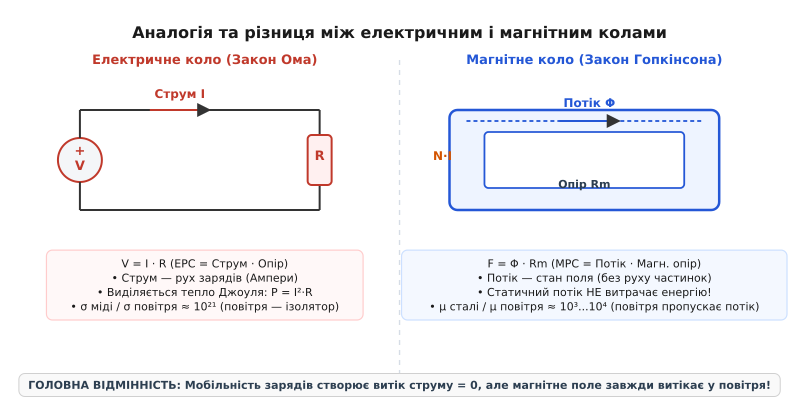
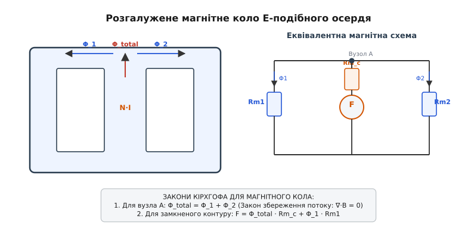
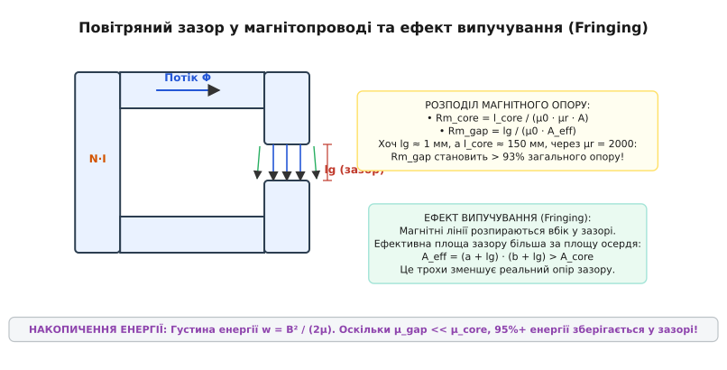
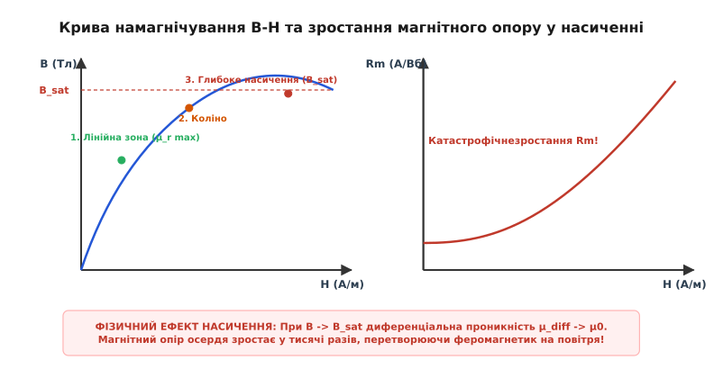

# Магнітний опір і магнітне коло

<preknowlist>
- [Закон Ома](topic:physics/ohm-law) — зв'язок між напругою, струмом і опором в електричному колі.
- [Закон Біо — Савара — Лапласа](topic:ph-electromagnetism/biot-savart-law) — формування магнітного поля електричним струмом.
- [Магнітний потік і індукція](topic:ph-electromagnetism/magnetic-flux) — поняття векторного поля індукції B та потоку Φ.
- [Феромагнетизм і крива намагнічування](topic:ph-condensed/ferromagnetism) — магнітна проникність μ та явище магнітного насичення.
</preknowlist>

Коли інженер розробляє імпульсний зворотньоходовий перетворювач живлення (Flyback converter) потужністю `500` Вт для промислового обладнання та намотує `20` витків мідного дроту на суцільне феритове осердя без зазору (матеріал Epcos N87 з початковою відносною магнітною проникністю `μ_r = 2200` та ефективною довжиною лінії `l_e = 114` мм), прилад у статичному стані показує розрахункову індуктивність `500` мкГн. Проте під час реальної роботи системи при досягненні первинного струму всього `1.5` А замкнене феритове осердя миттєво входить у глибоке магнітне насичення. Магнітна індукція у матеріалі перевищує критичну межу `B_sat = 0.39` Тл, унаслідок чого диференціальна відносна проникність фериту обвалюється у дві тисячі разів до рівня вакууму `μ_r,diff ≈ 1`. Індуктивність первинної обмотки за частки мікросекунди падає з `500` мкГн до нехтовних `2` мкГн. Відповідно до закону індукції швидкість зростання струму `dI/dt = V_in / L` стрибає у 250 разів, амперний пік струму миттєво пробиває силовий ключ на транзисторі MOSFET за швидкістю, що перевищує час спрацьовування будь-яких електронних захистів, і модуль живлення фізично вибухає. 

Радикально змінити динаміку процесу та перетворити небезпечний елемент на надійний силовий накопичувач дозволяє внесення у магнітний шлях осердя точного повітряного розрізу (зазору) завтовшки всього `0.8` мм. Цей зазор збільшує загальний **магнітний опір** кола у 30 разів, змушуючи `95%` усього магнітного потоку та електромагнітної енергії накопичуватися не у крихкій феромагнітній кераміці, а безпосередньо у повітряному просторі.

Розуміння та розрахунок таких процесів забезпечує теорія **магнітного кола** (*magnetic circuit*) та концепція **магнітного опору** або **релюктансу** (від латинського *reluctari* — чинити опір, чинити спротив). Магнітне коло — це замкнений шлях, яким циркулює магнітний потік, викликаний магніторушійною силою, а магнітний опір вимірює кількісну протидію середовища формуванню цього потоку.

---

### 1. Фізична природа магнітного опору та закон Гопкінсона

У фундаментальній електродинаміці розрахунок конфігурації магнітного поля у тривимірному просторі з довільним розподілом струмів та феромагнітних мас вимагає розв'язання векторних рівнянь Максвелла або обчислення складних тривимірних інтегралів закону Біо — Савара — Лапласа. Проте у переважній більшості електротехнічних пристроїв — трансформаторах, силових дроселях, електричних двигунах, генераторах та вимірювальних реле — магнітне поле майже повністю локалізоване всередині спеціальних матеріалів із високою магнітною проникністю (`μ_r >> 1`). Це дозволяє відійти від польового опису й застосувати інтегральний підхід, зввівши задачу до розрахунку магнітного кола.

Джерелом магнітного поля у будь-якому колі є електричний струм `I`, що протікає через котушку з кількістю витків `N`. Скалярний добуток кількості витків на струм визначає **магніторушійну силу** (МРС, англ. *magnetomotive force*, MMF), яка позначається літерою `F`:

```
F = N · I
```

Одиницею вимірювання МРС у міжнародній системі одиниць SI є **ампер-виток** (`А·вт` або просто `А`). За законом циркуляції вектора напруженості магнітного поля `H` (закон Ампера), циркуляція вздовж довільного замкненого контуру `l`, який охоплює обмотку зі струмом, дорівнює повній МРС кола:

```
∮ H · dl = N · I = F
```

Якщо магнітопровід виготовлено з однорідного матеріалу з постійним поперечним перерізом `A` вздовж серединної лінії довжиною `l`, то за умов симетрії вектор напруженості `H` можна вважати постійним вздовж усього контуру. У цьому випадку криволінійний інтеграл перетворюється на звичайний добуток:

```
H · l = F = N · I
```

Зв'язок між напруженістю магнітного поля `H` та векторною магнітною індукцією `B` у середовищі встановлюється матеріальним рівнянням електродинаміки:

```
B = μ · H = μ_0 · μ_r · H
```

де `μ_0 = 4π · 10⁻⁷` Гн/м — магнітна стала (проникність вакууму), а `μ_r` — безрозмірна відносна магнітна проникність речовини.

Повний магнітний потік `Φ`, що проходить через поперечний переріз магнітопроводу `A`, обчислюється як поверхневий інтеграл від вектора індукції `B`:

```
Φ = ∫ B · dA = B · A          [при однорідному розподілі поля B ⊥ A]
```

Виразимо потік `Φ` через намагнічувальну силу `F` та геометричні параметри осердя, підставивши у вищезазначений вираз матеріальне рівняння `B = μ · H` та залежність напруженості від МРС `H = F / l`:

```
Φ = B · A
= (μ · H) · A                 [підстановка матеріального рівняння B = μ·H]
= (μ · (F / l)) · A           [підстановка напруженості H = F/l]
= F / (l / (μ · A))           [алгебраїчне перегрупування співвідношення]
```

Знаменник отриманого підсумкового виразу виражає геометричну та матеріальну властивість середовища чинити опір створенню магнітного потоку. Ця величина називається **магнітним опором** або **релюктансом** магнітопроводу і позначається як `R_m` (або `ℛ` у класичній науковій літературі):

```
R_m = l / (μ · A) = l / (μ_0 · μ_r · A)
```

Підставивши вираз магнітного опору `R_m` у формулу потоку, отримуємо фундаментальний **закон Гопкінсона** (який також називають законом Ома для магнітного кола):

```
F = Φ · R_m    або    Φ = F / R_m
```

Одиницею вимірювання магнітного опору `R_m` у системі SI є **ампер-виток на вебер** (`А·вт/Вб`), що за фізичною розмірністю відповідає оберненому Генрі (`Гн⁻¹` або `1/Гн`).

Мікроскопічний механізм магнітного опору у феромагнетиках суттєво відрізняється від електричного опору. У той час як електричний опір виникає через розсіювання електронів провідності на теплових коливаннях кристалічної ґратки металу, магнітний опір виражає енергетичні витрати поля на зміщення доменних меж (стінок Блоха та Нееля), подолання сил магнокристалічної анізотропії та поворот спонтанних магнітних моментів атомів уздовж зовнішнього поля. На початкових стадіях намагнічування зміщення доменних меж є зворотним, проте при сильніших полях відбуваються незворотні стрибки Баркгаузена через мікроскопічні дефекти та включення в кристалічній ґратці.

Величина, обернена до магнітного опору, називається **магнітною провідністю** або **пермеансом** (*permeance*) і позначається грецькою літерою `Λ`:

```
Λ = 1 / R_m = (μ_0 · μ_r · A) / l
```

Магнітна провідність вимірюється у **Генрі** (`Гн`). Прямий фізичний зміст пермеансу полягає у тому, що він дорівнює індуктивності одного витка обмотки, охопленого цим магнітопроводом.

Детальний історичний екскурс про те, як Майкл Фарадей, Генрі Роуленд, брати Джон та Едвард Гопкінсони, Роберт Бозанкет та Олівер Гевісайд створювали цей математичний формалізм, наведено у [історії закону Гопкінсона](topic:ph-electromagnetism/magnetic-reluctance/hist-hopkinson.md).

---

### 2. Закони заломлення силових ліній на межі розділу середовищ

Особливістю поведінки магнітного потоку на межі розділу двох середовищ із різними проникностями `μ_1` (наприклад, заліза з `μ_r = 2200`) та `μ_2` (повітря з `μ_r = 1`) є заломлення магнітних силових ліній.

З фундаментальних рівнянь Максвелла випливають граничні умови для векторів індукції `B` та напруженості `H`:
1. Нормальні компоненти вектора індукції `B_n` є неперервними на межі розділу: `B_n1 = B_n2` (наслідок того, що `∇ · B = 0`).
2. Дотичні компоненти вектора напруженості `H_t` є неперервними при відсутності поверхневих струмів: `H_t1 = H_t2` (наслідок того, що `∇ × H = 0`).

Зіставляючи ці умови, отримуємо **закон заломлення магнітних силових ліній**:

```
tan(θ_1) / tan(θ_2) = μ_1 / μ_2
```

де `θ_1` та `θ_2` — кути між силовою лінією та нормаллю до поверхні розділу у першому та другому середовищі відповідно.

Оскільки проникність сталі `μ_1` у тисячі разів перевищує проникність повітря `μ_2`, кут виходу лінії у повітря `θ_2` практично завжди прямує до `90°` щодо поверхні заліза (тобто силова лінія виходить строго перпендикулярно до торця керна). Цей ефект вирівнює напрямок потоку у зазорі, проте на краях викликає випучування силових ліній убік, що трохи збільшує ефективний переріз повітряного шляху.

---

### 3. Аналогія між електричним і магнітним колами: межі та фатальні розбіжності

Математичний запис закону Гопкінсона `F = Φ · R_m` зовні повністю копіює структуру закону Ома для ділянки електричного кола `V = I · R`. Така симетрія дозволила інженерам перенести добре відпрацьовані класичні методи розрахунку електричних кіл на розрахунок складних магнітних систем.

Однак аналогія між електричним струмом і магнітним потоком є виключно формально-математичним прийомом. Бездумне її застосування без розуміння глибоких фізичних відмінностей між полями призводить до фатальних помилок при проектуванні електротехнічних пристроїв.


*Аналогія та принципова відмінність між електричним і магнітним колами. У той час як електричний струм являє собою фізичний рух зарядів із дисипацією тепла, магнітний потік є станом поля без перенесення речовини. Крім того, повітря є абсолютним діелектриком для струму, але пропускає магнітний потік.*

У наведеній нижче таблиці систематизовано паралелі між основними характеристиками обидвох кіл:

| Електричне коло | Магнітне коло |
| :--- | :--- |
| **Електрорушійна сила (ЕРС):** `V` або `E` [Вольт, В] | **Магніторушійна сила (МРС):** `F = N·I` [Ампер-виток, А·вт] |
| **Електричний струм:** `I` [Ампер, А] | **Магнітний потік:** `Φ` [Вебер, Вб] |
| **Густина струму:** `J = I / A` [А/м²] | **Магнітна індукція:** `B = Φ / A` [Тесла, Тл] |
| **Напруженість ел. поля:** `E` [В/м] | **Напруженість магн. поля:** `H` [А/м] |
| **Питома провідність:** `σ` [См/м] | **Магнітна проникність:** `μ = μ_0·μ_r` [Гн/м] |
| **Електричний опір:** `R = l / (σ·A)` [Ом] | **Магнітний опір:** `R_m = l / (μ·A)` [А·вт/Вб] |
| **Закон Ома:** `V = I · R` | **Закон Гопкінсона:** `F = Φ · R_m` |

Попри зовні ідеальний математичний паралелізм, існують **три фундаментальні фізичні розбіжності**, де ця аналогія повністю ламається:

#### 1. Енергетична дисипація (відсутність тепловтрат при статичному потоці)
Проходження електричного струму `I` через речовину з опором `R` неминуче супроводжується виконанням механічної роботи над носіями заряду та незворотною дисипацією електромагнітної енергії у тепло Джоуля з потужністю `P = I² · R`. Якщо джерело напруги відключити, струм негайно припиняється.

Натомість магнітний потік `Φ` **не являє собою рух частинок чи перенесення маси**. Це статичний стан поля у просторі. Для підтримання постійного магнітного потоку у феромагнітному осерді **не потрібно витрачати енергію** (`P = 0`). Звичайний постійний магніт підтримує високий магнітний потік у своєму колі протягом століть без будь-якого зовнішнього живлення. Теплові втрати виникають лише в активному опорі мідного дроту обмотки `P = I² · R_cu` при проходженні струму намагнічування, а також у тілі заліза у вигляді динамічних втрат на гістерезис та вихрові струми при *зміні* потоку в часі `dΦ/dt`.

#### 2. Лінійність матеріалів та явище магнітного насичення
Питома електрична провідність `σ` основних металів (міді, алюмінію, срібла) залишається строго постійною величиною у величезному діапазоні густин струму — від пікоампер до кілоампер (зміни виникають лише через нагрівання). Завдяки цьому опір звичайного резистора `R` є лінійним константним параметром.

Натомість магнітна проникність `μ` феромагнетиків є **глибоко нелінійною функцією**. Вона залежить від поточного рівня напруженості поля `H`, історії намагнічування зразка (петля гістерезису) та температури. При досягненні індукції насичення `B_sat` усі електронні спіни й магнітні домени матеріалу вибудовуються паралельно зовнішньому полю. Після цього відносна диференціальна проникність `μ_r` обвалюється від початкових `2000...10000` до `1` (рівня чистого вакууму). Це означає, що магнітний опір `R_m` не є постійною константою осердя, а стрибкоподібно зростає при збільшенні потоку.

#### 3. Коефіцієнт ізоляції та магнітне розсіювання (Flux Leakage)
Це найбільш важлива відмінність для інженерних розрахунків. Відношення питомої електропровідності міді `σ_cu ≈ 5.8 · 10⁷` См/м до провідності повітря чи сухого діелектрика `σ_air ≈ 10⁻¹⁴` См/м становить астрономічне число:

```
σ_cu / σ_air ≈ 10²¹
```

Повітря є практично ідеальним електричним ізолятором. Струм тече строго всередині провідника і не витікає в довкілля.

У магнітних колах картина принципово інша. Відношення проникності найкращих силових феритів чи сталі `μ_iron ≈ 2000...5000` до проникності повітря `μ_0 = 1` становить лише:

```
μ_iron / μ_air ≈ 10³...10⁴
```

Магнітної «ізоляції» у природі не існує. Навколишнє повітря пропускає магнітний потік так само, як і ферит, відрізняючись від нього лише у кілька тисяч разів. Тому значна частина магнітних силових ліній замикається не через сталеве осердя, а витікає у довкілля через повітряний простір. Ця частка поля називається **потоком розсіювання** (*leakage flux*).

---

### 4. Послідовні та паралельні магнітні кола (Закони Кірхгофа)

Завдяки векторому характеру магнітного поля та рівнянням Максвелла, для розгалужених магнітних систем виконуються закони, аналогічні першому та другому законам Кірхгофа.

#### Перший закон Кірхгофа для магнітного кола (Закон збереження потоку)
Оскільки за теоремою Гаусса для магнітного поля у природі відсутні магнітні заряди (магнітні монополі), дивергенція магнітної індукції тотожно дорівнює нулю:

```
∇ · B = 0
```

Це означає, що лінії магнітної індукції є завжди замкненими неперервними петлями. Для будь-якого вузла розгалуженого магнітопроводу (наприклад, місця з'єднання центрального та бокових кернів E-подібного осердя) алгебраїчна сума магнітних потоків, що входять у вузол, дорівнює нулю:

```
∑ Φ_i = 0
```

#### Другий закон Кірхгофа для магнітного кола
Алгебраїчна сума МРС `N · I`, що діють у будь-якому замкненому контурі магнітного кола, дорівнює алгебраїчній сумі спадів магнітного потенціалу `U_m,i = Φ_i · R_m,i = H_i · l_i` на всіх послідовних ділянках цього контуру:

```
∑ F = ∑ N_i · I_i = ∑ H_i · l_i = ∑ Φ_i · R_m,i
```


*Послідовно-паралельне магнітне коло E-подібного осердя та його еквівалентна схема. Потік центрального керна Φ_total розгалужується у вузлі A на два паралельні потоки Φ_1 та Φ_2 через бічні керни.*

#### Послідовне з'єднання магнітних опорів
Якщо магнітний потік `Φ` послідовно проходить через декілька ділянок із різними довжинами `l_i`, площами `A_i` та проникностями `μ_i` (наприклад, залізне ярмо, повітряний зазор і латушна прокладка), повний магнітний опір дорівнює сумі окремих опорів:

```
R_m,total = R_m,1 + R_m,2 + ... + R_m,n = ∑ (l_i / (μ_i · A_i))
```

#### Паралельне з'єднання магнітних опорів
Якщо магнітний потік у вузлі розгалужується на кілька паралельних шляхів (як у класичному E-подібному осерді), еквівалентний магнітний опір `R_m,eq` обчислюється за формулою паралельних опорів:

```
1 / R_m,eq = 1 / R_m,1 + 1 / R_m,2 + ... + 1 / R_m,n = ∑ Λ_i
```

Еквівалентна магнітна провідність паралельних віток дорівнює сумі їхніх пермеансів.

> 🔧 **Навіщо це.** У силових трифазних трансформаторах розрахунок паралельних магнітних кіл дозволяє збалансувати магнітні потоки крайніх і середніх фаз. У прецизійних дифференційних магнітних датчиках та LVDT-трансформаторах зміна опору однієї з паралельних віток під дією зовнішнього механічного переміщення створює сигнал розбалансу, що дозволяє вимірювати зсув деталей із точністю до субмікронів.

---

### 5. Повітряний зазор у магнітопроводі: накопичення енергії та лінеаризація

Внесення вузького повітряного розрізу (зазору) завтовшки `l_g` у феромагнітне осердя з високою проникністю є найважливішим прийомом силової електроніки. На перший погляд це здається парадоксом: навіщо навмисно руйнувати цілісність осердя з проникністю `μ_r = 2200`, розриваючи його зазором із `μ_r = 1`?

Для відповіді на це питання розрахуємо співвідношення опорів осердя та зазору. Нехай осердя має довжину лінії `l_core = 114` мм, площу `A = 211` мм² та проникність `μ_r = 2200`. Внесемо зазор `l_g = 1.2` мм.

Обчислимо магнітний опір осердя `R_m,core`:

```
R_m,core = 0.114 / (4π · 10⁻⁷ · 2200 · 2.11 · 10⁻⁴) = 195 439 А·вт/Вб
```

Обчислимо магнітний опір повітряного зазору `R_m,gap`:

```
R_m,gap = 0.0012 / (4π · 10⁻⁷ · 2.11 · 10⁻⁴) = 4 525 765 А·вт/Вб
```

Повний опір кола:

```
R_m,total = R_m,core + R_m,gap = 195 439 + 4 525 765 = 4 721 204 А·вт/Вб
```

Частка зазору у сумарному магнітному опорі становить:

```
R_m,gap / R_m,total = 4 525 765 / 4 721 204 ≈ 0.9585 (95.85%)
```

Хоча товщина зазору (`1.2` мм) становить лише `1.05%` від геометричної довжини осердя (`114` мм), **повітряний зазор формує 95.85% усього магнітного опору кола!**


*Розподіл магнітного опору та ефект випучування силових ліній у повітряному зазорі. Завдяки низькій проникності повітря понад 95% магнітного опору та енергії концентрується у зазорі, а силові лінії розпираються вбік.*

Це дає три фундаментальні інженерні наслідки:

#### 1. Лінеаризація магнітної характеристики
Оскільки `95.8%` опору припадає на повітря, проникність якого `μ_0` є строго постійною і не залежить від струму, сумарний опір кола `R_m,total` стає абсолютно лінійним. Індуктивність обмотки `L = N² / R_m,total` перестає залежати від амплітуди струму.

#### 2. Запобігання насиченню від постійного струму (DC bias)
У зворотньоходових перетворювачах Flyback та силових PFC-дроселях через обмотку протікає постійна складова струму `I_dc`. Без зазору постійний струм миттєво ввів би ферит у насичення. Зазор зменшує потік `Φ = N·I / R_m,total`, розширюючи діапазон допустимих робочих струмів у десятки разів.

#### 3. Локалізація накопичення магнітної енергії
Густина електромагнітної енергії `w_m` у магнітному полі обчислюється як:

```
w_m = B² / (2 · μ)
```

Оскільки магнітна індукція `B` неперервна при переході через межу розділу «ферит — повітря» (`B_core ≈ B_gap`), порівняємо густини енергії у зазорі та в осерді:

```
w_gap / w_core = (B² / (2 · μ_0)) / (B² / (2 · μ_0 · μ_r)) = μ_r
```

При `μ_r = 2200` густина енергії у зазорі у `2200` разів перевищує густину енергії у фериті. Осердя працює як **магнітний конденсатор**: ферит виконує роль провідного «магнітного дроту», а сама енергія накопичується у повітряній об'ємній зоні зазору.

#### Ефект випучування магнітних ліній (Fringing Effect)
У місці повітряного зазору магнітні силові лінії розпираються в боки через взаємне відштовхування. Це збільшує ефективну площу зазору `A_eff > A_core`, трохи зменшуючи його реальний опір. 

Математичний вивід формул енергії, ефективної площі зазору та приклад розрахунку наведено у [математичному розрахунку зазору](topic:ph-electromagnetism/magnetic-reluctance/math-air-gap.md).

---

### 6. Нелінійність, магнітне насичення та робоча точка (B-H крива)

При зростанні намагнічувальної сили `F = N · I` індукція у феромагнетику збільшується нелінійно відповідно до петлі гістерезису.


*Залежність індукції B та диференціального магнітного опору Rm від напруженості поля H. У зоні насичення проникність обвалюється до μ0, а магнітний опір осердя зростає у тисячі разів.*

Виділяють три основні ділянки робочої характеристики:
1. **Початкова зона:** При малих полях `H` відносна проникність максимальна (`μ_r = μ_max`), магнітний опір осердя мінімальний.
2. **Коліно кривої намагнічування:** Починається поворот магнітних моментів доменів, диференціальна проникність `μ_diff = dB / dH` починає падати.
3. **Глибоке насичення:** Всі магнітні домени орієнтовані за полем. Індукція сягає межі `B_sat`. Диференціальна проникність обвалюється до проникності вакууму (`μ_r,diff → 1`).

При цьому диференціальний магнітний опір осердя `R_m,diff = l / (μ_0 · A)` зростає у тисячі разів. Магнітопровід перетворюється на звичайне повітря.

Розрахунок робочої точки нелінійного кола вимагає чисельних методів (методу Ньютона — Рафсона). Готовий алгоритм та програмний код мовами Python, C та C++ наведено у [чисельному розрахунку нелінійного кола](topic:ph-electromagnetism/magnetic-reluctance/proj-magnetic-circuit.md).

---

### 7. Потік розсіювання та індуктивність розсіювання у трансформаторах

У реальних трансформаторах не весь магнітний потік, згенерований первинною обмоткою, зчеплюється з вторинною обмоткою. Частина силових ліній замикається через повітряний простір між обмотками чи через корпус, утворюючи потік розсіювання `Φ_σ`.

Еквівалентна магнітна схема трансформатора розраховується за допомогою паралельного з'єднання опору основного осердя `R_m,core` та магнітного опору шляху розсіювання у повітрі `R_m,σ`:

```
Φ_total = Φ_main + Φ_σ
```

Магнітний опір шляху розсіювання `R_m,σ` залежить від взаємного розташування котушок. Намотування первинної та вторинної обмоток одна поверх іншої (шарове намотування) зменшує відстань між провідниками, збільшує опір розсіювання `R_m,σ` і зменшує потік розсіювання до часток відсотка. Натомість розміщення обмоток на різних кернах збільшує потік розсіювання, що свідомо застосовують у зварювальних трансформаторах для обмеження струму короткого замикання.

---

### 8. Принцип мінімуму магнітного опору у вентильно-реактивних двигунах

Військова та промислова електротехніка активно використовує **вентильно-реактивні двигуни** (Switched Reluctance Motor, SRM) та **синхронні реактивні двигуни** (Synchronous Reluctance Motor, SynRM). На відміну от класичних двигунів постійного струму чи асинхронних машин, у реактивному двигуні на роторі відсутні будь-які обмотки або постійні магніти.

Принцип дії реактивного двигуна ґрунтується на фундаментальному фізичному законі: **будь-яка магнітна система прагне зайняти такий стан, при якому її загальний магнітний опір `R_m` є мінімальним (а магнітна провідність `Λ` та індуктивність `L` є максимальними)**.

Ротор SRM являє собою зубчасту сталеву деталь. Коли струм подається на фазу статора, виникає механічний обертальний момент `T_rel`, що прагне повернути зубці ротора в лінію з полюсами статора:

```
T_rel = (1/2) · I² · (dL / dθ) = (1/2) · I² · d/dθ [ N² / R_m(θ) ]
```

де `θ` — кут повороту ротора.

Оскільки момент пропорційний квадрату струму `I²`, реактивні двигуни можуть працювати від струму довільної полярності, розвиваючи колосальний питомий момент і володіючи рекордною надійністю.

---

### 9. Магнітні підсилювачі та керовані магнітні опори

У високонадійних космічних та авіаційних джерелах живлення застосовують **магнітні підсилювачі** (*saturable reactors* або *magnetic amplifiers*). Принцип їхньої роботи полягає у зміні магнітного опору осердя за допомогою додаткової обмотки керування постійного струму.

Проганяючи невеликий струм керування через допоміжну обмотку, осердя вводять у насичення. При цьому його магнітний опір `R_m` для змінного струму основної обмотки стрибкоподібно зростає, а індуктивний опір `X_L = ω · L = ω · N² / R_m` обвалюється. Це дозволяє безконтактно й з ККД понад 98% регулювати потужні змінні струми у сильових кола, не використовуючи напівпровідникові ключі.

---

### 10. Практичне застосування та розрахункові параметри

У силовому електротехнічному проектуванні інженери виражають параметри осердей через нормовані виробниками показники.

#### Індуктивний коефіцієнт `A_l` (AL-factor)
Головним паспортом будь-якого осердя є коефіцієнт `A_l`, який показує індуктивність у наногенрі (`нГн`), яку створює обмотка в один виток:

```
A_l = L / N² = 1 / R_m = Λ
```

Знаючи `A_l` осердя, необхідна кількість витків `N` для отримання заданої індуктивності `L` обчислюється як:

```
N = √(L / A_l)
```

Повний довідник геометричних констант осердей `C_1, C_2`, ефективних параметрів `l_e, A_e, V_e` та характеристик матеріалів (N87, 3C90, Kool Mµ, Sendust) наведено у [довіднику параметрів осердей](topic:ph-electromagnetism/magnetic-reluctance/api-core-params.md).

#### Прикладні сфери застосування

1. **Імпульсні джерела живлення:** Точна величина повітряного зазору визначає граничну енергію `W = (1/2) · L · I²`, яку трансформатор Flyback передає за один такт.
2. **Електричні машини:** Повітряний зазор між ротором і статором визначає струм холостого ходу двигуна. Його мінімізація зменшує реактивну потужність намагнічування.
3. **Електромагнітні реле:** При відтягнутому якорі зазор великий, опір `R_m` максимальний, а потік `Φ` малий. При притяганні якоря зазор зменшується, `R_m` падає, а сила притягання зростає за квадратичним законом, надійно фіксуючи контакт.
4. **Магнітне екранування:** Для захисту чутливих схем від зовнішніх магнітних полів їх вміщують у корпус із матеріалу з гігантською проникністю (пермалой, μ-метал, `μ_r ≈ 100 000`). Магнітний опір стінок екрана у сотні тисяч разів менший за опір повітря усередині камери, тому магнітний потік шунтується стінками екрана, не проникаючи всередину.

Таким чином, магнітний опір є фундаментальною фізичною величиною, що зв'язує геометрію й властивості матеріалів магнітопроводів із параметрами електричних кіл.
