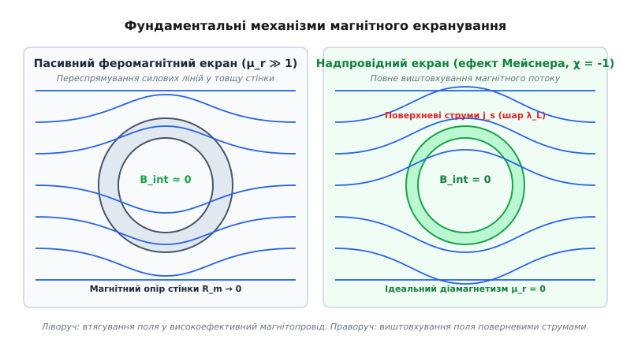
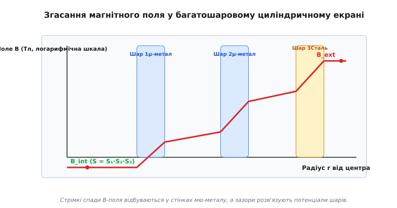
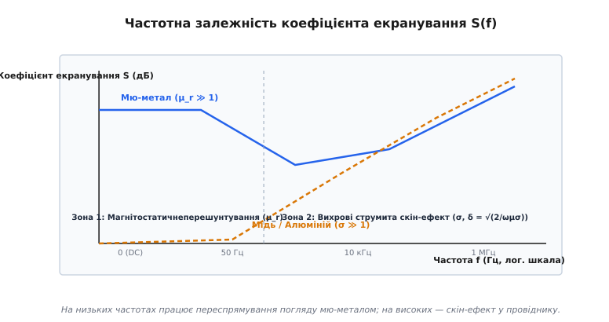

# Магнітне екранування

<preknowlist>
- [Феромагнетизм](topic:ph-condensed/ferromagnetism) — спонтанне паралельне впорядкування магнітних моментів у матеріалах з високою магнітною проникністю.
- [Надпровідність](topic:ph-condensed/superconductivity) — стан речовини з нульовим електричним опором та ефектом Мейснера.
- [Магнітні домени](topic:ph-condensed/magnetic-domains) — області однорідної намагніченості у феромагнетиках та їхня перебудова під дією зовнішнього поля.
</preknowlist>

Коли фізики та інженери намагаються виміряти надслабкі біомагнітні поля серця чи головного мозку людини за допомогою прецизійного квантового сквід-магнітометра (амплітудою від `10⁻¹²` до `10⁻¹⁵` Тесла), головною перешкодою стає не власна шумність вимірювального приладу, а навколишній фізичний простір. Магнітне поле Землі створює постійне фонове тло індукцією від `30` до `60 мкТл` (у середніх широтах близько `50 мкТл`), промислова електромережа на частотах 50 або 60 Гц генерує змінні поля амплітудою від `0.1` до `10 мкТл`, а міський електротранспорт, ліфти, силові трансформатори, зварювальні апарати та сусідні томографи створюють хаотичні низькочастотні магнітні завади індукцією до кількох мілітесла.

Перша інтуїтивна спроба заблокувати магнітне поле за допомогою суцільного металевого щита, за аналогією з електростатичною кліткою Фарадея, зазнає поразки. Електричні заряди існує можливість ізолювати: у природі є вільні позитивні та негативні носії заряду `q`, які під дією зовнішнього електричного поля перерозподіляються на зовнішній поверхні провідника відповідно до теореми Гаусса `∮ E · dA = Q / ε₀` і повністю компенсують вектор напруженості всередині замкненої порожнини (`E_int = 0`). 

Проте магнітних монополів (ізольованих магнітних зарядів) у класичній електродинаміці не існує. Друге рівняння Максвелла `∇ · B = 0` стверджує, що магнітний потік завжди є соленоїдальним, а силові лінії векторного поля магнітної індукції `B` залишаються суцільними, неперервними й замкненими у просторі. Магнітне поле неможливо "поглинути", "заблокувати" чи "зупинити" — його можна лише **переспрямувати** в обхід захищуваного об'єму за допомогою матеріалів із високою магнітною проникністю або **компенсувати** протилежно спрямованим полем вихрових чи надпровідних струмів.

```
Спектр магнітних полів у навколишньому середовищі:
- Біомагнітні поля мозку (МЕГ):             10⁻¹⁵ – 10⁻¹³ Тл (1 – 100 фТл)
- Біомагнітні поля серця (МКГ):             10⁻¹² – 10⁻¹¹ Тл (1 – 10 пТл)
- Флуктуації геомагнітного поля (1 Гц):    10⁻⁹  – 10⁻⁸  Тл (1 – 10 нТл)
- Промислові наводки мережі 50 Гц:          10⁻⁷  – 10⁻⁶  Тл (0.1 – 1 мкТл)
- Постійне магнітне поле Землі:             3 × 10⁻⁵ – 6 × 10⁻⁵ Тл (30 – 60 мкТл)
- Поле розсіювання МРТ-томографа (1.5 Тл): 10⁻³  – 10⁻²  Тл (1 – 10 мТл)
```

---

### 1. Фізична сутність та векторна теорія магнітостатичного екранування

Щоб відвести силові лінії магнітного поля від чутливого приладу чи порожнини вимірювальної камери, їх вміщують у замкнену оболонку з феромагнітного матеріалу, який має величезне значення відносної магнітної проникності (`μ_r ≫ 100 000`).

Магнітний потік у будь-якому середовищі поширюється шляхом найменшого магнітного опору `R_m`. Для ділянки середовища довжиною `l` та площею поперечного перерізу `A` магнітний опір виражається фундаментальним співвідношенням:

```
R_m = l / (μ₀ · μ_r · A)
```
де `μ₀ = 4π × 10⁻⁷ Гн/м` — магнітна стала, `μ_r` — відносна магнітна проникність середовища.

Аналогічно до електричних кіл і законів Ома, для магнітного кола діє правило: магнітний потік `Ф = ∫ B · dA` ділиться обернено пропорційно магнітним опорам паралельних шляхів. Оскільки у порожнистому об'ємі повітря відносна проникність дорівнює одиниці (`μ_r = 1`), а у стінці з прецизійного нікель-залізного сплаву (мю-металу) значення `μ_r` перевищує 100 000, магнітний опір матеріалу оболонки виявляється у сотні тисяч разів меншим, ніж магнітний опір внутрішнього повітряного простору. 

Силові лінії зовнішнього поля "всмоктуються" у високопровідну стінку екрана, огинають внутрішню порожнину по контуру матеріалу і виходять з протилежного боку, залишаючи внутрішній захищений об'єм майже вільним від магнітного поля.

```
Векторні співвідношення на межі "повітря — мю-метал":
B_in = μ₀ · H_in                       (у повітрі, μ_r = 1)
B_wall = μ₀ · μ_r · H_wall             (у стінці екрана, μ_r ≫ 100 000)
Граничні умови електродинаміки: H_t1 = H_t2,  B_n1 = B_n2
За рахунок μ_r ≫ 1 напрямок вектора B у стінці стає майже строго тангенціальним до поверхні.
```

З фізичної точки зору, перерозподіл силових ліній магнітного поля зумовлений виникненням зв'язаних молекулярних струмів намагніченості у товщі феромагнетика. Намагніченість матеріалу `M = χ_m · H` створює поверхневі мікроскопічні струми з густиною `j_M = ∇ × M`, які створюють власне магнітне поле, що компенсує зовнішнє поле всередині порожнини й підсилює його у стінках оболонки.

Також можна описати цей процес мовою ефективних магнітних зарядів намагніченості `ρ_m = -∇ · M`. Під дією зовнішнього поля на зовнішній поверхні феромагнітної оболонки виникають наведені магнітні заряди `σ_m = M · n`, поле яких всередині порожнини спрямоване протилежно до зовнішнього поля `B_ext`, викличуючи його майже повне самоскасування.


*Порівняння фундаментальних механізмів пасивного та надпровідного магнітного екранування*

Кількісною мірою ефективності магнітного захисту є **коефіцієнт екранування** `S` (від англ. *Shielding factor*), який визначається як відношення індукції зовнішнього непорушеного поля `B_ext` до індукції залишкового поля `B_int` у центрі екранованої порожнини:

```
S = B_ext / B_int
```

У логарифмічних одиницях (децибелах) коефіцієнт екранування виражається як:

```
S_dB = 20 · log₁₀(S) = 20 · log₁₀(B_ext / B_int)
```

Наприклад, якщо екран послаблює зовнішнє геомагнітне поле `50 мкТл` до залишкового рівня `0.5 нТл`, коефіцієнт екранування становить `S = 100 000`, що відповідає `S_dB = 100 дБ`.

---

### 2. Пасивне екранування високопроникними матеріалами (μ-метал та пермаллой)

Найважливішим класом матеріалів для пасивного екранування постійних та низькочастотних магнітних полів є прецизійні нікель-залізні сплави. Класичний **мю-метал** (Mu-Metal) містить приблизно 77% нікелю (`Ni`), 16% заліза (`Fe`), 5% міді (`Cu`) та 2% хрому (`Cr`) або молібдену (`Mo`). 

Історичний шлях винайдення пермаллою Густавом Елменом у Bell Labs та створення мю-металу Уїллоубі Смітом для телеграфних кабелів і прецизійних фізичних лабораторій викладено у вставці [📜 Історія відкриття мю-металу](topic:ph-electromagnetism/magnetic-shielding/hist-mu-metal-discovery.md).

#### Квантова фізика доменної структури та магнітної анізотропії

На макроскопічному рівні висока проникність мю-металу зумовлена унікальною доменною структурою матеріалу. Загальна вільна енергія феромагнітного кристала складається з чотирьох основних доданків:

```
E_total = E_exchange + E_anisotropy + E_magnetostriction + E_Zeeman
```

У звичайному залізі або нікелі енергія магнітокристалографічної анізотропії `E_anisotropy` змушує спінові магнітні моменти орієнтуватися строго уздовж кристалографічних осей легкого намагнічування (`[100]` для Fe та `[111]` для Ni). Для того щоб розвернути домен у довільному напрямку, потрібно прикласти суттєве зовнішнє поле.

Проте при співвідношенні компонентів близькому до `Ni₇₈Fe₂₂` у кристалічній кубічній гранецентрованій ґратці сплаву одночасно прямують до нуля константа магнітної кристалографічної анізотропії (`K₁ → 0`) та константа магнітострикції насичення (`λ_s → 0`).

Мікромагнітна теорія показує, що товщина 180-градусної блохівської доменної межі `δ_w` та її поверхнева енергія `γ_w` виражаються через обмінний інтеграл `A` та константу анізотропії `K₁`:

```
δ_w = π · √( A / K₁ )
γ_w = 4 · √( A · K₁ )
```

Коли `K₁` прямує до нуля, обмінна довжина `L_ex = √(A / K₁)` зростає від 5 нм до сотень нанометрів. Доменні межі стають дуже товстими та м'якими. Вони легко проходять повз дрібні немагнітні включення та дислокації без зачеплення. 

Завдяки цьому енергія пинінгу доменних стінок спадає практично до нуля, пригнічуючи стрибки Баркгаузена та забезпечуючи плавну обернену перебудову доменів під дією мізерних зовнішніх полів. Вектор намагніченості у кожному домені вільно повертається під дією зовнішнього поля, а коерцитивна сила знижується до `H_c < 0.8 А/м`.

```
Основні магнітні характеристики мю-металу:
- Початкова відносна магнітна проникність: μ_i = 50 000 – 100 000
- Максимальна відносна магнітна проникність: μ_max = 200 000 – 400 000
- Коерцитивна сила: H_c = 0.8 А/м
- Індукція насичення: B_sat = 0.75 – 0.8 Тл
```

#### Межа магнітного насичення та градієнтне екранування

Головною фізичною слабкістю мю-металу є порівняно низька **індукція насичення** (`B_sat ≈ 0.75 Тл`). Оскільки силові лінії зовнішнього поля концентрично стискаються у вузькому перерізі стінки оболонки, індукція всередині матеріалу `B_wall` виявляється у багато разів вищою за зовнішню індукцію `B_ext`.

Для циліндричної оболонки радіуса `R` з товщиною стінки `d` індукція у матеріалі стінки оцінюється співвідношенням:

```
B_wall ≈ B_ext · (R / d)
```

Якщо зовнішнє поле є потужним (наприклад, `B_ext = 20 мТл`), а тонкостінний екран має співвідношення `R / d = 50`, індукція у стінці досягне значення `B_wall = 1.0 Тл`, що перевищує межу насичення мю-металу. У стані насичення домени матеріалу повністю вирівняні, диференціальна магнітна проникність `μ_r = dB/dH` падає від 100 000 до одиниці (`μ_r → 1`), і екранувальні властивості матеріалу повністю зникають.

Для подолання цього обмеження застосовують **градієнтне пасивне екранування** — створюють багатошарові оболонки з матеріалів із різною індукцією насичення:
1. **Зовнішній шар (жертовний):** Виготовляється з електротехнічної кремнієвої сталі (`Fe-3%Si`) або аморфної стрічки Metglas, яка має помірну проникність (`μ_r ≈ 5 000–10 000`), але високу індукцію насичення (`B_sat ≈ 2.0 Тл`). Вона приймає на себе основну енергію сильного поля і послаблює його до рівня `0.5 мТл` без заходу в насичення.
2. **Внутрішній шар (прецизійний):** Виготовляється з мю-металу або супермаллою (`μ_r > 200 000`). Він працює у слабкому передусім послабленому полі й забезпечує остаточне глибоке гасіння завад.

Детальний порівняльний аналіз технічних характеристик та кривих намагнічування для різних типів екранувальних сплавів наведено у вставці [🔌 Матеріали пасивного та надпровідного магнітного екранування](topic:ph-electromagnetism/magnetic-shielding/comp-shielding-materials.md).

---

### 3. Геометрія та математичні закони згасання поля

Коефіцієнт екранування замкненої оболонки залежить від її геометричної форми, товщини стінки та відносної магнітної проникності.

Розв'язання рівняння Лапласа для скалярного магнітного потенціалу `∇² V_m = 0` у сферичних та циліндричних координатах із врахуванням граничних умов неперервності тангенціального поля `H_t` та нормальної індукції `B_n` дає чіткі аналітичні вирази.

Для порожнистої сферичної оболонки з внутрішнім радіусом `R_in` та зовнішнім радіусом `R_out` точний розрахунок дає формулу:

```
S_sphere = 1 + (2 / 9) · [ ((μ_r - 1)²) / μ_r ] · [ 1 - (R_in / R_out)³ ]
```

При тонкій стінці (`d = R_out - R_in ≪ R_in`) і високій проникності (`μ_r ≫ 1`) вираз спрощується до тонкостінного наближення:

```
S_sphere ≈ (2 / 3) · μ_r · (d / R_in)
```

Для нескінченного циліндра, розташованого у перпендикулярному магнітному полі, коефіцієнт екранування дорівнює:

```
S_cyl ≈ (1 / 2) · μ_r · (d / R_in)
```

#### Вплив геометричної форми: сфера, циліндр та прямокутний корпус

Порівняльний аналіз показує фундаментальну залежність екранування від симетрії оболонки:
- **Сферична оболонка:** Забезпечує найвищий коефіцієнт екранування при однаковій витраті матеріалу (`S_sphere ≈ (2/3) μ_r d / R`), оскільки концентрує магнітний потік у трьох вимірах без крайових аномалій.
- **Циліндрична оболонка:** Забезпечує ефективне екранування у поперечному напрямку (`S_cyl ≈ (1/2) μ_r d / R`), проте у поздовжньому напрямку екранування знижується через фактор розмагнічування відкритих торців.
- **Прямокутний корпус (Box):** Має найгірші показники. На гострих прямокутних кутах виникають локальні концентрації магнітного потоку, що викликає раннє магнітне насичення матеріалу на кутах. Щоб уникнути цього, прямокутні екрани виготовляють із закругленими радіусами кутів (`r_corner ≥ 3 d`).

Повний математичний вивід цих співвідношень, розклад потенціалу за поліномами Лежандра та врахування розмагнічувальних факторів для екранів скінченної довжини подано у вставці [🧮 Виведення коефіцієнта екранування](topic:ph-electromagnetism/magnetic-shielding/math-shielding-factor-derivation.md).

#### Фізика багатошарового концентричного екранування

З наведених формул видно, що коефіцієнт екранування одношарового циліндра зростає лінійно з ростом товщини стінки `d`. Якщо ми подвоїмо товщину стінки, екранування збільшиться у 2 рази.

Проте якщо той самий об'єм мю-металу розділити на дві окремі концентричні оболонки товщиною `d / 2`, розділені повітряним чи алюмінієвим зазором, коефіцієнт екранування зазнає фундаментального мультиплікативного зростання.


*Характер згасання магнітного поля у концентричному багатошаровому циліндричному екрані*

Для двох концентричних циліндричних екранів з коефіцієнтами екранування `S₁` та `S₂` сумарний коефіцієнт екранування описується **формулою Кюпфмюллера**:

```
S_tot = S₁ · S₂ · [ 1 - (R₁ / R₂)² ] + S₁ + S₂
```
де `R₁` — радіус внутрішнього екрана, `R₂` — радіус зовнішнього екрана.

При наявності помірного радіального зазору (`R₂ > 1.3 · R₁`) член `S₁ · S₂` стає домінуючим, і загальне екранування дорівнює **добутку** коефіцієнтів окремих шарів:

```
S_tot ≈ S₁ · S₂ · [ 1 - (R₁ / R₂)² ]
```

Якщо перший шар забезпечує `S₁ = 200`, а другий `S₂ = 200`, то сумарне екранування двошарової структури сягає `S_tot ≈ 20 000`, що у десятки разів перевищує екранування суцільного шару подвійної товщини (`S_single ≈ 400`). 

Проміжок між шарами розв'язує магнітні потенціали оболонок, дозволяючи зовнішній оболонці скинути більшу частину потоку, після чого внутрішня оболонка фільтрує вже глибоко послаблене поле.

---

### 4. Динамічне та високочастотне екранування (вихрові струми та скін-ефект)

У змінних магнітних полях (AC) виникає другий фізичний механізм екранування, пов'язаний із електромагнітною індукцією Фарадея. 

Зміна магнітного потоку у часі `∂B / ∂t` наводить у товщі провідного металу (міді, алюмінію, латуні) замкнені вихрові струми (струми Фуко). Відповідно до правила Ленца, наведені вихрові струми створюють власне вторинне магнітне поле, спрямоване строго протилежно до первинного зовнішнього поля.

```
∇ × E = -∂B / ∂t
j_eddy = σ · E
```

Взаємодія первинного поля та наведених вихрових струмів призводить до згасання електромагнітної хвилі у товщі провідника. Глибина проникнення поля, на якій амплітуда індукції зменшується в `e ≈ 2.718` разів, називається **скін-шаром** (`δ`):

```
δ = √( 2 / (ω · μ₀ · μ_r · σ) )
```
де `ω = 2πf` — колова частота змінного поля, `σ` — питома електрична провідність матеріалу.

Згасання амплітуди магнітного поля по глибині провідника `z` підпорядковується експоненційному закону:

```
B(z) = B₀ · exp(-z / δ)
```

Коефіцієнт екранування металевого листа товщиною `d` за рахунок вихрових струмів при `d > δ` становить:

```
S_eddy ≈ (1 / 2) · (R / δ) · exp(d / δ)
```


*Залежність коефіцієнта екранування від частоти магнітного поля*

Частотна характеристика екранування демонструє поділ на дві фізичні області:
1. **Низькі частоти (DC – 100 Гц):** Вихрові струми малі, оскільки `∂B / ∂t` незначне. Екранування забезпечується виключно магнітостатичним переспрямуванням у мю-металі завдяки високому `μ_r`. Високопровідні матеріали (мідь, алюміній) на постійному полі не працюють взагалі (`S = 1`).
2. **Високі частоти (понад 10–100 кГц):** Глибина скін-шару `δ` стає меншою за товщину стінки (`δ < 0.1 мм`). Вихрові струми у міді або алюмінії створюють потужний відштовхувальний ефект, і коефіцієнт екранування експоненційно зростає з частотою. На високих частотах мю-метал стає неефективним через зростання втрат на гістерезис та спад проникності, поступаючись чистій міді.

---

### 5. Надпровідне екранування (ефект Мейснера та вихрова динаміка)

Фундаментально інший рівень магнітного захисту забезпечують надпровідні матеріали. При охолодженні нижче критичної температури `T_c` надпровідник переходить у стан **ідеального діамагнетизму** (магнітна сприйнятливість `χ = -1`, відносна проникність `μ_r = 0`).

На відміну від ідеального провідника із нульовим опором, який лише зберігає той магнітний потік, що існував усередині нього на момент охолодження, надпровідник виявляє **ефект Мейснера — Оксенфельда**: він повністю виштовхує зовнішнє магнітне поле зі свого об'єму при переході через `T_c`.

```
Рівняння Лондонів для надпровідного струму:
∇ × j_s = -(n_s · e² / m) · B
∇² B = B / λ_L²
```

Магнітне поле не може проникнути вглиб надпровідника і згасає у вузькому поверхневому шарі завтовшки **лондонівської глибини проникнення** (`λ_L ≈ 10–100 нм`):

```
B(z) = B(0) · exp(-z / λ_L)
```

У цьому поверхневому шарі `λ_L` самочинно виникають макроскопічні незатухаючі поверхневі надпровідні струми `j_s`, які створюють магнітне поле, що строго дорівнює і протилежне за напрямком зовнішньому полю `B_ext`. У результаті всередині об'єму надпровідної оболонки індукція дорівнює строго нулю (`B_int = 0`), а коефіцієнт екранування прямомує до нескінченності (`S → ∞`).

#### Обмеження, модель Біна та квантові вихори Абрикосова

Надпровідне екранування має свої фундаментальні фізичні межі:
- **Надпровідники I роду (чистий ніобій `Nb`, свинець `Pb`):** Зберігають ідеальний Мейснер-стан лише до першого критичного поля `H_c`. При `H > H_c` надпровідність скачкоподібно руйнується, і поле повністю проникає в об'єм.
- **Надпровідники II роду (`NbTi`, `Nb₃Sn`, ВТНП кераміка YBCO):** При полях вище першого критичного поля `H_c1` магнітне поле починає проникати в надпровідник у вигляді квантованих вихорів Абрикосова, кожен з яких несе один квант магнітного потоку `Ф₀ = h / (2e) ≈ 2.07 × 10⁻¹⁵ Вб`.

Розподіл прониклого поля у товщі надпровідника II роду описується **критичною моделлю Біна** (*Bean critical state model*):

```
| ∇ × B | = μ₀ · j_c(B)
```
де `j_c` — критична густина надпровідного струму. Поле проникає на глибину `x_p = B_ext / (μ₀ j_c)`. Якщо товщина надпровідної стінки є більшою за `x_p`, внутрішній простір залишається повністю екранованим.

Якщо вихори Абрикосова вільно рухаються під дією сили Лоренца `F_L = j × Ф₀`, у надпровіднику виникає в'язкий опір та дисипація енергії (потік вихорів, *flux flow*). Для збереження високого коефіцієнта екранування у надпровідниках II роду створюють штучні центри закріплення вихорів (точкові дефекти ґратки, дислокації, включення ненадпровідної фази), що забезпечує потужний **пинінг магнітного потоку** (*flux pinning*).

Надпровідні екрани з чистого ніобію застосовують у кріогенних системах для екранування квантових обчислювальних платформ на кубітах та у SQUID-магнітометрії, де необхідно підтримувати рівень залишкового поля нижче `10⁻¹⁵ Тл`.

---

### 6. Активне магнітне знеструмлення та фундаментальні магнітні шуми

У найскладніших науково-вимірювальних комплексах пасивного багатошарового екранування з мю-металу виявляється недостатньо для гасіння наднизькочастотних інфразвукових флуктуацій поля (на частотах 0.01 – 10 Гц), викликаних рухом міського транспорту та сонячною активністю.

У таких випадках застосовують **активне магнітне екранування (знеструмлення)**:

```
Схема активного екранування:
 [ Поле завад B_ext ] ──> ( Феррозондовий датчик Fluxgate ) ──> [ Аналоговий PID-контролер ]
                                                                       │
 [ Внутрішнє поле B = 0 ] <── ( Котушки Гельмгольца / Максвелла ) <────┘
```

1. На зовнішній поверхні вимірювальної камери встановлюють прецизійну тривісну систему феррозондових магнітометрів (*Fluxgate sensors*), які вимірюють вектор зовнішнього поля завад у реальному часі.
2. Сигнал помилки обробляється швидким аналого-цифровим PID-контролером.
3. Контролер керує струмами у просторовій системі з трьох взаємно перпендикулярних котушок Гельмгольца або котушок Максвелла, виготовлених по контуру кімнати.
4. Котушки створюють динамічне протилежно спрямоване магнітне поле, яке компенсує понад 98% амплітуди низькочастотних завад ще до того, як вони досягнуть поверхні мю-металевого екрана.

#### Джонсонівський тепловий магнітний шум екранувальних оболонок

Для прецизійних квантових сквід-магнітометрів та атомних годинників існує фундаментальна фізична межа екранування, пов'язана з термодинамічними флуктуаціями.

Відповідно до флуктуаційно-дисипативної теореми (ФДТ), вільні електрони провідності у товщі металевого екрана (мю-метал має провідність `σ ≈ 1.8 × 10⁶ См/м`) перебувають у постійному тепловому русі, створюючи випадкові мікроструми Джонсона — Найквіста. Ці струми флуктують і генерують усередині екранованої порожнини власне спонтанне магнітне поле шумів.

Спектральна густина теплового магнітного шуму для сферичної оболонки становить:

```
S_B(f) = (4 · k_B · T · μ₀² · σ · d) / (3 · R_in²)  [Тл²/Гц]
```
де `k_B = 1.38 × 10⁻²³ Дж/К` — стала Больцмана, `T` — абсолютна температура.

При `T = 300 K` тепловий шум стінок масивного кімнатного мю-металевого екрана дорівнює `10 – 30 фТл / √Гц`. Для вимірювання надслабких полів головного мозку (МЕГ, рівня 1–10 фТл) внутрішні шари екрана виготовляють із диелектричних феритів або охолоджують до кріогенних температур, що подавляє Джонсонівський шум.

Поєднання активного знеструмлення та пасивного 5-шарового мю-металевого екрана дозволяє досягти рекордно високих коефіцієнтів екранування `S > 1 000 000` (понад 120 дБ) на постійному полі.

---

### 7. Конструктивні вимоги, термічна обробка та інженерні пастки

Створення високоефективного магнітного екрана — це не лише вибір сплаву, але й суворе дотримання технологічної дисципліни під час виготовлення та монтажу.

#### Водневий відпал (Hydrogen Annealing) та квантова фазова впорядкованість

Будь-яка механічна обробка мю-металу — різання листу, згинання, штампування, свердління отворів або зварювання — створює у кристалічній ґратці сплаву величезну щільність дислокацій та внутрішніх напружень. Внутрішні напруження блокують рух доменних меж, унаслідок чого магнітна проникність `μ_r` падає з 100 000 до 2 000–5 000.

Для відновлення екранувальних властивостей готова зібрана конструкція з мю-металу повинна пройти обов'язковий підсумковий **високотемпературний відпал**:
1. Виріб вміщують у спеціальну вакуумну або водневу піч із сухим воднем (`H₂`, точка роси нижче -40 °C).
2. Нагрівають до температури 1100 – 1150 °C і витримують протягом 2–4 годин. Водень відновлює оксиди на межах зерен та виводить шкідливі домішки вуглецю та сірки до рівня менше ніж `0.002%`. У процесі витримування відбувається вторинна рекристалізація: середній розмір кристалічних зерен `D` зростає від 10 мкм до 200 мкм, що радикально зменшує густину міжзеренних меж-стопорів.
3. **Контрольоване охолодження:** Виріб охолоджують із суворо контрольованою швидкістю (близько 100 °C на годину) до 500 °C, після чого піддають гартуванню у струмені інертного газу.

Квантово-хімічна причина такого складного температурного режиму полягає у запобіганні утворенню надґратки далекого атомарного порядку `Ni₃Fe`. Якщо сплав охолоджувати занадто повільно нижче 500 °C, атоми нікелю та заліза впорядковуються у надґратку типу `L1₂`, що призводить до різкого зростання константи анізотропії `K₁` та падіння проникності. Швидке загартування заморожує неупорядкований твердий розчин з кубічною ГЦК-ґраткою, у якій `K₁ ≈ 0`.

Після водневого відпалу виріб категорично заборонено піддавати механічним ударам, падінням або згинанням. Падіння деталі з мю-металу на підлогу з висоти 1 метра здатне зменшити її магнітну проникність на 50% через появу нових механічних дислокацій.

```
Вплив технологічних чинників на проникність μ_r мю-металу:
- Після вальцювання й штампування (деформований): μ_r ≈ 3 000 – 5 000
- Після водневого відпалу (1150 °C):             μ_r ≈ 150 000 – 300 000
- Після падіння на тверду поверхню:               μ_r ≈ 40 000 – 60 000
```

#### Витоки поля через технологічні отвори та шви

Реальні екранувальні камери потребують технологічних отворів для введення електричних кабелів, трубок охолодження та оглядових вікон.

1. **Крайові витоки (Leakage via apertures):** Магнітне поле "затікання" усередину порожнини через відкриті отвори. Щоб запобігти цьому, кожен отвір оснащують виступаючим циліндричним патрубком з мю-металу (побічним хвилеводом). Якщо довжина патрубка `L` перевищує його діаметр `D` у 3 рази (`L / D ≥ 3`), магнітне поле всередині патрубка згасає за експоненційним законом і не потрапляє у внутрішній об'єм.
2. **З'єднання та шви (Lap joints):** Стики між листами мю-металу не можна виконувати встик без перекриття. Стики роблять укритими із нахлестом (*lap joint*), що перевищує товщину листа принаймні у 10–20 разів, і скріплюють заклепками чи гвинтами з мю-металу або немагнітної латуні.

---

### 8. Кріогенне магнітне екранування (Сплав Кріоперм)

Окремою фізичною задачею є пасивне магнітне екранування при кріогенних температурах рідкого гелію (`4.2 K`), яке необхідне для квантових надпровідникових кубітів та кріогенних детекторів.

Звичайний мю-метал при охолодженні від 300 K до 4.2 K втрачає до 85–90% своєї відносної магнітної проникності (`μ_r` падає з 200 000 до 15 000). Це пояснюється тим, що температурна залежність константи магнітокристалографічної анізотропії `K₁(T)` для класичного пермаллою має нуль саме при кімнатній температурі (`T ≈ 300 K`). При охолодженні значення `K₁(T)` зростає, що створює енергетичний бар'єр для руху доменних стінок.

Для вирішення цієї проблеми розроблено спеціалізований сплав **Кріоперм** (Cryoperm). Шляхом додаткового легування молібденом та ванадієм точку нульової анізотропії `K₁(T) = 0` зміщують безпосередньо у кріогенну область (`4.2 – 10 K`). Це забезпечує рекордну відносну проникність `μ_r > 80 000` безпосередньо у рідкому гелії.

---

### 9. Прецизійні екрановані камери у фундаментальній фізиці (BMSR-2)

Найдосконалішим у світі прикладом пасивного та активного магнітного екранування є **Друга Берлінська екранована кімната (BMSR-2)** у Фізико-технічному інституті Німеччини (PTB Berlin).

Камера призначена для біомагнітних досліджень мозку та вимірювання фундаментального електричного дипольного моменту нейтрона (nEDM).

```
Конструктивні параметри безмагнітної кімнати BMSR-2:
- Внутрішній захищений об'єм: 2.9 м × 2.9 м × 2.9 м
- Кількість екранувальних шарів: 7 шарів мю-металу + 1 суцільний алюмінієвий шар (15 мм)
- Загальний коефіцієнт екранування на постійному полі (DC): S > 10⁶ (понад 120 дБ)
- Коефіцієнт екранування на частоті 1 Гц: S > 10⁸ (понад 160 дБ)
- Залишкове магнітне поле у центрі камери: B_int < 0.5 нТл (градієнт < 2 пТл/м)
```

Завдяки 8-шаровій градієнтній оболонці, патрубкам згасання на всіх кабельних вводах та триосьовій системі активної компенсації у кімнаті BMSR-2 досягнуто найнижчий у світі рівень залишкового поля, що дозволяє реєструвати біомагнітні сигнали від окремих нейронів головного мозку людини.

#### Застосування у квантових обчисленнях та надпровідних кубітах

У квантових комп'ютерах на надпровідних трансмонах та фазових кубітах зовнішні флуктуації магнітного поля викликають дефазування квантових станів (зменшення часу чистої дефази `T_ϕ`). Флуктуації магнітного потоку `S_Ф(f)` у СКВІД-петлі кубіта зміщують джозефсонівську енергію `E_J(Ф)`, що призводить до втрати квантової когерентності.

Для захисту квантових процесорів кріостат розчинення (температура 10–20 мК) оснащують трирівневою системою екранів:
1. Зовнішній багатошаровий мю-металевий екран при кімнатній температурі.
2. Проміжний екран із сплаву Кріоперм при температурі рідкого гелію (4.2 K).
3. Внутрішній суцільний стакан з надвисокочистого ніобію, який при 15 мК перебуває у стані чистого ефекту Мейснера та підтримує залишкове поле менше ніж `0.1 нТл`.

#### Екранування надпотужних магнітних систем МРТ та ЯМР

У медичній МРТ-томографії та фізичній ЯМР-спектроскопії виникає зворота задача: захист навколишнього середовища від надпотужних полів (від 1.5 до 11.7 Тесла), які створюються надпровідними соленоїдами.

Для пригнічення поля розсіювання застосовують комбіноване екранування:
- **Пасивне яремне екранування:** Соленоїд обгортають масивним ярмом із чистого армко-заліза вагою до 10–20 тонн. Висока індукція насичення заліза (`B_sat = 2.15 Тл`) дозволяєзамкнути основну частину магнітного потоку всередині металевого контуру.
- **Активні контурні котушки (Active Shielding Coils):** Зовні основного надпровідного соленоїда намотують додаткові концентричні надпровідні котушки з протилежним напрямком струму. Вони компенсують поле на відстані понад 2–3 метри від томографа, стискаючи безпечну лінію 5 Гаус (0.5 мТл) до меж процедурного кабінету.

Усі обчислювальні алгоритми чисельного моделювання багатошарових екранів та аналіз насичення матеріалів подано у вставці [⚙️ Чисельне моделювання коефіцієнта магнітного екранування](topic:ph-electromagnetism/magnetic-shielding/proj-shielding-simulation.md).

🔧 **Навіщо це.** Магнітне екранування є критичною технологією у сучасній приладобудівній галузі. Без нього була б неможливою робота томографів високої роздільності (МРТ), електронних мікроскопів (TEM/SEM), у яких геомагнітне поле розфокусовує електронний пучок, атомних годинників, квантових комп'ютерів на надпровідникових фазових кубітах та систем надчутливої біомагнітної діагностики серця і головного мозку.
