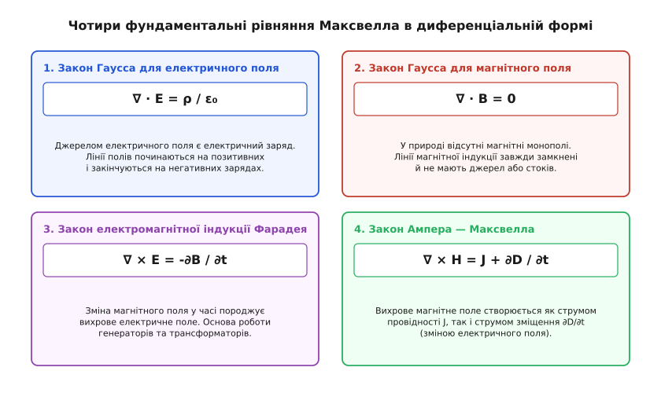
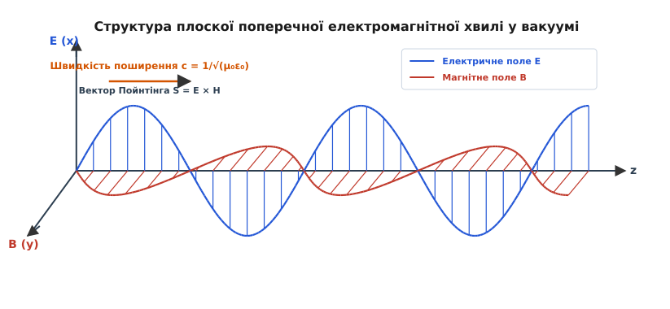
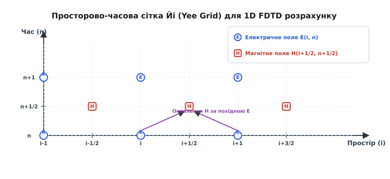

# Рівняння Максвелла

<preknowlist>
- [Закон Гаусса](root:ph-electromagnetism/gauss-law) — зв'язок між потоком векторного поля та замкненим зарядом.
- [Закон Фарадея у диференціальній формі](root:ph-electromagnetism/faraday-law-differential) — вихрове електричне поле від зміни магнітного індукційного потоку.
- [Струм зміщення](root:ph-electromagnetism/displacement-current) — генерація вихрового магнітного поля часовою зміною електричного зміщення.
- [Закон збереження заряду](root:ph-electromagnetism/charge-conservation) — фундаментальне рівняння безперервності струму.
- [Електромагнітна хвиля](root:ph-electromagnetism/em-wave) — самопідтримне поширення збурень електричного та магнітного полів у просторі.
</preknowlist>

Якщо піднести неодимовий магніт до замкненої мідної котушки, у провіднику виникає вимірюваний електричний струм, який створює напругу `E ≈ 10` мВ/м за рахунок зміни магнітного потоку. З іншого боку, стаціонарний струм `I = 2` А у мідному дроті створює навколо себе циркуляційне магнітне поле `H ≈ 6.37` А/м. До середини XIX століття ці явища описувалися окремими законами електростатики, магнетостатики та індукції, які здавалися незалежними фрагментами фізики. Проте спроба застосувати класичний закон Ампера до кола зі змінним струмом та плоским повітряним конденсатором призвела до нерозв'язного суперечності: циркуляція магнітного поля між пластинами конденсатора, де відсутній фізичний рух електронів, за теорією Ампера мала б дорівнювати нулю, тоді як чутливі прилади фіксували таке саме вихрове магнітне поле, як і біля підвідних дротів. Логічний парадокс розв'язав шотландський фізик Джеймс Клерк Максвелл, ввівши поняття струму зміщення `∂D/∂t` і об'єднавши всі відомі електричні й магнітні явища у замкнену систему з чотирьох диференціальних рівнянь. **Рівняння Максвелла** сформулювали фундаментальний принцип класичної електродинаміки: часова зміна магнітного поля породжує вихрове електричне поле, а часова зміна електричного поля породжує вихрове магнітне поле, роблячи можливим існування світла та електромагнітних хвиль у Всесвіті.

---

## 1. Запити XIX століття: чому окремі закони суперечили один одному в динаміці

У першій половині XIX століття теорія електрики й магнетизму розроблялася у формі трьох емпіричних законів, сформульованих незалежно різними дослідниками у стаціонарних або квазістаціонарних умовах:

1. **Закон електростатики Кулона — Гаусса**: описує джерела електричного поля `E`. Джерелами поля є позитивні та негативні електричні заряди `ρ`.
2. **Закон магнетостатики Ампера**: описує вихрове магнітне поле `H`, джерелом якого вважався виключно електричний струм провідності `J` (рух вільних носіїв заряду).
3. **Закон індукції Фарадея**: описує появу вихрового електричного поля при зміні магнітного індукційного потоку у часі.

У математичному апараті векторного аналізу того часу закон Ампера записувався диференціальним рівнянням для ротора магнітного поля:

```
∇ × H = J
```

де `∇ ×` — оператор ротора (латин. *rotare* — обертатися), що визначає міру вихровості векторного поля у точці, а `J` — вектор густини струму провідності (А/м²), який описує реальний потік електронів або іонів.

Під час аналізу нестаціонарних процесів ця формула зіткнулася з неподоланим логічним тупиком. Застосуємо операцію дивергенції (латин. *divergere* — розходитися), позначувану `∇ ·`, до обидвох частин рівняння Ампера. З фундаментальних тотожностей векторного аналізу відомо, що ротор будь-якого векторного поля не має джерел або стоків, тобто його дивергенція строго дорівнює нулю:

```
∇ · (∇ × H) ≡ 0
```

Звідси для класичного закону Ампера неминуче випливала вимога:

```
∇ · J = 0
```

Ця умова вимагає строгої неперервності ліній струму: електричний струм може протікати лише по замкнених контурах і не може ніде накопичуватися або зменшуватися. Однак фундаментальний закон збереження електричного заряду у локальній формі задається рівнянням безперервності:

```
∇ · J + ∂ρ / ∂t = 0
```

При заряджанні або розряджанні конденсатора об'ємна густина заряду `ρ` на його обкладках змінюється у часі (`∂ρ/∂t ≠ 0`), з чого випливає, що `∇ · J ≠ 0`. Отже, класичний закон Ампера `∇ × H = J` прямо суперечив закону збереження електричного заряду при будь-яких змінних струмах.

```
Класичний закон Ампера: ∇ × H = J  ⇒  ∇ · J = 0
                                           ≠  (суперечність)
Закон збереження заряду:           ∇ · J = -∂ρ/∂t
```

Для вирішення цього парадоксу розглянемо плоский конденсатор з обкладками площею `S`, що заряджається струмом `I(t)`. Згідно із законом Гаусса, електричне зміщення `D` у вакуумному або діелектричному проміжку між пластинами пов'язане з поверхневою густиною заряду `σ_charge = Q / S` співвідношенням `D = σ_charge`. Продиференціювавши цю рівність за часом, отримуємо:

```
∂D / ∂t = ∂σ_charge / ∂t = (1 / S) · (dQ / dt) = I(t) / S = J_cond
```

Величина `∂D/∂t` має розмірність густини струму (А/м²) і строго дорівнює густині струму провідності у підвідних провідниках.

У 1861 році Максвелл висунув геніальну гіпотезу: математичний вираз закону Ампера є неповним. Він припустив, що джерелом вихрового магнітного поля є не лише фізичний рух зарядів (струм провідності `J`), а й будь-яка часова зміна електричного зміщення `D` (індукції електричного поля).

Густина **повного струму зміщення** `J_d` складається з двох різних за фізичною природою компонент:

```
J_d = ∂D / ∂t = ε₀ · (∂E / ∂t) + (∂P / ∂t)
```

де перша складова `ε₀ (∂E/∂t)` — **вакуумний струм зміщення**, який існує у абсолютно порожньому просторі за відсутності будь-яких атомів і являє собою чисту часову зміну фундаментального електричного поля; друга складова `∂P/∂t` — **струм поляризації**, викликаний реальним мікроскопічним зміщенням зв'язаних електричних зарядів (електронних хмарок та атомних ядер) у диелектричному середовищі під дією змінного поля.

```
Повний струм зміщення J_d ──> Вакуумний струм: ε₀ (∂E/∂t)  [зміна поля у порожнечі]
                          └──> Струм поляризації: ∂P/∂t    [рух зв'язаних зарядів]
```

Детальніше про початкову механічну модель вихорів ефіру та еволюцію поглядів ученого можна прочитати в [історії великого об'єднання Максвелла](root:ph-electromagnetism/maxwell-equations/hist-maxwell-unification.md).

Ввівши густину струму зміщення `J_d = ∂D/∂t`, Максвелл модифікував закон циркуляції магнітного поля до вигляду:

```
∇ × H = J + ∂D / ∂t
```

Окрім сумісності із законом збереження заряду, гіпотеза Максвелла отримала потужне фізичне підтвердження при аналізі електромагнітних констант. У 1856 році німецькі фізики Вільгельм Вебер та Рудольф Кольрауш виміряли відношення електростатичної одиниці заряду до електромагнітної одиниці. Це відношення виявилося вектором зі швидкістю, яка тотожно дорівнювала швидкості поширення світла. Саме цей емпіричний збіг підштовхнув Максвелла до гіпотези про електромагнітну природу світлових хвиль.

Перевіримо нове рівняння на сумісність із законами збереження заряду, обчисливши його дивергенцію:

```
∇ · (∇ × H) = ∇ · J + ∇ · (∂D / ∂t) = 0
∇ · J + ∂/∂t (∇ · D) = 0
```

Оскільки за законом Гаусса `∇ · D = ρ`, вираз набуває вигляду `∇ · J + ∂ρ/∂t = 0`, що строго збігається з рівнянням безперервності. Додавання струму зміщення не лише усунуло парадокс конденсатора, а й встановило повну логічну замкненість електродинаміки.

---

## 2. Чотири стовпи електродинаміки: диференціальна та інтегральна форми

Система рівнянь Максвелла складається з чотирьох фундаментальних рівнянь. Кожне з них описує окремий аспект взаємодії полів та джерел у диференціальній (у точці) або інтегральній (у замкненому об'ємі чи вздовж контуру) формах.


*Чотири фундаментальні рівняння Максвелла, що описують зв'язок між джерелами, змінами полів та вихровими структурами у просторі.*

### 1. Закон Гаусса для електричного поля
Повідомляє, що джерелом електричного поля є електричні заряди. Лінії напруженості електричного поля починаються на позитивних зарядах і закінчуються на негативних.

- **Диференціальна форма**:
  ```
  ∇ · D = ρ
  ```
  де `D` — вектор електричного зміщення (Кл/м²), `ρ` — об'ємна густина вільних електричних зарядів (Кл/м³).

- **Інтегральна форма**:
  ```
  ∯_S D · dS = Q_encl
  ```
  де `∯_S` означає інтегрування по довільній замкненій поверхні `S`, а `Q_encl` — повний вільний заряд усередині об'єму, обмеженого цією поверхнею.

Фізичний зміст рівняння полягає у тому, що сумарний потік векторного поля зміщення через замкнену поверхню визначається виключно наявністю зарядів усередині цієї поверхні. Зовнішні заряди створюють лінії полів, які пронизують поверхню наскрізь, даючи нульовий сумарний внесок у інтеграл.

### 2. Закон Гаусса для магнітного поля
Стверджує відсутність у природі точкових магнітних зарядів (магнітних монополів). Лінії магнітної індукції не мають ні початку, ні кінця — вони завжди замкнені самі на себе.

- **Диференціальна форма**:
  ```
  ∇ · B = 0
  ```
  де `B` — вектор магнітної індукції (Тесла, Тл).

- **Інтегральна форма**:
  ```
  ∯_S B · dS = 0
  ```
  Поток магнітного поля через будь-яку замкнену поверхню строго дорівнює нулю: скільки ліній індукції входить усередину об'єму, стільки ж виходить назовні. Якщо розрізати полосовий магніт навпіл, ми отримаємо не окремі північний і південний полюси, а два нових менших магніти, кожен із яких має власний замкнений потік поля.

### 3. Закон електромагнітної індукції Фарадея — Максвелла
Описує генерацію вихрового електричного поля часовою зміною магнітного поля. На відміну від електростатичного поля зарядів, це поле є вихровим, а його силові лінії замкнені.

- **Диференціальна форма**:
  ```
  ∇ × E = -∂B / ∂t
  ```
  де `E` — вектор напруженості електричного поля (В/м). Знак «мінус» відображає правило Ленца: індуковане поле протидіє часовій зміні магнітного потоку.

- **Інтегральна форма**:
  ```
  ∮_L E · dl = -d/dt ∬_S B · dS
  ```
  Циркуляція вектора `E` вздовж замкненого контуру `L` (електрорушійна сила, ЕРС) дорівнює швидкості зміни магнітного потоку крізь відкриту поверхню `S`, натягнуту на цей контур. На відміну від потенціального поля, де циркуляція `∮ E · dl ≡ 0`, у вихровому полі циркуляція відмінна від нуля, що дозволяє генерувати струм у замкнених провідних контурах генераторів та трансформаторів.

### 4. Закон Ампера — Максвелла
Стверджує, що вихрове магнітне поле генерується двома незалежними джерелами: фізичним рухом зарядів (струмом провідності `J`) та часовою зміною електричного зміщення (струмом зміщення `∂D/∂t`).

- **Диференціальна форма**:
  ```
  ∇ × H = J + ∂D / ∂t
  ```
  де `H` — вектор напруженості магнітного поля (А/м).

- **Інтегральна форма**:
  ```
  ∮_L H · dl = ∬_S (J + ∂D / ∂t) · dS
  ```
  Циркуляція магнітного поля вздовж контуру `L` дорівнює сумі струму провідності та струму зміщення крізь поверхню `S`.

### Геометричний та фізичний зміст операторів ∇· та ∇×

Для глибшого розуміння фізики рівнянь Максвелла важливо уявити геометричний зміст операторів дивергенції `∇ ·` та ротора `∇ ×`:

- **Дивергенція (об'ємна густина джерел)**: Визначає об'ємну густину стоків або джерел векторного поля у нескінченно малому об'ємі `ΔV → 0`. Позитивна дивергенція `∇ · D > 0` означає, що у даній точці простору лежить позитивний заряд `ρ > 0`, з якого силові лінії випромінюються в усі боки. Від'ємна дивергенція `∇ · D < 0` показує місце негативного заряду (стік). Рівність `∇ · B = 0` означає, що для магнітного поля джерела й стоки відсутні у будь-якій точці Всесвіту: векторні лінії індукції ніде не виникають із точкового джерела і ніде не зникають, утворюючи виключно неперервні замкнені петлі.

- **Ротор (об'ємна густина вихорів)**: Визначає локальне обертання або циркуляцію векторного поля навколо точкового контуру. Якщо помістити у поле з ротором `∇ × E ≠ 0` подумку мікроскопічну лопатеву вертушку, то на її протилежні лопаті діятимуть різні за величиною або напрямком електричні сили, викликаючи її обертання. Вихрове електричне поле `∇ × E = -∂B/∂t` не має потенціалу: робота по переміщенню заряду по замкненому контуру у такому полі є відмінною від нуля, що робить можливим роботу трансформаторів та генераторів.

### Зведена таблиця рівнянь Максвелла у вакуумі (`D = ε₀E`, `B = μ₀H`)

| Рівняння | Диференціальна форма | Інтегральна форма | Фізичний зміст |
| :--- | :--- | :--- | :--- |
| **I. Гаусс (E)** | `∇ · E = ρ / ε₀` | `∯ E · dS = Q / ε₀` | Електричні заряди створюють розбіжність поля `E` |
| **II. Гаусс (B)** | `∇ · B = 0` | `∯ B · dS = 0` | Магнітні монополі відсутні у природі |
| **III. Фарадей** | `∇ × E = -∂B / ∂t` | `∮ E · dl = -d/dt ∬ B · dS` | Зміна магнітного поля створює вихрове поле `E` |
| **IV. Ампер-Максвелл** | `∇ × B = μ₀J + μ₀ε₀ ∂E/∂t` | `∮ B · dl = μ₀ I + μ₀ε₀ d/dt ∬ E · dS` | Струми та зміна поля `E` створюють вихрове поле `B` |

---

## 3. Світовий зв'язок: від полів до електромагнітних хвиль та швидкості світла

Найвидатнішим наслідком рівнянь Максвелла стало теоретичне передбачення існування електромагнітних хвиль. У порожньому просторі за відсутності зарядів (`ρ = 0`) та струмів (`J = 0`) третє та четвертое рівняння Максвелла перетворюються на симетричну пару зв'язаних часових похідних:

```
∇ × E = -μ₀ (∂H / ∂t)
∇ × H = ε₀ (∂E / ∂t)
```

Зміна поля `E` у часі створює вихрове поле `H` у просторі. Зміна поля `H` у часі створює вихрове поле `E`. Цей процес взаємогенерації не прив'язаний до речовини й може безмежно поширюватися у вакуумі у вигляді відірваної від джерел хвилі.

Обчислимо ротор від обидвох частин рівняння для `∇ × E`:

```
∇ × (∇ × E) = -μ₀ ∂/∂t (∇ × H)
∇(∇ · E) - ∇²E = -μ₀ ∂/∂t (ε₀ ∂E / ∂t)   [застосовано подвійний ротор та підставлено ∇×H]
0 - ∇²E = -μ₀ε₀ (∂²E / ∂t²)              [ураховано ∇·E = 0 за відсутності зарядів]
```

Отримуємо **тривимірне хвильове рівняння** для електричного поля:

```
∇²E - μ₀ε₀ (∂²E / ∂t²) = 0
```

Аналогічним чином виводиться ідентичне хвильове рівняння для магнітного поля `∇²H - μ₀ε₀ (∂²H/∂t²) = 0`.

Детальніше математичний висновок для векторів `E` та `B`, а також граничні умови на межі середовищ наведено у [математичному виведенні хвильового рівняння та граничних умов](root:ph-electromagnetism/maxwell-equations/math-maxwell-derivation.md).

Порівнюючи цей результат із класичним хвильовим рівнянням `∇²Ψ - (1/v²) ∂²Ψ/∂t² = 0`, отримуємо фундаментальну формулу для фазової швидкості `c` поширення електромагнітних хвиль:

```
c = 1 / √(μ₀ · ε₀)
```

Підставивши значення електричної сталої `ε₀ ≈ 8.85419·10⁻¹²` Ф/м та магнітної сталої `μ₀ = 4π·10⁻⁷` Гн/м, отримуємо:

```
c = 1 / √(8.85419e-12 · 1.25664e-6) ≈ 299 792 458 м/с
```

Збіг обчисленої швидкості зі швидкістю світла навів Максвелла на думку: **світло є електромагнітною хвилею** певного діапазону частот.

Окрім швидкості поширення, важливими характеристиками електромагнітної хвилі є її **хвильовий опір вакууму** `Z₀`:

```
Z₀ = √(μ₀ / ε₀) = μ₀ · c ≈ 376.73 Ом
```

Ця константа задає амплітудне співвідношення між напруженостями електричного та магнітного полів у плоскій хвилі у вакуумі: `E = Z₀ · H`.

У провідних середовищах із питомою провідністю `σ > 0` хвильове рівняння ускладнюється дисипативним членом з першою часовою похідною:

```
∇²E - μ₀ε₀ (∂²E / ∂t²) - μ₀σ (∂E / ∂t) = 0
```

Цей член викликає згасання хвилі вглиб провідника за експоненціальним законом. Відстань, на якій амплітуда хвилі зменшується в `e ≈ 2.718` разів, називається **глибиною скін-шару** (англ. *skin depth*) `δ`:

```
δ = √(2 / (ω · μ · σ))
```

де `ω = 2πf` — циклічна частота хвилі. Для міді (`σ ≈ 5.8e7` См/м) на частоті `f = 50` Гц глибина скін-шару становить `δ ≈ 9.3` мм, а на частоті `f = 1` ГГц — лише `δ ≈ 2` мкм.

### Хвилі у середовищах із дисперсією та плазмі
У реальних фізичних середовищах швидкість поширення електромагнітних хвиль залежить від частоти `ω`. Якщо середовище є провідним або іонізованим (наприклад, іоносфера Землі або газорозрядна плазма), діелектрична проникність описується формулою плазмової дисперсії:

```
ε_r(ω) = 1 - (ω_p² / ω²)
```

де `ω_p = √(n_e · e² / (m_e · ε₀))` — **плазмова частота** (рад/с), `n_e` — концентрація вільних електронів, `e` та `m_e` — заряд та маса електрона. Якщо частота хвилі менша за плазмову (`ω < ω_p`), відносна проникність `ε_r < 0`, а показник заломлення `n = √ε_r` стає уявним. Це означає, що хвиля не може поширюватися у плазмі й повністю відбивається від неї (механізм відбиття коротких радіохвиль від іоносфери Землі).

При наявності дисперсії необхідно розрізняти **фазову швидкість** `v_phase = ω / k = c / n(ω)` (швидкість переміщення поверхні постійної фази) та **групову швидкість** `v_group = dω / dk` (швидкість перенесення енергії та інформації хвильовим пакетом). У диспергуючих середовищах фазова швидкість може перевищувати швидкість світла у вакуумі (`v_phase > c`), проте групова швидкість строго задовольняє вимогу релятивістської причинності: `v_group ≤ c`.


*Структура поперечної електромагнітної хвилі: вектори E та B коливаються у взаємно перпендикулярних площинах, орієнтованих перпендикулярно до напрямку поширення z.*

Електромагнітна хвиля є строго **поперечною**: вектори напруженості електричного поля `E`, магнітної індукції `B` та хвильовий вектор `k` (напрямок поширення) утворюють правогвинтову трійку взаємно перпендикулярних векторів.

Перенесення енергії хвилею описується **вектором Пойнтінга** `S` (франц. *John Henry Poynting*):

```
S = E × H                      [Густина потоку енергії, Вт/м²]
```

Модуль вектора `S` визначає кількість енергії, яка переноситься електромагнітним полем за одиницю часу крізь одиничную площадку, перпендикулярну до напрямку поширення хвилі. Загальна об'ємна густина енергії поля `w` дорівнює сумі енергій електричної та магнітної компонент:

```
w = 1/2 (ε₀ E² + μ₀ H²)
```

Закон збереження електромагнітної енергії у локальній формі описується теоремою Пойнтінга:

```
∇ · S + ∂w / ∂t = -J · E
```

де член `-J · E` описує джоулеві втрати енергії поля на виконання роботи з розгону носіїв заряду (нагрівання провідника). Інтегрування цього рівняння по замкненому об'єму демонструє, що швидкість зменшення енергії поля усередині об'єму дорівнює сумі випроміненого назовні потоку вектора Пойнтінга та дисипованої джоулевої теплоти.

Окрім енергії, електромагнітна хвиля переносить **імпульс поля** з об'ємною густиною `g = S / c² = ε₀ (E × B)`. Під час падіння світла на поверхню цей імпульс передається речовині, створюючи **тиск світла** `p = I / c`, вперше експериментально виміряний російським фізиком Петром Лебедєвим у 1899 році.

---

## 4. Матеріальні співвідношення та електродинаміка в речовині

Макроскопічні рівняння Максвелла у речовині враховують колективний відгук атомів та молекул середовища на зовнішнє електромагнітне поле. На відміну від вакууму, де зв'язок між векторами задається сталими `ε₀` та `μ₀`, у речовині вводяться **матеріальні співвідношення** (англ. *constitutive relations*).

Мікроскопічна електродинаміка Лоренца оперує вакуумними полями `e` та `b`, створеними окремими мікроскопічними зарядами атомів. При переході до макроскопічного масштабу шляхом усереднення по фізично малому об'єму виникають макроскопічні поля `E`, `D`, `B`, `H`.

Вектор електричного зміщення `D` враховує як вільні заряди `ρ_free`, так і зв'язані заряди поляризації (грец. *polos* — вісь) диелектрика (грец. *dia-* — крізь + *ēlektron* — янтар):

```
D = ε₀ E + P = ε₀ · ε_r · E
```

де `P` — вектор поляризованості середовища (дипольний момент одиниці об'єму), `ε_r = 1 + χ_e` — відносна діелектрична проникність, `χ_e` — електрична сприйнятливість. Зв'язані заряди поляризації описуються дивергенцією: `ρ_bound = -∇ · P`.

Вектор напруженості магнітного поля `H` пов'язаний з магнітною індукцією `B` через намагніченість середовища `M`:

```
B = μ₀ (H + M) = μ₀ · μ_r · H
```

де `M` — вектор намагніченості (магнітний момент одиниці об'єму), `μ_r = 1 + χ_m` — відносна магнітна пермеабельність (латин. *permeabilis* — проникний), `χ_m` — магнітна сприйнятливість. Зв'язані магнітні струми поляризації описуються ротором: `J_bound = ∇ × M`.

Провідність середовища описується дифференціальним законом Ома:

```
J = σ · E
```

де `σ` — питома електрична провідність середовища (См/м).

```
Вільні й зв'язані заряди ──> Поляризація P ──> D = ε₀ε_r E
Атомні магнітні моменти ──> Намагніченість M ──> B = μ₀μ_r H
Рух вільних носіїв      ──> Провідність σ   ──> J = σ E
```

В ізотропних середовищах параметри `ε_r`, `μ_r` та `σ` є скалярними величинами. Проте у кристалах (анізотропні середовища) діелектрична проникність стає тензором второго рангу `ε_ij`, через що напрямок вектора зміщення `D` може не збігатися з напрямком поля `E`:

```
Dx = ε₀ (ε_xx Ex + ε_xy Ey + ε_xz Ez)
Dy = ε₀ (ε_yx Ex + ε_yy Ey + ε_yz Ez)
Dz = ε₀ (ε_zx Ex + ε_zy Ey + ε_zz Ez)
```

У середовищах із часовою дисперсією діелектрична проникність `ε(ω)` є комплексною функцією частоти `ω`. Модель Друде — Лоренца описує комплексну проникність як:

```
ε(ω) = ε₀ [ 1 - ω_p² / (ω² + i · γ · ω) ]
```

де `ω_p` — плазмова частота електронів, `γ` — частота зіткнень. У сильних оптичних полях (лазерне випромінювання) матеріальні співвідношення стають нелінійними: поляризація раскладається у степеневий ряд за полем `P = ε₀ (χ⁽¹⁾ E + χ⁽²⁾ E² + χ⁽³⁾ E³ + ...)`, що є основою нелінійної оптики.

### Граничні умови для векторів полів
При переході через межу поділу двох різних середовищ (наприклад, повітря та скло, або діелектрик і метал) вектори електромагнітного поля зазнають стрибкоподібної зміни. Граничні умови прямо виводяться з інтегральної форми рівнянь Максвелла:

1. **Тангенційна компонента напруженості електричного поля** `E_t`:
   ```
   E₁t = E₂t
   ```
   Тангенційна компонента `E` завжди неперервна на межі двох середовищ.

2. **Нормальна компонента електричного зміщення** `D_n`:
   ```
   D₁n - D₂n = σ_free
   ```
   Стрибок нормальної компоненти `D` дорівнює поверхневій густині вільних електричних зарядів `σ_free` на межі. Для двох ідеальних діелектриків за відсутності вільних зарядів: `D₁n = D₂n`.

3. **Нормальна компонента магнітної індукції** `B_n`:
   ```
   B₁n = B₂n
   ```
   Нормальна компонента `B` завжди неперервна на довільній межі поділу.

4. **Тангенційна компонента напруженості магнітного поля** `H_t`:
   ```
   H₁t - H₂t = K_surf × n
   ```
   Стрибок тангенційної компоненти `H` визначається поверхневим струмом провідності `K_surf` (А/м). На межі двох діелектриків (`K_surf = 0`): `H₁t = H₂t`.

---

## 5. Потенціали, калібрувальна симетрія та релятивістське формулювання

### Скалярний та векторний потенціали
Оскільки `∇ · B = 0`, за теоремою векторного аналізу поле магнітної індукції завжди можна подати через ротор допоміжного **векторного потенціалу** `A`:

```
B = ∇ × A
```

Підставивши цей вираз у закон індукції Фарадея `∇ × E = -∂(∇ × A)/∂t`, отримуємо `∇ × (E + ∂A/∂t) = 0`. Оскільки ротор виразу дорівнює нулю, вираз під ротором можна подати як градієнт **скалярного потенціалу** `φ`:

```
E = -∇φ - ∂A / ∂t
```

### Калібрувальна симетрія
Потенціали `φ` та `A` визначені з точністю до калібрувальних перетворень (англ. *gauge transformations*). Додавання до `A` градієнта довільної скалярної функції `∇χ` не змінює фізичного магнітного поля `B = ∇ × (A + ∇χ) ≡ ∇ × A`. Для збереження електричного поля `E` скалярний потенціал мусить одночасно змінюватися за правилом:

```
A' = A + ∇χ
φ' = φ - ∂χ / ∂t
```

Вибором калібрувальної функції `χ` можна спростити рівняння для потенціалів:

1. **Калібрування Кулона** (`∇ · A = 0`): застосовується в електростатиці та квантовій електродинаміці. Скалярний потенціал задовольняє рівняння Пуассона `∇²φ = -ρ / ε₀`.
2. **Калібрування Лоренца** (`∇ · A + (1/c²) ∂φ/∂t = 0`): є релятивістськи інваріантним і розчеплює систему рівнянь Максвелла на два незалежні тривимірні хвильові рівняння Д'Аламбера:

```
∇²φ - (1 / c²) (∂²φ / ∂t²) = -ρ / ε₀
∇²A - (1 / c²) (∂²A / ∂t²) = -μ₀ J
```

Запізнілі розв'язки цих рівнянь (потенціали Єфіменка) враховують кінцеву швидкість `c` поширення сигналів від джерел `ρ(r, t - R/c)` та `J(r, t - R/c)`.

### Релятивістська інваріантність та 4-тензор полів
Рівняння Максвелла ідеально узгоджуються зі Спеціальною теорією відносності (СТО) Ейнштейна. У 4-вимірному просторі-часі Мінковського (потрійний простір + час `x^μ = (ct, x, y, z)`) скалярний та векторний потенціали об'єднуються у єдиний **4-потенціал**:

```
A^μ = (φ / c, Ax, Ay, Az)
```

А густина заряду та струму — у **4-вектор струму**:

```
J^μ = (c · ρ, Jx, Jy, Jz)
```

Електричні та магнітні поля об'єднуються в антисиметричний **4-тензор електромагнітного поля** `F^μν` розміром 4×4:

```
F^μν = ∂^μ A^ν - ∂^ν A^μ =
|    0       -Ex/c    -Ey/c    -Ez/c  |
|   Ex/c       0       -Bz       By   |
|   Ey/c      Bz        0       -Bx   |
|   Ez/c     -By       Bx        0    |
```

За допомогою тензорного числення всі 4 рівняння Максвелла записуються у надзвичайно компактній та релятивістськи інваріантній формі:

```
∂_μ F^μν = μ₀ J^ν              [Закон Гаусса та закон Ампера — Максвелла]
∂_μ F̃^μν = 0                  [Закон Гаусса для B та закон Фарадея]
```

де `F̃^μν = 1/2 ε^μναβ F_αβ` — дуальний тензор поля.

### Тензор напружень Максвелла та закон збереження імпульсу
Для опису механічної сили, з якою електромагнітне поле діє на об'ємну густину заряду та струму (сила Лоренца `f = ρ E + J × B`), використовують **тензор напружень Максвелла** `σ_ij`:

```
σ_ij = ε₀ (Ei Ej - 1/2 δ_ij E²) + 1/μ₀ (Bi Bj - 1/2 δ_ij B²)
```

де `δ_ij` — символ Кронекера. Закон збереження імпульсу системи «поле + речовина» задається зв'язком між тензором напружень та вектором Пойнтінга:

```
f_i = ∂σ_ij / ∂x_j - (1 / c²) (∂S_i / ∂t)
```

Ця формула показує, що електромагнітне поле має реальні механічні напруження: вздовж силових ліній полів діє натяг, а у напрямку, перпендикулярному до ліній, — тиск. Релятивістський тензор енергії-імпульсу поля `T^μν` об'єднує густину енергії `w`, вектор Пойнтінга `S` та тензор напружень `σ_ij` у єдину симетричну 4×4 матрицю.

Релятивістська форма показує: електричне та магнітне поля є лише різними проекціями єдиного 4-тензора `F^μν`. Магнітне поле є природним релятивістським ефектом руху електричних зарядів при переході між інерційними системами відліку (перетворення Лоренца).

---

## 6. Практичне застосування та чисельне розв'язання

Рівняння Максвелла слугують теоретичною основою для всієї сучасної радіотехніки, бездротового зв'язку, оптоелектроніки, радіолокації та мікрохвильової інженерії.

```
Рівняння Максвелла ──> Проектування антен 5G / Wi-Fi
                     ──> Розрахунок хвилеводів та оптоволокна
                     ──> Аналіз електромагнітної сумісності (EMC/EMI)
                     ──> Чисельні солвери FDTD / FEM / MOM
```

### Застосування у хвилеводній та антенній техніці

1. **Металеві хвилеводи та резонатори**: Для передачі високих потужностей у діапазоні надвисоких частот (НВЧ) замість двопровідних ліній застосовують прямокутні та круглі порожнисті металеві труби (хвилеводи). Розв'язання рівнянь Максвелла із граничними умовами `E_t = 0` на металевих стінках дає дискретний набір власних моди поширення:
   - **TE-хвилі** (Transverse Electric, `Ez = 0`): електричне поле строго поперечне, а магнітне має поздовжню компоненту `Hz`.
   - **TM-хвилі** (Transverse Magnetic, `Hz = 0`): магнітне поле поперечне, а електричне має поздовжню компоненту `Ez`.
   - **Критична частота відсічки** `f_c`: хвиля може поширюватися у хвилеводі лише тоді, коли її частота перевищує критичну `f > f_c = c / (2a)`, де `a` — ширина широкої стінки хвилеводу.

2. **Випромінювання антен та диполь Герца**: При прискореному русі зарядів у змінному струмі антени виникає відрив силових ліній електромагнітного поля від провідника й формування випромінюваної хвилі. У дальній зоні (зоні Фраунгофера, де відстань `r >> λ`) напруженість поля випромінювання диполя Герца спадає за законом `E ~ 1/r`, а потужність випромінювання пропорційна квадрату частоти `P ~ ω⁴`.

3. **Оптоволоконні лінії зв'язку**: У світловодах із градієнтним показником заломлення `n(r)` розв'язання рівнянь Максвелла описує ефект повного внутрішнього відбиття та формує гібридні моди `HE` та `EH`, які забезпечують передачу інформації зі швидкістю понад 100 Гбіт/с на одну несучу частоту.

Чисельне моделювання на основі рівнянь Максвелла дозволяє розраховувати поля у складних неоднорідних середовищах із металевими та діелектричними включеннями довільної форми.

Метод FDTD розбиває розрахункову область на шахову сітку Йі, де вузли `E` та `H` зміщені на півкроку простору `Δx/2` та часу `Δt/2`. Така топологія забезпечує явний ітераційний процес без необхідності обернення матриць великої розмірності. Для запобігання штучному відбиттю хвиль від зовнішніх меж розрахункового об'єму використовують комплексно-частотні поглинальні шари (PML), у яких поле згасає за експоненціальним законом без заломлення на межі.

Під час розрахунку часового циклу FDTD солвер може накопичувати суми дискретного перетворення Фур'є (DFT), що дозволяє прямо отримувати амплітудно-частотні характеристики (S-параметри) у частотній області без збереження повних часових масивів полів.


*Розсув вузлів електричного E та магнітного H полів на сітці Йі у просторі та часі для чисельного розв'язання рівнянь Максвелла.*

Найпоширенішим чисельним методом у часовій області є метод FDTD (англ. *Finite-Difference Time-Domain*). Алгоритм спирається на дискретизацію простору й часу за схемою Йі, де вузли поля `E` та поля `H` рознесені на півкроку сітки.

Детальний опис алгоритму та працюючий C/C++ код наведено у [чисельному алгоритмі FDTD на сітці Йі](root:ph-electromagnetism/maxwell-equations/proj-fdtd-solver.md).

Специфікацію конфігураційних параметрів, межевих умов поглинання та статусних кодів помилок можна переглянути у [специфікації параметрів та конфігурації солвера](root:ph-electromagnetism/maxwell-equations/api-fdtd-sim.md).

> 🔧 **Навіщо це.**
> Зведення електродинаміки до рівнянь Максвелла дозволяє проектувати фазовані антенні решітки базових станцій 5G/6G, розраховувати власні моди оптичних волокон для магістрального Інтернету, підбирати екранування високочастотних друкованих плат від електромагнітних завад (EMC/EMI), а також розраховувати форму імпульсів у магнітно-резонансних томографах (МРТ). Без чисельного розв'язання рівнянь Максвелла створення сучасної надвисокочастотної та мікроелектронної техніки було б неможливим.
