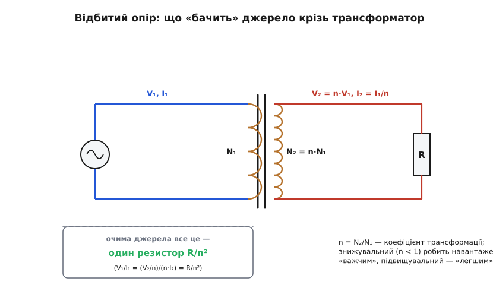

# 🧮 Коефіцієнт трансформації і відбитий опір: чому «множиться на n²»

У трансформатора всього два правила, і обидва коротко формулюються словами: напруга змінюється у стільки разів, скільки витків, а потужність нікуди не дівається. Та з цих двох рядків випливає несподівано багато — зокрема найцікавіший фокус трансформатора, про який у школі майже не кажуть: він уміє не лише міняти напругу й струм, а й «перемальовувати» опір навантаження так, наче той став більшим або меншим. Розберімо все по черзі, тримаючись самих лише законів Ома й збереження енергії — без жодної магії. Спершу побачимо, звідки взагалі береться коефіцієнт n; тоді — чому струм мусить змінитися навпаки; а далі — головний наслідок, відбитий опір, і навіщо він на практиці.

### Звідки n: однакова напруга на кожен виток

Почнімо з найпершого «чому». Обидві обмотки сидять на спільному осерді, і саме осердя збирає магнітний потік і веде його замкненою петлею. Тому крізь **кожен** виток — і первинної, і вторинної обмотки — проходить **той самий** змінний потік: один потік на всіх. А закон [електромагнітної індукції](root:ph-electromagnetism/electromagnetic-induction) каже просту річ: у будь-якому одному витку наводиться напруга, що залежить лише від того, **як швидко міняється потік крізь нього**. Виток не знає, до якої він обмотки належить і скільки в нього сусідів, — він «бачить» тільки темп зміни спільного потоку, а той для всіх однаковий.

Звідси висновок, на якому тримається все інше: кожен виток будь-якої обмотки отримує **однакову** наведену напругу. Трансформатор внутрішньо живе не «вольтами», а «вольтами на виток» — це його справжня внутрішня валюта. А якщо на кожен виток припадає однакова напруга, то повна напруга обмотки — це просто та сама «ціна витка», помножена на кількість витків. Поділивши одну обмотку на іншу, спільний множник скорочується, і лишається голе відношення чисел:

```
V₂ / V₁ = N₂ / N₁ = n        (n — коефіцієнт трансформації, turns ratio)
```

Ось і вся таємниця коефіцієнта n: він не «закон природи сам по собі», а наслідок того, що потік спільний і кожен виток коштує однаково. Більше витків у вторинній (n > 1) — напруга підіймається; менше (n < 1) — опускається.

### Струм: збереження потужності

Тепер друге правило. Ідеальний [трансформатор](root:ph-electromagnetism/mutual-inductance) уявімо як чесного посередника: він енергію не запасає надовго, не гріється і не створює її з нічого. Що зайшло за секунду з боку джерела — те саме мусить вийти з боку навантаження. Миттєва [потужність](root:ph-electromagnetism/electric-power) — це добуток V·I, тож рівність потужностей на двох боках одразу дає рівняння:

```
V₁·I₁ = V₂·I₂        →        I₂ / I₁ = V₁ / V₂ = 1/n
```

Прочитаймо це уважно. Напругу трансформатор помножив на n — отже, щоб добуток V·I лишився тим самим, струм **мусить** поділитися на n. Інакше потужність не зійшлася б, а це заборонено збереженням енергії. Тому напрям завжди протилежний: підняв напругу вдесятеро — струм неодмінно впав удесятеро, і навпаки. Звідси й практичне правило великого пальця: підвищувальний трансформатор «торгує» струмом заради напруги, знижувальний — навпаки, віддає чималий струм за низької напруги (саме тому зварювальний трансформатор, що дає сотні ампер, має на виході лише кілька вольтів). А тепер — наслідок, який вартий окремого розгляду, бо саме він робить трансформатор по-справжньому хитрим приладом.

### Відбитий опір: погляд із первинного боку

Поставмо несподіване питання. Повісьмо на вторинну обмотку звичайний резистор R і спитаймо не «що відбувається на виході», а навпаки — **що «бачить» джерело**, дивлячись у первинну обмотку? Джерело ж не зазирає всередину трансформатора; для нього первинна обмотка — просто двоконтактна «чорна скриня», і єдине, що джерело відчуває, — це який струм потече у відповідь на прикладену напругу. А відношення напруги до струму і є опір — закон Ома очима джерела. Тож обчислимо саме його, підставивши обидва вже відомі правила (V₂ = n·V₁ і I₂ = I₁/n, або в зручнішому тут вигляді V₁ = V₂/n, I₁ = n·I₂):

```
R_видиме = V₁ / I₁ = (V₂/n) / (n·I₂) = (1/n²) · (V₂/I₂)

R_видиме = R / n²
```

Опір навантаження пройшов крізь трансформатор **поділеним на n²** — або, що те саме, помноженим на (N₁/N₂)². Це й називають **відбитим опором** (*reflected impedance*): трансформатор не просто обмінює напругу на струм у самій точці навантаження — він «переносить» опір з одного боку на інший, дорогою масштабуючи його квадратом відношення витків. Резистор фізично сидить на вторинці, але з боку мережі він прикидається зовсім іншим за величиною резистором.


*Навантаження R на вторинній обмотці очима джерела виглядає як один-єдиний резистор R/n². Квадрат — бо трансформатор змінює і напругу (÷n), і струм (×n), а опір є їхнім відношенням, тож обидві зміни перемножуються в одну.*

Чому саме квадрат, а не просто n? Тут варто зупинитися, бо це не випадковість, і зрозумівши причину раз, ви вже ніколи не переплутаєте, у який бік масштабувати. Опір складається з **двох** величин — напруги в чисельнику й струму в знаменнику. Трансформатор б'є по обох одразу й у протилежні боки: напругу він поділив на n, струм помножив на n. Відношення V/I дістає, таким чином, подвійний удар — і зверху, і знизу, — а два множники n зливаються в один n². Це та сама причина, з якої квадрат вискакує і в [джоулевому теплі](root:ph-electromagnetism/joule-heating): потужність пропорційна і V², і I², бо в P = V·I кожен із двох співмножників сам по собі пов'язаний з опором. Скрізь, де перемножуються дві взаємозалежні величини, з'являється квадрат — це загальний візерунок, не дивина саме трансформатора.

**Приклад (перевірка з двох боків).** Знижувальний трансформатор 230 В → 11.5 В (n = 1/20), на вторинці резистор R = 10 Ом. Порахуймо потужність двома незалежними шляхами — і переконаймося, що відповідь та сама:

```
з боку навантаження:  I₂ = 11.5 В / 10 Ом = 1.15 А;   P = 11.5 · 1.15 ≈ 13.2 Вт
відбитий опір:        R_видиме = 10 Ом / (1/20)² = 10 · 400 = 4000 Ом
з боку мережі:        I₁ = 230 В / 4000 Ом ≈ 0.058 А;  P = 230 · 0.058 ≈ 13.2 Вт  ✓
```

Обидва шляхи дають ту саму потужність — формула самоузгоджена, і це не збіг, а пряме відлуння збереження енергії. Зауважте й масштаб ефекту: скромні 10 Ом, увімкнені на вторинці, з боку мережі виглядають як цілих 4 кілооми. Що менший n у знижувального трансформатора, то «важчим» (вищеомним) стає навантаження для джерела — і саме цим можна свідомо користуватися.

### Навіщо це: узгодження без втрат

Тут і ховається практична цінність усієї арифметики. Джерело віддає максимум [потужності тоді, коли опір навантаження дорівнює його власному внутрішньому опору](root:hw-analog/power-matching) — це закон узгодження. А що робити, коли вони фатально не збігаються? Класичний випадок: ламповий підсилювач «любить» навантаження в кілька кілоом, а динамік має лише 4 Ом — різниця в сотні разів. Якщо під'єднати динамік навпрямки, підсилювач віддасть йому крихітну частку своєї потужності, а решту змарнує на собі. Поставити послідовно резистор, щоб «дотягти» опір? Це лише спалить потужність у тому резисторі — навантаженню легше не стане.

Трансформатор розв'язує цей глухий кут елегантно й **без втрат**: підбираємо n так, щоб R/n² дорівнювало якраз тому опору, який джерело хоче бачити, — і готово. Динамік фізично лишається 4-омним, а підсилювач крізь трансформатор бачить «зручні» кілооми й віддає повну потужність. Це й називають **узгодженням опорів** (*impedance matching*); вихідний трансформатор лампового підсилювача — його хрестоматійний приклад, а ще ту саму ідею вживають у лініях зв'язку й на радіочастотах. Те саме правило n² працює не лише для звичайного опору, а й для загальніших [«опорів змінному струмові»](root:hw-components/reactance) — там його звуть узгодженням імпедансів, але механізм незмінний.

> 🔧 **Навіщо це.** Коли наживо стикаєтеся з «дзвінким» чи тихим звуком на саморобному ламповому підсилювачі або з ВЧ-каскадом, що віддає крихти потужності, перша підозра — неузгодженість опорів. Трансформатор (чи його ВЧ-родич) дає змогу підігнати джерело до навантаження, не марнуючи енергію на гріючих резисторах: добираєте відношення витків — і опір «стає» потрібним. Це дешевший і чистіший спосіб, ніж тупо гасити надлишок.

### Межі формули

Лишається чесно окреслити, де ці прості рядки перестають бути точними. Усе виведення спиралося на дві ідеалізації: що увесь потік спільний (тобто зв'язок обмоток ідеальний, коефіцієнт k = 1) і що втрат немає зовсім. Реальний трансформатор обидві умови порушує: частина потоку «тікає» повз вторинну обмотку (потік розсіювання, k < 1), а самі обмотки мають опір міді й гріються. Через це до відбитого R додаються власні опори обмоток і неідеальність зв'язку, тож виміряне джерелом значення трохи відрізняється від голого R/n². Для прикидки формула лишається чудовим першим наближенням, але для точного розрахунку останнє слово — за даташитом конкретного трансформатора. І, звісно, усе це живе тільки на **змінному** струмі в робочій смузі частот: постійному струмові ідеальний [трансформатор](root:ph-electromagnetism/mutual-inductance) не передає нічого, тож і відбивати немає чого.
