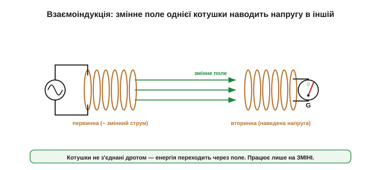
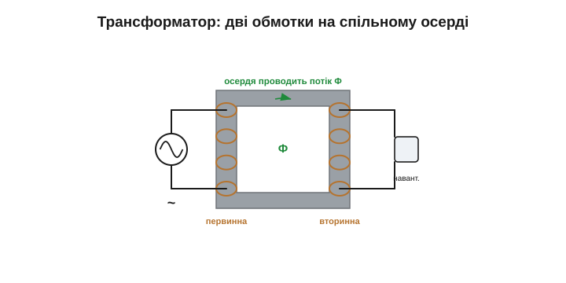
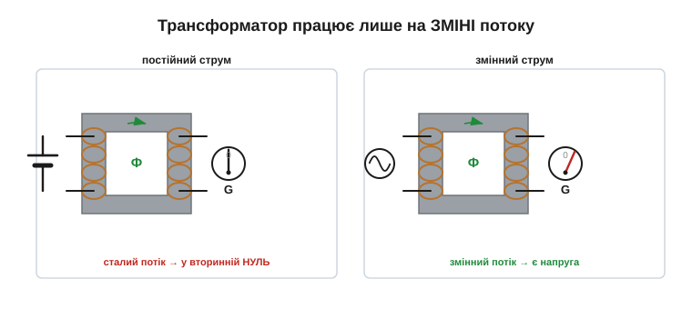
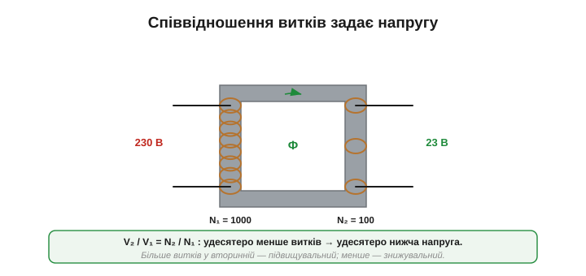
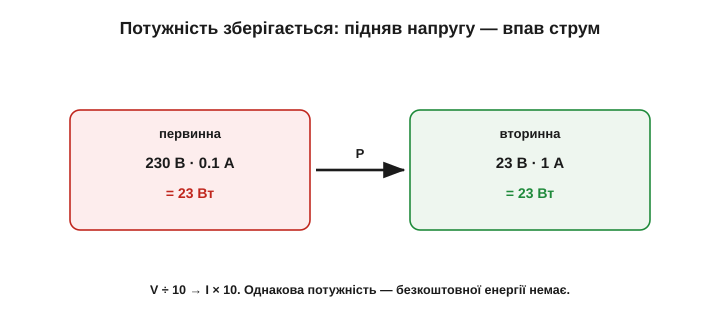
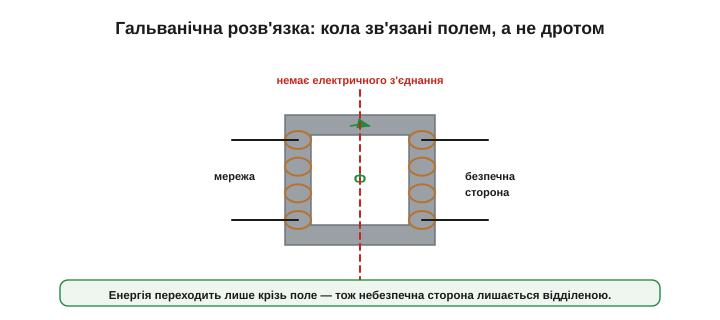
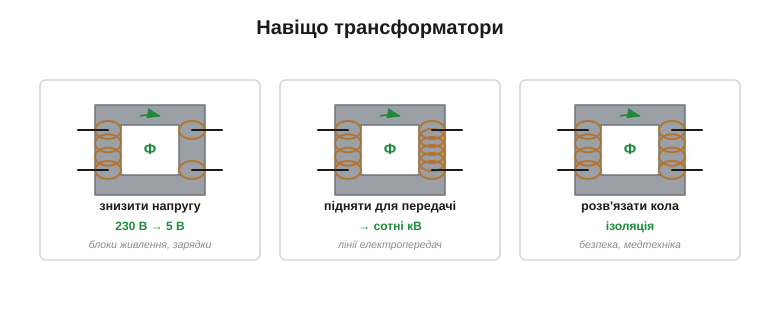

# Взаємоіндукція й трансформація

<preknowlist>
- [Закон електромагнітної індукції Фарадея](topic:ph-electromagnetism/faraday-law) — зміна магнітного потоку крізь виток наводить у ньому напругу; що швидша зміна, то більша напруга.
- [Самоіндукція](topic:ph-electromagnetism/inductance) — котушка наводить напругу у відповідь на зміну власного струму (міра — індуктивність L).
- [Котушка й осердя](topic:ph-electromagnetism/inductor-coil) — намотаний провідник створює магнітний потік, а залізне чи феритове осердя збирає його й проводить замкненим шляхом.
- [Потужність P = V·I](topic:ph-electromagnetism/electric-power) — добуток напруги на струм; в ідеальному приладі скільки потужності зайшло, стільки й виходить.
</preknowlist>

Котушка реагує на власну зміну струму — це [самоіндукція](topic:ph-electromagnetism/inductance). Та поле котушки сягає простору навколо неї, і якщо поруч є **друга** котушка, змінне поле першої наведе напругу й у ній. Це **взаємоіндукція**, і на ній стоїть один із найважливіших винаходів електротехніки — **трансформатор**, прилад, що передає енергію з кола в коло без жодного дроту між ними й попутно змінює напругу. Саме він колись вирішив «війну струмів» на користь змінного. Розберімо його принцип — якісно, але до самої суті. І вся потрібна фізика вже в руках: зміна поля наводить напругу ([Фарадей](topic:ph-electromagnetism/faraday-law)), [осердя проводить потік](topic:ph-electromagnetism/inductor-coil), [енергія зберігається](topic:ph-electromagnetism/electric-power). Лишається скласти це докупи.

> 📜 **Історія до теми:** [трансформатор і перемога змінного струму](topic:ph-electromagnetism/mutual-inductance/hist-transformer.md) — як здатність легко міняти напругу зробила змінний струм переможцем над постійним.

### Взаємоіндукція: одна котушка наводить напругу в іншій

Поставмо дві котушки поруч. Пустимо в першу (**первинну**) змінний струм — її поле теж змінюється. Якщо це змінне поле пронизує другу (**вторинну**) котушку, то, за законом Фарадея, у ній наводиться напруга. Одна котушка «розмовляє» з іншою через спільне магнітне поле, без електричного контакту. Це і є **взаємоіндукція** (*mutual induction*); її міру — наскільки добре поле однієї котушки пронизує іншу — звуть **взаємною індуктивністю** M.

По суті трансформатор — це **дві котушки, навмисне зв'язані** так, щоб поле однієї якнайповніше пронизувало іншу. Якщо [самоіндукція](topic:ph-electromagnetism/inductance) описує, як котушка діє сама на себе (через L), то взаємоіндукція M описує, як вона діє на сусідку. Що тісніше вони зв'язані — спільне осердя, близьке розташування, — то більша M і то ефективніша передача.


*Змінний струм у первинній котушці робить змінне поле; те пронизує вторинну котушку й наводить у ній напругу (Фарадей). Котушки не з'єднані дротом — енергія переходить **через поле**. Ключове слово — «змінне»: сталий струм поля не міняв би, і вторинна мовчала б.*

### Трансформатор: дві обмотки на спільному осерді

Щоб передача була ефективною, обидві котушки намотують на **спільне осердя** (замкнене кільце чи рамку із заліза або фериту). Осердя збирає майже все поле первинної обмотки й проводить його крізь вторинну — адже [магнітні лінії й так прагнуть замкнутися по залізу](topic:ph-electromagnetism/inductor-coil). Так виходить **трансформатор**: первинна обмотка, вторинна обмотка й осердя, що їх магнітно зв'язує.


*Трансформатор. Змінний струм у первинній обмотці робить змінний потік; замкнене осердя проводить його крізь вторинну, наводячи в ній напругу. Обмотки електрично роз'єднані — їх зв'язує лише потік в осерді. Наскільки добре — задає коефіцієнт зв'язку k (в ідеалі ≈ 1).*

Наскільки добре потік первинної обмотки доходить до вторинної, описує **коефіцієнт зв'язку** k: близький до 1 у тісно зв'язаних обмоток на доброму осерді й менший, коли частина поля «тікає» повз вторинну (потік розсіювання). Добрий трансформатор прагне k якомога ближчого до одиниці.

Як саме енергія переходить із кола в коло? Спільний потік в осерді наводить напругу у вторинній обмотці. Щойно до неї під'єднують навантаження, у вторинній тече струм — і той за [законом Ленца](topic:ph-electromagnetism/inductance) намагається **погасити** спільний потік. Первинна обмотка це «відчуває» (потік просів) і бере з джерела більше струму, щоб потік відновити. Так навантаження на виході автоматично «замовляє» рівно стільки потужності на вході, скільки споживає: енергія перетікає крізь поле саме туди, де її беруть. Не навантажений трансформатор бере лише невеликий **намагнічувальний** струм (на підтримку потоку в осерді) плюс трохи на власні втрати в осерді — тобто майже не бере, але й не «зовсім нуль».

### Чому трансформатор живе тільки на змінному струмі

Ось найважливіше, що варто винести з цієї теми. Наводить напругу лише **зміна** потоку. Тож якщо в первинну обмотку пустити **сталий** (постійний) струм, потік буде сталий, його зміна — нуль, і у вторинній обмотці в усталеному режимі **не наведеться нічого**. (Самі **миті** вмикання й вимикання — це ж зміна потоку, тож вони дають у вторинній короткі поодинокі імпульси; але поки струм тече рівно — тиша.) Гірше того: сталий струм у первинній нічим, окрім малого опору обмотки, не обмежений — тож буває **великим**, марно гріє мідь і ще й заганяє осердя в насичення. Тому трансформатор передає лише **змінний** струм, а постійного «не любить» удвічі.


*Постійний струм у первинній → сталий потік → у вторинній нуль. Змінний струм → потік весь час міняється → у вторинній наводиться напруга. Трансформатор за самою своєю природою працює лише зі **зміною** — тобто зі змінним струмом.*

Звідси важливий наслідок для практики: щоб передати трансформатором енергію **постійного** джерела (батареї чи випрямленої мережі), її спершу перетворюють на змінну — електронний ключ ритмічно вмикає й вимикає струм первинної обмотки. Саме так влаштовані **імпульсні** блоки живлення: вони «рубають» постійний струм на високочастотний змінний, проганяють крізь маленький трансформатор, а тоді знову випрямляють. Сам по собі трансформатор постійного струму не визнає. Ця сама прискіпливість до зміни колись і вирішила «війну струмів»: постійний струм було годі легко перетворити на іншу напругу, а змінний — можна, трансформатором і майже без втрат, тож світ зрештою й обрав змінний (докладніше — в історії до теми).

### Співвідношення витків

Трансформатор не лише передає енергію, а й **змінює напругу** — у стільки разів, у скільки відрізняються кількості витків обмоток. Це **співвідношення витків**:

```
V_вторинна / V_первинна = N_вторинна / N_первинна
```

Більше витків у вторинній — напруга **підвищується** (підвищувальний трансформатор); менше — **знижується** (знижувальний). Усе тому, що наведена напруга пропорційна числу витків, які пронизує спільний потік.


*Той самий потік пронизує обидві обмотки. Якщо у вторинній удесятеро менше витків — напруга на ній удесятеро менша (знижувальний). Більше витків — вища напруга (підвищувальний). Напругу задає просте відношення чисел витків.*

**Приклад (знижувальний трансформатор).** Первинна обмотка на 230 В має 1000 витків, вторинна — 100 витків:

```
V_вторинна = V_первинна · (N_вторинна / N_первинна)
V_вторинна = 230 В · (100 / 1000) = 23 В
```

Удесятеро менше витків — удесятеро нижча напруга. Так із мережевих 230 В роблять безпечні 23 В. Зверніть увагу: відношення витків задає лише **напругу**; струм же визначається навантаженням і збереженням потужності. Підвищувальний трансформатор підіймає напругу ціною струму, знижувальний — навпаки, віддає більший струм за нижчої напруги.

### Енергію задарма не дають: V·I зберігається

Трансформатор змінює напругу — але не створює енергії. В ідеальному трансформаторі потужність на вході дорівнює потужності на виході ([P = V·I](topic:ph-electromagnetism/electric-power)). А отже, якщо напруга **підвищилась**, то струм у стільки ж разів **зменшився**, і навпаки:

```
V_первинна · I_первинна = V_вторинна · I_вторинна
```


*Трансформатор «обмінює» напругу на струм за сталої потужності. Підвищив напругу вдесятеро — струм упав удесятеро (і навпаки). Безкоштовної енергії немає: скільки потужності зайшло, стільки й вийшло (мінус невеликі втрати).*

**Приклад (обмін напруги на струм).** Той самий знижувальний трансформатор: на вході 230 В і 0.1 А, тобто P = 23 Вт. На виході 23 В, тож струм:

```
I_вторинна = P / V_вторинна = 23 Вт / 23 В = 1 А
```

Напруга впала вдесятеро (230 → 23 В) — струм виріс удесятеро (0.1 → 1 А). Потужність незмінна.

> 🧮 **Математична вставка:** [коефіцієнт трансформації і відбитий опір — чому «множиться на n²»](topic:ph-electromagnetism/mutual-inductance/math-turns-ratio.md). Три короткі виведення з «вольтів на виток» і збереження потужності — і головний трюк трансформатора: опір навантаження крізь нього виглядає масштабованим у n² разів, що дозволяє узгоджувати джерело з навантаженням без втрат.

Цей обмін напруги на струм — основа всієї енергетики. Електростанція через підвищувальний трансформатор віддає енергію в лінію під сотнями тисяч вольтів: за тієї самої потужності струм у проводах малий, а [втрати на їхній нагрів (I²R)](topic:ph-electromagnetism/joule-heating) — мізерні. Біля міста знижувальні трансформатори поетапно опускають напругу до безпечних 230 В. Без трансформатора передавати енергію на сотні кілометрів було б неможливо — майже все пішло б у тепло дротів. Саме тому світ обрав змінний струм.

### Гальванічна розв'язка

Є в трансформатора й друга цінна якість, що випливає з відсутності електричного контакту між обмотками. Енергія переходить **лише через поле**, тож між первинним і вторинним колами немає прямого провідного шляху. Це **гальванічна розв'язка** (*galvanic isolation*).


*Між первинним і вторинним колами немає електричного з'єднання — лише магнітний зв'язок крізь осердя. Тому небезпечна мережева сторона лишається «по той бік», а вторинне коло можна зробити безпечним і незалежним від землі мережі.*

І це не абстракція, а важлива складова безпеки. Трансформатор у блоці живлення розриває прямий провідний шлях від мережі до вторинного кола: мережевого потенціалу ви **крізь трансформатор** не дістанете, і це справді рятує життя — на тому ж принципі стоять ізоляційні трансформатори в медтехніці й розв'язувальні бар'єри. Та варто відразу окреслити межу, бо тут легко піти надто далеко: розв'язка **не робить вторинний бік автоматично безпечним**. Там теж може стояти висока напруга чи чималий запас енергії, один його полюс часто навмисне заземлюють, а на високих частотах лишаються паразитна ємність і дрібні витоки. Тож «гальванічно розв'язано» означає рівно «нема прямого кола до мережі» — а не «можна сміливо хапатися руками».

### Реальний трансформатор не ідеальний

Усе вище — про ідеальний трансформатор. Справжній має втрати, через які виходить трохи менше потужності, ніж зайшло. По-перше, обмотки з міді мають опір і гріються (I²R) — це «мідні» втрати. По-друге, гріється саме осердя, від двох явищ: **вихрових струмів** (змінне поле наводить струми в металі осердя — тому осердя роблять із тонких ізольованих пластин або з фериту, щоб ці струми приборкати) і **перемагнічування** ([магнітні домени осердя](topic:ph-electromagnetism/inductor-coil) щоразу перевертаються не без «тертя»). По-третє, не весь потік доходить до вторинної — частина «тікає» повз неї (потік розсіювання, k < 1). Тому ККД реального трансформатора хоч і високий (часто 95–99%), та не стовідсотковий, і під навантаженням деталь відчутно теплішає.

### Навіщо трансформатори

Зведімо застосування. Трансформатор робить три речі: **змінює напругу**, **розв'язує** кола й (рідше) **узгоджує** опори.

[Трансформатори в пристроях](topic:hw-components/transformer) трапляються всюди, де є змінний струм: від мережевих підстанцій (сотні тисяч вольтів) до зарядки телефона (одиниці вольтів), від зварювальних апаратів (низька напруга, величезний струм) до аудіотехніки й високовольтних блоків. Той самий принцип дає геть різні на вигляд деталі: важкий мережевий трансформатор на 50 Гц і крихітний феритовий на десятки-сотні кілогерц. Причина одна: що частіше міняється потік, то більшу напругу він наводить за тих самих витків — тож на високій частоті осердю досить крихітного перерізу, і кілограм заліза стискається до тридцяти грамів фериту. Класичний «важкий» трансформатор ви бачили в старих зарядках; у сучасному імпульсному блоці живлення він теж є, лише малий і на феритовому осерді.

Про третю, тоншу роль варто сказати окремо. Оскільки трансформатор міняє і напругу, і струм, він міняє й їхнє відношення — тобто «видимий» опір навантаження з боку первинної обмотки (він масштабується квадратом відношення витків). Це використовують для **узгодження опорів**: наприклад, щоб низькоомний динамік «здавався» підсилювачу зручнішим навантаженням — тобто щоб його [опір з боку джерела](topic:hw-components/reactance) виглядав потрібної величини.


*Головні ролі: знизити мережеву напругу до робочої (блоки живлення, зарядки); підняти напругу для передачі енергії на відстань; гальванічно розв'язати небезпечну й безпечну сторони. В імпульсних блоках живлення трансформатор працює на високій частоті, тож стає крихітним.*

---
