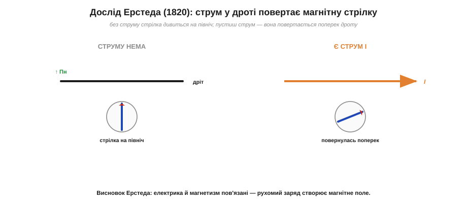
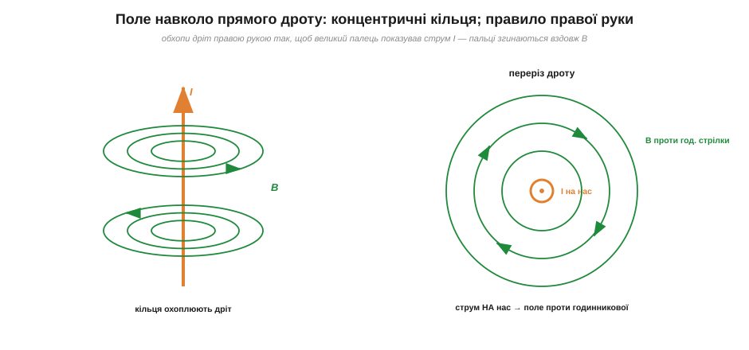
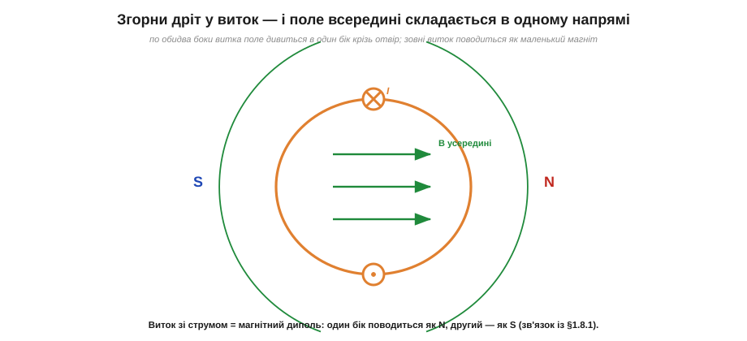

# Струм народжує поле: дослід Ерстеда й правило правої руки

Дві тисячі років магнетизм здавався окремим світом: магніти, домени, полюси — самі по собі, електрика — сама по собі. Компас і бурштин вважали двома різними загадками, що не мають між собою нічого спільного. **Поворотний момент** усієї фізики XIX століття зшив ці дві загадки в одну, і без нього не було б ні моторів, ні генераторів, ні трансформаторів, ні самої електротехніки. Виявилося, що **електричний струм створює навколо себе магнітне поле**.

### Дослід Ерстеда: дріт повертає стрілку

У 1820 році данський фізик **Ганс Крістіан Ерстед** (*Hans Christian Ørsted*) показав експеримент, простий до краю — і саме тому такий переконливий. Він поклав провідник поряд із магнітною стрілкою компаса. Доки струму не було, стрілка спокійно дивилася на північ, як їй і належить у полі Землі. Та щойно Ерстед **пустив дротом струм**, стрілка несподівано **повернулася** — стала майже поперек дроту. Вимкнув струм — стрілка вернулася на північ.


*Дослід Ерстеда (1820). Без струму магнітна стрілка показує на північ (поле Землі). Щойно дротом пускають струм I, навколо нього виникає магнітне поле, і стрілка повертається вздовж нього — майже поперек дроту. Прибрали струм — стрілка вернулася. Висновок: рухомий заряд (струм) створює магнітне поле.*

Це був грім серед ясного неба. Стрілка — суто магнітний прилад — відгукнулася на **електричний** струм. Отже, електрика й магнетизм пов'язані: те, що тече дротом, якимось чином діє як магніт. Звістка облетіла Європу за тижні, і вже того ж 1820 року Андре-Марі Ампер дав цьому явищу [кількісний опис](topic:ph-electromagnetism/ampere-force). Так народилася **електродинаміка** — і так зник дволітній поділ на «електрику» й «магнетизм».

Щоб відчути, наскільки це було несподівано, варто згадати ще одну деталь досліду. Стрілка повернулася не **до** дроту й не **від** нього, як було б, якби струм просто притягував чи відштовхував її, наче заряд. Вона стала **поперек**, нібито поле обходить дріт по колу. Це спантеличило сучасників: жодна знайома сила так не діяла. Притягання й відштовхування зарядів спрямовані вздовж лінії між ними; а тут сила була **збоку**, перпендикулярна. Саме ця «бічна», поперечна природа магнітної дії — наскрізний мотив магнетизму: вона визначає й [силу між провідниками зі струмом](topic:ph-electromagnetism/ampere-force), і [ефект Холла](topic:ph-condensed/hall-effect). Магнетизм від самого початку поводиться не так, як електростатика, — і дослід Ерстеда був першим тому свідченням.

Можна спитати глибше: а **чому** рухомий заряд породжує поле, та ще й таке дивне, поперечне? Найглибша відповідь, до якої дійшла фізика XX століття, така: магнетизм — це, по суті, **релятивістський бік електрики**. Те, що для нерухомого спостерігача виглядає як суто магнітна сила від струму, для спостерігача, який рухається разом із зарядами, частково перетворюється на звичайну електричну. Електричне й магнітне поля — два прояви єдиного **електромагнітного** поля, і який саме прояв ми бачимо, залежить від руху. Це красива, але непроста ідея; для практики ж досить твердого факту Ерстеда — **струм створює магнітне поле** — і вміння цим полем користуватися.

> 📜 Чи справді стрілка смикнулася **випадково**, посеред лекції, як любить розповідати легенда? Сам Ерстед наполягав, що шукав цей зв'язок свідомо. Як було насправді й чому історія обросла анекдотом — у [історії розділу](topic:ph-electromagnetism/magnetic-field/hist-lodestone-oersted.md).

### Поле прямого провідника: концентричні кільця

Який же вигляд має поле навколо дроту зі струмом? Підказку дала сама стрілка Ерстеда: вона ставала **поперек** дроту, а не вздовж і не до нього. Якщо обійти провідник із компасом, стрілка весь час буде дотичною до кола, у центрі якого — дріт. Отже, силові лінії магнітного поля прямого струму — це **концентричні кола**, що охоплюють провідник.


*Поле прямого провідника зі струмом — це система **концентричних кілець** навколо дроту (зліва — погляд збоку, справа — у перерізі). Поле сильніше біля дроту й слабшає з відстанню. Напрям обходу кілець задає **правило правої руки**.*

Ці кільця не мають ні початку, ні кінця — вони замкнені, як і годиться [лініям магнітного поля](topic:ph-electromagnetism/magnetic-field). Поле прямого струму буквально утворює кола навколо дроту: немає де початися чи скінчитися лінії, на відміну від ліній електричного поля, що впираються кінцями в заряди. Поле найсильніше біля самого дроту й спадає обернено пропорційно до відстані. Кількісно це записують простою формулою:

```
B = μ₀ · I / (2π · r)
```

де **I** — струм у дроті, **r** — відстань до осі дроту, а **μ₀** ≈ 1.257 × 10⁻⁶ Тл·м/А — магнітна стала. Зверніть увагу на закон спадання: тут **1/r**, а не 1/r², як [для точкового заряду](topic:ph-electromagnetism/coulomb-law). Поле довгого дроту слабшає повільніше за поле точки — бо дріт «довгий», його внески складаються вздовж усієї лінії. Удвічі далі від дроту — удвічі слабше поле; саме це визначає, на якій відстані поле проводу зрівняється з [полем Землі](topic:ph-electromagnetism/earth-magnetic-field). А **напрям**, у який «крутяться» кільця, визначає одне з найкорисніших правил усієї електротехніки.

### Правило правої руки

Звідки знати, за чи проти годинникової стрілки спрямоване поле? Природа тут не симетрична: напрям поля жорстко прив'язаний до напряму струму. Запам'ятати зв'язок допомагає **правило правої руки** (*right-hand rule*):

> Обхопіть провідник правою рукою так, щоб **великий палець** показував напрям струму I (за [умовним напрямом](topic:ph-electromagnetism/current-direction) — від плюса до мінуса). Тоді **зігнуті пальці** показують напрям магнітного поля B навколо дроту.

Просте й безвідмовне. Якщо струм тече вгору, поле обходить дріт проти годинникової стрілки (якщо дивитися згори); якщо вниз — за годинниковою. У перерізі це зручно малювати так: струм **на нас** позначають кружком із крапкою (вістря стріли, що летить до нас), струм **від нас** — кружком із хрестиком (хвіст стріли). Для струму «на нас» поле йде проти годинникової стрілки.

Тут чигає одна пастка, через яку легко помилитися на півоберта. Правило правої руки прив'язане до **умовного** напряму струму — від плюса до мінуса, тобто до напряму руху уявних додатних зарядів. А реальні електрони біжать **назустріч** цьому напряму. Тож якщо мислити рухом електронів, треба брати **ліву** руку (або повернути результат на 180°). У всій інженерній практиці домовилися користуватися саме умовним струмом і **правою** рукою — так роблять усі схеми, даташити й розрахунки. Головне — не змішувати дві картини в одній задачі: визначившись користуватися умовним струмом, послідовно тримаймося його, і права рука ніколи не підведе.

> 🔧 **Навіщо це.** Правило правої руки — робочий інструмент, а не формальність. Воно пояснює, чому два паралельні дроти зі струмом створюють поле один навколо одного — і через це [притягуються чи відштовхуються](topic:ph-electromagnetism/ampere-force). Воно ж підказує, чому довгі сигнальні дроти краще не лишати петлями: кожна петля зі струмом — це маленький магніт, що випромінює поле й ловить чуже, а звідси й [наведені завади](topic:ph-electromagnetism/inductive-coupling). А ще саме воно дає напрям поля в котушці електромагніта.

### Згорни дріт у виток — поля складуться

Поле одного прямого дроту слабке й «розмазане» кільцями. Але варто **зігнути** дріт у кільце — і картина різко змінюється на користь. Уявімо виток зі струмом. За правилом правої руки поле кожної ділянки дроту охоплює її кільцем; а всередині витка ці кільця від усіх ділянок **складаються в один бік** — крізь отвір витка. Зовні ж вони частково гасяться й розходяться.


*Згорнутий у виток провідник: усередині поля від усіх ділянок дроту додаються й дивляться в один бік крізь отвір, а зовні поле розходиться й замикається петлями. У результаті виток зі струмом поводиться **точно як магнітний диполь**: один його бік — північний полюс N, другий — південний S.*

Це глибокий і важливий результат: **виток зі струмом — це магнітний диполь**. Один його бік стає північним полюсом, другий — південним; яким саме — знову підкаже права рука (тепер пальці згинаються вздовж струму витка, а **великий палець показує на N**). Ось і розгадка, звідки беруться [полюси без монополів](topic:ph-electromagnetism/magnetic-field): полюс — це просто **кінець петлі струму**. І атомний магнетизм заліза, по суті, той самий: мікроскопічні струми (рух і спін електронів) — це мікроскопічні витки, у кожного свій N і S, нероздільні за самою своєю природою.

Тут проступає й глибша причина. [Магнетизм речовини](topic:ph-condensed/ferromagnetism) народжується зі спінів і орбітального руху електронів, і видно, **чому** він завжди дипольний: кожен такий мікроскопічний рух заряду — це крихітна петля струму, а петля має два кінці, ніколи — один. Ось чому в речовині не буває «магнітного заряду»: на найглибшому рівні весь магнетизм зведений до **струмів-петель**, а петля монополем бути не може. Велика картина складається: і постійний магніт, і електромагніт, і намагнічене залізо — усе це, зрештою, струми, що течуть по контурах, великих чи мікроскопічних.

Кількісно поле в центрі одного круглого витка радіуса R зі струмом I дорівнює B = μ₀·I/(2R), а для котушки з N витків воно у N разів більше. Не обов'язково заучувати цю формулу — важлива закономірність: поле росте з числом витків і струмом і слабшає з розміром витка. Саме на цій закономірності тримається [електромагніт](topic:ph-electromagnetism/electromagnet), де багато витків складають свої поля в одне сильне.

**Приклад (поле під лінією електропередачі).** Прямий провід несе струм I = 100 А. Яке магнітне поле він створює на відстані r = 1 м (порядок поля під побутовою повітряною лінією)?

```
B = μ₀ · I / (2π · r)
B = (1.257×10⁻⁶ Тл·м/А · 100 А) / (2π · 1 м)
B = (1.257×10⁻⁴) / 6.283
B ≈ 2.0 × 10⁻⁵ Тл = 20 мкТл
```

Близько 20 мкТл — це приблизно **половина** поля Землі. Тобто навіть під лінією зі значним струмом магнітне поле на рівні людини співмірне із земним, а не катастрофічне. Зате прямо біля дроту (на сантиметрах) воно стає набагато сильнішим — і саме там компас уже безнадійно «бреше».

> ⚙️ **Алгоритмічна вставка:** [поле довільного контуру чисельно — складаємо внески за Біо–Саваром](topic:ph-electromagnetism/oersted-experiment/proj-biot-savart.md) — як порахувати поле дроту будь-якої форми, розбивши його на крихітні відрізки й підсумувавши їхні внески.

**Приклад (у який бік дивиться північ котушки).** Нехай дивимося на виток із торця, і струм по ньому йде **проти годинникової стрілки**. Куди спрямоване поле всередині й де північний полюс?

```
струм по витку (як ми бачимо): проти годинникової стрілки
права рука: пальці згинаємо за струмом (проти год. стрілки)
            → великий палець дивиться НА НАС
отже: поле всередині витка спрямоване на нас
      бік витка, що до нас, — це північний полюс N
```

Тобто якщо струм тече проти годинникової стрілки з нашого боку, то саме цей бік витка є північним полюсом і поле «б'є» з нього на нас. Перевернувши виток або змінивши напрям струму, ми поміняємо полюси місцями. Те саме правило задає полюси й цілої [котушки](topic:ph-electromagnetism/electromagnet) — кожен виток у ній додає свій внесок.

---
