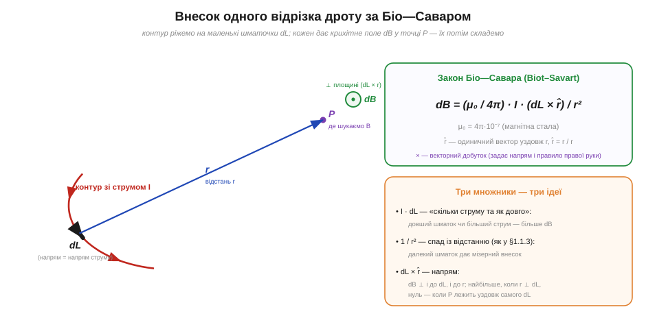
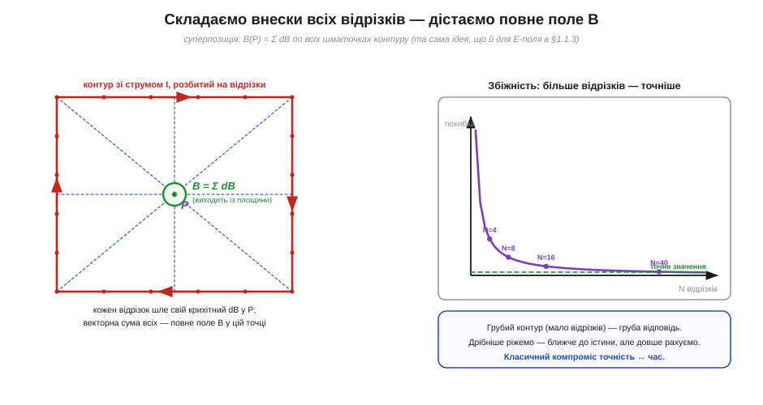

# ⚙️ Поле довільного контуру чисельно: складаємо внески за Біо—Саваром

Довкола провідника зі струмом завивається магнітне поле, а [правило правої руки](topic:ph-electromagnetism/oersted-experiment) задає його напрям. Для прямого дроту й рівного кільця поле навіть має акуратну формулу. Але реальний контур рідко буває прямим чи круглим — це прямокутна рамка, доріжка на платі, виток складної форми. Готової формули для такого немає. Зате є рецепт, що працює для **будь-якої** форми: поріж дріт на крихітні шматочки, порахуй внесок кожного й **склади їх**. Цей рецепт — закон Біо—Савара (*Biot–Savart law*), і його напрочуд легко доручити мікроконтролеру.

### Задача

Маємо замкнений контур зі струмом *I* довільної форми та точку *P* у просторі. Треба знайти вектор магнітного поля **B** (*magnetic flux density*, Тл) у цій точці.

Аналітична відповідь існує лише для кількох ідеалізованих випадків: нескінченний прямий дріт (B = μ₀I/2πd), кільце на своїй осі, довгий соленоїд. Щойно форма стає реальною — квадратна рамка, дуга, доріжка з вигинами, котушка з кінцевою довжиною — інтеграл уже не береться напряму, і доводиться рахувати **чисельно**. Та сама ситуація, що й з [електричним полем](topic:ph-electromagnetism/electric-field) складеної системи зарядів: окрема формула не виручає, тож поле будують **підсумовуванням внесків**.

### Ідея: кожен шматочок дроту — крихітне джерело поля

Біо—Савар каже, що нескінченно малий відрізок дроту **dL**, яким тече струм *I*, створює в точці *P* нескінченно мале поле:

```
dB = (μ₀ / 4π) · I · (dL × r̂) / r²
```

Тут **r** — вектор від відрізка до точки *P*, *r* — його довжина, **r̂** = **r**/*r* — одиничний вектор того ж напряму, а μ₀ = 4π·10⁻⁷ Тл·м/А — магнітна стала (*permeability of free space*). Знак «×» — це **векторний добуток** (*cross product*): він бере два вектори й видає третій, перпендикулярний до них обох, а його довжина — найбільша, коли вектори перпендикулярні, і нульова, коли паралельні.


*Внесок одного відрізка. Контур ріжемо на маленькі шматочки **dL** (їхній напрям збігається з напрямом струму). Від середини шматочка до точки *P* проводимо вектор **r**. Формула розкладається на три зрозумілі множники: *I*·dL — «скільки струму й на якій довжині», 1/r² — спад із відстанню (той самий, що в [полі заряду](topic:ph-electromagnetism/electric-field)), а dL × r̂ — напрям, перпендикулярний і до дроту, і до **r** (це і є правило правої руки в математичній формі). Внесок dB найбільший, коли **r** перпендикулярний до dL, і зникає, коли *P* лежить точно на продовженні шматочка.*

Кожен із трьох множників несе свою фізику. Добуток *I*·dL каже: більший струм або довший шматок дають більший внесок. Дільник *r*² — це знайомий закон оберненого квадрата: далекий шматок дроту майже не впливає на поле в точці. А векторний добуток dL × r̂ відповідає за **напрям** — він і ставить поле «кільцем» навколо дроту, як того й вимагає [правило правої руки](topic:ph-electromagnetism/oersted-experiment).

Оскільки поле підкоряється **суперпозиції** (внески від різних шматочків просто додаються — так само, як для [електричного поля](topic:ph-electromagnetism/electric-field)), повне поле в точці — це сума по всьому контуру:

```
B(P) = Σ dBₖ     (сума по всіх відрізках k контуру)
```

Аналітик написав би тут [інтеграл](topic:math-analysis/integral) по замкненій кривій; для комп'ютера інтеграл — це просто сума багатьох малих доданків. Тому рецепт прямий: **ріжемо контур на N відрізків, для кожного рахуємо dB і додаємо у спільний вектор**.


*Ліворуч: прямокутний контур розбито на відрізки; кожен шле свій крихітний **dB** у точку *P* (тут — у центрі рамки), а векторна сума всіх дає повне поле **B**. Праворуч: що дрібніше ріжемо контур, то ближче відповідь до точного значення — похибка спадає приблизно як 1/N. Грубий контур дає грубу оцінку швидко; дрібний — точну, але повільніше. Класичний компроміс точність ↔ час.*

### Псевдокод

Щоб віддати цей рецепт коду, спершу домовмося, як подати контур. Задаємо його як **ламану з вузлів** — список точок у просторі (для замкненого контуру останній вузол збігається з першим). Кожен відрізок між сусідніми вузлами трактуємо як один елементарний dL, а точку прикладання беремо посередині відрізка. Поле — це 3-вимірний вектор, тож накопичуємо три компоненти.

:::tabs
```cpp
#include <array>
#include <vector>
#include <cmath>

using Vec3 = std::array<double, 3>;

// векторний добуток двох 3-векторів
Vec3 cross(const Vec3 &u, const Vec3 &v) {
    return { u[1]*v[2] - u[2]*v[1],
             u[2]*v[0] - u[0]*v[2],
             u[0]*v[1] - u[1]*v[0] };
}

// node[0..N], node[N] == node[0] (замкнено); струм I; точка P
Vec3 biot_savart(const std::vector<Vec3> &node, double I, const Vec3 &P) {
    const double k = 1e-7;             // μ₀ / 4π
    const double r_min = 1e-4;         // захист від ділення на ~0 (див. пастки)
    Vec3 B = {0.0, 0.0, 0.0};
    for (size_t i = 0; i + 1 < node.size(); i++) {
        const Vec3 &a = node[i];
        const Vec3 &b = node[i + 1];
        Vec3 dL  = { b[0]-a[0], b[1]-a[1], b[2]-a[2] };   // вектор відрізка (напрям = напрям струму)
        Vec3 mid = { (a[0]+b[0])/2, (a[1]+b[1])/2, (a[2]+b[2])/2 };  // точка прикладання — середина
        Vec3 r   = { P[0]-mid[0], P[1]-mid[1], P[2]-mid[2] };        // вектор від дроту до P
        double rmag = std::sqrt(r[0]*r[0] + r[1]*r[1] + r[2]*r[2]);  // довжина r
        if (rmag < r_min) continue;    // пропустити відрізок біля дроту
        Vec3 c = cross(dL, r);         // векторний добуток dL × r
        double s = k * I / (rmag*rmag*rmag);   // = k·I/r³,  бо r̂/r² = r/r³
        B[0] += s * c[0];
        B[1] += s * c[1];
        B[2] += s * c[2];
    }
    return B;                          // вектор (Bx, By, Bz) у теслах
}
```
```python
import numpy as np

# node[0..N], node[N] == node[0] (замкнено); струм I; точка P
def biot_savart(node, I, P):
    node = np.asarray(node, dtype=float)
    P = np.asarray(P, dtype=float)
    k = 1e-7                            # μ₀ / 4π
    r_min = 1e-4                        # захист від ділення на ~0 (див. пастки)
    B = np.zeros(3)
    for i in range(len(node) - 1):
        a, b = node[i], node[i + 1]
        dL  = b - a                     # вектор відрізка (напрям = напрям струму)
        mid = (a + b) / 2               # точка прикладання — середина
        r   = P - mid                   # вектор від дроту до P
        rmag = np.linalg.norm(r)        # довжина r
        if rmag < r_min:                # пропустити відрізок біля дроту
            continue
        c = np.cross(dL, r)             # векторний добуток dL × r
        B += k * I * c / rmag**3        # = k·I·(dL × r̂)/r²,  бо r̂/r² = r/r³
    return B                            # вектор (Bx, By, Bz) у теслах
```
:::

Одна деталь економить ділення: множник (dL × r̂)/r² дорівнює (dL × **r**)/r³, бо r̂ = **r**/r. Тому в коді беремо **невнормований** вектор **r**, рахуємо добуток із ним і ділимо на rmag³ — нормувати **r** окремо не треба.

> 🔧 **Навіщо це.** Саме так працює будь-який «магнітний» симулятор — від оцінки поля котушки в FEMM до прикидки, чи не наведе доріжка на платі завади на сусідню лінію. Маючи 20 рядків коду, ви рахуєте поле контуру, для якого формули в довіднику просто немає: дуги, рамки, спіралі, кілька витків поспіль.

**Приклад (поле в центрі круглого витка).** Перевірмо рецепт на випадку з відомою відповіддю. Виток радіуса R = 5 см, струм I = 1 А; точне поле в центрі — B = μ₀·I/(2R). Розіб'ємо коло на N рівних хорд і складемо внески:

```
точне:   B = μ₀·I/(2R) = (4π·10⁻⁷ · 1) / (2 · 0.05) = 12.566 мкТл

чисельно (хорди, точка прикладання — середина хорди):
   N = 4      →  22.63 мкТл   (похибка +80 %)
   N = 8      →  14.35 мкТл   (похибка +14 %)
   N = 16     →  12.98 мкТл   (похибка +3.3 %)
   N = 40     →  12.63 мкТл   (похибка +0.5 %)
   N = 360    →  12.567 мкТл  (похибка +0.01 %)
```

Грубий восьмикутник уже дає правильний порядок, а кілька десятків відрізків — інженерну точність. (Сума трохи завищує, бо середина хорди лежить ближче до центра, ніж сама дуга, тож множник 1/r² переоцінено; з дрібнішим кроком це зникає.) Головне — той самий код порахував би поле й для квадратної рамки, де формули «з підручника» немає.

### Складність і пастки на МК

Цикл короткий, але між «працює на прикладі» і «працює надійно» лежить кілька дрібниць, які на мікроконтролері легко перетворюються на `NaN` чи на змарновані такти. Зберемо їх докупи.

- **Складність.** Поле в одній точці — O(N) за числом відрізків. Якщо будуємо **карту** поля у M точках простору — O(N·M), і це швидко стає важким: сітка 100×100 точок при контурі з 200 відрізків — це вже 2 мільйони обчислень добутку. На мікроконтролері карту рахують грубою сіткою або наперед (offline), а в реальному часі лишають кілька ключових точок.
- **Ділення на майже нуль.** Коли точка *P* підходить впритул до дроту, *r* → 0, а 1/r³ вибухає — поле «йде в нескінченність». Це артефакт нескінченно тонкого дроту: у реальному провіднику струм розмазаний по перерізу. Тому ставимо поріг **r_min** (наприклад, радіус дроту) і або пропускаємо такі відрізки, або обмежуємо знаменник. Без цього захисту програма видасть `inf`/`NaN` рівно тоді, коли точка опиниться на контурі.
- **Дискретизація — це похибка.** Заміна гладкої кривої ламаною завжди трохи бреше; похибка спадає приблизно як 1/N. На гострих вигинах і близько до дроту крок треба дрібнити, далеко — можна крупніше. Ставте крок під потрібну точність, а не «про запас»: зайві відрізки коштують часу дарма.
- **Три компоненти, не одна.** **B** — вектор. Початківці часто додають лише «довжини» dB і втрачають напрям; накопичувати треба окремо Bx, By, Bz, інакше внески, спрямовані врізнобіч, не скоротяться як належить. Підсумкову довжину |**B**| беремо вже з трьох компонент.
- **Одиниці й масштаб.** Координати — у метрах, струм — в амперах, тоді **B** виходить у теслах; типові поля тут — мікротесли, тож зручно одразу множити на 10⁶ і працювати в мкТл. На МК без апаратного float ці квадратні корені й ділення помітно навантажують — fixed-point тут підступний через величезний діапазон 1/r³, тож для контролера або беруть float, або старанно масштабують.
- **Один виток — мало.** Реальна котушка має *n* витків; у моделі це означає *n* копій контуру (або просто множник *n* для щільної обмотки). Не забувайте: поле росте пропорційно і струму, і числу витків — це добуток *I*·*n* (ампер-витки).

Отак закон Біо—Савара з абстрактної формули перетворюється на короткий цикл, що рахує магнітне поле контуру будь-якої форми. Це той самий загальний патерн «поріж на малі частини, склади внески», що працює й для [електричного поля](topic:ph-electromagnetism/electric-field), — і він лежить в основі кожного інструмента, що малює магнітні картини.
