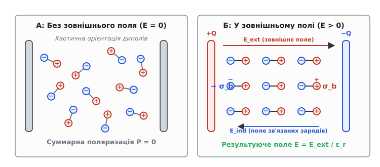
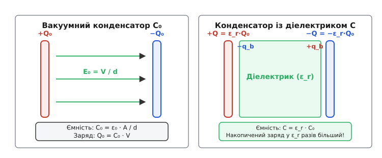
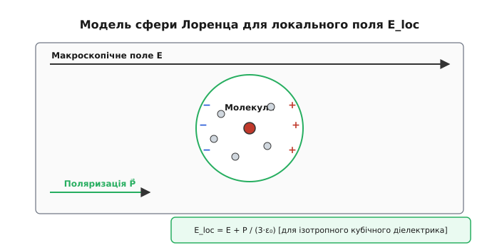
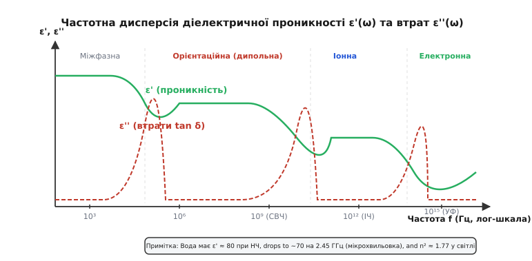

# Діелектрична проникність

<preknowlist>
- [Електричне поле](topic:ph-electromagnetism/electric-field) — напруженість поля E, векторна характеристика дії на заряд.
- [Закон Кулона](topic:ph-electromagnetism/coulomb-law) — сила між зарядами у вакуумі та електрична стала ε₀.
- [Електричний заряд](topic:ph-electromagnetism/electric-charge) — вільні та зв'язані заряди в речовині.
- [Електричний потенціал](topic:ph-electromagnetism/electric-potential) — різниця потенціалів і напруга в полі.
</preknowlist>

Якщо зарядити дві паралельні металеві пластини у вакуумі й виміряти напругу між ними, а потім заповнити простір між ними очищеною дистильованою водою, напруга на пластинах миттєво впаде у 80 разів. Сам заряд на металевих обкладках при цьому нікуди не зникає і не стікає — хімічно чиста вода є чудовим ізолятором і не проводитиме постійного струму. Проте електричне поле всередині середовища стає у 80 разів слабшим, ніж у порожнечі. Здатність речовини послаблювати зовнішнє електричне поле за рахунок внутрішньої перебудови власних зарядів або, навпаки, накопичувати енергію електричного поля називається **діелектричною проникністю** (*permittivity*, від латинського *permittere* — дозволяти, пропускати).

Цей параметр визначає фундаментальну поведінку матерії в електростатичних та змінних полях. Без розуміння діелектричної проникності неможливо розрахувати ані ємність звичайного конденсатора, ані швидкість поширення сигналу в материнській платі комп'ютера, ані глибину проникнення радіохвиль у морську воду чи людську тканину.

---

### 1. Загадка конденсатора: як речовина послаблює поле

Щоб зрозуміти фізичну природу діелектричної проникності, порівняємо поведінку двох типів речовин — провідників та діелектриків — при внесенні їх у зовнішнє однорідне електричне поле `E_ext`.

У провіднику (наприклад, у шматку міді чи алюмінію) є величезна кількість вільних носіїв заряду — електронів провідності. Під дією зовнішньої сили `F⃗ = q · E⃗_ext` вільні електрони миттєво починають рухатися проти напрямку поля. Вони накопичуються на лівій поверхні тіла, залишаючи на правій поверхні некомпенсований позитивний заряд атомних остовів. Ці індуковані поверхневі заряди створюють власне внутрішнє поле `E⃗_ind`, спрямоване назустріч зовнішньому. Перерозподіл триває доти, доки внутрішнє поле повністю не компенсує зовнішнє:

```
E⃗_net = E⃗_ext + E⃗_ind = 0        [усередині ідеального провідника]
```

У результаті всередині провідника результуюче поле стає строго нульовим, а весь потенціал вирівнюється.

У **діелектриках** (ізоляторах) вільних зарядів немає — усі електрони міцно зв'язані зі своїми атомами або хімічними зв'язками. Проте вони не зафіксовані абсолютно жорстко. Під дією зовнішнього поля негативно заряджені електронні хмари трохи зміщуються проти поля, а позитивно заряджені ядра атомів — уздовж поля. Якщо ж речовина складається з полярних молекул, які вже мають власний дипольний момент (як кутова молекула води `H₂O`), поле намагається розвернути ці молекули своїми силами.


*При внесенні діелектрика в електричне поле на його протилежних гранях виникають зв'язані поверхневі заряди протилежного знаку. Вони створюють внутрішнє поле E_ind, яке частково послаблює зовнішнє поле E_ext.*

У результаті мікроскопічного зміщення зарядів на лівій грані діелектричного бруса виникає некомпенсований негативний поверхневий заряд, а на правій грані — позитивний. Цей заряд називають **зв'язаним зарядом** (*bound charge*), оскільки його неможливо зняти з поверхні заземленим дротом чи перенести на інше тіло — він утримується внутрішніми атомними силами речовини.

Зв'язані поверхневі заряди з густиною `σ_b` створюють усередині діелектрика власне протилежно спрямоване поле `E_ind = σ_b / ε₀`. Результуюче поле всередині середовища стає меншим за зовнішнє:

```
E = E_ext - E_ind
```

Відношення напруженості зовнішнього поля у вакуумі `E_ext` до напруженості результуючого поля в речовині `E` називається **відносною діелектричною проникністю** (`εᵣ`, *relative permittivity*):

```
εᵣ = E_ext / E
```

Оскільки `E < E_ext`, для будь-якої речовини `εᵣ > 1` (для вакууму за визначенням `εᵣ = 1`). Наприклад, для сухого повітря `εᵣ ≈ 1.0006`, для тефлону `εᵣ ≈ 2.1`, для склотекстоліту `εᵣ ≈ 4.5`, для чистої води `εᵣ ≈ 80`, а для спеціальних керамік на основі титанату барію `εᵣ` може сягати 3000–10 000.

Добуток відносної діелектричної проникності речовини `εᵣ` на електричну сталу вакууму `ε₀` називається **абсолютною діелектричною проникністю** (`ε`):

```
ε = εᵣ · ε₀

ε₀ ≈ 8.854 × 10⁻¹² Ф/м  (або Кл²/(Н·м²))
```

Розмірність абсолютної проникності `ε` в системі SI — фарад на метр (Ф/м). Вона показує, яка ємність утворюється між двома плоскими електродами площею 1 м², віддаленими на 1 метр один від одного в даному середовищі.

> 📜 **Хто першим зважив діелектричний ефект.** Вперше явище збільшення ємності при введенні ізоляторів виявив Майкл Фарадей у 1837 році за допомогою концентричних сферичних конденсаторів. Детальніше про це читайте у вставці [Історія відкриття діелектриків](topic:ph-electromagnetism/permittivity/hist-polarization.md).

---

### 2. Вектор електричного зсуву D та макроскопічні рівняння поля

Наявність у середовищі двох типів зарядів — вільних `Q_free` (які ми подаємо від джерела живлення на металеві електроди) та зв'язаних `Q_bound` (які виникають самі внаслідок поляризації діелектрика) — сильно ускладнює пряме застосування закону Гаусса.

Закон Гаусса у вакуумі стверджує, що потік вектора напруженості електричного поля `E⃗` через будь-яку замкнену поверхню `S` пропорційний **повному** заряду всередині цієї поверхні:

```
∮_S E⃗ · dA⃗ = Q_total / ε₀ = (Q_free + Q_bound) / ε₀
```

Але зв'язаний заряд `Q_bound` наперед невідомий — він сам залежить від підсумкового поля `E`, яке ми намагаємося розрахувати! Виходить замкнене коло.

Щоб обійти цю складність, інженерна та теоретична физика вводить векторну величину, що описує стан діелектрика на макроскопічному рівні — **вектор поляризації** `P⃗` (*polarization vector*). Вектор `P⃗` визначається як дипольний момент одиниці об'єму речовини:

```
P⃗ = (1 / V) · ∑ p⃗_i
```

де `p⃗_i` — мікроскопічні дипольні моменти окремих атомів чи молекул у об'ємі `V`. Зв'язаний поверхневий заряд `σ_b` прямо дорівнює проекції вектора поляризації на зовнішню нормаль до поверхні діелектрика: `σ_b = P⃗ · n⃗`.

Для більшості ізотропних діелектриків у не занадто сильних полях вектор поляризації прямо пропорційний напруженості електричного поля `E⃗`:

```
P⃗ = χₑ · ε₀ · E⃗
```

Коефіцієнт `χₑ` (*чи*) називається **електричною сприйнятливістю** (*electric susceptibility*). Це безрозмірна величина, яка характеризує, наскільки легко даний діелектрик поляризується під дією поля.

Тепер об'єднаємо вектор поля `E⃗` та вектор поляризації `P⃗` в єдину комбіновану величину — **вектор електричного зсуву** `D⃗` (*electric displacement vector*, або вектор електричної індукції):

```
D⃗ = ε₀ · E⃗ + P⃗
```

Підставимо вираз для `P⃗ = χₑ · ε₀ · E⃗`:

```
D⃗ = ε₀ · E⃗ + χₑ · ε₀ · E⃗
D⃗ = ε₀ · (1 + χₑ) · E⃗
D⃗ = ε₀ · εᵣ · E⃗ = ε · E⃗
```

Звідси випливає фундаментальний зв'язок між відносною діелектричною проникністю `εᵣ` та електричною сприйнятливістю `χₑ`:

```
εᵣ = 1 + χₑ
```

Головна математична й практична перевага вектора `D⃗` полягає у виключній формі **закону Гаусса для вектора електричного зсуву**:

```
∮_S D⃗ · dA⃗ = Q_free
```

Потік вектора `D⃗` через довільну замкнену поверхню визначається **тільки вільними зарядами**, охопленими цією поверхнею. Зв'язані заряди діелектрика повністю враховані всередині самого визначення `D⃗`.


*У вакуумному конденсаторі заряд Q₀ створює поле E₀. При підключенні до джерела з постійною напругою V введення діелектрика з проникністю εᵣ призводить до того, що джерело докачує на пластини додатковий вільний заряд Q = εᵣ · Q₀, який нейтралізує зв'язані заряди діелектрика.*

Розглянемо плоский конденсатор із площею обкладок `A` та відстанню між ними `d`, підключений до напруги `V`. За визначенням напруженість поля `E = V / d`. За законом Гаусса для `D⃗`, густина вільного заряду на металевих пластинах становить:

```
D = Q_free / A
ε · E = Q_free / A
ε · (V / d) = Q_free / A
Q_free = (ε · A / d) · V
```

З порівняння з базовою формулою ємності `Q = C · V` отримуємо вираз для ємності плоского конденсатора з діелектриком:

```
C = ε · A / d = εᵣ · ε₀ · A / d = εᵣ · C₀
```

де `C₀ = ε₀ · A / d` — ємність того самого конденсатора у вакуумі. Заповнення міжобкладочного простору діелектриком збільшує ємність конденсатора точно в `εᵣ` разів.

---

### 3. Чотири атомні механізми поляризації

Значення відносної діелектричної проникності `εᵣ` — це макроскопічний результат сумарної дії мільярдів атомів і молекул. Залежно від хімічної будови та агрегатного стану речовини виділяють **чотири фундаментальні мікроскопічні механізми поляризації**.

#### 1. Електронна (деформаційна) поляризація
Під дією зовнішнього поля негативно заряджена електронна хмара атома або іона зсувається відносно позитивного ядра. Зсув `x` дуже малий (набагато менший за радіус атома) і визначається балансом між кулонівською силою поля `e · E` та внутрішньоатомними силами притягання.
* **Час установлення**: близько `10⁻¹⁵` с (частота `10¹⁵` Гц, оптичний діапазон).
* **Залежність від температури**: практично відсутня, оскільки енергія електронного зв'язку на порядки перевищує енергію теплового руху `k_B · T`.
* **Поширеність**: властива **абсолютно всім** атомним структурам і матеріалам без винятку (парафін, алмаз, аргон, бензол).

#### 2. Іонна (коливальна) поляризація
У речовинах із іонним типом кристалічної ґратки (наприклад, `NaCl`, `CsCl` або кераміка `Al₂O₃`) під дією поля відбувається відносне зміщення позитивних і негативних іонів у вузлах ґратки. Позитивні іони `Na⁺` зміщуються за полем, а негативні `Cl⁻` — проти поля.
* **Час установлення**: `10⁻¹³ – 10⁻¹²` с (частоти інфрачервоного діапазону).
* **Залежність від температури**: слабка (з підвищенням температури амплітуда коливань ґратки зростає, що злегка змінює міжвідстані).
* **Приклад**: іонні кристали, оксидні плівки, скло.

#### 3. Орієнтаційна (дипольна) поляризація
У полярних діелектриках (вода `H₂O`, аміак `NH₃`, спирти, рідкі кристали) молекули вже у відсутності поля мають власний постійний дипольний момент `μ`. За відсутності поля хаотичний тепловий рух розкидає орієнтації диполів у всіх напрямках, тому сумарний дипольний момент об'єму дорівнює нулю (`P = 0`).

При накладанні електричного поля виникає обертальний момент `M⃗ = p⃗ × E⃗`, який прагне розвернути диполі вздовж силових ліній. Цьому протидіє теплова дезорієнтація. Згідно зі статистикою Больцмана, ймовірність орієнтації диполя під кутом `θ` до поля описується функцією Ланжевена `L(x) = coth(x) - 1/x`, де `x = μ · E / (k_B · T)`. Для слабких полів у лінійному наближенні орієнтаційна поляризованість однієї молекули становить:

```
α_dip = μ² / (3 · k_B · T)
```

де `k_B ≈ 1.38 × 10⁻²³` Дж/К — стала Больцмана, а `T` — температура в кельвінах.
* **Час установлення**: `10⁻¹¹ – 10⁻⁶` с (радіочастоти та мікрохвильовий діапазон), оскільки обертання молекул гальмується в'язким тертям оточуючого середовища.
* **Залежність від температури**: **обернено пропорційна** `1/T`. При нагріванні полярної рідини її діелектрична проникність стрімко падає (для води `εᵣ ≈ 88` при 0 °C, `εᵣ ≈ 80` при 20 °C і `εᵣ ≈ 55` при 100 °C).

#### 4. Міжфазна (просторово-зарядова) поляризація
Виникає в неоднорідних (гетерогенних) матеріалах, що містять провідні включення, межі зерен, шари з різною провідністю чи вологу (шаруваті пластики, бетони, вологі ґрунти, біологічні тканини, керамічні композити). Вільні носії заряду (мікроскопічні іони чи електрони) повільно дрейфують під дією поля через товщу діелектрика і застрягають на межах розділу фаз, утворюючи макроскопічні об'ємні заряди.
* **Час установлення**: від мілісекунд до годин (`10⁻³ – 10³` Гц).
* **Особливість**: дає величезні уявні значення `εᵣ` (до `10⁵` на наднизьких частотах), але супроводжується великими втратами на провідність.

#### Локальне поле Лоренца та виведення Клаузіуса — Моссотті
Щоб пов'язати мікроскопічну поляризованість частинки `α = α_el + α_ion + α_dip` з макроскопічною проникністю `εᵣ`, необхідно врахувати, що на кожну молекулу діє не середнє макроскопічне поле `E`, а локальне поле `E_loc`, яке враховує вплив сусідніх частинок.


*Для розрахунку локального поля E_loc навколо молекули умовно вирізають сферу Лоренца. Сумарне поле дорівнює E_loc = E + P / (3·ε₀).*

Для кубічних кристалів та неполярних рідин Лоренц довів, що локальне поле дорівнює:

```
E_loc = E + P / (3 · ε₀)
```

Завдяки цьому співвідношенню отримують фундаментальне **рівняння Клаузіуса — Моссотті**:

```
(εᵣ - 1) / (εᵣ + 2) = (N · α) / (3 · ε₀)
```

де `N` — кількість молекул у одиниці об'єму.

> 🧮 **Математичне виведення.** Покроковий алгебраїчний вивід рівняння Клаузіуса — Моссотті, формули Лоренца — Лоренца та моделі Онсагера наведено у вставці [Виведення рівняння Клаузіуса — Моссотті](topic:ph-electromagnetism/permittivity/math-clausius-mossotti.md).

---

### 4. Частотна дисперсія, комплексна проникність та втрати

У постійному електричному полі (DC) поляризація досягає сталого значення і залишається незмінною. Проте у змінних синусоїдальних полях `E(t) = E₀ · cos(ω·t)` ситуація радикально змінюється.

Оскільки носії заряду та полярні молекули мають масу і зазнають опору середовища, поляризація не може змінюватися миттєво. На високих частотах виникає фазове запізнення поляризації відносно прикладеного поля.

Щоб математично описати амплітуду та фазовий зсув відповіді середовища, діелектричну проникність записують у вигляді комплексного числа:

```
ε(ω) = ε'(ω) - i · ε''(ω)
```

де:
* `ε'(ω)` — **дійсна частина** діелектричної проникності (*real permittivity*). Вона відповідає за накопичення реактивної енергії електричного поля та визначає ємність конденсатора на даній частоті `C(ω) = ε'(ω) · C₀`.
* `ε''(ω)` — **уявна частина** (*imaginary permittivity* / *dielectric loss factor*). Вона відповідає за дисипацію (розсіювання) енергії поля та її перетворення на тепло.
* `i = √(-1)` — уявна одиниця.

Відношення уявної частини до дійсної називається **тангенсом кута діелектричних втрат** (`tan δ`, *loss tangent*):

```
tan δ = ε''(ω) / ε'(ω)
```

Кут `δ` — це кут, що доповнює до 90° фазовий зсув між струмом і напругою в конденсаторі з діелектриком. В ідеальному діелектрику струм випереджає напругу строго на 90° (`δ = 0`, `tan δ = 0`). У реальному діелектрику через активні втрати кут фазового зсуву `φ = 90° - δ`.


*Залежність дійсної частини ε'(ω) та уявної частини ε''(ω) від частоти. На кожній частоті релаксації або резонансу ε' спадає сходинкою, а ε'' має максимум втрат.*

Як видно зі спектра дисперсії, при збільшенні частоти поле змінюється настільки швидко, що послідовно «вимикаються» найповільніші механізми поляризації:
1. **На низьких частотах (Hz – kHz)** працюють усі чотири механізми (міжфазна, орієнтаційна, іонна, електронна), тому `ε'` максимальна.
2. **На радіочастотах та НВЧ (MHz – GHz)** міжфазна поляризація зникає. У районі частоти релаксації Дебая `f_rot ≈ 1 / (2·π·τ)` (для води це близько 10–20 ГГц) молекули не встигають повертатися за полем. Тут спостерігається максимум уявної частини `ε''` та тангенса втрат `tan δ`.
3. **В інфрачервоному діапазоні (THz)** орієнтаційна поляризація повністю вимикається. Залишаються лише іонна та електронна.
4. **У ультрафіолетовому та оптичному діапазоні (10¹⁵ Hz)** навіть важкі іони не встигають зміщуватися. Працює тільки електронна поляризація. На цих частотах діє закон Максвелла:

```
ε' ≈ n²
```

де `n` — показник заломлення світла.

#### Фізика мікрохвильового нагріву
Дивовижним прикладом діелектричної дисперсії є звичайна питна вода. У постійному полі її проникність `ε' ≈ 80`. На частоті роботи мікрохвильових печей (2.45 ГГц) молекули води ще намагаються обертатися за полем, але вже сильно запізнюються по фазі. На цій частоті для води `ε' ≈ 78`, а уявна частина `ε'' ≈ 12`, що дає величезний тангенс втрат `tan δ ≈ 0.15`.

Питома потужність тепла `p` (Вт/м³), яка виділяється в об'ємі діелектрика, обчислюється за формулою:

```
p = ω · ε₀ · ε'' · E² = 2 · π · f · ε₀ · ε' · tan δ · E²
```

Завдяки частоті `f = 2.45 × 10⁹` Гц та високому `ε''` електромагнітна хвиля інтенсивно розгойдує молекули води в їжі, перетворюючи енергію поля на теплоту прямо в товщі продукту. Натомість посуд із сухої кераміки чи тефлону має `tan δ < 0.0005` і в мікрохвильовці взагалі не нагрівається.

#### Діелектричні властивості живих тканин та медична гіпертермія
У медичній фізиці та біоінженерії знання комплексної діелектричної проникності людських тканин має критичне значення для розрахунку питомої коефіцієнта поглинання електромагнітного випромінювання (SAR, *Specific Absorption Rate*):

```
SAR = (σ_eff · E²) / (2 · ρ) = (ω · ε₀ · ε'' · E²) / (2 · ρ)     [Вт/кг]
```

де `ρ` — густина тканини (кг/м³). Тканини з високим вмістом води (м'язи, кров, тканина головного мозку) володіють високою діелектричною проникністю (`ε' ≈ 50–60` на частотах 100 МГц – 1 ГГц) та значними втратами (`tan δ ≈ 0.4–0.8`). Натомість сухі тканини (кістки, жирова тканина) мають проникність `ε' ≈ 5–10` і набагато слабше поглинають електромагнітну енергію. На цьому ефекті вибіркового діелектричного нагріву базується метод радіочастотної гіпертермії та радіочастотної абляції для локального знищення пухлин без пошкодження навколишніх жирових тканин.

---

### 5. Анізотропія, нелінійні ефекти та пондеромоторні сили

У кристалічних діелектриках із низькою симетрією (наприклад, у кварці, шпаті чи турмаліні) вектор поляризації `P⃗` може не збігатися за напрямком із вектором електричного поля `E⃗`. У таких середовищах діелектрична проникність стає не скаляром, а **тензором другого рангу**:

```
D_i = ∑_j ε_ij · E_j
```

У головних осях кристала тензор зводиться до трьох діагональних компонент `ε_xx`, `ε_yy`, `ε_zz`. Якщо дві з них рівні (`ε_xx = ε_yy ≠ ε_zz`), кристал називається **одноосьовим** (наприклад, кварц). Це викликає явище **подвійного променезаломлення** (*birefringence*), коли звичайна й незвичайна світлові хвилі поширюються з різними швидкостями `v_o = c / √ε_xx` та `v_e = c / √ε_zz`.

У сильних електричних полях (понад `10⁷` В/м) лінійний зв'язок `P = χₑ · ε₀ · E` порушується. Виникає **нелінійна поляризованість**:

```
P = ε₀ · (χ⁽¹⁾ · E + χ⁽²⁾ · E² + χ⁽³⁾ · E³ + ...)
```

Квадратичний та кубічний члени відповідають за електрооптичні явища — **ефект Поккельса** (зміна показника заломлення, пропорційна першому ступеню поля `E`) та **ефект Керра** (зміна, пропорційна `E²`). На цих явищах базуються високошвидкісні оптичні модулятори для волоконно-оптичних ліній зв'язку та осередки Керра для надшвидкої фотографії.

#### Електрострикція та пондеромоторні сили
В електричному полі на будь-який діелектрик діють макроскопічні механічні сили — **пондеромоторні сили**. Неоднорідне електричне поле завжди прагне втягнути діелектрик із вищою проникністю `εᵣ` в область максимальної напруженості поля. Густина об'ємної пондеромоторної сили описується формулою Гельмгольца:

```
f⃗ = - (1 / 2) · E² · ∇ε + (1 / 2) · ∇(E² · ρ · ∂ε/∂ρ)
```

Перший член відповідає за сили, що діють на межі розділу двох діелектриків із різною проникністю, а другий член описує явище **електрострикції** — зміну об'єму та геометричних розмірів речовини під дією поля.

На принципі втягування діелектричних частинок у неоднорідне поле базується явище **діелектрофорезу**, яке широко застосовується у сучасній біомедичній мікрофлюїдиці для безконтактного сортування живих клітин, еритроцитів та мікрочастинок у медичних аналізаторах на чіпі.

---

### 6. Механізми електричного пробою та старіння ізоляції

При підвищенні напруженості електричного поля понад критичну межу `E_bd` (*dielectric breakdown strength*) діелектрик втрачає свої ізоляційні властивості і перетворюється на провідне середовище. Фізичний механізм пробою залежить від агрегатного стану та структури матеріалу.

```
    ┌───────────────────────────────────────────────────────────┐
    │                   МЕХАНІЗМИ ПРОБОЮ                        │
    └─────────────────────────────┬─────────────────────────────┘
                                  │
    ┌─────────────────────────────┼─────────────────────────────┐
    ▼                             ▼                             ▼
Електричний (лавинний)        Тепловий                  Часткові розряди
E > 10⁶ В/см                  E_loss > Q_cool           Мікропори, деревоподібні
10⁻⁸ с                        нагрів -> розплавлення    треки (Treeing), довготривалий
```

#### 1. Електричний (лавинний) пробій
Розвивається у надзвичайно сильних полях (`E > 10⁶` В/см) за коротким проміжком часу (менше `10⁻⁸` с). Випадковий вільний електрон, вибитий космічним випромінюванням, прискорюється полем на довжині вільного пробігу до кінетичної енергії, що перевищує енергію іонізації атомів діелектрика. Здертий електрон вибиває нові електрони, утворюючи каскадну електронну лавину та високопровідний стримерний канал.

#### 2. Тепловий пробій
Виникає у матеріалах із відчутним тангенсом втрат `tan δ` або значною наскрізною провідністю `σ`. Питома потужність діелектричних втрат `p = ω · ε₀ · ε' · tan δ · E²` перетворюється на тепло. Якщо швидкість тепловиділення перевищує швидкість тепловідведення в навколишнє середовище, температура діелектрика неконтрольовано зростає. Оскільки провідність більшості ізоляторів зростає з температурою за експоненційним законом, виникає позитивний зворотний зв'язок, що призводить до локального розплавлення або випаровування матеріалу.

#### 3. Часткові розряди та утворення треків (Treeing)
У товщі твердих монолітних ізоляторів (епоксидних смол, поліетилену силових кабелів високої напруги) під час виробництва можуть залишатися мікроскопічні газові пори з проникністю `ε_void ≈ 1.0`. Напруженість поля всередині такої пори стає набагато вищою, ніж у навколишньому моноліті з `ε_mat ≈ 4.0`:

```
E_void = (3 · ε_mat / (2 · ε_mat + 1)) · E_avg ≈ 1.33 · E_avg
```

Оскільки електрична міцність повітря у порі набагато нижча за міцність полімеру, всередині пори виникають мікроскопічні **часткові розряди**. Вони поступово руйнують хімічні зв'язки полімеру, утворюючи вуглецеві провідні канальці — **дендрити (треки)**. Розвиток трекінгу триває місяцями або роками і зрештою призводить до раптового пробою силового кабелю.

---

### 7. Діелектрики в інженерії: від друкованих плат до керамічних конденсаторів

Вибір діелектричного матеріалу в реальному проектуванні завжди є компромісом між п'ятьма основними параметрами: значенням `εᵣ`, втратами `tan δ`, частотною стабільністю, електричною міцністю `E_bd` та ціною.

> 🔧 **Навіщо це.** У високошвидкісній цифровій техніці (наприклад, материнських платах з шинами DDR5 чи PCI Express 5.0) значення діелектричної проникності ізолятора плати визначає **затримку сигналу** та **хвильовий опір** провідників. Сигнал поширюється у текстоліті зі швидкістю `v = c / √ε_eff`. Для мікросмужкової лінії ефективна проникність обчислюється за формулою Хаммерстада: `ε_eff = (εᵣ + 1)/2 + ((εᵣ - 1)/2) / √(1 + 12·d/w)`. Якщо `εᵣ` змінюється від вологості чи частоти, лінії зв'язку розкоординуються, виникають джитер та спотворення імпульсів.

#### 1. Низько-ε та низьковтратні діелектрики для ВЧ/НВЧ
У високочастотних трактах та антенних фідерних лініях головна мета — мінімізувати згасання сигналу й паразитні ємності.
* **Політетрафторетилен (PTFE / Тефлон)**: `εᵣ ≈ 2.1`, `tan δ ≈ 0.0002`. Має майже ідеальну частотну характеристику від 0 до 100 ГГц. Застосовується в коаксіальних кабелях високого класу та НВЧ-платах.
* **Спеціальні ламінати (Rogers RO4003C, Taconic)**: Використовують керамозаповнені фторопласти з `εᵣ ≈ 3.38–3.5` та `tan δ < 0.0027`. Забезпечують стабільну швидкість поширення хвилі в радіолокаторах та антенних масивах 5G.
* **Аналіз якості палива та мастильних матеріалів**: Очищена трансформаторна олива має відносну проникність `εᵣ ≈ 2.2`. При зношуванні або потраплянні навіть 0.1% води чи продуктів окиснення її проникність та тангенс втрат зростають у рази. На цьому принципі будують портативні експрес-аналізатори моторних і трансформаторних олив.
* **Сільське господарство та харчова промисловість**: Вміст вологи у зерні, деревині чи ґрунті прямо вимірюють за допомогою високочастотних ємнісних влагомірів. Оскільки `ε_water ≈ 80`, а `ε_dry_grain ≈ 2.5–3.0`, підсумкова проникність зернової маси має чітку монотонну залежність від відсотка вологості.
* **Георадіолокація (ГРЛ / GPR)**: Імпульсні георадари випромінюють у ґрунт електромагнітні хвилі та реєструють їхнє відбиття від підземних шарів. Глибина проникнення та швидкість поширення сигналу прямо залежать від проникності ґрунту, що дозволяє без розкопок виявляти підземні трубопроводи, порожнини, ґрунтові води та археологічні об'єкти.

#### 4. Особливості проектування диференціальних ліній та узгодження імпедансу
У ланцюгах живлення мікросхем потрібні компактні конденсатори великої ємності (10–100 мкФ) для фільтрації високочастотних завад.
* **Сегнетоелектрична кераміка на основі титанату барію (BaTiO₃)**: Завдяки наявності спонтанної поляризації має гігантську діелектричну проникність `εᵣ ≈ 1500–10 000`. Саме вона дозволила створити багатошарові керамічні конденсатори (MLCC) розміром 1×0.5 мм (корпус 0402).
* **Недоліки сегнетокераміки**: Проникність сильно залежить від прикладеної постійної напруги (вольт-фарадна деградація — при номінальній напрузі ємність може падати на 70%) та температури (класи кераміки X7R, Y5V). Детальніше про цей клас матеріалів читайте в статті [Сегнетоелектрики](topic:ph-condensed/ferroelectricity).

#### 3. Електрична міцність та пробій діелектрика
Якщо напруженість електричного поля перевищує критичну межу `E_bd` (*dielectric breakdown strength*), внутрішній зв'язок електронів з атомами розривається. Виникає електронна лавина, і діелектрик перетворюється на провідну плазму — відбувається **пробій діелектрика**.

| Матеріал | Електрична міцність `E_bd` (кВ/мм) |
| :--- | :--- |
| **Сухе повітря** (1 атм) | `3.0` |
| **Трансформаторна олива** | `10 – 15` |
| **Склотекстоліт FR-4** | `20 – 30` |
| **Кварцове скло (SiO₂)** | `25 – 40` |
| **Тефлон (PTFE)** | `60 – 80` |
| **Плівка каптон (Поліїмід)** | `150 – 250` |

Розрахунок робочої напруги будь-якого високовольтного пристрою або конденсатора завжди виконують із коефіцієнтом запасу міцності не менше 2–3 відносно межі `E_bd`.

#### 4. Особливості проектування диференціальних ліній та узгодження імпедансу
У високошвидкісній друкованій техніці (шина PCI Express Gen 5/6, інтерфейси HDMI 2.1, контролери DDR5) передача даних здійснюється диференціальними парами провідників. Хвильовий опір такої лінії залежить не лише від товщини провідника та відстані до опорного шару землі, але й від дифференціальної діелектричної проникності текстоліту.

Коли на диференціальну пару подається непарний режим (протифазний сигнал), ефективна проникність `ε_eff,odd` виявляється злегка меншою, ніж при парному режимі (синфазному сигнал) `ε_eff,even`, оскільки частина силових ліній поля замикається через повітряний зазор між провідниками (`ε_air = 1.0006`). Різниця у швидкостях поширення синфазної та протифазної хвиль викликує так звану перехресну заваду (*far-end crosstalk*, FEXT) та викривлення фронтів імпульсів. Задля компенсації цього ефекту траси покривають високостабільними захисними паяльними масками з нормованою діелектричною проникністю (`ε_mask ≈ 3.8`).

---

### Практичні інструменти та довідкові дані

Для поглибленого вивчення теорії, розрахунку параметрів та практичного вимірювання діелектричних характеристик скористайтеся спеціалізованими матеріалами:

* 📋 **Параметри діелектриків**: Зведені довідкові таблиці `εᵣ`, `tan δ`, `E_bd` та температурних коефіцієнтів для матеріалів від вакууму до сегнетокераміки наведено у вставці [Довідник діелектричних матеріалів](topic:ph-electromagnetism/permittivity/api-dielectric-materials.md).
* ⚙️ **Практичний вимірювач**: Принцип побудови приладу на мікроконтролері для вимірювання проникності рідких та твердих зразків за допомогою LC-резонансу та комп'ютерної квадратурної обробки наведено у вставці [Вимірювання діелектричної проникності на мікроконтролері](topic:ph-electromagnetism/permittivity/proj-permittivity-meter.md).
* 🔗 **Вплив на швидкість сигналу**: Про те, як діелектрична проникність підкладки зменшує швидкість фазової хвилі в кабелях і смужкових лініях, детально розписано в статті [Коефіцієнт укорочення](topic:com-medium/velocity-factor).
* 🔗 **Зв'язок із хвильовим опором**: Розрахунок імпедансу ліній передачі `Z₀ = √(L/C)` на базі діелектричних властивостей середовища наведено у статті [Хвильовий опір](topic:com-medium/characteristic-impedance).
* 🔗 **П'єзоелектричні властивості**: Зв'язок проникності та механічних деформацій у кристалах розглянуто в статті [П'єзоелектричний ефект](topic:ph-condensed/piezoelectric-effect-quartz-resonance).
