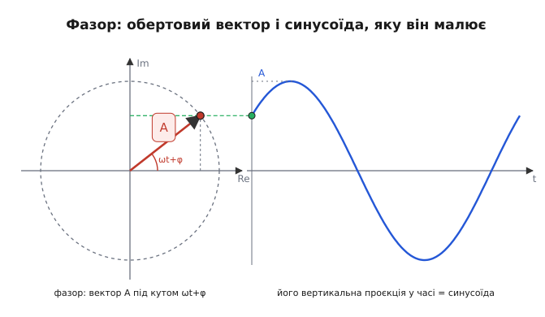
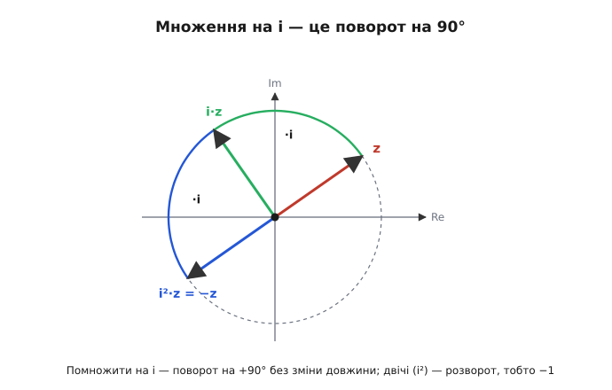
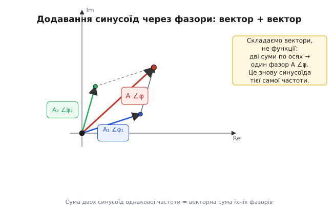

# Фазори

<preknowlist>
- [Комплексні числа](root:math-analysis/complex-numbers) — число a + i·b як точка на площині; його довжина (модуль) і кут (аргумент), а множення перемножує довжини й додає кути.
- [Формула Ейлера](root:math-analysis/euler-formula) — e^(i·θ) = cos θ + i·sin θ, точка на одиничному колі під кутом θ.
- [Синус і косинус](root:math-geometry/sine-cosine) — синус як вертикальна тінь точки, що рівномірно біжить по колу.
- [Похідна](root:math-analysis/derivative) — миттєва швидкість зміни величини; як функція змінюється з часом.
</preknowlist>

Синусоїда — річ, незручна для арифметики. Спробуйте додати дві: `3·sin(ω·t)` і `4·sin(ω·t + 90°)`. Обидві коливаються, у кожну мить мають різні значення, і там, де одна на вершині, друга проходить нуль. Скласти їх «у лоб» не можна — доводиться розкривати `sin(ω·t + 90°)` через формулу суми кутів, зводити подібні, і навіть для двох доданків це вже сторінка перетворень. А синусоїди ж треба ще й диференціювати, інтегрувати, порівнювати за фазою. Уся ця морока — при тому, що синусоїда несе всього три числа: наскільки високо гойдається, як швидко і з якої точки почала.

Фазор (англ. *phasor*, стягнене з *phase* — фаза, і *vector* — вектор) прибирає мороку одним поворотом думки: він подає синусоїду не функцією часу, а **обертовим комплексним числом**. І тоді додавання хвиль стає додаванням чисел, диференціювання — множенням на число, зсув фази — поворотом стрілки. Ціла алгебра коливань згортається до арифметики на комплексній площині. Ця стаття будує фазор з нуля, показує, чому він працює, де ховається його справжня сила — у тому, що він **лінеаризує** задачі про коливання, — і де він відмовляє.

### Синусоїда — це тінь рівномірного обертання

Звідки синусоїда взагалі береться, підказує саме означення синуса. Візьміть точку, що з однаковою швидкістю біжить по колу радіуса `A`, і посвітіть на неї збоку: тінь точки на стіні гойдається вгору-вниз. Її висота — це `A·sin(кут)`, а кут рівномірно наростає з часом. Якщо точка обходить коло `f` разів за секунду, її кут за секунду більшає на `2π·f` радіан; цю швидкість наростання позначають `ω` (омега, кутова частота), тож `кут = ω·t`. Стартувала точка не з нуля, а вже під кутом `φ` (фі) — і повний опис такий:

```
y(t) = A·sin(ω·t + φ)
```

Три числа задають синусоїду **повністю**: амплітуда `A` (як високо), кутова частота `ω` (як швидко), початкова фаза `φ` (звідки почала). Придивіться, де сидить кожне. `ω` стоїть **усередині**, зрощена з часом `t`: вона керує самим бігом. А `A` і `φ` — **зовні** й від часу не залежать: це «хто саме» ця хвиля, її незмінне обличчя. Оцей поділ — на спільний біг усередині та індивідуальне обличчя зовні — і є щілина, крізь яку пролізе фазор.

Перенесімо картину на комплексну площину — площину, де число `a + i·b` є точкою з горизонтальною координатою `a` (дійсна вісь) і вертикальною `b` (уявна вісь). Замість «точки на колі» візьмемо стрілку сталої довжини `A`, що виходить із початку координат і рівномірно обертається проти годинникової стрілки; у мить `t` вона дивиться під кутом `ω·t + φ`. Її вертикальна проєкція — тінь на уявну вісь — у кожну мить дорівнює `A·sin(ω·t + φ)`, тобто, обертаючись, стрілка **малює тінню саме нашу синусоїду**.


*Стрілка довжини A під кутом ω·t + φ; поки вона обертається, її вертикальна проєкція викреслює синусоїду тієї ж амплітуди. Один повний оберт — один період хвилі.*

Тепер вирішальний крок. Уся інформація про конкретну синусоїду — амплітуда й фаза — сидить у стрілці вже в **початковий момент**: довжина дає `A`, стартовий кут дає `φ`. Обертання ж однакове для всіх синусоїд однієї частоти — усі крутяться з тим самим `ω`. Тож, домовившись про частоту наперед, обертання можна взагалі не малювати: досить «сфотографувати» стрілку в момент `t = 0`. Цей нерухомий знімок обертової стрілки й називають **фазором** — стрілка (комплексне число) довжини `A` під кутом `φ`. Записують його як `A∠φ` («`A` під кутом `φ`») або як комплексне число `a + i·b`; спільний множник-обертання тримають у голові.

Наочний образ — фотографія колеса зі стробоскопом, що блимає в такт оберту: колесо мчить, а на кожному знімку стоїть нерухоме. Уся система стрілок кола крутиться як одне ціле, тож їхнє взаємне розташування застигле — і саме воно, а не щомоментний біг, несе всю потрібну інформацію.

### Фазор — це комплексне число, а не просто стрілка

Стрілку на площині можна було б описати парою координат `(a, b)` — звичайним двовимірним вектором. Для **додавання** цього досить: вектори складають покомпонентно. Але коливання вимагає більше, ніж додавання, і саме тут звичайного вектора не вистачає.

Спитаймо: що робить із синусоїдою будь-яка лінійна ланка — підсилювач, фільтр, реактивний елемент? Дві речі, і тільки дві: **множить амплітуду** на якесь число `M` і **зсуває фазу** на якийсь кут `ψ`. «Підсилити в `M` разів і повернути на `ψ`». І ось диво: рівно це робить **множення комплексних чисел**.

Комплексні числа перемножують так: **довжини перемножуються, а кути додаються** (це властивість самих [комплексних чисел](root:math-analysis/complex-numbers)). Тобто

```
(A ∠ φ) · (M ∠ ψ) = (A·M) ∠ (φ + ψ)
```

Помножити фазор на комплексне число `M∠ψ` — означає розтягнути його в `M` разів і повернути на `ψ`, тобто зробити з сигналом рівно те, що робить ланка кола. У звичайного вектора такого множення немає (скалярний і векторний добутки роблять зовсім інше). У комплексного — є, і воно **точно збігається** з дією «підсилити й зсунути фазу». Ось чому коливання описують комплексними числами, а не голими стрілками: комплексна арифметика вже вшила в себе і підсилення, і поворот фази.

Придивімося до найважливішого множника — самої уявної одиниці `i` (від лат. *imaginarius* — уявний; інженери пишуть `j`, щоб не плутати зі струмом `i`). Як стрілка, `i` має довжину 1 і дивиться точно вгору, тобто під кутом 90°. Помножити будь-яку стрілку на `i` — додати до її кута 90°, не чіпаючи довжини: **чверть оберту**. Помножити двічі — повернути на 90° двічі, разом на 180°: стрілка дивиться точно назад, а це для числа означає зміну знака. Ось звідки славнозвісне `i² = −1` — не аксіома з неба, а геометрія: подвійний поворот на чверть є розворот.


*Множення на i повертає стрілку на 90° проти годинникової, довжина стала. Два повороти поспіль (i²) дають розворот на 180°, тобто −z: ось геометричний зміст i² = −1. Той самий поворот на 90° — це зсув фази на чверть періоду.*

Формула Ейлера дає всьому цьому короткий запис. Вона каже, що `e^(i·θ) = cos θ + i·sin θ` — точка на одиничному колі під кутом `θ` ([про саму формулу — окремо](root:math-analysis/euler-formula)). Тоді обертова стрілка довжини `A`, що стартувала під кутом `φ`, у мить `t` дорівнює

```
A·e^(i·(ω·t + φ)) = A·e^(i·φ) · e^(i·ω·t)
```

Праворуч множник розпався надвоє: `A·e^(i·φ)` — нерухомий знімок (амплітуда `A`, фаза `φ`), тобто **фазор** у комплексному записі, а `e^(i·ω·t)` — спільне для всіх обертання. Сама синусоїда — це уявна частина повного виразу:

```
A·sin(ω·t + φ) = Im( A·e^(i·φ) · e^(i·ω·t) )
```

Узяли б дійсну частину — дістали б косинус; вибір між ними лише каже, від чого відлічувати фазу.

### Додавання: найгірша операція стає найпростішою

Повернімося до мороки з початку — до додавання двох синусоїд — і подивімося, як фазор її розчиняє. Візьмемо дві хвилі однієї частоти:

```
y₁(t) = A₁·sin(ω·t + φ₁)
y₂(t) = A₂·sin(ω·t + φ₂)
```

Чому саме однакова частота все вирішує, варто розкрити повільно, бо тут корінь усього. Кожній хвилі відповідає своя обертова стрілка, і обидві крутяться з тим самим `ω` — **у ногу**. Кут між ними весь час однаковий, `φ₁ − φ₂`, скільки б часу не спливло: вони як дві стрілки, жорстко скріплені під сталим кутом, що разом обходять циферблат. А сума двох стрілок — знову стрілка (додавання поосьове), і якщо доданки обертаються синхронно, їхня сума обертається разом із ними, з тим самим `ω`, зберігаючи сталу довжину. Отже, **сума двох синусоїд однакової частоти — знову синусоїда тієї самої частоти**, лише з іншими амплітудою й фазою. А раз результат — теж обертова стрілка тієї ж частоти, його теж можна сфотографувати в нулі. Додавання хвиль звелося до додавання фазорів.

Формула Ейлера робить це очевидним. Складаємо:

```
A₁·e^(i·φ₁)·e^(i·ω·t) + A₂·e^(i·φ₂)·e^(i·ω·t)
```

Спільний множник `e^(i·ω·t)` виноситься за дужку — лишається `(A₁·e^(i·φ₁) + A₂·e^(i·φ₂))·e^(i·ω·t)`. Час зник із дужки; у ній — проста **сума двох комплексних чисел-фазорів**. Те, що в часовому записі вимагало формул суми кутів, тут — звичайне додавання, де дійсні частини складаються з дійсними, а уявні з уявними.


*Дві синусоїди однакової частоти стають двома стрілками; їхня сума за правилом голова-до-хвоста (або паралелограма) — один фазор A∠φ, тобто знову синусоїда тієї ж частоти.*

Рецепт по кроках. Кожен фазор `A∠φ` розкладаємо на дві осьові складові: дійсну `A·cos φ` і уявну `A·sin φ` (це просто координати стрілки; [складання векторів](root:math-algebra/vector-addition) поосьове, бо рух уздовж однієї осі не дає зсуву вздовж перпендикулярної). Складаємо складові окремо — усі дійсні разом, усі уявні разом. З сумарних складових вертаємося до амплітуди й фази: амплітуду дає теорема Піфагора (стрілка — гіпотенуза своїх катетів), а фазу — функція [`atan2`](root:math-geometry/atan2), що повертає кут у правильній чверті.

**Умова.** До вузла приходять два струми однакової частоти: `i₁ = 3·sin(ω·t)` (амплітуда 3, фаза 0°) і `i₂ = 4·sin(ω·t + 90°)` (амплітуда 4, випереджає перший на чверть періоду). Який сумарний струм — його амплітуда й фаза?

```
Крок 1. Фазори:            I₁ = 3 ∠ 0°        I₂ = 4 ∠ 90°
Крок 2. На складові:       I₁ = 3 + i·0       I₂ = 0 + i·4
Крок 3. Сума складових:    I  = 3 + i·4
Крок 4. Назад:             A  = √(3² + 4²) = √25 = 5
                           φ  = atan2(4, 3)     ≈ 53.13°
Результат:                 i  = 5·sin(ω·t + 53.13°)
```

Амплітуди 3 і 4 дали 5, а не 7. Просте `3 + 4` було б правдою лише за нульового зсуву фаз, коли стрілки дивляться в один бік; тут зсув 90°, стрілки перпендикулярні, і сума — гіпотенуза, рівно як переміщення «на схід» плюс «на північ». Уся тригонометрія суми кутів нікуди не поділася — вона сховалась у геометрію прямокутного трикутника, де її вже не треба виписувати руками.

У коді фазор — це буквально вбудоване комплексне число, тож усі чотири кроки згортаються в кілька рядків:

```python
import cmath
from math import radians

i1 = cmath.rect(3, 0)              # 3 ∠ 0°  = 3 + 0i
i2 = cmath.rect(4, radians(90))    # 4 ∠ 90° = 0 + 4i
total = i1 + i2                    # складові додаються поосьово

amp   = abs(total)                 # = 5.0
phase = cmath.phase(total)         # ≈ 0.927 рад ≈ 53.13°
```

`cmath.rect(A, φ)` будує фазор з амплітуди й фази, `abs` повертає довжину `√(re² + im²)`, `cmath.phase` — кут у правильній чверті. Ніякої тригонометрії суми кутів.

### Похідна стає множенням на iω — ось де фазор лінеаризує

Досі фазор лише спрощував порівняння й додавання — приємно, але не переворот. Переворот ось у чому: у тому, що фазор робить із **похідною**. Через похідну він приборкує цілий клас задач — усі, де крутяться диференціальні рівняння коливань.

Продиференціюймо обертову стрілку в її комплексному вигляді:

```
d/dt [ A·e^(i·(ω·t + φ)) ] = i·ω · A·e^(i·(ω·t + φ))
```

Похідна лишила ту саму експоненту незайманою, тільки домножила її на `i·ω`. Мовою фазорів це означає: **продиференціювати сигнал = помножити його фазор на `i·ω`**. Геометрично `i·ω` — це `ω∠90°`, тож похідна робить дві речі: розтягує стрілку в `ω` разів і повертає на +90°. Це видно й на самих хвилях: похідна синуса — косинус, тобто амплітуда виросла в `ω` разів, а фаза забігла на чверть періоду.

Чому взагалі похідна повелася так лагідно — лишила функцію собою, тільки домноженою на число? Бо `e^(i·ω·t)` — особлива для операції диференціювання: продиференціюй її, і дістанеш ту саму функцію, помножену на сталу `i·ω`. Функцію, яку операція лише масштабує, не спотворюючи форми, називають її **власною функцією** (а множник — власним значенням). Комплексна експонента — власна функція диференціювання; саме тому фазори «діагоналізують» усе, що на диференціюванні побудовано.

Наслідок величезний. Диференціювання — операція, через яку рівняння коливань стають **диференціальними** й марудними, — у світі фазорів обертається на множення на число. Візьмімо будь-яке лінійне рівняння зі сталими коефіцієнтами — таке, де сигнал і його похідні входять лише в перших степенях і лише додаються (а це рівняння кожного лінійного кола, кожного маятника, кожної пружини). Замінімо кожну похідну відповідним множником:

```
d/dt   →  i·ω
d²/dt² →  (i·ω)² = −ω²
d³/dt³ →  (i·ω)³ = −i·ω³
```

Похідні зникли — рівняння з диференціального стало **алгебраїчним**, звичайним рівнянням на комплексні числа. Розв'язати алгебраїчне рівняння вміє школяр; розв'язати диференціальне — то окреме мистецтво. Ось що означає «фазор лінеаризує задачу»: він не спрощує саму фізику, а **перекладає** її з мови диференціальних рівнянь на мову комплексної арифметики, де та сама задача коротшає на порядок.

> 🔧 **Навіщо це.** Струм крізь конденсатор — це похідна напруги (`i = C·dv/dt`), тому будь-яке коло з конденсатором чи котушкою є диференціальним рівнянням. Фазорна заміна `d/dt → i·ω` перетворює похідну на множення, а інтеграл — на ділення на `i·ω`; розрахунок фільтра, резонансу чи фазового зсуву стає ланцюжком дій над комплексними числами, які лягають у калькулятор або мікроконтролер. Те саме зведення живить теорію керування, механіку коливань і оптику — усюди, де фізику описують лінійні рівняння з часовими похідними.

### Застосування: змінний струм, імпеданс, коливання

Найбагатший урожай фазор дає в техніці змінного струму — там він, власне, і ввійшов у щоденний ужиток, коли німецько-американський інженер Чарльз Штайнмец у 1890-х звів розрахунки змінного струму до комплексної алгебри. У лінійному колі, живленому синусоїдою, усі струми й напруги коливаються з однією частотою, тож кожен — це фазор, а кожен елемент діє на нього множенням.

Візьмімо конденсатор: `i = C·dv/dt`. Замінивши `d/dt` на `i·ω`, дістаємо `I = i·ω·C·V` — між фазором струму й фазором напруги проста пропорція. Відношення `V/I` для кожного елемента стає одним комплексним числом; його звуть **імпедансом**: модуль каже, «скільки» опору, а аргумент — «який зсув фази» вносить елемент. На резисторі імпеданс дійсний (`R`, фази не крутить), на котушці `i·ω·L` (напруга випереджає струм на 90°), на конденсаторі `1/(i·ω·C)` (відстає на 90°). Той сталий зсув на 90° між струмом і напругою на реактивному елементі — це просто множник `i`, той самий поворот на чверть кола, що дав вище `i² = −1`. [Про сам імпеданс — окремо](root:ph-electromagnetism/impedance).

Тоді закон Ома оживає на змінному струмі без жодної зміни, лише з комплексними числами замість дійсних: послідовні імпеданси додаються, паралельні складаються через обернені. Звідси майже задарма падають результати, що інакше вимагали б диференціальних рівнянь. З'єднавши котушку й конденсатор послідовно, дістаємо

```
Z = i·ω·L + 1/(i·ω·C) = i·(ω·L − 1/(ω·C))
```

На особливій частоті, де `ω·L = 1/(ω·C)`, дужка обертається на нуль, опір зникає — це резонанс, здобутий самою алгеброю знаків, без жодного графіка чи диференціального рівняння. Та сама фазорна мова описує й електромагнітні хвилі (поля як обертові комплексні амплітуди), оптику тонких плівок, коливання маятника — будь-який усталений синусоїдний режим лінійної системи.

### Межі: одна частота й лінійність

Уся будова стоїть на двох підпорах, і чесно назвати їх — значить знати, коли фазор мовчить.

**Перша підпора — одна спільна частота.** Весь фокус був у тому, що `ω` в усіх сигналів однакова, тож її винесли за дужку й заморозили. Якщо в системі змішано сигнали **різних** частот, їхні стрілки крутяться з різною швидкістю, кут між ними весь час повзе, і єдиний знімок нічого не скаже про їхню майбутню взаємну гру — сума таких стрілок то видовжується, то коротшає, це вже не синусоїда сталої амплітуди. Тоді кожну частоту розбирають **окремим** фазором, а відгуки складають уже в часі. Саме так працює [розклад на гармоніки](root:math-analysis/fourier-idea): складний сигнал ріжуть на синусоїди різних частот, кожну проганяють своїм фазором, і результати підсумовують.

**Друга підпора — лінійність.** Множення на число й векторне додавання описують лише ланки, що сигнал масштабують і складають. Нелінійний елемент — той, що підносить сигнал до квадрата, обрізає чи випрямляє, — **народжує нові частоти**, яких на вході не було (з чистого синуса виходить, скажімо, подвоєна частота). Жоден фазор однієї частоти цього не вловить. Тому фазор — інструмент **лінійних систем у сталому синусоїдному режимі**; де частот кілька або де система нелінійна, він відступає перед іншими методами.

### Що лишається в руках

Фазор бере синусоїду — річ, незручну через її поточкову, розмазану в часі природу — і заморожує в нерухоме комплексне число, бо для однієї частоти все обертання спільне й рахувати його щомиті зайве. Амплітуда стає довжиною, фаза — кутом. Далі працює арифметика самих комплексних чисел, і кожна її дія має точний зміст: додавання чисел — це додавання хвиль; множення — це підсилення з поворотом фази; множення на `i` — чистий зсув на 90°; множення на `i·ω` — диференціювання. Останнє й головне: замінивши похідну множником, фазор перекладає диференціальні рівняння коливань на алгебраїчні — і в цьому, а не в самій економії тригонометрії, його справжня сила. Синусоїда лишилася тією самою; змінилась мова, якою про неї говорять, — з незручної мови функцій часу на зручну мову обертових чисел.
