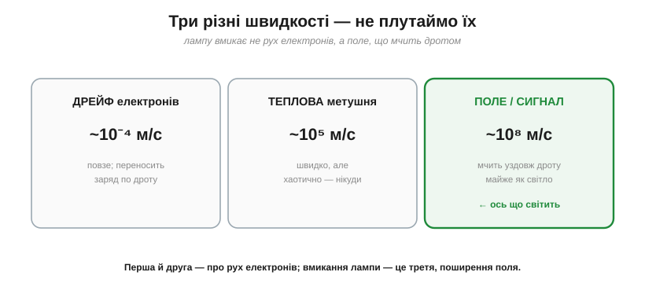
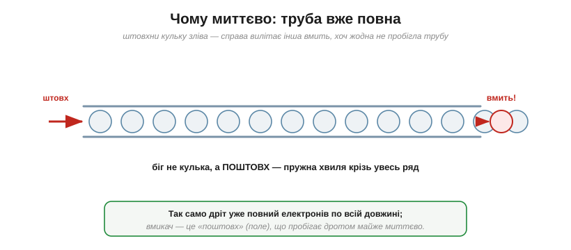
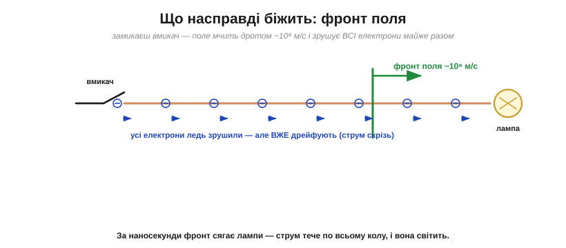
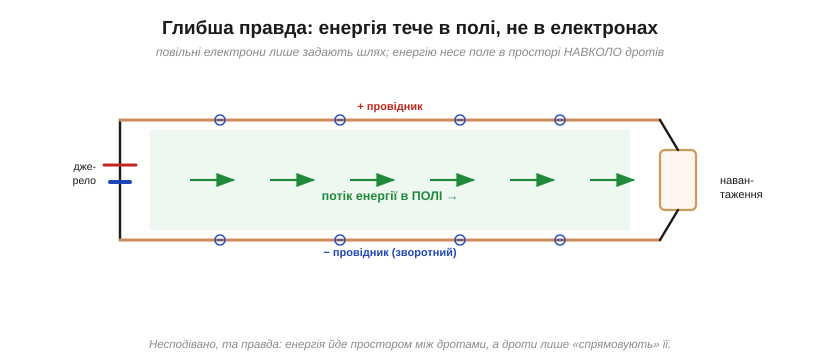

# Парадокс: чому лампа спалахує миттєво, хоч електрони повзуть

Є приголомшливе число: електрони [дрейфують](root:ph-condensed/electron-drift) повільніше за равлика — сім сотих міліметра за секунду. І відразу постає питання, що бентежить кожного, хто вперше це усвідомлює: **як же лампа спалахує тієї ж миті**, щойно ти клацнеш вмикачем за кілька метрів від неї? Якби сигнал чекав, доки електрон добіжить від вмикача до лампи, світла довелося б чекати **годинами**. А його нема — лампа загоряється практично миттєво. Розгадка цього парадоксу — одна з найкрасивіших у всій електриці, і вона остаточно прояснює, що ж таке струм. Заразом вона показує дещо більше: що «струм» і «рух електронів» — не зовсім те саме, і що головний герой тут — **поле**.

### Корінь плутанини: три різні швидкості

Уся загадка народжується з того, що **сплутують три зовсім різні швидкості**. Розкладімо їх по поличках.


***Дрейф** електронів (~10⁻⁴ м/с) — повільний; **теплова** метушня (~10⁵ м/с) — швидка, та хаотична й нікуди не веде; а **поле/сигнал** (~10⁸ м/с) — мчить уздовж дроту майже як світло. Лампу вмикає саме **третя** швидкість, а не рух електронів.*

Помилка інтуїції в тому, що ми уявляємо, ніби світло лампи має «принести» якийсь конкретний електрон, що добіг від вмикача. Але струм запускає не подорож окремого електрона, а **поширення поля**. Щойно розрізнити ці три швидкості — парадокс зникає.

### Чому миттєво: дріт уже повний

Ключ ось у чому: **дріт не порожній — він по всій довжині вже повний [вільних електронів](root:ph-condensed/electron-drift)**. Тож не треба, щоб електрон від вмикача доплив до лампи. Біля лампи свої електрони стоять напоготові — і їх лише треба **підштовхнути**.


*Уявіть трубу, вщерть набиту кульками. Штовхніть кульку зліва — і справа майже **миттєво** вилітає інша, хоч жодна кулька не пробігла всю трубу. Бігла не кулька, а **поштовх** — пружна хвиля крізь увесь ряд. Дріт працює так само: вмикач посилає «поштовх», що пробігає рядом електронів майже без затримки.*

Це чудова й точна аналогія. У трубі, повній води чи кульок, тиск на одному кінці передається на інший зі швидкістю **звуку в середовищі**, а не зі швидкістю окремої кульки. Так і в дроті: «поштовх» — це електричне поле, і воно пробігає від вмикача до лампи зовсім не з дрейфовою швидкістю.

Те саме пояснює, чому **будь-яке** коло реагує практично відразу: натиснув кнопку — спрацювало реле, перемкнувся логічний вентиль, озвався давач. Ніде ми не чекаємо, доки електрони кудись «доїдуть», бо провідники вже ними наповнені, а поле розносить зміну майже миттєво. Уся жвавість електроніки тримається саме на цій різниці між повзучим дрейфом і блискавичним полем.

### Що насправді біжить: фронт поля

Коли ти замикаєш вмикач, на кінцях дроту встановлюється напруга — і вздовж провідника зі швидкістю, близькою до **швидкості світла**, мчить **фронт електричного поля**. Цей фронт, докотившись до кожної ділянки дроту, відразу «вмикає» там дрейф: усі електрони по всій довжині — і ті, що біля лампи теж — починають дрейфувати майже **одночасно**.

А що означає «встановлюється поле»? У перші миті після замикання заряди трохи перерозподіляються по **поверхні** дротів — і саме цей тонесенький шар поверхневого заряду створює всередині провідника поле потрібного напрямку, яке й жене дрейф. Перебудова поверхневих зарядів пробігає вздовж лінії з майже-світловою швидкістю, ведучи за собою фронт. Тобто «команду рушити» розносять не глибинні електрони, а швидка перебудова поля на межах провідника.


*Замикання вмикача посилає вздовж дроту фронт поля (~10⁸ м/с). Позаду фронту електрони **скрізь** одразу починають свій повільний дрейф — тож струм виникає по всьому колу майже миттєво, і лампа світить. Самі електрони при цьому ледь зрушили з місця.*

Тепер прикиньмо час. Якщо сигнал біжить дротом зі швидкістю порядку 2×10⁸ м/с, то на типові 3 метри до лампи:

```
t = відстань / швидкість сигналу
t = 3 м / (2 × 10⁸ м/с) = 1.5 × 10⁻⁸ с = 15 наносекунд
```

П'ятнадцять **наносекунд** — ось чому «миттєво». А той самий шлях [повільним дрейфом](root:ph-condensed/electron-drift) електрон долав би ~14 годин. Різниця — у трильйони разів, бо це **різні фізичні процеси**: дрейф несе заряд, а фронт поля несе **команду рушити**.

Від чого ж залежить ця швидкість сигналу? Несподівано — **не від металу**, а від **середовища навколо** дроту: ізоляції й геометрії, тобто простору, де живе поле. Що більша [діелектрична проникність](root:ph-electromagnetism/coulomb-law) εr ізоляції, то повільніший фронт: приблизно швидкість ≈ c / √εr. Тому в реальних кабелях сигнал біжить не на повній швидкості світла, а на її частці — типово 0.5–0.7 c (для коаксіалу ~0.66 c). Цю частку так і звуть — **коефіцієнт укорочення** (*velocity factor*). І знов підтверджується головна думка: темп задає поле в **діелектрику**, а не дрейф електронів у міді.

> 🔧 **Навіщо це.** Для звичайних кіл «15 наносекунд» — це справді «миттєво», тож про швидкість сигналу не думають. Але в **швидкій цифровій техніці** — тактах на сотні мегагерц, довгих шинах даних — ці наносекунди вже важать: сигнал не встигає скрізь одночасно, доріжки доводиться вирівнювати за довжиною, а довгі лінії рахувати як **[лінії передачі](root:com-medium/transmission-lines)**. Практичний орієнтир: сигнал у доріжці на склотекстоліті (FR4) повзе приблизно 6 наносекунд на метр (≈15 см за наносекунду) — на швидких платах це прямо закладають у розрахунок таймінгу. Тобто скінченна швидкість поля — не абстракція, а цілком земне обмеження високих частот.

> 📜 А коли «дріт» завдовжки 3000 км ліг на дно океану, ця скінченність вилізла назовні драматично: перший трансатлантичний кабель 1858 року ледь не загинув саме тому, що сигнал швидкий, але **не миттєвий** (і над довгою лінією ще й розмазується): [Трансатлантичний кабель 1858 року](root:ph-electromagnetism/signal-speed/hist-atlantic-cable.md).

### Глибша правда: енергію несе поле

І нарешті — найдивовижніше, що варто почути бодай раз. Якщо не електрони «приносять» світло, то **що** доставляє лампі енергію? Відповідь, яка спершу здається неймовірною: енергія тече **не всередині дроту з електронами**, а в **полі** — у просторі **навколо** провідників. Дроти лише **спрямовують** цей потік енергії, як береги спрямовують річку.


*Енергія від джерела до навантаження тече в електромагнітному полі — у просторі **між** провідниками й навколо них (зелене), а не з повільними електронами всередині міді. Провідники задають шлях, але переносить енергію поле. Це строгий результат електродинаміки, хоч і суперечить наївній картинці.*

Повільні електрони — лише «рейки», якими поле веде енергію; самі вони майже не рухаються, а у [змінному струмі](root:ph-electromagnetism/dc-vs-ac) взагалі тільки тремтять на місці. Цей погляд відкриває ще одну роль поля: **поле**, яке посередничає в передачі сили між зарядами, виявляється ще й посередником, що **переносить енергію**. Те, що вмикає лампу, — не марш електронів, а поле, народжене напругою.

Звучить дико — мовляв, енергія йде «повз» дроти, а не крізь них? Та це не лише теорія. Саме тому навколо потужних ліній існує відчутне поле; саме тому форма й взаємне розташування провідників впливають на передачу; і саме тому високочастотну енергію взагалі можна гнати **хвилеводом** — порожньою металевою трубою без жодного дроту всередині. Енергія в полі — не курйоз, а фундамент усієї радіо- й НВЧ-техніки.

> 🔧 **Навіщо це.** Звідси й практичний висновок про **змінний струм**: у розетці електрони лише гойдаються туди-сюди 50 разів на секунду, нікуди сумарно не йдучи, — а енергія (кіловати!) однаково доходить до приладу, бо її несе поле. Тому й працює вся енергетика на змінному струмі: «доставляти» електрони туди-сюди не треба, треба лише гойдати поле.
