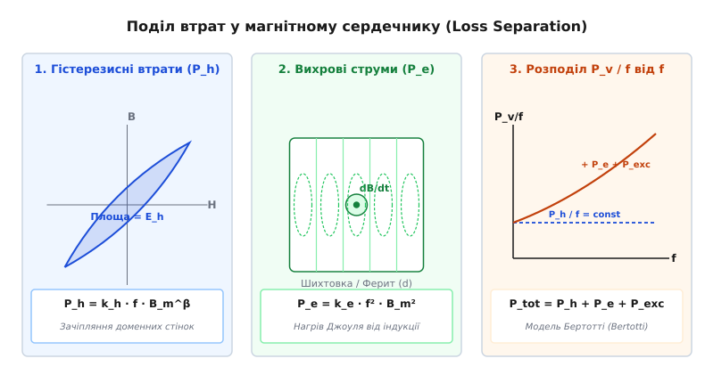
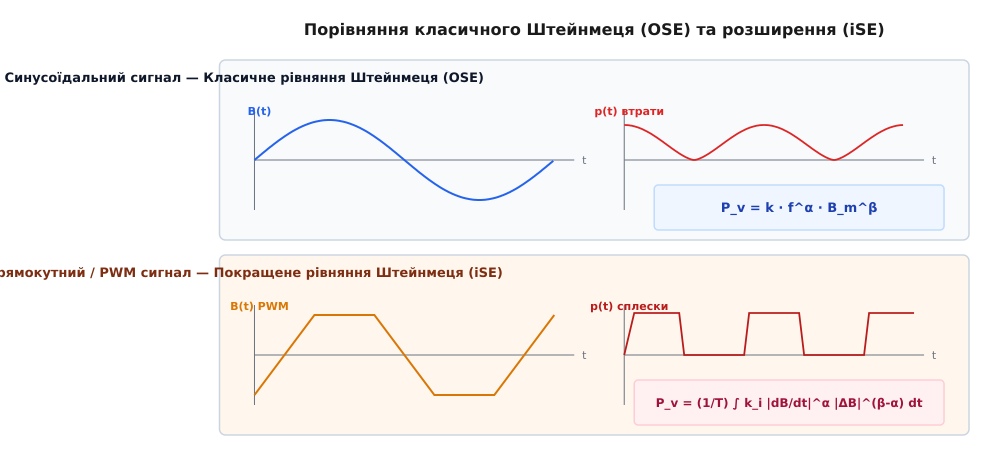

# Рівняння Штейнмеця

<preknowlist>
- [Феромагнетизм](root:ph-condensed/ferromagnetism) — спонтанне паралельне впорядкування магнітних моментів електронів.
- [Магнітний гістерезис](root:ph-condensed/saturation-hysteresis) — петля B-H, залишкова індукція та коерцитивна сила.
- [Закон електромагнітної індукції Фарадея](root:ph-electromagnetism/electromagnetic-induction) — виникнення ЕРС при зміні магнітного потоку.
- [Закон Ленца](root:ph-electromagnetism/lenz-law) — напрямок індукованого струму та протидія зміні магнітного потоку.
</preknowlist>

Під час проєктування силового високочастотного трансформатора для імпульсного джерела живлення потужністю 1 кВт, що працює на частоті 100 кГц, інженер обирає феритовий сердечник типорозміру EFD30 з об'ємом `14.7 см³` та силовим магнітокерамічним матеріалом N87. Якщо розраховувати втрати в сердечнику спрощено — підставивши амплітуду змінної індукції `100 мТл` у паспортну графічну характеристику для ідеальної синусоїди, — інструмент покаже теплову потужність втрат близько `1.8 Вт`. Проте в реальному мостовому або півавтоматичному перетворювачі напруга на первинній обмотці є прямокутною, а струм і магнітна індукція `B(t)` змінюються за трикутним законом із крутими фронтами наростання та паузами (мертвим часом). Неврахування високої швидкості зміни індукції `dB/dt` під час фронтів імпульсу призводить до того, що реальні втрати у фериті зростають до `4.2 Вт`. У закритому корпусі пристрою ці додаткові 2.4 Вт спричиняють розігрів сердечника з розрахункових `70 °C` до критичних `135 °C`, що наближає ферит до точки Кюрі, різко знижує індукцію насичення й викликає тепловий пробій силових транзисторів.

Причиною такої помилки є нехтування внутрішньою фізикою дисипації енергії в магнітом'яких матеріалах. Для точного передбачення втрат у сердечниках електротехнічних пристроїв використовують **рівняння Штейнмеця** (*Steinmetz Equation*) та його сучасні розширення для несплавних (імпульсних) сигналів.

---

## 1. Класична формула Штейнмеця (OSE): від феноменології до стандарту

У 1892 році німецько-американський інженер та математик Чарльз Протеус Штейнмец, провівши тисячі вимірювань втрат на перемагнічування в зразках листового заліза та чавуну, узагальнив експериментальні дані у феноменологічний закон. У сучасному вигляді **класичне рівняння Штейнмеця** (у англомовній літературі — *Original Steinmetz Equation*, **OSE**) визначає середню питому об'ємну потужність втрат у сердечнику `P_v` (у Вт/м³ або мВт/см³) при синусоїдальному зміщенні магнітної індукції:

```
P_v = k · f^α · B_m^β
```

де:
- `P_v` — питома потужність втрат у сердечнику на одиницю об'єму (у Вт/м³);
- `f` — частота синусоїдального магнітного поля (у Гц);
- `B_m` — амплітуда (пікове значення) змінної магнітної індукції (у Теслах, Тл);
- `k` — коефіцієнт пропорційності Штейнмеця, що характеризує базовий рівень втрат конкретного магнітного матеріалу;
- `α` (альфа) — емпірична експонента залежності втрат від частоти;
- `β` (бета) — емпірична експонента залежності втрат від індукції.

Детальний історичний екскурс про те, як Штейнмец відкрив свій закон і чому в його початковій формулі 1892 року ступінь індукції дорівнював строго `1.6`, читайте у вставці [Історія відкриття закону втрат у магнітопроводах](root:ph-electromagnetism/steinmetz-equation/hist-steinmetz-equation.md).

```
+-------------------------------------------------------------------------+
|                  Класичне рівняння Штейнмеця (OSE)                      |
|                                                                         |
|            P_v  =  k   ·   f^α   ·   B_m^β                              |
|            ---    ---     ---       ---                                 |
|             |      |       |         |                                  |
|  Питомі втрати  Матеріал Частота  Амплітуда індукції                    |
|    (Вт/м³)     коефіцієнт (Гц)       (Тесла)                            |
+-------------------------------------------------------------------------+
```

### Фізичний зміст емпіричних показників α та β

Початкова формула Штейнмеця мала вигляд `P_v = η · f · B_m^1.6`, де показник по частоті дорівнював одиниці, а по індукції — 1.6. Проте з розвитком силових феритів, напиленого заліза та аморфних сплавів з'ясувалося, що коефіцієнти `α` та `β` не є універсальними константами природи, а залежать від структури матеріалу та діапазону частот:

1. **Експонента частоти `α` (типово 1.1 ... 2.0):**
   - Якщо втрати зумовлені виключно статичним гістерезисом (незворотним зміщенням доменних стінок за один цикл), енергія, що втрачається за цикл `W_h = ∮ H dB`, не залежить від швидкості перемагнічування. Тоді потужність в секунду `P = W_h · f` пропорційна частоті в першому ступені (`α = 1.0`).
   - При появі вихрових струмів (що за законом Фарадея пропорційні `df/dt`) вихрова компонента втрат зростає квадратично (`∝ f²`).
   - Реальне значення `α` для силових феритів у діапазоні 50–500 кГц становить `α ≈ 1.2 ... 1.6`, що є усередненим результатом накладення гістерезисних та вихрових процесів.

2. **Експонента індукції `β` (типово 1.6 ... 3.0):**
   - У слабких магнітних полях (область Лорда Релея) площа петлі гістерезису пропорційна кубу індукції (`β = 3.0`).
   - У середніх полях (робоча область трансформаторного заліза 0.2–1.2 Тл) площа петлі зростає приблизно як `B_m^1.6`.
   - У сучасних силових феритах (наприклад, N87, N97, 3C90) при індукціях 50–200 мТл експонента індукції становить `β ≈ 2.4 ... 2.8`. При наближенні до магнітного насичення (`B → B_sat`) петля B-H сильно розширюється у бік полів `H`, і ефективне значення `β` стрімко зростає до 3.5–4.0, що робить робочий режим нестабільним.

---

## 2. Фізичні механізми втрат та модель їх поділу (Loss Separation)

Магнітний сердечник гріється під дією змінного магнітного поля через те, що енергія зовнішнього електромагнітного поля не повністю перетворюється на магнітну енергію зв'язку, а частково розсіюється у кристалічній ґратці у вигляді тепла (фононів).

Згідно з фундаментальною моделлю **поділу втрат** (*Loss Separation*), розробленою італійським фізиком Джорджо Бертотті (*Giorgio Bertotti*), загальна питома потужність втрат у магнітопроводі розкладається на три фізично незалежні компоненти:

```
P_v = P_h + P_e + P_exc
```


*Поділ загальних втрат у магнітному сердечнику на гістерезисні (P_h), класичні вихрові (P_e) та надлишкові (P_exc) компоненти*

### 1. Гістерезисні втрати (P_h) та мікроскопічна доменна динаміка

Гістерезисні втрати виникають через незворотний рух доменних стінок (стінок Блоха та Нееля) під час перемагнічування кристала. У відсутність зовнішнього поля кристал розпадається на магнітні домени з протилежними напрямками намагніченості для мінімізації макроскопічної магнітостатичної енергії.

Під дією зовнішнього поля `H` доменні стінки починають зміщуватися. Проте їхній рух не є гладким: стінки постійно наражаються на мікроскопічні дефекти кристалічної ґратки:
- Дислокації та скупчення точкових дефектів;
- Межі зерен у полікристалічних феритах;
- Вкраплення немагнітних фаз та атоми домішок;
- Локальні поля механічних напружень.

Ці дефекти створюють складний потенційний рельєф із потенційними ямами (**pinning sites**). 
- Коли зовнішнє магнітне поле `H` зростає, доменна стінка застрягає на дефекті і починає пружно вигинатися, накопичуючи магнітопружну енергію.
- При досягненні критичного поля стінка різко зривається з дефекту й стрибкоподібно переміщується до наступного стопора. Цей незворотний лавиноподібний стрибок називається **стрибком Баркгаузена**.
- Магнітопружна енергія, накопичена під час вигинання стінки, при її незворотному зриві перетворюється на високочастотні пружні коливання кристалічної ґратки (звукові хвилі та фонони) та локальні мікровихрові струми.

Енергія, що втрачається за один повний цикл перемагнічування в одиниці об'єму, дорівнює площі замкненої петлі гістерезису `B-H`:

```
E_h = ∮ H dB   [Дж/м³]
```

Потужність гістерезисних втрат прямо пропорційна кількості циклів за секунду, тобто частоті `f`:

```
P_h = k_h · f · B_m^β
```

### 2. Класичні вихрові втрати (P_e)

Вихрові втрати зумовлені **законом електромагнітної індукції Фарадея**. Змінний магнітний потік `Φ(t)`, що пронизує провідне тіло сердечника, індукує в його об'ємі замкнені вихрові електричні поля з напруженістю `E`. Згідно із законом Ома в диференціальній формі, ці поля викликають макроскопічні вихрові струми (**струми Фуко**), які нагрівають речовину за законом Джоуля — Ленца:

```
p_e = (E²) / ρ
```

де `ρ` — питомий електричний опір матеріалу.

З аналітичного розв'язку рівнянь Максвелла для тонкого провідного листа товщиною `d` випливає формула класичних вихрових втрат:

```
P_e = (π² · d² / (6 · ρ · γ)) · f² · B_m²
```

де `γ` — густина матеріалу (кг/м³).

Звідси чітко видно два інженерні шляхи пригнічення вихрових втрат:
- **Зменшення геометричного розміру `d`:** У низькочастотних трансформаторах (50 Гц) сталеві сердечники шихтують з окремих тонких пластин товщиною `d = 0.23 ... 0.5 мм`, розмежованих ізоляційним лаком.
- **Збільшення питного опору `ρ`:** Силові ферити (магнітокераміка на основі `MnZn` або `NiZn`) мають кристаллохімічну структуру оксидів, завдяки чому їхній питомий опір становить `ρ = 1 ... 10 Ом·м` (що в `10⁷` разів вище, ніж у електротехнічної сталі `ρ ≈ 10⁻⁷ Ом·м`). Провідність у MnZn феритах зумовлена електронним стрибковим механізмом Вервея (*Verwey electron hopping*) між іонами `Fe²⁺` та `Fe³⁺` у октаедричних вузлах шпінельної ґратки. Високий опір дозволяє використовувати ферити на частотах від 50 кГц до кількох мегагерц без шихтування.

### 3. Надлишкові (аномальні) втрати (P_exc) та кореляція стінок

Якщо додати розраховані класичні вихрові втрати `P_e` до виміряних статичних гістерезисних втрат `P_h`, їхня сума виявляється меншою за реально виміряні сумарні втрати у металевих та аморфних магнітопроводах. Ця різниця називається **надлишковими втратами** (*Excess Losses*).

Бертотті довів, що надлишкові втрати виникають через неоднорідний рух доменних стінок. Класичний розрахунок `P_e` припускає, що магнітна індукція однорідно змінюється по всьому перерізу. Насправді ж індукція змінюється лише у вузькому об'ємі рухомої доменної стінки. При високих швидкостях перемагнічування рух кількох сусідніх стінок корелює між собою, створюючи динамічні локальні мікровихори струму.

Формула надлишкових втрат Бертотті має дробові показники ступеня:

```
P_exc = k_exc · f^1.5 · B_m^1.5
```

Математичні виводи вихрових втрат із рівнянь Максвелла та обґрунтування моделі Бертотті винесено у вставку [Математичний вивід та поділ втрат у магнітному сердечнику](root:ph-electromagnetism/steinmetz-equation/math-steinmetz-loss.md).

---

## 3. Межі застосовності класичного рівняння Штейнмеця (OSE)

Попри простоту та зручність, класичне рівняння Штейнмеця `P_v = k · f^α · B_m^β` має три фундаментальні обмеження, які роблять його непридатним для безпосереднього використання у сучасній імпульсній силовій електроніці:

### Обмеження 1: Тільки синусоїдальний сигнал B(t)

Формула OSE виведена і калібрована виключно для **ідеальної синусоїди** `B(t) = B_m · sin(2π f t)`. Проте в сучасних Switched-Mode Power Supplies (SMPS):
- Напруга на обмотках трансформаторів є прямокутною (імпульси з крутими фронтами);
- Магнітна індукція `B(t)` змінюється за **пилоподібним або трикутним законом**;
- Швидкість зміни індукції `dB/dt` на робочому ходу значно перевищує амплітудну швидкість синусоїди тієї ж фундаментальної частоти.

Оскільки вихрові струми та динамічне зачіпляння стінок реагують саме на **похідну `dB/dt`**, а не на середню частоту повторення імпульсів, підстановка трикутного сигнала в класичне OSE дає заниження втрат на 30–150%.

```
Синусоїда B(t):   dB/dt змінюється плавно ---> OSE дає точний результат
Трикутник B(t):   dB/dt постійна і висока ---> OSE занижує втрати!
```

### Обмеження 2: Ігнорування пауз ("мертвого часу") та робочого циклу (Duty Cycle)

У двотактних та однотактних PWM перетворювачах між імпульсами напруги часто виникає пауза zero-voltage interval (наприклад, при коефіцієнті заповнення `D = 0.2`).
- Упродовж паузи напруга на обмотці дорівнює нулю, індукція `B(t)` залишається незмінною (`dB/dt = 0`), і вихрові втрати припиняються.
- Проте під час короткого імпульсу `t_on = D · T` індукція наростає дуже швидко.
- Класичне OSE розглядає лише повний період `T = 1/f` і не бачить різниці між `D = 0.5` та `D = 0.1`, видаючи однакові втрати, що є грубою інженерною помилкою.

### Обмеження 3: Постійне підмагнічування (DC Bias Field)

У багатьох топологіях (Flyback, Forward, Buck chokes) через обмотку протікає постійна складова струму `I_dc`. Вона створює постійне магнітне поле `H_dc` та зміщує робочу точу в область часткової петлі гістерезису (*minor hysteresis loop*).
- Постійне поле `H_dc` наближає сердечник до насичення, зменшує диференціальну магнітну проникність та змінює конфігурацію доменних стінок.
- В результаті матеріальні параметри `k` та `β` змінюються, а реальні втрати зростають у 1.5–3 рази порівняно з симетричним перемагнічуванням без DC-зміщення.

---

## 4. Покращене рівняння Штейнмеця (iSE, MSE, i2SE) для несплавних сигналів

Щоб подолати обмеження класичного OSE для прямокутних та PWM сигналів, науковці протягом останні 25 років розробили серію модифікованих математичних моделей.


*Порівняння розрахунку втрат для синусоїдального сигналу в OSE та прямокутного PWM сигналу в покращеному рівнянні iSE*

### 1. Модифіковане рівняння Штейнмеця (MSE — Modified Steinmetz Equation)

Запропоноване у 2001 році Райнертом (*J. Reinert*), рівняння MSE вводить поняття **еквівалентної синусоїдальної частоти** `f_eq`. Замість фундаментальної частоти повторення імпульсів `f` у формулу OSE підставляють `f_eq`, обчислену через середнє значення квадрата похідної `(dB/dt)²`:

```
f_eq = (2 / (π² · ΔB²)) · ∫₀ᵀ (dB / dt)² dt
```

Тоді питомі втрати дорівнюють:

```
P_v = (k · f_eq^(α - 1) · f) · (ΔB / 2)^β
```

MSE значно покращило точність для трикутних сигналів, але виявилося недостатньо точним для сигналів із великими паузами (`D « 0.5`).

### 2. Покращене рівняння Штейнмеця (iSE — Improved Steinmetz Equation)

У 2001–2002 роках Лі та Венкатачаламан (*J. Li, J. Venkatachalam, Sullivan*) розробили **Improved Steinmetz Equation (iSE)**. Головна ідея iSE полягає у тому, що миттєва інтенсивність втрат `p(t)` у будь-який момент часу пропорційна модулю похідної `|dB/dt|^α`:

```
P_v = (1 / T) · ∫₀ᵀ k_i · |dB(t) / dt|^α · |ΔB|^(β - α) dt
```

де:
- `ΔB = B_max - B_min = 2 B_m` — розмах індукції від піку до піку за цикл;
- `k_i` — модифікований коефіцієнт матеріалу, який строго аналітично виражається через класичні параметри Штейнмеця `k, α, β`:

```
k_i = k / [ (2π)^(α - 1) · 2^(β - α + 1) · B( (α + 1) / 2,  1 / 2 ) ]
```

де `B(x, y)` — математична Бета-функція Ейлера.

#### Аналітична формула iSE для симетричного трикутного сигналу B(t)
Для трикутного сигналу без пауз з однаковою швидкістю наростання та спаду індукції iSE зводиться до простої алгебраїчної формули:

```
P_v_tri = k_i · (2 · f)^α · B_m^β · 2^(β - α)
```

Порівняння показує, що для реальних феритів (`α ≈ 1.3`) втрати на симетричному трикутнику складають близько **88–92%** від втрат на синусоїді тієї ж амплітуди та частоти. Проте при асиметричних фронтах або наявності пауз втрати за iSE стрімко зростають.

### 3. Рівняння i2SE (Improved-Improved Steinmetz Equation)

Для сигналів із довгими паузами (`dB/dt = 0`) iSE іноді занижує втрати, оскільки після різкого припинення зміни поля доменні стінки не зупиняються миттєво, а зазнають релаксаційного згасання. Рівняння **i2SE** (Му та Салліван, 2014) додає член релаксації, який враховує виділення тепла під час повернення доменної структури до стану рівноваги впродовж паузи.

Паспортні матеріальні параметри Штейнмеця `(k, α, β)`, коефіцієнти перерахунку `k_i`, а також поліноми температурної корекції для популярних силових феритів (N87, N97, 3C90) наведено у вставці [Довідник коефіцієнтів Штейнмеця та параметрів матеріалів](root:ph-electromagnetism/steinmetz-equation/api-steinmetz-coefficients.md).

---

## 5. Числовий приклад розрахунку та інженерний вибір топології

Щоб продемонструвати різницю між методами OSE та iSE на конкретних числах, розглянемо розрахунок силового трансформатора.

### Вхідні дані розрахунку:
- **Типорозмір сердечника:** E42/21/15 з ефективним об'ємом `V_e = 17.3 см³ = 1.73 · 10⁻⁵ м³`.
- **Матеріал:** Ферит N87 (`k = 16.9`, `α = 1.25`, `β = 2.55`).
- **Частота перемагнічування:** `f = 100 кГц = 10⁵ Гц`.
- **Розмах індукції:** `ΔB = 0.2 Тл` (`B_m = 0.1 Тл = 100 мТл`).

#### Крок 1. Розрахунок за класичним OSE (синусоїдальний режим):
```
P_v
= 16.9 · (100000)^1.25 · (0.1)^2.55     [формула OSE: k · f^α · B_m^β]
= 16.9 · 1778279.4 · 0.002818           [обчислення степенів: f^1.25 та B_m^2.55]
= 84687.5                               [множення коефіцієнтів (Вт/м³)]
```
Загальні втрати в об'ємі сердечника:
```
P_core_OSE
= P_v · V_e                             [добуток питомих втрат і об'єму V_e]
= 84687.5 · 1.73 · 10⁻⁵                 [підстановка V_e = 17.3 см³]
= 1.465                                 [підсумкові втрати в сердечнику (Вт)]
```

#### Крок 2. Розрахунок за iSE для прямокутної напруги (PWM, D = 0.5, трикутний B):
Коефіцієнт перерахунку для матеріалу N87 дорівнює `k_i = 0.392`.
Аналітична формула iSE для симетричного трикутника з `D = 0.5` дає:
```
P_v_iSE
= 0.392 · (200000)^1.25 · (0.2)^2.55 · 2^(2.55 - 1.25)   [формула iSE для трикутника]
= 0.392 · 3892700.0 · 0.001655 · 2.462                   [обчислення степенів]
= 76210.0                                                [підсумкова питома потужність (Вт/м³)]
```

#### Крок 3. Розрахунок за iSE для асиметричного PWM (D = 0.1):
Якщо той самий розмах індукції `ΔB = 0.2 Тл` створюється вузьким імпульсом з `D = 0.1` (прямокутний перетворювач з малим коефіцієнтом заповнення):
```
Factor_D
= (1 / 0.1^0.25) + (1 / 0.9^0.25)       [поправковий фактор робочого циклу D]
= 1.778 + 1.026                         [обчислення коренів 4-го ступеня]
= 2.804                                 [сумарний фактор асиметрії]

P_v_iSE_10
= 76210.0 · 2.804 / 1.098               [масштабування фактором асиметрії D=0.1]
= 194500.0                              [підсумкові втрати у Вт/м³ (194.5 мВт/см³)]
```

Цей числовий розрахунок наочно демонструє, що при зменшенні коефіцієнта заповнення `D` з 0.5 до 0.1 втрати в сердечнику зростають від `1.32 Вт` до `3.37 Вт` (більше ніж у **2.5 рази**) при незмінній частоті та амплітуді індукції `ΔB`!

---

## 6. Тепловий розрахунок та оптимізація силових магнітних компонентів

При проєктуванні будь-якого високочастотного магнітного компонента розрахунок втрат за рівнянням Штейнмеця є першим кроком термодинамічного оптимізаційного аналізу.

### Компроміс між втратами в сердечнику та втратами в міді (Core vs Copper Loss Trade-off)

Загальні втрати силового трансформатора складаються з втрат у сердечнику `P_core` та втрат у міді обмоток `P_cu`:

```
P_total = P_core + P_cu
```

- **Втрати в сердечнику `P_core`:** Зростають зі збільшенням амплітуди індукції `B_m` за степеневим законом `P_core ∝ B_m^β` (де `β ≈ 2.5`).
- **Втрати в міді `P_cu`:** Обчислюються за законом Джоуля-Ленца `P_cu = I_rms² · R_ac`. Згідно із законом індукції Фарадея, кількість витків обмотки `N` обернено пропорційна індукції: `N ∝ 1 / B_m`. При зменшенні `B_m` доводиться мотати більше витків `N`, що збільшує довжину дроту, його опір `R` та втрати в міді: `P_cu ∝ 1 / B_m²`.

```
Втрати P
  ^
  |  \                                     / P_total
  |   \   P_cu (Мідь ∝ 1/B²)              /
  |    \                                 /  P_core (Сердечник ∝ B^β)
  |     \       Оптимум                 /
  |      \      |                      /
  |       \____/ \____________________/
  |            B_opt
  +---------------------------------------------> Амплітуда індукції B_m
```

Точка оптимуму відповідає мінімуму сумарних втрат `P_total`. Знайшовши похідну `dP_total / dB_m = 0`, отримують відоме інженерне правило: **найвищий ККД трансформатора досягається тоді, коли втрати в сердечнику приблизно дорівнюють втратам в обмоткам (`P_core ≈ P_cu`)**.

### Запобігання тепловому розгону (Thermal Runaway)
Особливістю силових феритів є U-подібна залежність втрат від температури. При температурах понад `100 °C` втрати `P_v` починають зростати. Якщо температура сердечника через недостатнє охолодження перевищує `120 °C`, зростання втрат викликає додатковий самонагрів, що ще більше збільшує втрати. Цей позитивний зворотний зв'язок призводить до **теплового розгону** та розплавлення магнітопроводу. Точний розрахунок за рівнянням Штейнмеця дозволяє встановити робочу точку `T_work` у районі температурного мінімуму `80...95 °C`, гарантуючи стійку роботу пристрою.

> 🔧 **Навіщо це.**
> У сучасних високочастотних перетворювачах на GaN або SiC транзисторах (частоти 500 кГц — 2 МГц) об'ємний розрахунок втрат за рівнянням Штейнмеця дозволяє відмовлятися від масивних алюмінієвих радіаторів. Точний розрахунок втрат за iSE показує, що зменшення робочої індукції з `100 мТл` до `40 мТл` знижує втрати у фериті N97 у `(100/40)^2.6 ≈ 10.8 разів`. Це дозволяє зменшити температуру сердечника зі `110 °C` до `45 °C` та реалізувати повністю пасивне охолодження джерела живлення.

Практичний алгоритм та готові програми на C, C++ та Python для розрахунку втрат методом iSE для довільних форм сигналів розміщено у вставці [Алгоритм розрахунку втрат у сердечнику для синусоїдального та PWM сигналів](root:ph-electromagnetism/steinmetz-equation/proj-steinmetz-calculator.md).
