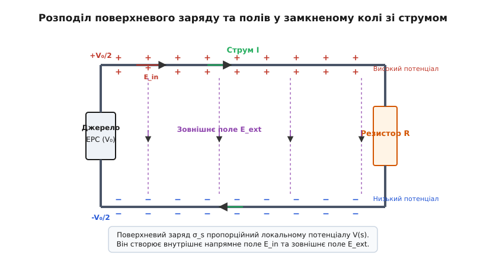
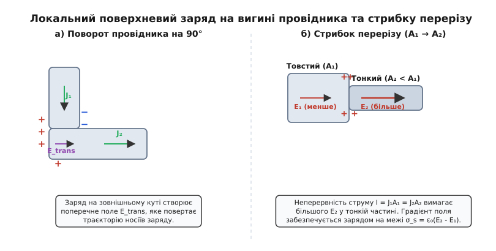
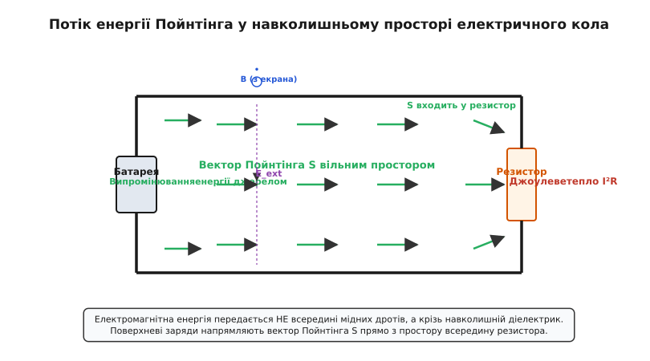

# Поверхневі заряди в колі зі струмом

<preknowlist>
- [Електричний струм](root:ph-electromagnetism/electric-current) — напрямлений рух носіїв заряду у провідниках та густина струму.
- [Поверхневий заряд у провіднику](root:ph-electromagnetism/surface-charge-guiding-field) — доведення відсутності об'ємного заряду та виштовхування надлишку на межу.
- [Потенціал](root:ph-electromagnetism/electric-potential) — скалярна характеристика електричного поля та потенціал у колі.
- [Вектор Пойнтінга](root:ph-electromagnetism/poynting-vector) — вектор густини потоку електромагнітної енергії.
</preknowlist>

Коли п'ятиметровий мідний дріт складної конфігурації підключають до дванадцятивольтового автомобільного акумулятора й замикають коло через автомобільну лампу розжарювання, постійний струм силою у два ампери встановлюється по всій довжині провідного контуру за лічені наносекунди. За диференціальним законом Ома `J = σ · E` для забезпечення цього струму у кожному кубічному міліметрі мідної жили та тунгстенової спіралі має існувати поздовжнє електричне поле `E`. Це поле точно орієнтоване уздовж центральної осі вигнутого каналу, повертає разом із геометричними вигинами кабелю під прямокутними кутами й зростає у сотні разів на вузькій ділянці спіралі з низькою провідністю.

Проте гальванічний елемент знаходиться на відстані кількох метрів від лампи, а його клеми є локалізованими джерелами заряду. Згідно з законами електростатики, електричне поле від двох ізольованих точкових клем батареї є кулонівським радіальним дипольним полем. Його силові лінії спадають із квадратом відстані й поширюються прямолінійними променями в усі боки простору. Поле батареї не має жодної інформації про те, де саме інженер проклав кабель, де розташовані роз'єми або де мідний дріт припаяний до вимикача. Якби внутрішнє поле провідника формувалося лише безпосередньо клемами батареї, на першому ж повороті кабелю силові лінії вийшли б крізь бічну стінку мідної жили назовні у повітря. Вільні електрони врізалися б у бічну межу кристалічної ґратки, зупинилися б, і струм у колі негайно припинився б.

Розгадка цієї фундаментальної проблеми полягає у тому, що замкнене електричне коло зі струмом є самоорганізовною динамічною системою. Електричне поле у кожній точці провідного каналу створюється не лише далеким джерелом живлення, а **розподіленим поверхневим зарядом** `σ_s`, який самостійно осідає на зовнішній бічній межі провідників та на поверхнях поділу матеріалів під час надшвидкого перехідного процесу.

### Відсутність об'ємного заряду у товщі металлевого провідника

Спершу з'ясуємо, чому надлишковий заряд у провіднику зі струмом зосереджений виключно на його поверхні й не може існувати всередині об'єму матеріалу.

Розглянемо суцільний однорідний металевий провідник із постійною питомою електропровідністю `σ > 0`. У стаціонарному режимі за відсутності накопичення заряду у часі (`∂ρ / ∂t = 0`) рівняння неперервності струму має вигляд:

```
div(J) = 0                                     [рівняння неперервності стаціонарного струму]
```

Підставимо у це рівняння диференціальний закон Ома `J = σ · E`:

```
div(σ · E) = 0                                 [заміна густини струму J на σ · E]
σ · div(E) = 0                                 [винесення сталої провідності σ за знак дивергенції]
```

Оскільки для металевого провідника електропровідність є ненульовою позитивною величиною (`σ > 0`), розділимо обидві частини на `σ`:

```
div(E) = 0                                     [дивергенція поля всередині провідника дорівнює нулю]
```

За теоремою Гаусса у диференціальній формі, дивергенція електричного поля пропорційна об'ємній густині заряду `ρ`:

```
div(E) = ρ / ε₀ = 0                             [прирівнювання дивергенції поля до об'ємного заряду]
ρ = 0                                          [об'ємна густина заряду всередині провідника дорівнює нулю]
```

З цього математичного доведення випливає фундаментальний фізичний висновок: у товщі однорідного провідника зі струмом немає жодного макроскопічного згустку або розрідження електронного газу. Увесь внутрішній об'єм металу залишається строго електронейтральним.

З точки зору фізики твердого тіла це пояснюється колосальною концентрацією вільних електронів у металах (`n ≈ 10²⁸` м⁻³) та надзвичайно коротким радіусом дебаївського екранування (`λ_D ≈ 0.1` нм). Будь-яка флуктуаційна нерівноважність заряду всередині об'єму екранується позитивними іонами кристалічної ґратки на атомних масштабах. 

Часова шкала розсмоктування локального об'ємного заряду визначається максвеллівським часом релаксації `τ_rel = ε₀ / σ`. Для міді (`σ ≈ 5.8 · 10⁷` См/м) цей час становить:

```
τ_rel = (8.85 · 10⁻¹²) / (5.8 · 10⁷) ≈ 1.5 · 10⁻¹⁹ секунд
```

Це означає, що будь-який надлишковий заряд, який опинився всередині металевого провідника, виштовхується електростатичним відштовхуванням на зовнішню бічну поверхню за час, менший за один період світлової хвилі. Отже, єдиним фізичним місцем, де можуть локалізуватися макроскопічні заряди у колі зі струмом, є **зовнішня бічна поверхня провідного каналу** та межі поділу різних матеріалів.

### Формування та розподіл поверхневого заряду в замкненому колі

Величина та знак поверхневої густини заряду `σ_s(s)` у кожній точці вздовж координати контуру `s` прямо пропорційні місцевому скалярному електричному потенціалу `V(s)` відносно віддаленої точки простору:

```
σ_s(s) = [ ε₀ / (r · ln(L / r)) ] · V(s)
```

де `r` — радіус провідника, `L` — характерний розмір контуру, а `ε₀` — електрична стала.

Провідник, підключений до позитивної клеми джерела (`V > 0`), набуває позитивного поверхневого заряду (`σ_s > 0`). Провідник, підключений до негативної клеми (`V < 0`), вкривається шаром надлишкових електронів (`σ_s < 0`). Вздовж усієї довжини однорідного дроту потенціал `V(s)` спадає лінійно, що відповідає постійному поздовжньому градієнту електричного поля `E = - dV / ds`. Відповідно, густина позитивного поверхневого заряду плавно зменшується у напрямку руху струму.


*Розподіл поверхневого заряду вздовж електричного кола: позитивний заряд на провіднику високого потенціалу, скачок на межі резистора та негативний заряд на зворотному провіднику створюють як внутрішнє напрямне поле, так і зовнішнє консервативне поле.*

На ділянці навантажувального резистора із великим опором `R` відбувається основний спад потенціалу. Це викликає крутий градієнт поверхневого заряду: від високої позитивної густини на вхідному полюсі резистора до негативної густини на вихідному полюсі.

Історичний шлях відкриття цих феноменів від перших праць Вебера та Кірхгофа до візуалізаційних експериментів Єфіменка детально розкрито у вставці [📜 Історія теорії поверхневих зарядів у колах](root:ph-electromagnetism/surface-charge-distribution-in-loop/hist-circuit-charges.md).

### Механізми повороту поля та неперервності струму

Розглянемо детально фізику процесів у двох критичних вузлах електричного кола: на вигині дроту та на межі двох матеріалів із різними провідностями чи перерізами.

#### 1. Механізм повороту електричного поля на вигині провідника
Розглянемо провідний канал, який повертає під кутом 90°. У класичній моделі Друде вільні електрони рухаються у бік, протилежний до напрямку поздовжнього поля `E`, із середньою дрейфовою швидкістю `v_d ≈ 0.1` мм/с, постійно зіштовхуючись із іонами кристалічної ґратки.

Коли дрейфуючий потік електронів наближається до повороту каналу, первинне поздовжнє поле продовжує штовхати електрони прямолінійно — у бік зовнішньої бічної стінки вигину. Оскільки електрони не можуть покинути метал через високий потенціальний бар'єр виходу з провідника у повітря (робота виходу `W_out ≈ 4.5` еВ), вони накопичуються на зовнішньому куті повороту.

Це накопичення викликає локальний надлишок негативного заряду (або позитивного, залежно від загального потенціалу гілки) на зовнішньому радіусі повороту. Одночасно на внутрішньому радіусі повороту утворюється недостача електронів (позитивний заряд).

Цей розподлілений подвійний шар поверхневого заряду створює у зоні вигину **поперечне електричне поле** `E_transverse`, спрямоване від зовнішнього кута до внутрішнього. Це поперечне поле діє на дрейфуючі електрони як доцентрова сила, повертаючи вектор їх середньої швидкості `v_d` строго уздовж нового напрямку каналу.

```
       Перед поворотом:                        На повороті:
       ──────────────┐                         ──────────────┐  + + + (позитивний заряд)
          v_d →      │                            v_d ↴      │  E_trans 
       ──────────────┘                         ──────────────┘  − − − (надлишок електронів)
```

Величина локального поверхневого заряду на вигині автоматично підлаштовується так, щоб сумарне поле `E_tot = E_longitudinal + E_transverse` у кожній точці повороту було строго дотичним до бічних стінок провідного каналу.

#### 2. Межа з'єднання провідників із різним перерізом або провідністю
Нехай струм `I` переходить із товстого мідного дроту перерізом `A₁` та провідністю `σ₁` у тонкий ніхромовий дріт перерізом `A₂ < A₁` та провідністю `σ₂ < σ₁`.

За умовою неперервності стаціонарного струму, повний струм у кожному перерізі має бути однаковим:

```
I = J₁ · A₁ = J₂ · A₂                          [рівняння неперервності струму]
```

За диференціальним законом Ома виразимо напруженість поздовжнього поля у кожній ділянці:

```
E₁ = I / (σ₁ · A₁)                             [поздовжнє поле у першому провіднику]
E₂ = I / (σ₂ · A₂)                             [поздовжнє поле у другому провіднику]
```

Оскільки `σ₂ · A₂ << σ₁ · A₁`, поле у тонкому низькопровідному дроті має бути значно більшим: `E₂ >> E₁`. Отже, на самій площині межі двох провідників поздовжнє електричне поле зазнає дискретного стрибка `ΔE = E₂ - E₁`.

За теоремою Гаусса для граничної поверхні, такий стрибок нормальної компоненти поля вимагає наявності поверхневої густини заряду `σ_s_interface`:

```
σ_s_interface = ε₀ · (E₂ - E₁) = ε₀ · I · [ (1 / (σ₂ · A₂)) - (1 / (σ₁ · A₁)) ]
```

Саме цей шар поверхневого заряду, що осідає на площині стику під час вмикання струму, створює додаткове електричне поле `E₂`, яке прискорює носії заряду при переході у вузьку ділянку й забезпечує стабільне проходження струму без утворення заторів.


*Локальне накопичення поверхневого заряду на вигинах провідника (а) та на межі двох ділянок із різною провідністю (б), що забезпечує стаціонарність та неперервність струму.*

Строгі математичні виводи рівнянь потенціалу, граничних умов та систем поверхневих зарядів наведено у вставці [🧮 Математичний розрахунок поверхневих зарядів і полів](root:ph-electromagnetism/surface-charge-distribution-in-loop/math-surface-charge-field.md).

### Динаміка замикання кола: надшвидка самоорганізація

Процес формування поверхневого заряду є самокоригувальним і триває лічені пікосекунди. 

Під час замикання ключа у колі виникає перехідний процес:
1. Клеми джерела створюють локальний імпульс напруги.
2. Уздовж бічної поверхні провідників починає поширюватися поперечна електромагнітна хвиля (TEM-хвиля) зі швидкістю `v_wave = c / sqrt(ε_r · μ_r)`, де `ε_r` — відносна діелектрична проникність оточуючого середовища.
3. Ця хвиля заряджає розподілену паразитну ємність дротів відносно навколишнього простору, залишаючи за собою шар поверхневого заряду `σ_s`.
4. Якщо у якійсь точці контуру приплив струму перевищує відплив (`div(J) > 0`), надлишок носіїв негайно осідає на бічній поверхні, збільшуючи локальний заряд `σ_s`.
5. Зростання поверхневого заряду викликає збільшення протидіючого електричного поля `E`, яке сповільнює приплив і прискорює відплив носіїв, поки стан не стане строго стаціонарним (`div(J) = 0`).

```
Замикання ключа ──→ Електромагнітна ──→ Локальне накопичення ──→ div(J) = 0 
                    хвиля уздовж межі   поверхневого заряду      Стаціонарний стан
```

Для чисельного розрахунку та візуалізації полів, що виникають під час цієї самоорганізації, розроблено програмний симулятор, детально описаний у вставці [⚙️ Симуляція полів і поверхневих зарядів](root:ph-electromagnetism/surface-charge-distribution-in-loop/proj-circuit-poynting-sim.md).

### Транспорт енергії у колі та вектор Пойнтінга

Найбільш фундаментальним наслідком існування поверхневих зарядів є розкриття справжнього механізму транспортування енергії в електричних колах.

У класичній побутовій уяві вважається, що енергія від джерела живильного струму передається навантаженню «всередині мідного дроту» кінетичною енергією дрейфуючих електронів. Проте цей погляд суперечить законам класичної електродинаміки:
- Середня дрейфова швидкість електронів становить лише `v_d ≈ 0.1` мм/с.
- Сумарна кінетична енергія усіх вільних електронів у п'ятиметровому мідному дроті є мізерною (менше `10⁻⁶` Джоуля) й розсіюється на іонах ґратки за часи порядку `10⁻¹⁴` секунди.

Насправді електромагнітна енергія передається **крізь навколишній діелектрик (повітря, вакуум, ізоляцію)** за допомогою вектора Пойнтінга:

```
S = (1 / μ₀) · (E × B)
```

Розподілений поверхневий заряд `σ_s` створює у навколишньому просторі зовнішнє електричне поле `E_ext`. Струм `I`, що протікає по дроту, створює навколо нього концентричне магнітне поле `B`.


*Потік енергії Пойнтінга спрямовує електромагнітну енергію з навколишнього простору всередину резистора, де вона дисипує у вигляді джоулевого тепла.*

Розглянемо напрямок вектора Пойнтінга у трьох зонах кола:

1. **Біля гальванічного джерела**: Зовнішнє поле `E_ext` спрямоване від позитивного полюса до негативного. Магнітне поле `B` оточує струм. Векторний добуток `E × B` дає вектор Пойнтінга `S`, спрямований **назовні** від батареї у навколишній діелектрик. Джерело випромінює електромагнітну енергію у простір.
2. **Уздовж провідників живлення**: Вектор Пойнтінга `S` спрямований паралельно до бічної поверхні дротів у діелектрику. Енергія транспортується простором навколо провідника. Дріт слугує лише напрямною жилою для хвилі.
3. **На поверхні резистора**: Усередині резистора існує поздовжнє поле `E_z = V / L`. На його бічній поверхні магнітне поле дорівнює `B_θ = (μ₀ · I) / (2 · π · a)`. Векторний добуток `E_z × B_θ` дає вектор Пойнтінга `S_radial`, спрямований **перпендикулярно всередину** бічної поверхні резистора.

Інтегрування вектора Пойнтінга по всій бічній поверхні циліндричного резистора дає строгий результат:

```
P_in = ∬ S_radial · dA = S_radial · (2 · π · a · L)
     = [ (V / L) · (I / (2 · π · a)) ] · (2 · π · a · L)
     = V · I = I² · R
```

Енергія надходить у резистор з оточуючого простору крізь його бічні стінки у вигляді електромагнітного поля і лише всередині матеріалу резистора поглинається електронами та перетворюється на теплову енергію кристалічної ґратки.

### Практичне значення в інженерії та високочастотних ланцюгах

> 🔧 **Навіщо це.** Концепція поверхневих зарядів та вектора Пойнтінга є не просто фундаментальною фізичною теорією, а критичним практичним інструментом інженера при розробці високочастотних друкованих плат (PCB), надшвидкісних цифрових шин та систем радіочастотного зв'язку.
> 
> У сучасній цифровій електроніці на частотах понад 1 ГГц провідні доріжки плати функціонують як мікросмужкові лінії передачі. Зворотний струм у суцільному шарі землі (Ground Plane) прагне протікати строго під сигнальною доріжкою, оскільки саме за такої конфігурації поверхневі заряди та струми мінімізують індуктивність контуру й утримують потік вектора Пойнтінга у вузькому шарі діелектрика (FR-4 або роджерс).
> 
> Якщо інженер припускається помилки й розриває земляний шар вирізом або пазом під високоелементним роз'ємом, поверхневі заряди змушені оминати перешкоду. Це розриває локалізацію полів `E` та `B`, викликая потужне випромінювання електромагнітних завад (EMI), паразиційні наведення (crosstalk) на сусідні аналогові кола та деградацію фронтів цифрових сигналів. Розуміння фізики поверхневих зарядів дозволяє проектувати системи з гарантованою електромагнітною сумісністю та високою надійністю.
