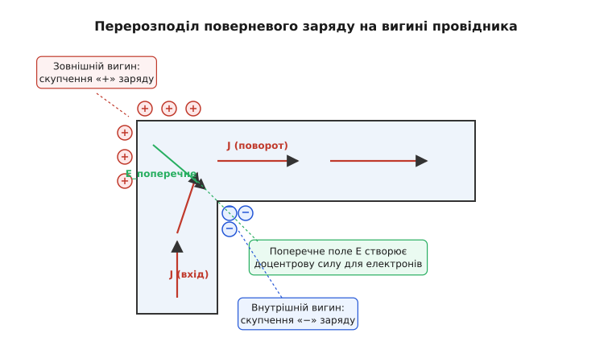
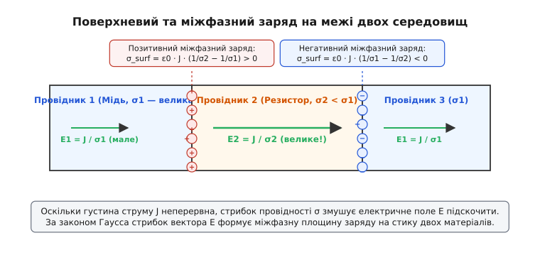
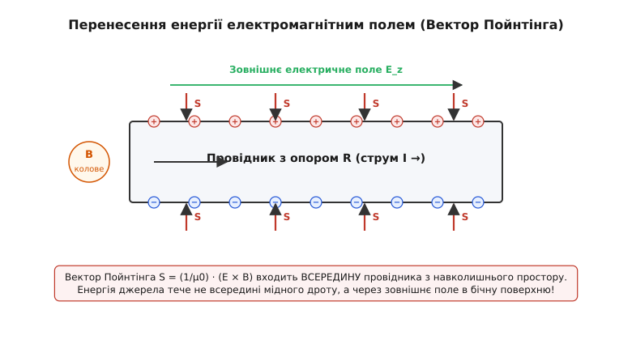
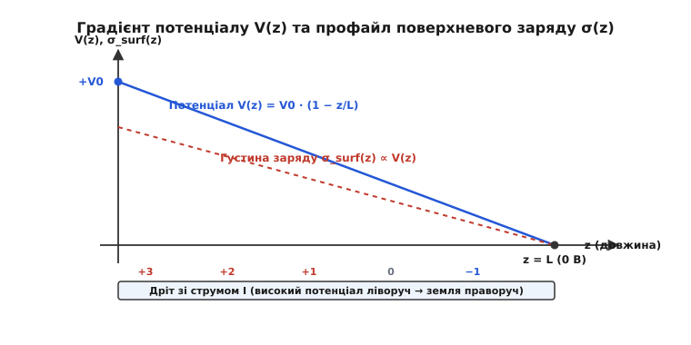

# Поверхневий заряд у провіднику

<preknowlist>
- [Електричний струм](topic:ph-electromagnetism/electric-current) — напрямлений рух носіїв заряду в провіднику (ампер).
- [Електричне поле](topic:ph-electromagnetism/electric-field) — векторне поле, що діє силою на заряджені частинки.
- [Закон Ома](topic:ph-electromagnetism/closed-circuit) — зв'язок між густиною струму, провідністю та напруженістю поля.
- [Закон Гаусса](topic:ph-electromagnetism/electric-field) — зв'язок між потоком векторів напруженості та сумарним зарядом усередині поверхні.
- [Потенціал](topic:ph-electromagnetism/electric-potential) — скалярна характеристика енергії електричного поля у точці.
</preknowlist>

Приєднайте двометровий мідний дріт до дванадцятивольтового автомобільного акумулятора й прокладіть його складним вигнутим маршрутом через кілька прямокутних кутів лабораторного столу. За класичною моделлю Друде вільні електрони у міді рухаються з дрейфовою швидкістю близько одного десятого міліметра за секунду, постійно зіштовхуючись із позитивними іонами кристалічної ґратки з частотою порядку ста трильйонів разів на секунду. Коли дрейфуючий електрон підходить до прямокутного повороту дроту, його вектор середньої швидкості різко змінює напрямок на дев'яносто градусів. Сама гальванічна батарея знаходиться на відстані одного метра від цього повороту й створює звичайне радіальне дипольне поле, яке спадає з квадратом відстані й ніяк не може «знати», де саме інженер зігнув мідний провідник. Проте вимірювання показують, що електричне поле всередині провідника у кожній точці каналу строго паралельне до бічних стінок і точно повертає дрейфовий потік носіїв уздовж усього вигнутого маршруту.

Ця фундаментальна здатність провідника самостійно орієнтувати власне внутрішнє поле забезпечується **поверхневими зарядами** (лат. _conductio_ — проведення, електродинамічний перерозподіл). Під час замикання ключа надшвидкий перехідний процес за лічені пікосекунди наганяє вільні електрони на бічну поверхню дроту. Саме ці скупчення поверневого заряду створюють як внутрішнє напрямлене поле, що рухає струм, так і зовнішнє електромагнітне поле, яке транспортує енергію джерела крізь навколишній простір.

### Парадокс зігнутого дроту та межі електростатики

У шкільному та першому університетському курсах фізики викладання електродинаміки часто розривається на два ізольовані блоки. В електростатиці студентам щеплюють інваріантне правило: усередині будь-якого провідника електричне поле дорівнює нулю (`E = 0`), потенціал в усіх точках одинаковий, а будь-який надлишковий заряд виштовхується електростатичним відштовхуванням на зовнішню межу. Натомість у розділі постійного струму без пояснення причин вводиться диференціальний закон Ома `J = σ · E`, з якого випливає, що всередині провідника зі струмом обов'язково існує поздовжнє електричне поле `E`. Без цього поля електрони зупинилися б за фемтосекунди через постійну дисипацію імпульсу на фононах ґратки.

Більшість початківців намагаються пояснити це джерелом живильної напруги: мовляв, позитивна клема батареї притягує електрони, а негативна — штовхає їх. Проте це уявлення руйнується при найпростішому аналізі геометрії полів. Електроди гальванічного елемента є локалізованими джерелами. Поле точкового заряду або компактного диполя є радіальним: його силові лінії розходяться прямолінійними променями в усі боки й безперешкодно пронизують простір. Якби поле всередині зігнутого дроту створювалося безпосередньо клемами батареї, на першому ж повороті каналу силові лінії вийшли б крізь бічну стінку назовні у повітря. Електрони врізалися б у внутрішню межу міді й зупинилися, так і не дійшовши до навантаження.

```
       [ Поле батареї без поверхневих зарядів ]          [ Дійсне поле у зігнутому дроті ]
       
            E_bat →                                             → → ↴
       ─────────────┐                                      ─────────┐  │
                    │                                               │  │ E_guided
                    │                                               │  ↓
```

Для того щоб дрейфова швидкість електронів повертала на вигинах, у кожній точці провідного каналу має існувати локальна поперечна компонента електричного поля `E_transverse`, яка діє на носії як доцентрова сила. Джерелом цього напрямного поля є не далека батарея, а мікроскопічний шар поверневого заряду, що осідає на межах мідної жили під час замикання кола.

### Доведення строгої відсутності об'ємного заряду в товщі провідника

Найбільш вражаючим результатом класичної електродинаміки провідників зі стаціонарним струмом є те, що всередині самої металевої товщі немає жодного надлишкового макроскопічного заряду. Увесь внутрішній об'єм провідника зі струмом лишається строго електронейтральним на макроскопічному рівні.

Доведемо це твердження, об'єднавши три фундаментальні співвідношення електродинаміки:
1. Рівняння неперервності струму у стаціонарному режимі за відсутності накопичення заряду у часі (`∂ρ / ∂t = 0`): дивергенція густини струму дорівнює нулю (`div(J) = 0`).
2. Диференціальну форму закону Ома для однорідного ізотропного провідника з постійною питомою електропровідністю `σ`: густина струму прямо пропорційна напруженості поля (`J = σ · E`).
3. Теорему Гаусса у диференціальній формі: дивергенція поля пропорційна об'ємній густині заряду `ρ` (`div(E) = ρ / ε0`).

Підставимо диференціальний закон Ома у рівняння неперервності струму:

```
div(J) = 0                      [рівняння неперервності стаціонарного струму]
div(σ · E) = 0                  [заміна J на σ · E за законами провідності]
σ · div(E) = 0                  [винесення сталої провідності σ за знак дивергенції]
```

Оскільки для будь-якого реального металевого провідника питома електропровідність є позитивною ненульовою величиною (`σ > 0`), розділимо обидві частини рівняння на `σ` і отримаємо `div(E) = 0`. Підставимо цей результат у теорему Гаусса:

```
div(E) = ρ / ε0 = 0             [прирівнювання дивергенції поля до об'ємного заряду]
ρ = 0                           [об'ємна густина заряду всередині провідника дорівнює нулю]
```

З цього виведення випливає фундаментальний висновок: всередині суцільного однорідного провідника зі струмом не існує жодного локального згустку або розрідження електронного газу. З точки зору квантової фізики та фізики твердого тіла це пояснюється надзвичайно малим радіусом дебаївського екранування у металах (`λ_D ≈ 0.1` нанометра). Будь-який флуктуаційний надлишок електронного заряду всередині об'єму екранується позитивними іонами ґратки на атомних масштабах.

Крім того, плазмова частота електронного газу у міді `ω_p = sqrt(n · e^2 / (ε0 · m*)) ≈ 1.6 · 10^16` рад/с визначає надзвичайно коротку часову шкалу реакції електронної системи. Будь-яка локальна незбалансованість заряду розсмоктується за час порядку прибуття плазмової хвилі `τ_p ≈ 1 / ω_p ≈ 10^-16` секунд.

Отже, якщо об'ємна густина заряду в товщі `ρ = 0`, то єдиним місцем у просторі, де фізично можуть накопичуватися макроскопічні заряди, які формують і повертають внутрішнє поздовжнє поле `E`, є **зовнішня бічна поверхня провідника** та площини поділу матеріалів із різними фізичними властивостями.

### Перехідний процес: від початкового хаосу до стаціонарного стану

Які саме події розгортаються всередині та навколо провідника у перші частки секунди після того, як інженер замикає ключ у колі?

Уперше моменти після замикання контуру (`t = 0`) первинний електромагнітний імпульс від джерела живлення починає поширюватися вздовж провідника у навколишньому діелектрику зі швидкістю світла `v = 1 / sqrt(ε · μ)`. На цьому початковому етапі силові лінії первинного електричного поля спрямовані хаотично й пронизують поверхню мідного дроту під довільними кутами.

Як тільки первинне електричне поле під кутом перетинає бічну межу металу, усередині провідника з'являється нормальна (перпендикулярна до поверхні) компонента густини струму `J_normal = σ · E_normal`. Цей поперечний мікрострум починає виносити вільні електрони провідності з внутрішнього об'єму на зовнішню бічну поверхню дроту (або, навпаки, відводити електрони від поверхні углиб).

```
   [ Етап 1: Первинне поле перетинає межу під кутом ]    [ Етап 2: Сформований поверхневий заряд ]
   
          E_ext ↗                                           +   +   +  (позитивний заряд)
     ─────────────────                                 ─────────────────
       E_int ↗                                            E_int ────────> (чисто поздовжнє)
     ─────────────────                                 ─────────────────
                                                            −   −   −  (негативний заряд)
```

Накопичення електронів на бічній стінці формує місцеву поверхневу густину заряду `σ_surf`. Цей поверхневий заряд створює власне додаткове електричне поле, яке у внутрішньому просторі провідника спрямоване строго назустріч нормальній компоненті зовнішнього поля. Процес винесення носіїв триває доти, доки нормальна компонента напруженості електричного поля всередині металу не зменшиться до нуля:

```
E_int, normal = 0               [гранична умова стаціонарного струму у провіднику]
```

Характерний час макроскопічної релаксації `τ` цього перехідного процесу для чистої міді визначається відношенням електричної сталої до провідності `τ = ε0 / σ ≈ 1.5 · 10^-19` секунд. На практиці швидкість встановлення стаціонарного розподілу поверневого заряду вздовж усього замкненого кола обмежується лише часом прольоту електромагнітної хвилі вздовж довжини контуру (для метрового дроту цей процес триває від 3 до 5 наносекунд).

Після завершення перехідного процесу коло досягає стійкого динамічного стану з такими інваріантами:
- Всередині провідника вектор електричного поля `E` стає строго тангенціальним (паралельним) до бічних стінок каналу.
- На зовнішній поверхні провідника утримується стаціонарний розподіл поверневого заряду `σ_surf`.
- Поверхнева густина заряду прямо пов'язана зі стрибком нормальної компоненти зовнішнього електричного поля `E_ext, normal` у повітрі біля поверхні дроту за теоремою Гаусса:

```
E_ext, normal = σ_surf / ε0     [гранична умова Гаусса для поверхні провідника]
```

Розглянемо випадок, коли дріт робить поворот під кутом дев'яносто градусів. На повороті електрони за інерцією спочатку продовжують рухатися прямолінійно. Це створює тимчасовий надлишок негативного заряду на внутрішньому радіусі вигину та нестачу електронів (надлишок невикомпенсованих позитивних іонів кристалічної ґратки) на зовнішньому радіусі повороту.


*Перерозподіл поверневого заряду на вигині провідника. Скупчення позитивного заряду на зовнішньому радіусі повороту та негативного на внутрішньому створюють поперечне поле E_transverse, яке забезпечує доцентрову силу для повороту векторів дрейфової швидкості електронів.*

Сформоване цими скупченнями поперечне поле `E_transverse` вирівнює напрямок дрейфу електронів, примушуючи потік носіїв повертати уздовж нового напрямку провідного каналу без втрати неперервності струму.

### Межа двох середовищ: резистори, зміна перерізу та міжфазний заряд

Механізм формування поверхневих зарядів проявляється особливо яскраво на межі стику двох провідників із суттєво різною питомою електропровідністю — наприклад, при підключенні високопровідного мідного дроту (`σ1 ≈ 5.8 · 10^7` См/м) до низькопровідного вуглецевого резистора (`σ2 ≈ 10^3` См/м).

Розглянемо послідовну систему з двох циліндричних брусків однакової площі поперечного перерізу `S`, якими протікає постійний струм `I`. За законом збереження заряду у стаціонарному режимі густина струму `J = I / S` є однаковою в обох матеріалах (`J1 = J2 = J`).

Використовуючи диференціальний закон Ома, знайдемо напруженість поздовжнього електричного поля всередині кожного з матеріалів:

```
E1 = J / σ1                     [поздовжнє поле у високопровідній міді — надзвичайно мале]
E2 = J / σ2                     [поздовжнє поле у низькопровідному резисторі — велике]
```

Оскільки електропровідність резистора `σ2` у десятки тисяч разів менша за провідність міді `σ1`, поздовжнє електричне поле у резисторі `E2` має бути у стільки ж разів більшим за поле у мідному дроті `E1`.


*Поверхневий та міжфазний заряд на межі двох середовищ з різною провідністю. На вхідному стику з міді у резистор виникає позитивна міжфазна площина заряду, яка генерує необхідний стрибок електричного поля E2 > E1.*

На межі розділу двох матеріалів вектор електричного поля зазнає різкого математичного стрибка `ΔE = E2 - E1 > 0`. За теоремою Гаусса будь-яка неперервна зміна нормальної компоненти поля означає наявність поверхневого (міжфазного) заряду з густиною `σ_interface`:

```
σ_interface = ε0 · (E2 - E1) = ε0 · J · (1 / σ2 - 1 / σ1) [міжфазний заряд на стику матеріалів]
```

Оскільки `σ2 < σ1`, вираз у дужках є строго позитивним. Це означає, що на вхідному стику між міддю та резистором виникає **позитивна площина міжфазного заряду**. На вихідному стику з резистора назад у мідний дріт провідність зростає (`σ1 > σ2`), тому вираз у дужках змінює знак на мінус: там накопичується **негативна площина міжфазного заряду**.

Цей позитивний міжфазний заряд на вході резистора виконує важливу фізичну роль: він прагне виштовхнути електрони, що надходять з міді, у глибину «важкого» матеріалу резистора, створюючи там потужне поздовжнє поле `E2`.

Аналогічний перерозподіл відбувається при зміні площі поперечного перерізу провідника (наприклад, при переході з товстого дроту перерізом `S1` у тонкий дріт перерізом `S2 < S1`). Оскільки струм неперервний (`I = const`), густина струму у вузькому дроті зростає (`J2 = I / S2 > J1 = I / S1`). Відповідно зростає й електричне поле `E2 = J2 / σ`, що призводить до виникнення позитивного поверхневого заряду у місці звуження каналу. Детальні виведення цих співвідношень наведено у [математичному виведенні](topic:ph-electromagnetism/surface-charge-guiding-field/math-surface-charge-derivation.md).

### Куди насправді тече енергія: Пойнтінг і зовнішнє поле

Аналіз поверхневих зарядів приводить до радикального перегляду механізму передачі електромагнітної енергії у будь-яких електричних кола.

Більшість людей інтуїтивно уявляють, що енергія від батареї до навантаження транспортується «всередині металевого дроту», подібного до того, як стиснута вода тече по гідравлічній трубі. Проте електродинаміка Максвелла й Пойнтінга показує абсолютно іншу фізичну реальність.

Електрони всередині мідного дроту рухаються зі швидкістю равлика (`v_d ≈ 0.1` мм/с). Просуваючись крізь ґратку, вони хаотично зіштовхуються з іонами й безперервно передають свою кінетичну енергію кристалу, перетворюючи її на тепло (Джоулів обігрів з питомою потужністю `p = σ · E^2`). Отже, мідний провідник є не «трубою для транспортування енергії», а її **безпосереднім споживачем та дисипатором**.

Звідки ж у кожний елемент об'єму провідника надходить енергія для покриття цих теплових втрат?

Електромагнітна енергія передається крізь навколишній діелектрик (повітря, вакуум чи ізоляцію) у формі електромагнітного поля, яке описується вектором Пойнтінга `S` (грец. _потік/вектор_):

```
S = (1 / μ0) · (E × B)          [вектор густини потоку електромагнітної енергії Пойнтінга]
```

Проаналізуємо векторну конфігурацію полів у просторі біля циліндричного провідника зі струмом `I`:
1. Струм `I`, що протікає у провіднику, створює у навколишньому просторі колове магнітне поле `B_φ = (μ0 · I) / (2 · π · r)`.
2. Поверхневі заряди `σ_surf`, розподілені вздовж бічної стінки провідника, створюють у зовнішньому просторі поздовжнє електричне поле `E_z`.


*Перенесення енергії електромагнітним полем. Вектор Пойнтінга S, сформований зовнішнім електричним полем E_z та коловим магнітним полем B_φ, спрямований перпендикулярно до бічної поверхні ВСЕРЕДИНУ провідника, живлячи теплові втрати з навколишнього діелектрика.*

Обчислимо векторний добуток поздовжнього електричного поля `E_z` та колового магнітного поля `B_φ`. За правилом правого гвинта вектор Пойнтінга `S` спрямований **радіально всередину** бічної поверхні провідника (вздовж нормалі `-r`).

Це означає, що джерело електричної енергії (батарея чи генератор) випромінює електромагнітну енергію у навколишній простір. Енергія поширюється у повітрі вздовж дроту, а потім входить у бічну поверхню провідника під прямим кутом і перетворюється на тепло усередині металу.

Розрахунок інтеграла вектора Пойнтінга по бічній поверхні провідника довжиною `L` і радіусом `a` дає точну рівність Джоулевій потужності:

```
P_in = ∬ S · dA = I^2 · R       [потік вектора Пойнтінга дорівнює Джоулевій потужності]
```

У цій системі поверхневі заряди на бічній стінці дроту виконують роль **інфраструктури орієнтації поля**: вони формують конфігурацію зовнішнього електричного поля так, щоб потік вектора Пойнтінга йшов точно уздовж провідного каналу й входив у дріт у строго необхідних обсягах.

Зокрема, Арнольд Зоммерфельд показав, що якби провідник був ідеальним надпровідником (`σ → ∞`), то поздовжнє електричне поле всередині металу дорівнювало б нулю (`E_z = 0`). У такому разі вектор Пойнтінга був би строго паралельним поверхні дроту, і жодна частка енергії не входила б всередину провідника — уся енергія передавалася б без втрат уздовж лінії передачі.

### Градієнт потенціалу та лінійний профіль поверхневого заряду

Для того щоб вектор Пойнтінга у кожній точці входив у провідник під належним кутом, поверхневий заряд має бути розподілений вздовж довжини провідного каналу за відповідним градієнтом.

Розглянемо циліндричний провідник довжиною `L`, підключений до різниці потенціалів `V0`. Якщо питомий опір дроту однорідний, потенціал спадає вздовж координати `z` за лінійним законом `V(z) = V0 · (1 - z / L)`.


*Градієнт потенціалу V(z) та профайл поверхневого заряду σ_surf(z) вздовж однорідного провідника. Густина поверхневого заряду пропорційна місцевому електричному потенціалу щодо заземленого оточення.*

Оскільки поверхневий заряд пропорційний зовнішньому радіальному полю `E_radial`, а радіальне поле визначається різницею потенціалів між провідником та заземленим навколишнім середовищем (або зворотним дротом), поверхнева густина заряду `σ_surf(z)` спадає вздовж довжини провідника:

```
σ_surf(z) ∝ V(z)                [густина поверневого заряду пропорційна місцевому потенціалу]
```

- Біля позитивного виводу джерела (`z = 0`) поверхневий заряд є максимально **позитивним**.
- У середній точці провідника заряд спадає до нуля.
- Біля негативного виводу (або заземлення) поверхневий заряд стає **негативним**.

Саме цей спадний профайл поверхневого заряду створює як внутрішнє постійне поздовжнє поле `E_z = V0 / L`, так і зовнішнє електростатичне поле, необхідне для спрямування вектора Пойнтінга.

### Експериментальне виявлення, моделювання та практичні застосування

Тривалий час поверхневий заряд у кола зі струмом вважався суто теоретичним описом через його малу величину (порядок пікокулонів на квадратний метр для звичайних низьковольтних кіл).

Проте у 1960-х роках видатний фізик Олег Джефіменко розробив унікальні методи прямої візуалізації цих зарядів за допомогою зоряних електрометричних порошків та електрооптичних кристалів (ефект Поккельса). Детальний історіографічний опис цих дослідів та еволюції поглядів від Вебера до Шервуда наведено у [історичному екскурсі](topic:ph-electromagnetism/surface-charge-guiding-field/hist-surface-charge.md).

У сучасній радіоелектроніці та розробці високочастотних друкованих плат (PCB) нехтування поверхневими зарядами призводить до значних інженерних дефектів:
1. **Імпеданс вигинів мікросмукових ліній:** При передачі високочастотних сигналів (понад 1 ГГц) скупчення поверхневого заряду на прямокутних поворотах траси створює паразитну ємність і викликає відбиття сигналу. Для уникнення цього інженери виконують зріз кута траси під 45 градусів (мікросмуковий фасет).
2. **Паразитні наводки та перехресні завади (Crosstalk):** Зовнішнє електричне поле, сформоване поверхневими зарядами провідника зі струмом, наводить імпульсні завади на сусідні паралельні сигнальні лінії.
3. **Скін-ефект і високочастотна провідність:** На високих частотах вихрові струми витісняють поздовжній струм до зовнішньої поверхні провідника (вглиб на товщину скін-шару `δ = sqrt(2 / (ω · μ · σ))`). У цьому режимі поверхневі заряди та поверхневі струми повністю визначають хвильовий опір лінії передачі.
4. **Чисельні EM-солівери:** Сучасний аналіз систем цілісності сигналів (Signal Integrity) базується на чисельному розв'язанні граничних інтегральних рівнянь для поверневих зарядів та струмів.

Алгоритми чисельного обчислення поверневих зарядів методом скінченних різниць (FDM) із робочими прикладами мовами C++ та C розібрано у [чисельному моделюванні](topic:ph-electromagnetism/surface-charge-guiding-field/proj-surface-charge-field.md).

Повний опис програмного інтерфейсу, параметрів сітки, інваріантів та типів крайових умов для промислових електродинамічних соліверів міститься у [інтерфейсі соліверів](topic:ph-electromagnetism/surface-charge-guiding-field/api-surface-charge-solver.md).

---

Розуміння поверхневого заряду перетворює абстрактну схему з підручника на цілісну фізичну картину: струм тече провідником завдяки поверхневим зарядам, які напрямляють внутрішнє поле й відкривають бічну поверхню металу для припливу електромагнітної енергії з навколишнього простору.
