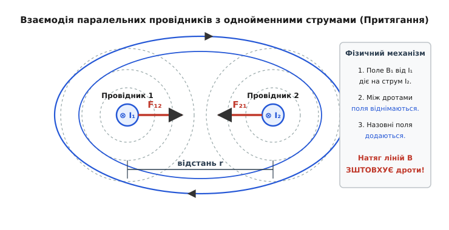
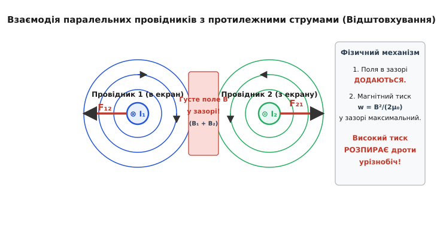
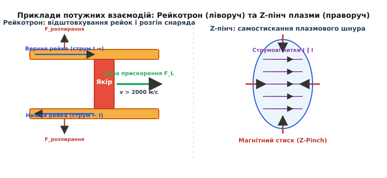
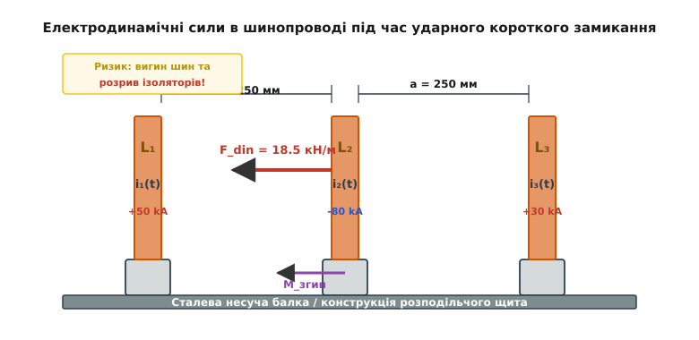

# Сила між паралельними провідниками

<preknowlist>
- [Закон Біо — Савара](topic:ph-electromagnetism/biot-savart-law) — магнітне поле, створене прямолінійним провідником зі струмом.
- [Сила Ампера](topic:ph-electromagnetism/ampere-force) — дія магнітного поля на провідник зі струмом.
- [Третій закон Ньютона](topic:physics/mechanics/newton-laws) — рівність і протилежність сил механічної взаємодії.
- [Магнітна проникність](topic:physics/electromagnetism/magnetic-permeability) — роль середовища в поширенні магнітного поля.
</preknowlist>

Якщо підключити дві довгі гнучкі мідні жили до потужного джерела постійного струму і розмістити їх паралельно на невеликій відстані одна від одної, при включенні струму дроти миттєво здригнуться. Якщо струми в обох жилах течуть в один і той самий бік, дроти стрімко притягнуться один до одного і злипнуться. Якщо ж поміняти полярність на одному з дротів і пустити струми у протилежних напрямках, дроти силою дуги вигнуться назовні та відштовхнуться. Цей класичний дослід, уперше виконаний Андре-Марі Ампером восени 1820 року, показує: струми взаємодіють безпосередньо через створювані ними магнітні поля, без жодної участі постійних магнітів чи статичних зарядів.

Цей ефект — не просто демонстраційний дослід. Саме на силовій взаємодії паралельних струмів понад сімдесят років спиралося фундаментальне означення одиниці електричного струму — ампера — в Міжнародній системі одиниць СІ. У потужній енергетиці, при коротких замиканнях у розподільчих пристроях електростанцій, сила між паралельними шинами зростає до десятків тонн і здатна вигнути масивні мідні бруси та розтрощити порцелянові ізолятори. В імпульсній техніці та фізиці плазми ця сама сила стискає плазмовий шнур у термоядерному реакторі (Z-пінч) або розганяє снаряди у рейкотронах до гіперзвукових швидкостей. Зрозуміймо фізичний механізм цього явища від першопричин.

---

### Фізичний механізм: накладання магнітних полів і натяг силових ліній

Чому два провідники зі струмом притягуються або відштовхуються? Спокуса сказати «бо так діє сила Ампера» є лише формальним перенесенням відповідальності на назву закону. Щоб побачити справжню причинно-наслідкову картину, треба подивитися на структуру **результуючого магнітного поля** у просторі довкола обох провідників.

Кожен провідник зі струмом створює у навколишньому просторі власне магнітне поле, силові лінії якого є концентричними кільцями (за правилом правої руки). Коли у просторі є два провідники, їхні магнітні поля у кожній точці векторно складаються (принцип суперпозиції).


*Притягання паралельних провідників з однойменними струмами. У зазорі між дротами магнітні поля B₁ та B₂ спрямовані назустріч і гасять одне одного. Назовні поля додаються. Результуючі лінії поля охоплюють обидва дроти і, прагнучи скоротитися наче напнуті гумові джгути, зштовхують дроти назустріч.*

Розглянемо випадок, коли струми `I₁` та `I₂` течуть в **один і той самий бік** (однойменні струми):
1. **У зазорі між провідниками:** Вектор магнітної індукції `B₁` від першого провідника спрямований убік, протилежний вектору `B₂` від другого провідника. Поля спрямовані назустріч і гасять одне одного. Сумарне поле у зазорі послаблюється.
2. **Назовні від провідників:** Вектори `B₁` та `B₂` спрямовані в один бік і додаються. Поле назовні підсилюється.
3. **Результат:** Виникає просторова асиметрія поля. Результуючі силові лінії оперізують обидва провідники разом. Згідно з теорією Максвелла, магнітні силові лінії мають властивість поздовжнього натягу (поводяться як натягнуті пружні гумові джгути) та бічного розпирання. Прагнучи скоротити свою довжину, зовнішні лінії поля тиснуть на провідники ззовні та **зштовхують їх назустріч один одному** — ми спостерігаємо **притягання**.

Розглянемо протилежний випадок, коли струми течуть у **протилежні боки** (протилежно спрямовані струми):


*Відштовхування паралельних провідників з протилежно спрямованими струмами. У зазорі між провідниками поля B₁ та B₂ додаються, створюючи область високої густини магнітного поля і високого магнітного тиску w = B²/(2μ₀). Цей магнітний тиск розпирає провідники урізнобіч.*

1. **У зазорі між провідниками:** Поля `B₁` та `B₂` спрямовані в один і той самий бік — вони додаються! У зазорі виникає густа концентрація магнітних ліній.
2. **Назовні від провідників:** Вектори полів спрямовані протилежно і частково гасять одне одного.
3. **Результат:** Оскільки густина енергії магнітного поля описується формулою `w = B² / (2·μ₀)`, у зазорі між провідниками утворюється зона високого магнітного тиску. Магнітне поле діє на поверхню провідників із механічним тиском, спрямованим назовні. Цей тиск **розпирає провідники урізнобіч** — ми спостерігаємо **відштовхування**.

Зверніть увагу на важливу фундаментальну контрастність між електростатикою та магнетизмом:
- **В електростатиці:** однойменні заряди (`+` і `+`) **відштовхуються**, протилежні (`+` і `-`) **притягуються**.
- **В електродинаміці:** однойменні струми (`→` і `→`) **притягуються**, протилежні (`→` і `←`) **відштовхуються**.

Ця протилежність є глибоким наслідком релятивістської природи магнітного поля та векторного характеру взаємодії рухомих зарядів.

---

### Тензор напружень Максвелла: польовий погляд на механічну силу

Джеймс Клерк Максвелл запропонував ще глибший математичний підхід до розуміння сил у магнітному полі, відмовившись від концепції дальнодіяння. У польовій концепції магнітне поле не просто «передає» силу від одного дроту до іншого, а саме є носієм механічних напружень у вакуумі чи середовищі.

Кожна точка магнітного поля з індукцією `B` перебуває у напруженому стані, який описується **тензором напружень Максвелла** `T_ij`. Цей тензор означає, що у магнітному полі діють два типи механічних сил:
1. **Поздовжній натяг вздовж силових ліній:** Уздовж векторів магнітної індукції діє розтягувальне напруження `p_parallel = B² / (2·μ₀)`. Магнітні лінії поводяться як пружні нитки, що прагнуть скоротитися.
2. **Поперечний тиск перпендикулярно до силових ліній:** У напрямках, перпендикулярних до магнітних ліній, діє стискальний магнітний тиск `p_perp = B² / (2·μ₀)`.

Щоб знайти повну механічну силу `F`, яка діє на провідник, достатньо вибрати будь-яку замкнену поверхню `S`, що охоплює цей провідник, і проінтегрувати по цій поверхні тензор напружень Максвелла:

```
F = ∮_S T · dS
```

Цей підхід дозволяє обчислити силу без знання внутрішньої структури провідника або розподілу струму всередині його перерізу. Якщо між двома провідниками зі струмами однакового напрямку поле гаситься, то на внутрішній поверхні зазору магнітний тиск дорівнює нулю, тоді як на зовнішніх поверхнях діє зовнішній тиск `B² / (2·μ₀)`. Різниця тисків дає точну силу притягання Ампера. Погляд через тензор Максвелла доводить: механічна сила народжується безпосередньо у просторі поля, а провідники лише сприймають цей тиск.

---

### Енергетичний підхід і взаємна індуктивність

Силу взаємодії між двома провідниками можна вивести не лише через вектори магнітного поля, але й через загальний енергетичний баланс електромагнітної системи. Це узагальнення надає зручний інструмент для розрахунку складних контурів.

Загальна енергія магнітного поля двох контурів зі струмами `I₁` та `I₂` дорівнює:

```
W_m = (1/2) · L₁ · I₁² + M₁₂ · I₁ · I₂ + (1/2) · L₂ · I₂²
```

де `L₁` та `L₂` — власні індуктивності контурів, а `M₁₂` — їхня **взаємна індуктивність**, яка залежить від геометрії та відстані `r` між контурами.

Оскільки власні індуктивності жестких провідників не змінюються при зміні відстані `r`, узагальнена магнітна сила `F_r`, що діє уздовж координати `r`, дорівнює частинній похідній від магнітної енергії системи за координатою `r` при фіксованих струмах:

```
F_r = ∂W_m / ∂r = I₁ · I₂ · (∂M₁₂ / ∂r)
```

Для двох паралельних провідників довжиною `L` взаємна індуктивність на одиницю довжини дорівнює `M₁₂ / L = (μ₀ / (2·π)) · ln(L / r)`. Обчислюючи похідну `∂M₁₂ / ∂r`:

```
∂M₁₂ / ∂r = - (μ₀ · L / (2·π · r))
```

Підставляючи цю похідну в енергетичну формулу сили, ми знову отримуємо точну формулу Ампера:

```
F = - μ₀ · I₁ · I₂ · L / (2·π · r)
```

Знак мінус вказує на те, що сила спрямована у бік зменшення відстані `r` (при однаковому напрямку струмів система прагне мінімізувати свою потенціальну енергію шляхом збільшення взаємної індуктивності `M₁₂`). Цей енергетичний підхід робить очевидним зв'язок між механічною силою та параметрами індуктивності електротехнічних кіл.

---

### Математичний вивід: від закону Біо — Савара до формули Ампера

Перейдемо від якісної інтуїції до точного кількісного розрахунку. Нехай маємо два паралельні провідники нескінченної довжини, що розміщені у вакуумі на відстані `r` один від одного. Провідником 1 тече струм `I₁`, провідником 2 — струм `I₂`.

Знайдемо силу `F₁₂`, з якою перший провідник діє на ділянку другого провідника довжиною `L`.

**Крок 1. Обчислення поля першого провідника.**
За [законом Біо — Савара](topic:ph-electromagnetism/biot-savart-law), елемент прямолінійного провідника `dz` створює на відстані `r` диференціальне магнітне поле `dB₁ = (μ₀ · I₁ / (4·π)) · (dz · cos(α) / R²)`. Інтегрування цього виразу вздовж нескінченного провідника (від кута `α = -π/2` до `α = +π/2`) дає підсумкову індукцію магнітного поля `B₁`:

```
B₁ = μ₀ · I₁ / (2·π · r)
```

де `μ₀` — магнітна стала вакууму (`μ₀ = 4·π × 10⁻⁷` Гн/м або Н/А²). Зверніть увагу: множник `2` у знаменнику з'являється саме в результаті інтегрування нескінченного провідника (інтеграл від `cos(α) dα` від `-π/2` до `+π/2` дорівнює `2`, що скорочує `4` у знаменнику до `2`). Силові лінії цього поля утворюють кола, центром яких є перший провідник. У точках, де проходить другий провідник, вектор індукції `B₁` спрямований строго перпендикулярно до напрямку другого провідника (кут `θ = 90°`).

**Крок 2. Обчислення сили Ампера, що діє на другий провідник.**
Провідник 2 зі струмом `I₂` та довжиною `L` перебуває в однорідному магнітному полі `B₁`. На нього діє [сила Ампера](topic:ph-electromagnetism/ampere-force):

```
F₁₂ = B₁ · I₂ · L · sin(90°)
```

Оскільки `sin(90°) = 1`, підставляємо вираз для `B₁` у формулу сили:

```
F₁₂ = (μ₀ · I₁ / (2·π · r)) · I₂ · L
```

Звідси отримуємо підсумкову **формулу Ампера для сили взаємодії паралельних струмів**:

```
F = μ₀ · I₁ · I₂ · L / (2·π · r)
```

де:
- **F** — сила взаємодії між провідниками (Н);
- **I₁, I₂** — електричні струми в першому та другому провідниках (А);
- **L** — довжина ділянки взаємодії провідників (м);
- **r** — відстань між осями провідників (м);
- **μ₀** — магнітна стала (`4·π × 10⁻⁷` Н/А²).

У практичних обчисленнях найчастіше використовують **питому силу на одиницю довжини** `f = F / L` (вимірюється в Н/м):

```
f = F / L = μ₀ · I₁ · I₂ / (2·π · r)
```

Підставляючи чисельне значення `μ₀ / (2·π) = 2 × 10⁻⁷`, отримуємо зручну робочу формулу для вакууму та повітря:

```
f = 2 · 10⁻⁷ · I₁ · I₂ / r     (Н/м)
```

Якщо провідники занурені в однорідне середовище з відносною [магнітною проникністю](topic:physics/electromagnetism/magnetic-permeability) `μ_r`, магнітна індукція змінюється у `μ_r` разів, і формула набуває вигляду:

```
f = μ_r · μ₀ · I₁ · I₂ / (2·π · r)
```

> 🧮 **Математичний формалізм:** [математичний виведення сили між довільними струмовими контурами й скінченними провідниками](topic:ph-electromagnetism/two-wire-force/math-ampere-force-integration.md) — повний векторний розклад подвійного інтеграла Ампера, розрахунок кутових провідників та доведення виконання Третього закону Ньютона для замкнених кіл.

---

### Взаємодія непаралельних та скрещених провідників: сила і крутильний момент

Що відбувається, якщо два прямолінійні провідники зі струмами не є паралельними, а перетинаються або минають один одного під довільним кутом `θ` у просторі?

У цьому випадку симетрія системи ускладнюється, і силовий ефект складається з двох компонентів:
1. **Результуюча сила виштовхування або притягання:** Величина результуючої сили зменшується пропорційно косинусу кута нахилу:

```
f(θ) = (μ₀ · I₁ · I₂ / (2·π · r)) · cos(θ)
```

Коли провідники розташовані строго перпендикулярно один до одного (`θ = 90°`), косинус дорівнює нулю, і **сумарна трансляційна сила взаємодії дорівнює нулю**! Перпендикулярні струми не притягуються і не відштовхуються як ціле.

2. **Обертальний момент сили (крутильний момент):** Попри відсутність трансляційної сили при `θ = 90°`, елементи струму відчувають локальні сили Ампера, які створюють потужний пара сил. Цей механічний момент прагне **розвернути провідники так, щоб вони стали паралельними**, а їхні струми текли в одному напрямку.

Обертальний момент `M`, що діє на провідник довжиною `L`, розташований на відстані `d` від іншого струму під кутом `θ`:

```
M(θ) = (μ₀ · I₁ · I₂ / (2·π)) · ctg(θ) · ln(L / d)
```

Цей механічний момент є критично важливим для конструювання обмоток силових трансформаторів та реакторів. Якщо при виготовленні котушки витки лягають із перекосом, під час пускових струмів або коротких замикань виникають скручувальні моменти, які розривають внутрішню ізоляцію та деформують каркас обмотки.

---

### Порівняння з законом Кулона: чому 1/r, а не 1/r²?

Кожен, хто вивчав електростатику, пам'ятає [закон Кулона](topic:ph-electromagnetism/coulomb-law): сила взаємодії двох точкових зарядів спадає з відстанню як **квадрат відстані** (`1 / r²`). Чому ж у формулі Ампера сила спадає значно повільніше — як **перша степінь відстані** (`1 / r`)?

Відповідь полягає у **просторовій симетрії джерела поля**:
- **Точковий заряд (електростатика):** Поле розходиться у тривимірному просторі сферично. Площа сфери охоплення зростає як `4·π·r²`. Потік поля зберігається, тому густина ліній (і сила) спадає з відстанню як `1 / r²`.
- **Прямолінійний провідник нескінченної довжини (електродинаміка):** Поле має циліндричну симетрію. Силові лінії описують циліндри довкола дроту. Площа бічної поверхні циліндра на одиницю довжини зростає як `2·π·r` (лінійно з відстанню). Відповідно, густина магнітних силових ліній і сила спадають як `1 / r`.

Якби ми розглядали взаємодію двох точкових рухомих зарядів або двох коротких елементів струму `dL₁` та `dL₂`, сила між ними спадала б саме за законом `1 / r²`. Але інтегрування вздовж нескінченного прямого дроту «збирає» внески від усіх його віддалених ділянок, перетворюючи залежність `1 / r²` на `1 / r`.

---

### Мікроскопічна картина: сила Лоренца та релятивістська природа магнетизму

Що відбувається всередині провідників на рівні окремих носіїв заряду?

Уявимо металевий дріт, у якому кристалічна ґратка утворена нерухомими позитивними іонами з об'ємною густиною заряду `ρ_+`. Усередині ґратки хаотично рухається електронний газ із густиною `ρ_-`. У лабораторній системі відліку дріт є **електрично нейтральним** (`ρ_+ + ρ_- = 0`), тому два дріти не відчувають жодного електростатичного притягання чи відштовхування.

Коли у провідниках вмикають струм, електроні починають дрейфувати зі середньою швидкістю дрейфу `v_d`. На кожен окремий електрон, що рухається у другому дроті зі швидкістю `v_d`, з боку магнітного поля `B₁` першого дроту діє **сила Лоренца**:

```
F_L = q_e · (v_d × B₁)
```

Оскільки у провіднику довжиною `L` перебуває величезна кількість носіїв заряду `N = n · A · L`, сумування сил Лоренца, що діють на всі дрейфуючі електрони, дає макроскопічну силу Ампера:

```
F = N · F_L = (n · q_e · A · v_d) · B₁ · L = I₂ · L · B₁
```

Цей розрахунок доводить, що сила Ампера — це просто колективна сила Лоренца, передана металевій ґратці провідника через зіткнення електронів з іонами.

#### Спеціальна теорія відносності та виникнення магнітної сили

Найглибше розуміння сили між провідниками дає спеціальна теорія відносності Альберта Ейнштейна. Розглянемо систему відліку, яка рухається разом із дрейфуючими електронами другого провідника зі швидкістю `v_d`.

Через релятивістське скорочення довжини (Лоренцове скорочення `L = L₀ · √(1 - v²/c²)`):
1. Відстань між рухомими електронами у першому провіднику змінюється.
2. Відстань між нерухомими іонами ґратки змінюється в інший бік.

В результаті нейтральний у лабораторній системі відліку дріт у системі відліку рухомого електрона перестає бути електрично нейтральним! У ньому виникає надлишковий ненульовий електричний заряд. Те, що у лабораторній системі відліку ми називаємо **магнітною силою Ампера**, у системі відліку електрона виявляється звичайною **електростатичною силою Кулона**, спричиненою релятивістською асиметрією густини зарядів. Магнетизм — це релятивістський ефект електростатики при малій швидкості дрейфу!

---

### Історичне значення: фундаментальний ампер та квантова революція

Сила між паралельними провідниками посідає унікальне місце в історії фізики та метрології. Вона послужила фундаментальним містком між механічними одиницями маси й сили (ньютон, кілограм) та електричними одиницями струму і напруги.

З 1948 по 2019 рік саме формула Ампера слугувала основою для офіційного визначення одиниці електричного струму — **ампера** у Міжнародній системі одиниць СІ:
> Один ампер — це такий постійний струм, який при проходженні по двох паралельних прямолінійних провідниках нескінченної довжини і мізерно малого круглого перерізу, розташованих у вакуумі на відстані 1 метр один від одного, створює між цими провідниками силу взаємодії, рівну 2 × 10⁻⁷ ньютона на кожен метр довжини.

Це означало, що фундаментальна одиниця струму всього курсу фізики та електротехніки спиралася на вимірювання механічної сили між провідниками! Магнітна стала `μ₀` мала точне фіксоване значення `4·π × 10⁻⁷` Гн/м за визначенням.


*Приклади потужних електродинамічних взаємодій. Ліворуч: рейкотрон, у якому відштовхувальна сила між паралельними рейками створює розпиральне навантаження, а сила Лоренца на якір розганяє снаряд. Праворуч: Z-пінч плазми, де паралельні струмові нитки притягуються, стискаючи плазмовий шнур.*

Для практичного відтворення ампера метрологи використовували **струмові ваги** (ваги Кельвіна), де електродинамічна сила між котушками зрівноважувалася важками гравітаційного поля. 

Однак у травні 2019 року відбулася ревізія СІ: ампер перевизначили через фіксоване значення елементарного електричного заряду `e = 1.602176634 × 10⁻¹⁹` Кл. Магнітна стала `μ₀` перестала бути точним числом і стала експериментально вимірюваною величиною. Проте сила взаємодії провідників залишається головним містком між електродинамікою та механікою.

> 📜 **Історична вставка:** [детальний історичний шлях від дослідів Ампера до перевизначення СІ 2019 року](topic:ph-electromagnetism/two-wire-force/hist-ampere-definition.md) — полеміка між Біо та Ампером, конструкції струмових вагів та квантові стандарти Холла й Джозефсона.

---

### Практична інженерія: де сила між струмами стає руйнівною або корисною

У повсякденній низьковольтній електроніці (зі струмами у міліампери чи одиниці ампер) сила між дротами становить мікроньютони і є абсолютно непомітною. Проте у потужній інженерії значення струмів сягають тисяч і сотень тисяч ампер. Оскільки сила зростає як **квадрат струму** (`I²`), механічні навантаження стають колосальними.

#### 1. Електродинамічна стійкість шинопроводів ТП та РУ

У розподільчих пристроях (РП) підстанцій та на електростанціях струми короткого замикання (КЗ) досягають `I''k = 40 ... 100` кА, а ударний струм `i_th` сягає `100 ... 250` кА.


*Електродинамічні сили у трифазному шинопроводі під час ударного короткого замикання. Сили між паралельними мідними шинами досягають десятків кілоньютонів на метр, викликаючи вигин шин та механічний злам опорних порцелянових ізоляторів.*

Розглянемо суміжні шини двох фаз, розташовані на відстані `a = 0.25` м:
- При ударному струмі `i_th = 100` кА питома сила на метр шини перевищує `F_din ≈ 7000` Н/м (близько 700 кг-сили на кожен метр!).
- Ця сила діє імпульсно з частотою `100` Гц (подвоєна частота мережі). Якщо проліт шини має власну механічну частоту, близьку до `100` Гц, виникає резонанс, який здатний зігнути мідні бруси товщиною 10 мм і виламати опорні порцелянові або епоксидні ізолятори.

Слід також ураховувати джоулевий нагрів шин під час проходження струму КЗ: температура міді або алюмінію за сотні мілісекунд зростає до 200 °C, що призводить до тимчасового термопом'якшення матеріалу і зниження межі плинності `σ_0.2` на 20–30%. Інженери обов'язково розраховують шинопроводи на електродинамічну стійкість за IEC 60865-1, обираючи оптимальну відстань між ізоляторами та встановлюючи міжфазні ізоляційні розпірки.

> ⚙️ **Проєктна вставка:** [розробка розрахункового ядра для шинопроводів мовами C та C++](topic:ph-electromagnetism/two-wire-force/proj-busbar-force.md) — алгоритм розрахунку за IEC 60865-1, обчислення напружень вигину та оцінка міцності ізоляторів.
> 📋 **Довідник інтерфейсу:** [повна специфікація програмного інтерфейсу розрахункового модуля](topic:ph-electromagnetism/two-wire-force/api-wire-force-calculator.md) — типи даних, валідація, коди помилок та C++20 обгортки.

#### 2. Саморозширювальні сили у соленоїдах та силових котушках

Якщо згорнути провідник у котушку або соленоїд, сусідні витки несуть струми в однаковому напрямку, а протилежні сторони витка — у протилежних.
- **Аксіальний стиск соленоїда:** Сусідні витки притягуються один до одного, намагаючись стиснути соленоїд вздовж його осі.
- **Радіальне розпирання витків (hoop stress):** Протилежні сторони одного й того самого витка несуть струми протилежних напрямків і відштовхуються. Це створює коловий механічний натяг у провіднику, який прагне розірвати виток назовні.

У надпровідних магнітах томографів (МРТ) та прискорювачів частинок (LHC) магнітні поля досягають 8–15 Тесла. Радіальний тиск на витки обмотки досягає сотень атмосфер. Щоб котушка не розрушилася під дією власних електродинамічних сил, її бандажують високоміцним арамідним волокном (кевларом) або бандажами з нержавіючої сталі.

#### 3. Коаксіальні кабелі та вита пара

- **Коаксіальний кабель:** Струм тече внутрішньою жилою в один бік, а зовнішнім екраном — у протилежний. Оскільки струми протилежні, між жилою та екраном виникає відштовхування. Магнітне поле повністю заперте всередині кабелю і створює **внутрішній магнітний тиск**, який прагне розірвати екран назовні. При імпульсних струмах у сотні кілоампер (наприклад, при ударі блискавки у радіощоглу) коаксіальний кабель може роздутися та розірватися.
- **Вита пара (Twisted Pair):** Двожильний кабель, у якому два провідники з протилежними струмами перевиті між собою. Перевивання забезпечує компенсацію зовнішніх магнітних полів і зменшує механічні навантаження, оскільки вектор сили постійно змінює напрямок уздовж довжини кабелю.

#### 4. Z-пінч ефект у фізиці плазми

Якщо пропустити потужний імпульс струму (мільйони ампер) крізь циліндричний стовп іонізованого газу (плазми), струм можна уявити як пучок багатьох паралельних елементарних струмових ниток.

Оскільки всі струмові нитки течуть в один бік, вони **притягуються одна до одної**. Виникає потужна стискальна сила — **Z-пінч** (*Z-pinch*). Магнітне поле стискає плазмовий шнур до надвисоких густин і температур у мільйони градусів. Z-пінч є одним із базових методів утримання плазми в керованому термоядерному синтезі та у генераторах потужного рентгенівського випромінювання.

#### 5. Рейкотрон (Railgun)

Рейкотрон складається з двох паралельних масивних струмоведучих рейок, між якими розміщено рухомий струмопровідний якір (снаряд).

Струм тече вгору однією рейкою, проходить крізь якір і повертається другою рейкою. Оскільки струми у рейках протилежно спрямовані, вони **відштовхуються** з величезною силою (рейкотрон прагне розпирнути сам себе). Водночас магнітне поле, створене рейками у зазорі, діє на струм у якорі силою Лоренца, що розганяє снаряд уздовж рейок. Сучасні рейкотрони розганяють снаряди масою в кілька килограмів до швидкостей понад `2500` м/с (Mach 7).

---

> 🔧 **Навіщо це.** Розуміння сили взаємодії паралельних провідників дає інженеру можливість передбачити поведінку високовольтних кабелів, розрахувати механічну міцність розподільчих щитів при коротких замиканнях, оцінити розпиральні зусилля в імпульсних котушках та уникнути руйнування обладнання при аварійних режимах.

---

### Обчислювальні приклади з розрахунком

**Приклад 1. Сила між дротами у потужному джерелі живлення.**
Два паралельні кабелі постійного струму завдовжки `L = 3` метри розташовані у повітрі на відстані `r = 5` см (`0.05` м) один від одного. Кабелями тече струм `I = 500` А у протилежних напрямках. Яка сила відштовхування діє між ними?

```
I₁ = 500 А,  I₂ = 500 А,  r = 0.05 м,  L = 3 м
f = 2 · 10⁻⁷ · I₁ · I₂ / r            [питома сила на метр]
f = 2 · 10⁻⁷ · 500 · 500 / 0.05
f = 2 · 10⁻⁷ · 250000 / 0.05
f = 0.05 / 0.05
f = 1.0 Н/м                          [1 ньютон на метр довжини]

F_total = f · L = 1.0 · 3 = 3.0 Н     [польна сила на всі 3 метри]
```

Сила 3 Н відповідає вазі близько 300 грамів. Вона відчутна для гнучких дротів і вимагає їх фіксації хомутами.

---

**Приклад 2. Ударне навантаження шинопроводу під час короткого замикання.**
У трифазному шинопроводі 0.4 кВ дві паралельні мідні шини довжиною прольоту `L = 1.2` м розташовані на відстані `a = 0.2` м одна від одної. Під час трифазного КЗ ударний струм досягає `i_th = 80` кА (`80000` А). Яка питома та повна сила діє на шину в момент удару?

```
I₁ = 80000 А,  I₂ = 80000 А,  r = 0.20 м,  L = 1.2 м

f_max = (μ₀ / (2·π)) · (√3 / 2) · (i_th² / r)  [формула для трифазного КЗ]
f_max = 2 · 10⁻⁷ · 0.866 · (80000² / 0.20)
f_max = 2 · 10⁻⁷ · 0.866 · (6.4 · 10⁹ / 0.20)
f_max = 2 · 10⁻⁷ · 0.866 · 3.2 · 10¹⁰
f_max = 5542.4 Н/м                   [≈ 5.54 кН/м або 565 кг-сили/м]

F_span = f_max · L = 5542.4 · 1.2
F_span = 6650.9 Н                    [≈ 6.65 кН або 678 кг-сили на проліт]
```

На проліт довжиною 1.2 метра діє імпульсний удар силою понад 670 кілограмів! Якщо мідна шина перерізом `100 × 10` мм не закріплена на достатньо міцних ізоляторах, ця сила незворотно зігне її або відірве від несучої конструкції.

---

### Підсумковий синтез

Взаємодія паралельних провідників зі струмом — це фундаментальне явище, у якому закони електродинаміки безпосередньо переходять у механічні сили. Головні висновки:
- **Однойменні струми притягуються**, **протилежні — відштовхуються**.
- Сила взаємодії описується формулою `F = μ₀·I₁·I₂·L / (2·π·r)` і спадає з відстанню як `1 / r` через циліндричну симетрію поля.
- Польова концепція Максвелла описує цю силу через поздовжній натяг і поперечний тиск магнітного поля `w = B²/(2μ₀)`.
- На мікрорівні сила є результатом сумування сил Лоренца, що діють на дрейфуючі електрони, а з точки зору СТВ — релятивістським виявленням кулонівського поля при відносній зміні густини зарядів.
- В інженерії ця сила є основою роботи рейкотронів та Z-пінчу, але водночас створює головне руйнівне навантаження на шинопроводи під час коротких замикань.
