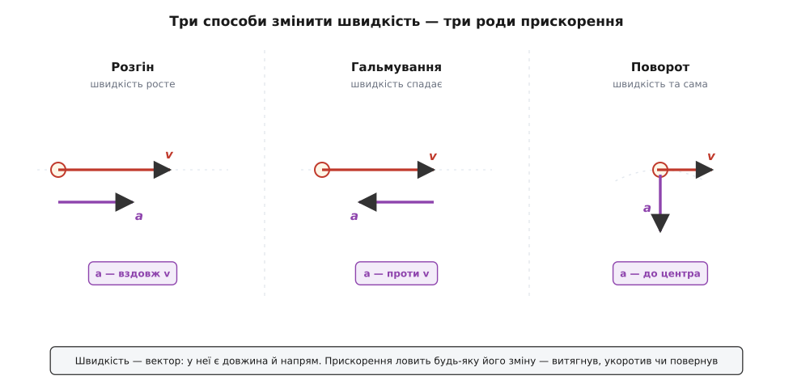
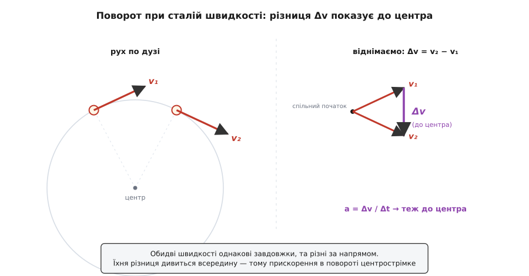

# Прискорення: не швидкість, а її зміна

<preknowlist>
- [Швидкість](topic:ph-mechanics/velocity) — як прудко й куди рухається тіло; векторна величина: має і розмір, і напрям.
- [Похідна](topic:math-analysis/derivative) — миттєва швидкість зміни величини; саме нею вимірюють прискорення в кожну окрему мить.
- [Додавання векторів](topic:math-algebra/vector-addition) — як складають і віднімають вектори за напрямом; зміна швидкості — це різниця двох векторів.
</preknowlist>

Сядь у машину, що рівно котиться шосе зі сталою сотнею, заплющ очі — і не відчуєш нічого. Ні спиною, ні шлунком, нічим. Хоч летиш ти прудкіше за будь-якого спринтера, тіло цього не помічає: рівна швидкість для нього — те саме, що спокій. А тепер хай водій утопить педаль газу, чи вдарить по гальмах, чи круто заверне — і тебе вмить вкине в крісло, кине на пасок, притисне вбік. Тіло мовчить про саму швидкість — і кричить про кожну її зміну.

Ось перший і найважливіший здогад: те, що ми відчуваємо, чим керуємо й що рахуємо в механіці, — це не швидкість, а **як швидко вона міняється**. Саме цю величину — темп зміни швидкості — і звуть **прискоренням** (лат. *accelerare*, від *ad-* «до» + *celer* «швидкий» — пришвидшувати).

### Скільки саме — темп зміни швидкості

Означення просте, якщо взяти його буквально. Візьми швидкість на початку якогось проміжку й наприкінці, відніми одну від одної — дістанеш зміну швидкості Δv. Поділи цю зміну на час Δt, за який вона сталася, — і матимеш, скільки швидкості набігає (чи губиться) за одиницю часу:

```
a = Δv / Δt
```

Одиниця випливає сама. Швидкість міряють у метрах за секунду (м/с), час — у секундах, тож прискорення — це (м/с) на секунду, тобто **метр за секунду за секунду**, м/с². Читати цю дивну на вигляд одиницю треба точно так, як вона написана: якщо прискорення дорівнює 3 м/с², то щосекунди швидкість тіла більшає на 3 метри за секунду. Через секунду — на 3 м/с прудкіше, ще через секунду — ще на 3, і так без кінця, поки прискорення тримається.

**Приклад (розгін зі старту).** Машина рушає з місця й тримає стале прискорення 4 м/с². Якою буде швидкість через 6 секунд і скільки вона встигне проїхати?

```
v = a · t = 4 · 6 = 24 м/с        (≈ 86 км/год)
шлях = ½ · a · t² = ½ · 4 · 36 = 72 м
```

За шість секунд — під дев'яносто кілометрів на годину. Швидкість наросла рівно, прямою лінією, бо прискорення стале; а от шлях — уже як квадрат часу, бо що далі, то прудкіше тіло, і довші стрибки долає воно за кожну наступну секунду.

Це «середнє» прискорення — усереднене за весь проміжок. Але ту саму мірку можна прикласти й до як завгодно коротенької миті: беремо крихітну зміну швидкості за крихітний час і дивимося на їхнє відношення. У межі, коли проміжок стягується в точку, дістаємо **миттєве прискорення** — прискорення саме зараз, у цю секунду. Мовою математики це [похідна](topic:math-analysis/derivative) швидкості за часом; а що сама швидкість — уже темп зміни положення, прискорення виходить **другою похідною** координати: як швидко міняється те, що показує, як швидко міняється місце. Строге виведення формул рівноприскореного руху й точний перехід від середнього до миттєвого зібрано в [окремій математичній вставці](topic:ph-mechanics/acceleration/math-acceleration.md).

Що прискорення — окрема від швидкості річ, людство збагнуло на диво пізно. Швидкістю оперували тисячоліттями, а рівномірно прискорений рух уперше строго розібрали аж у XIV столітті оксфордські обчислювачі з Мертон-коледжу, і Нікола Орем довів їхнє «правило середньої швидкості» геометрично — накресливши графік швидкості за часом мало не за три століття до того, як народилася аналітична геометрія. Ще через двісті з лишком років Ґалілей прив'язав цю математику до справжніх падаючих тіл. Як народжувалося поняття прискорення — від середньовічних «калькуляторів» до Ґалілеєвих дослідів — зібрано в [окремій розповіді](topic:ph-mechanics/acceleration/hist-acceleration.md).

### Три способи прискорюватися

Досі мова йшла так, ніби прискорення — це просто «прудкіше» чи «повільніше». Але швидкість — [вектор](topic:math-algebra/vector-addition): у неї є не лише розмір (як прудко), а й напрям (куди). А раз прискорення — це зміна швидкості, то воно ловить **будь-яку** зміну цього вектора: чи змінилася довжина, чи змінився напрям, чи те й те заразом. Звідси три різні способи мати прискорення.

**Розгін.** Натиснув газ — швидкість росте за величиною, напрям той самий. Прискорення дивиться туди ж, куди рух: воно додає до швидкості вздовж неї. Це те, що всі й звуть прискоренням.

**Гальмування.** Ударив по гальмах — швидкість спадає. Прискорення й тут є, тільки спрямоване **проти** руху; воно віднімає від швидкості. Окремого слова «сповільнення» фізиці не потрібно: гальмування — це те саме прискорення, лише повернуте назад, у бік, протилежний швидкості. У русі вздовж прямої це зручно позначати знаком: додатне прискорення розганяє, від'ємне гальмує.

**Поворот.** А ось випадок, що ламає буденну інтуїцію. Уяви машину, яка входить у поворот, тримаючи стрілку спідометра нерухомо — рівно 54 км/год, ні прудкіше, ні повільніше. Спідометр застиг, але **напрям** руху весь час крутиться. Отже, вектор швидкості міняється — вивертається його стрілка, хоч довжина стала. А міняється швидкість — є прискорення. Машина в рівномірному повороті прискорюється так само по-справжньому, як та, що розганяється на прямій, — і саме тому в повороті тебе кидає вбік.


*Прискорення — це зміна вектора швидкості, а змінити вектор можна трьома способами. Видовжити його (розгін) — прискорення вздовж руху. Вкоротити (гальмування) — проти руху. Повернути, не міняючи довжини (поворот) — упоперек руху, до центра дуги. Байдуже, спідометр росте, спадає чи стоїть на місці: якщо стрілка-вектор ворухнулась, прискорення є.*

> 🔧 **Навіщо це.** Через це розрізнення інженер ніколи не питає «яка швидкість?», а завжди — «яке прискорення?». Саме прискорення каже, яку силу витримає підвіска в повороті, чи вистоїть кріплення вантажу при різкому гальмуванні, чи не заллється пілот кров'ю на віражі. Літак, що спокійно кружляє зі сталою швидкістю, навантажує крило так само, як на виході з піке, — бо навантаження дає прискорення, а не швидкість, і повороту байдуже, що спідометр не ворухнувся.

### Чому поворот — це прискорення до центра

Що поворот при сталій швидкості таки прискорення, легко не лише повірити, а й побачити. Візьмемо швидкість у двох близьких точках дуги: v₁ на вході й v₂ трохи згодом. Обидві стрілки однакові завдовжки (швидкість-бо стала), але дивляться трохи в різні боки — друга повернута проти першої на маленький кут. Щоб знайти зміну, віднімемо: Δv = v₂ − v₁. Побудуй цю різницю як вектор — і побачиш, що вона показує **всередину**, до центра дуги, впоперек самого руху.

А раз Δv дивиться до центра, то й прискорення a = Δv/Δt дивиться туди ж. Тіло, що завертає, весь час прискорюється до центра свого повороту — навіть якщо жодного разу не пришвидшилось і не сповільнилось. Таке прискорення звуть **[центрострімким](topic:ph-mechanics/centripetal-acceleration)** (від лат. *centrum* — осердя, і *petere* — прагнути, тягтися до), і його величина виходить тим більшою, чим прудкіше тіло й чим крутіший поворот: a = v²/r, де r — радіус дуги.


*Швидкості на вході й виході з крихітної ділянки дуги мають однакову довжину, але різний напрям. Їхня різниця Δv (трикутник праворуч) спрямована всередину кола. Тому прискорення в повороті — центрострімке: воно тягне тіло до осердя дуги, безперестанку загинаючи прямий політ у коло.*

**Приклад (віраж).** Машина проходить поворот радіусом 30 м зі сталою швидкістю 15 м/с (54 км/год). Яке в неї прискорення?

```
a = v² / r = 15² / 30 = 225 / 30 = 7.5 м/с²    (≈ 0.76 g)
```

Майже три чверті земного тяжіння — упоперек руху, до центра, — і все це при незмінному спідометрі. Ось звідки береться та сила, що притискає тебе до дверцят: тіло «хоче» летіти прямо, а машина силоміць завертає його до центра.

### Найглибше: прискорення відчуваєш, швидкість — ні

Повернімося до того, з чого почали. Чому рівна сотня на шосе невідчутна, а кожен ривок і віраж — ні? Бо органи рівноваги в тілі, як і будь-який давач руху, міряють не швидкість, а саме прискорення. І це не примха будови вуха, а глибокий закон природи: **рівну швидкість узагалі неможливо відчути зсередини**. Хоч як хитро вимірюй усередині зачиненої каюти корабля, що рівно й тихо пливе, — ти нічим не відрізниш свій рух від цілковитої нерухомості. Це [принцип відносності Ґалілея](topic:ph-mechanics/galilean-relativity): усі стани рівномірного прямого руху рівноправні, жодного «справжнього спокою» серед них немає. А прискорення видає себе одразу — його чуєш тілом, ловить прилад, воно **абсолютне**.

Прилад, що міряє прискорення, так і зветься — акселерометр; це він у смартфоні розуміє, коли ти повернув екран чи струснув телефон. І ось де ховається найтонше. Те, що відчуваєш ти чи акселерометр, — це не зовсім «прискорення крізь простір», а трохи інша, споріднена величина: [власне прискорення](topic:ph-mechanics/proper-acceleration), або, як її ще звуть, [питома сила](topic:ph-mechanics/specific-force) — поштовх опори, віднесений до маси. Здебільшого вони збігаються, та в одному випадку розходяться разюче — і цей випадок вивертає здоровий глузд.

Стоїш на землі — ти **не** прискорюєшся крізь простір (стоїш собі на місці), а проте виразно чуєш свою вагу: підлога тисне на ступні. Падаєш вільно — ти **прискорюєшся** вниз із прискоренням тяжіння, а проте не чуєш нічого, бо ніщо тебе не підпирає (саме тому й плавають у невагомості космонавти на орбіті, хоч тяжіння там майже земне). Виходить навпаки до сподіваного: відчуття дає не рух крізь простір, а те, чи щось тебе штовхає. Стояння — це коли земля весь час «розганяє» тебе вгору, не даючи впасти, і ти це чуєш; вільне падіння — коли тебе не штовхає ніхто, і ти не чуєш нічого. Докладніше цю нерозрізненність розбирають [власне прискорення](topic:ph-mechanics/proper-acceleration) і [вільне падіння](topic:ph-mechanics/free-fall); нам тут досить побачити, що «прискорення» має два близькі, але не тотожні обличчя — те, що рахуєш на папері, і те, що чуєш тілом.

### Що дає прискорення — і що дає його

Прискорення стоїть на перехресті двох половин механіки. З одного боку, знаючи прискорення в кожну мить, можна відновити весь рух: складаєш дрібні порції зміни швидкості — дістаєш швидкість, складаєш порції переміщення — дістаєш траєкторію. Так за прискоренням передбачають, де тіло буде за секунду, за годину, за роки. З іншого боку, само прискорення не береться нізвідки: його дає **сила**. [Другий закон Ньютона](topic:ph-mechanics/newtons-second-law) каже коротко — a = F/m: прикладена сила, поділена на масу, і є прискорення.

Ось чому прискорення таке особливе. Швидкість тіло несе саме, за інерцією, без жодної сили — і тому її не відчуваєш. А щоб з'явилося прискорення, конче потрібна сила; і навпаки, будь-яка нескомпенсована сила неодмінно дає прискорення. Прискорення — це прямий, живий відбиток сил на русі, і саме тому його чуєш: чуєш не рух, а силу, що його змінює.

І, до речі, свій темп зміни має й саме прискорення: наскільки швидко міняється прискорення, теж має ім'я — [ривок](topic:ph-mechanics/jerk) (він же поштовх). Саме ним, а не величиною прискорення, міряють плавність ходу: різкий, «рваний» старт ліфта чи потяга — це великий ривок, і борються з ним, згладжуючи наростання прискорення, а не саму його межу.

### Що лишається

Прискорення — це не швидкість і не рух, а **зміна** швидкості: наскільки прудко й у який бік вивертається вектор швидкості за одиницю часу (a = Δv/Δt, одиниця — м/с²). Оскільки швидкість має напрям, прискорення ловить три роди зміни — розгін уздовж руху, гальмування проти нього й поворот упоперек, до центра дуги; останнє й пояснює, чому їзда по колу зі сталою швидкістю — усе одно прискорений рух. Прискорення — друга похідна положення, прямий наслідок прикладеної сили (a = F/m) і єдина з кінематичних величин, яку тіло відчуває напряму: рівний рух невидимий зсередини, а кожну його зміну видно й чутно тієї ж миті.
