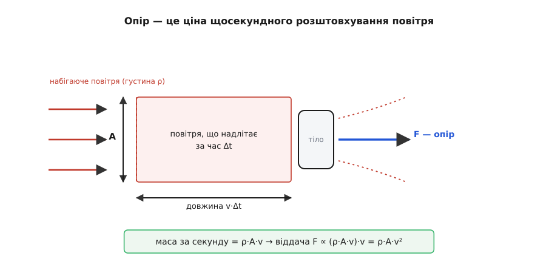
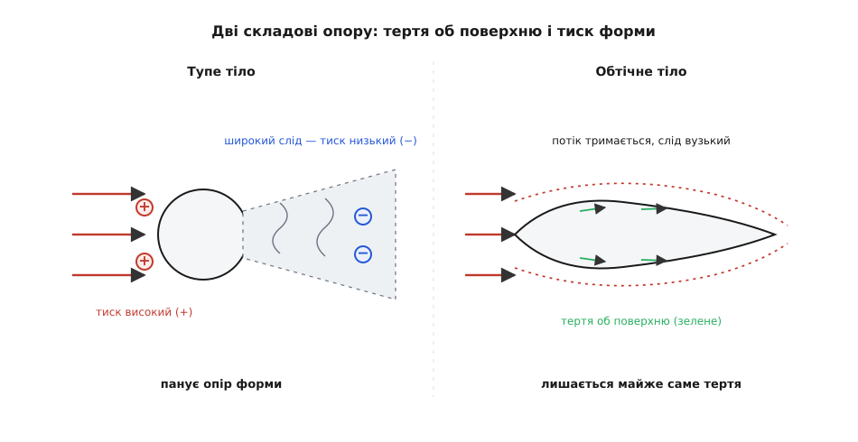
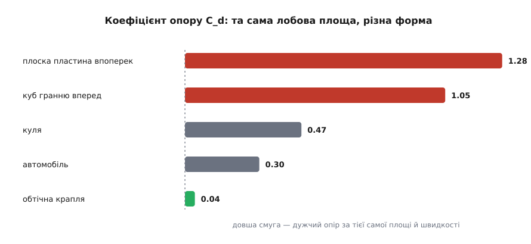
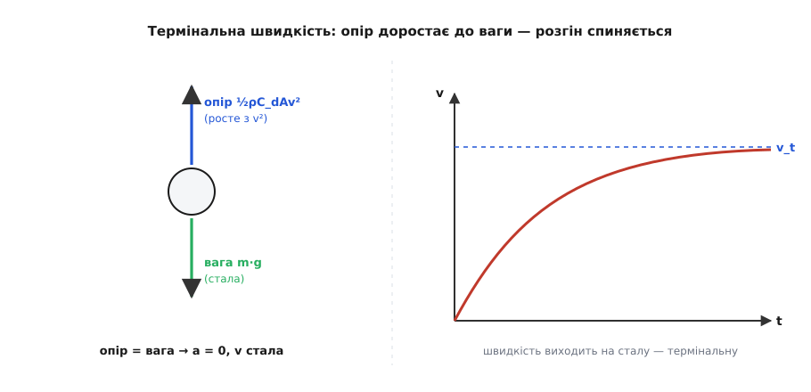

# Аеродинамічний опір (сила опору повітря)

<preknowlist>
- [Сила](topic:ph-mechanics/force) — штовхання чи тягнення, що змінює рух тіла; вектор із величиною й напрямком.
- [Другий закон Ньютона](topic:ph-mechanics/newtons-second-law) — сила = маса · прискорення (F = m·a); звідси випливе термінальна швидкість.
- [Швидкість](topic:ph-mechanics/velocity) — як швидко й куди рухається тіло (v).
- [Густина](topic:ph-mechanics/density) — маса одиниці об'єму речовини; для повітря ρ ≈ 1.2 кг/м³.
- [Динамічний тиск](topic:ph-mechanics/dynamic-pressure) — та частка тиску, що ховається в русі потоку, q = ½ρv²; це кістяк рівняння опору.
- [Число Рейнольдса](topic:ph-mechanics/reynolds-number) — відношення інерційних сил до в'язких, ρvL/μ; воно вирішує, який режим опору панує.
- [В'язкість](topic:ph-mechanics/viscosity) — внутрішнє тертя рідини чи газу (μ); від нього поверхневе тертя й прилипання повітря до стінки.
</preknowlist>

Висунь долоню з вікна авта на трасі — повітря б'є в неї, наче в невидиму пружну стіну, і що швидше їде авто, то дужче. Поверни долоню ребром — і тиск майже зникає. Те саме повітря, крізь яке ми ходимо, не помічаючи його зовсім, на швидкості перетворюється на відчутну перешкоду. Сила, з якою воно спротивляється всьому, що крізь нього мчить, і зветься **аеродинамічним опором** (гр. *aḗr* — повітря; лат. *resistere* — опиратися). Вона з'їдає більшу частину пального автівки на швидкості, ставить стелю кожному літаку й спиняє парашутиста на сталій швидкості замість того, щоб той розганявся без кінця. Це різновид тертя — тільки об рідину, а не об тверду поверхню, тож поводиться воно зовсім інакше, ніж звичне [тертя ковзання](topic:ph-mechanics/friction). Розберімо, звідки ця сила береться й від чого залежить.

## Звідки береться сила — тіло розштовхує повітря

Повітря лише здається порожнечею. Насправді це речовина: кубометр біля землі важить близько 1.2 кілограма. Рухаючись, тіло мусить прибрати це повітря зі свого шляху — розігнати його вбік, уперед, закрутити. А розігнати масу означає надати їй імпульсу, тобто прикласти силу. За третім законом Ньютона те повітря штовхає тіло назад із тією ж силою. Ось і весь опір: він не «тертя об ніщо», а ціна щосекундного розштовхування маси повітря.

Прикиньмо цю ціну на пальцях — і формула вилізе майже сама. Нехай тіло з лобовою площею (площею перерізу поперек руху) *A* мчить зі швидкістю *v*. За кожну секунду воно проходить відстань *v* і вимітає перед собою стовп повітря завдовжки *v* і перерізом *A*, тобто об'єм *A·v*. Маса цього повітря:

```
маса за секунду = ρ · A · v
```

Кожній такій порції тіло надає швидкості порядку самого *v* — відкидає її десь так само прудко, як летить саме. Сила ж — це наданий за секунду імпульс, тобто маса-за-секунду, помножена на надану швидкість:

```
F ~ (ρ · A · v) · v = ρ · A · v²
```

Отак із простого «скільки маси й як прудко» вигулькує головне: опір росте як **квадрат швидкості** й прямо пропорційний густині повітря та лобовій площі. Удвічі швидше — вчетверо дужчий опір. Це, звісно, не строге виведення (повітря не гальмує намертво, а обтікає тіло й закручується), але масштаб схоплено точно; [строгий вивід тієї самої формули через потік імпульсу з аналізом розмірностей](topic:ph-mechanics/aerodynamic-drag/math-drag-derivation.md) винесено окремо.


*Звідки береться опір: тіло щосекунди мусить прибрати з дороги стовп повітря масою ρ·A·v і надати йому швидкості порядку v. Наданий за секунду імпульс — це й є сила, яка виходить порядку ρ·A·v². Уся суть — у трьох множниках: густина, лобова площа й квадрат швидкості.*

## Рівняння опору

Щоб від «порядку величини» перейти до точного числа, у формулу вставляють два уточнення — і виходить робоче рівняння опору:

```
F_d = ½ · ρ · v² · C_d · A
```

Розберімо кожен множник, бо за кожним стоїть ясний фізичний сенс.

- **½·ρ·v²** — це [динамічний тиск q: та частка тиску, що схована в русі потоку](topic:ph-mechanics/dynamic-pressure). Це напір, який повітря тисло б на площадку, якби зупинити його намертво. Отже, опір — це, по суті, динамічний тиск, помножений на площу й на поправку форми.
- **A** — характерна площа, звичайно лобова: силует тіла, яким воно ловить набігаючий потік. (Для крила беруть не лобову, а площу самого крила згори — головне, щоб *C_d* міряли для тієї ж площі.)
- **C_d** — коефіцієнт опору (англ. *drag coefficient*), безрозмірне число, що вбирає все, чого груба прикидка не врахувала: як саме потік обтікає тіло, де відривається, який лишає слід. Куля, куб і крапля однакового перерізу мають зовсім різні *C_d*.

Множник ½ та коефіцієнт *C_d* удвох виправляють усе, що прикидка спростила: справжнє повітря не гальмує повністю, частину обтікає, частину закручує. Виміряти *C_d* наперед з чистої теорії для довільного тіла не вміють — його здобувають із досліду в аеродинамічній трубі або з розрахунку обтікання. Але щойно *C_d* відоме, рівняння дає силу опору для будь-якої швидкості й густини.

**Приклад: опір авта на трасі.** Легковик має лобову площу *A* ≈ 2.2 м², коефіцієнт опору *C_d* ≈ 0.30 і мчить зі швидкістю 30 м/с (108 км/год); густина повітря ρ = 1.225 кг/м³.

```
F_d = ½ · 1.225 · 30² · 0.30 · 2.2
    = ½ · 1.225 · 900 · 0.30 · 2.2
    ≈ 364 Н
```

Близько 364 ньютонів — це сила, з якою двигун мусить безперервно штовхати авто вперед лише проти повітря (плюс окремо тертя коліс). На міських 50 км/год ця сила вчетверо менша, а на 200 км/год — у сорок разів більша за міську. Ось чому опір повітря майже не турбує пішохода, але стає головним ворогом усього швидкого.

## Квадрат швидкості й куб потужності

У квадраті швидкості ховається ще один, різкіший, наслідок. Сила опору росте як *v²*, але **потужність**, потрібна, щоб цю силу долати, росте вже як *v³*. Причина проста: потужність — це сила, помножена на швидкість, а тут ростуть обидва множники разом:

```
P = F_d · v = ½ · ρ · C_d · A · v³
```

Удвічі швидше — увосьмеро більше потужності лише на опір повітря. Саме цей куб робить останні кілометри на годину такими шалено дорогими: щоб проїхати вдвічі швидше, двигунові треба ушестеро-увосьмеро більше сили в кінських силах.

**Приклад: потужність проти опору.** Те саме авто на 30 м/с проти 40 м/с.

```
P(30) = 364 Н · 30 м/с      ≈ 10.9 кВт
F(40) = ½·1.225·40²·0.30·2.2 ≈ 647 Н
P(40) = 647 Н · 40 м/с      ≈ 25.9 кВт
```

Приріст швидкості лише на третину (з 30 до 40 м/с) підняв потужнісний кошт майже в 2.4 раза — рівно як (40/30)³. Тому й кажуть, що аеродинаміка «оживає» на швидкості: до певної межі опір повітря — дрібниця, а за нею він раптом стає всім.

> 🔧 **Навіщо це.** Кубічний закон керує запасом ходу й витратою пального всього, що їздить і літає. Електромобіль на трасі втрачає далекобійність саме через нього: та сама батарея на 130 км/год везе помітно менше кілометрів, ніж на 90, — бо потужність на опір злетіла більш ніж удвічі. Велогонщик припадає до керма, вантажівки обростають обтічниками над кабіною, а розробник дрона рахує *C_d·A* корпусу, бо кожен зайвий відсоток опору на крейсерській швидкості прямо коротшає час польоту.

## Дві складові опору: тертя об шкіру й тиск форми

Тепер придивімося, з чого *C_d* насправді складається, — бо опір має два різні джерела, і в різних тіл переважає то одне, то друге.

Перше джерело — **поверхневе тертя** (англ. *skin friction*). Повітря [в'язке](topic:ph-mechanics/viscosity), тобто липке: прямо на стінці найтонший шар повітря наче прилипає й рухається разом із тілом, а трохи далі воно вже вільне. Між ними — тонкий [примежовий шар](topic:ph-mechanics/boundary-layer), де швидкість круто наростає від нуля до повної. Сусідні шари ковзають один об один, і це ковзання тягне тіло назад уздовж усієї змоченої поверхні. Таке тертя — головний опір довгих гладких тіл: крила, обшивки, корпусу.

Друге джерело — **опір форми**, або тиск (англ. *pressure drag*, *form drag*). Спереду тіло підпирає набігаюче повітря, і там тиск високий. Позаду ж, якщо потік не встигає плавно зімкнутися, лишається розріджений вихровий **слід** — область низького тиску. Різниця тисків між лобом і кормою тягне тіло назад. Це головний опір тупих тіл: цеглини, диска, кулі.

Ключ до опору форми — **відрив потоку**. Доки повітря тримається поверхні й плавно сходиться позаду тіла, тиск за кормою відновлюється й майже врівноважує передній підпір — опір форми виходить малий. (Саме тому в ідеальній рідині без в'язкості опір узагалі виходив рівно нуль — знаменитий парадокс д'Аламбера.) Але за тупим тілом примежовий шар не долає наростання тиску позаду, зривається з поверхні, і замість плавного змикання розкривається широкий турбулентний слід — та сама область розрідження, що смокче тіло назад.

Ось чому **обтічна форма** — крапля, витягнута назад у гострий хвіст, — така важлива. Вона дає потокові плавно зійтися, відсуває відрив до самої корми й звужує слід майже до нуля. Обтічне тіло може мати опір разів у десять менший за кулю того самого перерізу — і саме за це природа виточила таку форму рибам, а інженери — крилам і фюзеляжам.


*Дві складові опору. За тупим тілом потік зривається зарано, розкриваючи широкий слід розрідження, — це опір форми, і він величезний. Обтічне тіло дає потокові плавно зімкнутися; слід звужується, тиск ззаду майже відновлюється, і лишається переважно тертя об поверхню. Та сама лобова площа, а опір — у рази різний.*

Наскільки різняться тіла — видно з їхніх коефіцієнтів опору (для звичного діапазону швидкостей):

```
плоска пластина впоперек   C_d ≈ 1.28
куб гранню вперед          C_d ≈ 1.05
куля                       C_d ≈ 0.47
сучасний автомобіль        C_d ≈ 0.25–0.30
обтічна крапля             C_d ≈ 0.04
```

Крапля з гострим хвостом обтічніша за кулю разів у десять, хоча переріз у них однаковий. Уся різниця — у сліді: у кулі він широкий, у краплі його майже немає.


*Коефіцієнт опору різних тіл за однакової лобової площі. Тупі тіла з широким слідом мають C_d близько одиниці й вище; обтічна крапля — у десятки разів менше. Форма важить не менше за розмір: вужчий слід коштує дешевше за будь-яке зменшення перерізу.*

## Опір не завжди росте як квадрат: два режими

Наша прикидка *F* ∝ *v²* мовчки припускала, що головне тут — інерція повітря, тобто розштовхування маси. Для звичних тіл і швидкостей так і є. Але для дуже дрібних тіл, дуже малих швидкостей чи дуже густої рідини головним стає вже не інерція, а сама в'язкість — липкість рідини. Тоді опір росте не як квадрат, а прямо пропорційно швидкості: пилинка, що поволі осідає в повітрі, чи кулька, що тоне в меду, відчувають опір ∝ *v* (це закон Стокса, *F* = 6π·μ·*R*·*v*).

Який режим панує, вирішує одне безрозмірне число — [число Рейнольдса Re: відношення інерційних сил до в'язких](topic:ph-mechanics/reynolds-number). Мале *Re* (дрібне, повільне, густе-липке) — в'язкий режим, опір лінійний по *v*. Велике *Re* — усе звичне: авто, м'яч, літак, людина — інерційний режим, опір квадратичний, і саме там працює рівняння ½·ρ·*C_d*·*A*·*v²*.

Звідси важливий наслідок: **C_d не є сталою** — воно залежить від *Re*. Для кулі, скажімо, коефіцієнт опору поволі сповзає з великих значень на малих *Re* до звичних ≈0.47 у широкому «буденному» діапазоні. А тоді стається дещо геть несподіване.

## Дивина: шорсткість, що зменшує опір

На певному, досить великому *Re* з кулею коїться контрінтуїтивне: її *C_d* раптом провалюється — приблизно з 0.5 до 0.1, у кілька разів за невеликої зміни швидкості. Це явище звуть **кризою опору** (англ. *drag crisis*). Причина — у примежовому шарі. Доти він був гладкий (ламінарний) і зривався з кулі рано, лишаючи широкий слід. За критичним *Re* цей шар скипає в турбулентний — а турбулентний шар чіпкіший: він безперервно підмішує до себе прудке повітря ззовні, тримається поверхні довше, відривається пізніше, і слід звужується. Вужчий слід — менший опір форми, тож повний опір падає, хоча швидкість зросла.

Ось де ховається розгадка ямок на м'ячі для гольфа. Швидкості удару не вистачає, щоб гладка куля сама доскочила критичного *Re*. Тож м'яч роблять шорстким **навмисне**: ямки завчасно збурюють примежовий шар у турбулентний, він тримається довше, слід звужується, і опір форми падає майже вдвічі — м'яч летить майже вдвічі далі за гладкий. Шорсткість, що зменшує опір, — не парадокс, а точний розрахунок: вона купує вужчий слід ціною трохи більшого поверхневого тертя, і для тупого тіла це вигідний обмін.

Уся ця історія — від Ньютонового «удару частинок» через парадокс д'Аламбера (в ідеальній рідині опір чомусь виходив рівно нуль) до Прандтлевого примежового шару, що нарешті все пояснив, і суперечки про кризу опору кулі — [зібрана окремо](topic:ph-mechanics/aerodynamic-drag/hist-drag-theory.md).

## Термінальна швидкість: коли опір зрівнює вагу

Найяскравіший наслідок квадратичного опору — те, що падіння в повітрі не розганяється без кінця. У [вільному падінні](topic:ph-mechanics/free-fall) без повітря швидкість росла б довіку. Але опір росте з *v²*: що прудкіше падає тіло, то дужче повітря штовхає вгору. Рано чи пізно опір доростає рівно до ваги — і тоді сумарна сила стає нуль, прискорення нуль, а швидкість застигає. Цю сталу швидкість звуть **термінальною** (лат. *terminus* — межа).

Прирівняймо опір до ваги й дістанемо її просто з рівноваги:

```
½ · ρ · C_d · A · v_t² = m · g
v_t = √( 2·m·g / (ρ · C_d · A) )
```


*Народження термінальної швидкості. Вага стала, а опір наздоганяє її знизу, бо росте з v². Тільки-но вони зрівняються, сумарна сила зникає — і швидкість завмирає на v_t, скільки б тіло не падало далі.*

**Приклад: термінальна швидкість парашутиста.** Людина масою *m* ≈ 80 кг у позі «пластом» має лобову площу *A* ≈ 0.5 м² і *C_d* ≈ 1.0; густина повітря ρ = 1.2 кг/м³.

```
v_t = √( 2 · 80 · 9.81 / (1.2 · 1.0 · 0.5) )
    = √( 1570 / 0.60 )
    = √2616
    ≈ 51 м/с   (≈ 184 км/год)
```

Близько 51 метра за секунду — далі парашутист не розганяється, хоч би скільки летів. Розкриє купол — і лобова площа підскочить у десятки разів; за формулою *v_t* спадає як корінь із *A*, тож із 0.5 м² до ~25 м² швидкість падає разів у сім, до кількох метрів за секунду, і приземлення стає безпечним. Той самий корінь пояснює, чому пір'їнка чи пилинка (величезна площа на крихітну масу) осідають ледь-ледь, а важка компактна кулька падає прудко: термінальна швидкість тим менша, чим більша площа на одиницю ваги.

Як саме тіло виходить на цю швидкість у часі — і як опір коротшає й перекошує [балістичну траєкторію](topic:ph-mechanics/projectile-motion) кинутого тіла — показано робочим кодом у [чисельній моделі польоту з опором](topic:ph-mechanics/aerodynamic-drag/proj-drag-trajectory.md).

> 🔧 **Навіщо це.** На термінальній швидкості стоїть уся техніка м'якого приземлення. Розмір гальмівного й основного парашутів рахують просто з тієї формули: задають безпечну швидкість дотику до землі й підбирають площу *A*, що її дає. Так само скидають вантаж із дрона на маленькому парашутику, гальмують спускові апарати в атмосфері й пояснюють, чому дрібні комахи й гризуни переживають падіння з будь-якої висоти — їхня термінальна швидкість надто мала, щоб забитися.

Рівняння ½·ρ·*C_d*·*A*·*v²* — робочий кінь для звичних швидкостей, але й воно має межі. Коли тіло наближається до швидкості звуку, повітря вже не встигає розступатися, ущільнюється попереду, і додається зовсім інший, **хвильовий** опір — *C_d* біля-звукових швидкостей різко скипає, і проста формула зі сталим коефіцієнтом там уже бреше. А в крила є ще й свій особливий доданок: сама [піднімальна сила](topic:ph-mechanics/fixed-wing-lift) народжується коштом відхилення повітря вниз, і за це крило платить **індуктивним опором**, що входить в [аеродинамічну якість L/D](topic:ph-mechanics/lift-to-drag-ratio). Та це вже інші історії — основу ж усього опору повітря на звичних швидкостях тримають три речі: густина, лобова площа й квадрат швидкості.
