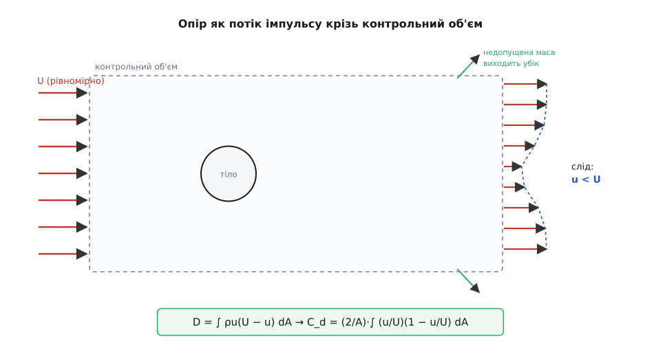
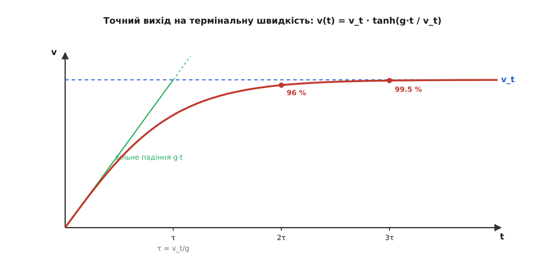

# 🧮 Строгий апарат опору: потік імпульсу, π-теорема, Стокс і tanh

Прикидка «на пальцях» дала кістяк — *F* ∝ ρ*Av²* — і схопила масштаб точно. Але вона лишила по собі чотири законні борги. Звідки береться множник ½ і чому *C_d* сидить саме перед ρ*v²A*, а не десь інде? Чому *C_d* — узагалі число, а не ще одна прихована функція швидкості й розміру, і чому воно все ж таки поволі повзе? Куди дівається квадрат швидкості для пилинки, що осідає в повітрі лінійно? І, нарешті, як саме тіло виходить на термінальну швидкість — не «врешті виходить», а за яким законом у часі? Кожен борг закриває свій апарат: потік імпульсу крізь контрольний об'єм заробляє формулу чесно; аналіз розмірностей доводить, що *C_d* мусить залежати від двох безрозмірних чисел; закон Стокса дістає той інший, лінійний опір із самих рівнянь; а звичайне диференціальне рівняння падіння розв'язується точно через гіперболічний тангенс. Розберімо все чотири.

## Опір як потік імпульсу крізь контрольний об'єм

Груба оцінка казала: тіло «вимітає» стовп повітря й надає йому швидкості порядку *v*. Це майже правда, але слово «порядку» ховає всю неточність. Зробімо те саме строго — і тоді нічого прикидати не доведеться.

Дамо опору точне означення, від якого не відкрутишся: **сила опору дорівнює швидкості, з якою тіло забирає в потоку поздовжній імпульс**. Це прямий [другий закон Ньютона](root:ph-mechanics/newtons-second-law), тільки записаний не для тіла, а для рідини: тіло діє на потік із силою −*D* (гальмує його), потік за [третім законом](root:ph-mechanics/newtons-third-law) діє на тіло з рівною силою *D* уперед. А сила на рідину — це темп зміни її [імпульсу](root:ph-mechanics/momentum). Лишається порахувати цей темп, не заглядаючи в дрібні подробиці обтікання.

Хитрість — у виборі рахунку. Обведімо тіло уявною коробкою (контрольним об'ємом) із площею перерізу *A_к*, досить великою, щоб її стінки лежали далеко в незбуреному потоці. Течія стала (усталена) і поки що нестислива. Для сталої течії темп зміни імпульсу всередині коробки нульовий — отже, сума сил на рідину в коробці дорівнює **чистому виносу імпульсу крізь її стінки**: скільки поздовжнього імпульсу за секунду витекло назовні мінус скільки втекло всередину.

Порахуймо цей винос. Крізь передню грань повітря входить рівно зі швидкістю набігання *U*: приносить масу за секунду ρ*U·A_к* й поздовжній імпульс ρ*U²·A_к*. Крізь задню грань воно виходить уже гальмованим — у сліді за тілом швидкість *u*(*y*,*z*) менша за *U*. А ще частина маси, яку слід «недопустив» назад, мусить вибочити крізь бічні грані. Зведімо два закони — маси й імпульсу.

```
маса за секунду:     вхід  ρU·A_к  =  вихід ззаду ∫ρu dA  +  вихід убік ṁ_бік
                     →  ṁ_бік = ρU·A_к − ∫ρu dA        (дефіцит іде вбік)

імпульс за секунду:  вихід − вхід = −D
   [ ∫ρu² dA  +  U·ṁ_бік ]  −  ρU²·A_к  =  −D
```

Бічна маса далеко від тіла ще несе поздовжню швидкість *U*, тому її імпульс — це *U·ṁ_бік*. Підставмо сюди дефіцит *ṁ_бік* і дивімося, як більшість доданків самознищується:

```
∫ρu² dA + U·(ρU·A_к − ∫ρu dA) − ρU²·A_к = −D
∫ρu² dA + ρU²·A_к − U∫ρu dA − ρU²·A_к = −D
∫ρu² dA − U∫ρu dA = −D
```

Член ρ*U²·A_к* — увесь «фоновий» імпульс потоку — випав начисто. Лишається різниця двох інтегралів по сліду, і, перевернувши знак, дістаємо чисту, точну формулу опору:

```
D = ∫ ρu(U − u) dA          (інтеграл по площині сліду за тілом)
```

> 🔧 **Навіщо це.** Ця рівність — не теоретична забаганка, а робочий метод виміру опору. Замість того щоб зважувати силу на моделі, аеродинамік проводить гребінку давачів упоперек сліду за тілом, міряє профіль швидкості *u*(*y*,*z*) й бере цей інтеграл — так званий **промір сліду**. Опір читається прямо з того, наскільки й на якій площі повітря позаду недорахувало швидкості. Тіло, за яким потік вирівнявся до *U* (немає дефіциту), опору не має зовсім; чим глибша і ширша яма швидкості в сліді, тим дужчий опір.

Тепер видно родовід рівняння опору. Винесімо з інтеграла масштаби — густину, квадрат швидкості й площу — і те, що лишиться, за побудовою безрозмірне:

```
D = ∫ρu(U−u) dA = ½ρU²·A · [ (2/A) ∫ (u/U)(1 − u/U) dA ]
                    └───┬────┘   └──────────────┬─────────────┘
                    динамічний          це і є C_d
                    напір × площа   (нормований профіль сліду)
```

Ось звідки половина й ось що таке *C_d* насправді: **коефіцієнт опору — це нормований інтеграл дефіциту імпульсу в сліді**, а не підгінний множник із досліду. Множник ½ прийшов разом із [динамічним тиском ½ρU²](root:ph-mechanics/dynamic-pressure), який тут не вставили руками, а витягли з інтеграла. І одразу ясно, чому в тупих тіл *C_d* близький до одиниці: підінтегральний профіль (*u*/*U*)(1−*u*/*U*) досягає найбільшого значення ¼ там, де в сліді *u* = *U*/2, тож нормований інтеграл сам собою виходить порядку одиниці. *C_d* ≈ 1 для цеглини — не випадковість, а геометрія ями швидкості за нею.


*Опір як потік імпульсу. Рівномірний вхід ρU²A_к на передній грані точно гаситься фоновим виносом, і від балансу лишається тільки інтеграл дефіциту швидкості в сліді. Тому опір — це буквально імпульс, недорахований потоком позаду тіла, а C_d — форма тієї ями, поділена на динамічний напір.*

## Чому C_d — функція Re й Маха, а не стала

Інтеграл сліду заробив формулу, але лишив *C_d* залежним від профілю швидкості, а той профіль ми наперед не знаємо. Питання переставляється так: від чого взагалі має право залежати *C_d*? На нього відповідає не гідродинаміка, а чистий рахунок розмірностей — [аналіз розмірностей](root:math-numeric/dimensional-analysis) і його **π-теорема**.

Логіка теореми проста й невблаганна. Якщо фізична величина складається з *n* розмірних величин, а всі вони збудовані з *k* незалежних одиниць (тут — маса M, довжина L, час T), то зв'язок між ними зводиться до співвідношення всього *n* − *k* **безрозмірних** комбінацій. Природа не знає ні кілограма, ні метра — вона знає лише їхні чисті відношення, і саме стільки їх, скільки лишається після того, як розмірності поглинули *k* величин.

Від чого може залежати сила опору *D*? Складімо чесний список: густина ρ (інерція повітря), швидкість *v*, розмір тіла *L*, [в'язкість μ](root:ph-mechanics/viscosity) (внутрішнє тертя) і — коли повітря починає стискатися — швидкість звуку *a*. Разом *D* та п'ять аргументів, *n* = 6 величин на *k* = 3 одиниці. Випишімо їхні розмірності стовпчиками:

```
        D     ρ     v     L     μ     a
   M    1     1     0     0     1     0
   L    1    −3     1     1    −1     1
   T   −2     0    −1     0    −1    −1
```

π-теорема обіцяє 6 − 3 = **три** безрозмірні групи. Зберімо їх. Перша: скомбінуймо *D* з ρ, *v*, *L* так, щоб маса, довжина й час скоротилися:

```
       D              M·L·T⁻²
π₁ = ────────  =  ──────────────────────  =  1     (безрозмірна ✓)
      ρ v² L²      (M·L⁻³)(L²T⁻²)(L²)
```

Це *D*/(ρ*v²L²*); з *A* ∝ *L²* і звичним половинним нормуванням це і є **коефіцієнт опору** *C_d* = *D*/(½ρ*v²A*). Друга група — в'язкість проти інерції:

```
       ρ v L
π₂ = ────────  =  Re        (число Рейнольдса)
        μ
```

Третя — швидкість проти швидкості звуку:

```
       v
π₃ = ─────  =  M            (число Маха)
       a
```

Більше незалежних комбінацій немає — теорема каже, що трьох досить. А отже, увесь зв'язок між шістьма величинами стискається до однієї функції трьох чисел:

```
C_d = f(Re, M)
```

Ось строга відповідь на питання, чому *C_d* **не стала**. Вона й не могла бути сталою: розмірність не лишає їй іншого вибору, ніж залежати від [числа Рейнольдса](root:ph-mechanics/reynolds-number) й числа Маха — двох безрозмірних облич задачі. Поки тіло рухається куди повільніше за звук, *M* мале й на *C_d* майже не впливає — лишається залежність від самого Re, ту саму єдину криву «*C_d* проти Re», що накриває всі рідини, розміри й швидкості. Коли тіло розганяється до навколозвукових швидкостей, оживає *M*: повітря вже не встигає розступатися, ущільнюється попереду, і *C_d* різко скипає — з'являється хвильовий опір. Той самий висновок дає й строге знерозмірнення рівняння руху рідини: у [виведенні числа Рейнольдса](root:ph-mechanics/reynolds-number/math-reynolds-derivation.md) видно, як усе поле течії керується єдиним Re, а звідки береться число Маха разом зі стисливим гальмуванням — у [виведенні рівняння Бернуллі](root:ph-mechanics/dynamic-pressure/math-bernoulli-derivation.md). π-теорема не заміняє ці рівняння — вона наперед, з самих одиниць виміру, каже, скільки ручок керма в задачі й що на них написано.

Один чесний штрих до історії самої теореми, бо ім'я тут одне, а рук було кілька. Загальне формулювання π-теореми першим дав француз Еме Вашʼї (Aimé Vaschy) 1892 року; незалежно його переоткрили 1911-го Афанасій Федерман і Дмитро Рябушинський, а широко відомим воно стало з праці американця Едгара Букінгема 1914 року — саме він увів символ «π» для безрозмірних груп, від якого й пішла назва. Сам Букінгем у пізніших роботах визнавав першість за попередниками. Тобто «Букінгемова» — це про зручну назву й позначення, а не про одноосібне відкриття; це усталений історичний факт.

## В'язкий режим: закон Стокса й межа переходу

Крива *C_d*(Re) обіцяна, але один її кінець ховає окрему фізику, гідну власного виведення, — область дуже малих Re, де опір раптом стає **лінійним** по швидкості. Тут прихований другий закон опору, і дістати його можна майже без обчислень — самими розмірностями, якщо правильно спитати.

Мале Re означає, що інерція повітря знікчемніла проти в'язкості: розштовхувати масу вже не треба, головне — продертися крізь липкість. А отже, у законі сили **зникає густина ρ** — вона ж була мірою інерції, а інерції тут нема. Лишаються тільки три величини, від яких може залежати сила на кульці: в'язкість μ, швидкість *v* і розмір *R*. Спитаймо розмірність, яка їхня комбінація дає силу:

```
F = μ^α · v^β · R^γ
[F] = (M L⁻¹ T⁻¹)^α (L T⁻¹)^β (L)^γ  =  M L T⁻²

M:   α = 1
T:  −α − β = −2   →   β = 1
L:  −α + β + γ = 1  →  −1 + 1 + γ = 1  →  γ = 1

F ∝ μ · v · R          (єдина можлива комбінація!)
```

Розмірність не лишає варіантів: щойно ρ випала, сила **мусить** бути лінійна по *v* й пропорційна μ*R*. Уся хитра гідродинаміка може дати хіба безрозмірний числовий множник попереду — а самий вигляд закону вже вирішено. І глибша причина тієї лінійності теж ясна: коли інерція зникає, рівняння руху рідини стає лінійним за швидкістю (пропадає квадратичний інерційний член), тож і сила може бути лише в першій степені *v*. Квадрат брався саме з інерції ρ*v²*; нема інерції — нема квадрата.

Числовий множник знайшов [Джордж Ґабріел Стокс](root:ph-mechanics/viscosity) — ірландський математик — 1851 року, розв'язавши рівняння повзкої течії навколо кулі (він робив це, вивчаючи, як повітря гальмує хитання маятника). Множник виявився 6π:

```
F = 6π · μ · R · v          (закон Стокса, куля, Re ≪ 1)
```

Тепер зшиймо цей лінійний закон із квадратичним ½ρ*C_dAv²* — і виявиться, що це один закон, а не два. Підставмо Стоксову силу в означення *C_d* для кулі (лобова площа *A* = π*R²*, а Re беремо за діаметром *d* = 2*R*):

```
        F            6π μ R v            24 μ           24
C_d = ────────  =  ──────────────  =  ─────────  =  ─────
      ½ρv²A         ½ρv²·πR²           ρ v (2R)        Re
```

Ось разюча зв'язка: у в'язкому режимі *C_d* = **24/Re**. Це та сама функція *f*(Re) з π-теореми, лише в її лівому куті. Квадратична формула ½ρ*C_dAv²* із таким *C_d* точно відтворює Стокса — перевірмо, підставивши 24/Re назад:

```
½ρv²·πR² · (24/Re) = ½ρv²·πR² · 24μ/(ρv·2R) = 6π μ R v   ✓
```

Розгадка «двох режимів» звідси прозора. Опір **завжди** дається одним виразом ½ρ*C_dAv²*, тільки *C_d* — не стала, а функція Re. Там, де *C_d* сповзає як 24/Re, множник 1/Re = μ/(ρ*vL*) вносить у формулу зайвий 1/*v*, і *v²* обертається на *v* — лінійний, Стоксів опір. Там, де *C_d* виходить на поличку сталого значення, лишається чистий *v²*. Один закон, дві його межі, а перемикач між ними — число Рейнольдса.


*Єдина крива C_d(Re) для кулі. У в'язкому куті (малі Re) панує пряма Стокса 24/Re — на логарифмічних осях це рівна лінія зі спадом −1, і саме вона робить опір лінійним по швидкості. Далі крива згинається на «ньютонівську» поличку C_d ≈ 0.4–0.5, де опір квадратичний, а коло Re ≈ 3·10⁵ провалюється — це криза опору. Одне число Re пробігає всю картину зліва направо.*

Де ж проходить межа двох режимів? Там, де інерційний опір і в'язкий зрівнюються. Їхнє відношення — це буквально ρ*vL*/μ = Re: інерційний масштаб сили ρ*v²L²* поділити на в'язкий μ*vL* дає рівно Re. Отже, при **Re ≈ 1** обидва внески одного порядку; нижче панує Стокс (лінійний), вище — інерція (квадратичний). Мале, повільне, у густо-липкому середовищі сидить у Стоксовому куті; усе звичне — м'яч, авто, людина, літак — живе далеко праворуч, де опір квадратичний.

**Приклад: осідання туманної краплинки.** Крапля води радіусом *R* = 10 мкм = 1·10⁻⁵ м осідає в повітрі (ρ = 1.2 кг/м³, μ = 1.8·10⁻⁵ Па·с, густина води ρ_в = 1000 кг/м³). У Стоксовому режимі термінальна швидкість береться з рівноваги ваги й лінійного опору 6πμ*Rv* = *mg*, де *m* = ρ_в·(4/3)π*R³*:

```
v_t = (2/9) · ρ_в g R² / μ
    = (2/9) · 1000 · 9.81 · (1·10⁻⁵)² / (1.8·10⁻⁵)
    = (2/9) · 1000 · 9.81 · 1·10⁻¹⁰ / (1.8·10⁻⁵)
    ≈ 0.012 м/с   (≈ 1.2 см/с)
```

Перевірмо, що ми справді у в'язкому куті, — порахуймо Re за діаметром:

```
Re = ρ v_t (2R) / μ = 1.2 · 0.012 · 2·10⁻⁵ / 1.8·10⁻⁵ ≈ 0.016  ≪ 1   ✓
```

Re ≈ 0.016 — глибоко в Стоксовій області, лінійний закон законний. Ось чому туман і пил осідають так повільно й лінійно: для них повітря — густий в'язкий клей, а не пружна стіна, і квадратичне ½ρ*C_dAv²* тут дало б безглуздя. Та сама причина тримає в повітрі хмару: краплинки радіусом кілька мікрон падають зі швидкістю кілька сантиметрів на секунду, і найслабший висхідний потік їх підважує.

## Рівняння руху й точний вихід на v_t через tanh

Лишився останній борг — час. Термінальну швидкість легко дістати з рівноваги (опір доріс до ваги, прискорення нуль), але рівновага мовчить про те, **як** тіло до неї доходить. Це вже не алгебра, а рух — тож запишімо повний [другий закон Ньютона](root:ph-mechanics/newtons-second-law) для падіння в квадратичному режимі, узявши напрям вниз за додатний:

```
m · dv/dt = mg − ½ρC_dA·v²
```

Це нелінійне диференціальне рівняння (швидкість входить у квадраті), але воно розв'язується точно. Згорнімо сталі в одну літеру, *k* = ½ρ*C_dA*, щоб опір був просто *kv²*. Тоді термінальна швидкість — це та, за якої права частина нуль:

```
mg = k·v_t²      →      v_t = √(mg/k) = √( 2mg / (ρC_dA) )
```

Тепер головний трюк, після якого все складається. Оскільки *mg* = *k·v_t²*, праву частину можна переписати як різницю квадратів:

```
m · dv/dt = mg − kv² = k·(v_t² − v²)
```

Змінні розділяються — швидкість наліво, час направо:

```
    dv           k
─────────  =  ─── dt
 v_t² − v²      m
```

Ліворуч стоїть табличний [інтеграл](root:math-analysis/integral): ∫d*v*/(*v_t²* − *v²*) = (1/*v_t*)·artanh(*v*/*v_t*) — і сама поява оберненого гіперболічного тангенса тут не випадкова, а неминуча, бо це первісна саме такого дробу. Проінтегруймо від старту (тіло відпустили зі спокою, *v* = 0 при *t* = 0):

```
(1/v_t) · artanh(v/v_t) = (k/m) · t
```

Розв'яжімо щодо *v*, взявши tanh від обох боків. Аргумент спрощується красиво: *k·v_t*/*m* = *k·v_t²*/(*m·v_t*) = *mg*/(*m·v_t*) = *g*/*v_t*. Отже:

```
v(t) = v_t · tanh( g·t / v_t )
```

Ось точний закон розгону в опорі, і кращого годі бажати. Уся динаміка падіння сидить в одному гіперболічному тангенсі з єдиним характерним часом:

```
τ = v_t / g          (час виходу на термінальну швидкість)
```

Перевірмо його на двох кінцях — і він розповість усю історію падіння. На самому початку, поки *t* мале, аргумент *g·t*/*v_t* дрібний, а tanh малого аргументу дорівнює самому аргументу ([розклад у ряд](root:math-analysis/taylor-series): tanh *x* ≈ *x*):

```
v ≈ v_t · (g·t / v_t) = g·t          (мале t — чисте вільне падіння)
```

Опір іще не встиг прокинутися — тіло падає рівно за законом [вільного падіння](root:ph-mechanics/free-fall) *v* = *gt*. А коли *t* росте, tanh прямує до одиниці, і швидкість застигає:

```
v → v_t          (велике t — термінальна швидкість)
```

Між цими двома краями tanh плавно згинає пряму вільного падіння в горизонтальну асимптоту. Проінтегрувавши швидкість іще раз, дістанемо й пройдений шлях — через логарифм гіперболічного косинуса:

```
x(t) = (v_t² / g) · ln cosh( g·t / v_t )
```


*Точний вихід на термінальну швидкість. Спочатку крива лягає на пряму вільного падіння gt — опір іще нікчемний. Гіперболічний тангенс згинає її й притискає до асимптоти v_t за характерний час τ = v_t/g: за 2τ швидкість сягає 96 % термінальної, за 3τ — 99.5 %. Так квадратичний опір перетворює нескінченний розгін вільного падіння на швидке насичення.*

**Приклад: скільки падає парашутист до термінальної швидкості.** Візьмімо ту саму людину в позі «пластом», що виходить на *v_t* ≈ 51 м/с. Характерний час:

```
τ = v_t / g = 51 / 9.81 ≈ 5.2 с
```

За скільки вона фактично «доходить»? Оскільки tanh 2 = 0.964, за *t* = 2τ ≈ 10.4 с швидкість — уже 96 % термінальної. Пройдений за цей час шлях:

```
x(2τ) = (v_t²/g) · ln cosh(2) = (51²/9.81) · ln(3.76) ≈ 265 · 1.32 ≈ 350 м
```

Тобто парашутист розганяється до практично сталої швидкості приблизно за 10 секунд і 350 метрів вільного польоту — далі летить рівномірно, скільки б висоти не лишалося. Це збігається з тим, що знають самі парашутисти: усталена швидкість настає на десятій-дванадцятій секунді після відділення. Формула не просто дає число *v_t* — вона дає й розклад падіння в часі, а отже, і скільки треба висоти, щоб той розгін узагалі встиг статися.

Один додаток, коли тіло входить у повітря не зі спокою, а вже швидким — скажімо, [кинуте вниз](root:ph-mechanics/projectile-motion) прудкіше за *v_t*. Тоді опір із самого початку більший за вагу, тіло **гальмує** до *v_t* згори, і замість tanh у розв'язку стоїть його родич — гіперболічний котангенс coth, що спадає до тієї самої асимптоти. Але межа одна: хоч знизу, хоч згори, рух збігається до *v_t*, бо саме там сумарна сила нуль. Термінальна швидкість — це стійка рівновага, до якої падіння тягнеться з будь-якого боку.

## Один каркас, чотири інструменти

Чотири борги закрито, і за ними проступив один каркас. Потік імпульсу крізь контрольний об'єм заробив формулу ½ρ*C_dAv²* із самого другого закону Ньютона й показав, що *C_d* — це нормована яма швидкості в сліді, а не підгінне число. Аналіз розмірностей довів, що ця *C_d* мусить бути функцією Re й Маха — тому вона й не стала. Закон Стокса дістав із в'язкого кута другий, лінійний закон опору — не окремий закон природи, а ту саму формулу з *C_d* = 24/Re. А диференціальне рівняння падіння розв'язалося точно через tanh, обернувши нескінченний розгін вільного падіння на швидке насичення за час τ = *v_t*/*g*. Прикидка «на пальцях» дала кістяк; строгий апарат нарощує на нього м'язи — і, головне, показує, де саме кожне спрощення має право впасти.
