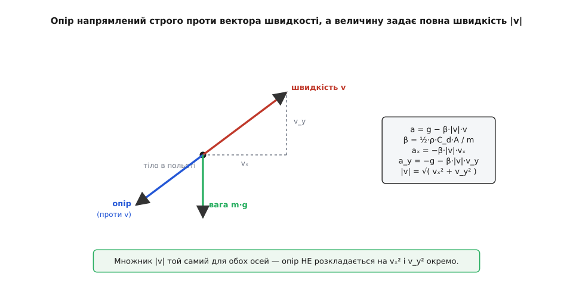
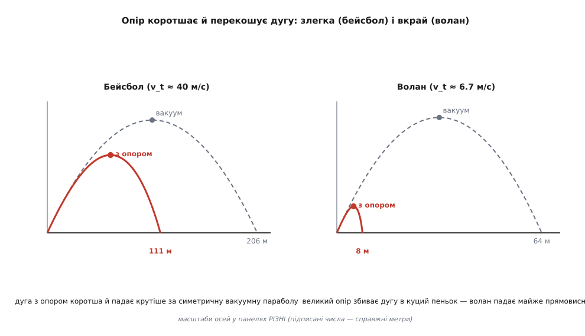
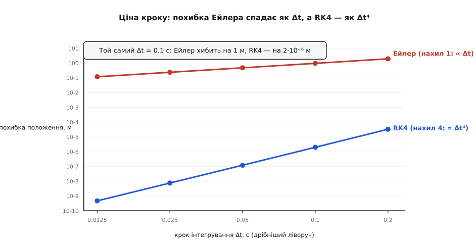

# ⚙️ Балістична дуга з опором: політ у двох вимірах, крок за кроком

Кинутий у порожнечі камінь — один із небагатьох рухів, який фізика віддає тобі повністю розв'язаним. Горизонталь і вертикаль там не заважають одна одній: по горизонталі тіло пливе рівномірно, по вертикалі падає з рівним прискоренням, і з двох незалежних рухів складається чиста симетрична парабола. Кинь тіло під кутом θ зі швидкістю v₀ — і [балістична дуга без опору](topic:ph-mechanics/projectile-motion) має готові формули: дальність v₀²·sin(2θ)/g, найдальший кидок під рівно 45°, тіло падає з тією ж швидкістю й під тим самим кутом, під якими злетіло. Нічого інтегрувати не треба — усе видно з двох окремих рівнянь.

Додай повітря — і ця розкіш зникає миттєво. Опір чіпляється за швидкість, а швидкість — двовимірна, тож горизонталь і вертикаль більше не незалежні: гальмуючи одну, опір мимоволі торкається другої. Короткої формули для дуги з опором **не існує взагалі** — її не виписати елементарними функціями. Лишається єдиний чесний шлях: не розв'язувати рівняння «раз і назавжди», а дрібно крокувати політ уперед, від миті до миті, поки тіло не впаде. Той самий крок, яким рахують спуск ракети, приціл артилерії чи траєкторію дрона, — і той самий, яким ми зараз на очах побачимо дві речі: як падаюче тіло виходить на сталу швидкість і як опір **коротшає та перекошує** кинуту дугу проти її вакуумного двійника.

Наскрізний приклад візьмемо відчутний — бейсбольний м'яч, добряче відбитий: маса *m* = 0.145 кг, діаметр 73 мм (лобова площа *A* ≈ 4.19·10⁻³ м²), коефіцієнт опору *C_d* ≈ 0.35 (типове значення для м'яча, що крутиться — виміряне в дослідах). Пустимо його зі швидкістю 45 м/с (162 км/год, добрий хоумран) під кутом 45°. Вакуумна формула обіцяє дальність v₀²/g = 45²/9.81 ≈ 206 метрів. Жоден м'яч так далеко не летить — справжній хоумран удвічі коротший. Куди дівається половина поля, покаже код.

## Ідея: не розбивай вектор на осі

Уся хитрість — правильно записати опір, і тут криється пастка, у яку легко впасти. Опір напрямлений **проти вектора швидкості** — не проти горизонталі, не проти вертикалі, а точно назустріч тому напрямку, куди тіло цієї миті летить. Його величина — знайоме ½·ρ·*C_d*·*A*·*v*², де *v* = |**v**| — це **повна** швидкість, довжина вектора, а не котрась із осей. Складаючи напрям і величину в один вектор сили, дістаємо:

```
        →              →     →
m · dv/dt = m·g − ½·ρ·C_d·A·|v|·v
```

Множник |**v**|·**v** робить рівно те, що треба: його довжина — |**v**|·|**v**| = *v*², а напрям — уздовж **v**, тож зі знаком «мінус» сила лягає точно проти руху. Поділивши на масу й позначивши β = ½·ρ·*C_d*·*A*/*m*, дістаємо прискорення як функцію самої швидкості:

```
→   →      →   →              →
a = g − β·|v|·v ,     g = (0, −g)
```

А тепер — головне, заради чого варто дивитися на вектори, а не на осі окремо. Розпишімо це покомпонентно:

```
aₓ = −β·|v|·vₓ
a_y = −g − β·|v|·v_y ,     |v| = √( vₓ² + v_y² )
```

Придивися: у прискорення **обох** осей входить **той самий** множник |**v**| = √(vₓ² + v_y²). Опір по горизонталі залежить не лише від vₓ, а від повної швидкості; опір по вертикалі — теж. Осі **зчеплені** через спільну довжину вектора. Ось де вмирає вакуумна простота: там рухи розчіплювалися, і кожну вісь можна було розв'язати нарізно; тут опір їх зшиває, і нарізно вже нічого не виходить. Це не технічна дрібниця, а сама причина, чому короткої формули немає й чому доводиться крокувати чисельно.


*Опір іде проти вектора швидкості, не проти осей. Його величину задає повна швидкість |v|, тому в прискорення обох осей входить той самий множник |v| = √(vₓ²+v_y²). Саме через це зчеплення горизонталь і вертикаль не розв'язуються нарізно — і балістична дуга з опором не має короткої формули.*

> 🔧 **Навіщо це.** Спокуса написати «опір по x залежить від vₓ, опір по y — від v_y» ловить майже кожного, хто програмує політ уперше. Це тихий баг: код працює, дуга виходить схожа на правду, але систематично **недооцінює** опір (бо кожна окрема компонента менша за повну швидкість) — і тіло щоразу перелітає. Тримай вектор цілим, рахуй |**v**| один раз і множ на нього обидві осі — і фізика буде чесна в будь-якому напрямку руху.

Сам метод інтегрування тепер напрошується. Прискорення — це нахил, [швидкість зміни](topic:math-analysis/derivative) швидкості. Знаю **v** зараз — знаю **a** зараз, а отже, знаю, як **v** зміниться за коротку мить Δt: приросте на **a**·Δt. Так само положення приросте на **v**·Δt. Стій у поточному стані, виміряй нахил, ступи вздовж нього — і знову. Це метод Ейлера, і термінальну швидкість у нього не треба нікуди «вписувати»: щойно вертикальний опір дожене вагу, дужка a_y обернеться на нуль, вертикальний приріст зникне — і швидкість застигне сама.

## Робочий код

Задача суто чисельна й наскрізь векторна, тож пишемо мовою, якою двовимірний крок читається як формула, — Python із numpy, де додати два вектори означає буквально `a + b`. Уся фізика — у функції `make_accel`, що повертає прискорення для будь-якої швидкості; два кроки — грубий Ейлер і точний RK4 — взаємозамінні, щоб їх можна було порівняти на тому самому польоті:

```py
import numpy as np

g   = 9.81            # м/с²
rho = 1.2             # кг/м³, повітря коло землі

def make_accel(m, Cd, A):
    "Прискорення як функція швидкості: a = g − β·|v|·v."
    beta = 0.5*Cd*rho*A / m
    gvec = np.array([0.0, -g])
    def accel(v):
        speed = np.hypot(v[0], v[1])      # |v| — повна швидкість
        return gvec - beta*speed*v        # опір: величина ∝ |v|², напрям −v̂
    return accel

def euler_step(r, v, accel, dt):
    return r + v*dt, v + accel(v)*dt      # найпряміший крок: один нахил

def rk4_step(r, v, accel, dt):
    # стан (r, v); похідні: dr/dt = v, dv/dt = a(v). Опитуємо нахил 4 рази.
    k1r, k1v = v,              accel(v)
    k2r, k2v = v + 0.5*dt*k1v, accel(v + 0.5*dt*k1v)
    k3r, k3v = v + 0.5*dt*k2v, accel(v + 0.5*dt*k2v)
    k4r, k4v = v + dt*k3v,     accel(v + dt*k3v)
    r_new = r + dt/6*(k1r + 2*k2r + 2*k3r + k4r)
    v_new = v + dt/6*(k1v + 2*k2v + 2*k3v + k4v)
    return r_new, v_new
```

Драйвер кидає тіло під кутом і крокує, доки воно не пірне під землю; останній крок перестрибує *y* = 0, тож точку падіння знаходимо лінійною інтерполяцією — беремо ту частку кроку, за яку висота якраз обнулилась:

```py
def fly(v0, angle_deg, m, Cd, A, step=rk4_step, dt=0.01):
    "Кидаємо тіло під кутом, крокуємо до приземлення, вертаємо зведення польоту."
    accel = make_accel(m, Cd, A)
    th = np.radians(angle_deg)
    r = np.array([0.0, 0.0])
    v = v0*np.array([np.cos(th), np.sin(th)])
    t = apex = t_apex = 0.0
    while True:
        r1, v1 = step(r, v, accel, dt)
        if r1[1] < 0:                          # перетнули землю
            f = r[1] / (r[1] - r1[1])          # частка кроку до y = 0
            r_land = r + f*(r1 - r)
            v_land = v + f*(v1 - v)
            t += f*dt
            return dict(range=r_land[0], t=t, apex=apex, t_apex=t_apex,
                        v_land=np.hypot(*v_land),
                        ang_land=np.degrees(np.arctan2(-v_land[1], v_land[0])))
        if v[1] >= 0 and v1[1] < 0:            # верхівка дуги
            apex, t_apex = r1[1], t
        r, v = r1, v1
        t += dt
```

Проженімо тим самим бейсбольним м'ячем два світи — без повітря (*C_d* = 0, опір зникає) і з повітрям:

```py
A = np.pi*(0.073/2)**2                          # лобова площа м'яча
for name, Cd in [("вакуум", 0.0), ("з опором", 0.35)]:
    s = fly(45, 45, m=0.145, Cd=Cd, A=A)
    print(f"{name:9} дальність {s['range']:5.1f} м  апекс {s['apex']:4.1f} м  "
          f"час {s['t']:.2f} с  падає {s['v_land']:4.1f} м/с під {s['ang_land']:.0f}°")
```

```
вакуум    дальність 206.4 м  апекс 51.6 м  час 6.49 с  падає 45.0 м/с під 45°
з опором  дальність 111.2 м  апекс 35.6 м  час 5.36 с  падає 26.9 м/с під 59°
```

Опір ужер **майже половину** поля: 206 метрів у порожнечі проти 111 із повітрям. Але цікаве не лише вкорочення — цікава **перекошена форма**. Розберімо різницю по рядку.

Вакуумна дуга бездоганно симетрична: підйом 3.24 с дорівнює спуску 3.25 с, м'яч падає рівно з тією ж швидкістю (45 м/с) і під тим самим кутом (45°), під якими злетів, а верхівка стоїть точно над серединою дальності. Дуга з опором — крива інша. Підйом коротший за спуск (2.5 проти 2.9 с); м'яч падає повільніше, ніж злетів (26.9 замість 45 м/с — повітря вкрало більш ніж третину швидкості), і крутіше — під 59° замість 45°. А верхівка сидить **за** серединою дальності (близько 56%): угору м'яч, поки прудкий, устигає покрити більше поля, а вниз повзе крутим повільним пікуванням, майже не рухаючись горизонтально. Ось звідки «перекіс»: злет — прудкий і пологий, падіння — повільне й стрімке.

**Чому опір на старті лютий — один крок Ейлера власноруч.** Візьмімо м'яч у мить вильоту й порахуймо прискорення руками, щоб відчути числа:

```
старт:  v = (31.82, 31.82) м/с,   |v| = 45 м/с,   β = 6.06·10⁻³ /м
        β·|v| = 6.06·10⁻³ · 45 = 0.2728  1/с

aₓ = −0.2728 · 31.82            = −8.68  м/с²
a_y = −9.81 − 0.2728 · 31.82    = −18.49 м/с²

крок Δt = 0.01 с:
  v → (31.82 − 0.087,  31.82 − 0.185) = (31.73, 31.64) м/с
  r → (0 + 0.318,      0 + 0.318)     = (0.318, 0.318) м
```

Ось де ховається розгадка «зниклого поля». Сама сила опору дає прискорення (−8.68, −8.68), тобто гальмує з величиною √(8.68² + 8.68²) ≈ **12.3 м/с²** — це **більше за прискорення вільного падіння**! На 45 м/с повітря давить на м'яч дужче, ніж власна вага. Не диво, що дуга обвалюється вдвічі: перші метри польоту опір домінує над гравітацією. У міру гальмування він слабшне (як *v*²), і під кінець лишається сама вага — тому пікування наприкінці вже майже вакуумне, круте й повільне.


*Опір коротшає й перекошує дугу — злегка й украй. Бейсбол (помірний опір) втрачає половину дальності, а верхівка й крутий спуск зсуваються праворуч від симетрії. Волан (величезний опір) злітає майже як у вакуумі, а тоді, згубивши горизонтальний хід, звалюється прямовисно на своїй крихітній термінальній швидкості. Масштаби панелей різні — підписані числа справжні.*

Щоб побачити перекіс у крайності, поміняймо м'яч на **волан** — легкий пернатий снаряд бадмінтону. Він страшенно гальмівний: його термінальна швидкість — усього ≈ 6.7 м/с (виміряна в дослідах — Cohen та ін.), тобто β велике, а характерний масштаб швидкості крихітний. Пустимо волан під 45° зі швидкістю 25 м/с. У вакуумі він пролетів би 63.7 м симетричною дугою; з опором — лише **8.0 метрів**, увосьмеро менше, і падає під 76° — майже прямовисно, на своїй жалюгідній термінальній швидкості 6.0 м/с. Це знайома кожному картина: волан рвучко злітає, а тоді, щойно розгубить горизонтальний хід, просто провалюється вертикально вниз. Той самий код, ті самі п'ять рядків фізики — лише інше тіло, і дуга перетворюється з майже-параболи на гачок.

**Найдальший кут — уже не 45°.** У вакуумі рекорд дальності дає рівно 45°. Прогнавши `fly` по кутах, побачимо, що опір зсуває оптимум **донизу**: для нашого м'яча найдальший кидок виходить під ≈ 40° (макс дуже пологий — 30–45° лягають майже однаково), і чим гальмівніше тіло, тим нижчий вигідний кут. Причина фізична: висока крута дуга довше вариться в опорі, тож частину дальності вигідно виміняти на пологіший, коротший у часі політ. (У справжнього бейсболу є ще й підкрутка, що додає піднімальної сили й тягне оптимум іще нижче, — але це вже поза нашою чистою моделлю опору.)

## RK4: чому не самий Ейлер

Крок Ейлера підкупає простотою, але він **грубий**: він ступає вздовж одного-єдиного нахилу, взятого на початку кроку, — а нахил тим часом уже міняється. Це метод **першого порядку**: похибка спадає лише пропорційно Δt, тож удвічі точніша відповідь коштує удвічі більше кроків. Для короткого польоту це не смертельно, але є куди дешевша угода.

Рунге–Кутта 4-го порядку (RK4) опитує нахил **чотири** рази всередині кроку — на початку, двічі посередині, у кінці — і бере зважене середнє. Коштує це вчетверо більше обчислень сили на крок, але похибка спадає як **Δt⁴**: удвічі дрібніший крок збиває її у **шістнадцять** разів. Виміряймо це чесно. Візьмімо положення м'яча у фіксовану мить (t = 2 с) і порівняймо з еталоном (RK4 із мікрокроком):

```
крок Δt  | похибка Ейлера | похибка RK4  | Ейлер ×  | RK4 ×
  0.100   |    0.97 м      |  2.0·10⁻⁶ м  |    —     |   —
  0.050   |    0.48 м      |  1.2·10⁻⁷ м  |   2.0    |  16.4
  0.025   |    0.24 м      |  7.6·10⁻⁹ м  |   2.0    |  16.2
  0.0125  |    0.12 м      |  4.7·10⁻¹⁰ м |   2.0    |  16.1
```

Числа кажуть усе. Ейлерова похибка щоразу ділиться навпіл разом із кроком — рівно перший порядок. RK4-похибка ділиться на шістнадцять — рівно четвертий. І масштаб різниці приголомшливий: за **того самого** кроку 0.1 с Ейлер хибить майже на метр, а RK4 — на дві мільйонні частки метра, у сотні тисяч разів точніше. Тому для нашого польоту RK4 дозволяє крокувати рідко й грубо (Δt = 0.05 с з головою), тоді як Ейлерові для тієї ж точності потрібен крок у сотні разів дрібніший.


*Ціна кроку. На лог-лог-осях порядок методу видно як нахил: Ейлер (нахил 1) втрачає точність лінійно з кроком, RK4 (нахил 4) — учетверо крутіше й лежить на багато порядків нижче. За того самого Δt = 0.1 с RK4 точніший за Ейлера у сотні тисяч разів — оце і є та вигідна угода, заради якої терплять чотири рахунки сили на крок.*

Тут доречно застерегти від оберненої помилки. RK4 не завжди «правильний вибір»: для **довгих консервативних** інтегрувань (планета круг зорі мільярд обертів) дешевий симплектичний крок б'є дорогий RK4, бо той поволі накачує чи зливає енергію, тоді як для нашого **короткого дисипативного** польоту (опір і так з'їдає енергію, тіло за секунди падає) важить сама точність за крок — і RK4 бере своє. Метод підбирають під задачу, а не за гучністю назви; ширший огляд родини — у [числових методах розв'язку звичайних диференціальних рівнянь](topic:math-numeric/numerical-ode).

**Реальний час — той самий вектор, тісніше.** Коли політ треба рахувати не офлайн, а щокадру в симуляторі чи грі, вузьким місцем стає вже не точність за крок, а сам кошт кроку: на 60 кадрах за секунду крок Δt ≈ 0.017 с і так дрібний, тож часто беруть найдешевший (напівнеявний) Ейлер, тільки пишуть його мовою, що компілюється в лічені такти. Ядро — той самий вектор `a = g − β·|v|·v`:

:::tabs
```py
# прототип: numpy-вектори, читко (напівнеявний Ейлер)
import numpy as np
G = np.array([0.0, -9.81])
def step(r, v, beta, dt):
    a = G - beta*np.hypot(*v)*v          # a = g − β·|v|·v  (вектор)
    v = v + a*dt                         # СПЕРШУ швидкість…
    return r + v*dt, v                   # …ТОДІ рух новою v
```
```cpp
// реальний час: щокадру, тісно, без алокацій (напівнеявний Ейлер)
#include <cmath>
struct Vec2 { float x, y; };

static inline void step(Vec2& r, Vec2& v, float beta, float dt) {
    float sp = std::sqrt(v.x*v.x + v.y*v.y);     // |v| — повна швидкість
    float ax = -beta*sp*v.x;                     // a = g − β·|v|·v
    float ay = -9.81f - beta*sp*v.y;
    v.x += ax*dt;   v.y += ay*dt;                // СПЕРШУ швидкість…
    r.x += v.x*dt;  r.y += v.y*dt;               // …ТОДІ рух новою v — стійкіше
}
```
:::

Обидва роблять те саме; C++ просто дає передбачувано швидкий машинний код там, де крок викликають десятки тисяч разів на секунду. Напівнеявний порядок (спершу оновити **v**, тоді рухати **r** уже новою швидкістю) коштує нуль зайвого й помітно стійкіший за наївний — корисна звичка для реального часу.

## Складність і пастки

Цикл короткий, а підводних каменів під ним чимало — і кожен вартий уваги.

**Зчеплення осей через |v|.** Найковарніша пастка вже названа, але повторімо з числом, бо на ній горять найчастіше. Спокуса написати опір покомпонентно — `aₓ = −β·vₓ·|vₓ|`, `a_y = −g − β·v_y·|v_y|` — виглядає невинно, а насправді бреше: √(vₓ² + v_y²) завжди **більша** за кожну окрему компоненту, тож роздільний опір систематично **занижений**, і тіло перелітає. Для нашого м'яча під 45° правильна дальність 111 м, а покомпонентний баг дає 123 м — на 10% далі; під 60° розрив іще більший (93 проти 107 м). Ліки одне: порахуй |**v**| = √(vₓ² + v_y²) **раз** і помнож на нього обидві осі.

**Знак |v|·v, а не v².** У формулі стоїть |**v**|·**v**, і це не примха. Опір мусить дивитися **проти** руху — у будь-який бік. Поки тіло летить уперед і вгору, `v²` і `|v|·v` збіглися б, і спокуса спростити велика. Але дай тілу падати (v_y < 0), відскочити чи полетіти назад — і `v²`, завжди додатне, штовхатиме опір у **той самий** бік, тобто **підганятиме** тіло замість гальмувати, накачуючи енергію з нізвідки. Вектор |**v**|·**v** міняє знак разом зі швидкістю сам, у кожній осі. (Те саме одновимірне міркування зі знаком детально розібране в [чисельній моделі прямовисного падіння](topic:ph-mechanics/free-fall/proj-terminal-velocity.md); двовимірний вектор — лише його природне узагальнення.)

**Нестійкість за завеликого кроку.** Помилитися можна страшніше, ніж просто неточно: завеликий Δt не мажеться, а **розвалює** розрахунок. Стійкість диктує характерний час τ = v_t/g — час, за який тіло вийшло б на термінальну швидкість. Поки Δt ≲ τ, усе гаразд; за Δt > τ відхилення від межі щокроку **росте**, і швидкість зривається в дичину. Для бейсболу τ ≈ 4 с — запас велетенський, будь-який розумний крок минеться. А для волана τ ≈ 0.68 с, і пастка роззявляється: крок, підібраний «на око», виявляється завеликим. Ось волан, який просто падає з нуля, порахований Ейлером із різним кроком (вертикальна швидкість, м/с):

```
Δt = 0.10 с (0.15·τ):  −1.0, −1.9, −2.8, −3.6, −4.3 …  плавно й вірно до −6.7
Δt = 0.50 с (0.73·τ):  −4.9, −7.2, −6.5, −6.8, −6.6 …  перестрибує межу, дзвенить
Δt = 1.00 с (1.46·τ):  −9.8, +1.4, −8.8, −1.6, −10.8 …  «падіння» летить УГОРУ
```

За Δt = 1 с тіло, яке лише падає, після першого ж кроку перестрибнуло термінальну швидкість так, що опір оскаженіло вдарив назад — і «камінь» полетів угору на 1.4 м/с. Це не фізика, це чисельна нестійкість. Надійне правило — тримати Δt ≈ τ/10: і стійко, і точно. RK4 терпить більші кроки за Ейлера, але й він не всесильний — від нестійкості жоден порядок не рятує, якщо крок побороти стрімку ділянку не встигає.

**Пастка виявлення події.** Тонкість, на яку легко не зважити. Наш RK4 дає траєкторію з похибкою Δt⁴ — та **дальність** ми знаходимо лінійною інтерполяцією точки, де *y* перетинає нуль, а лінійна інтерполяція точна лише до Δt². Виходить, точність дальності обмежує не чудовий інтегратор, а грубе **виявлення приземлення**: віддаси RK4 всю його точність — і викинеш її на останньому кроці. Хочеш дальність так само точно, як траєкторію, — знаходь перетин точніше (квадратично чи ітеративно вкорочуючи останній крок до самого *y* = 0).

**C_d — насправді не стала.** Найбільше спрощення моделі. Коефіцієнт опору залежить від режиму обтікання, який характеризують [числом Рейнольдса](topic:ph-mechanics/reynolds-number): для кулі *C_d* тримається коло 0.4–0.5 у широкому «буденному» діапазоні, але за дуже великих швидкостей різко провалюється (криза опору), а для геть дрібних повільних тіл опір узагалі стає лінійним за швидкістю. Гірше того, справжній бейсбол ще й крутиться, і підкрутка додає піднімальної (магнусової) сили, якої в нашій моделі нема зовсім, — саме вона витягує далекі хоумрани й тягне оптимальний кут іще нижче. Висновок не в тому, що модель погана, а в тому, що вона чинна **у вікні**: виходиш за вікно — роби *C_d* функцією швидкості просто всередині `accel`, додай окремий доданок на підкрутку, і цикл цього навіть не помітить. У цьому вся його сила.

**Ціна.** Обчислень рівно стільки, скільки кроків: t_польоту/Δt, помножене на кількість опитувань нахилу (1 для Ейлера, 4 для RK4). Наш п'ятисекундний політ кроком 0.01 с — це пів тисячі кроків, тобто мікросекунди роботи. Пам'яті — стала, бо стан переписуємо на місці; сліди дуги зберігаємо, лише коли справді хочемо намалювати графік. Вузьке місце тут ніколи не швидкодія — а вибір самого кроку Δt.

## Що з цього лишається

Вакуумна парабола відповідає на шкільне питання — «куди впаде камінь у порожнечі», і має на нього чепурну формулу. Але щойно повітря починає опиратися, формула розсипається, бо опір зшиває осі через одну спільну |**v**|, і роз'єднати їх уже несила. На її місце стає цикл: тримай вектор швидкості цілим, у кожній точці бери прискорення `g − β·|v|·v`, ступай уздовж нього крок — і замкнена дуга викреслиться сама, коротша й перекошена проти вакуумної, з термінальною швидкістю, що виходить задарма там, де опір зрівнявся з вагою. Той самий десяток рядків, що обводить політ бейсбольного м'яча, поведе снаряд до цілі, посадить ракету на потрібній швидкості й скаже дронові, де він торкнеться землі, — треба лише чесно поставити силу й дрібно, стійко крокувати час.
