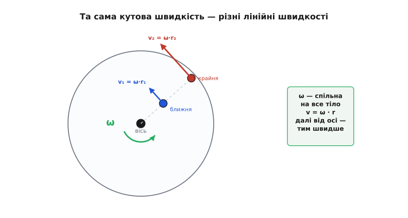
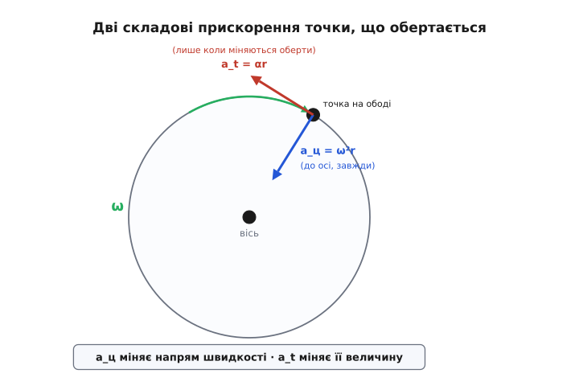
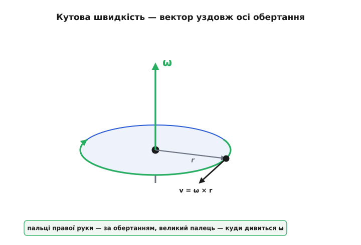

# Кутова швидкість і прискорення

<preknowlist>
- [Похідна](root:math-analysis/derivative) — миттєва швидкість зміни величини; кутова швидкість і є похідна кута за часом.
- [Швидкість](root:ph-mechanics/velocity) — лінійна швидкість руху точки, «обертальний» відповідник якої ми й будуємо.
- [Прискорення](root:ph-mechanics/acceleration) — як швидко змінюється швидкість; кутове прискорення — те саме, але для повороту.
</preknowlist>

Посадіть двох дітей на карусель — одну біля самої осі, другу скраю. Карусель робить оберт, і за той самий час обидві проходять повне коло: щодо того, «як швидко все крутиться», вони цілком згодні. Але спитайте, як швидко кожна з них **летить**, — і відповіді розійдуться в рази. Крайню притискає до бильця так, що доводиться триматися; ближню біля осі ледь помітно веде. Один і той самий рух дає дві геть різні «швидкості».

Отут і ховається пастка, через яку обертання плутають частіше за будь-який інший рух: у нього є **дві** швидкості, і вони живуть окремо. Є те, у чому всі точки тіла згодні, — наскільки швидко повертається кут. І є те, що в кожної точки своє, — наскільки швидко вона несеться простором. Щоб їх не змішувати, для першого завели окрему величину — **кутову швидкість**.

### Одне число на все тіло

Що в обох дітей однакове — це **кут**. Проведіть подумки промінь від осі до кожної дитини. Поки карусель обертається, обидва промені повертаються на той самий кут за той самий час — інакше діти роз'їхались би одна від одної, а вони сидять непорушно на своїх місцях. Тверде тіло тим і тверде, що всі його точки повертаються навколо осі **синхронно**. Тож розумно міряти обертання не рухом якоїсь однієї точки (їх безліч, і в кожної він свій), а швидкістю, з якою наростає **спільний** кут.

Цю швидкість наростання кута й називають кутовою швидкістю; позначають її грецькою літерою ω («омега»). Якщо за короткий проміжок часу Δt кут виріс на Δθ, то

```
ω = Δθ / Δt
```

а якщо стежити за нею щомиті — це [похідна](root:math-analysis/derivative) кута за часом, ω = dθ/dt. Уся принада в тому, що на все тверде тіло вистачає **одного** числа ω. Точок мільйони, у кожної свій шлях, а обертання описує одна величина.

Лишається домовитися, у чому міряти кут. Тут природний вибір — не градуси, а **радіани** (від лат. *radius* — «промінь, спиця колеса»). Радіан визначають гранично просто: це кут, під яким видно **дугу завдовжки в один радіус**. Обвели точку по колу на відстань, що дорівнює радіусу, — ось вам один радіан, приблизно 57.3°. Повне коло має довжину 2πr, тобто вкладає 2π ≈ 6.28 радіуса, тому повний оберт — це рівно 2π радіанів.


*Обидві точки повертаються на однаковий кут за однаковий час — кутова швидкість ω у них спільна. Але лінійна швидкість дорівнює ωr, тому крайня точка (більший r) летить настільки ж швидше, наскільки далі вона від осі.*

Чому саме радіан «природний», видно з наступного кроку — щойно ми зв'яжемо кутову швидкість зі звичайною, лінійною. У радіанах ця зв'язка виходить чистою, без жодних перевідних множників; у градусах довелося б усюди тягати π/180. Довша розповідь про те, звідки взялися і градуси, і радіан і чому одиниця кута — окрема історія, — [у сторінці про народження кутової міри](root:ph-mechanics/angular-velocity/hist-radian.md).

### Від кутової швидкості до лінійної: множимо на радіус

Повернемось до двох дітей. Чому крайню несе швидше? Візьмімо точку на відстані r від осі. Коли кут повернувся на θ (у радіанах), ця точка пройшла по колу дугу довжиною

```
s = r · θ
```

Це і є вся суть радіана: довжина дуги — просто радіус, помножений на кут. Тепер поділімо на час. Швидкість зміни дуги — це лінійна швидкість точки v; швидкість зміни кута — це ω. Оскільки r стале (точка не наближається до осі), маємо

```
v = ω · r
```

Ось і розгадка каруселі. Кутова швидкість ω у всіх точок одна, а лінійна швидкість v = ωr **зростає прямо пропорційно відстані до осі**. Дитина вдвічі далі від центра летить удвічі швидше. Точка на самій осі (r = 0) стоїть на місці, хоча тіло навколо неї крутиться щодуху.

> 🔧 **Навіщо це.** Паспорт двигуна чи диска майже завжди подає швидкість в обертах за хвилину (об/хв, англ. *RPM*), а всі формули механіки хочуть радіани за секунду. Переплутати їх — класична помилка в розрахунках приводу й регуляторів: 3000 об/хв і 3000 рад/с різняться більш ніж у 300 разів. Перевід один: ω[рад/с] = об/хв · 2π / 60. Тримайте це в голові, коли бачите в даташиті RPM, а у формулі — ω.

**Кутова шліфмашина: чи справді диск такий небезпечний.** Диск діаметром 125 мм, паспортні 11000 об/хв. Порахуймо швидкість краю.

```
ω = 11000 · 2π / 60 = 11000 · 6.2832 / 60 ≈ 1152 рад/с
r = 0.125 / 2 = 0.0625 м
v = ω · r = 1152 · 0.0625 ≈ 72 м/с ≈ 259 км/год
```

Край диска, який ви тримаєте за 30 см від обличчя, рухається зі швидкістю потяга. Це не перебільшення виробника про засоби захисту — це проста арифметика ωr.

### Кутове прискорення: коли обертання розганяється

Досі оберти були сталі. Але карусель треба ще розкрутити, а диск — зупинити. Швидкість зміни **самої** кутової швидкості називають кутовим прискоренням; позначають грецькою α («альфа»):

```
α = Δω / Δt   (миттєво:  α = dω/dt)
```

Це точний обертальний двійник звичайного [прискорення](root:ph-mechanics/acceleration): те каже, як швидко наростає лінійна швидкість, це — як швидко наростає кутова. Одиниця — радіан за секунду в квадраті (рад/с²).

**Гвинт дрона на газі.** Мотор розкручує гвинт від нуля до 6000 об/хв за 0.2 с.

```
ω_кінц = 6000 · 2π / 60 = 628 рад/с
α = Δω / Δt = 628 / 0.2 ≈ 3140 рад/с²
```

Понад три тисячі радіанів за секунду в квадраті — саме тому гвинт «підскакує» до робочих обертів практично миттєво.

Тут стається щось не зовсім очевидне. У точки на тілі, що обертається, лінійне прискорення має **дві незалежні складові**, і викликають їх різні причини.

Перша — **дотична** (тангенційна): поки тіло розганяється, лінійна швидкість точки v = ωr росте, а росте вона з прискоренням a_t = αr, напрямленим уздовж руху. Ця складова зникає, щойно оберти стають сталими.

Друга — **доосьова** (центрострімка), і вона куди підступніша, бо не зникає **ніколи**, поки тіло крутиться. Навіть за абсолютно сталої ω точка на колі весь час **змінює напрям** швидкості, а зміна напряму — це теж прискорення. Воно спрямоване до осі й дорівнює

```
a_ц = ω² · r = v² / r
```

Те, що навіть рівномірне обертання — це рух із прискоренням, спантеличує, аж поки не згадаєш: прискорення означає зміну швидкості як **вектора**, а вектор змінюється і тоді, коли крутиться, зберігаючи довжину. Докладніше, чому саме ω²r і куди воно напрямлене, — у [центрострімкому прискоренні](root:ph-mechanics/centripetal-acceleration).


*Точка на ободі має доосьове прискорення a_ц = ω²r (до центра, є завжди, поки тіло крутиться) і дотичне a_t = αr (уздовж руху, лише коли оберти міняються). Перше відповідає за зміну напряму швидкості, друге — за зміну її величини.*

> 🔧 **Навіщо це.** Саме доосьове прискорення розриває швидкісні деталі. Повернімось до того шліфувального диска: ω²r = 1152² · 0.0625 ≈ 8.3·10⁴ м/с², тобто понад **8000 g**. Кожен грам матеріалу на краю намагається відірватися з силою у вісім тисяч разів більшою за свою вагу. Ось чому в диска є жорсткий ліміт обертів, а не «чим швидше, тим краще»: перевищите — і його розірве відцентровим навантаженням. Ліміт масштабується як ω², тож невеликий перебір обертів дає непропорційно великий стрибок навантаження.

### Що взагалі змінює кутову швидкість

Кутова швидкість сама собою не міняється — її треба розганяти чи гальмувати. У прямолінійному русі швидкість міняє сила через закон F = ma. В обертанні є точний двійник цього закону:

```
τ = I · α
```

Тут τ — [момент сили](root:ph-mechanics/torque) (те, що «крутить»: сила, помножена на плече), а I — [момент інерції](root:ph-mechanics/moment-of-inertia) тіла, тобто його «небажання» розкручуватися. Момент інерції для обертання — це те саме, що маса для прямого руху: що він більший, то менше кутове прискорення дасть той самий момент. Важкий маховик і легкий пропелер під однаковим моментом набирають оберти геть по-різному, бо різняться моментом інерції; і залежить він не лише від маси, а й від того, як далеко ця маса рознесена від осі (згадайте ту саму відстань r, тільки тепер вона входить у квадраті).

Тут ми не заглиблюємось у динаміку — важливо лише побачити ланцюжок: **момент розганяє кутову швидкість, а момент інерції цьому опирається**, точнісінько як сила й маса в прямому русі.

### У кутової швидкості є вісь

Досі ми поводилися з ω як зі звичайним числом. Але оберт має ще одну властивість, яку число не передає: **навколо чого** він відбувається. Дзиґа й колесо машини крутяться навколо різних осей, і сказати «300 рад/с» замало — треба ще й указати вісь.

Тому повну кутову швидкість беруть **вектором**. Його довжина — це знайоме ω (як швидко), а напрям **уздовж осі обертання** (навколо чого). Лишається питання: вісь має два боки — куди саме показувати? Домовились за **правилом правої руки**: зігніть пальці правої руки за напрямом обертання — відставлений великий палець укаже, куди дивиться вектор ω.


*Обертання диска описує вектор ω уздовж осі: довжина — це швидкість обертання, напрям задає правило правої руки. Швидкість будь-якої точки тіла тоді виходить як векторний добуток v = ω × r.*

Це не формальна забаганка. Щойно ω стала вектором, лінійна швидкість будь-якої точки виходить одним акуратним виразом — [векторним добутком](root:math-algebra/cross-product) вектора ω на радіус-вектор r точки від осі:

```
v = ω × r
```

Ця формула вміщує все відразу: і що v перпендикулярна і до осі, і до радіуса; і що за величиною v = ωr; і що напрям руху задає та сама правиця. Скалярне ωr — лише її окремий випадок для відстані до осі. Чому кутову швидкість узагалі можна складати як вектори (хоча самі повороти так складати не можна) і як із цього виводиться v = ω × r — [окрема математична сторінка](root:ph-mechanics/angular-velocity/math-omega-cross-r.md).

### Як її вимірюють

Кутову швидкість не конче обчислювати — її можна виміряти напряму. Прилад, що робить це, — [гіроскоп](root:hw-sensing/gyroscope); у телефоні й у польотному контролері дрона він мікроскопічний і видає саме ω, три числа на три осі, у радіанах за секунду. Працює він, до речі, на близькому родичі центрострімкого ефекту — [силі Коріоліса](root:ph-mechanics/coriolis-effect), що виникає в тілі всередині приладу, коли те тіло рухають у системі, яка обертається.

Є і зворотний шлях: поставити на вал [енкодер](root:hw-sensing/optical-incremental-encoder), що міряє **кут** повороту, а кутову швидкість дістати, поділивши приріст кута на час, — та сама Δθ/Δt, тільки в залізі й програмі.

А маючи ω, можна пройти ланцюжком назад: кут — це накопичена кутова швидкість, θ = ∫ω dt. Проінтегрував покази гіроскопа — дізнався, на скільки тіло повернулося, не бачачи жодних зовнішніх орієнтирів. На цьому тримається орієнтація дронів, телефонів і ракет.

> 🔧 **Навіщо це.** Але просто інтегрувати гіроскоп вічно не вийде: у покази завжди підмішана крихітна стала похибка, і на інтегралі вона накопичується — кут «попливе» на градуси за хвилини. Тому ω з гіроскопа зшивають із незалежним джерелом — [акселерометром](root:hw-sensing/accelerometer), що бачить, де низ. Як саме інтегрувати покази й гасити дрейф простим фільтром — [розбір з робочим кодом](root:ph-mechanics/angular-velocity/proj-gyro-to-angle.md).

### Куди це складається

Обертання здається складним лише доти, доки міряти його рухом окремих точок: їх безліч, і кожна летить по-своєму. Уся стаття зводиться до одного зсуву погляду — міряти не точки, а **кут**. Тоді все обертання твердого тіла тримається на одному числі ω (а точніше — векторі вздовж осі), і від нього кількома множеннями дістаються всі решта величин: помножили на радіус — маємо лінійну швидкість точки, піднесли до квадрата й помножили на радіус — доосьове прискорення, узяли похідну за часом — кутове прискорення, узяли інтеграл — кут повороту. Одна величина організовує весь оберт, а радіус лише розподіляє її по точках тіла.
