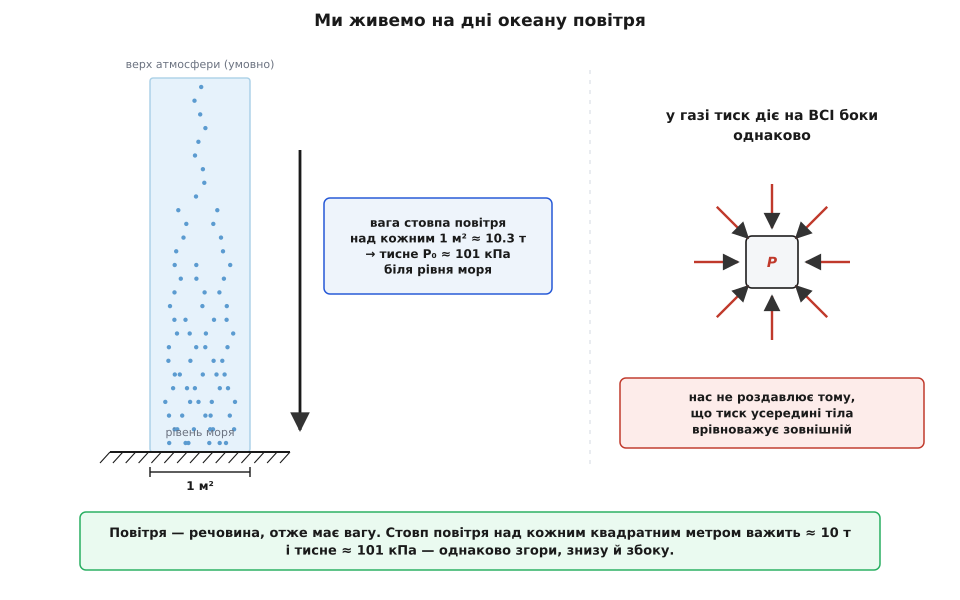
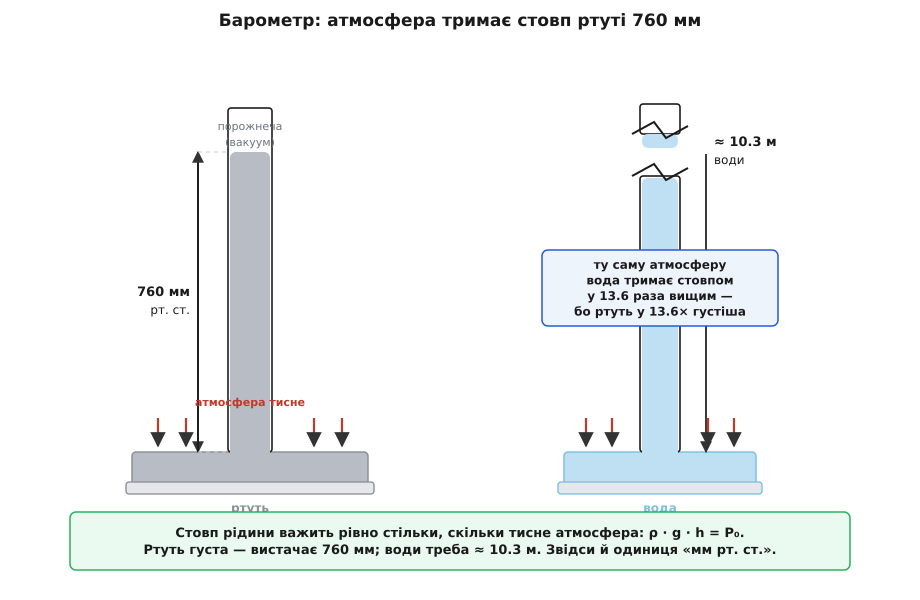
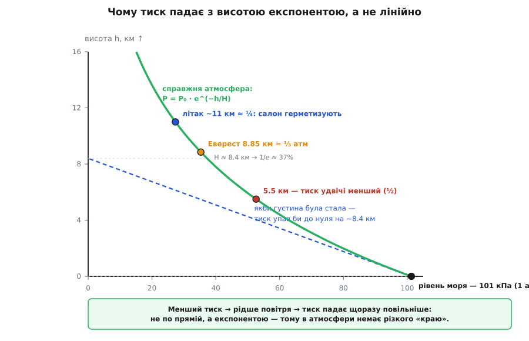

# Атмосферний тиск

<preknowlist>
- [Сила](topic:ph-mechanics/force) — що штовхає чи тягне тіло; і вага, і тиск за своєю природою — сили (вага = m·g).
- [Густина](topic:ph-mechanics/density) — скільки маси вміщає одиниця об'єму (ρ = m/V); від неї залежить, скільки важить стовп повітря чи рідини.
- [Вільне падіння](topic:ph-mechanics/free-fall) — біля Землі кожне тіло має вагу m·g, де g ≈ 9.8 м/с²; повітря — не виняток.
- [Рівняння стану ідеального газу](topic:ph-thermodynamics/ideal-gas-law) — повітря стисливе: менший тиск означає меншу густину; зв'язок тиску, об'єму й температури.
</preknowlist>

Просто зараз на кожен квадратний сантиметр вашої шкіри повітря тисне з силою близько кілограма, а на все тіло — близько двадцяти тонн. І ви цього геть не помічаєте. Це перше, що дивує в атмосферному тиску: він величезний, а ми в ньому живемо, наче риба у воді, не відчуваючи його ваги. Та варто цей тиск прибрати — і наслідки миттєві й грубі. Викачайте повітря з бляшанки — і вона зімнеться, ніби її стисла невидима рука. Затягуючи напій крізь соломинку, ви насправді не «тягнете» рідину вгору, а лише прибираєте тиск у роті — і атмосфера сама заштовхує напій усередину. За всіма цими явищами стоїть одне: **повітря має вагу й тисне**.

Розберімо, звідки цей тиск береться, чому він саме такий за величиною, чому діє на всі боки однаково й чому слабшає — та так хитромудро слабшає — коли підніматися вгору.

## Ми живемо на дні океану повітря

Найперша й найважливіша думка: повітря — це речовина. Воно складається з молекул, молекули мають масу, а маса біля Землі має [вагу](topic:ph-mechanics/free-fall). Ми звикли вважати повітря «нічим», бо воно прозоре й слухняно розступається перед рукою. Але кубометр повітря біля поверхні важить близько 1.2 кг — не так і мало. А над кожним клаптиком землі стоїть не один кубометр, а цілий стовп повітря заввишки в десятки кілометрів. Уся ця товща давить донизу просто власною вагою.

Саме так побачив це Еванджеліста Торрічеллі, учень Галілея, який 1643 року першим виміряв атмосферний тиск. У листі наступного, 1644 року, він сказав про це чи не найточніше: «ми живемо занурені на дні океану повітря». [Історія цього відкриття](topic:ph-mechanics/atmospheric-pressure/hist-barometer.md) — з барометром, суперечками про порожнечу й магдебурзькими півкулями — варта окремої розповіді. Ця повітряна оболонка — атмосфера (гр. *atmós* — випар, *sphaîra* — куля) — тисне на своє дно власною вагою, достоту як океан води: що глибше, то дужче, а ми живемо на самому його дні.

Порахуймо цю вагу — вона вражає.

**Скільки важить стовп повітря над одним квадратним метром.** Атмосферний тиск біля моря — 101 325 Па, тобто на кожен квадратний метр припадає сила 101 325 Н. Якій масі відповідає така вага?

```
P₀ = 101 325 Па = 101 325 Н/м²
сила на 1 м²:   F = P₀ · A = 101 325 Н
маса стовпа:    m = F / g = 101 325 / 9.81
              ≈ 10 330 кг  ≈  10.3 т
```

**Висновок.** Над кожним квадратним метром висить понад десять тонн повітря — стільки ж, скільки важить невелика вантажівка. Над однією долонею (≈ 100 см²) — близько сотні кілограмів. Ми не відчуваємо цієї маси лише тому, що тиск урівноважений: він давить на нас звідусіль і зсередини тіла рівно так само, як зовні.



*Атмосферний тиск — це просто вага стовпа повітря над одиницею площі. Біля моря стовп над кожним м² важить ≈ 10 т і тисне ≈ 101 кПа однаково згори, знизу й збоку.*

## Що таке тиск і чому він діє на всі боки

Тепер точніше про саме поняття. **Тиск — це сила, поділена на площу, на яку вона діє:**

```
P = F / A          [Па = Н/м²]
```

Одиницю названо на честь Блеза Паскаля: один паскаль (Па) — це один ньютон на квадратний метр. Величина крихітна: аркуш паперу, що лежить на столі, тисне на нього приблизно так само. Тому атмосферу зручніше міряти сотнями й тисячами паскалів.

Чому взагалі важлива площа, а не сама лише сила? Бо та сама сила дає геть різний тиск залежно від того, на яку поверхню спирається. Людина в черевиках на пласкій підошві й та сама людина на тонких підборах тиснуть на підлогу з однаковою вагою — але під підбором площа в десятки разів менша, тому тиск у десятки разів більший, і саме підбор лишає вм'ятину в паркеті. Гострий ніж ріже не тому, що ви тиснете сильніше за тупий, а тому, що вся сила збирається на мізерній площі леза. Тиск — це «сконцентрованість» сили по площі.

А тепер головна особливість тиску в рідині чи газі: він діє **на всі боки однаково**. Занурена на глибині пластинка відчуває однаковий тиск, хоч як її поверни — знизу, згори, боком. Це не самоочевидно: вага ж тягне тільки вниз, звідки ж тиск угору й убік? Відповідь — у молекулярній природі газу. Тиск створюють незліченні удари молекул, які [в газі](topic:ph-thermodynamics/ideal-gas-law) літають навсібіч із величезними швидкостями. Будь-яка поверхня — хоч куди її постав — ловить однаковий град ударів за секунду, тому й тиск на неї однаковий незалежно від орієнтації. Таку однаковість у всіх напрямках називають ізотропністю (гр. *ísos* — рівний, *trópos* — напрям).

Саме ця ізотропність пояснює фокус зі склянкою води, накритою карткою й перевернутою догори дном: картка не падає, бо атмосфера тисне на неї **знизу вгору** — сильніше, ніж вага води тягне картку донизу. І вона ж відповідає на давнє запитання, чому ж нас не роздавлює десять тонн: тиск усередині нашого тіла — у крові, у легенях, у кожній клітині — теж дорівнює атмосферному, тож він урівноважує зовнішній, і сумарна сила виходить нульова. Небезпечний не сам тиск, а його **різниця**: коли з одного боку поверхні тиск є, а з іншого його прибрали. Тоді й зминається бляшанка з викачаним повітрям, і болить у вусі, коли літак злітає, — барабанна перетинка відчуває перепад між застряглим у вусі тиском і зниженим у салоні, аж поки не «клацне» й не зрівняє.

> 🔧 **Навіщо це.** Мало який параметр середовища вимірюють так само часто, як атмосферний тиск: він потрібен барометрам-давачам у смартфонах і дронах, метеостанціям, висотомірам, вакуумній техніці. І майже завжди на практиці важить не абсолютне значення, а саме різниця тисків — бо саме перепад створює силу, що згинає мембрану давача, тримає воду в піпетці чи всмоктує повітря в циліндр насоса.

## Скільки саме — і як його впіймати барометром

Тиск однієї «стандартної атмосфери» біля рівня моря домовилися рахувати рівно 101 325 Па. Це число носять під різними іменами, і варто впізнавати кожне:

```
1 атм = 101 325 Па
      = 1013.25 гПа   (гектопаскаль — улюблена одиниця метеорології)
      = 1.01325 бар
      = 760 мм рт. ст. (міліметрів ртутного стовпа)
      = 760 торр       (на честь Торрічеллі)
```

Звідки взялися дивні «міліметри ртутного стовпа»? Прямо з першого барометра (гр. *báros* — вага, *métron* — міра). Торрічеллі взяв запаяну з одного кінця скляну трубку, наповнив її ртуттю й перевернув відкритим кінцем у чашку з ртуттю. Ртуть у трубці трохи опустилася — але не вилилася вся, а спинилася на висоті близько 760 мм, лишивши вгорі порожнечу (перший рукотворний вакуум, «торрічеллієву порожнечу»). Що ж тримає той стовп? Атмосфера: вона тисне на відкриту ртуть у чашці й заганяє її в трубку рівно доти, доки вага піднятого стовпа не зрівноважить цей тиск. Барометр — це терези, де тиск повітря зважують стовпом рідини.

Чому саме ртуть, а не вода? Порахуймо висоту обох стовпів. Вага стовпа рідини заввишки h з [густиною](topic:ph-mechanics/density) ρ дає тиск ρ·g·h; прирівнявши його до атмосферного, дістанемо потрібну висоту h = P₀ / (ρ·g).

**Висота ртутного й водяного барометрів.**

```
ртуть,  ρ = 13 600 кг/м³:
  h = 101 325 / (13 600 · 9.81) = 101 325 / 133 400 ≈ 0.760 м = 760 мм

вода,   ρ = 1 000 кг/м³:
  h = 101 325 / (1 000 · 9.81) = 101 325 / 9 810   ≈ 10.33 м
```

**Висновок.** Ртуть у 13.6 раза густіша за воду, тож її вистачає всього 76 см — зручна настільна трубка. Водяний барометр працював би теж, але потребував би стовпа понад десять метрів заввишки — вищого за триповерховий будинок. Ці ж десять метрів — відповідь на стару загадку, чому звичайний всмоктувальний насос нізащо не підніме воду з колодязя, глибшого за ≈ 10 м: насос лише прибирає тиск угорі труби, а штовхає воду атмосфера, і вище десяти метрів їй води вже не підняти, хоч трісни.



*Атмосфера зважує себе стовпом рідини: ρ·g·h = P₀. Ртуть густа — вистачає 760 мм; води треба ≈ 10.3 м. Звідси й одиниця «міліметр ртутного стовпа».*

## Чому тиск падає з висотою — і саме експонентою

Якщо атмосферний тиск — це вага повітря над головою, то, піднімаючись, ми лишаємо частину цього повітря під собою, і тиск має спадати. Так і є. Але спадає він не абияк, а за дуже характерним законом, і зрозуміти цей закон — означає зрозуміти будову всієї атмосфери.

Почнімо з простого правила, спільного для будь-якої рідини й газу. Візьмімо тонкий горизонтальний шар повітря на якійсь висоті. Він у рівновазі, отже тиск знизу мусить перевищувати тиск згори рівно настільки, щоб утримати вагу самого шару. Це і є **гідростатична рівновага**: піднявшись на висоту Δh, тиск меншає на вагу стовпчика заввишки Δh над одиницею площі:

```
ΔP = − ρ · g · Δh
```

Для рідини, як-от вода в озері, густина ρ майже не залежить від глибини, і тиск росте **лінійно** — на кожні 10 м углиб додається приблизно одна атмосфера. Якби повітря було таке саме нестисливе, атмосфера мала б різкий край: тиск спадав би рівномірно й на висоті ≈ 8.4 км обірвався б до нуля, а вище був би чистий вакуум.

Але повітря — **не** вода. Воно стисливе: там, де тиск менший, повітря розріджене, його густина ρ менша — а отже, кожен наступний кілометр угору відбирає вже менше тиску, ніж попередній. Тиск сам сповільнює власне спадання. Величина, що меншає пропорційно до самої себе, спадає не по прямій, а **експонентою**:

```
P(h) = P₀ · e^(−h / H)
```

де H — так звана масштабна висота, для земного повітря ≈ 8.4 км. На кожній масштабній висоті тиск меншає в e ≈ 2.72 раза; грубше правило — тиск падає приблизно вдвічі на кожні 5–6 км угору. Саме тому в атмосфери немає різкого «краю»: вона просто дедалі непомітніше сходить нанівець. Звідки береться ця формула й від чого точно залежить H — у [виведенні барометричної формули](topic:ph-mechanics/atmospheric-pressure/math-barometric-formula.md).



*Менший тиск → рідше повітря → тиск падає щоразу повільніше. Через це атмосфера тягнеться високо вгору, замість обірватися на певній висоті.*

**Тиск на вершині Евересту.**

```
H = 8.4 км,  h = 8.85 км (вершина)
P = P₀ · e^(−h/H) = 101 · e^(−8.85/8.4)
  = 101 · e^(−1.05)
  = 101 · 0.349
  ≈ 35 кПа        (виміряно ≈ 34 кПа)
```

**Висновок.** На вершині Евересту тиск — лише близько третини від рівня моря. Молекул кисню в кожному вдиху втричі менше, і саме тому вершину звуть «зоною смерті»: тіло не встигає забирати кисень, і без балонів людина там гине за годину. Ту саму експоненту відчуває кожен пасажир літака: на крейсерських ≈ 11 км тиск падає до чверті атмосферного, тому салон доводиться герметизувати й накачувати повітрям, інакше дихати було б нічим.

> 🔧 **Навіщо це.** Оте передбачуване спадання тиску з висотою — основа висотоміра: дрон, літак чи навіть смартфон визначають висоту, вимірявши тиск і перевівши його в метри за барометричною формулою. Воно ж пояснює, чому в горах вода кипить холоднішою (менший тиск — нижча точка кипіння, тому яйце там вариться довше), чому болять вуха на зльоті й чому альпіністам конче треба акліматизуватися, перш ніж іти на висоту.

Перше пряме підтвердження, що тиск справді меншає з висотою, дав 1648 року Блез Паскаль. За його задумом швагер Флорен Пер'є заніс барометр на гору Пюї-де-Дом (≈ 1465 м) і побачив, що ртутний стовп там помітно нижчий, ніж біля підніжжя, — на кілька сантиметрів. Це був чистий доказ: угорі повітря над головою менше, тож і тисне воно слабше.

## Тиск не стоїть на місці: погода й стандарт

Число 101 325 Па — не константа природи, а лише зручна домовленість про «типовий» тиск біля моря. Насправді він постійно гуляє. Повітря нерівномірно нагрівається, десь піднімається вгору, десь опускається — і над одними ділянками його стовп важчий (області високого тиску, антициклони), над іншими легший (низького тиску, циклони). Ці коливання невеликі, зазвичай у межах кількох відсотків, але саме вони роблять погоду. Тому й кажуть «барометр падає» перед негодою: зниження тиску означає, що насувається область, де тепле вологе повітря піднімається — а це хмари, вітер і дощ. Стрілка старих барометрів недарма мала підписи «ясно» й «буря».

Щоб серед цієї мінливості було від чого відштовхуватись, домовились про еталон — [стандартну атмосферу ISA](topic:ph-thermodynamics/standard-atmosphere): 101 325 Па й 15 °C на рівні моря, із наперед заданим спаданням тиску й температури вгору. Саме до неї прив'язують авіаційні висотоміри: висотомір — це насправді барометр, що перераховує виміряний тиск у висоту за цією стандартною кривою, як докладно розібрано в [барометрі-альтиметрі](root:embedded/barometric-altimeter). Через це два літаки, налаштовані на однаковий тиск, тримають однакову «барометричну» висоту, навіть якщо справжня трохи різниться, — і не стикаються.

Насамкінець варто відрізняти цей тиск від його рухомого родича. Усе, про що йшлося, — тиск нерухомого повітря, що виникає з його ваги; його звуть статичним. Коли ж повітря рухається (вітер, потік повз крило), воно додає ще й [динамічний тиск](topic:ph-mechanics/dynamic-pressure) — від напору струменя. Атмосферний тиск — це статична основа, той рівень, на тлі якого граються всі вітри, крила й погода. Він тримає воду в трубочці, розчавлює порожню бляшанку, кип'ятить воду в горах за нижчої температури й щомиті непомітно обіймає нас із усіх боків десятьма тоннами на квадратний метр — просто тому, що над нами стоїть глибокий океан повітря.
